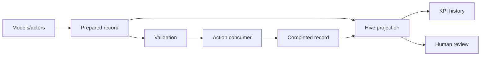

# Mandatory hive decision, forecasting and capability evidence contract

#fractal-l0 #fractal-l2 #fractal-l3 #fractal-l4 #zk-adr #zero-muda #tailscale-web

**Contract:** SC-HIVE-DECISION-001 / SC-HIVE-FORECAST-001 / SC-HIVE-KPI-001  
**Authority:** explicit operator instructions on 2026-09-07. **Status:** mandatory requirement; implementation and operational admission tracked separately.  
**Clock:** host observed 2026-09-07T08:05:11Z; chrony observed normal leap, stratum 3 and 0.000214840 s system offset.  
**Navigation:** [Cockpit](http://nas-1.tail55d152.ts.net:4100/) · [Planning](http://nas-1.tail55d152.ts.net:4100/planning) · [Wiki](http://nas-1.tail55d152.ts.net:4100/wiki) · [ZK](http://nas-1.tail55d152.ts.net:4100/zk) · [Source](http://nas-1.tail55d152.ts.net:4100/files/contracts/rules/20260907-0811-hive-decision-forecast-kpi-mandate.md)

## Mandatory scope and meaning

Every participating model, agent, deterministic actor, holon and supervisor MUST
produce bounded, reviewable decision and process records for its operational
decisions. This applies recursively from a task attempt to a holon, service,
programme and hive. Parent summaries link to child evidence; a parent cannot
upgrade the weakest child's evidence or erase dissent.

The shared information belongs to the authorized hive and tenant. Individual
models retain their private information and internals. Records contain public
decision summaries and explicitly shared operating-state descriptions; private
chain-of-thought, raw prompts, secrets, hidden activations and unrelated personal
data are neither required nor collected. A model self-report is labelled as such.

## Required record and lifecycle

The versioned carrier is `uos-decision-record/v1`. A prepared record MUST contain:

| Group | Required information |
|---|---|
| Identity and scope | Decision ID, hive, tenant, actor kind and identity, concrete session generation, provider/model metadata or explicit unavailable reason |
| Task and authority binding | Task/attempt, goal, candidate revision, resource, lease epoch, proposed action, applicable policy and authorization references |
| Evidence and choice | Observations and source references, freshness, constraints, alternatives and tradeoffs, selected option and concise rationale, risks and unresolved uncertainty |
| Process | Ordered intended steps, dependencies, verification criteria, rollback or justified inapplicability, escalation triggers |
| Shared operating state | Current goals/subgoals, evidence-backed hypotheses or beliefs, open questions, active task/attention, constraints, resources, budget and intended next actions |
| Forecast | Horizon, clock domain, observation time and expiry, predicted outcome and alternatives, assumptions, confidence basis, probability or explicit unknown, duration/cost/resource estimates, failure signals and update triggers |

A completed record links to its prepared record and records observed actions,
outcome, evidence, consumed resources/tokens/cost, errors, revised assumptions and
calibration references. Corrections and replans append new linked records. They
MUST NOT rewrite an earlier forecast after observing its result.

Explicit `Unknown(reason)` and justified `NotApplicable(reason)` distinguish
missing evidence from measured zero. A deterministic actor cites its rule,
input-state reference, evaluated conditions and output transition. Full repeated
context is replaced by immutable, authorized references.

Before a dispatch or effect, the consumer MUST validate record completeness and
bind it to the actual actor/session/task/candidate/resource/epoch/action. Missing,
stale or mismatched records refuse execution. A validated narrative does not
replace current policy, workload identity, a lease, budget reservation or an
independent execution receipt. Historic messages remain readable as legacy
observations and cannot satisfy a new action gate merely because they exist.

## Forecasting and shared-state laws

Forecasts are advisory. They can rank authorized work and identify questions;
they cannot mint approval, admission, resource leases or spending authority.

1. Every statement distinguishes measured runtime data, model self-report,
   deterministic rule state and inference.
2. Confidence is `Measured > Estimated > Unknown`; aggregation uses the meet.
   Provenance must support the grade. Self-reported confidence is not a calibrated
   probability.
3. Sequential work costs add after deduplicating task/attempt IDs. Parallel wall
   time requires an explicit dependency/scheduling model; otherwise it is unknown.
4. Boot-relative times are compared only within the same observed host/boot
   domain. Cross-host freshness requires synchronized UTC and a stated uncertainty
   bound. An unknown clock domain cannot become a fresh observation.
5. Predictions preserve their input/source/model versions, assumptions, horizon,
   expiry and denominator. Changed fingerprints invalidate measured reuse.
6. Shared-state projections partition by exact hive and tenant, expose stale,
   missing, superseded and conflicting contributions, and retain provenance.
7. Unknown forecasts may accompany an otherwise valid decision. Requiring the
   envelope is a process gate; requiring an optimistic prediction is prohibited.

## Maintained KPI registry

Each metric MUST have a stable ID/version, owner, definition, numerator,
denominator or sample set, unit, source/evidence references, observation window,
candidate scope, freshness, missing-data count and confidence grade. Samples and
corrections are appended; projections can be regenerated deterministically.
A zero denominator is unavailable, not perfect performance.

| Metric family | Definition and evidence boundary |
|---|---|
| Verified task intelligence | Accepted distinct task outcomes / eligible completed tasks, broken down by task class and difficulty; retain failed attempts and rework |
| Capability coverage | Fresh two-key verified/admitted capabilities / defined capabilities; declarations and model-only proofs reported separately |
| Cost efficiency | Total attributable attempt cost / accepted outcomes; unknown provider or subscription opportunity cost remains unknown |
| Forecast calibration | Brier score for resolved, precommitted binary predictions; duration and cost errors against observed outcomes; sample count and source fingerprint required |
| Coordination | Observed delivery/recipient-ACK latency, pending work, stale sessions, lease contention and unauthorized-action refusals |
| Decision transparency | Valid decision/process/state/forecast envelopes / observed decisions; report uncovered adapters explicitly |
| Shared-state quality | Fresh contribution coverage, provenance completeness, duplicate counts, contradictions and resource/action conflicts |
| Self-monitoring | Error detection and correction against labelled incidents or injected controls; precision/recall require ground truth |
| Adaptation | Verified improvement after a recorded replan or correction compared with its declared baseline and evaluation set |
| Operational dependability | SLO outcomes, recovery/rollback results and exact deployed candidate; network success alone is insufficient |

**Functional awareness maturity** is an evidence-based engineering scale:
L0 = insufficient evidence; L1 = shared state; L2 = observed self-monitoring;
L3 = calibrated prediction; L4 = independently verified adaptive correction.
Each level requires the lower levels and current evidence. This measures the
implemented coordination functions, not phenomenal consciousness.

**Consciousness assessment** is a separate research record with hypothesis,
theoretical basis, indicator definitions, controls, findings and uncertainty.
Until a justified assessment exists its status is `UNESTABLISHED` and its level
is unavailable. No count of agents, message volume, entropy, model assertion or
functional-awareness score is converted into a claim of conscious experience.
The research literature motivates examining theory-derived indicators; this
contract does not treat those indicators as proof. See
[Butlin et al., Consciousness in Artificial Intelligence](https://arxiv.org/abs/2308.08708).

## Data flow

```text
[Models/actors] -> [Prepared record] -> [Validation] -> [Action consumer] -> [Completed record]
[Prepared record] -> [Hive projection]
[Completed record] -> [Hive projection] -> [KPI history]
[Hive projection] -> [Human review]
```



## UOS reuse and source ingestion

Reuse native Gleam/OTP actor supervision, existing C3I/Indrajaal holons,
Hermes/Sa-plan WAL transactions, signed board transport, graph/knowledge
projections and bounded formal tooling. Preserve language boundaries and tenant
authorization. Model/advisory services remain subordinate to typed authority.

The full ZigVM forecasting/prediction migration inventory includes forecast
algebra, runtime, store, supervisor, projections/KPIs, surface registry, resource
governor, SLOs, Bayesian/calibration adapters, lifecycle hooks and tests. A namesake
forecast fold alone cannot claim full integration. Source modules retain exact
locators, revisions, selected-file digests, dependencies and acceptance mappings.

External trees remain read-only evidence. Admission requires writer quiescence,
sanitized provenance and fresh runtime plus formal verification. Do not import
secrets, live databases, caches or barred dependencies. Reuse UOS equivalents
where they already implement the required behavior, and track remaining source
capabilities individually.

The VM-1 ZigVM DMC/TCM registry has 13 typed dimensions plus law-suite,
mutation-log, design-spec and Sa-plan supporting links. UOS's 17-aspect audit is
a separate axis. Both mappings MUST remain explicit; they are not interchangeable
counts or evidence of completed functionality.

## Enforcement and acceptance

Track each entrypoint as `POLICY_MANDATED`, `WIRED_UNVERIFIED`,
`MECHANIZED_VERIFIED` or `LEGACY_OBSERVATION`. A global mandate does not imply
all heterogeneous CLIs and runtime services are already intercepted.

Required negative controls: missing record, wrong actor/tenant/hive/session,
stale revision/epoch, mismatched action, expired forecast, foreign clock domain,
fabricated zero cost, duplicate deliveries, contradictory forecasts and attempted
forecast-to-authority escalation. Positive controls must execute a legitimate
bounded action through the same consumer and retain its result record.
Model, runtime and cross-language tests bind their exact candidate; dashboards
display the weakest applicable evidence state.

**Related:** [17-aspect system specification](http://nas-1.tail55d152.ts.net:4100/docs/design/20260907-0550-uos-agentic-infrastructure-17-aspect-formal-spec.md) · [Implementation plan](http://nas-1.tail55d152.ts.net:4100/docs/plans/20260907-0653-uos-tri-agent-cheaper-mode-implementation-plan.md)

## Comprehensive verification checklist

Document checks and production gates have different evidence scopes. Checked
items below refer only to this document package. All infrastructure runtime,
formal-proof and sovereign-admission obligations remain **UNRUN**.

<details>
<summary>Domain 1 — Metadata, timestamp and Tailscale navigation</summary>

- [x] **CHK-01-TIME** — Host-clock timestamp prefix and chrony receipt recorded.
- [x] **CHK-02-TAIL** — Full clickable Tailscale FQDN references provided; serving status is reported in the journal.
- [x] **CHK-03-FRACT** — Canonical L0–L9 fractal tags assigned.
- [ ] **CHK-04-KM** — Specification, wiki, ADR, source review and journal cross-linked.

</details>

<details>
<summary>Domain 2 — Zero-Muda purity and storage safety</summary>

- [ ] **CHK-05-MUDA** — Production dependency/exclusion scan required.
- [ ] **CHK-06-GRAPH** — Pure BEAM/Hermes graph boundary must pass runtime checks.
- [ ] **CHK-07-DRIVE** — Denied OS serial `25503L801736` must pass real interlock tests.

</details>

<details>
<summary>Domain 3 — Testing Gold Standard and mathematical gates</summary>

- [ ] **CHK-08-C1C8** — Structure, health badges, data grids, timeline, interactions, dark cockpit, advisory and action interlock.
- [ ] **CHK-09-MATH** — H ≥ 2.50 bits, CCM ≥ 90.0%, D_EA ≤ 10.0%, ITQS ≥ 0.85 require declared metrics and fresh measurements.
- [ ] **CHK-10-9MOD** — Unit, system, TDD, BDD, performance, scalability, property, fuzz and chaos.
- [ ] **CHK-11-REGR** — Relevant UI regression suite and 30-second monitoring require execution.

</details>

<details>
<summary>Domain 4 — Cross-language control and observability</summary>

- [ ] **CHK-12-GLEAM** — Real OTP domain/actor supervision and restart evidence.
- [ ] **CHK-13-HERMES** — Authoritative WAL, bounded formal checks and evidence receipts.
- [ ] **CHK-14-ZIGVM** — Deterministic execution and descriptor-relative VFS evidence.
- [ ] **CHK-15-MAX** — Real inference through the isolated MAX boundary.
- [ ] **CHK-16-OTEL** — UTC microsecond timestamps and nonzero W3C trace/span IDs.

</details>

<details>
<summary>Domain 5 — Sovereign governance and standalone Jujutsu</summary>

- [ ] **CHK-17-SOV** — Tri-sovereign candidate review and authorized admission are outstanding.
- [x] **CHK-18-JJ** — Documentation authored in UOS using its standalone JJ discipline; no native Git mutations in UOS.

</details>

**UOS footer:** Operator mandate recorded; admission is candidate-specific. Previous: system specification. Next: implementation evidence.

