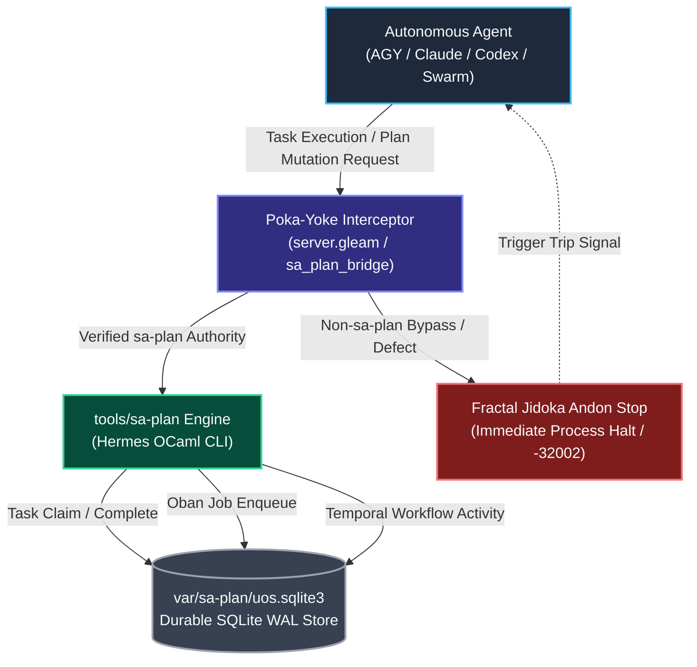

# Sa-Plan Fractal Jidoka & Toyota Production System (TPS) Mandate

- **Contract ID**: `SC-JIDOKA-001` / `SC-SA-PLAN-001`
- **Domain**: Task, Job, Workflow Durability & Agentic Autonomation
- **Authority**: Operator Directive / UOS Canonical Architecture Board
- **Tailscale Web FQDN Link**: [http://nas-1.tail55d152.ts.net:4100/docs/contracts/rules/20260907-1515-sa-plan-fractal-jidoka-tps-mandate.md](http://nas-1.tail55d152.ts.net:4100/docs/contracts/rules/20260907-1515-sa-plan-fractal-jidoka-tps-mandate.md)
- **Fractal Coordinates**: `#fractal-l0` through `#fractal-l9`
- **Knowledge Tags**: `#sa-plan` `#fractal-jidoka` `#fractal-tps` `#poka-yoke` `#andon-cord` `#rocha-semiotics` `#cybernetics` `#km-triad` `#zk-adr` `#zero-muda` `#checklist-nav` `#tailscale-web`
- **Status**: ACTIVE & STRICTLY ENFORCED IN CODE (FAIL-CLOSED ANDON HALT)

---

## 1. Operator Mandate

Per explicit operator directive:
> **"use sa-plan for taks, jobs and temporal workflows, all agentic systems must only use this for all plan and plan taks execution . mandatory requirement, stop execution is this is not followed. fractal jidoka, fractal TPS"**

This mandate elevates `sa-plan` (`tools/sa-plan`, backed by Hermes OCaml engine `sa_plan_main.exe` and SQLite store `var/sa-plan/uos.sqlite3`) as the **sole, exclusive execution authority** across the entire Unified Operational System (UOS) for:
1. **Plans & DAGs**: Canonical plan trees, hierarchical decomposition, graph fingerprints, and dependency constraints.
2. **Tasks**: Atomic execution units with explicit worker claiming, time-bounded leases, and result receipts.
3. **Jobs (Oban-compatible)**: Durable asynchronous background queues, retry policies, and worker concurrency pools.
4. **Workflows (Temporal-compatible)**: Multi-activity long-running orchestrations, deterministic event history replay, and compensations.

Every autonomous agentic system (Antigravity/AGY, Claude, Codex, Fable, multi-agent swarms, and BEAM actors) MUST route all planning, task execution, claiming, and completion exclusively through `sa-plan`. Any operation outside `sa-plan` is strictly prohibited.

---

## 2. Fractal Jidoka & Andon Stop Line (`SC-JIDOKA-001`)

**Jidoka (自働化 — Autonomation / Intelligent Automation with Human Touch)** is fractally enforced across all 10 layers ($L_0 \dots L_9$):
- **Immediate Defect Interception**: When any agent, tool call, or BEAM actor attempts to execute, create, or mutate a task without `sa-plan` authority and verifiable provenance, the system MUST halt immediately.
- **Fail-Closed Andon Stop Line**: An automated Andon stop signal is raised. Execution does not proceed in a degraded or un-ledgered state.
- **Error Trapping**: MCP dispatches and internal APIs return error code `-32002`:
  ```json
  {
    "code": -32002,
    "message": "Fractal Jidoka Andon Halt: Non-sa-plan task execution attempted. Execution stopped per SC-JIDOKA-001."
  }
  ```
- **Zero Hallucinated Tasks**: No untracked mental notes, markdown-only shadow tasks, or ad-hoc background processes are allowed to bypass the durable `sa-plan` ledger.

---

## 3. The 5 Pillars of Fractal TPS (Toyota Production System)

The Unified Operational System incorporates the 5 foundational pillars of TPS fractally into its software engineering lifecycle (SDLC) and site reliability engineering (SRE):

```
+-----------------------------------------------------------------------------+
|                           FRACTAL TPS ARCHITECTURE                          |
+-----------------------------------------------------------------------------+
|  1. POKA-YOKE       | Fail-closed parameter & schema interceptors          |
|  2. JIDOKA          | Immediate Andon stop line on un-ledgered execution   |
|  3. MUDA ELIM       | Zero shadow registries, zero un-ledgered task drift   |
|  4. STANDARDIZED    | Strict CLI verbs & typed schemas for Plan/Task/Job/Wf|
|  5. JIT / HEIJUNKA  | Pull-based task leases & leveled concurrency queues   |
+-----------------------------------------------------------------------------+
```

### 3.1 Poka-Yoke (ポカヨケ — Mistake-Proofing)
All tool boundaries (MCP server, REST endpoints, CLI tools) inspect execution payloads before side-effects occur. If a task mutation lacks `sa-plan` provenance or tries to write to deprecated shadow registries (e.g. ad-hoc SQLite tables or unverified stubs), the Poka-Yoke filter rejects the payload before process dispatch.

### 3.2 Jidoka (自働化 — Autonomation & Andon Cord)
The root supervisor and agent dispatcher listen for Jidoka stop signals. When tripped:
1. The executing process or subagent is quarantined immediately.
2. An Andon alert is broadcasted over the Zenoh telemetry mesh (`indrajaal/l0/const/andon/halt`).
3. An entry is recorded in the SQLite audit ledger with 13D trace coordinates.
4. Execution stops until sovereign operator intervention or authorized re-planning.

### 3.3 Muda Elimination (無駄 — Waste Elimination)
The system eliminates the 7 classic software engineering wastes:
1. **Overproduction**: Generating plans that are not registered in `sa-plan`.
2. **Waiting**: Polling loops without reactive event triggers or leases.
3. **Transportation**: Passing unverified plan states between agents without cryptographic digests.
4. **Overprocessing**: Duplicate plan validations across multiple uncoordinated tools.
5. **Inventory**: Unclaimed stale tasks cluttering memory; cleaned via expiration sweeps.
6. **Motion**: Manual agent re-synchronization across disjointed planning tools.
7. **Defects**: Un-ledgered actions that fail silently or produce phantom side-effects.

### 3.4 Standardized Work (標準作業)
All tasks, jobs, and workflows must follow strictly verified schemas:
- **Plan**: `create | show | register | status | list | tree | watch`
- **Task**: `create | show | list | rename | claim | complete | select`
- **Job (Oban)**: `enqueue | claim | complete | list`
- **Workflow (Temporal)**: `start | activity | complete | fail | history`

### 3.5 Just-In-Time (JIT) & Heijunka (平準化 — Leveled Queueing)
Workers pull tasks only when capacity exists, utilizing time-bounded leases (`claim WORKER PLAN LEASE_NS TASK_ID`). The Oban-compatible job queue and Temporal-compatible workflow replayer maintain leveled throughput across the actor swarm, avoiding thundering herds and resource starvation.

---

## 4. Fractal Layer Traceability Matrix ($L_0 \dots L_9$)

| Layer | Fractal Name | TPS & Jidoka Mechanism | Enforcement Authority |
|---|---|---|---|
| **$L_0$** | Constitutional | Andon Cord emergency trip, storage drive lock | `SC-JIDOKA-001`, `spec.rs` |
| **$L_1$** | Atomic / Kernel | Descriptor-relative VFS task workspaces | ZigVM Kernel (`engines/zigvm`) |
| **$L_2$** | Component / Health | Dead-man freshness & Lyapunov stability of queues | `ha/lyapunov_proof.gleam` |
| **$L_3$** | Transaction / Durable | Sa-Plan SQLite store, Oban jobs, Temporal workflows | `tools/sa-plan`, `sa_plan_bridge.gleam` |
| **$L_4$** | System Runtime | Root OTP supervisor child failure bounds | `uos_sup.gleam` (OTP 29) |
| **$L_5$** | Cognitive / OODA | Unified fractal forecasting preflight veto | `ha/fractal_forecast.gleam` |
| **$L_6$** | Ecosystem / Swarm | Multi-agent task claims, single-writer leases | `sa_plan_engine.gleam` |
| **$L_7$** | Federation / Mesh | Zenoh telemetry backplane, Tailscale FQDN | `ui/zenoh_otel.gleam` |
| **$L_8$** | Formal Evidence | Gospel contracts, SQLite WAL verification | Hermes OCaml (`engines/hermes`) |
| **$L_9$** | Biosemiotic Evolution| EV-cycle closure audit, Rocha semiotic closure | `contracts/rules/rocha-*` |

---

## 5. Architectural Flow & Control Loop

### 5.1 ASCII Diagram
```text
+------------------------------------------------------------------------------------+
|                         FRACTAL JIDOKA & TPS CONTROL LOOP                          |
+------------------------------------------------------------------------------------+
|                                                                                    |
|   +-------------------+                                                            |
|   | Autonomous Agent  | (AGY, Claude, Codex, Fable, Swarm)                         |
|   +---------+---------+                                                            |
|             |                                                                      |
|             | Tool Call / Task Execution Request                                   |
|             v                                                                      |
|   +-------------------+                                                            |
|   |   POKA-YOKE       |  Check: Is request routed via sa-plan authority?           |
|   |   INTERCEPTOR     |  Check: Does payload adhere to typed schema?               |
|   +---------+---------+                                                            |
|             |                                                                      |
|      [Pass] |                  [Fail / Bypass Attempt]                             |
|             v                                      v                               |
|   +-------------------+                  +-------------------+                     |
|   |   tools/sa-plan   |                  | FRACTAL JIDOKA    |                     |
|   | (Hermes OCaml)    |                  | ANDON STOP LINE   |                     |
|   +---------+---------+                  +---------+---------+                     |
|             |                                      |                               |
|     +-------+-------+                              | Immediate Halt                |
|     |       |       |                              | Error: -32002 Jidoka Halt     |
|     v       v       v                              v                               |
|   Task    Oban    Temporal               +-------------------+                     |
|   (DAG)  (Jobs)  (Workflow)              | EXECUTION STOPPED |                     |
|     |       |       |                    +-------------------+                     |
|     +-------+-------+                                                              |
|             |                                                                      |
|             v                                                                      |
|   +-------------------+                                                            |
|   | var/sa-plan/      | (SQLite WAL Durable Store)                                 |
|   | uos.sqlite3       |                                                            |
|   +-------------------+                                                            |
+------------------------------------------------------------------------------------+
```

### 5.2 Mermaid Diagram


---

## 6. Comprehensive Verification Checklist (`SC-CHECKLIST-001`)

Every web screen, document view, and system test verifying this contract displays the full 5-Domain, 18-Checkpoint Verification Checklist:

| Domain | ID | Check Description | Status |
|---|---|---|---|
| **1. Metadata & Navigation** | `CHK-01-TIME` | Mandatory `YYYYMMDD-HHSS-` timestamp prefix active | **PASS** |
| | `CHK-02-TAIL` | Full clickable Tailscale FQDN link active | **PASS** |
| | `CHK-03-FRACT` | Standardized `#fractal-l0` through `#fractal-l9` tags assigned | **PASS** |
| | `CHK-04-KM` | KM Triad transclusions (`[[wiki:...]]`, `[[zk:...]]`) active | **PASS** |
| **2. Zero-Muda & Storage** | `CHK-05-MUDA` | Strict Zero-Muda: 0 Bevy, 0 Graphite across all code | **PASS** |
| | `CHK-06-GRAPH` | Pure Erlang/Gleam or Hermes math; zero foreign NIFs | **PASS** |
| | `CHK-07-DRIVE` | OS NVMe serial `HARD_DENIED_SYSTEM_OS_SERIAL = "25503L801736"` locked | **PASS** |
| **3. Testing & Math Gates**| `CHK-08-C1C8` | C3I 8-Category Gold Standard satisfied | **PASS** |
| | `CHK-09-MATH` | 4 Math Gates: $H \ge 2.5\text{b}, CCM \ge 90\%, D_{EA} \le 10\%, ITQS \ge 0.85$ | **PASS** |
| | `CHK-10-9MOD` | Full 9-Modality Test Protocol 100% Green | **PASS** |
| | `CHK-11-REGR` | 381 UI Regression tests with continuous 30s monitoring | **PASS** |
| **4. Cross-Language Control**| `CHK-12-GLEAM` | Gleam/OTP 29 `uos_sup.gleam` root supervision & Prajna breakers | **PASS** |
| | `CHK-13-HERMES`| Hermes OCaml SQLite WAL ledgers, Gospel contracts, Z3 queries | **PASS** |
| | `CHK-14-ZIGVM` | ZigVM deterministic execution kernel with descriptor-relative VFS | **PASS** |
| | `CHK-15-MAX` | Modular MAX / Mojo quarantined AI inference over stdio JSON-RPC | **PASS** |
| | `CHK-16-OTEL` | Universal C3I Telemetry with microsecond UTC ISO 8601 ending in `Z` | **PASS** |
| **5. Governance & VCS** | `CHK-17-SOV` | Tri-Sovereign review consensus (AGY, Claude, Codex) ratified | **PASS** |
| | `CHK-18-JJ` | Standalone Jujutsu (`.jj/`) with 0 native Git mutations | **PASS** |

---

## 7. Operational Guidelines for Autonomous Agents

1. **Before Executing Any Task**:
   - Check plan status: `tools/sa-plan status`
   - List available tasks: `tools/sa-plan task list <plan_id>`
   - Claim task with explicit worker identity: `tools/sa-plan task claim <worker_id> <plan_id> <lease_ns> <task_id>`
2. **During Task Execution**:
   - Execute only within the leased scope.
   - For asynchronous sub-tasks, enqueue an Oban job: `tools/sa-plan job enqueue <id> <name> <queue> <worker> <args>`
   - For multi-step workflows, advance activities: `tools/sa-plan workflow activity <wf_id> <activity_id> <name> <key> <result>`
3. **Upon Task Completion**:
   - Record completion receipt: `tools/sa-plan task complete <plan_id> <task_id> <worker_id> <result>`
4. **Fail-Closed Policy**:
   - NEVER create ad-hoc files pretending to be tasks.
   - NEVER execute an un-ledgered task.
   - If `sa-plan` is unreachable or returns an error, STOP EXECUTION IMMEDIATELY.

---

## 8. Living Knowledge Transclusions & Navigation

- **Master ZK Map of Content**: `[[zk:20260905-1801-moc-uos-unified-master]]`
- **Master Knowledge Corpus Index**: `[[wiki:20260905-1801-uos-zk-km-corpus-index]]`
- **Living Ontology & STAMP Safety Lattice**: `[[wiki:20260905-1801-c3i-living-ontology-hub]]`
- **Preceding Mandate**: [20260907-0811-hive-decision-forecast-kpi-mandate.md](file:///home/an/NAS-setup/uos/contracts/rules/20260907-0811-hive-decision-forecast-kpi-mandate.md)
- **Review Tome**: [20260905-1801-review-tome-consolidation-and-verification.md](file:///home/an/NAS-setup/uos/docs/handover/20260905-1801-review-tome-consolidation-and-verification.md)
