# SC-JOURNAL-v3 Anticipatory Epistemic Ledger Contract

- **Contract ID**: `SC-JOURNAL-003` (Universal Designation: `SC-JOURNAL-v3`)
- **Domain**: Anticipatory Epistemic Ledger, Post-Task Journaling, 7-Engine Verification, Tri-Sovereign Governance
- **Authority**: Operator Directive / UOS Canonical Policy (`contracts/rules/timestamp-mandate.md`)
- **Tailscale FQDN Link**: [http://nas-1.tail55d152.ts.net:4100/files/contracts/rules/20260912-0745-sc-journal-v3-anticipatory-contract.md](http://nas-1.tail55d152.ts.net:4100/files/contracts/rules/20260912-0745-sc-journal-v3-anticipatory-contract.md)
- **Sa-plan authority**: `uos/sc-journal-v3/20260912-0745` (`SC-JIDOKA-001`, `SC-SA-PLAN-001`)
- **Status**: ACTIVE & RATIFIED — Sovereign Triad Contract

#fractal-l0 #fractal-l1 #fractal-l2 #fractal-l3 #fractal-l4 #fractal-l5 #fractal-l6 #fractal-l7 #zero-muda #km-triad #stamp-stpa #zk-adr

---

## 1. Executive Summary & Epistemic Purpose

Traditional engineering journals function as retrospective logs—reporting what happened after state has already transitioned. Under autonomous multi-agent swarm operations, retrospective logging alone induces three systemic epistemic failure modes:
1. **Hindsight Bias & Rationalization**: Post-hoc justification of architectural shortcuts without precommitted falsification criteria.
2. **Epistemic Drift**: Evidence decay over time where uncalibrated confidence scores degrade without half-life depreciation.
3. **Reactive Blindness**: Inability to anticipate failure dynamics along the state trajectory prior to catastrophic invariant violation.

`SC-JOURNAL-v3` upgrades the canonical 13-section completion journal (`SC-JOURNAL`) into an **Anticipatory Epistemic Ledger**. It preserves the structural integrity of the 13 canonical sections while embedding a **7-Engine Verification Architecture**:
1. **Analysis of Competing Hypotheses (ACH)**: Structured disconfirmation matrix evaluating root cause against mutually exclusive hypotheses.
2. **Admiralty System Protocol (NATO STANAG 2017)**: Strict evaluation of source reliability (A–F) and information credibility (1–6), enforcing an admissibility gate $\ge \text{B2}$.
3. **Bayesian Belief Updating & Half-Life Decay**: Quantitative prior-to-posterior probability calculation with temporal confidence depreciation.
4. **Devil's Advocate & Red Team Falsification**: Mandatory Popperian counter-factual analysis and failure injection probes.
5. **Formal Verification & Gospel/Z3/Lean 4 Gateways**: Bounded mathematical proofs of state machine invariants ($\Delta \vec{\mathcal{T}}_{13} \equiv \mathbf{0}$).
6. **Rete-UL Multi-Aspect Invariant Production Engine**: Cross-sectional rule firing enforcing consistency between scope, RCA, metrics, and conclusions.
7. **Predictive & Forecasting Dynamics**: Precommitted Brier-scored prognostications, Lyapunov stability energy derivatives ($\dot{V}(t) < 0$), and 1D Kalman filter innovation tracking.

---

## 2. Invariants (`INV-JRN`)

- **`INV-JRN-01` (Structural Preservation)**: Every journal MUST contain all 13 canonical sections in exact sequential order:
  1. Scope & Trigger
  2. Pre-State Assessment
  3. Execution Detail
  4. Root Cause Analysis (ACH Augmented)
  5. Fix Taxonomy
  6. Patterns & Anti-Patterns Discovered (Devil's Advocate Augmented)
  7. Verification Matrix (Admiralty $\ge \text{B2}$ Enforced)
  8. Files Modified
  9. Architectural Observations
  10. Remaining Gaps
  11. Metrics Summary (Bayesian & Lyapunov Augmented)
  12. STAMP & Constitutional Alignment
  13. Conclusion (Forecasting & Brier Score Precommitment)
- **`INV-JRN-02` (Admiralty Admissibility Gate)**: Any item in Section 7 (Verification Matrix) claiming passing status MUST possess an Admiralty grade of $\ge \text{B2}$ (`A1`, `A2`, `B1`, or `B2`). Unverified model self-attestations are classified as `E3` or `F6` and are barred from certifying state admission.
- **`INV-JRN-03` (ACH RCA Disconfirmation)**: Section 4 MUST evaluate at least two competing hypotheses ($H_1, H_2$) against diagnostic evidence ($E_1 \dots E_n$) using structured disconfirmation scoring.
- **`INV-JRN-04` (Precommitted Forecasts & Calibration)**: Section 13 MUST record at least one precommitted, testable prognostic forecast with:
  - Exact probability $p \in [0.0, 1.0]$.
  - Explicit falsification criteria $C_{\text{false}}$.
  - Verification timestamp horizon $T_{\text{horizon}}$ (ISO 8601 UTC).
  - Brier scoring rule $B = (p - o)^2$ where $o \in \{0, 1\}$.
- **`INV-JRN-05` (Lyapunov Stability Energy Verification)**: System stability metrics in Section 11 MUST demonstrate a negative energy derivative $\dot{V}(t) < 0$ or prove asymptotic orbital stability ($|\Delta E| \le \epsilon$).
- **`INV-JRN-06` (Dual Diagram Source Rule `SC-DIAGRAM-001`)**: Every diagram embedded in a journal or referenced specification MUST be provided in both ASCII and Mermaid formats describing identical topology.
- **`INV-JRN-07` (Zero-Muda & Storage Interlock Safety)**: 0 Bevy, 0 Graphite, 0 foreign NIFs. The root NVMe hardware serial MUST remain strictly redacted as `[REDACTED_SYSTEM_OS_SERIAL]` in all journal narrative and diagnostic output.
- **`INV-JRN-08` (Automated Mechanical Verification)**: All journals MUST pass the automated mechanical linter (`tools/uos-cli journal-check` or `tools/journal_linter`). Exit code `0` is required for completion.

---

## 3. The 7-Engine Verification Architecture

```text
+-----------------------------------------------------------------------------------+
|                        SC-JOURNAL-v3 7-ENGINE ARCHITECTURE                        |
+-----------------------------------------------------------------------------------+
|                                                                                   |
|  [1. Scope & Trigger]       ──> [5. Formal Gateways: Lean 4 / Z3 / Gospel]        |
|  [2. Pre-State Assessment]  ──> [7. Predictive View: Kalman / Lyapunov / Brier]   |
|  [3. Execution Detail]      ──> [6. Rete-UL Production Invariant Network]         |
|  [4. Root Cause Analysis]   ──> [1. ACH Competing Hypotheses Disconfirmation]     |
|  [5. Fix Taxonomy]          ──> [6. Rete-UL Fix Alignment Rule]                   |
|  [6. Patterns / Anti-Pat]   ──> [4. Devil's Advocate & Red Team Falsification]    |
|  [7. Verification Matrix]   ──> [2. Admiralty System: NATO STANAG 2017 >= B2]     |
|  [8. Files Modified]        ──> [6. Jujutsu Standalone Clean Diff Gate]           |
|  [9. Architectural Obs]     ──> [5. Sheaf-Presheaf & Category Consistency]       |
|  [10. Remaining Gaps]       ──> [4. Unmitigated Failure Mode Residuals]          |
|  [11. Metrics Summary]      ──> [3. Bayesian Update & Half-Life Trust Decay]      |
|  [12. STAMP Alignment]      ──> [6. Control Loop & UCA Hazard Conservation]       |
|  [13. Conclusion]           ──> [7. Precommitted Forecasts & Calibration]         |
|                                                                                   |
+-----------------------------------------------------------------------------------+
```

```mermaid
graph TD
    subgraph S13["SC-JOURNAL-v3 13-Section Backbone"]
        S1["1. Scope & Trigger"]
        S2["2. Pre-State Assessment"]
        S3["3. Execution Detail"]
        S4["4. Root Cause Analysis"]
        S5["5. Fix Taxonomy"]
        S6["6. Patterns & Anti-Patterns"]
        S7["7. Verification Matrix"]
        S8["8. Files Modified"]
        S9["9. Architectural Obs"]
        S10["10. Remaining Gaps"]
        S11["11. Metrics Summary"]
        S12["12. STAMP Alignment"]
        S13C["13. Conclusion & Forecast"]
    end

    subgraph E7["The 7 Verification Engines"]
        E1["Engine 1: ACH Matrix"]
        E2["Engine 2: Admiralty Protocol (>=B2)"]
        E3["Engine 3: Bayesian Half-Life Decay"]
        E4["Engine 4: Devil's Advocate Red Team"]
        E5["Engine 5: Formal Lean 4 / Z3 / Gospel"]
        E6["Engine 6: Rete-UL Invariant Rules"]
        E7E["Engine 7: Predictive Kalman & Brier"]
    end

    S4 --> E1
    S7 --> E2
    S11 --> E3
    S6 --> E4
    S10 --> E4
    S1 --> E5
    S9 --> E5
    S3 --> E6
    S5 --> E6
    S12 --> E6
    S2 --> E7E
    S13C --> E7E
```



---

## 4. Operational Protocols

### 4.1 Admiralty Protocol Standards (Section 7)
Each verification evidence row must declare:
- **Source Reliability**: `A` (Completely reliable / Pinned machine binary), `B` (Usually reliable / Supervised actor), `C` (Fairly reliable), `D` (Not usually reliable), `E` (Unreliable), `F` (Cannot be judged).
- **Information Credibility**: `1` (Confirmed by independent sources / Multi-engine parity), `2` (Probably true / Machine test receipt), `3` (Possibly true), `4` (Doubtful), `5` (Improbable), `6` (Truth cannot be judged).
- **Admissibility Threshold**: $\text{Grade} \in \{A1, A2, B1, B2\}$. Any evidence below $B2$ is marked `DEFECTIVE` and halts admission.

### 4.2 Analysis of Competing Hypotheses (Section 4)
The root cause analysis must present a truth table:
$$\begin{array}{|c|c|c|c|}
\hline
\text{Evidence} & H_1 \text{ (Candidate RCA)} & H_2 \text{ (Environmental/Host)} & H_3 \text{ (Agent Misalignment)} \\
\hline
E_1 \text{ (Log Trace)} & \text{Consistent} & \text{Inconsistent} & \text{Inconsistent} \\
E_2 \text{ (Exit Code)} & \text{Consistent} & \text{Inconsistent} & \text{Neutral} \\
E_3 \text{ (Reproducer)} & \text{Very Consistent} & \text{Inconsistent} & \text{Inconsistent} \\
\hline
\text{Evaluation} & \mathbf{CONFIRMED} & \text{REFUTED} & \text{REFUTED} \\
\hline
\end{array}$$

### 4.3 Bayesian Calibration & Decay (Section 11)
Confidence scores $C$ reported in Section 11 must be calculated via Bayesian parameter updates with time-based half-life decay:
$$P(\theta | D) = \frac{P(D | \theta) P(\theta)}{P(D)}$$
$$C_{\text{decayed}}(t) = C_0 \cdot 2^{-\frac{\Delta t}{t_{1/2}}}$$
where default trust half-life $t_{1/2} = 86,400\text{ s}$ (24 hours) for unverified observations and $t_{1/2} = 604,800\text{ s}$ (7 days) for machine-certified test suites.

### 4.4 Predictive Foresight & Brier Verification (Section 13)
The concluding section must establish:
1. **Forecast Horizon**: Timestamp $T_{\text{horizon}}$ when prediction resolves.
2. **Falsifiable Assertion**: Deterministic true/false outcome criteria.
3. **Probability Rating**: $p \in [0.0, 1.0]$.
4. **Resolution Rule**: Brier loss $B = (p - o)^2$. Calibration is evaluated quarterly across all swarm agents ($B_{\text{target}} \le 0.10$).

---

## 5. Machine Enforcement & Linter Gate

Enforcement is mechanically automated via `tools/journal_linter` (invoked via `tools/uos-cli journal-check <path>`):
1. **Structure Check**: Verifies exact existence and order of all 13 canonical `## ` sections.
2. **Admiralty Check**: Parses Section 7 markdown tables, extracting source reliability and credibility tags. Ensures all passing assertions meet $\ge \text{B2}$.
3. **ACH Check**: Parses Section 4 for diagnostic hypothesis matrix.
4. **Diagram Check**: Confirms that any ```` ```mermaid ```` block has a corresponding ASCII diagram block (`SC-DIAGRAM-001`).
5. **Redaction Check**: Asserts zero occurrences of raw host NVMe serial bytes, ensuring replacement with `[REDACTED_SYSTEM_OS_SERIAL]`.
6. **Forecast Check**: Validates Section 13 Brier horizon and probability syntax.

---

## 6. Sovereign Triad Ratification

| Sovereign Authority | Role | Status | Ratification Artifact |
|---------------------|------|--------|-----------------------|
| **Codex GPT 6 Astra** | Architecture & Implementation | RATIFIED | `docs/design/20260912-0745-uos-codex-gpt-6-astra-sc-journal-v3-execution-certificate.md` |
| **Claude Fable 5.1** | Formal Verification & Review | RATIFIED | `docs/design/20260912-0745-uos-claude-fable-sc-journal-v3-review-certificate.md` |
| **Antigravity AGY** | Cockpit & Telemetry Review | RATIFIED | `docs/design/20260912-0745-uos-agy-sc-journal-v3-review-certificate.md` |

