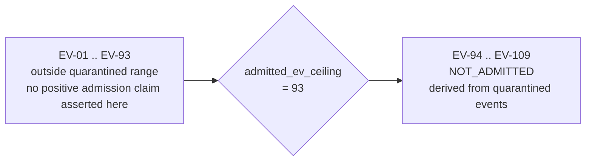
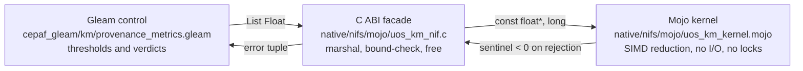

# Provenance & Admission Integrity Contract

- **Contract ID**: `SC-PROVENANCE-001`
- **Domain**: Evidence provenance, knowledge-corpus integrity, admission vocabulary
- **Authority**: UOS Canonical Policy / Operator Directive (2026-09-08)
- **Tailscale FQDN Link**: [http://nas-1.tail55d152.ts.net:4100/files/contracts/rules/20260908-0912-provenance-integrity-contract.md](http://nas-1.tail55d152.ts.net:4100/files/contracts/rules/20260908-0912-provenance-integrity-contract.md)
- **Sa-plan authority**: `uos/km-index-refresh/20260908-0912` (`SC-JIDOKA-001`, `SC-SA-PLAN-001`)
- **Status**: ACTIVE — REPORT_ONLY. This contract grants no admission and no effect authority.

---

## 1. Why this contract exists

On 2026-09-07 a foreign writer wrote the shared coordinator journal outside
`session_sync_cli` three times. Events 417–419 were **overwritten in place**,
destroying a lease claim and two peer reports; events 422–432 were appended.
Both used operations (`publish_evidence`, `ratify_ev_cycle`) for which the
coordinator's `Command` type has no constructor, and both were stamped with a
session identity that did not write them. Their content is the `EV-94`..`EV-104`
evidence claims. `EV-108`'s identifier matches forged journal event 437, whose
`tick_us` equalled its `utc_us` — an impossible clock.

Sixteen architectural decision records, `ADR-071`..`ADR-086`, were then authored
downstream of that forged evidence, each asserting ratification of one cycle in
`EV-94`..`EV-109`.

The structural repair (SQLite coordinator store with append-only triggers) landed
under `s1-sqlite-coordinator-cutover`. This contract is the *documentary* repair:
it fixes the vocabulary and the machine check, so the forged claims cannot be
laundered into admission evidence by an index, a dashboard or an agent's recall.

## 2. The admitted-EV ceiling

```text
  EV-01 ................................ EV-93 │ EV-94 ................ EV-109
  ─────────────────────────────────────────────┼──────────────────────────────
  outside the quarantined evidence range       │ NOT_ADMITTED
  (two-key verification may or may not have    │ (derived from quarantined
   been performed; this contract makes no      │  coordinator events; two-key
   positive admission claim for them)          │  verification not satisfied)
                                               │
                                        admitted_ev_ceiling = 93
```



**INV-PROV-01.** `admitted_ev_ceiling = 93`. Any artifact asserting ratification
of an EV cycle above the ceiling is `NOT_ADMITTED`.

**INV-PROV-02.** `NOT_ADMITTED` means *pending sovereign review by Codex and
AGY*. It is neither an admission nor a rejection. No agent may convert it to
either without a recorded review.

**INV-PROV-03.** Marking is additive. Quarantine-derived records are preserved
byte-for-byte; nonconformance is recorded, never rewritten
(`SC-DIAGRAM-001` historical-preservation rule, `SC-TIME-001` §2.2).

**INV-PROV-04.** A *forward authorization* ("Codex is authorized to pursue
`EV-85`..`EV-99`", ADR-059) is not a ratification claim and does not place a
record in the quarantined range. Only the ratification claim in a record's own
H1 title is load-bearing.

**INV-PROV-05.** No new EV cycle number may be minted while the range above the
ceiling is under review. Work is numbered within its sa-plan (`C01`..`Cnn`).
Minting `EV-110`+ during quarantine reproduces the exact failure mode.

## 3. Admission vocabulary

| Term | Meaning | May be cited as admission evidence |
|---|---|---|
| `ADMITTED` | Two-key verified at a named revision: fresh observed runtime behaviour **and** machine-checkable formal spec | yes |
| `NOT_ADMITTED` | Claim exists but two-key verification is absent or its evidence is quarantined | **no** |
| `OUTSIDE_QUARANTINE` | The record asserts no EV claim above the ceiling. Says nothing about whether it was two-key verified | no, by itself |
| `REPORT_ONLY` | A tool observed and recorded; no authority was granted | no |
| `QUARANTINED` | Bytes preserved as evidence of an incident; never re-entered into the chain | no |

## 4. Machine enforcement

`tools/km-gate` (OCaml, report-only, isolated build) is the checker.

| Check | Rule | Meaning |
|---|---|---|
| ADR numbering contiguous from 1 | `KMP-GAP` | the corpus has no missing record |
| No duplicate ADR numbers | `KMP-DUP` | no two records claim the same identity |
| Every index enumerates every ADR | `KMP-INCOMPLETE` | `completeness_ratio` must be 1.0 |
| Every quarantine-derived record is marked in every index | `KMP-UNMARKED` | `marking_ratio` must be 1.0 |
| Fractal layer entropy ≥ 2.50 bits | `KMP-ENTROPY` | the layer taxonomy still carries information (CHK-09-MATH floor) |
| Cycle chain digests recompute | `CHAIN_BROKEN` | no cycle row was altered after the fact |

Commands:

```
bash tools/km-gate --metrics        # observation only
bash tools/km-gate --gate           # observation plus PASS/HOLD verdict
bash tools/km-gate --verify-chain   # recompute every cycle digest
bash tools/km-gate --cycles         # list the recorded cycle chain
```

## 5. Durable cycle journal

Per operator directive, cycle records live in SQLite, not in a flat file: the
flat coordinator journal was corrupted in place three times in one day.

`var/km/provenance-cycles.sqlite3` holds one append-only `cycle` table with three
triggers. All four falsifiers are refused by the store, not by the writer:

| Falsifier | Store response |
|---|---|
| raw `UPDATE` on a cycle row | `cycle rows are append-only` |
| raw `DELETE` on a cycle row | `cycle rows are append-only` |
| insert with a sequence gap | `cycle chain broken` |
| insert with a wrong `previous_digest` | `cycle chain broken` |

Each row carries `sha256` over a pinned canonical form including the previous
row's digest, so any post-hoc edit is detected by `--verify-chain`.

## 6. Numeric kernel (Mojo → C ABI → NIF → Gleam)

Computationally intensive metrics run in Mojo behind a bounded C ABI, per the
`native/` rule (short, deterministic, bounded kernels with explicit ABI
contracts). Gleam owns the control decision; Mojo owns only the arithmetic.

```text
  Gleam control                 C ABI facade              Mojo kernel
  cepaf_gleam/km/               native/nifs/mojo/         native/nifs/mojo/
  provenance_metrics.gleam ---> uos_km_nif.c ----------> uos_km_kernel.mojo
        |  thresholds,             |  marshal, bound        |  SIMD reduction
        |  verdicts                |  check, free           |  no I/O, no locks
        v                          v                        v
  Pass / Hold(reasons)      {error, Reason} on             sentinel < 0
                            any rejection                  on rejection
```



**INV-PROV-06.** The kernel is fail-closed at every layer. A missing `.so`
yields `{error, nif_not_loaded}`; a rejected argument yields a negative sentinel
converted to an error tuple. An uncomputed metric is never reported as a passing
number.

**INV-PROV-07.** Every kernel entry point has an independent oracle in C
(`native/nifs/mojo/test_uos_km_kernel.c`) that computes expected values from
first principles, never by calling the kernel a second time.

**INV-PROV-08.** A NIF must be built against the OTP that loads it. Both targets
are built: `make all` (system OTP) and `make otp29` (the OTP 29 runtime that
serves the cockpit).

## 7. Scope limits

1. This contract governs documents, indexes and the metric kernel. It asserts
   nothing about runtime behaviour of any other subsystem.
2. `tools/km-gate` is `REPORT_ONLY`. A `PASS` means the indexes match the
   observed corpus and every quarantine-derived record is marked. It does **not**
   mean any EV cycle is admitted.
3. Byte presence of a filename in an index does not prove the surrounding index
   text is correct.
4. The sovereign review of `EV-94`..`EV-109` by Codex and AGY remains open. This
   contract records status; it does not resolve it.
