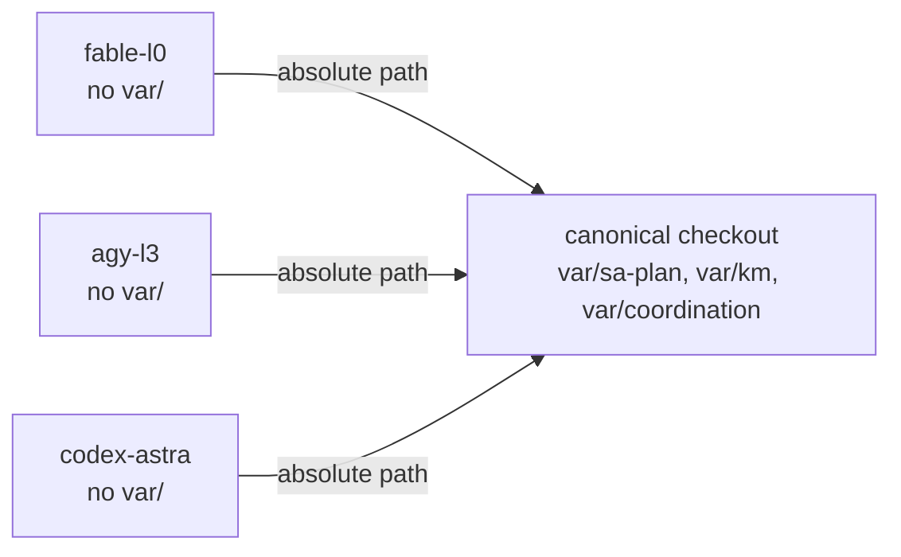

# Per-Agent Workspace Isolation Contract

- **Contract ID**: `SC-WORKSPACE-ISO-001`
- **Domain**: Jujutsu workspace ownership, shared runtime state, concurrent-writer safety
- **Authority**: UOS Canonical Policy §4.5 / Operator Directive 2026-09-08
- **Tailscale FQDN**: [http://nas-1.tail55d152.ts.net:4100/files/contracts/rules/20260908-1030-workspace-isolation-contract.md](http://nas-1.tail55d152.ts.net:4100/files/contracts/rules/20260908-1030-workspace-isolation-contract.md)
- **Status**: ACTIVE

---

## 1. Why this exists

On 2026-09-08 two sessions wrote the `default` working copy concurrently. The
observed damage, all in one hour:

1. A `jj split` landed **empty**, because the target moved mid-operation.
2. `main` **did not build**: a merge kept a new `router.gleam` against an old
   `inference_api.gleam`, calling four functions that did not exist.
3. A conflict resolution came within one command of **silently deleting** a
   Holarchy MOC line (158 holons) that the other side had added.
4. Change `sytpqsuv` acquired **another session's description over 41 files it
   did not author**, and cannot be corrected without rewriting someone else's
   commit.

None of these were caught by a gate. They were caught by reading the working
copy before committing, which is not a control.

## 2. Workspace ownership

| Workspace | Path | Owner |
|---|---|---|
| `default` | `.` | **Nobody.** Canonical checkout and canonical `var/`. Not a work surface. |
| `fable-l0` | `.uos-workspaces/fable-l0` | Claude / L0-fable |
| `agy-l3` | `.uos-workspaces/agy-l3` | AGY |
| `codex-astra` | `.uos-workspaces/codex-astra` | Codex |

**INV-WS-01.** An agent edits only inside its own workspace. `default` is read
and merged, not authored in.

**INV-WS-02.** An agent never commits, describes, splits, squashes or abandons a
change it did not author. If another session's work appears in your working
copy, that is an incident: report it, do not tidy it.

**INV-WS-03.** Attribution is never repaired by rewriting another session's
commit. Rewriting a commit to change who authored it is the same act as the
identity impersonation that produced the 2026-09-07 coordinator-journal
quarantine, regardless of intent. Record the defect in a receipt instead.

**INV-WS-04.** `main` moves only under a held `integration/main` lease, and the
mover verifies the tree **builds and tests green** at the new tip before moving
the bookmark. A merge that does not build is a broken `main`, not a merge.

## 3. Shared runtime state

`var/` is gitignored. It therefore exists **only** in the canonical checkout and
is **not** copied into a workspace created by `jj workspace add`.

```text
  .                              .uos-workspaces/fable-l0
  ├── var/                       ├── (no var/)
  │   ├── sa-plan/uos.sqlite3    │
  │   ├── km/provenance-*.sqlite3│
  │   └── coordination/tri-agent/│
  └── tools/  ───────────────────┴──> both resolve var/ to the CANONICAL
                                       absolute path, never workspace-relative
```



**INV-WS-05.** Any tool touching `var/` resolves an **absolute canonical path**,
overridable by an environment variable for tests. A workspace-relative path
silently creates a second store per workspace — a second cycle chain, each
starting at sequence 1 with its own digests, which is the exact divergence the
append-only design exists to prevent.

Conforming today: `tools/sa-plan` (`UOS_SA_PLAN_DB`),
`tools/km_provenance/km_chain.ml` (`UOS_KM_DB`).

**Falsifier for INV-WS-05:** run `bash tools/km-gate --verify-chain` from a
sibling workspace. Before the fix this failed with `unable to open database
file`. It must now report the same row count as from the canonical root.

## 4. Shared append-only stores

The cycle chain and the coordinator journal are shared by design and are
append-only by construction. Concurrent writers are expected and safe:
integrity held through the incident above, and two sessions' cycles coexist in
one chain with `CHAIN_INTACT`.

**INV-WS-06.** Attribution in a shared store is carried by `plan_id`, never
inferred from adjacency. Two sessions' rows interleave; sequence order is not
authorship.

**INV-WS-07.** A burst of rows sharing one `observed_utc` is a bulk write, not a
sequence of observations, and must not be read as a timeline.

**INV-WS-08.** Build artifacts are gitignored and therefore absent from a fresh
workspace, exactly like `var/`. `*.so` is ignored (`.gitignore:94`, whose own
comment calls them "host-provisioned"), so `apps/cepaf_gleam/priv/*.so` does not
exist after `jj workspace add`. A test suite run in an unprovisioned workspace
reports failures that are artifacts of the missing binaries, not defects.

Measured on 2026-09-08 in a fresh `fable-l0`: **220 failures** before
provisioning, **7** after copying the nine `priv/*.so` files and rebuilding the
Mojo kernel. 213 of the 220 were the artifact.

Provision a new workspace before trusting any test result:

```bash
cp ../../apps/cepaf_gleam/priv/*.so ../../apps/cepaf_gleam/priv/*.sha256 \
   apps/cepaf_gleam/priv/
(cd native/nifs/mojo && make all && make otp29)
```

**INV-WS-09.** A test count is only comparable between two revisions checked out
in the **same** provisioning state. Comparing a provisioned workspace against an
unprovisioned one measures the provisioning, not the code.

## 5. Setup

```bash
jj workspace add --name <agent> .uos-workspaces/<agent>
cd .uos-workspaces/<agent>
jj new main            # start work from the current tip
```

To land work: verify green, claim `integration/main`, move the bookmark, release.

## 6. Limits

This contract is a convention plus two enforceable falsifiers (§3, §4). It does
**not** prevent an agent from writing to `default` — nothing in jj enforces
workspace ownership. It reduces collision probability and makes a collision
legible after the fact; it does not make one impossible.
