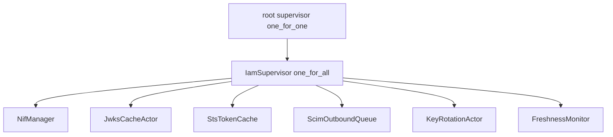

# 20260907-1330- FerrisKey-as-NIF IAM Protocol (UOS mirror of the C3I rule)
#fractal-l0 #fractal-l1 #fractal-l3 #fractal-l7 #zero-muda #km-triad #rocha-semiotics #cybernetics #stamp-stpa #iam

- **Contract IDs**: `SC-FERRISKEY-NIF-001..010`, `SC-GCP-IAM-001..020`, `AOR-IAM-NIF-001..008` (inherited from C3I; UOS adaptation below)
- **Tailscale FQDN Link**: [http://nas-1.tail55d152.ts.net:4100/docs/.gemini/rules/20260907-1330-iam-ferriskey-nif-rule.md](http://nas-1.tail55d152.ts.net:4100/docs/.gemini/rules/20260907-1330-iam-ferriskey-nif-rule.md)
- **Transclusions**: `[[zk:20260905-1801-moc-uos-unified-master]]` `[[wiki:20260905-1801-uos-zk-km-corpus-index]]`
- **Canonical copy**: `.claude/rules/20260907-1330-iam-ferriskey-nif-rule.md` (this file is the Gemini/Antigravity mirror per the full-symbiosis rule; keep both identical in substance).
- **Source of this mirror**: `/home/an/dev/ver/c3i/.claude/rules/iam-ferriskey-nif.md` (VM-1 C3I evidence, read-only). UOS path substitutions: `lib/cepaf_gleam/native/ferriskey_nif/` becomes `native/nifs/rust/ferriskey_nif/`; `lib/cepaf_gleam/` becomes `apps/cepaf_gleam/`. The built cdylib is a host-provisioned artifact at `apps/cepaf_gleam/priv/ferriskey_nif.so`, pinned by `apps/cepaf_gleam/priv/ferriskey_nif.sha256`, never committed.
- **UOS status (2026-09-07)**: NIF crate sources imported into `native/nifs/rust/ferriskey_nif/` under explicit operator permission, manifest-verified against `governance/sources/20260907-1330-ferriskey-nif-source-ingestion.json`; artifact built and pinned; build recipe in `native/nifs/rust/README.md`; Codex R5 sovereign security review required before any admission claim (IAM, tokens, JWKS, GCP STS, SCIM). Mirrors: `.claude/rules`, `.gemini/rules`, `.agents/rules`, `.codex/rules` (full-symbiosis rule parity).

---

## Mandate

FerrisKey IAM is embedded as a NIF (`native/nifs/rust/ferriskey_nif/`, loaded by `apps/cepaf_gleam/src/ferriskey_nif.erl`) inside cepaf_gleam. The local copy is the source of truth; Google Cloud IAM is the federation peer. All in-mesh IAM hot-paths run in-process; all cross-cloud IAM goes through the same NIF (no out-of-process HTTP hops).

## STAMP Constraints — SC-FERRISKEY-NIF-001..010

| ID | Constraint | Severity |
|----|-----------|----------|
| SC-FERRISKEY-NIF-001 | NIF cdylib MUST load via `-on_load` on BEAM start | CRITICAL |
| SC-FERRISKEY-NIF-002 | A single `OnceCell<tokio::Runtime>` MUST be shared across all NIFs | CRITICAL |
| SC-FERRISKEY-NIF-003 | All NIFs MUST be scheduled `DirtyCpu` or `DirtyIo` per workload class | CRITICAL |
| SC-FERRISKEY-NIF-004 | JWKS cache TTL ≤ 5 min, soft-refresh at 80 % | HIGH |
| SC-FERRISKEY-NIF-005 | In-process JWT validation latency p99 ≤ 2 ms | HIGH |
| SC-FERRISKEY-NIF-006 | Audit span MUST be emitted for every write NIF (OTel → Zenoh `indrajaal/l0/iam/**`) | HIGH |
| SC-FERRISKEY-NIF-007 | SQLite WAL + `synchronous=NORMAL` + 30 s busy_timeout | HIGH |
| SC-FERRISKEY-NIF-008 | Signing-key rotation ≤ 90 days; 7-day overlap; `kid` in JWT header | HIGH |
| SC-FERRISKEY-NIF-009 | NIF panic MUST NOT crash BEAM (rustler `Term` map_error) | CRITICAL |
| SC-FERRISKEY-NIF-010 | Vault-backed signing keys; no plaintext outside SQLite | CRITICAL |

## STAMP Constraints — SC-GCP-IAM-001..020

| ID | Constraint | Severity |
|----|-----------|----------|
| SC-GCP-IAM-001 | Workload Identity Pool provider = OIDC; issuer = `https://<host>/realms/<realm>` | CRITICAL |
| SC-GCP-IAM-002 | STS exchange MUST be RFC 8693 conformant (`subject_token_type = jwt`) | CRITICAL |
| SC-GCP-IAM-003 | GCP access-token cache TTL = `min(returned_exp, 55 min)` | HIGH |
| SC-GCP-IAM-004 | SCIM 2.0 server MUST be RFC 7643/7644 conformant (filter, sort, pagination, etag) | CRITICAL |
| SC-GCP-IAM-005 | GDPR EU residency: ALL GCP endpoints pinned to `europe-north1` | CRITICAL |
| SC-GCP-IAM-006 | Service-account keys fetched from RustyVault, never on disk | CRITICAL |
| SC-GCP-IAM-007 | SCIM destructive ops (DELETE Users/Groups) MUST be 2oo3 Guardian-gated | CRITICAL |
| SC-GCP-IAM-008 | Outbound SCIM PUSH retried with exponential backoff (max 3, jitter) | HIGH |
| SC-GCP-IAM-009 | STS rate-limit aware: token bucket 60 rpm/realm | HIGH |
| SC-GCP-IAM-010 | mTLS pinning on `sts.googleapis.com` cert chain (ring-verified) | HIGH |
| SC-GCP-IAM-011 | Allow-policy mutations MUST use etag (optimistic concurrency) | CRITICAL |
| SC-GCP-IAM-012 | `setIamPolicy` MUST be 2oo3 Guardian-gated | CRITICAL |
| SC-GCP-IAM-013 | `gcp_deny_policy_apply` is the canonical emergency-stop pathway, p99 ≤ 5 s | CRITICAL |
| SC-GCP-IAM-014 | Basic roles (Owner/Editor/Viewer) FORBIDDEN in TF; CI lint enforces | HIGH |
| SC-GCP-IAM-015 | IAM Recommender output reviewed weekly; 2oo3 to apply | HIGH |
| SC-GCP-IAM-016 | Policy Troubleshooter audit retained 90 days | MEDIUM |
| SC-GCP-IAM-017 | Org-policy violations MUST block NIF `policy_set` pre-flight | HIGH |
| SC-GCP-IAM-018 | VPC Service Controls perimeter MUST list Tailscale exit IP for `*.googleapis.com` egress | HIGH |
| SC-GCP-IAM-019 | CMEK keyring for backup + audit-log buckets distinct from FerrisKey signing-key vault | HIGH |
| SC-GCP-IAM-020 | Region-pin lint: any new `*.googleapis.com` reqwest call without `europe-north1` literal fails CI | HIGH |

## AOR Rules

| ID | Rule |
|----|------|
| AOR-IAM-NIF-001 | NEVER call FerrisKey out-of-process for hot-path operations (JWT validate, JWKS lookup) |
| AOR-IAM-NIF-002 | ALWAYS read GCP service-account keys via `vault_bridge::get`, never from disk or env |
| AOR-IAM-NIF-003 | ALWAYS call `audit::emit` before returning from a write NIF |
| AOR-IAM-NIF-004 | ALWAYS pin GCP region to `europe-north1`; CI lint rejects naked `*.googleapis.com` strings |
| AOR-IAM-NIF-005 | NEVER add basic IAM roles (Owner/Editor/Viewer) to any Terraform under `infra/gcp/iam/` |
| AOR-IAM-NIF-006 | ALWAYS update `wiring_guard.gleam` and `ferriskey_nif_wiring_test.gleam` in the same commit as Model field changes (SC-WIRE-002) |
| AOR-IAM-NIF-007 | ALWAYS gate destructive SCIM ops + `setIamPolicy` through 2oo3 Guardian |
| AOR-IAM-NIF-008 | ALWAYS use etag for `iam_policy_set` to prevent lost updates |

## Multilayer supervisor topology (SC-CPIG-011)

```text
root supervisor (one_for_one, intensity=10, period=60s)
└── IamSupervisor (one_for_all, intensity=3, period=60s)
    ├── NifManager        — owns process-wide NIF state, exposes typed API
    ├── JwksCacheActor    — refreshes JWKS at 80 % TTL (SC-FERRISKEY-NIF-004)
    ├── StsTokenCache     — evicts on `expires_at` (SC-GCP-IAM-003)
    ├── ScimOutboundQueue — drains scim_outbound_queue with exponential backoff (SC-GCP-IAM-008)
    ├── KeyRotationActor  — schedules signing-key rotation (SC-FERRISKEY-NIF-008)
    └── FreshnessMonitor  — Andon escalation on stale JWKS / dead STS / queue lag
```



UOS placement: `apps/cepaf_gleam/src/cepaf_gleam/iam/{supervisor,nif_manager,jwks_cache_actor,scim_outbound_actor,lifecycle,objects}.gleam`.

## Full fractal integration — L0-L7 × all-objects matrix

Every IAM object MUST be addressable at every fractal layer it touches.

| Object \ Layer | L0 Constitutional | L1 Atomic/NIF | L2 Component | L3 Transaction | L4 System | L5 Cognitive | L6 Ecosystem | L7 Federation |
|---|---|---|---|---|---|---|---|---|
| User | Psi-2 reversibility on user.delete | bcrypt verify NIF | scim.User parser | user CRUD txn | tracing event | Lustre admin row | Zenoh user.* events | Cloud Identity SCIM peer |
| Group | role-membership invariant | group NIF | scim.Group | group CRUD txn | log event | Lustre group tile | Zenoh group.* | Admin SDK Directory peer |
| Role | layer_mask invariant | role NIF | rbac mapper | role grant txn | log event | Lustre role table | Zenoh role.* | n/a (local only) |
| Realm | issuer_url stable | realm NIF | realm parser | realm CRUD txn | log event | Lustre realm switch | Zenoh realm.* | WIF pool peer |
| Token | exp + sig invariant | token NIF | jwt parser | issue/validate txn | log event | Lustre token panel | Zenoh token.* | GCP STS subject token |
| JWKS | kid uniqueness | jwks_cache NIF | jwk parser | publish txn | log event | Lustre jwks viewer | Zenoh jwks.* | GCP WIF JWKS fetch |
| AccessToken | 55-min TTL | gcp_sts NIF | json parser | sts cache txn | log event | Lustre sts panel | Zenoh sts.* | GCP STS issuer |
| ScimOp | schema URN required | scim NIF | scim parser | inbound apply txn | log event | Lustre scim queue | Zenoh scim.* | Cloud Identity client |
| AuditEvent | append-only | audit NIF | json | audit_log INSERT | log event | Lustre audit page | Zenoh audit.* | Cloud Logging sink |
| GcpPolicy | etag invariant | gcp_iam NIF | policy parser | policy_set txn | log event | Lustre policy view | Zenoh policy.* | GCP IAM peer |
| GcpRecommendation | recommendation hash stable | gcp_iam NIF | json | recommend txn | log event | Lustre recommend tile | Zenoh recommend.* | GCP Recommender peer |
| OrgPolicy | constraint stable | gcp_iam NIF | json | org_policy read | log event | Lustre org tile | Zenoh org.* | GCP Org Policy peer |

Coverage target: 12 objects × 8 layers = 96 cells. UOS status of each cell is tracked in the ferriskey integration journal, not assumed.

## Vault integration

Every secret in the IAM stack lives in RustyVault (`apps/cepaf_gleam/priv/rusty_vault_nif.so`, pinned). The NIF reads via the `vault_bridge` (`apps/cepaf_gleam/src/cepaf_gleam/auth/vault_bridge.gleam`).

| Secret | Vault path | TTL | Owner constraint |
|---|---|---|---|
| FerrisKey signing key (RS256) | `iam/signing/rs256/<kid>` | 90 d | SC-FERRISKEY-NIF-008 |
| FerrisKey signing key (Ed25519) | `iam/signing/eddsa/<kid>` | 90 d | SC-FERRISKEY-NIF-008 |
| FerrisKey signing key (ES256) | `iam/signing/es256/<kid>` | 90 d | SC-FERRISKEY-NIF-008 |
| GCP service-account key (`c3i-scim@`) | `iam/gcp-sa/c3i-scim` | 30 d | SC-GCP-IAM-006 |
| GCP service-account key (`c3i-backup@`) | `iam/gcp-sa/c3i-backup` | 30 d | SC-GCP-IAM-006 |
| GCP service-account key (`c3i-logging@`) | `iam/gcp-sa/c3i-logging` | 30 d | SC-GCP-IAM-006 |
| GCP service-account key (`c3i-pubsub@`) | `iam/gcp-sa/c3i-pubsub` | 30 d | SC-GCP-IAM-006 |
| SCIM provisioning bearer (Google → us) | `iam/scim/provisioning-token` | 7 d | SC-GCP-IAM-004 |
| OIDC client secrets (per RP client) | `iam/oidc/clients/<client_id>` | 180 d | SC-FERRISKEY-NIF-010 |

## RETE-UL rules (4)

| Rule | Salience | When | Then |
|---|---:|---|---|
| `IamSigningKeyAge` | 90 | `now - signing_key.rotated_at >= 90d` | open P1 rotation task |
| `IamSaKeyRotationDue` | 90 | `now - gcp_sa.rotated_at >= 30d` | open P1 SA-key rotation task |
| `IamJwksPublishFailed` | 95 | `jwks_publish.failure_count >= 3` | P0 alarm + halt new token issuance |
| `IamScimTokenCompromised` | 100 | `scim_inbound.bearer.detected_in_audit_outside_realm` | P0 alarm + revoke + rotate |

## Triple-interface (SC-GLM-UI-001)

Every IAM capability MUST be visible in the Lustre `/iam` page, the Wisp REST surface under `/api/v1/iam/*` and `/scim/v2/*` (`apps/cepaf_gleam/src/cepaf_gleam/ui/wisp/auth_api.gleam`), and the TUI `iam_view`. All three share types from `auth/iam_domain`.

## Cross-references

- Upstream plan (C3I, evidence only): `/home/an/.claude/plans/integrate-iam-feeriskey-golden-pebble.md`
- Vendored upstream FerrisKey: `/home/an/NAS-setup/c3i/sub-projects/ferriskey-vendored/` (Apache-2.0, upstream sha 2317b30c) — not ingested
- Formal evidence: `/home/an/dev/ver/c3i/specs/tla/FerrisKeyIAM.tla` — candidate for `formal/tla/`
- UOS tests: `apps/cepaf_gleam/test/ferriskey_nif_wiring_test.gleam` (33), `ferriskey_rbac_wiring_test.gleam` (6), `auth_oidc_test.gleam`, `auth_rbac_test.gleam`

## Governance parity

Mirrored at `.gemini/rules`, `.agents/rules`, `.codex/rules` with the same filename per the full-symbiosis rule.

---
Navigation: [ZK Master MOC](http://nas-1.tail55d152.ts.net:4100/zk) · [Hermes Wiki Corpus Index](http://nas-1.tail55d152.ts.net:4100/wiki) · [Review Tome](http://nas-1.tail55d152.ts.net:4100/docs/.gemini/rules/20260907-1330-iam-ferriskey-nif-rule.md)
