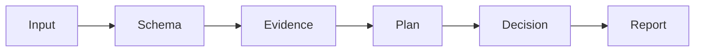

# 20260907-1606 — Bounded risk checker contract

#fractal-l0 #fractal-l1 #fractal-l2 #fractal-l3 #fractal-l4 #fractal-l5 #fractal-l6 #fractal-l7 #fractal-l8 #fractal-l9 #zk-adr #zero-muda

[SOP](http://nas-1.tail55d152.ts.net:4100/files/contracts/rules/20260907-1606-risk-checker-contract.md) · [Guide](http://nas-1.tail55d152.ts.net:4100/docs/wiki/20260907-1606-risk-checkers-guide.md) · [Journal](http://nas-1.tail55d152.ts.net:4100/docs/journal/20260907-1606-risk-checkers-journal.md) · [Planning](http://nas-1.tail55d152.ts.net:4100/planning)

Created from synchronized host observation **2026-09-07T16:58:06Z** (UTC hour/seconds prefix).
Contract **SC-RISK-CHECK-001**, checker version **1.1.0**, extends **SC-RISK-PRIORITY-001 v1.0.0**.
Status: local implementation and verification; independent admission and fleet enforcement are not asserted.

## Scope and authority

Every consuming SDLC/SRE/agent skill applies these checks at its relevant transition.
The package is repository-owned OCaml, using the existing OCaml toolchain and declared
Yojson, Cryptokit, SQLite3 and Mtime libraries. No remote model request is needed.
Sa-plan remains the sole execution authority. A checker result can hold a selection;
it cannot claim a task, change a priority, renew a lease, deploy, or assert control effectiveness.

The ranking formula, STPA analysis and FMEA bands remain unchanged. The checker adds
evidence verification, a read-only planning observation and uncertainty analysis.
The five-factor product is an ordinal triage aid; no probability or certified risk claim follows.

## Required transition checks

| Transition | Required local command | Result meaning |
|---|---|---|
| Checker/code/policy change; review or CI | `bash tools/risk-priority-check --all` | Build, baseline, independent DAG oracle, adversarial and package checks |
| Observe one plan | `bash tools/risk-priority-check --plan PLAN` | Read-only Sa-plan projection; no task action |
| Assess current source | `bash tools/risk-priority-check --audit PORTFOLIO` | Listed source hashes/freshness and decision analysis; no Sa-plan observation |
| Before exact task claim | `bash tools/risk-priority-check --preflight PORTFOLIO TASK` | Complete plan agrees with Sa-plan and TASK is first eligible candidate with no unresolved checker hold |
| During an owned task/before its next effect | `bash tools/risk-priority-check --active-check PORTFOLIO TASK WORKER ATTEMPT` | Current owner, attempt, lease, plan and source observations agree |
| Reuse previous verification | `bash tools/risk-priority-check --receipt RECEIPT` | Declared artifact bytes/aliases match; does not authenticate test claims or signer |

PORTFOLIO is a JSON array of SC-RISK-PRIORITY-001 records, covering one complete canonical
plan, including completed prerequisites. Use current source evidence; the original v1
example is historical. Do not edit its observation time to present it as fresh evidence.
Legacy --record and --rank remain limited structural/advisory commands.

Exit zero means only the named checks passed. HOLD, unavailable evidence, drift, timeout,
unknown schema features, clock trouble and unresolved ordering must produce nonzero exit.
The wrapper uses a temporary build, one Dune job, a 90-second build timeout and 30-second
execution timeout, each with forced termination after a two-second grace.
Do not convert a failing checker into a retry loop; preserve the cause and collect the missing evidence.
A P0 incident still uses its already-authorized Sa-plan/runbook containment path.

## Constraints and evidence

| Constraint | Checker behavior and bounded next step |
|---|---|
| Schema must not silently weaken | Validate all schema branches, including absent fields and losing anyOf branches. Pin the canonical record schema and policy bytes; deliberate changes need code/tests/version review. |
| Inputs must stay bounded | 1 MiB per JSON/source file, depth 64, 100,000 JSON structural tokens, 1,000 tasks, 10,000 edges, 256 evidence files and 16 MiB total evidence. |
| No special-file or external evidence reads | Reject FIFO/device inputs, noncanonical evidence paths, symlink evidence and known credential/runtime-state locators. Check regular-file identity/size/timestamps across reads. |
| Evidence must match | Compute actual SHA-256 through Cryptokit, bind every factor source to an evidence entry, check line references and evidence observation times, then recheck source bytes before exit. |
| Historical receipts cannot clear changed code | Check artifact hashes and recorded relative aliases. Preserve the original receipt; report stale/changed artifacts. |
| Time must have its own evidence | Require chronyc tracking: synchronized stratum 1–15, Normal leap state, absolute offset <2s, reference age 0–4096s, uncertainty <2s. Compare UTC progress with Mtime elapsed duration; wall steps >=250ms hold. |
| Planning assertions cannot be self-issued | Open canonical Sa-plan in READONLY/query_only mode, bounded parameterized queries and a read transaction. Compare all task IDs, states and dependency edges; inspect worker/attempt/lease and completion metadata. Re-read the plan before exit. |
| Selection cannot bypass a prerequisite | Reject missing, cyclic or duplicate dependencies. Propagate urgency with origin IDs; never promote a blocked consumer into eligibility. |
| Uncertainty cannot become clearance | Hold on stale/unknown inherited urgency, overlapping effective score intervals, sensitivity reversal/touch under one-factor +/-1 scenarios, or unresolved cost ties. |
| Results must explain their limits | Emit rule, affected task, observed problem and next discriminating check. No hidden chain-of-thought is requested or required. |

The ±1 scenario perturbs one ordinal factor at a time in [1,5]; it is a sensitivity
challenge to the analyst's judgment, not a substitute FMEA record or a calibrated interval.
Cost tie review remains external to this checker because v1 has no typed cost comparison.
There is deliberately no force-pass switch.

## STPA control structure and failure analysis

Controller: planning/review actor. Controlled action: select or continue a bounded task.
Feedback: source digests, host clock, Sa-plan snapshot, checker findings and actual effect receipts.
Loss: unauthorized effects, missed urgent repairs, or false evidence of safety.
Hazard: an apparently green result is acted on after its state changed.

| UCA type | Unsafe context | Required constraint |
|---|---|---|
| Not provided | Drift/unsafe ordering is not checked before the next effect | Run the relevant check and require current authority separately |
| Provided unsafe | Forged hashes, omitted tasks or score-only ordering pass | Independently recompute bytes, plan membership and constrained order |
| Wrong timing | Input or lease changes between observation and use | Compare before/after snapshots and recheck at the actual effect boundary |
| Wrong duration | Old worker continues after expiry or checker hangs | Check live attempt/lease and bound checker/subprocess execution |

Primary FMEA mode: false-positive evidence clearance (S4, O3, Det3; RPN36; F4).
These are planning estimates; controls reduce detectable failure cases in local tests.
Residual risk includes semantic errors, hostile same-host mutation, unlisted source changes,
and the observation-to-effect gap. No measured residual occurrence rate is claimed.

## Editable control-flow sources

```text
Input -> Schema -> Evidence -> Plan -> Decision -> Report
```



Plan is read-only and applies to preflight/active modes. Every stage can stop with HOLD.
No edge executes a task or admits a release.

## Evidence limits and follow-up work

1. This is an opt-in CLI plus mandatory local process guidance, not an atomic Store admission hook.
2. --active-check observes a worker/attempt; a later effect still needs the real fencing/authority protocol.
3. The v1 record's prose, scope completeness, safety class, STPA controls and cost estimates need qualified review.
4. Listed working-tree bytes are supported. Revision provenance, runtime receipts and signed attestations need dedicated verified adapters.
5. File checks assume a trusted host/filesystem. They detect ordinary mutation; they do not defeat a hostile same-UID writer or prove absence of secrets.
6. Finite exhaustive small-graph testing is not a proof for arbitrary graphs. Lean/Quint authority and independent live-agent tests remain unrun.
7. Repository packaging is self-contained at the source/configuration level; declared compiler/libraries and chrony are host prerequisites.

## Comprehensive verification checklist


This is a process/document package. The entries below do not assert production conformance.
UNRUN and NOT_ADMITTED remain nonpassing; N/A must be justified for each actual change.

<details><summary>Domain 1 — Metadata and navigation</summary>

- [x] CHK-01-TIME — Host timestamp recorded.
- [x] CHK-02-TAIL — Full Tailscale FQDN references provided; live delivery unverified.
- [x] CHK-03-FRACT — L0–L9 applicability tagged.
- [x] CHK-04-KM — SOP, wiki, ADR and journal linked in this package.

</details>
<details><summary>Domain 2 — Zero-Muda and storage safety</summary>

- [ ] CHK-05-MUDA — Fleet dependency exclusion scan UNRUN.
- [ ] CHK-06-GRAPH — Runtime language/NIF conformance UNRUN.
- [ ] CHK-07-DRIVE — OS storage interlock execution UNRUN.

</details>
<details><summary>Domain 3 — Testing and mathematical gates</summary>

- [ ] CHK-08-C1C8 — Full UI categories UNRUN.
- [ ] CHK-09-MATH — Mathematical quality gates UNRUN.
- [ ] CHK-10-9MOD — Nine runtime test modalities UNRUN.
- [ ] CHK-11-REGR — Live UI regression monitoring UNRUN.

</details>
<details><summary>Domain 4 — Cross-language control and observability</summary>

- [ ] CHK-12-GLEAM — Production supervision/fencing checks UNRUN.
- [ ] CHK-13-HERMES — Mandatory scheduler enforcement NOT_IMPLEMENTED by this package.
- [ ] CHK-14-ZIGVM — Runtime kernel checks UNRUN.
- [ ] CHK-15-MAX — Actual inference checks UNRUN.
- [ ] CHK-16-OTEL — Runtime telemetry correlation UNRUN.

</details>
<details><summary>Domain 5 — Governance and Jujutsu</summary>

- [ ] CHK-17-SOV — Independent review/admission NOT_ADMITTED.
- [x] CHK-18-JJ — No native Git command or integration/VCS mutation used for this package.

</details>


**UOS footer:** SC-RISK-CHECK-001; report and hold authority only.

