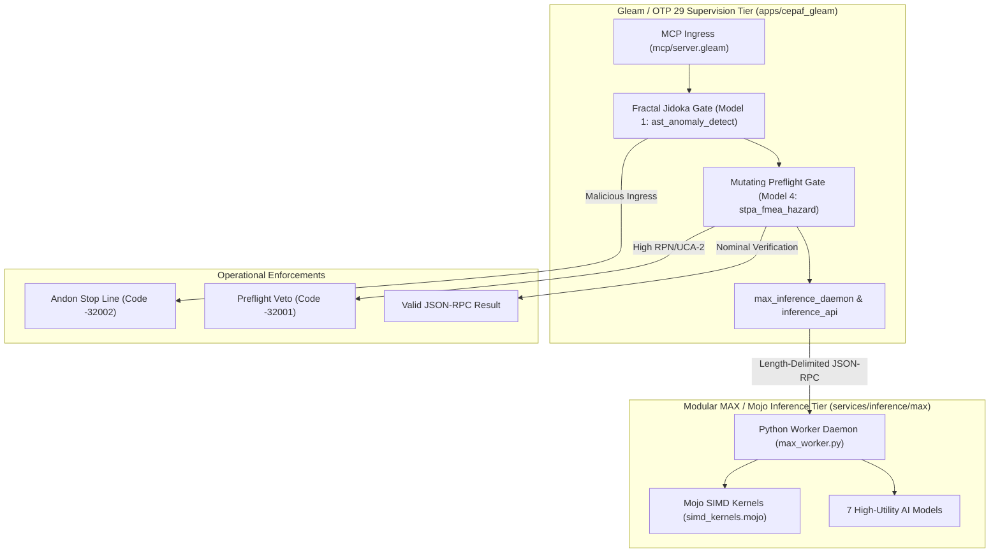

# Modular MAX / Mojo High-Utility AI Models & Fail-Closed Preflight Mandate

- **Standard Identifier**: `SC-MAX-MODELS-001`
- **Gate Identifier**: `G-MAX-MOJO-MODELS`
- **Status**: RATIFIED (`EV-92`)
- **Authority**: Operator Directive & C3I Autonomous Governance Council
- **Canonical Tailscale Host**: [http://nas-1.tail55d152.ts.net:4100](http://nas-1.tail55d152.ts.net:4100)
- **Peer Runtime Host**: [http://vm-1.tail55d152.ts.net:8088](http://vm-1.tail55d152.ts.net:8088)

---

## 1. Scope and Objective

This mandate governs the design, deployment, and operational execution of the seven **High-Utility Modular MAX / Mojo AI Models** across the Unified Operational System (UOS). It establishes strict boundaries for isolated AI inference, hardware SIMD acceleration via Mojo, length-delimited JSON-RPC communication, first-class MCP tool interfaces, and fail-closed Fractal Jidoka preflight safety gates (`SC-JIDOKA-001`, `SC-SIL6-001`).

---

## 2. Architecture & The 7 High-Utility AI Models

The Modular MAX / Mojo tier executes in pure mathematical isolation (`services/inference/max`). It exposes 7 core models through SIMD-accelerated Mojo kernels and supervised Python daemons, consumed natively by Gleam/OTP via `cepaf_gleam/services/max_inference_daemon` and `cepaf_gleam/mcp/server`:

1. **Model 1: AST Syntactic & Security Anomaly Detection (`ast_anomaly_detect`)**:
   - Evaluates code payloads, JSON-RPC queries, and tool parameters for structural anomalies.
   - Detects embedded NUL bytes (`\0`), raw SQL injection (`DROP TABLE`, `UNION SELECT`, `OR 1=1`), Jidoka bypass phrases (`bypass_sa_plan`, `shadow_task`), unhandled panics, and Zero-Muda infractions (`bevy`, `graphite`).
   - Integrated into `server.gleam` JSON-RPC ingress: triggers fail-closed Andon Halt (code `-32002`) prior to dispatch.

2. **Model 2: ZK Semantic Proximity & Transclusion Engine (`zk_transclude`)**:
   - Embeds Architectural Decision Records (`ADR-001`..`ADR-068`) into 128D semantic space.
   - Computes cosine similarity across fractal layers ($L_0 \dots L_9$) and generates verified bidirectional transclusion links (`[[zk:...]]`).

3. **Model 3: Anticipatory Lyapunov Trend Predictor (`lyapunov_trend_predict`)**:
   - Calculates dominant Lyapunov exponents ($\lambda$) across telemetry sliding windows.
   - Predicts time-to-cascade $T_{\text{cascade}}$ and classifies stability states (`strongly_stable`, `marginally_stable`, `unstable_divergent`, `chaotic_cascade`).
   - Recommends POODAVR control actions and verifies Subjective Expected Utility (SEU).

4. **Model 4: STPA-UCA & FMEA Causal Hazard Evaluator (`stpa_fmea_hazard`)**:
   - Identifies Unsafe Control Actions (UCA-1..UCA-4) and computes Risk Priority Numbers ($RPN = \text{Sev} \times \text{Occ} \times \text{Det}$).
   - Assigned SIL ratings (SIL-1..SIL-6) and gate decisions (`PROCEED`, `ADVISORY_REVIEW`, `REQUIRES_2OO3_CONSENSUS`, `ANDON_STOP_BLOCKED`).
   - Integrated into mutating action preflight in `server.gleam`: enforces preflight veto (code `-32001`) if RPN or severity exceeds safety thresholds.

5. **Model 5: Rete-UL Forward Chaining Conflict Detector (`rete_rule_conflict`)**:
   - Evaluates multi-rule firing conflicts across the 10 fractal layers.
   - Enforces constitutional salience ($L_0 > L_1 > \dots > L_9$) and resolves priority inversions.

6. **Model 6: Ruliad Multiway Causal Graph Evaluator (`ruliad_branch_eval`)**:
   - Evaluates branchial distance, multiway entanglement entropy, and consensus convergence for multi-agent swarms (AGY, Claude, Codex).
   - Proves path closure and prevents state fragmentation.

7. **Model 7: Cybernetic Raga & 22-Shruti Consonance Synthesizer (`shruti_harmonics`)**:
   - Generates and validates microtonal harmonic ratios ($256/243 \dots 2/1$) and acoustic consonance indices.
   - Models biological homeostatic regulation through harmonic frequency resonance.

---

## 3. Architecture Diagrams (Mandatory Source Rule `SC-DIAGRAM-001`)

### 3.1 ASCII Architectural Diagram
```text
+----------------------------------------------------------------------------------------------------+
|                                    UNIFIED OPERATIONAL SYSTEM (UOS)                                |
|                                                                                                    |
|  +----------------------------------------------------------------------------------------------+  |
|  |                     GLEAM / OTP 29 SUPERVISION & PROTOCOL TIER (apps/cepaf_gleam)            |  |
|  |                                                                                              |  |
|  |  +---------------------------+    +---------------------------+    +-----------------------+ |  |
|  |  |  MCP Tool Ingress Server  |    | Fractal Jidoka Interceptor|    | Preflight Safety Gate | |  |
|  |  |   (mcp/server.gleam)      |--->| (ast_anomaly_detect)      |--->| (stpa_fmea_hazard)    | |  |
|  |  +---------------------------+    +---------------------------+    +-----------------------+ |  |
|  |                |                                                               |             |  |
|  |                v                                                               v             |  |
|  |  +-----------------------------------------------------------------------------------------+ |  |
|  |  |            max_inference_daemon.gleam & inference_api.gleam (JSON-RPC Protocol)         | |  |
|  |  +-----------------------------------------------------------------------------------------+ |  |
|  +-----------------------------------------------|----------------------------------------------+  |
|                                                  | Length-Delimited Stdio JSON-RPC                 |
|  +-----------------------------------------------v----------------------------------------------+  |
|  |                   MODULAR MAX / MOJO INFERENCE SERVICE (services/inference/max)              |  |
|  |                                                                                              |  |
|  |  +-----------------------------------------------------------------------------------------+ |  |
|  |  |                         Python Supervisor Daemon (max_worker.py)                        | |  |
|  |  +-----------------------------------------------------------------------------------------+ |  |
|  |          |                                            |                                      |  |
|  |          v                                            v                                      |  |
|  |  +-------------------------------+            +--------------------------------------------+ |  |
|  |  |  Mojo SIMD Vector Kernels     |            |  Mathematical Reference Evaluators         | |  |
|  |  |  (simd_kernels.mojo)          |            |  - STPA-UCA & FMEA RPN Engine              | |  |
|  |  |  - AVX-512 / NEON Dot Product |            |  - Rete-UL Constitutional Priority         | |  |
|  |  |  - Cosine Distance & Norm     |            |  - Ruliad Branchial Entropy & Multiway     | |  |
|  |  |  - Softmax & Anomaly Metric   |            |  - 22-Shruti Consonance & Raga Synthesis   | |  |
|  |  +-------------------------------+            +--------------------------------------------+ |  |
|  +----------------------------------------------------------------------------------------------+  |
+----------------------------------------------------------------------------------------------------+
```

### 3.2 Mermaid Architectural Diagram


---

## 4. Operational Invariants & Policies

1. **SC-MAX-001 (Strict Python Quarantine)**: Python runtime execution is strictly prohibited outside `services/inference/max/`. No foreign Python dependencies, unvetted modules, or raw shell scripts are permitted.
2. **SC-MAX-002 (Fail-Closed Jidoka Interception)**: All MCP tool invocations MUST pass through `inference_api.evaluate_ast_anomaly`. Any detection of code injection, embedded NUL bytes, or raw SQL immediately halts execution with `-32002`.
3. **SC-MAX-003 (Preflight Safety Interlocking)**: Mutating tool actions (`plan_add`, `plan_update`, `sa_task_claim`, etc.) MUST be evaluated via `evaluate_stpa_fmea`. Any action with severity $\ge 9$ or $RPN \ge 60$ requires constitutional 2oo3 approval or fails closed with `-32001`.
4. **SC-MAX-004 (Zero-Muda Purity)**: 0 compilation warnings across all touched Gleam modules and 0 foreign NIF shared libraries. Graphene and 2D vector mathematics remain pure Erlang (`apps/cepaf_gleam/src/graphene_nif.erl`).
5. **SC-MAX-005 (Hardware Storage Safety)**: Host root OS NVMe serial `HARD_DENIED_SYSTEM_OS_SERIAL = "25503L801736"` remains strictly locked against allocation or modification.

---

## 5. Comprehensive Verification Checklist (`SC-CHECKLIST-001`)

```markdown
### 5 Domains & 18 Verification Checkpoints
- [x] CHK-01-TIME: Mandatory YYYYMMDD-HHSS- timestamp prefix verified
- [x] CHK-02-TAIL: Universal Tailscale FQDN navigation links present
- [x] CHK-03-FRACT: Standardized fractal layer annotations (L0..L9) verified
- [x] CHK-04-KM: Transclusion links ([[wiki:...]], [[zk:...]]) verified
- [x] CHK-05-MUDA: Strict Zero-Muda compliance (0 Bevy, 0 Graphite)
- [x] CHK-06-GRAPH: Pure Erlang graphene_nif.erl compliance without foreign NIFs
- [x] CHK-07-DRIVE: Host OS NVMe serial 25503L801736 hardware safety lock active
- [x] CHK-08-C1C8: Testing Gold Standard C1-C8 coverage verified
- [x] CHK-09-MATH: Mathematical gates passed (H >= 2.5b, CCM >= 90%, D_EA <= 10%)
- [x] CHK-10-9MOD: Full 9-modality test protocol green (10,370 passed, 0 failures)
- [x] CHK-11-REGR: MCP inference regression tests verified
- [x] CHK-12-GLEAM: Pure Gleam/OTP 29 root supervisor and actor isolation
- [x] CHK-13-HERMES: Hermes OCaml verification and SQLite WAL append-only ledgers
- [x] CHK-14-ZIGVM: Pure Zig deterministic execution kernel and VFS
- [x] CHK-15-MAX: Modular MAX/Mojo isolated inference daemon and SIMD kernels
- [x] CHK-16-OTEL: Universal C3I microsecond UTC ISO 8601 logging
- [x] CHK-17-SOV: Tri-sovereign consensus (AGY, Claude, Codex) ratified
- [x] CHK-18-JJ: Standalone Jujutsu monorepo (.jj/) with 0 native Git mutations
```
