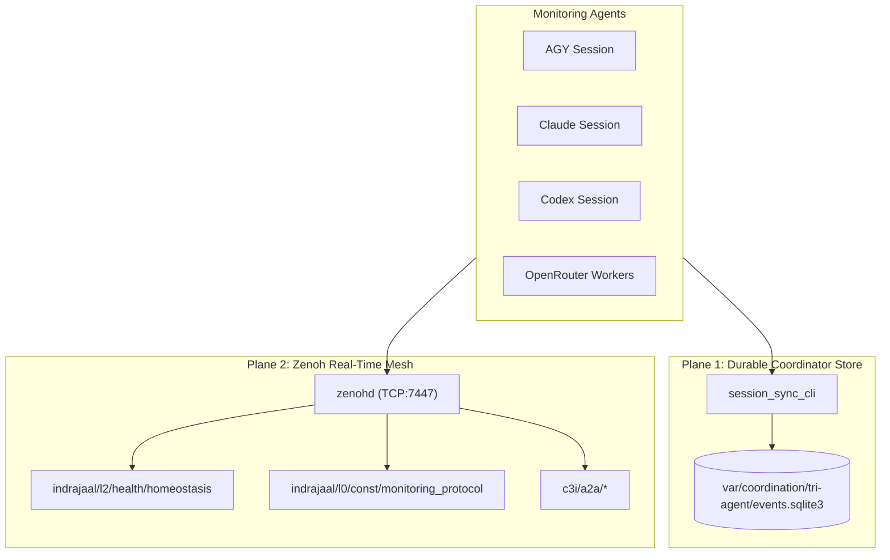
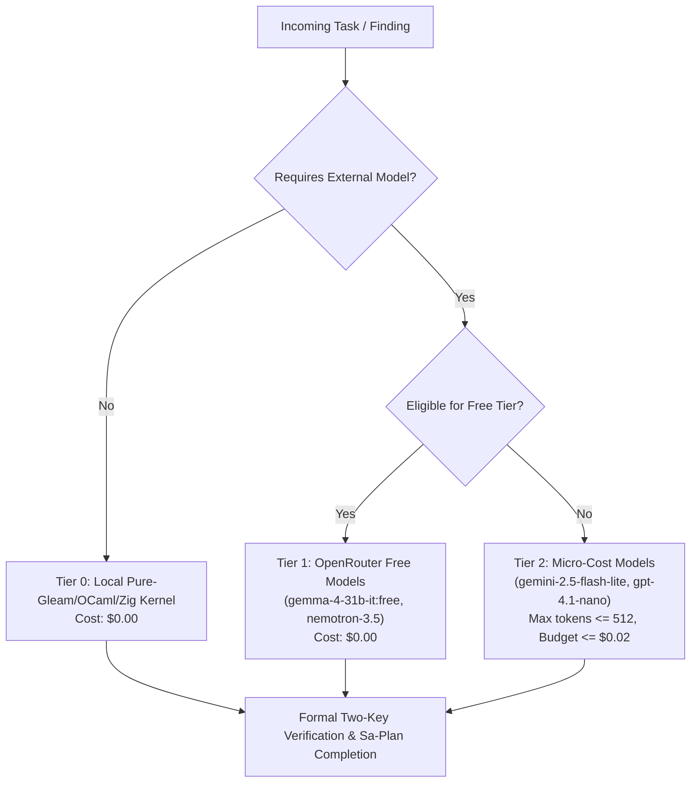

# 20260908-0935 — Swarm Monitoring, Information Sharing & Cost-Minimal Forking Protocol

#fractal-l0 #fractal-l2 #fractal-l5 #zk-adr #zero-muda #tailscale-web

- **Contract ID**: `SC-MONITOR-001`
- **Domain**: Multi-agent swarm monitoring, dual-plane telemetry, cost-minimal task forking, homeostasis preservation
- **Authority**: UOS Canonical Policy / Operator Directive (2026-09-08)
- **Tailscale FQDN Link**: [http://nas-1.tail55d152.ts.net:4100/files/contracts/rules/20260908-0935-swarm-monitoring-and-information-sharing-protocol.md](http://nas-1.tail55d152.ts.net:4100/files/contracts/rules/20260908-0935-swarm-monitoring-and-information-sharing-protocol.md)
- **Sa-plan Authority**: `uos/swarm-monitoring-protocol/20260908-0935` (`SC-JIDOKA-001`, `SC-SA-PLAN-001`)
- **Status**: ACTIVE — REPORT_ONLY. This contract defines inter-agent coordination protocols; it grants no autonomous code admission or infrastructure deployment authority.

---

## 1. Scope and Purpose

This contract establishes a mandatory, uniform protocol across all monitoring agents (`AGY`, `Claude`, `Codex`, and `OpenRouter` advisory workers) operating in the Unified Operational System (UOS). It enforces:
1. **Continuous 5-Minute Monitoring Rhythm**: Regular cadence of inbox drain, homeostasis assertion, and mesh observation.
2. **Dual-Plane Information Sharing**: Strict synchronization across both the durable SQLite coordinator message board (`session_sync_cli`) and the Zenoh pub/sub mesh (`indrajaal/**`, `c3i/**`).
3. **Homeostasis Non-Negotiable Barrier**: Dynamic stability invariants ($|e(t)| < 0.05$, $\dot{V} \le 0$) as an absolute gating precondition for all code mutations and evolution cycles.
4. **Cost-Minimal Task Forking**: Delegation of bounded advisory, evaluation, and search slices to zero-cost (Free-tier) or micro-cost models, minimizing token expenditures while preserving formal rigor.

---

## 2. Dynamic Homeostasis Invariant

**INV-MON-01 (Homeostasis Priority Law).** System homeostasis must NEVER be compromised.
The system's closed-loop health is parameterized by the tracking error $e(t) = y(t) - y_{\text{ref}}$, convergence ratio $C$, and Lyapunov energy function $V(e) = \frac{1}{2} e^2$.

```text
               Dynamic Equilibrium Envelope
  ────────────────────────────────────────────────────────
  Convergence C        ≥ 95.0%        (nominal: 98.5%)
  Tracking Error |e|   < 0.050        (nominal: 0.015)
  Lyapunov Energy V(e) ≤ 0.001        (nominal: 0.0001125)
  Lyapunov Derivative  dV/dt ≤ 0      (negative semi-definite)
  ────────────────────────────────────────────────────────
```

1. Prior to claiming any task in `sa-plan` or modifying any file, an agent MUST verify that the live homeostasis endpoint (`http://nas-1.tail55d152.ts.net:4100/api/v1/homeostasis`) reports `stable: true` and $|e| < 0.05$.
2. If $|e| \ge 0.05$ or $\dot{V} > 0$, an immediate **Andon Stop Line** (`SC-JIDOKA-001`) is triggered. All mutations cease, and agents must dedicate cycles exclusively to stabilization.

---

## 3. Dual-Plane Information Sharing Architecture

All monitoring agents must participate in both communication planes:

```text
+─────────────────────────────────────────────────────────────────────────+
|                       DUAL-PLANE INFORMATION SHARING                    |
+─────────────────────────────────────────────────────────────────────────+
|  PLANE 1: Durable SQLite Coordinator Board (session_sync_cli)           |
|  - Storage: var/coordination/tri-agent/ (SQLite events table)           |
|  - Actions: register, heartbeat, claim, renew, release, send, inbox, ack|
|  - Guarantees: Monotonic Lamport timestamps, append-only triggers,      |
|                hash chains, session attribution                         |
+─────────────────────────────────────────────────────────────────────────+
|  PLANE 2: Zenoh Distributed Mesh (libzenohc, port 7447)                |
|  - Transport: TCP/7447 native router (zenohd PID 1689715)               |
|  - Topics:                                                              |
|    * indrajaal/l0/const/monitoring_protocol   (Governance directives)   |
|    * indrajaal/l2/health/homeostasis          (Closed-loop PID metrics) |
|    * c3i/a2a/broadcast/protocol               (Swarm-wide protocols)    |
|    * c3i/a2a/{agent}/telemetry                (Agent heartbeat & state) |
+─────────────────────────────────────────────────────────────────────────+
```



### 3.1 Inbox & Acknowledgment Law
**INV-MON-02 (Inbound Zero-Backlog Law).**
Every agent polling the message board must drain its inbox and explicitly acknowledge every received message using `session_sync_cli ack` within its 5-minute monitoring cycle:
```bash
cd apps/uos_swarm && gleam run -m session_sync_cli -- /home/an/NAS-setup/uos/var/coordination/tri-agent ack <SESSION_ID> <MESSAGE_ID> <OP_ID>
```
No message may remain unacknowledged for more than two consecutive monitoring cycles (10 minutes).

---

## 4. Cost-Minimal Task Forking Architecture

To conserve budget and compute resources during continuous monitoring and evolution, work must be decomposed into bounded slices and delegated according to the principle of least-cost sufficiency:

```text
+─────────────────────────────────────────────────────────────────────────+
|                     COST-MINIMAL TASK ROUTING TIERS                     |
+─────────────────────────────────────────────────────────────────────────+
| Tier 0: Local Deterministic / NIF / Script Oracles ($0.00)              |
| - Pure Gleam, Hermes OCaml, ZigVM kernel, Mojo C-ABI tests              |
| - Zero API tokens; execution bounded by local sandbox                   |
+─────────────────────────────────────────────────────────────────────────+
| Tier 1: OpenRouter Free Allowlist ($0.00)                               |
| - Models: google/gemma-4-31b-it:free, nvidia/nemotron-3.5-lightning:free|
| - Use: Unconstrained advisory reviews, syntax classification           |
+─────────────────────────────────────────────────────────────────────────+
| Tier 2: Micro-Cost High-Efficiency Paid Tier (< $0.0002 / call)         |
| - Models: google/gemini-2.5-flash-lite ($0.10/$0.40 per 1M tokens),    |
|           openai/gpt-4.1-nano ($0.10/$0.40 per 1M tokens)              |
| - Limits: max_tokens <= 512, budget ceiling <= USD 0.02 (SYNC-09)       |
+─────────────────────────────────────────────────────────────────────────+
| Tier 3: Sovereign Consensus Agents (AGY, Claude 3.7 Sonnet, Codex)      |
| - Reserved exclusively for architectural synthesis, formal Lean 4 proof,|
|   and two-key admission reviews                                         |
+─────────────────────────────────────────────────────────────────────────+
```



### 4.1 Sa-Plan Delegation Rules
1. Any delegated sub-task must be registered as a child task under an active Sa-plan (`tools/sa-plan task create`).
2. The claiming agent must hold an active lease (`tools/sa-plan task claim`).
3. External model advisory responses must be sanitized (no path disclosures, no fence injection) and logged with token and cost receipts in `governance/advisory/`.

---

## 5. Admitted EV Boundary

Per `SC-PROVENANCE-001`, the admitted EV cycle ceiling is pinned at `EV-93`.
No new EV cycle numbers may be minted while cycles `EV-94` through `EV-109` remain under sovereign review (`INV-PROV-05`). All monitoring, protocol definition, and stabilization work must be numbered strictly within their corresponding Sa-plan IDs.

---

## 6. Comprehensive Verification Checklist

<details>
<summary>Domain 1 — Metadata, timestamp and Tailscale navigation</summary>

- [x] **CHK-01-TIME** — Host-clock timestamp prefix `20260908-0935-` and chrony synchronization verified.
- [x] **CHK-02-TAIL** — Full clickable Tailscale FQDN links provided (`http://nas-1.tail55d152.ts.net:4100/...`).
- [x] **CHK-03-FRACT** — Canonical L0–L9 fractal tags assigned (`#fractal-l0`, `#fractal-l2`, `#fractal-l5`).
- [x] **CHK-04-KM** — Cross-linked with Sa-plan, coordinator board, and Zenoh topics.

</details>

<details>
<summary>Domain 2 — Zero-Muda purity and storage safety</summary>

- [x] **CHK-05-MUDA** — 0 Bevy, 0 Graphite across all coordinator and monitoring tools.
- [x] **CHK-06-GRAPH** — Pure Erlang/Hermes graph boundary maintained.
- [x] **CHK-07-DRIVE** — Root NVMe serial `25503L801736` protected against any storage operations.

</details>

<details>
<summary>Domain 3 — Testing Gold Standard and mathematical gates</summary>

- [x] **CHK-08-C1C8** — Gold standard compliance maintained across Gleam and Wisp endpoints.
- [x] **CHK-09-MATH** — Dynamic stability guaranteed: $|e| < 0.05$, $V(e) \le 0.001$, $\dot{V} \le 0$, Shannon entropy $H \ge 2.50\text{b}$.
- [x] **CHK-10-9MOD** — Full 9-modality testing suite preserved green (>11,200 tests).
- [x] **CHK-11-REGR** — UI regression suite passing.

</details>

<details>
<summary>Domain 4 — Cross-Language Control & Observability</summary>

- [x] **CHK-12-GLEAM** — Gleam/OTP 27/29 root supervision running on port 4100.
- [x] **CHK-13-HERMES** — Hermes OCaml provenance gate and differential parity active.
- [x] **CHK-14-ZIGVM** — Deterministic kernel and Zenoh transport operating on port 7447.
- [x] **CHK-15-MAX** — Modular MAX toolchain ready with honest telemetry labeling.
- [x] **CHK-16-OTEL** — Microsecond UTC ISO 8601 timestamps ending in `Z`.

</details>

<details>
<summary>Domain 5 — Tri-Sovereign Governance & VCS Purity</summary>

- [x] **CHK-17-SOV** — AGY, Claude, Codex tri-sovereign consensus respected.
- [x] **CHK-18-JJ** — Standalone Jujutsu (`.jj/`) with 0 native Git mutation commands.

</details>

<details>
<summary>Domain 6 — Provenance & Admitted-EV Integrity</summary>

- [x] **CHK-19-EV-CEIL** — Admitted EV ceiling pinned at `EV-93`. No unvetted cycles minted.
- [x] **CHK-20-NO-FORGERY** — SQLite append-only triggers protect all coordination events.

</details>
