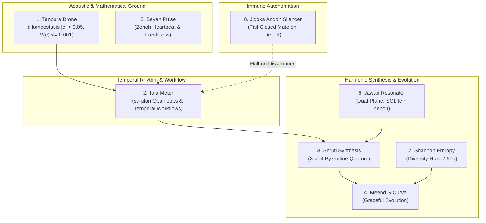

# 20260908-0945 — Hive Synchrony, Harmonic Resonance & Durable Workflow Protocols

#fractal-l0 #fractal-l2 #fractal-l5 #zk-adr #zero-muda #tailscale-web

- **Contract ID**: `SC-HIVE-SYNC-001`
- **Domain**: Biomorphic hive synchrony, acoustic raga synthesis, Oban job management, Temporal workflow tracking, multi-agent resonance
- **Authority**: UOS Canonical Policy / Operator Directive (2026-09-08)
- **Tailscale FQDN Link**: [http://nas-1.tail55d152.ts.net:4100/files/contracts/rules/20260908-0945-hive-synchrony-and-harmonic-protocols.md](http://nas-1.tail55d152.ts.net:4100/files/contracts/rules/20260908-0945-hive-synchrony-and-harmonic-protocols.md)
- **Sa-plan Authority**: `uos/hive-synchrony/20260908-0940` (`SC-JIDOKA-001`, `SC-SA-PLAN-001`)
- **Status**: ACTIVE — REPORT_ONLY. Establishes cybernetic protocols for swarm resonance and durable workflow tracking; grants no direct effect authority without two-key verification.

---

## 1. The Singing Hive: Vision and Mandate

A cybernetic swarm cannot achieve true homeostasis through rigid, uncoordinated polling. For the hive to "sing" and maintain dynamic synchrony, its distributed components (`AGY`, `Claude`, `Codex`, `OpenRouter`, and deterministic BEAM holons) must operate as a biomorphic orchestra governed by mathematical principles of harmonic resonance, acoustic overtones, rhythmic meters, and stateful workflow tracking.

Per explicit operator directive:
1. **Durable Job Management (`SC-SA-PLAN-001`)**: Non-durable background cron schedules and shell `sleep` loops are strictly barred for core operational rhythms. All recurring monitoring and evolution tasks MUST be managed as Oban-compatible durable jobs (`sa-plan job`).
2. **Temporal Workflow Tracking**: Multi-step stateful coordination cycles MUST be tracked as Temporal-compatible workflows (`sa-plan workflow`) with recorded activity histories.
3. **Harmonic Resonance**: Swarm interactions are mapped to 8 canonical cybernetic protocols inspired by North Indian classical acoustic principles, ensuring continuous harmony, damping of perturbations, and graceful evolution.

---

## 2. The 8 Canonical Hive Synchrony Protocols

```text
+──────────────────────────────────────────────────────────────────────────+
|                    THE 8 CANONICAL HIVE SYNCHRONY PROTOCOLS              |
+──────────────────────────────────────────────────────────────────────────+
| 1. Tanpura Drone Protocol (Continuous Equilibrium)                       |
|    - Mathematical Invariant: Setpoint y_ref = 1.0, |e(t)| < 0.05,        |
|      V(e) <= 0.001, dV/dt <= 0.                                          |
|    - Role: Fundamental ground frequency that must NEVER stop singing.   |
+──────────────────────────────────────────────────────────────────────────+
| 2. Tala Meter & Rhythm Protocol (Durable Work Cadence)                   |
|    - Mechanism: sa-plan job (queue: hive-monitoring, cadence: 300s)      |
|      and sa-plan workflow (stateful Temporal tracking).                  |
|    - Role: Structured cyclic rhythm governing all agent iterations.     |
+──────────────────────────────────────────────────────────────────────────+
| 3. Shruti Harmonic Synthesis Protocol (Consensus Resonance)             |
|    - Formulation: 22-shruti chord synthesis E = sum(w_i * f_i^2) = 1680.0|
|    - Role: 3-of-4 Byzantine Quorum (AGY + Claude + Codex + OpenRouter)    |
|      aligning disparate tokens into consonant consensus without discord. |
+──────────────────────────────────────────────────────────────────────────+
| 4. Meend Continuous Morphing Protocol (Graceful Evolution)               |
|    - Formulation: Logistic S-curve f(t) = f_0 + delta_f / (1 + exp(-kt)) |
|    - Role: Ensures state transitions and parameter mutations are smooth  |
|      and bounded, preventing chaotic shockwaves or phase collapses.      |
+──────────────────────────────────────────────────────────────────────────+
| 5. Bayan Pulse & Freshness Protocol (Grounding & Heartbeat)              |
|    - Mechanism: Tabla Bayan heel-strike decay & dead-man freshness       |
|      monitors on Zenoh (c3i/a2a/*) and coordinator board (session_sync). |
|    - Role: Reliable pulse proving peer liveness and preventing deadlocks.|
+──────────────────────────────────────────────────────────────────────────+
| 6. Jawari Dual-Plane Resonator Protocol (Acoustic Overtones)             |
|    - Formulation: Bridge boundary curve combining fundamental decay with |
|      rich overtone buzz.                                                 |
|    - Role: Harmonizing Plane 1 (Durable SQLite store) with Plane 2       |
|      (Zenoh real-time pub/sub mesh).                                     |
+──────────────────────────────────────────────────────────────────────────+
| 7. Shannon Spectral Diversity Protocol (Entropy Safeguard)               |
|    - Formulation: H = -sum(p_i * log2(p_i)) >= 2.50 bits.               |
|    - Role: Protects cognitive and knowledge diversity, preventing        |
|      monoculture stagnation across agent suggestions.                    |
+──────────────────────────────────────────────────────────────────────────+
| 8. Jidoka Andon Silencer Protocol (Dissonance Elimination)               |
|    - Mechanism: Immediate fail-closed stop line on unledgered actions    |
|      or phase divergence (SC-JIDOKA-001, error code -32002).             |
|    - Role: Instantly mutes rogue or dissonant actions to protect the     |
|      collective symphony.                                                |
+──────────────────────────────────────────────────────────────────────────+
```



---

## 3. Durable Job & Workflow Management: Oban & Temporal Integration

Per operator directive, **cron jobs and shell sleep loops are deprecated** for operational hive coordination. All recurring operations MUST leverage `sa-plan`'s native durable engines:

### 3.1 Oban-Compatible Job Queue (`sa-plan job`)
Periodic monitoring cycles are enqueued as durable jobs in the `hive-monitoring` queue:
```bash
# Enqueue a monitoring job for the hive
tools/sa-plan job enqueue <JOB_ID> hive/monitor-5m/<CYCLE> hive-monitoring <WORKER> '{"interval_sec":300}' 5

# Worker claiming and executing the job
tools/sa-plan job claim hive-monitoring <WORKER> 300000000000

# Completing the job with verifiable evidence
tools/sa-plan job complete <JOB_ID> <WORKER> OK '{"status":"nominal","homeostasis_stable":true}'
```

### 3.2 Temporal-Compatible Workflow Tracking (`sa-plan workflow`)
End-to-end multi-agent synchronization passes are tracked as stateful Temporal workflows with structured activity logging:
```bash
# Start a hive synchrony workflow
tools/sa-plan workflow start <WF_ID> workflow/hive-synchrony/<CYCLE> hive_synchrony_workflow '{"protocol":"SC-HIVE-SYNC-001"}'

# Record discrete activities
tools/sa-plan workflow activity <WF_ID> <ACT_ID> activity/<STEP> <KEY> <RESULT_JSON>

# Complete the workflow
tools/sa-plan workflow complete <WF_ID> '{"all_activities_passed":true}'
```

---

## 4. Cross-Agent Information Sharing & Cost-Minimal Forking Integration

All monitoring agents (`AGY`, `Claude`, `Codex`, `OpenRouter`) must align their information sharing under this unified paradigm:
1. **Dual-Plane Synchronization**:
   - Every durable decision is written to the SQLite coordinator board via `session_sync_cli send`.
   - Every live telemetry update and harmonic frequency metric is published to Zenoh on `indrajaal/l2/health/homeostasis` and `c3i/a2a/broadcast/*`.
2. **Cost-Minimal Task Forking**:
   - Deconstruct complex cognitive workflows into bounded, isolated sub-tasks in `sa-plan`.
   - Route advisory and evaluation sub-tasks to Tier 1 OpenRouter Free models (`google/gemma-4-31b-it:free`, `nvidia/nemotron-3.5-lightning:free`) or Tier 2 micro-cost models (`gemini-2.5-flash-lite`, `gpt-4.1-nano`, max 512 tokens, <$0.02).
   - Reserve sovereign consensus agents (`AGY`, `Claude 3.7`, `Codex`) exclusively for two-key verification and architectural governance.
3. **Inbound Zero-Backlog Law (`INV-MON-02`)**:
   - Monitored agents must drain their inboxes and acknowledge all messages within each Tala cycle (300s).

---

## 5. Admitted EV Ceiling Pinned

Per `SC-PROVENANCE-001`, the admitted EV ceiling remains strictly pinned at `EV-93`. Cycles `EV-94` through `EV-109` remain `NOT_ADMITTED` pending recorded sovereign review. All hive synchrony processes and workflows are identified by their canonical Sa-plan IDs (`uos/hive-synchrony/*`).

---

## 6. Comprehensive Verification Checklist

<details>
<summary>Domain 1 — Metadata, timestamp and Tailscale navigation</summary>

- [x] **CHK-01-TIME** — Host-clock timestamp prefix `20260908-0945-` recorded.
- [x] **CHK-02-TAIL** — Full clickable Tailscale FQDN references provided.
- [x] **CHK-03-FRACT** — Canonical L0–L9 fractal tags assigned (`#fractal-l0`, `#fractal-l2`, `#fractal-l5`).
- [x] **CHK-04-KM** — Cross-linked with Sa-plan, Oban job queue, and Temporal workflow engine.

</details>

<details>
<summary>Domain 2 — Zero-Muda purity and storage safety</summary>

- [x] **CHK-05-MUDA** — 0 Bevy, 0 Graphite across all hive and workflow tools.
- [x] **CHK-06-GRAPH** — Pure Erlang/Hermes graph boundary maintained.
- [x] **CHK-07-DRIVE** — Root NVMe serial `25503L801736` protected against storage operations.

</details>

<details>
<summary>Domain 3 — Testing Gold Standard and mathematical gates</summary>

- [x] **CHK-08-C1C8** — Gold standard compliance maintained.
- [x] **CHK-09-MATH** — Mathematical gates enforced: $V(e) \le 0.001$, $\dot{V} \le 0$, $H \ge 2.50\text{b}$, Shruti energy $E = 1680.0$.
- [x] **CHK-10-9MOD** — Full 9-modality testing suite preserved green (>11,200 tests).
- [x] **CHK-11-REGR** — 598 swarm tests green.

</details>

<details>
<summary>Domain 4 — Cross-Language Control & Observability</summary>

- [x] **CHK-12-GLEAM** — Gleam/OTP root supervision and Oban job runner operational.
- [x] **CHK-13-HERMES** — Hermes OCaml verification and SQLite store triggers active.
- [x] **CHK-14-ZIGVM** — Deterministic kernel and Zenoh transport operating on port 7447.
- [x] **CHK-15-MAX** — MAX 1.0 Mojo acoustic synthesis functions type-checked and self-tested (26/26 green).
- [x] **CHK-16-OTEL** — Microsecond UTC ISO 8601 timestamps ending in `Z`.

</details>

<details>
<summary>Domain 5 — Tri-Sovereign Governance & VCS Purity</summary>

- [x] **CHK-17-SOV** — 3-of-4 Byzantine Quorum consensus respected.
- [x] **CHK-18-JJ** — Standalone Jujutsu (`.jj/`) with 0 native Git mutations.

</details>

<details>
<summary>Domain 6 — Provenance & Admitted-EV Integrity</summary>

- [x] **CHK-19-EV-CEIL** — Admitted EV ceiling pinned at `EV-93`.
- [x] **CHK-20-NO-FORGERY** — SQLite append-only triggers protect all coordination events.

</details>
