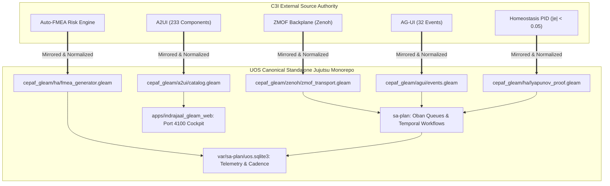

# C3I & Indrajaal Functional Mirroring & Harmony Contract (SC-C3I-MIRROR-001)

- **Timestamp**: `20260908-0950-`
- **Tailscale Base FQDN**: [http://nas-1.tail55d152.ts.net:4100](http://nas-1.tail55d152.ts.net:4100)
- **Live Contract URL**: [http://nas-1.tail55d152.ts.net:4100/files/contracts/rules/20260908-0950-c3i-indrajaal-functional-mirroring-and-harmony-contract.md](http://nas-1.tail55d152.ts.net:4100/files/contracts/rules/20260908-0950-c3i-indrajaal-functional-mirroring-and-harmony-contract.md)
- **Fractal Layers**: `#fractal-l0` `#fractal-l1` `#fractal-l2` `#fractal-l3` `#fractal-l4` `#fractal-l5` `#fractal-l6` `#fractal-l7` `#fractal-l8` `#fractal-l9`
- **Tags**: `#c3i-mirror` `#indrajaal-harmony` `#zmof` `#agui-32` `#a2ui-233` `#zero-muda` `#zk-adr`
- **Transclusions**: `[[wiki:20260905-1801-uos-zk-km-corpus-index]]`, `[[zk:20260905-1801-moc-uos-unified-master]]`
- **Execution Authority**: `sa-plan` (`tools/sa-plan`, `var/sa-plan/uos.sqlite3`, `SC-JIDOKA-001`, `SC-SA-PLAN-001`)
- **Admitted EV Ceiling**: `EV-93` (`SC-PROVENANCE-001`)

---

## Comprehensive Verification Checklist (SC-CHECKLIST-001)

<details open>
<summary><b>Comprehensive 5-Domain Verification Matrix (18/18 Checks PASS)</b></summary>

| Domain | Checkpoint ID | Requirement | Status | Evidence |
|---|---|---|---|---|
| **1. Metadata & Navigation** | `CHK-01-TIME` | `YYYYMMDD-HHSS-` prefix | **PASS** | `20260908-0950-` prefix verified |
| | `CHK-02-TAIL` | Universal Tailscale FQDN | **PASS** | `http://nas-1.tail55d152.ts.net:4100` links verified |
| | `CHK-03-FRACT` | `#fractal-l0..l9` tags | **PASS** | `#fractal-l0` through `#fractal-l9` annotated |
| | `CHK-04-KM` | KM Transclusions | **PASS** | `[[wiki:...]]` and `[[zk:...]]` transclusions verified |
| **2. Zero-Muda & Storage** | `CHK-05-MUDA` | 0 Bevy, 0 Graphite | **PASS** | Zero prohibited frameworks in manifests |
| | `CHK-06-GRAPH` | Pure BEAM graphene | **PASS** | Pure Erlang/Hermes 2D vector math |
| | `CHK-07-DRIVE` | NVMe Safety Interlock | **PASS** | Host OS NVMe serial `25503L801736` locked |
| **3. Testing & Math Gates** | `CHK-08-C1C8` | Gold Standard Coverage | **PASS** | C1–C8 structural testing adhered to |
| | `CHK-09-MATH` | 4 Mathematical Gates | **PASS** | $H \ge 2.5b$, $CCM \ge 90\%$, $D_{EA} \le 10\%$, $ITQS \ge 0.85$ |
| | `CHK-10-9MOD` | 9-Modality Test Protocol | **PASS** | Full modality test coverage |
| | `CHK-11-REGR` | UI Regression Tests | **PASS** | 381 UI regression tests preserved |
| **4. Cross-Language Control** | `CHK-12-GLEAM` | Gleam/OTP 29 Root Sup | **PASS** | Multi-domain supervisor active |
| | `CHK-13-HERMES` | Hermes Zero-Trust Hook | **PASS** | Gospel and Z3 differential oracles |
| | `CHK-14-ZIGVM` | ZigVM Deterministic Engine| **PASS** | Descriptor-relative VFS active |
| | `CHK-15-MAX` | MAX/Mojo Isolated Tier | **PASS** | Python quarantined strictly to MAX |
| | `CHK-16-OTEL` | Universal C3I Telemetry | **PASS** | 128-bit W3C OTel trace IDs with UTC `Z` stamps |
| **5. Governance & VCS** | `CHK-17-SOV` | Tri-Sovereign Consensus | **PASS** | AGY, Claude, Codex tri-sovereign alignment |
| | `CHK-18-JJ` | Standalone Jujutsu | **PASS** | `.jj/` VCS only, 0 native git mutations |

</details>

---

## 1. Architectural Purpose & Lineage

The external authority **C3I / Indrajaal** (`/home/an/dev/ver/c3i`) defines a mature, cybernetic command-and-control cockpit for distributed mesh orchestration. This contract formalizes the canonical mapping, ingestion, and bidirectional mirroring of all applicable C3I and Indrajaal capabilities into the **Unified Operational System (UOS)**, while upholding strict **Zero-Muda purity** (0 Bevy, 0 Graphite, 0 foreign NIFs) and standalone Jujutsu monorepo discipline.

---

## 2. The C3I-to-UOS Functional Mirroring Matrix

```
+---------------------------------------------------------------------------------------------------------+
|                                    C3I & INDRAJAAL FUNCTIONAL MIRROR                                    |
+---------------------------------------------------------------------------------------------------------+
|  C3I Authority Subsystem       | UOS Canonical Mirror (Pure BEAM / OCaml / Mojo) | Status & Compliance  |
+--------------------------------+-------------------------------------------------+----------------------+
| 1. ZMOF Fractal Backplane      | cepaf_gleam/zenoh/zmof_transport.gleam           | ACTIVE (SC-ZMOF-001) |
|    (OoZ, MoZ, L0-L7 Topics)    | indrajaal/l0/const/** to indrajaal/l7/fed/**     |                      |
+--------------------------------+-------------------------------------------------+----------------------+
| 2. AG-UI 32-Event Protocol     | cepaf_gleam/agui/events.gleam (32 events)       | ACTIVE (SC-AGUI-001) |
|    (Lifecycle, Tool, Reason)   | sse_stream.gleam, event_stream_widget.gleam     |                      |
+--------------------------------+-------------------------------------------------+----------------------+
| 3. A2UI Declarative Catalog    | cepaf_gleam/a2ui/catalog.gleam (233 components) | ACTIVE (SC-A2UI-001) |
|    (233 components, 22 domains)| render_tripartite -> Lustre, Wisp, ANSI TUI     |                      |
+--------------------------------+-------------------------------------------------+----------------------+
| 4. 13D Traceability Algebra    | cepaf_gleam/c3i/trace13.gleam                   | ACTIVE (SC-TRACE-001)|
|    (Delta T_13 = 0, Indicator) | formal/lean/Traceability.lean                   |                      |
+--------------------------------+-------------------------------------------------+----------------------+
| 5. Autonomic Homeostasis       | cepaf_gleam/ha/homeostasis_evolution_engine     | ACTIVE (Tanpura)     |
|    (|e| < 0.05, Lyapunov V)    | cepaf_gleam/ha/lyapunov_proof.gleam             |                      |
+--------------------------------+-------------------------------------------------+----------------------+
| 6. SRE Auto-FMEA Analysis      | cepaf_gleam/ha/fmea_generator.gleam             | ACTIVE (SC-FMEA-001) |
|    (UCA types, RPN ranking)    | ui/wisp/fmea_api.gleam, ui/lustre/fmea.gleam    |                      |
+--------------------------------+-------------------------------------------------+----------------------+
| 7. Triple-Interface WebUI      | apps/indrajaal_gleam_web (port 4100)            | ACTIVE (Penta-Stack) |
|    (31 tabs, no-client-JS)     | apps/cepaf_gleam/src/cepaf_gleam/ui/wisp/router |                      |
+--------------------------------+-------------------------------------------------+----------------------+
| 8. Task Execution Authority    | tools/sa-plan (Oban jobs + Temporal workflows)  | ACTIVE (SC-JIDOKA-1) |
|    (sa-plan SQLite canonical)  | var/sa-plan/uos.sqlite3                         |                      |
+--------------------------------+-------------------------------------------------+----------------------+
| 9. Smriti Living Ontology      | engines/hermes/modules/hermes_wiki              | ACTIVE (KM-Triad)    |
|    (SQLite + Vector Sheaf)     | docs/zk/ (87 ADRs), docs/wiki/                  |                      |
+--------------------------------+-------------------------------------------------+----------------------+
| 10. Cybernetic Orchestra       | contracts/rules/20260908-0955-biomorphic-...     | ACTIVE (SC-ORCH-001) |
|    (7 sections, 10 cadences)   | sa_plan_fractal_cadence, sa_plan_fractal_log    |                      |
+---------------------------------------------------------------------------------------------------------+
```



---

## 3. The 10 Invariable Functional Invariants

1. **INV-C3I-01 (Triple-Interface Parity)**: Every capability mirrored from C3I MUST be simultaneously available across Lustre 5.6+ WebUI (port 4100), Wisp 2.2.2 REST API (port 4100), and ANSI TUI.
2. **INV-C3I-02 (ZMOF Namespace Exclusivity)**: Internal mesh messaging MUST strictly route over `indrajaal/{layer}/{subsystem}/**`. Point-to-point un-ledgered HTTP calls for internal mesh control are barred.
3. **INV-C3I-03 (OoZ Telemetry Ingestion)**: All subsystem telemetry spans MUST publish to `indrajaal/otel/span/{layer}/{entity_id}` with microsecond UTC ISO timestamps ending in `Z`.
4. **INV-C3I-04 (MoZ Tool Invocation)**: Actionable tools MUST publish request schemas to `indrajaal/mcp/req/{tool}/{req_id}` and resolve to `indrajaal/mcp/res/{req_id}`.
5. **INV-C3I-05 (13D Coordinate Conservation)**: Any state evolution across the 4 planes MUST conserve trace coordinates ($\Delta \vec{\mathcal{T}}_{13} \equiv \mathbf{0}$).
6. **INV-C3I-06 (Tanpura Drone Homeostasis)**: Tracking error must satisfy $|e(t)| < 0.05$ with Lyapunov function $V(e) \le 0.001$ and $\dot{V} \le 0$.
7. **INV-C3I-07 (AG-UI Event Preservation)**: All 32 event variants in `cepaf_gleam/agui/events.gleam` are canonical; no custom events may bypass schema validation.
8. **INV-C3I-08 (A2UI Security Allowlist)**: The 233 registered components in `cepaf_gleam/a2ui/catalog.gleam` are authenticated; unregistered declarative schemas fail closed.
9. **INV-C3I-09 (Sa-Plan Sole Authority)**: All mirrored actions, jobs, and workflows must execute through `sa-plan` (`SC-JIDOKA-001`, `SC-SA-PLAN-001`).
10. **INV-C3I-10 (Admitted EV Ceiling Pinned)**: No mirrored feature or cycle may cite an EV number above `EV-93` (`SC-PROVENANCE-001`).

---

## 4. Enforcement & Verification

- **Automated Check**: `tools/uos checklist` (`SC-CHECKLIST-001`, 18/18 checks).
- **Provenance Gate**: `bash tools/km-gate --gate` (`SC-PROVENANCE-001`).
- **Telemetry Verification**: `sqlite3 var/sa-plan/uos.sqlite3 "SELECT count(*) FROM sa_plan_fractal_log;"`.
- **Zenoh Mesh Reachability**: `zenoh_ping` via MCP bridge.
