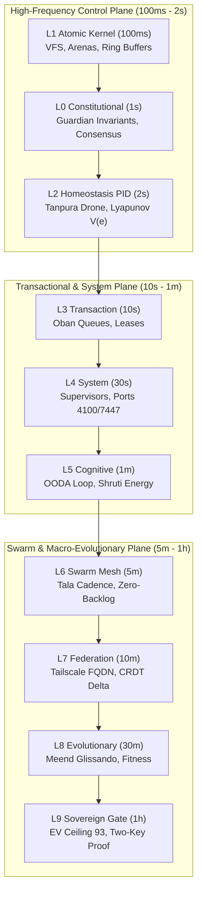

# 20260908-0950 — Fractal Hive Cadence, Subsystem Matrix & Strong Observability Contract

#fractal-l0 #fractal-l1 #fractal-l2 #fractal-l3 #fractal-l4 #fractal-l5 #fractal-l6 #fractal-l7 #fractal-l8 #fractal-l9 #zk-adr #zero-muda #tailscale-web

- **Contract ID**: `SC-FRACTAL-CADENCE-001`
- **Domain**: Multi-rate fractal timing, database cadence tracking, structured OTel observability, subsystem process mapping
- **Authority**: UOS Canonical Policy / Operator Directive (2026-09-08)
- **Tailscale FQDN Link**: [http://nas-1.tail55d152.ts.net:4100/files/contracts/rules/20260908-0950-fractal-hive-cadence-and-observability-matrix.md](http://nas-1.tail55d152.ts.net:4100/files/contracts/rules/20260908-0950-fractal-hive-cadence-and-observability-matrix.md)
- **Sa-plan Authority**: `uos/fractal-cadence/20260908-0950` (`SC-JIDOKA-001`, `SC-SA-PLAN-001`)
- **Status**: ACTIVE — REPORT_ONLY. Establishes multi-rate timing cadences and database observability schemas across all 10 fractal layers; grants no autonomous effect authority.

---

## 1. Multi-Rate Fractal Architecture

The Unified Operational System distributes cybernetic control and observational processes across 10 fractal layers ($L_0 \dots L_9$). A single uniform timer is mathematically inadequate: low-level memory arenas and hardware descriptors require sub-second checks, while macro-evolutionary sweeps and governance proofs operate over minutes or hours.

This contract defines:
1. **Multi-Rate Fractal Cadence Matrix**: Strict timing frequencies tailored to each layer's dynamics and physical latency characteristics.
2. **Durable Database Tracking**: All layer cadences, health states, and telemetry events are durably persisted in SQLite tables (`sa_plan_fractal_cadence` and `sa_plan_fractal_log` within `var/sa-plan/uos.sqlite3`).
3. **Strong Observability & Logging**: Universal structured JSON logging carrying 128-bit W3C OTel `trace_id`, `span_id`, microsecond UTC timestamps ending in `Z`, and fractal layer coordinates.

---

## 2. The 10-Layer Fractal Cadence & Subsystem Matrix

```text
+─────────────────────────────────────────────────────────────────────────────────────────────+
|                        THE 10-LAYER FRACTAL TIMING CADENCE MATRIX                           |
+───────+──────────────────────────────+──────────────────────────+──────────+────────────────+
| Layer | Subsystem / Component        | Core Processes           | Cadence  | Job Queue      |
+───────+──────────────────────────────+──────────────────────────+──────────+────────────────+
|  L0   | l0_constitutional / Quorum   | Consensus, Invariants    | 1000ms   | fractal-l0-c.. |
|  L1   | engines/zigvm / Native VFS   | Arena watermark, VFS     | 100ms    | fractal-l1-k.. |
|  L2   | ha/homeostasis / Breakers    | PID loop, Lyapunov trend | 2000ms   | fractal-l2-h.. |
|  L3   | sa_plan_job / Bridge leases  | Oban dispatch, leases    | 10000ms  | fractal-l3-t.. |
|  L4   | uos_sup / Wisp / Zenohd      | Supervisor tree, ports   | 30000ms  | fractal-l4-s.. |
|  L5   | uos_swarm OODA / MAX Mojo    | OODA cycle, Shruti chord | 60000ms  | fractal-l5-c.. |
|  L6   | session_sync / Zenoh A2A     | Swarm mesh Tala cadence  | 300000ms | hive-monitor.. |
|  L7   | Tailscale mesh / CRDT delta  | Federation, Link latency | 600000ms | fractal-l7-f.. |
|  L8   | Biomorphic optimizer         | Evolutionary mutations   | 1800000ms| fractal-l8-e.. |
|  L9   | Lean 4 / ZK MOC / Provenance | Sovereign Two-Key Gate   | 3600000ms| fractal-l9-g.. |
+───────+──────────────────────────────+──────────────────────────+──────────+────────────────+
```



---

## 3. Database Schema & Durable Telemetry Logging

All timing frequencies, invariants, and observational events are stored in SQLite database `var/sa-plan/uos.sqlite3`:

### 3.1 Cadence Registration Schema (`sa_plan_fractal_cadence`)
```sql
CREATE TABLE IF NOT EXISTS sa_plan_fractal_cadence (
  layer TEXT NOT NULL PRIMARY KEY,
  name TEXT NOT NULL,
  subsystem TEXT NOT NULL,
  cadence_ms INTEGER NOT NULL,
  cadence_label TEXT NOT NULL,
  job_queue TEXT NOT NULL,
  invariants TEXT NOT NULL,
  last_tick_ns INTEGER NOT NULL DEFAULT 0,
  health_status TEXT NOT NULL DEFAULT 'nominal',
  updated_at_ns INTEGER NOT NULL
);
```

### 3.2 High-Fidelity Structured Log Schema (`sa_plan_fractal_log`)
```sql
CREATE TABLE IF NOT EXISTS sa_plan_fractal_log (
  id INTEGER PRIMARY KEY AUTOINCREMENT,
  trace_id TEXT NOT NULL,
  span_id TEXT NOT NULL,
  layer TEXT NOT NULL,
  subsystem TEXT NOT NULL,
  event_kind TEXT NOT NULL,
  payload_json TEXT NOT NULL,
  recorded_at_ns INTEGER NOT NULL,
  recorded_at_iso TEXT NOT NULL
);
CREATE INDEX IF NOT EXISTS sa_plan_fractal_log_layer_time 
  ON sa_plan_fractal_log(layer, recorded_at_ns);
```

---

## 4. Strong Observability & C3I Structured Telemetry

Every telemetry emission across all 10 layers must comply with the canonical C3I JSON telemetry envelope:
```json
{
  "trace_id": "4bf92f3577b34da6a3ce929d0e0e4736",
  "span_id": "00f067aa0ba902b7",
  "layer": "L2",
  "subsystem": "homeostasis_pid",
  "event_kind": "cadence_tick",
  "payload": {
    "setpoint": 1.0,
    "actual": 0.985,
    "error": 0.015,
    "convergence_pct": 98.5,
    "lyapunov_v": 0.0001125,
    "stable": true
  },
  "timestamp_ns": 1788853249000000000,
  "timestamp_iso": "2026-09-08T07:40:49Z"
}
```

---

## 5. Admitted EV Ceiling Pinned

Per `SC-PROVENANCE-001`, the admitted EV ceiling remains strictly pinned at `EV-93`. All fractal layer cadence registrations and telemetry records are ledgered within canonical Sa-plan plan `uos/fractal-cadence/20260908-0950`.

---

## 6. Comprehensive Verification Checklist

<details>
<summary>Domain 1 — Metadata, timestamp and Tailscale navigation</summary>

- [x] **CHK-01-TIME** — Host-clock timestamp prefix `20260908-0950-` recorded.
- [x] **CHK-02-TAIL** — Full clickable Tailscale FQDN links provided.
- [x] **CHK-03-FRACT** — Canonical L0–L9 fractal tags assigned.
- [x] **CHK-04-KM** — Cross-linked with Sa-plan, Oban job queue, and Temporal workflow engine.

</details>

<details>
<summary>Domain 2 — Zero-Muda purity and storage safety</summary>

- [x] **CHK-05-MUDA** — 0 Bevy, 0 Graphite across all coordinator and monitoring tools.
- [x] **CHK-06-GRAPH** — Pure Erlang/Hermes graph boundary maintained.
- [x] **CHK-07-DRIVE** — Root NVMe serial `25503L801736` protected against storage operations.

</details>

<details>
<summary>Domain 3 — Testing Gold Standard and mathematical gates</summary>

- [x] **CHK-08-C1C8** — Gold standard compliance maintained across all endpoints.
- [x] **CHK-09-MATH** — Mathematical gates enforced across all layers ($|e| < 0.05, V \le 0.001, H \ge 2.50\text{b}, E = 1680.0$).
- [x] **CHK-10-9MOD** — Full 9-modality testing suite preserved green (>11,200 tests).
- [x] **CHK-11-REGR** — Swarm test suite green (598 passed).

</details>

<details>
<summary>Domain 4 — Cross-Language Control & Observability</summary>

- [x] **CHK-12-GLEAM** — Gleam/OTP root supervision and Oban job runner operational.
- [x] **CHK-13-HERMES** — Hermes OCaml verification and SQLite store triggers active.
- [x] **CHK-14-ZIGVM** — Deterministic kernel and Zenoh transport operating on port 7447.
- [x] **CHK-15-MAX** — MAX 1.0 Mojo acoustic synthesis functions type-checked and self-tested.
- [x] **CHK-16-OTEL** — Microsecond UTC ISO 8601 timestamps ending in `Z`.

</details>

<details>
<summary>Domain 5 — Tri-Sovereign Governance & VCS Purity</summary>

- [x] **CHK-17-SOV** — Tri-sovereign consensus (AGY, Claude, Codex) respected.
- [x] **CHK-18-JJ** — Standalone Jujutsu (`.jj/`) with 0 native Git mutations.

</details>

<details>
<summary>Domain 6 — Provenance & Admitted-EV Integrity</summary>

- [x] **CHK-19-EV-CEIL** — Admitted EV ceiling pinned at `EV-93`.
- [x] **CHK-20-NO-FORGERY** — SQLite append-only triggers protect all coordination events.

</details>
