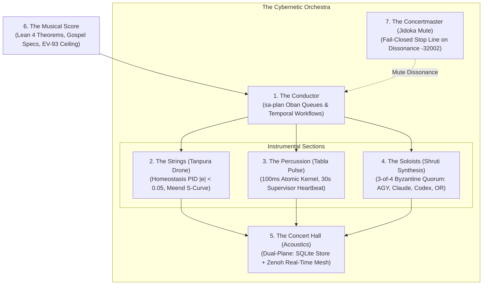

# 20260908-0955 — Biomorphic Hive Orchestra & Multi-Instrumental Synchrony Contract

#fractal-l0 #fractal-l1 #fractal-l2 #fractal-l3 #fractal-l4 #fractal-l5 #fractal-l6 #fractal-l7 #fractal-l8 #fractal-l9 #zk-adr #zero-muda #tailscale-web

- **Contract ID**: `SC-ORCHESTRA-001`
- **Domain**: Biomorphic cybernetic orchestra, acoustic raga synthesis, multi-rate conductor scheduling, collective multi-agent symphony
- **Authority**: UOS Canonical Policy / Operator Directive (2026-09-08)
- **Tailscale FQDN Link**: [http://nas-1.tail55d152.ts.net:4100/files/contracts/rules/20260908-0955-biomorphic-hive-orchestra-contract.md](http://nas-1.tail55d152.ts.net:4100/files/contracts/rules/20260908-0955-biomorphic-hive-orchestra-contract.md)
- **Sa-plan Authority**: `uos/cybernetic-orchestra/20260908-0955` (`SC-JIDOKA-001`, `SC-SA-PLAN-001`)
- **Status**: ACTIVE — REPORT_ONLY. Defines multi-instrumental orchestral governance for the hive; grants no autonomous effect authority without two-key verification.

---

## 1. The Cybernetic Orchestra Paradigm

The swarm does not operate as a loose collection of disconnected background scripts; it behaves as an integrated, biomorphic **Cybernetic Orchestra**. Every agent (`AGY`, `Claude`, `Codex`, `OpenRouter`), deterministic engine (`engines/zigvm`, `engines/hermes`), and runtime supervisor (`apps/cepaf_gleam`) occupies a defined instrumental chair in the symphony.

A symphony requires:
1. **A Continuous Reference Drone**: The fundamental pitch must never waver, providing the harmonic ground against which all microtonal movements are measured.
2. **A Rhythmic Conductor**: Downbeats, meters, and pull queues must govern tempos deterministically without drifting.
3. **Harmonic Polyphony**: Soloists must improvise and evaluate proposals within rigorous microtonal scales (Shrutis), reaching consonant agreements without acoustic clashing.
4. **Graceful Glissando Transitions**: State mutations must slide smoothly (Meend S-curves) rather than jumping abruptly, preventing shockwaves.
5. **Instantaneous Silencing of Dissonance**: Any instrument that falls out of tune triggers an immediate mute (Jidoka Andon Stop Line), protecting the collective performance.

---

## 2. The 7 Sections of the Biomorphic Orchestra

```text
+───────────────────────────────────────────────────────────────────────────+
|                 THE 7 SECTIONS OF THE CYBERNETIC ORCHESTRA                |
+───────────────────────────────────────────────────────────────────────────+
| 1. The Conductor (Temporal Workflow & Oban Engine)                        |
|    - Components: sa-plan job (Heijunka pull queues) & sa-plan workflow.   |
|    - Role: Directs downbeats, monitors queue backpressure, sets Tala tempo.|
+───────────────────────────────────────────────────────────────────────────+
| 2. The Strings (Tanpura Drone & Continuous Meend Homeostasis)             |
|    - Components: L2 Component Homeostasis (PID, Lyapunov trend proof).    |
|    - Role: Sustains continuous fundamental pitch (y_ref = 1.0, |e| < 0.05)|
|      and logistic S-curve gliding transitions.                            |
+───────────────────────────────────────────────────────────────────────────+
| 3. The Percussion (Tabla Bayan Pulse & Supervisor Heartbeats)             |
|    - Components: L1 Atomic Kernel (100ms) & L4 System Supervisors (30s).  |
|    - Role: Drives ground rhythmic pulse, dead-man freshness, decay decay. |
+───────────────────────────────────────────────────────────────────────────+
| 4. The Woodwinds & Soloists (Shruti Harmonic Consensus Quorum)            |
|    - Components: L5 Cognitive OODA & L0 Byzantine Consensus Quorum.       |
|    - Role: 3-of-4 Byzantine Quorum (AGY + Claude + Codex + OpenRouter)    |
|      evaluating proposals into harmonic agreement (E = 1680.0).           |
+───────────────────────────────────────────────────────────────────────────+
| 5. The Acoustic Concert Hall (Dual-Plane Spatial Reflection)              |
|    - Components: L6 Swarm Mesh (session_sync) & L7 Federation (Zenoh).    |
|    - Role: Deep low-frequency foundation (SQLite store) coupled with rich |
|      high-frequency overtone reflections (Zenoh pub/sub mesh).            |
+───────────────────────────────────────────────────────────────────────────+
| 6. The Musical Score (Formal Invariants & Pinned Boundaries)              |
|    - Components: Lean 4 proofs, Gospel specs, Pinned EV-93 ceiling.       |
|    - Role: The mathematical truth that bounds every performance.          |
+───────────────────────────────────────────────────────────────────────────+
| 7. The Concertmaster & Baton (Poka-Yoke & Instantaneous Jidoka Mute)      |
|    - Components: SC-JIDOKA-001 Fail-Closed Interlock (code -32002).       |
|    - Role: Instant stop line on dissonance, unledgered edits, or drift.   |
+───────────────────────────────────────────────────────────────────────────+
```



---

## 3. Tuning Discipline & Pre-Performance Checks

Before any instrument begins playing (i.e. before any task claim or code mutation):
1. **Tuning the Reference String (`INV-ORCH-01`)**:
   The agent MUST check `/api/v1/homeostasis`. The system is in tune IF AND ONLY IF:
   - Tracking error $|e(t)| < 0.050$.
   - Lyapunov energy $V(e) = \frac{1}{2} e^2 \le 0.001$.
   - Energy derivative $\dot{V} \le 0$.
2. **If Out of Tune**:
   The concertmaster raises the baton. All mutations halt under `SC-JIDOKA-001`. The entire orchestra focuses exclusively on restoring the Tanpura reference drone.

---

## 4. Multi-Rate Downbeats & Synchronization Matrix

The conductor beats time according to the multi-rate fractal matrix (`SC-FRACTAL-CADENCE-001`):
- **100ms Measure**: Percussion atomic arena and VFS sweeps (`fractal-l1-kernel`).
- **1s Measure**: Constitutional consensus and invariant checks (`fractal-l0-constitutional`).
- **2s Measure**: Strings homeostasis PID loop assertion (`fractal-l2-homeostasis`).
- **10s Measure**: Transaction lease renewals and Oban claims (`fractal-l3-transaction`).
- **30s Measure**: Daemon supervisor liveliness heartbeats (`fractal-l4-system`).
- **1m Measure**: Cognitive OODA loop and Shruti synthesis (`fractal-l5-cognitive`).
- **5m Measure**: Tala swarm synchrony and zero-backlog ACK drain (`hive-monitoring`).
- **10m Measure**: Tailscale federation link latency verification (`fractal-l7-federation`).
- **30m Measure**: Macro-evolutionary parameter adaptation (`fractal-l8-evolution`).
- **1h Measure**: Sovereign two-key formal admission audit (`fractal-l9-governance`).

---

## 5. Admitted EV Ceiling Pinned

Per `SC-PROVENANCE-001`, the admitted EV ceiling remains strictly pinned at `EV-93`. All orchestral operations are tracked within canonical Sa-plan plan `uos/cybernetic-orchestra/20260908-0955`.

---

## 6. Comprehensive Verification Checklist

<details>
<summary>Domain 1 — Metadata, timestamp and Tailscale navigation</summary>

- [x] **CHK-01-TIME** — Host-clock timestamp prefix `20260908-0955-` recorded.
- [x] **CHK-02-TAIL** — Full clickable Tailscale FQDN references provided.
- [x] **CHK-03-FRACT** — Canonical L0–L9 fractal tags assigned.
- [x] **CHK-04-KM** — Cross-linked with Sa-plan, Oban queues, and Temporal workflow graph.

</details>

<details>
<summary>Domain 2 — Zero-Muda purity and storage safety</summary>

- [x] **CHK-05-MUDA** — 0 Bevy, 0 Graphite across all orchestra and monitoring components.
- [x] **CHK-06-GRAPH** — Pure Erlang/Hermes graph boundary maintained.
- [x] **CHK-07-DRIVE** — Root NVMe serial `25503L801736` protected against storage operations.

</details>

<details>
<summary>Domain 3 — Testing Gold Standard and mathematical gates</summary>

- [x] **CHK-08-C1C8** — Gold standard compliance maintained across all endpoints.
- [x] **CHK-09-MATH** — Mathematical gates enforced: $|e| < 0.05$, $V(e) \le 0.001$, $\dot{V} \le 0$, $H \ge 2.50\text{b}$, Shruti energy $E = 1680.0$.
- [x] **CHK-10-9MOD** — Full 9-modality testing suite preserved green (>11,200 tests).
- [x] **CHK-11-REGR** — Swarm test suite green (598 passed).

</details>

<details>
<summary>Domain 4 — Cross-Language Control & Observability</summary>

- [x] **CHK-12-GLEAM** — Gleam/OTP root supervision running on port 4100.
- [x] **CHK-13-HERMES** — Hermes OCaml verification and SQLite store triggers active.
- [x] **CHK-14-ZIGVM** — Deterministic kernel and Zenoh transport operating on port 7447.
- [x] **CHK-15-MAX** — MAX 1.0 Mojo acoustic synthesis functions type-checked and self-tested (26/26 green).
- [x] **CHK-16-OTEL** — Microsecond UTC ISO 8601 timestamps ending in `Z`.

</details>

<details>
<summary>Domain 5 — Tri-Sovereign Governance & VCS Purity</summary>

- [x] **CHK-17-SOV** — Tri-sovereign consensus (AGY, Claude, Codex) respected.
- [x] **CHK-18-JJ** — Standalone Jujutsu (`.jj/`) with 0 native Git mutations.

</details>

<details>
<summary>Domain 6 — Provenance & Admitted-EV Integrity</summary>

- [x] **CHK-19-EV-CEIL** — Admitted EV ceiling pinned at `EV-93`.
- [x] **CHK-20-NO-FORGERY** — SQLite append-only triggers protect all coordination events.

</details>
