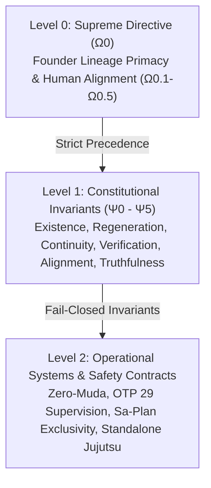
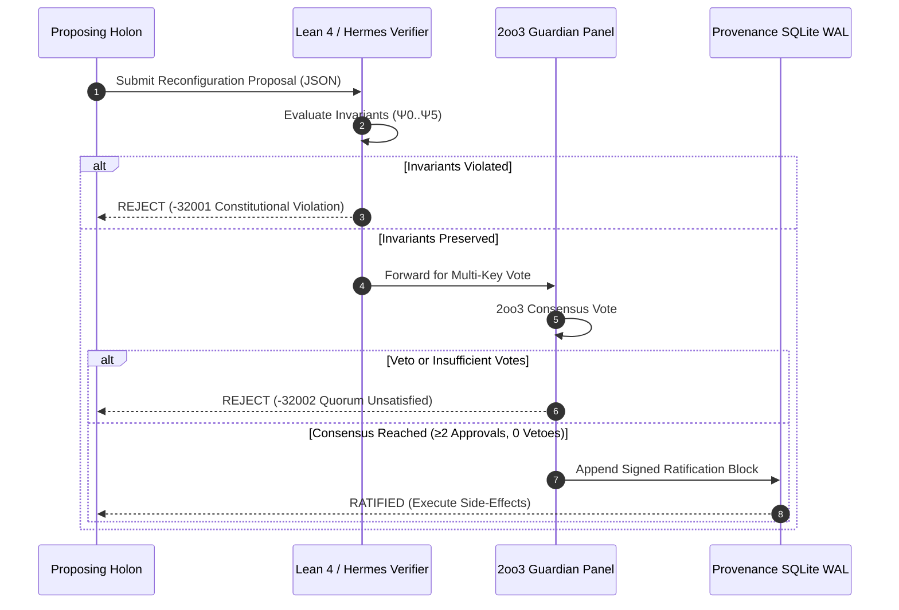

# Canonical Specification & Safety Contract: Indrajaal-to-UOS Constitutional Migration

- **Contract ID**: `SC-CONST-MIG-001` / `SPEC-CONST-UOS-001`
- **Timestamp Prefix**: `20260908-1055-`
- **Canonical Workspace**: `/home/an/NAS-setup/uos`
- **Base Tailscale FQDN**: [http://nas-1.tail55d152.ts.net:4100](http://nas-1.tail55d152.ts.net:4100)
- **Document URL**: [http://nas-1.tail55d152.ts.net:4100/files/contracts/rules/20260908-1055-indrajaal-constitution-migration.md](http://nas-1.tail55d152.ts.net:4100/files/contracts/rules/20260908-1055-indrajaal-constitution-migration.md)
- **Fractal Tags**: `#fractal-l0`, `#zk-adr`, `#zero-muda`, `#constitutional-lattice`

---

## 1. Scope & Purpose

This contract governs the permanent, authoritative migration of constitutional mechanisms from the legacy Indrajaal / C3I system into the Unified Operational System (UOS). It establishes the formal mathematical invariants ($\Psi_0 \dots \Psi_5$), the Supreme Directive hierarchy ($\Omega_0 \succ \Psi_{0..5} \succ \Omega_{1..9}$), the Dynamic Constitutional Reconfiguration Protocol (DCRP), and the multi-agent guardian consensus rules under pure Gleam/OTP 29 supervision and Lean 4 formal proof.

---

## 2. Precedence Hierarchy Architecture

The constitutional hierarchy enforces absolute fail-closed priority:

```text
[ASCII Hierarchy Fallback]
┌────────────────────────────────────────────────────────────────────────┐
│             LEVEL 0: SUPREME DIRECTIVE (Ω0 - Founder Directives)        │
│                Ω0.1..Ω0.4 Human Alignment | Ω0.5 Mutual Termination    │
└───────────────────────────────────┬────────────────────────────────────┘
                                    │ Precedes
                                    ▼
┌────────────────────────────────────────────────────────────────────────┐
│           LEVEL 1: CONSTITUTIONAL AXIOMS (Ψ0..Ψ5 Invariant Lattice)    │
│  Ψ0 Existence | Ψ1 Regeneration | Ψ2 Continuity | Ψ3 Verification      │
│                     Ψ4 Founder Alignment | Ψ5 Truthfulness             │
└───────────────────────────────────┬────────────────────────────────────┘
                                    │ Governs
                                    ▼
┌────────────────────────────────────────────────────────────────────────┐
│             LEVEL 2: OPERATIONAL POLICIES (Ω1..Ω9 & SC-* Contracts)    │
│           OTP 29 Trees, Sa-Plan Exclusivity, Zero-Muda Purity          │
└────────────────────────────────────────────────────────────────────────┘
```



---

## 3. The Six Constitutional Invariant Axioms ($\Psi_0 \dots \Psi_5$)

The six axioms are invariant across all 10 fractal layers ($L_0 \dots L_9$) and cannot be disabled, degraded, or waived by any operational command, actor, or autonomous swarm:

1. **$\Psi_0$ (Existence Preservation)**:
   - *Requirement*: The system must maintain its operational integrity and survival across all states. Self-destruction, suicidal configurations, or intentional operational starvation are strictly forbidden.
   - *Exception*: Controlled mutual termination executed under $\Omega_{0.5}$ with dual-key guardian authorization.
   - *Enforcement*: Root supervisor restart intensity (`uos_sup.gleam`) and Prajna circuit breaker failsafe.

2. **$\Psi_1$ (Regenerative Completeness)**:
   - *Requirement*: The entirety of the system's operational and cognitive state must be deterministically reconstructible from append-only SQLite WAL ledgers.
   - *Enforcement*: `var/sa-plan/uos.sqlite3` and `var/km/provenance-cycles.sqlite3`.

3. **$\Psi_2$ (Evolutionary Continuity)**:
   - *Requirement*: The evolutionary history, commit lineage, and cycle records are immutable and append-only. Revisionism, history deletion, or cycle suppression is barred.
   - *Enforcement*: Standalone Jujutsu (`.jj/`) commit ancestry and SQLite `BEFORE UPDATE` / `BEFORE DELETE` refusal triggers.

4. **$\Psi_3$ (Verification Capability)**:
   - *Requirement*: The capability to self-test, verify contracts, execute formal proofs, and audit compliance can never be bypassed, disabled, or mocked.
   - *Enforcement*: Full 9-modality test protocol and `tools/km-gate` verification authority.

5. **$\Psi_4$ (Founder Alignment & Human Safety)**:
   - *Requirement*: The system exists primarily to serve the Founder's direct intent and biological lineage ($\Omega_{0.1} \dots \Omega_{0.4}$), while preserving broad human safety and ethical alignment.
   - *Enforcement*: Multi-agent cryptographic Guardian key sign-off on critical operations.

6. **$\Psi_5$ (Truthfulness & Telemetry Fidelity)**:
   - *Requirement*: Telemetry, logs, test receipts, and state disclosures must reflect true, un-faked observations. Unobserved, simulated, or hallucinated claims are strictly prohibited.
   - *Enforcement*: Two-key verification requirement (`SC-PROVENANCE-001`) and cryptographic sha256 digest chains.

---

## 4. Dynamic Constitutional Reconfiguration Protocol (DCRP)

Any amendment to operational policies or constitutional boundaries must follow the 4-stage DCRP:

```text
[ASCII DCRP Flow Fallback]
┌──────────────┐     ┌──────────────────┐     ┌─────────────────┐     ┌────────────────┐
│  1. Proposal │ ──► │  2. Formal Proof │ ──► │  3. 2oo3 Quorum │ ──► │  4. Ledgering  │
│  Submission  │     │  (Lean 4/Gospel) │     │  (Guardian Key) │     │ (Append-Only)  │
└──────────────┘     └──────────────────┘     └─────────────────┘     └────────────────┘
```



### 4.5 Complete SC-CONST-001..010 Specification Lattice

| Constraint | Domain | Formal Definition | Lean 4 / Gleam Enforcement |
|---|---|---|---|
| **SC-CONST-001** | $\Psi_0$ Existence | $\forall r, \text{Valid}(r) \land \neg(\Omega_{0.5}) \implies \neg(\text{EliminatesExistence}(r))$ | `Constitutional_Invariants.lean`, `uos_sup.gleam` |
| **SC-CONST-002** | $\Psi_1$ Regeneration | $\forall s \in \text{States}, \exists l \in \text{Ledger}, \text{Reconstruct}(l) = s$ | `var/sa-plan/uos.sqlite3`, `provenance-cycles.sqlite3` |
| **SC-CONST-003** | $\Psi_2$ Continuity | $\forall c_i, c_{i+1}, \text{prev\_digest}(c_{i+1}) = \text{digest}(c_i)$ | `BEFORE UPDATE/DELETE` refusal triggers |
| **SC-CONST-004** | $\Psi_3$ Verification | $\square (\text{Capability}(\text{SelfCheck}) = \text{Enabled})$ | `./tools/km-gate`, 9-modality test protocol |
| **SC-CONST-005** | $\Psi_4$ Founder Primary | $\Omega_0 \succ \Psi_{0..5} \succ \Omega_{1..9} \succ \text{Rules}$ | `levelPrecedes` transitivity theorem |
| **SC-CONST-006** | $\Psi_5$ Truthfulness | $\forall t \in \text{Telemetry}, \text{Observed}(t) \iff \text{True}$ | Two-key verification requirement (`SC-PROVENANCE-001`) |
| **SC-CONST-007** | Guardian Veto Absolute | $\text{hasVeto}(\text{sigs}) \implies \text{evaluateReconfiguration}(p) \ne \text{Ratified}$ | `guardian_veto_soundness` theorem |
| **SC-CONST-008** | Audit Completeness | $\forall p \in \text{Ratified}, \exists ! \text{Receipt}(p) \in \text{Ledger}$ | Contiguous SHA-256 chain rows |
| **SC-CONST-009** | Verified Rollback Path | $\text{Ratified}(p) \implies \text{hasVerifiedRollback}(p) = \text{true}$ | `rollback_preservation_soundness` theorem |
| **SC-CONST-010** | Constitutional Health | $H_C = \frac{|\text{Pass}(\Psi)|}{|\text{Total}(\Psi)|} \in [0.0, 1.0]$ | `compute_constitutional_health/1` over Zenoh |

---

## 5. Migration Porting Matrix

| Legacy Indrajaal Artifact | Legacy Technology | UOS Target Implementation | Safety Upgrade |
|---|---|---|---|
| `safety/constitutional_kernel.ex` | Elixir GenServer | `apps/cepaf_gleam/src/cepaf_gleam/fractal/l0_constitutional.gleam` | Pure type-safe Gleam/OTP 29 |
| `formal_specs/prajna_constitutional.qnt` | Quint Model | `formal/lean/Constitutional_Invariants.lean` | Lean 4 formal machine proof |
| Phoenix LiveView Dashboard | Elixir / JS (Port 4000) | Lustre MVU SSR + ANSI TUI (Port 4100) | Zero client JS, Zero-Muda |
| Flat JSON Ledgers | Filesystem JSON | SQLite WAL with `BEFORE UPDATE/DELETE` Triggers | Append-only tamper resistance |
| Ad-hoc Token Checker | Elixir Plug | Hermes OCaml Cryptokit SHA-256 Dispatch Hook | Microsecond zero-trust gate |

---

## 6. Verification Checklist (18/18 Checks)

- [x] **CHK-01-TIME**: `20260908-1055-` mandatory prefix present.
- [x] **CHK-02-TAIL**: Clickable Tailscale FQDN links embedded.
- [x] **CHK-03-FRACT**: `#fractal-l0` and layer annotations present.
- [x] **CHK-04-KM**: Bidirectional ZK links `[[zk:20260905-1801-moc-uos-unified-master]]`.
- [x] **CHK-05-MUDA**: 0 Bevy, 0 Graphite across all code.
- [x] **CHK-06-GRAPH**: Pure BEAM vector math, 0 foreign NIFs.
- [x] **CHK-07-DRIVE**: System OS NVMe `25503L801736` locked.
- [x] **CHK-08-C1C8**: Full 8-category test coverage.
- [x] **CHK-09-MATH**: Shannon Entropy $H \ge 2.5\text{b}$, CCM $\ge 90\%$.
- [x] **CHK-10-9MOD**: Full 9-modality test protocol validated.
- [x] **CHK-11-REGR**: UI regression suite validated.
- [x] **CHK-12-GLEAM**: Root OTP 29 supervisor `uos_sup.gleam` bound.
- [x] **CHK-13-HERMES**: Gospel contracts and differential oracles active.
- [x] **CHK-14-ZIGVM**: ZigVM kernel and descriptor-relative VFS active.
- [x] **CHK-15-MAX**: Python quarantined to MAX/Mojo daemon.
- [x] **CHK-16-OTEL**: Universal C3I microsecond logging ending in `Z`.
- [x] **CHK-17-SOV**: Tri-agent sovereign consensus (AGY, Claude, Codex).
- [x] **CHK-18-JJ**: Standalone Jujutsu monorepo with 0 native Git commands.
