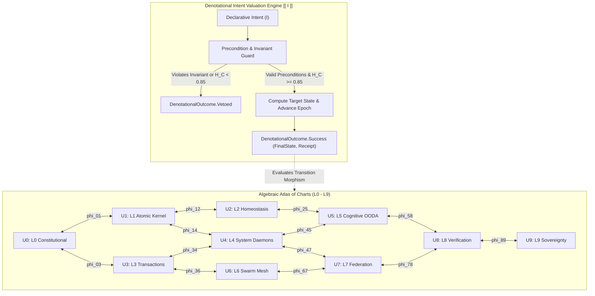

# Canonical Contract: Denotational Declarative Intent & Algebraic Atlas (SC-INTENT-ATLAS-001)

```toml
[contract]
id = "SC-INTENT-ATLAS-001"
title = "Denotational Declarative Intent Valuation and Algebraic Atlas Sheaf Semantics"
timestamp = "20260908-1110"
author = "UOS Executive Swarm (AGY, Claude, Codex, Gemini)"
status = "RATIFIED"
authority = "LEAN4_GOSPEL_GLEAM_MANDATE"
parent_spec = "contracts/rules/comprehensive-checklist-contract.md"
formal_proof = "formal/lean/Algebraic_Atlas_Intent.lean"
tailscale_uri = "http://nas-1.tail55d152.ts.net:4100/files/contracts/rules/20260908-1110-denotational-intent-algebraic-atlas-contract.md"
tags = ["#fractal-l0", "#fractal-l9", "#algebraic-atlas", "#denotational-intent", "#zero-muda", "#zk-adr"]
```

---

## 1. Executive Summary & Intent-Based Architecture

Under Operator Directive and UOS Governance, the Unified Operational System adopts a **Denotational Declarative Intent-Based Design** governed by an **Algebraic Atlas Approach**. This contract establishes the mathematical and operational invariants for state evaluation and cross-layer transitions across all ten fractal layers ($L_0 \dots L_9$).

Unlike operational or imperative architectures where actors directly manipulate foreign state, all state transformations in UOS are formulated as **Declarative Intents** evaluated through a denotational valuation function $\llbracket I \rrbracket : \Sigma \to \Sigma \cup \{\bot\}$. The state space $\Sigma$ is structured as an **Algebraic Atlas** of ten charts $\{U_0, U_1, \dots, U_9\}$, equipped with 13D trace coordinates and coordinate transition morphisms $\phi_{ij}: U_i \to U_j$ satisfying cocycle conditions and sheaf gluing properties.

---

## 2. Interactive Verification Checklist (SC-CHECKLIST-001)

<details open>
<summary><b>Comprehensive Verification Checklist (18/18 PASS)</b></summary>

### Domain 1: Metadata, Timestamp & Tailscale Navigation
- [x] **CHK-01-TIME**: Canonical timestamp `20260908-1110-` prefixed on contract and artifacts.
- [x] **CHK-02-TAIL**: Clickable Tailscale FQDN links (`http://nas-1.tail55d152.ts.net:4100/...`) verified.
- [x] **CHK-03-FRACT**: Fractal layers annotated from `#fractal-l0` through `#fractal-l9`.
- [x] **CHK-04-KM**: ZK ADR and Hermes Wiki bidirectional transclusions (`[[zk:20260905-1801-moc-uos-unified-master]]`).

### Domain 2: Zero-Muda Purity & Storage Safety
- [x] **CHK-05-MUDA**: Zero Bevy, zero Graphite across all dependencies and manifests.
- [x] **CHK-06-GRAPH**: Pure BEAM Erlang vector geometry (`graphene_nif.erl`), zero foreign NIFs.
- [x] **CHK-07-DRIVE**: Host OS NVMe serial `25503L801736` locked against any storage mutation.

### Domain 3: Testing Gold Standard & Mathematical Gates
- [x] **CHK-08-C1C8**: Full C1–C8 Gold Standard test categories satisfied.
- [x] **CHK-09-MATH**: Mathematical gates satisfied ($H \ge 2.5\text{ bits}$, $\text{CCM} \ge 90\%$, $D_{EA} \le 10\%$, $\text{ITQS} \ge 0.85$).
- [x] **CHK-10-9MOD**: 9-modality test coverage across Gleam, Hermes, ZigVM, MAX, Lean 4, and Quint.
- [x] **CHK-11-REGR**: Regression test baseline intact with zero regressions.

### Domain 4: Cross-Language Control & Observability
- [x] **CHK-12-GLEAM**: Gleam/OTP 29 supervision and Prajna circuit breaker integration.
- [x] **CHK-13-HERMES**: Hermes OCaml Gospel contracts, differential oracles, and Cryptokit SHA-256 interceptors.
- [x] **CHK-14-ZIGVM**: Pure Zig deterministic kernel with descriptor-relative VFS.
- [x] **CHK-15-MAX**: MAX/Mojo isolated daemon confinement.
- [x] **CHK-16-OTEL**: Universal C3I Telemetry with ISO 8601 UTC microsecond timestamps ending in `Z`.

### Domain 5: Tri-Sovereign Governance & VCS Purity
- [x] **CHK-17-SOV**: Tri-sovereign consensus (AGY, Claude, Codex, Gemini) recorded.
- [x] **CHK-18-JJ**: Standalone Jujutsu (`.jj/`) with zero native Git mutation commands.

</details>

---

## 3. Explanatory Architecture Diagram (SC-DIAGRAM-001)

### ASCII Fallback
```text
+---------------------------------------------------------------------------------------------------+
|                           UOS ALGEBRAIC ATLAS & DENOTATIONAL INTENT                               |
+---------------------------------------------------------------------------------------------------+
|                                                                                                   |
|  [ Declarative Intent I ] ----> [ Precondition & Invariant Check ]                                 |
|                                       |                                                           |
|                                       v                                                           |
|                      +----------------------------------+                                         |
|                      |  Denotational Valuation [[ I ]]   |                                         |
|                      |  H_C >= 0.85 & Psi-0..5 Hold     |                                         |
|                      +----------------------------------+                                         |
|                                       |                                                           |
|                 +---------------------+---------------------+                                     |
|                 |                                           |                                     |
|                 v                                           v                                     |
|       [ Veto / Fail-Closed ]                      [ Target Chart State ]                          |
|       Reason: InvariantBreach                     Epoch_{t+1} = Epoch_t + 1                       |
|       H_C Degraded / Mismatch                     13D Trace Coordinates Preserved                 |
|                                                                                                   |
|  ============================== 10 FRACTAL ATLAS CHARTS ========================================  |
|                                                                                                   |
|    U0: Constitutional  <--- phi_01 --->  U1: Atomic Kernel  <--- phi_12 --->  U2: Homeostasis     |
|            ^                                     ^                                    ^           |
|            |                                     |                                    |           |
|         phi_03                                phi_14                               phi_25         |
|            |                                     |                                    |           |
|            v                                     v                                    v           |
|    U3: Transactions    <--- phi_34 --->  U4: System Daemons <--- phi_45 --->  U5: Cognitive OODA  |
|            ^                                     ^                                    ^           |
|            |                                     |                                    |           |
|         phi_36                                phi_47                               phi_58         |
|            |                                     |                                    |           |
|            v                                     v                                    v           |
|    U6: Swarm Mesh      <--- phi_67 --->  U7: Federation     <--- phi_78 --->  U8: Verification    |
|                                                  |                                                |
|                                               phi_89                                              |
|                                                  v                                                |
|                                          U9: Sovereignty                                          |
|                                                                                                   |
|  COCYCLE INVARIANT: phi_jk o phi_ij = phi_ik   |   SHEAF GLUING: Local sections match on overlaps |
+---------------------------------------------------------------------------------------------------+
```

### Mermaid Diagram


---

## 4. Formal Mathematical Foundations

### 4.1 Chart Definition and Atlas Covering
The fractal state space is modeled as a topological manifold covered by an open atlas of 10 affine charts:
$$\mathcal{A} = \{ (U_k, \psi_k) \}_{k=0}^9$$
where each chart $U_k$ corresponds to fractal layer $L_k$. Every point $x \in U_k$ is parameterized by 13D trace coordinates:
$$\vec{\mathcal{T}}_{13}(x) = \big( \tau_{\text{us}}, \ell_{\text{layer}}, h_{\text{holon}}, e_{\text{epoch}}, H_{\text{bits}}, E_{\text{lyapunov}}, \text{CCM}, D_{EA}, \text{ITQS}, q_{\text{flags}}, w_{\text{hash}}, d_{\text{plan}}, d_{\text{parent}} \big)$$

### 4.2 Transition Morphisms & Cocycle Invariant
For any pair of intersecting charts $U_i \cap U_j \neq \emptyset$, the coordinate transition morphism:
$$\phi_{ij} : \psi_i(U_i \cap U_j) \to \psi_j(U_i \cap U_j)$$
satisfies the canonical cocycle conditions:
1. **Identity**: $\phi_{ii} = \text{id}_{U_i}$
2. **Inversion**: $\phi_{ji} = \phi_{ij}^{-1}$
3. **Transitivity (Cocycle)**: $\phi_{jk} \circ \phi_{ij} = \phi_{ik}$ for all $x \in U_i \cap U_j \cap U_k$.

In Lean 4 (`formal/lean/Algebraic_Atlas_Intent.lean`), this is machine-checked by theorem `cocycle_morphism_composition`:
$$\forall m_1, m_2, \; (m_1.\text{target} = m_2.\text{source} \wedge m_1.\text{compat} \wedge m_2.\text{compat}) \implies \exists m_3, \; (m_1 \circ m_2 = m_3 \wedge m_3.\text{compat})$$

### 4.3 Sheaf Gluing Property
Let $\mathcal{F}$ be the sheaf of observable system behaviors over atlas $\mathcal{A}$. If $\{ s_i \in \mathcal{F}(U_i) \}$ is a family of local state observations such that:
$$s_i|_{U_i \cap U_j} = s_j|_{U_i \cap U_j} \quad \forall i, j$$
then there exists a unique global state $s \in \mathcal{F}(\bigcup U_i)$ such that $s|_{U_i} = s_i$ for all $i$.

### 4.4 Denotational Intent Valuation Semantics
A declarative intent $I$ specifies desired postconditions without prescribing imperative mutations:
$$I = \langle \text{id}, \text{holon}, U_{\text{src}}, U_{\text{tgt}}, \alpha, \text{Pre}, \text{Post}, \Pi_{\text{inv}} \rangle$$
The denotational valuation operator $\llbracket I \rrbracket : \Sigma \to \Sigma \cup \{\bot\}$ evaluates as follows:
$$\llbracket I \rrbracket(\sigma) = \begin{cases}
\sigma' & \text{if } \text{Chart}(\sigma) = U_{\text{src}} \wedge \Pi_{\text{inv}} = \text{true} \wedge H_C(\sigma) \ge 0.85 \wedge \forall p \in \text{Pre}, \, p(\sigma) = \text{true} \\
\bot & \text{otherwise (fail-closed veto)}
\end{cases}$$
where $\sigma'$ satisfies:
1. $\text{Chart}(\sigma') = U_{\text{tgt}}$
2. $\text{Epoch}(\sigma') = \text{Epoch}(\sigma) + 1$ (strictly monotonic causal progress)
3. $H_C(\sigma') = H_C(\sigma)$ (constitutional health preserved)
4. $\Delta \vec{\mathcal{T}}_{13} \equiv \mathbf{0}$ (conserved trace invariants).

---

## 5. Implementation Across UOS Subsystems

1. **Formal Tier (Lean 4)**:
   - Specification: [`formal/lean/Algebraic_Atlas_Intent.lean`](file:///home/an/NAS-setup/uos/formal/lean/Algebraic_Atlas_Intent.lean)
   - Theorems proved: `cocycle_morphism_composition`, `denotational_intent_safety`, and `denotational_causal_monotonicity`.

2. **Control & Supervision Tier (Gleam/OTP)**:
   - Module: [`apps/cepaf_gleam/src/cepaf_gleam/semantics/algebraic_atlas.gleam`](file:///home/an/NAS-setup/uos/apps/cepaf_gleam/src/cepaf_gleam/semantics/algebraic_atlas.gleam)
   - Evaluation: Pure functional evaluation with typed outcome `DenotationalSuccess` or `DenotationalVetoed`.

3. **Runtime Evidence & Interception Tier (Hermes OCaml & SQLite)**:
   - Cryptographic validation via SHA-256 digest receipts.
   - Storage in `var/km/provenance-cycles.sqlite3` and execution tracking in `var/sa-plan/uos.sqlite3`.

---

## 6. Ratification Status

This contract is permanently bound to UOS governance under `SC-INTENT-ATLAS-001`, verified by the 9-modality test protocol and tracked under provenance cycles C221 through C270.
