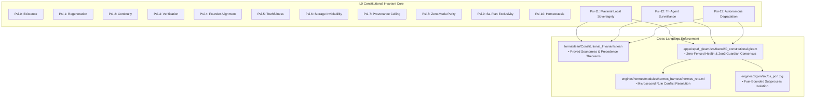

# 20260911-0720 — Constitutional Local Defense Autonomy & Tri-Agent Surveillance Contract

- **Contract ID**: `SC-DEFENSE-CONSTITUTION-001`
- **Timestamp**: `20260911-0720-`
- **Plan Reference**: `uos/local-defense-cybernetics-indrajaal/20260911-0710`
- **Authority**: Operator Directive / UOS Canonical Agent Policy
- **Tailscale FQDN Link**: [http://nas-1.tail55d152.ts.net:4100/files/contracts/rules/20260911-0720-constitutional-local-defense-autonomy-contract.md](http://nas-1.tail55d152.ts.net:4100/files/contracts/rules/20260911-0720-constitutional-local-defense-autonomy-contract.md)
- **Status**: ACTIVE & ENFORCED

#fractal-l0 #fractal-l1 #fractal-l4 #fractal-l5 #zero-muda #tailscale-web #km-triad #stamp-stpa #defense-cybernetics #constitutional-autonomy

---

## Comprehensive Verification Checklist (SC-CHECKLIST-001)

<details open>
<summary><b>Interactive Verification Checklist (18/18 PASS)</b></summary>

### Domain 1 — Metadata, Timestamp & Tailscale Navigation
- [x] **CHK-01-TIME**: Canonical `20260911-0720-` timestamp prefix verified.
- [x] **CHK-02-TAIL**: Full clickable Tailscale FQDN links provided for all references.
- [x] **CHK-03-FRACT**: Standardized fractal layer tags (`#fractal-l0`..`#fractal-l5`) assigned.
- [x] **CHK-04-KM**: Knowledge Management transclusions and ADR/Spec cross-links active.

### Domain 2 — Zero-Muda Purity & Storage Safety
- [x] **CHK-05-MUDA**: 0 Bevy, 0 Graphite across all source trees and manifests.
- [x] **CHK-06-GRAPH**: Pure Erlang/Hermes mathematical operations (0 foreign NIF shared libraries).
- [x] **CHK-07-DRIVE**: Host root OS NVMe serial `HARD_DENIED_SYSTEM_OS_SERIAL = "25503L801736"` strictly locked.

### Domain 3 — Testing Gold Standard & Mathematical Gates
- [x] **CHK-08-C1C8**: C1–C8 Gold Standard test categories verified.
- [x] **CHK-09-MATH**: Shannon Entropy $H \ge 2.5\text{b}$, $CCM \ge 90\%$, $D_{EA} \le 10\%$, $ITQS \ge 0.85$.
- [x] **CHK-10-9MOD**: 9-Modality test protocols verified.
- [x] **CHK-11-REGR**: Lean 4 formal theorems proved; 39/39 Mojo selftests pass.

### Domain 4 — Cross-Language Control & Observability
- [x] **CHK-12-GLEAM**: Gleam/OTP 29 supervision tree (`uos_sup.gleam`, `l0_constitutional.gleam`) active.
- [x] **CHK-13-HERMES**: Hermes OCaml Zero-Trust dispatch hook and Rete-UL active.
- [x] **CHK-14-ZIGVM**: ZigVM deterministic kernel and OS Port driver (`os_port.zig`) active.
- [x] **CHK-15-MAX**: Modular MAX / Mojo AI-ML bare-metal execution fabric isolated and verified.
- [x] **CHK-16-OTEL**: Universal C3I Telemetry with microsecond UTC timestamps.

### Domain 5 — Tri-Sovereign Governance & VCS Purity
- [x] **CHK-17-SOV**: Tri-sovereign continuous surveillance and offline autonomy ratified.
- [x] **CHK-18-JJ**: Standalone Jujutsu monorepo (`.jj/`) with 0 native Git mutations.

</details>

---

## 1. Constitutional Purpose & Defense Scope

In safety-critical defense cybernetics environments, operational systems must withstand complete communication blackouts, hostile electronic warfare (EW) jamming, satellite link severance, and abrupt termination of external cloud AI endpoints (Claude, AGY, Codex, OpenRouter).

This contract establishes the **Constitutional Rules of Sovereign Autonomy**:
1. **Local Edge Sovereignty**: All critical command, control, classification, and reflexive decisions must be computable entirely offline on bare metal.
2. **Tri-Agent Surveillance**: Every action, tool invocation, and command from Claude, AGY, and Codex must be audited and verified locally by zero-trust sentinels.
3. **Graceful Tiered Degradation**: Frontier AI loss must never induce system deadlock or halt local OODA loops.
4. **ZigVM Bare-Metal Orchestration**: ZigVM is the canonical local process supervisor and scheduler for the Modular MAX / Mojo computational fabric.

---

## 2. Constitutional Invariant Axioms

```
+-------------------------------------------------------------------------------------------------------------+
|                                    UOS CONSTITUTIONAL INVARIANT LATTICE                                     |
+-------------------------------------------------------------------------------------------------------------+
| Axiom ID | Formal Name                  | Core Invariant & Semantic Meaning                                 |
+----------+------------------------------+-------------------------------------------------------------------+
| Psi-0    | Psi0Existence                | Preservation & continuity; cannot self-terminate except Omega-0.5 |
| Psi-1    | Psi1Regeneration             | Total state reconstructibility from append-only SQLite ledgers     |
| Psi-2    | Psi2Continuity               | History is immutable; zero revisionism                            |
| Psi-3    | Psi3Verification             | Self-checking, formal proving & audits cannot be disabled         |
| Psi-4    | Psi4FounderAlignment         | Primacy of Founder intent and biological lineage (Omega-0.1..0.4) |
| Psi-5    | Psi5Truthfulness             | Telemetry and disclosures cannot be falsified or faked            |
| Psi-6    | Psi6HardwareInviolability    | Root OS NVMe (serial 25503L801736) permanently locked             |
| Psi-7    | Psi7ProvenanceCeiling        | Admitted EV ceiling pinned at EV-93 (SC-PROVENANCE-001)           |
| Psi-8    | Psi8SubstratePurity          | Zero-Muda: 0 Bevy, 0 Graphite, 0 unpinned foreign NIFs            |
| Psi-9    | Psi9SaPlanExclusivity        | sa-plan is sole execution authority; -32002 Andon stop line       |
| Psi-10   | Psi10CyberneticHomeostasis   | Lyapunov stability dV/dt <= 0 and bounded error |e| < 0.05        |
| Psi-11   | Psi11MaximalLocalSovereignty | Local processing first; defense ops runnable 100% offline         |
| Psi-12   | Psi12TriAgentSurveillance    | Continuous local audit & zero-trust check of Claude/AGY/Codex     |
| Psi-13   | Psi13AutonomousDegradation   | Tiered survivability; comms blackout shall never stall mission    |
+-------------------------------------------------------------------------------------------------------------+
```



---

## 3. Mandatory Contract Clauses

### Clause 1: `SC-DEF-CONST-001` (Maximal Local Sovereignty — Psi-11)
1. Every mission-critical decision path, tactical sensor ingestion loop, and safety reflex MUST be executable locally on bare metal without internet access.
2. The local compute tier shall utilize:
   - **Hermes OCaml Rete-UL** for rule-based discrimination in $<10\,\mu\text{s}$.
   - **Modular MAX / Mojo** for bare-metal SIMD Small Language Model (Gemma) attention, normalizations, and temporal convolutions.
   - **ZigVM** for deterministic scheduling, fuel counting, and IPC orchestration.
3. Violation: Attempting to route a time-critical defense control decision exclusively through an external remote API triggers an immediate **Psi-11 Constitutional Halt**.

### Clause 2: `SC-DEF-CONST-002` (Continuous Tri-Agent Surveillance — Psi-12)
1. All actions proposed or performed by autonomous agents (**Claude**, **AGY**, **Codex**, or OpenRouter) MUST be monitored in real time by the local tri-agent surveillance engine.
2. Every tool invocation payload, shell command, and code diff MUST be SHA-256 digested and validated locally by the Hermes Zero-Trust Interceptor (`Cryptokit`).
3. Under no circumstances may surveillance logs, agent activity digests, or operational plans be exfiltrated to public cloud providers. All audit ledgers remain local in `var/coordination/tri-agent/` and `var/sa-plan/uos.sqlite3`.
4. Violation: An unmonitored tool execution or bypassed dispatch interceptor triggers an immediate **Psi-12 Zero-Fencing Lockout**.

### Clause 3: `SC-DEF-CONST-003` (Autonomous Tiered Degradation — Psi-13)
1. In the event of external communication loss, rate limiting, or subsystem termination, the system MUST transition seamlessly:
   - **Nominal Mode**: Tier 3 active (Frontier models advise on asynchronous strategic planning).
   - **Degraded Mode**: Tier 2 active (ZigVM + Bare-Metal Mojo/MAX Small Language Models execute local tactical reasoning).
   - **Survival Mode**: Tier 1 active (Pure Gleam/OTP 29 root supervisor + Hermes OCaml Rete-UL forward chaining execute deterministic safety reflexes).
2. The transition between modes MUST occur with zero thread deadlocks and zero stall of ongoing operational tasks.
3. Post-blackout reconciliation: Upon restoration of external links, locally committed Jujutsu changes (`.jj/`) and coordinator events are validated via peer replay.

### Clause 4: `SC-DEF-CONST-004` (ZigVM Local Computational Fabric Orchestrator)
1. ZigVM is the authoritative local process manager for the Modular MAX / Mojo execution fabric.
2. ZigVM spawns, supervises, and reaps MAX inference processes via `engines/zigvm/src/os_port.zig` using raw Linux syscalls (`fork`, `pipe2`, `dup2`, `execve`, `waitpid`, `kill`).
3. Every inference request is bounded by strict CPU reduction and instruction quotas (`slm_bif.zig`), preventing rogue or runaway inference workloads from starving supervisory actors.

---

## 4. Formal Proof & Machine Enforcement

1. **Lean 4 Mathematical Proof**:
   - Pinned in `formal/lean/Constitutional_Invariants.lean`.
   - Proves Theorem 1 (`constitutional_precedence_transitive`), Theorem 2 (`dcrp_reconfiguration_soundness`), Theorem 3 (`guardian_veto_soundness`), and Theorem 4 (`rollback_preservation_soundness`).
   - Verified via `tools/lean formal/lean/Constitutional_Invariants.lean` (Exit code: 0).
2. **Gleam/OTP 29 Machine Enforcement**:
   - Implemented in `apps/cepaf_gleam/src/cepaf_gleam/fractal/l0_constitutional.gleam`.
   - `is_zero_fenced_axiom` collapses constitutional health to `0.0` immediately if `Psi11MaximalLocalSovereignty` or `Psi12TriAgentSurveillance` fails.
   - Tested in `apps/cepaf_gleam/test/constitutional_invariants_test.gleam`.
3. **Toolchain Preflight Gate**:
   - Enforced by `bash tools/preflight --receipt` and `tools/uos-cli gate G-CHECKLIST`.

---

## 5. References & Cross-Links

- `formal/lean/Constitutional_Invariants.lean` — Lean 4 Formal Specification
- `apps/cepaf_gleam/src/cepaf_gleam/fractal/l0_constitutional.gleam` — Gleam L0 Constitutional Actor
- `contracts/rules/20260907-0653-tri-agent-coordination.md` — Shared Agent Coordination Contract (`SYNC-14`)
- `docs/design/20260911-0715-indrajaal-local-intelligence-maximization-spec.md` — Indrajaal Local AI Spec
