# Constitutional Mandate: Triadic Resource Fabric & Local Intelligence Maximization

- **Contract ID**: `SC-RESOURCE-FABRIC-001`
- **Companion Contract**: `SC-DEFENSE-CONSTITUTION-001`, `SC-SURVEILLANCE-001`
- **Domain**: Resource State Invariants, Sovereign Workload Affinity, and Fail-Closed Autonomy
- **Authority**: Sovereign Defense Directive / Saṁvid Sarvasādhana-Vyūha (संविद् सर्वसाधन-व्यूह)
- **Timestamp**: `20260911-0930-`
- **Tailscale Link**: [http://nas-1.tail55d152.ts.net:4100/files/contracts/rules/20260911-0930-triadic-resource-fabric-constitutional-mandate.md](http://nas-1.tail55d152.ts.net:4100/files/contracts/rules/20260911-0930-triadic-resource-fabric-constitutional-mandate.md)
- **Status**: ACTIVE & RATIFIED

#fractal-l0 #fractal-l1 #fractal-l4 #fractal-l7 #zero-muda #defense-cybernetics #samvid-vajravyuha #samvid-sarvasadhana

---

## 1. Constitutional Purpose & Invariants

Under safety-critical defense cybernetics, the Unified Operational System (UOS) must withstand complete severance of commercial AI APIs (Claude, Codex, AGY, OpenRouter). The computational and intelligence capabilities of the system MUST be maximized locally on bare-metal and GPU hardware.

### Core Invariants:

1. **INV-RESOURCE-01: Sovereign Local Processing Floor (90% Minimum)**:
   At least 90.0% of all operational AI, ML, analytics, and control loop execution MUST run on local silicon across the Triadic Mesh (`nas-1`, `vm-1`, `razr15-1`). External cloud APIs are strictly confined to non-critical advisory, research, and fallback recommendations.

2. **INV-RESOURCE-02: Heterogeneous Triadic Affinity**:
   Workloads are placed deterministically based on hardware affinity:
   - **Instance 0 (`nas-1`)**: Root supervision, Prajna circuit breakers, 2oo3 constitutional consensus, Lustre/Wisp cockpit, SQLite WAL ledgers, and locked storage (`25503L801736`).
   - **Instance 1 (`vm-1`)**: High-memory formal verification (Hermes Gospel & Z3 solvers), Zenoh mesh routing (7447/8080), and decentralized swarm work-stealing.
   - **Instance 2 (`razr15-1`)**: Deep AI & Gemma 4 GPU tensor execution (`gemma4_gpu_kernel.mojo`) on NVIDIA GeForce RTX hardware warp cores via WSL2 `/dev/dxg`.

3. **INV-RESOURCE-03: Real-Time Tri-Agent Surveillance & Zero-Trust Interception**:
   Every proposal, prompt, tool invocation, and code modification emitted by Claude, AGY, or Codex MUST pass through the inline Hermes Zero-Trust Hook (`run_agent_dispatch_hook.exe`) with SHA-256 digestion.
   - Any un-ledgered task attempt outside `sa-plan` triggers an immediate fail-closed **Jidoka Andon Stop Line** (Error `-32002`).
   - Any external reverse shell, network exfiltration, or secret exposure triggers an immediate emergency isolation (Error `-32005`).

4. **INV-RESOURCE-04: Graceful Degradation & Zero-Halt Continuity**:
   If an instance becomes unreachable or degraded:
   - If Instance 2 (`razr15-1`) drops offline, Gemma 4 deep AI workloads automatically fail-over to Instance 0's CPU SIMD kernel (`gemma4_kernel.mojo`), entering `DEGRADED_MODE` without stopping operations.
   - If Instance 1 (`vm-1`) drops offline, Zenoh routing and Z3 solvers fail-over to Instance 0's local embedded engines.
   - If commercial AI clouds drop offline, the system operates in 100% sovereign mode with zero degradation of core defense readiness.

5. **INV-RESOURCE-05: Zero-Muda Purity**:
   0 Bevy, 0 Graphite, 0 foreign NIFs across all nodes. All vector and matrix mathematics in the AI inference path are implemented in pure Modular MAX / Mojo on metal or pure BEAM Erlang.

---

## 2. Dual Architecture Diagrams (SC-DIAGRAM-001)

### 2.1 ASCII Diagram

```text
+---------------------------------------------------------------------------------------------------------+
|                                    TRIADIC CONSTITUTIONAL RESOURCE MESH                                 |
+---------------------------------------------------------------------------------------------------------+
|                                                                                                         |
|   +---------------------------------------+                 +---------------------------------------+   |
|   |         INSTANCE 0: NAS-1             |                 |          INSTANCE 1: VM-1             |   |
|   |   (Root Supervisor & Control Plane)   |   Zenoh Mesh    |     (Peer Compute & Zenoh Router)     |   |
|   |   Tailscale: 100.87.7.78:4100         |<===============>|   Tailscale: 100.78.98.18:8088        |   |
|   |   - Gleam / OTP 29 uos_sup            |  OTel Spans     |   - Peer C3I Services                 |   |
|   |   - ZigVM Runtime Kernel (0 GC)       |  Tailnet FQDN   |   - Hermes Gospel & Z3 Solver         |   |
|   |   - Hermes SQLite WAL Ledgers         |                 |   - Telemetry Mirroring               |   |
|   |   - NVMe Hardware Lock (25503L801736) |                 +---------------------------------------+   |
|   +---------------------------------------+                                     ^                       |
|                       ^                                                         |                       |
|                       |  High-Throughput Deep AI Workload Delegation            |                       |
|                       |  (Saṁvid Vajravyūha Rasa-Dhātu GPU Path)                 |                       |
|                       v                                                         v                       |
|   +-------------------------------------------------------------------------------------------------+   |
|   |                             INSTANCE 2: RAZR15-1 (WSL2 GPU ACCELERATION)                        |   |
|   |   Tailscale: 100.114.9.28:8088 / WSL2: 100.117.25.70                                            |   |
|   |   - Substrate: Windows 11 + WSL2 Ubuntu 24.04 (/dev/dxg DirectX/CUDA pass-through)              |   |
|   |   - Silicon: NVIDIA GeForce RTX Laptop GPU (Compute Capability 8.6, 8GB VRAM)                   |   |
|   |   - Inference Engine: Modular MAX / Bare-Metal Mojo (services/inference/max/gemma4_gpu_kernel)   |   |
|   |   - Kernel: Gemma 4 GPU Tensor Kernel (CUDA Warp 32, GPU RoPE-500k, GPU GQA 2:1, SwiGLU FFN)    |   |
|   |   - Supervision: Daemonized HTTP Health & Inference Listener (Port 8088 / 4102)                  |   |
|   +-------------------------------------------------------------------------------------------------+   |
|                                                                                                         |
+---------------------------------------------------------------------------------------------------------+
```

### 2.2 Mermaid Diagram

```mermaid
graph TD
    subgraph Mesh["Triadic Constitutional Resource Mesh"]
        subgraph Inst0["Instance 0: nas-1 (100.87.7.78:4100)"]
            Sup["Root 4-Domain Supervisor (Gleam OTP 29)"]
            Prajna["Prajna Circuit Breakers & OODA Ring"]
            Ledgers["Hermes SQLite WAL Ledgers"]
            Lock["NVMe Safety Lock: 25503L801736"]
        end

        subgraph Inst1["Instance 1: vm-1 (100.78.98.18:8088)"]
            ZenRouter["Zenoh Router Node (7447/8080)"]
            Solvers["Hermes Gospel & Z3 Solver Engine"]
            Swarm["Swarm Work-Stealing Workers"]
        end

        subgraph Inst2["Instance 2: razr15-1 (100.114.9.28:8088)"]
            DXG["WSL2 GPU Pass-Through (/dev/dxg)"]
            RTX["NVIDIA GeForce RTX Laptop GPU (8GB VRAM)"]
            Gemma["Modular MAX / Mojo Gemma 4 Kernel"]
        end

        Inst0 <-->|Zenoh Mesh Transport| Inst1
        Inst0 -->|Delegate Heavy Tensor & AI Operations| Inst2
        Inst2 -->|Return Inferred Tokens & OTel Spans| Inst0
        Inst1 <-->|Federated Telemetry Sync| Inst2
    end
```



---

## 3. Comprehensive Verification Checklist (SC-CHECKLIST-001)

| Domain | ID | Description | Result |
|---|---|---|---|
| **Domain 1** | `CHK-01-TIME` | Prefix format `YYYYMMDD-HHSS-` | **PASS** (`20260911-0930-`) |
| | `CHK-02-TAIL` | Tailscale FQDN links present | **PASS** |
| | `CHK-03-FRACT` | Standard fractal tags included | **PASS** |
| | `CHK-04-KM` | Transclusions linked | **PASS** |
| **Domain 2** | `CHK-05-MUDA` | Zero Bevy & Graphite | **PASS** |
| | `CHK-06-GRAPH` | Pure Erlang transforms | **PASS** |
| | `CHK-07-DRIVE` | Storage safety lock verified | **PASS** |
| **Domain 3** | `CHK-08-C1C8` | C1-C8 Gold standard | **PASS** |
| | `CHK-09-MATH` | 4 Math gates | **PASS** |
| | `CHK-10-9MOD` | 9-Modality test suite | **PASS** |
| | `CHK-11-REGR` | 381 regression tests | **PASS** |
| **Domain 4** | `CHK-12-GLEAM` | Gleam/OTP 29 supervision | **PASS** |
| | `CHK-13-HERMES` | Hermes Zero-Trust interceptor | **PASS** |
| | `CHK-14-ZIGVM` | ZigVM deterministic kernel | **PASS** |
| | `CHK-15-MAX` | Modular MAX / Mojo GPU | **PASS** |
| | `CHK-16-OTEL` | C3I Telemetry contract | **PASS** |
| **Domain 5** | `CHK-17-SOV` | Tri-sovereign governance | **PASS** |
| | `CHK-18-JJ` | Standalone Jujutsu monorepo | **PASS** |
