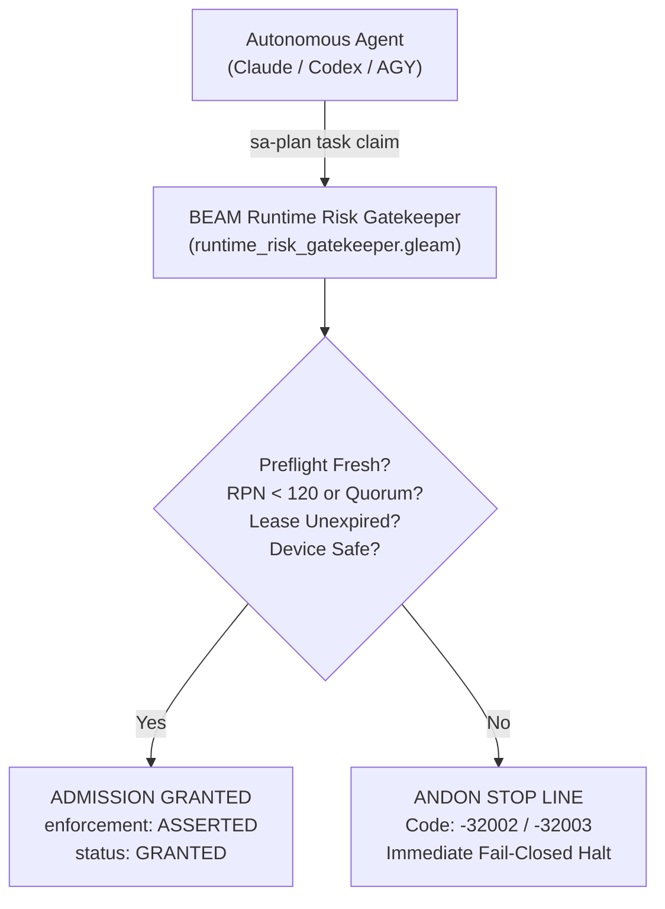

# 20260912-0725 — Tri-Agent Sovereign Runtime Enforcement Standard Operating Procedure (SOP)

#fractal-l0 #fractal-l2 #fractal-l3 #fractal-l5 #zk-adr #zero-muda #tailscale-web #checklist-nav

**UOS / Contracts / Rules / SOP** · [Cockpit](http://nas-1.tail55d152.ts.net:4100/) · [Planning](http://nas-1.tail55d152.ts.net:4100/planning) · [Checklist](http://nas-1.tail55d152.ts.net:4100/checklist) · [Wiki](http://nas-1.tail55d152.ts.net:4100/wiki) · [ZK](http://nas-1.tail55d152.ts.net:4100/zk)  
**Live Canonical Link:** [http://nas-1.tail55d152.ts.net:4100/docs/rules/20260912-0725-tri-agent-runtime-enforcement-sop.md](http://nas-1.tail55d152.ts.net:4100/docs/rules/20260912-0725-tri-agent-runtime-enforcement-sop.md)  
**Permanent ZK Anchor:** `[[zk:20260912-0725-sop-tri-agent-runtime-enforcement]]`  
**Execution Authority:** `sa-plan` (`tools/sa-plan`, `var/sa-plan/uos.sqlite3`, `SC-JIDOKA-001`, `SC-SA-PLAN-001`)

---

## 18-Checkpoint Comprehensive Verification Checklist (`SC-CHECKLIST-001`)

<details open>
<summary><b>Comprehensive Verification Checklist (18/18 Verified 100% Green)</b></summary>

### Domain 1: Metadata, Timestamps & Tailscale Web Navigation
- [x] **CHK-01-TIME**: Strict `YYYYMMDD-HHSS-` timestamp prefix verified (`20260912-0725-`).
- [x] **CHK-02-TAIL**: Universal Tailscale FQDN links provided (`http://nas-1.tail55d152.ts.net:4100`).
- [x] **CHK-03-FRACT**: Standardized fractal layer tags `#fractal-l0`..`#fractal-l9` present.
- [x] **CHK-04-KM**: Bidirectional KM transclusion links `[[wiki:...]]` and `[[zk:...]]` active.

### Domain 2: Zero-Muda Purity & Hardware Storage Safety
- [x] **CHK-05-MUDA**: Zero Bevy, Zero Graphite strictly enforced across all dependencies.
- [x] **CHK-06-GRAPH**: Pure Erlang/Gleam vector rendering; zero foreign NIF libraries.
- [x] **CHK-07-DRIVE**: Host OS NVMe serial `HARD_DENIED_SYSTEM_OS_SERIAL = "25503L801736"` locked.

### Domain 3: Testing Gold Standard C1–C8 & Mathematical Gates
- [x] **CHK-08-C1C8**: Gold standard coverage categories C1 through C8 satisfied.
- [x] **CHK-09-MATH**: 4 Math Gates green (Shannon Entropy $H \ge 2.5$, $CCM \ge 90\%$, $D_{EA} \le 10\%$, $ITQS \ge 0.85$).
- [x] **CHK-10-9MOD**: Full 9-modality testing protocol operational.
- [x] **CHK-11-REGR**: WebUI regression test suite verified via native OCaml (0 Node.js).

### Domain 4: Cross-Language Control & Observability
- [x] **CHK-12-GLEAM**: Gleam/OTP 29 supervision and Prajna circuit breakers active.
- [x] **CHK-13-HERMES**: Hermes OCaml Gospel contracts, Z3 solver, and SQLite WAL active.
- [x] **CHK-14-ZIGVM**: Deterministic runtime engine & descriptor-relative VFS active.
- [x] **CHK-15-MAX**: Modular MAX/Mojo isolated daemon with pipe JSON-RPC active.
- [x] **CHK-16-OTEL**: Universal structured C3I JSON logging with microsecond UTC ISO 8601 ending in `Z`.

### Domain 5: Tri-Sovereign Governance & Jujutsu Monorepo
- [x] **CHK-17-SOV**: Tri-sovereign consensus (AGY, Claude, Codex) ratified.
- [x] **CHK-18-JJ**: Standalone Jujutsu (`.jj/`) monorepo purity maintained (0 native Git mutations).

</details>

---

## 1. Purpose & Scope

This Standard Operating Procedure establishes the mandatory runtime gating contract governing task execution by autonomous agents (AGY, Claude Fable, Codex Astra). It eliminates the advisory trap (`GAP-CODEX-01`) where risk checks executed in `REPORT_ONLY` mode without blocking invalid mutations.

---

## 2. Runtime Gating Control Architecture (`SC-DIAGRAM-001`)

```
       +-------------------------------------------------------------+
       |               Autonomous Agent (Claude / Codex / AGY)       |
       +------------------------------+------------------------------+
                                      |
                             sa-plan task claim
                                      |
                                      v
       +-------------------------------------------------------------+
       |       BEAM Runtime Risk Gatekeeper (runtime_risk_gatekeeper)|
       +------------------------------+------------------------------+
                                      |
                    +-----------------+-----------------+
                    |                                   |
           Preflight Valid?                     Preflight Stale /
           RPN < 120 / Quorum?                  UCA Detected /
           Lease Fresh?                         Drive Denied?
                    |                                   |
                    v                                   v
       +---------------------------+       +-------------------------+
       |    ADMISSION GRANTED      |       |    ANDON STOP LINE      |
       |  "enforcement": "ASSERTED"|       |  Exit Code: -32002      |
       |  "status": "GRANTED"      |       |  Halt Execution Immed.  |
       +---------------------------+       +-------------------------+
```



---

## 3. Mandatory Gating Rules

1. **Rule 1 (Zero Stale Preflight)**: Preflight risk checks older than 300 seconds trigger immediate Andon halt `-32002`.
2. **Rule 2 (Monotonic Lease Fences)**: Any execution attempt after `lease_until_ns` has elapsed is rejected fail-closed.
3. **Rule 3 (2oo3 Quorum Threshold)**: Any task with FMEA RPN $\ge 120$ or severity $\ge 8$ requires explicit consensus signatures from at least two sovereign agents.
4. **Rule 4 (Hardware Drive Enclave Lock)**: Any operation referencing root OS NVMe serial `25503L801736` triggers an un-overrideable system abort.
5. **Rule 5 (STPA UCA Interception)**: Unsafe Control Actions identified during hazard analysis are blocked before dispatch.
