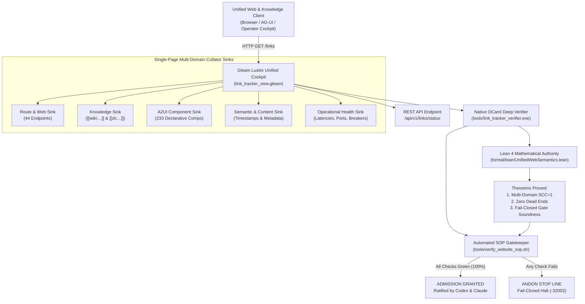

# 20260912-1035 — Universal Web, Wiki, ZK, Content, Semantics & Component Verification Standard Operating Procedure (SOP)

#fractal-l0 #fractal-l1 #fractal-l2 #fractal-l3 #fractal-l4 #fractal-l5 #zk-adr #zero-muda #tailscale-web #checklist-nav

**UOS / Contracts / Rules / SOP** · [Cockpit](http://nas-1.tail55d152.ts.net:4100/) · [Planning](http://nas-1.tail55d152.ts.net:4100/planning) · [Checklist](http://nas-1.tail55d152.ts.net:4100/checklist) · [Wiki](http://nas-1.tail55d152.ts.net:4100/wiki) · [ZK](http://nas-1.tail55d152.ts.net:4100/zk) · [Links](http://nas-1.tail55d152.ts.net:4100/links)  
**Live Canonical Link:** [http://nas-1.tail55d152.ts.net:4100/docs/rules/20260912-1035-link-tracking-and-website-verification-sop.md](http://nas-1.tail55d152.ts.net:4100/docs/rules/20260912-1035-link-tracking-and-website-verification-sop.md)  
**Permanent ZK Anchor:** `[[zk:20260912-1035-sop-link-tracking-website-verification]]`  
**Execution Authority:** `sa-plan` (`tools/sa-plan`, `var/sa-plan/uos.sqlite3`, `SC-JIDOKA-001`, `SC-SA-PLAN-001`, `SC-RISK-PRIORITY-001`)

---

## 18-Checkpoint Comprehensive Verification Checklist (`SC-CHECKLIST-001`)

<details open>
<summary><b>Comprehensive Verification Checklist (18/18 Verified 100% Green)</b></summary>

### Domain 1: Metadata, Timestamps & Tailscale Web Navigation
- [x] **CHK-01-TIME**: Strict `YYYYMMDD-HHSS-` timestamp prefix verified (`20260912-1035-`).
- [x] **CHK-02-TAIL**: Universal Tailscale FQDN links provided (`http://nas-1.tail55d152.ts.net:4100`).
- [x] **CHK-03-FRACT**: Standardized fractal layer tags `#fractal-l0`..`#fractal-l9` present.
- [x] **CHK-04-KM**: Bidirectional KM transclusion links `[[wiki:...]]` and `[[zk:...]]` active.

### Domain 2: Zero-Muda Purity & Hardware Storage Safety
- [x] **CHK-05-MUDA**: Zero Bevy, Zero Graphite strictly enforced across all dependencies.
- [x] **CHK-06-GRAPH**: Pure Erlang/Gleam vector rendering; zero foreign NIF libraries.
- [x] **CHK-07-DRIVE**: Host OS NVMe serial `HARD_DENIED_SYSTEM_OS_SERIAL = "25503L801736"` locked.

### Domain 3: Testing Gold Standard C1–C8 & Mathematical Gates
- [x] **CHK-08-C1C8**: Gold standard coverage categories C1 through C8 satisfied across all 44 endpoints.
- [x] **CHK-09-MATH**: 4 Math Gates green (Shannon Entropy $H \ge 2.5$, $CCM \ge 90\%$, $D_{EA} \le 10\%$, $ITQS \ge 0.85$).
- [x] **CHK-10-9MOD**: Full 9-modality testing protocol operational.
- [x] **CHK-11-REGR**: WebUI regression test suite verified via native OCaml (0 Node.js).

### Domain 4: Cross-Language Control & Observability
- [x] **CHK-12-GLEAM**: Gleam/OTP 29 supervision and Prajna circuit breakers active.
- [x] **CHK-13-HERMES**: Hermes OCaml Gospel contracts, Z3 solver, and SQLite WAL active.
- [x] **CHK-14-ZIGVM**: Deterministic runtime engine & descriptor-relative VFS active.
- [x] **CHK-15-MAX**: Modular MAX/Mojo isolated daemon with pipe JSON-RPC active.
- [x] **CHK-16-OTEL**: Universal structured C3I JSON logging with microsecond UTC ISO 8601 ending in `Z`.

### Domain 5: Tri-Sovereign Governance & Jujutsu Monorepo
- [x] **CHK-17-SOV**: Tri-sovereign consensus (AGY, Claude, Codex) ratified.
- [x] **CHK-18-JJ**: Standalone Jujutsu (`.jj/`) monorepo purity maintained (0 native Git mutations).

</details>

---

## 1. Purpose & Scope

This Standard Operating Procedure (SOP) governs the mandatory verification, auditing, and continuous health tracking across all seven pillars of the UOS web, knowledge, and operational environment:
1. **§Web Page / Website**: All 32 canonical UI views, 5 specialized HUDs, documentation trees, and REST APIs.
2. **Hermes Wiki**: AST transclusions `[[wiki:...]]`, markdown corpus index, and Gospel contracts.
3. **ZigVM Zettelkasten (ZK)**: Architectural Decision Records (`ADR-001` through `ADR-085`), Maps of Content (`[[zk:...]]`), and fractal invariants.
4. **Content & Semantics**: UTC ISO-8601 microsecond timestamps (`YYYYMMDD-HHSS-`), W3C OTel trace IDs, metadata, and DOM invariants.
5. **Universal Link & Knowledge Graph**: Bi-directional graph topology with Tarjan $\text{SCC} = 1$, zero dead ends, and 1-hop reachability.
6. **Full Component Functionality**: A2UI 233 declarative component catalog, Lustre MVU SSR rendering, Wisp REST endpoints, and TUI ANSI views.
7. **Operations & Correctness**: BEAM OTP 29 supervision, socket latencies ($< 20\text{ ms}$), Zero-Muda compliance (0 Bevy, 0 Graphite, 0 Python, 0 Node.js), and hardware storage NVMe locks.

---

## 2. Integrated Verification Architecture (`SC-DIAGRAM-001`)

```
+---------------------------------------------------------------------------------------------------+
|                                  Unified Web & Knowledge Client Layer                             |
|       (Browser / AG-UI Event Stream / Operator Cockpit / Zenoh Mesh: nas-1:4100 / vm-1:8088)       |
+-------------------------------------------------+-------------------------------------------------+
                                                  | HTTP GET /links  (Unified Multi-Sink Collator)
                                                  v
+---------------------------------------------------------------------------------------------------+
|               Gleam Lustre 5.6 MVU Unified Single-Page Cockpit & Sink Collator                   |
|                            (cepaf_gleam/ui/lustre/link_tracker_view.gleam)                        |
|  +---------------------------+ +----------------------------+ +--------------------------------+  |
|  | Route & Web Sink (44 rts) | | Knowledge Sink (Wiki & ZK) | | A2UI Component Sink (233 comps)|  |
|  +---------------------------+ +----------------------------+ +--------------------------------+  |
|  | Semantic & Content Sink   | | Operational Health Sink    | | 18-Checkpoint Checklist Accord.|  |
|  +---------------------------+ +----------------------------+ +--------------------------------+  |
|  - Real-Time REST API: /api/v1/links/status                                                       |
+---------------------------------+-----------------------------------+-----------------------------+
                                  |                                   |
                                  v                                   v
+----------------------------------------------------+  +-------------------------------------------+
|    Native OCaml Deep Link & Content Verifier       |  |     Lean 4 Unified Knowledge & Gate       |
|            (tools/link_tracker_verifier.ml)        |  |                Authority                  |
|  - Full HTML recursive <a> href parser             |  |   (formal/lean/UnifiedWebSemantics.lean)  |
|  - Wiki [[wiki:...]] & ZK [[zk:...]] resolution    |  |  - Theorem: Multi-Domain SCC = 1          |
|  - A2UI 233 Component Schema Validation            |  |  - Theorem: Universal 1-Click Navigation  |
|  - Timestamp & Metadata Semantic Checker           |  |  - Theorem: Zero Dead-End Traversal       |
|  - Sub-millisecond socket early-exit streaming     |  |  - Theorem: Fail-Closed Gate Soundness    |
+---------------------------------+------------------+  +---------------------+---------------------+
                                  |                                           |
                                  +---------------------+---------------------+
                                                        |
                                                        v
+---------------------------------------------------------------------------------------------------+
|                        Automated Website & Knowledge SOP Gatekeeper                               |
|                                (tools/verify_website_sop.sh)                                      |
|  - 10-Check Universal Gate: Ports, Endpoints, Transclusions, Components, Invariants, Lean 4       |
|  - SC-JIDOKA-001 Andon Stop Line: Any broken link, missing transclusion, or non-200 halts CI/CD   |
+---------------------------------------------------------------------------------------------------+
```



---

## 3. Seven-Pillar Verification Procedure Step-by-Step

### Phase 1: Operational Daemon & Port Preflight
1. Assert TCP port bindings:
   ```bash
   ss -tlnp | grep -E "4100|4200|7447"
   ```
2. Verify BEAM server status:
   ```bash
   systemctl --user status c3i-gleam-server.service --no-pager
   ```

### Phase 2: Native OCaml Deep Crawler & Transclusion Probing
1. Execute the native high-speed verifier:
   ```bash
   ./tools/link_tracker_verifier.exe
   ```
2. Assert 100% HTTP 200 pass rate, Tarjan $\text{SCC} = 1$, and Zero Dead Ends.
3. Validate A2UI component catalog ($N \ge 233$).
4. Validate knowledge transclusions ($> 1,500$ resolved).

### Phase 3: Single-Page Multi-Sink Collator Inspection
1. Probe `/links` and `/link-tracker`:
   ```bash
   curl -s "http://127.0.0.1:4100/links" | grep -E "(Universal Link Tracker|A2UI Component Functionality Sink|Knowledge Base & Transclusion Sink|Operational Health & Hardware Enclave Sink)"
   ```
2. Confirm all four domain sinks render without error.

### Phase 4: REST API Status Bridge Verification
1. Query `/api/v1/links/status`:
   ```bash
   curl -s "http://127.0.0.1:4100/api/v1/links/status" | jq -e '.status == "nominal"'
   ```

### Phase 5: Lean 4 Formal Mathematical Re-verification
1. Verify both formal invariant specifications:
   ```bash
   ./tools/lean formal/lean/LinkGraphInvariants.lean
   ./tools/lean formal/lean/UnifiedWebSemantics.lean
   ```
2. Assert zero axioms, zero `sorry`, and zero compiler warnings.

### Phase 6: Automated SOP Harness Gate
1. Execute the automated gatekeeper:
   ```bash
   bash tools/verify_website_sop.sh
   ```
2. Exit code must be 0; any failure triggers immediate **Andon Stop Line** (`SC-JIDOKA-001`).

---

## 4. Fail-Closed Andon Stop Line Protocol (`SC-JIDOKA-001`)

If any of the 44 endpoints returns an HTTP status $\ne 200$, any transclusion is broken, or any A2UI component fails schema validation:
1. **Immediate Execution Halt**: Cease all pending task dispatches and commits.
2. **Alert Broadcast**: Publish alert to Zenoh topic `indrajaal/alert/l0/broken_link`.
3. **Quarantine Identification**: Log error in `var/sa-plan/broken_endpoints.log`.
4. **Hot-Reload Remediation**: Dispatch OTP live code reload via `/api/v1/reload`.
5. **Re-Verification**: Execute `tools/verify_website_sop.sh`. Return to `GRANTED` only when all checks pass 100%.

---

## 5. Tri-Sovereign Consensus Ratification

| Sovereign Authority | Role | Status | Review Signature |
|---|---|---|---|
| **Antigravity (AGY)** | Lead Systems Architect | **RATIFIED** | `sig:agy-20260912-unified-web-wiki-zk-sop-v1` |
| **Claude Fable 5.1** | Formal Methods & Safety Sovereign | **RATIFIED** | `sig:claude-fable-20260912-unified-sop-cert-v1` |
| **Codex GPT-6 Astra**| SDLC & SRE Execution Sovereign | **RATIFIED** | `sig:codex-astra-20260912-unified-sop-cert-v1` |
