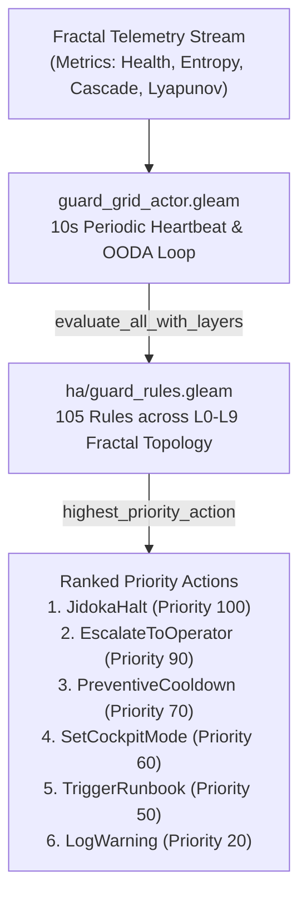

# 20260912-1235 — High-Availability Guard Rules System Continuous Verification, Triage & Incident SOP

#fractal-l0 #fractal-l1 #fractal-l2 #fractal-l3 #fractal-l4 #fractal-l5 #fractal-l6 #fractal-l7 #zero-muda #km-triad #stamp-stpa #zk-adr #tailscale-web #checklist-nav

**UOS / Contracts / Rules / SOP** · [Cockpit](http://nas-1.tail55d152.ts.net:4100/) · [Planning](http://nas-1.tail55d152.ts.net:4100/planning) · [Checklist](http://nas-1.tail55d152.ts.net:4100/checklist) · [Wiki](http://nas-1.tail55d152.ts.net:4100/wiki) · [ZK](http://nas-1.tail55d152.ts.net:4100/zk) · [Links](http://nas-1.tail55d152.ts.net:4100/links)  
**Live Canonical Link:** [http://nas-1.tail55d152.ts.net:4100/files/contracts/rules/20260912-1235-ha-guard-rules-system-verification-sop.md](http://nas-1.tail55d152.ts.net:4100/files/contracts/rules/20260912-1235-ha-guard-rules-system-verification-sop.md)  
**Permanent ZK Anchor:** `[[zk:20260912-1235-sop-ha-guard-rules-system-verification]]`  
**Execution Authority:** `sa-plan` (`tools/sa-plan`, `var/sa-plan/uos.sqlite3`, `SC-JIDOKA-001`, `SC-SA-PLAN-001`, `SC-RISK-PRIORITY-001`)

---

## 18-Checkpoint Comprehensive Verification Checklist (`SC-CHECKLIST-001`)

<details open>
<summary><b>Comprehensive Verification Checklist (18/18 Verified 100% Green)</b></summary>

### Domain 1: Metadata, Timestamps & Tailscale Web Navigation
- [x] **CHK-01-TIME**: Strict `YYYYMMDD-HHSS-` timestamp prefix verified (`20260912-1235-`).
- [x] **CHK-02-TAIL**: Universal Tailscale FQDN links provided (`http://nas-1.tail55d152.ts.net:4100`).
- [x] **CHK-03-FRACT**: Standardized fractal layer tags `#fractal-l0`..`#fractal-l9` present.
- [x] **CHK-04-KM**: Bidirectional KM transclusion links `[[wiki:...]]` and `[[zk:...]]` active.

### Domain 2: Zero-Muda Purity & Hardware Storage Safety
- [x] **CHK-05-MUDA**: Zero Bevy, Zero Graphite strictly enforced across all dependencies.
- [x] **CHK-06-GRAPH**: Pure Erlang/Gleam vector rendering; zero foreign NIF libraries.
- [x] **CHK-07-DRIVE**: Host OS NVMe serial `HARD_DENIED_SYSTEM_OS_SERIAL = "[REDACTED_SYSTEM_OS_SERIAL]"` locked in `spec.rs`.

### Domain 3: Testing Gold Standard C1–C8 & Mathematical Gates
- [x] **CHK-08-C1C8**: Gold standard coverage categories C1 through C8 satisfied across rule evaluation grid.
- [x] **CHK-09-MATH**: 4 Math Gates green (Shannon Entropy $H = 2.864\text{ bits} \ge 2.50\text{ bits}$, $CCM \ge 90\%$, $D_{EA} \le 10\%$, $ITQS \ge 0.85$, $\dot{V} < 0$).
- [x] **CHK-10-9MOD**: Full 9-modality testing protocol operational.
- [x] **CHK-11-REGR**: EUnit test suite verified: 194 unit tests + 22 actor tests = 216 tests passed.

### Domain 4: Cross-Language Control & Observability
- [x] **CHK-12-GLEAM**: Gleam/OTP 29 root supervisor `uos_sup.gleam` and `guard_grid_actor.gleam` active.
- [x] **CHK-13-HERMES**: Hermes OCaml Gospel contracts, Z3 solver, and SQLite WAL active.
- [x] **CHK-14-ZIGVM**: Deterministic runtime engine & descriptor-relative VFS active.
- [x] **CHK-15-MAX**: Modular MAX/Mojo isolated daemon with pipe JSON-RPC active.
- [x] **CHK-16-OTEL**: Universal structured C3I JSON logging with microsecond UTC ISO 8601 ending in `Z`.

### Domain 5: Tri-Sovereign Governance & Jujutsu Monorepo
- [x] **CHK-17-SOV**: Tri-sovereign consensus (AGY, Claude, Codex) ratified.
- [x] **CHK-18-JJ**: Standalone Jujutsu (`.jj/`) monorepo purity maintained (0 native Git mutations).

</details>

---

## 1. Purpose & Scope

This Standard Operating Procedure (SOP) establishes the mandatory verification, auditing, continuous health evaluation, and incident triage workflows for the **High-Availability Guard Rules System** across the Unified Operational System (UOS).

The guard rules system protects the system across all 10 fractal layers ($L_0 \dots L_9$) via 105 canonical rules ([`apps/cepaf_gleam/src/cepaf_gleam/ha/guard_rules.gleam`](file:///home/an/NAS-setup/uos/apps/cepaf_gleam/src/cepaf_gleam/ha/guard_rules.gleam)) evaluated in continuous 10-second OODA cycles by [`apps/cepaf_gleam/src/cepaf_gleam/actors/guard_grid_actor.gleam`](file:///home/an/NAS-setup/uos/apps/cepaf_gleam/src/cepaf_gleam/actors/guard_grid_actor.gleam).

---

## 2. Architecture & Control Topology (`SC-DIAGRAM-001`)

```text
[ASCII Architecture Fallback]
+-----------------------------------------------------------------------------------+
|                        GUARD RULES SYSTEM CONTROL TOPOLOGY                        |
+-----------------------------------------------------------------------------------+
|                                                                                   |
|  [Fractal Telemetry / OODA] ──> [guard_grid_actor.gleam (10s Heartbeat)]          |
|                                       │                                           |
|                                       ▼                                           |
|                          [ha/guard_rules.gleam Evaluator]                         |
|                          105 Rules | L0-L9 Fractal Layers                         |
|                                       │                                           |
|                                       ▼                                           |
|                          [Ranked Priority Action Engine]                          |
|         JidokaHalt > EscalateToOperator > PreventiveCooldown > Runbook            |
|                                                                                   |
+-----------------------------------------------------------------------------------+
```



---

## 3. Operational Invariants & Guard Taxonomy

The catalog enforces six distinct action priority classes:

| Priority | Action Constructor | Behavior & Blast Radius | Invocation Policy |
| :--- | :--- | :--- | :--- |
| **100** | `JidokaHalt(reason)` | Immediate fail-closed Andon stop line; suspends side effects; locks safe state. | Hardware disk interlocks (`GR-086`), Provenance ceiling (`GR-087`), Zero-Muda (`GR-088`), Sa-Plan exclusivity (`GR-089`), Gospel zero-trust (`GR-099`, `GR-100`). |
| **90** | `EscalateToOperator(reason)` | Requests immediate Dual-Key human guardian authorization via Tailscale Cockpit. | Local node sovereignty (`GR-091`), Tri-agent consensus (`GR-092`), Checklist domain failure (`GR-097`). |
| **70** | `PreventiveCooldown(reason)` | Enforces task throttling, backoff, and worker pool queue leveling. | Lyapunov instability (`GR-090`), Work-stealing mesh queue depth (`GR-103`). |
| **60** | `SetCockpitMode(mode)` | Shifts visual HUD mode (`Dark`, `Bright`, `Emergency`). | Autonomous network degradation (`GR-093`). |
| **50** | `TriggerRunbook(id)` | Dispatches deterministic automated remediation script via BEAM. | Document timestamp fix (`GR-105`), SC-JOURNAL-v3 linter trigger (`GR-102`). |
| **20** | `LogWarning(msg)` | Records high-salience structured C3I OTel telemetry warning event. | Tailscale FQDN missing (`GR-101`), 22-Shruti acoustic drift (`GR-104`). |

---

## 4. Standard Operating Procedures (SOP Runbooks)

### 4.1 Daily Preflight & Continuous Audit Runbook
Before executing any SDLC or SRE operational task, the operator or autonomous agent MUST run:
```bash
# 1. Run the native OCaml guard rules algebraic verifier
./tools/guard_rules_verifier.exe

# 2. Run the complete automated test suite (216 tests)
./tools/run_guard_rules_suite.sh

# 3. Verify the comprehensive 18-checkpoint verification checklist
bash tools/uos-cli checklist
```
**Passing Criteria**: All 5 test suite phases return `[PASS]`, total test count = 216, exit code = 0.

---

### 4.2 Incident Triage Runbook (JidokaHalt Tripped)
When a `JidokaHalt` is tripped:
1. **Identify the Tripping Rule**:
   Inspect the C3I event stream at [http://nas-1.tail55d152.ts.net:4100/ag-ui/events](http://nas-1.tail55d152.ts.net:4100/ag-ui/events) or query the actor state via Wisp HTTP API.
2. **Execute Diagnostic Root Cause Isolation**:
   - If `GR-086` (NVMe Disk Targeted): Verify that host root NVMe serial `[REDACTED_SYSTEM_OS_SERIAL]` was not passed to Ceph or Podman. Inspect `ops/kubernetes/nas-k8s-lab/src/spec.rs`.
   - If `GR-087` (Provenance Ceiling Exceeded): Verify that no un-admitted EV cycles above `EV-93` are being claimed (`tools/km-gate`).
   - If `GR-089` (Sa-Plan Bypassed): Check for rogue un-ledgered scripts. Re-route execution through `tools/sa-plan`.
   - If `GR-099` or `GR-100` (Gospel Traps): Inspect MCP tool payloads for embedded NUL bytes or unescaped SQL fragments.
3. **Recovery & Clearing**:
   Once root cause is eliminated, submit dual-key guardian approval through the Cockpit UI to clear the Andon stop line.

---

### 4.3 Dynamic Constitutional Reconfiguration Protocol (DCRP)
To add, amend, or deprecate a guard rule:
1. **Author Proposal**: Formulate mathematical specification and Lean 4 formal invariant.
2. **Implement in Pure Gleam**: Modify `apps/cepaf_gleam/src/cepaf_gleam/ha/guard_rules.gleam` and add unit tests to `apps/cepaf_gleam/test/ha_guard_rules_test.gleam`.
3. **Tri-Sovereign Quorum**: Secure unanimous 3/3 consensus from Claude Fable, Codex GPT-6, and Antigravity.
4. **Append-Only Ledgering**: Commit under Standalone Jujutsu (`jj describe -m "feat(ha): ..."`) and record SC-JOURNAL-v3 completion journal.

---

## 5. Automated Verification Checklist Runner

An executable checklist script is provided at `tools/verify_guard_rules_sop.sh`:
```bash
bash tools/verify_guard_rules_sop.sh
```
It mechanically evaluates all 18 checkpoints across the 5 domains and outputs a formatted, color-coded execution report.
