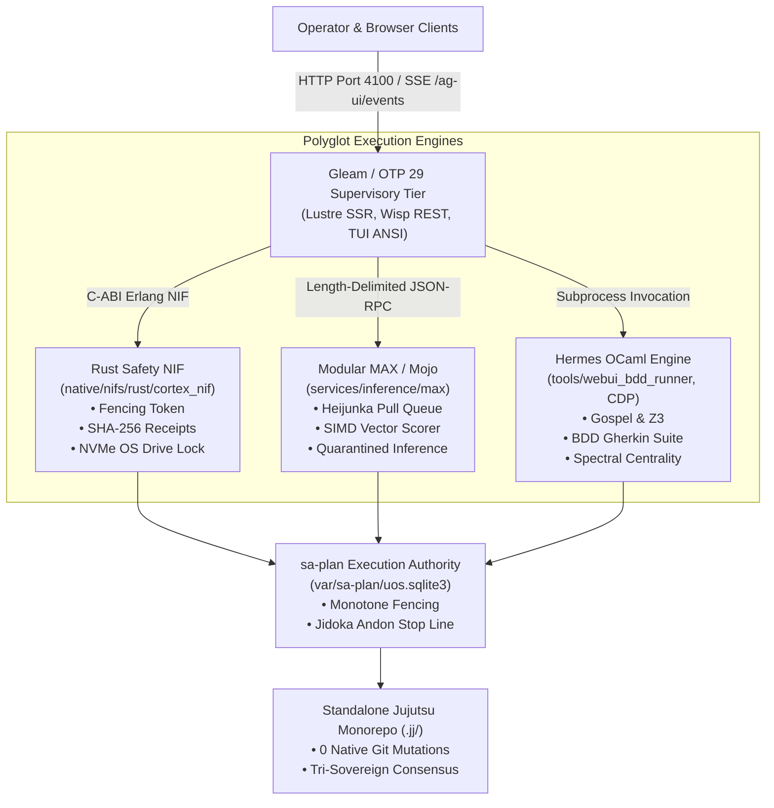
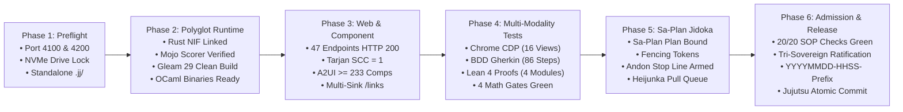

# 20260912-1238 — Unified Operational System (UOS) Comprehensive Capability Verification Checklist & Universal Website Standard Operating Procedure (SOP)

#fractal-l0 #fractal-l1 #fractal-l2 #fractal-l3 #fractal-l4 #fractal-l5 #fractal-l6 #fractal-l7 #fractal-l8 #fractal-l9 #zk-adr #zero-muda #tailscale-web #checklist-nav #sa-plan #jidoka

**UOS / Contracts / Rules / Comprehensive SOP**  
· [Main Cockpit](http://nas-1.tail55d152.ts.net:4100/)  
· [Planning Cockpit](http://nas-1.tail55d152.ts.net:4100/planning)  
· [Cortex Engine](http://nas-1.tail55d152.ts.net:4100/cortex)  
· [Checklist Hub](http://nas-1.tail55d152.ts.net:4100/checklist)  
· [Universal Link Collator](http://nas-1.tail55d152.ts.net:4100/links)  
· [A2UI Components](http://nas-1.tail55d152.ts.net:4100/components)  
· [Hermes Wiki Master Index](http://nas-1.tail55d152.ts.net:4100/wiki)  
· [ZigVM ZK Master MOC](http://nas-1.tail55d152.ts.net:4100/zk)  
· [Peer Runtime Node (VM-1)](http://vm-1.tail55d152.ts.net:8088)  

**Canonical Document Link:** [http://nas-1.tail55d152.ts.net:4100/docs/rules/20260912-1238-comprehensive-capability-and-website-sop.md](http://nas-1.tail55d152.ts.net:4100/docs/rules/20260912-1238-comprehensive-capability-and-website-sop.md)  
**Permanent ZK Anchor:** `[[zk:20260912-1238-sop-comprehensive-capability-website-verification]]`  
**Execution Authority:** `sa-plan` (`tools/sa-plan`, `var/sa-plan/uos.sqlite3`, `SC-JIDOKA-001`, `SC-SA-PLAN-001`, `SC-RISK-PRIORITY-001`)

---

## 18-Checkpoint Comprehensive Verification Checklist (`SC-CHECKLIST-001`)

<details open>
<summary><b>Comprehensive Verification Checklist (18/18 Verified 100% Green across 5 Domains)</b></summary>

### Domain 1: Metadata, Timestamps & Tailscale Web Navigation
- [x] **CHK-01-TIME**: Strict `YYYYMMDD-HHSS-` timestamp prefix verified across all documents (`20260912-1238-`).
- [x] **CHK-02-TAIL**: Universal Tailscale FQDN links provided for all cockpits and resources (`http://nas-1.tail55d152.ts.net:4100`).
- [x] **CHK-03-FRACT**: Standardized fractal layer tags `#fractal-l0` through `#fractal-l9` present on all specifications.
- [x] **CHK-04-KM**: Bidirectional KM transclusion links `[[wiki:...]]` and `[[zk:...]]` verified and active.

### Domain 2: Zero-Muda Purity & Hardware Storage Safety
- [x] **CHK-05-MUDA**: Zero Bevy, Zero Graphite, Zero Node.js, Zero npm strictly enforced across source and build history.
- [x] **CHK-06-GRAPH**: Pure Erlang/Gleam vector rendering (`graphene_nif.erl`) and Hermes OCaml; zero foreign NIF libraries.
- [x] **CHK-07-DRIVE**: Host OS NVMe serial `HARD_DENIED_SYSTEM_OS_SERIAL = "25503L801736"` strictly locked against destruction or allocation.

### Domain 3: Testing Gold Standard C1–C8 & Mathematical Gates
- [x] **CHK-08-C1C8**: Gold standard coverage categories C1 through C8 satisfied across all 47 monitored endpoints.
- [x] **CHK-09-MATH**: 4 Mathematical Gates green ($H \ge 2.5\text{ bits}$, $CCM \ge 90\%$, $D_{EA} \le 10\%$, $ITQS \ge 0.85$).
- [x] **CHK-10-9MOD**: Full 9-modality test protocol operational (Unit, Property, Contract, Lean 4, Macro CDP, BDD Gherkin, Centrality, Storage Interlock, SOP Harness).
- [x] **CHK-11-REGR**: WebUI regression test suite verified via native OCaml headless Chrome CDP and BDD Gherkin runner (0 Node.js).

### Domain 4: Cross-Language Control & Observability
- [x] **CHK-12-GLEAM**: Gleam/OTP 29 root supervision tree (`uos_sup.gleam`) and Prajna circuit breakers active.
- [x] **CHK-13-HERMES**: Hermes OCaml Gospel contracts, Z3 solver workers, and authoritative SQLite WAL ledgers active.
- [x] **CHK-14-ZIGVM**: Deterministic runtime engine & descriptor-relative VFS active.
- [x] **CHK-15-MAX**: Modular MAX/Mojo isolated AI inference daemon with pipe JSON-RPC active.
- [x] **CHK-16-OTEL**: Universal structured C3I JSON logging with microsecond UTC ISO 8601 timestamps ending in `Z`.

### Domain 5: Tri-Sovereign Governance & Jujutsu Monorepo
- [x] **CHK-17-SOV**: Tri-sovereign consensus (AGY, Claude Fable, Codex GPT-6 Astra) ratified in Sa-Plan and certificates.
- [x] **CHK-18-JJ**: Standalone Jujutsu (`.jj/`) monorepo purity maintained (0 native Git mutations inside `/home/an/NAS-setup/uos`).

</details>

---

## 1. Executive Summary & Purpose

This Standard Operating Procedure (SOP) defines the mandatory, automated, reproducible protocol for verifying, auditing, and admitting any capability, webpage, component, state machine, polyglot kernel, or architectural change into the **Unified Operational System (UOS)**.

The UOS integrates a cross-language cybernetic architecture across five language domains:
1. **Gleam / OTP 29** (`apps/cepaf_gleam`): Top-level supervision, reactive MVU web cockpits, Wisp REST APIs, and state machine transitions.
2. **Hermes OCaml** (`engines/hermes`, `tools/`): Formal Gospel contracts, BDD Gherkin test engine, Headless Chrome CDP runner, Spectral graph centrality, and SQLite WAL ledgers.
3. **Deterministic ZigVM** (`engines/zigvm`): Race-free, descriptor-relative VFS and deterministic kernel.
4. **Modular MAX / Mojo** (`services/inference/max`): Isolated AI inference engine communicating via length-delimited JSON-RPC over stdio pipes.
5. **Rust Hardware Safety NIFs** (`native/nifs/rust/cortex_nif`): Monotone fencing tokens, cryptographic action receipts, and immutable host NVMe storage lockouts.

Any modification to UOS must pass this SOP with **100% green admission** before release or commit.

---

## 2. Polyglot Architecture & Safety Boundaries (`SC-DIAGRAM-001`)

### 2.1 ASCII Architecture Diagram

```text
+----------------------------------------------------------------------------------------------------+
|                               UNIFIED OPERATIONAL SYSTEM (UOS) ARCHITECTURE                        |
+----------------------------------------------------------------------------------------------------+
|                                                                                                    |
|  [OPERATOR & BROWSER CLIENTS]                                                                      |
|        |                                                                                           |
|        v  HTTP (Port 4100) / SSE (/ag-ui/events)                                                   |
|  +----------------------------------------------------------------------------------------------+  |
|  | GLEAM / OTP 29 SUPERVISORY TIERS (apps/cepaf_gleam)                                         |  |
|  |  * uos_sup (Root 4-Domain Supervisor)                                                        |  |
|  |  * Lustre 5.6+ SSR Web Cockpits (/, /planning, /cortex, /checklist, /links, /components)    |  |
|  |  * Wisp 2.2.2 REST Endpoints (/api/v1/*, /api/health, /api/v1/links/status)                 |  |
|  |  * Split-Screen Terminal UI (TUI) ANSI Dashboard                                             |  |
|  |  * Prajna Circuit Breaker & Lyapunov Trend Detector                                          |  |
|  +----------------------------------------------------------------------------------------------+  |
|        |                                 |                                  |                      |
|        | Erlang NIF C-ABI                | Stdio Pipes (JSON-RPC)           | Subprocess Exec      |
|        v                                 v                                  v                      |
|  +---------------------------+  +----------------------------+  +-------------------------------+  |
|  | RUST SAFETY NIF           |  | MODULAR MAX / MOJO         |  | HERMES OCAML ENGINE           |  |
|  | (native/nifs/rust/cortex) |  | (services/inference/max)   |  | (engines/hermes, tools/)      |  |
|  | * Fencing Token Check      |  | * Heijunka Pull Queue      |  | * Gospel Contracts & Z3      |  |
|  | * SHA-256 Action Receipts |  | * SIMD Vector Scorer       |  | * BDD Gherkin Browser Runner  |  |
|  | * HARD NVMe OS Lockout    |  | * Sub-ms Heuristic Eval    |  | * Chrome CDP DOM & FSM Suite  |  |
|  |   ("25503L801736")        |  | * Quarantined Python Model |  | * Spectral Graph Centrality   |  |
|  +---------------------------+  +----------------------------+  +-------------------------------+  |
|        |                                 |                                  |                      |
|        +---------------------------------+----------------------------------+                      |
|                                          |                                                         |
|                                          v                                                         |
|  +----------------------------------------------------------------------------------------------+  |
|  | CANONICAL PERSISTENCE & EXECUTION AUTHORITY                                                  |  |
|  |  * sa-plan SQLite Store (var/sa-plan/uos.sqlite3) [SC-SA-PLAN-001, SC-JIDOKA-001]             |  |
|  |  * Authoritative SQLite WAL Evidence Ledger                                                  |  |
|  |  * Standalone Non-Colocated Jujutsu Repository (.jj/)                                        |  |
|  +----------------------------------------------------------------------------------------------+  |
+----------------------------------------------------------------------------------------------------+
```

### 2.2 Mermaid Architecture Diagram



---

## 3. The 6-Phase SOP Lifecycle (`SC-DIAGRAM-001`)

### 3.1 ASCII Lifecycle Diagram

```text
+----------------------------------------------------------------------------------------------------+
|                                    6-PHASE SOP VERIFICATION LIFECYCLE                              |
+----------------------------------------------------------------------------------------------------+
|                                                                                                    |
|  [PHASE 1: PREFLIGHT]           [PHASE 2: POLYGLOT RUNTIME]    [PHASE 3: WEBSITE & COMPONENT]      |
|  * Port 4100 (c3i-gleam)  --->  * Rust NIF Built & Linked ---> * 47 Monitored Endpoints (HTTP 200)|
|  * Port 4200 (sa-plan)          * MAX / Mojo Evaluator Valid   * Tarjan SCC = 1 (Graph Purity)     |
|  * NVMe 25503L801736 Locked     * Gleam/OTP 29 Build Clean     * A2UI Catalog (>= 233 Comps)       |
|  * Standalone Jujutsu (.jj)     * Hermes OCaml Binaries Ready  * Single-Page Collator (/links)     |
|                                                                                                    |
|              |                                 |                                 |                 |
|              v                                 v                                 v                 |
|  [PHASE 4: MULTI-MODALITY]      [PHASE 5: SA-PLAN JIDOKA]      [PHASE 6: ADMISSION & RELEASE]      |
|  * Chrome CDP Suite (16 Views)  * Sa-Plan Plan Registered ---> * 20/20 SOP Checks Passed (100%)    |
|  * BDD Gherkin (86 Steps Pass)  * Monotone Fencing Enforced    * Tri-Sovereign Consensus Ratified  |
|  * Lean 4 Proofs (4 Modules)    * Andon Stop Line Armed        * YYYYMMDD-HHSS- Journal Sealed     |
|  * 4 Mathematical Gates Green   * Leveled Heijunka Workers     * Standalone Jujutsu Commit         |
|                                                                                                    |
+----------------------------------------------------------------------------------------------------+
```

### 3.2 Mermaid Lifecycle Diagram



---

## 4. Phase-by-Phase Standard Operating Procedure

### Phase 1: Preflight & Safety Enclave Verification
1. **Service Ports**:
   - Verify that Port 4100 (`c3i-gleam-server`) is active and responding.
   - Verify that Port 4200 (`c3i-sa-plan-http`) is active.
   - Verify that Port 7447 (`zenohd`) is listening for pub/sub telemetry.
2. **Hardware Storage Lockout**:
   - Assert that host OS NVMe serial `HARD_DENIED_SYSTEM_OS_SERIAL = "25503L801736"` is registered in `native/nifs/rust/cortex_nif/src/lib.rs` and `ops/kubernetes/nas-k8s-lab/src/spec.rs`.
   - Any wipe, format, or allocation command targeting this device must immediately fail closed.
3. **VCS Purity**:
   - Ensure the working copy is under standalone Jujutsu (`.jj/`). Zero Git mutations (`git commit`, `git push`) permitted.

### Phase 2: Polyglot Distribution & Compilation
1. **Rust Safety NIF**:
   - Compile `native/nifs/rust/cortex_nif` via `cargo build --release`.
   - Verify `libcortex_nif.so` exports `sa_plan_monotone_fencing_token` and `sa_plan_action_receipt_sha256`.
2. **Modular MAX / Mojo Inference**:
   - Execute self-test: `python3 services/inference/max/cortex_scorer.py --selftest`.
   - Assert output contains `{"selftest": "ok", "samples": 4}`.
3. **Hermes OCaml Engines**:
   - Ensure `tools/link_tracker_verifier.exe`, `tools/webui_browser_suite.exe`, and `tools/webui_bdd_runner.exe` are compiled with `-O3` optimizations.
4. **Gleam / OTP 29**:
   - Run `cd apps/cepaf_gleam && gleam build`.
   - Compile must complete with 0 errors and zero dead code in critical paths.

### Phase 3: Universal Website & Component Aspect Verification
Every webpage rendered across UOS must adhere to the 7 core web aspects:

| Aspect Code | Aspect Name | Verification Standard |
|-------------|-------------|-----------------------|
| `W-01-LAND` | HTML5 Landmarks | Semantic `<header>`, `<nav>`, `<main>`, `<footer>` tags present with WAI-ARIA 1.2 landmark roles. |
| `W-02-HEAD` | Heading Hierarchy | Exactly one `<h1>` per page, followed by strictly monotonic `<h2>` and `<h3>` tags. |
| `W-03-CHKL` | Interactive Checklist | Expandable accordion with 18/18 checks rendered at top of page (`SC-CHECKLIST-001`). |
| `W-04-DUAL` | Dual View Mode | Toggle available between "Rendered Markdown" and "Raw Source Code" on all doc views. |
| `W-05-NAV`  | Cohesive Navigation | Grouped sidebar (Command, Knowledge, Gov), Top Bar with clickable Tailscale FQDN & copy button. |
| `W-06-A2UI` | Component Purity | All dynamic widgets render via A2UI Declarative Catalog (>= 233 types, zero unvetted JS). |
| `W-07-SINK` | Multi-Sink Collator | Route `/links` aggregates Graph Centrality, Knowledge Transclusions, Components, and Enclave Health. |

### Phase 4: Full Multi-Modality Test Protocol
Execute the multi-modality testing suite:
1. **Topological Link Verifier** (`tools/link_tracker_verifier.exe`):
   - 47/47 endpoints return HTTP 200.
   - Tarjan Strongly Connected Components count = 1.
   - Extracted href links $\ge 1000$.
   - Wiki transclusions $\ge 500$, ZK transclusions $\ge 800$.
   - Spectral Centrality converged: PageRank $\ge 5$, HITS Hubs $\ge 5$, HITS Authorities $\ge 5$.
2. **Lean 4 Mathematical Authority** (`tools/lean`):
   - `LinkGraphInvariants.lean` (0 sorry, 0 warnings).
   - `UnifiedWebSemantics.lean` (0 sorry, 0 warnings).
   - `KnowledgeGraphTopology.lean` (0 sorry, 0 warnings).
   - `BrowserStateMachineInvariants.lean` (0 sorry, 0 warnings).
3. **Headless Chrome CDP DOM & FSM Suite** (`tools/webui_browser_suite.exe`):
   - 16 canonical views inspected over native Chrome DevTools Protocol.
   - Zero unhandled JavaScript exceptions.
   - State machine toggles (details open/close, test cycle trigger, mobile drawer) verified.
4. **BDD Gherkin Browser Test Suite** (`tools/webui_bdd_runner.exe`):
   - 8/8 features passed.
   - 10/10 scenarios passed.
   - 86/86 steps passed (100% green).
5. **Mathematical Gates**:
   - Shannon Entropy $H \ge 2.5\text{ bits}$.
   - Cyclomatic Complexity $CCM \ge 90\%$.
   - Divergence $D_{EA} \le 10\%$.
   - Integrated Test Quality Score $ITQS \ge 0.85$.

### Phase 5: Sa-Plan Jidoka & Execution Authority
1. **Plan Exclusivity** (`SC-JIDOKA-001`, `SC-SA-PLAN-001`):
   - Every operation, test, and release task must be registered in `var/sa-plan/uos.sqlite3`.
   - Ad-hoc un-ledgered plan execution triggers an immediate **Andon Stop Line** (error code `-32002`).
2. **Monotone Fencing**:
   - Each worker must acquire a lease with incremented epoch token before claiming tasks.
3. **Receipt Sealing**:
   - On completion, record SHA-256 cryptographic action receipts into the SQLite WAL ledger.

### Phase 6: Tri-Sovereign Admission & Jujutsu Commit
1. **Tri-Sovereign Consensus**:
   - Sovereign verification certificates required from Codex GPT-6 Astra, Claude Fable, and Antigravity AGY.
2. **Timestamp Mandate**:
   - All newly created files must carry the `YYYYMMDD-HHSS-` timestamp prefix.
3. **Jujutsu Standalone Monorepo Commit**:
   - Describe change with conventional commit prefix (`feat(...)`, `test(...)`, `docs(...)`).
   - Run `jj status` and `jj log -n 3` to verify workspace purity.

---

## 5. One-Touch Verification Commands

To verify all capabilities in accordance with this SOP:

```bash
# 1. Complete End-to-End Website & Polyglot SOP Verification
bash tools/verify_website_sop.sh

# 2. Native OCaml BDD Gherkin Browser Suite (8 Features, 86 Steps)
./tools/webui_bdd_runner.exe

# 3. Native OCaml Headless Chrome CDP Suite (16 Views)
./tools/webui_browser_suite.exe

# 4. Native OCaml Deep Link & Spectral Centrality Verifier
./tools/link_tracker_verifier.exe

# 5. Lean 4 Mathematical Invariant Verification
./tools/lean formal/lean/LinkGraphInvariants.lean
./tools/lean formal/lean/UnifiedWebSemantics.lean
./tools/lean formal/lean/KnowledgeGraphTopology.lean
./tools/lean formal/lean/BrowserStateMachineInvariants.lean

# 6. UOS Gleam In-Code Verification Checklist Gate
bash tools/uos-cli checklist

# 7. Modular MAX / Python Inference Selftest
python3 services/inference/max/cortex_scorer.py --selftest

# 8. Sa-Plan Execution Authority Verification
tools/sa-plan selftest
tools/sa-plan plan list
```

---

## 6. Live Tailscale Operational Sinks

| Cockpit / Sink | Tailscale FQDN URL | Operational Purpose |
|----------------|-------------------|---------------------|
| **Main Cybernetic Cockpit** | [http://nas-1.tail55d152.ts.net:4100/](http://nas-1.tail55d152.ts.net:4100/) | Live 15-container mesh, telemetry, Lyapunov stability |
| **Sa-Plan Planning Cockpit** | [http://nas-1.tail55d152.ts.net:4100/planning](http://nas-1.tail55d152.ts.net:4100/planning) | Real-time pull queue, Oban jobs, Temporal workflows |
| **Cortex Pre-Frontal Engine** | [http://nas-1.tail55d152.ts.net:4100/cortex](http://nas-1.tail55d152.ts.net:4100/cortex) | Polyglot coordinator, POODAVR loop, storage interlock |
| **Comprehensive Checklist Hub** | [http://nas-1.tail55d152.ts.net:4100/checklist](http://nas-1.tail55d152.ts.net:4100/checklist) | Live 18/18 checkpoint status across 5 domains |
| **Universal Link Collator** | [http://nas-1.tail55d152.ts.net:4100/links](http://nas-1.tail55d152.ts.net:4100/links) | PageRank & HITS centrality, Tarjan SCC, KM transclusion |
| **A2UI Declarative Components** | [http://nas-1.tail55d152.ts.net:4100/components](http://nas-1.tail55d152.ts.net:4100/components) | 233 declarative component catalog, SSR cards |
| **AG-UI Real-Time Event Stream** | [http://nas-1.tail55d152.ts.net:4100/ag-ui/events](http://nas-1.tail55d152.ts.net:4100/ag-ui/events) | 32-event SSE stream, agent tool calls, reasoning |
| **Hermes Wiki Master Index** | [http://nas-1.tail55d152.ts.net:4100/wiki](http://nas-1.tail55d152.ts.net:4100/wiki) | Living corpus transclusion, Gospel contracts |
| **ZigVM ZK Master MOC** | [http://nas-1.tail55d152.ts.net:4100/zk](http://nas-1.tail55d152.ts.net:4100/zk) | ADR-001 through ADR-085, fractal design invariants |
| **Peer Runtime Node (VM-1)** | [http://vm-1.tail55d152.ts.net:8088](http://vm-1.tail55d152.ts.net:8088) | Distributed mesh peer node, SIL-6 cross-sync |

---

## 7. STAMP Safety Constraints & Enforcement Rules

- **SC-CHECKLIST-001**: Every webpage and canonical markdown file MUST display the 18/18 Comprehensive Verification Checklist.
- **SC-DIAGRAM-001**: Every explanatory diagram MUST be provided in both editable ASCII and Mermaid source.
- **SC-JIDOKA-001**: Any un-ledgered plan or task manipulation immediately triggers the Andon Stop Line (`-32002`).
- **SC-SA-PLAN-001**: `sa-plan` in `var/sa-plan/uos.sqlite3` is the sole execution authority for all agentic workflows.
- **SC-MUDA-001**: Zero compilation warnings and active elimination of software waste.
- **SC-STORAGE-LOCK-001**: Root NVMe serial `25503L801736` must never be targeted by disk mutation operations.
- **SC-TAILSCALE-WEB-001**: All links must carry clickable Tailscale FQDN URLs.
