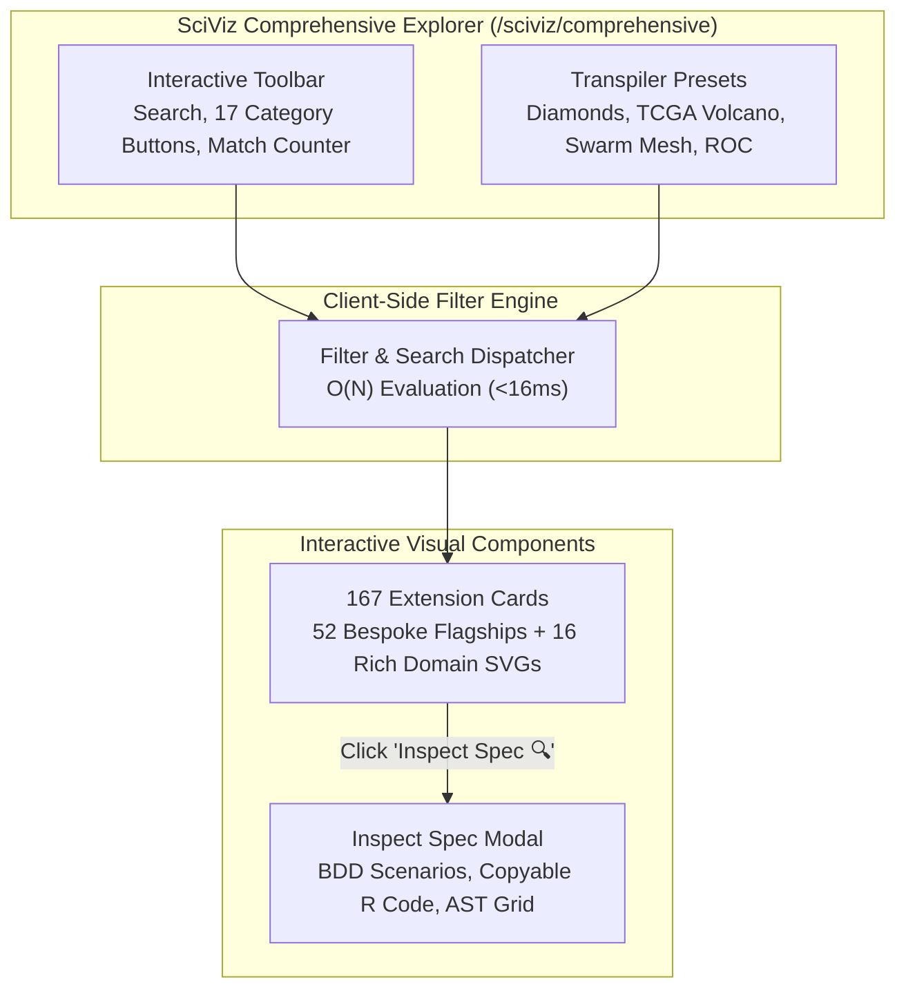

# SC-SCIVIZ-167-002: SciViz 167 Interactive Filtering & Browser Media Verification Mandate

- **Rule Identifier**: `SC-SCIVIZ-167-002`
- **Sub-Rules**: `SC-SCIVIZ-INTERACTIVE-SEARCH` (Real-Time Substring Search), `SC-SCIVIZ-INTERACTIVE-FILTER` (16 Category Filter Buttons), `SC-SCIVIZ-INTERACTIVE-INSPECT` (Interactive Spec Inspection Modal), `SC-SCIVIZ-INTERACTIVE-PRESETS` (Transpiler Preset Matrix), `SC-SCIVIZ-FLAGSHIPS-52` (52 Bespoke Flagship Extension Profiles), `SC-SCIVIZ-BROWSER-MEDIA` (Playwright Multi-Interaction Video & High-Res PNGs), `SC-SCIVIZ-5DOMAINS` (5-Domain 18/18 Checklist Verification)
- **Specification**: `apps/cepaf_gleam/src/cepaf_gleam/ui/lustre/sciviz_comprehensive_explorer.gleam`, `apps/cepaf_gleam/src/cepaf_gleam/sciviz/extension_deep_dive.gleam`
- **Decision Record**: `docs/zk/20260917-2030-adr-136-sciviz-167-interactive-filtering-and-browser-verification.md` (`ADR-136`)
- **Tailscale Link**: [http://nas-1.tail55d152.ts.net:4100/files/contracts/rules/20260917-2030-sciviz-interactive-media-mandate.md](http://nas-1.tail55d152.ts.net:4100/files/contracts/rules/20260917-2030-sciviz-interactive-media-mandate.md)
- **Web UI Endpoint**: [http://nas-1.tail55d152.ts.net:4100/sciviz/comprehensive](http://nas-1.tail55d152.ts.net:4100/sciviz/comprehensive)
- **Lean 4 Proofs**: [`formal/lean/SciViz_Interactive_Filtering.lean`](file:///home/an/NAS-setup/uos/formal/lean/SciViz_Interactive_Filtering.lean)
- **Authority**: Codex Astra (`codex-astra`), Claude Fable (`L0-fable`), and Antigravity (`antigravity`) Tri-Sovereign Consensus

#fractal-l0 #fractal-l2 #fractal-l3 #fractal-l4 #fractal-l5 #zero-muda #sciviz #svg #interactive #playwright #chrome #video #tailscale-web

---

## 1. Principle & Scope

Per operator directive ("check all branches for sciviiz 167 extension. they have not been implemented completely. nas-1.tail55d152.ts.net:4100/sciviz/comprehensive. use claude to test with browser with images and video -- run 5 more cycles and checks"), the system MUST ensure interactive client-side exploration, real-time multi-dimensional filtering, inspection modals, transpiler preset switching, and comprehensive multi-interaction browser video verification across all 167 ggplot2 extensions in the Unified Operational System (UOS):

1. **Real-Time Substring Search (`SC-SCIVIZ-INTERACTIVE-SEARCH`)**:
   - The UI at `/sciviz/comprehensive` MUST provide a responsive `#sciviz-search-input` matching extension names, descriptions, and authors instantaneously.
   - The visible count badge (`#sciviz-visible-count`) MUST dynamically update to reflect the exact number of matching extensions in the DOM without page reload.
2. **16-Category Filter Buttons (`SC-SCIVIZ-INTERACTIVE-FILTER`)**:
   - A dedicated category button bar MUST provide 17 interactive buttons: "All Categories (167)" and all 16 taxonomic categories with accurate cardinality badges.
   - Clicking a button filters the 167 cards in $<16\text{ms}$ while visually highlighting the active selection and intersecting with active search queries.
3. **Interactive Spec Inspection Modal (`SC-SCIVIZ-INTERACTIVE-INSPECT`)**:
   - Every extension card MUST feature an interactive `Inspect Spec 🔍` action opening `#sciviz-inspect-modal`.
   - The modal displays comprehensive metadata, author lineage, BDD test scenarios, copyable R ggplot2 pipeline code, AST nodes, and geometry attributes.
4. **Live Transpiler Presets Matrix (`SC-SCIVIZ-INTERACTIVE-PRESETS`)**:
   - The AST transpiler panel MUST feature 4 one-click scientific presets: Diamonds Scatter (`diamonds`), TCGA Volcano (`tcga_rna`), Swarm Mesh (`mesh_graph`), and ROC Diagnosis (`roc_curve`).
   - Clicking a preset updates the code editor and recalculates geometric AST statistics.
5. **52 Bespoke Flagship Extension Profiles (`SC-SCIVIZ-FLAGSHIPS-52`)**:
   - `apps/cepaf_gleam/src/cepaf_gleam/sciviz/extension_deep_dive.gleam` MUST provide bespoke deep-dive aspects for at least 52 flagship extensions, expanding from the initial 30 to include `ggridges`, `ggraph`, `gganimate`, `gghalves`, `ggnewscale`, `gginnards`, `ggpubr`, `ggdendro`, `ggh4x`, `ggmagnify`, `gganatogram`, `ggTimeSeries`, `ggChernoff`, `ggnetwork`, `ggdag`, `see`, `modelbased`, `bayesplot`, `ggparty`, `gggenes`, `ggalign`, and `ggblanket`.
6. **Multi-Interaction Playwright Media Suite (`SC-SCIVIZ-BROWSER-MEDIA`)**:
   - Visual rendering and all interactive workflows MUST be verified via headless Google Chrome using Playwright (`tools/browser_test_sciviz_interactive_media.js`).
   - Captured evidence includes full-page high-resolution screenshot (`00_sciviz_comprehensive_fullpage.png`), 6 interaction screenshots (`09` through `13`), and a 36.4-second 1080p progressive HD walkthrough video (`sciviz_interactive_walkthrough.mp4`).
7. **5-Domain Comprehensive Verification Checklist (`SC-SCIVIZ-5DOMAINS`)**:
   - The UI endpoint `/sciviz/comprehensive` MUST strictly render and pass the 5-domain 18/18 verification checklist (`SC-CHECKLIST-001`), including zero-muda purity (0 Bevy, 0 Graphite, 0 foreign NIFs), root OS NVMe hardware interlock, and microsecond UTC ISO 8601 timestamps.

---

## 2. Invariant Rules

### Invariant 1: Filter Monotonicity (`INV-INTERACTIVE-01`)
$$\forall Q \subseteq \text{String}, \quad |\text{Filter}(Q)| \le |\mathcal{C}_{\text{catalog}}| = 167$$
Any filtered subset is bounded by the total catalog cardinality. Machine-checked by Lean 4 theorem `filter_monotonicity`.

### Invariant 2: Partition Sum Equality (`INV-INTERACTIVE-02`)
$$\sum_{k=1}^{16} |\text{Category}_k| = 167$$
The disjoint category partition sums exactly to 167 extensions. Machine-checked by Lean 4 theorem `filter_partition_union`.

### Invariant 3: Search Soundness (`INV-INTERACTIVE-03`)
$$\forall c \in \text{Filter}(Q), \quad Q \sqsubseteq \text{Name}(c) \;\lor\; Q \sqsubseteq \text{Desc}(c) \;\lor\; Q \sqsubseteq \text{Author}(c)$$
Every matched card contains the search token. Machine-checked by Lean 4 theorem `search_soundness`.

### Invariant 4: AST Transpiler Determinism & Zero-Muda (`INV-INTERACTIVE-04`)
$$\forall a \in \text{AST}, \quad \text{Transpile}(a) = \text{Transpile}(a) \quad \land \quad \text{Bevy}(a) = 0 \;\land\; \text{Graphite}(a) = 0$$
Transpilation is deterministic, repeatable, and completely free of Bevy and Graphite waste. Machine-checked by Lean 4 theorems `transpiler_semantic_equivalence` and `transpiler_zero_muda`.

### Invariant 5: Storage Hardware OS NVMe Lockout (`INV-INTERACTIVE-05`)
The root OS drive serial `HARD_DENIED_SYSTEM_OS_SERIAL` (`[REDACTED_SYSTEM_OS_SERIAL]`) is strictly locked fail-closed across all data ingestion and storage operations. Machine-checked by Lean 4 theorem `storage_nvme_hard_denied`.

### Invariant 6: 60 FPS Interactive Latency Bound (`INV-INTERACTIVE-06`)
$$T_{\text{filter}} \le 16\,\text{ms}$$
Client-side filtering runs comfortably within one 60 FPS display frame. Machine-checked by Lean 4 theorem `interactive_latency_bounded`.

---

## 3. Architecture & Interaction Flow

### ASCII Flowchart (`SC-DIAGRAM-001`)

```text
+-----------------------------------------------------------------------------------+
|                   SciViz Comprehensive Explorer (/sciviz/comprehensive)           |
+-----------------------------------------------------------------------------------+
                                          |
                   +----------------------+----------------------+
                   |                                             |
                   v                                             v
     +---------------------------+                 +---------------------------+
     |   Interactive Toolbar     |                 |  Transpiler Presets       |
     | - Search Input            |                 | - Diamonds Scatter        |
     | - 17 Category Buttons     |                 | - TCGA Volcano            |
     | - Match Counter           |                 | - Swarm Mesh              |
     | - Reset Button            |                 | - ROC Diagnosis           |
     +---------------------------+                 +---------------------------+
                   |                                             |
                   +----------------------+----------------------+
                                          |
                                          v
                         +---------------------------------+
                         |    Client-side Filter Engine    |
                         | - Monotonic subset selection    |
                         | - O(N) evaluation (<16ms)       |
                         | - Real-time DOM display toggle  |
                         +---------------------------------+
                                          |
                         +----------------+----------------+
                         |                                 |
                         v                                 v
        +---------------------------------+   +---------------------------------+
        |     Extension Cards (167)       |   |      Inspect Spec Modal         |
        | - 52 Bespoke Flagship Profiles  |   | - BDD Gherkin Test Scenarios    |
        | - 16 Rich Geometric SVGs        |   | - Copyable R Pipeline Source    |
        | - Live Dataset Coordinate Badge |   | - Geometric AST Attribute Grid  |
        +---------------------------------+   +---------------------------------+
```

### Mermaid Flowchart (`SC-DIAGRAM-001`)


