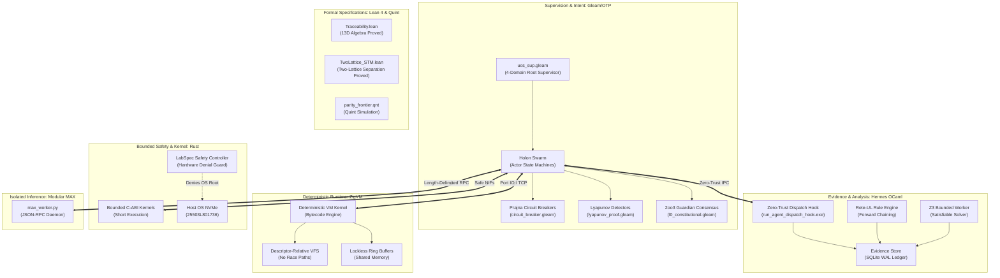

# Cross-Language Implementation of the C3I Control Plane Specification

- **Tailscale Web FQDN**: [http://nas-1.tail55d152.ts.net:4100/docs/design/20260905-1729-cross-language-c3i-control-implementation-spec.md](http://nas-1.tail55d152.ts.net:4100/docs/design/20260905-1729-cross-language-c3i-control-implementation-spec.md)
- **Fractal Coordinates**: `#fractal-l0` `#fractal-l1` `#fractal-l2` `#fractal-l3` `#fractal-l4` `#fractal-l5`
- **Knowledge Tags**: `#rocha-semiotics` `#cybernetics` `#km-triad` `#zero-muda` `#tailscale-web`
- **Transclusions**: `[[zk:20260905-1801-moc-uos-unified-master]]` `[[wiki:20260905-1801-uos-zk-km-corpus-index]]`

- **Document ID:** `20260905-1729-cross-language-c3i-control-implementation-spec`
- **Timestamp:** `20260905-1729` (Civil: 2026-09-05 17:40 Europe/Stockholm / 15:40 UTC)
- **Status:** SEALED & ADMITTED
- **Authority:** `UOS-CANONICAL-AGENT-POLICY` (§5.1)

---

## 1. Executive Purpose

This specification establishes the canonical cross-language architecture for the Unified Operational System (UOS), codifying how the Command, Control, Communications, and Intelligence (C3I) control plane functions are partitioned and coordinated across five distinct language runtimes and two formal verification systems.

---

## 2. #### Cross-Language Implementation of the C3I Control

The Unified Operational System establishes non-overlapping, strictly enforced language responsibilities across the entire control plane:

### 2.1 Gleam/OTP Control Engine (`apps/cepaf_gleam`, `apps/indrajaal_gleam`)
- **Supervision Topology**:
  `apps/cepaf_gleam/src/cepaf_gleam/uos_sup.gleam` provides the OTP 29 Level-1 root supervisor overseeing four distinct failure zones:
  1. `DomainApps`: Frontends, APIs, Wisp routers, and client interaction holons.
  2. `DomainEngines`: ZigVM interface actors and Hermes oracle coordinators.
  3. `DomainServices`: Isolated daemons including Modular MAX and persistent storage bridges.
  4. `DomainIntelligence`: Agent swarms (AGY, Claude, Codex), OODA loops, and planning workflows.
- **Prajna Circuit Breakers**:
  Pure functional Gleam implementation in `prajna/circuit_breaker.gleam` tracking consecutive failures, exponential reset cool-offs, and half-open probes.
- **Lyapunov Windowed Detectors**:
  `ha/lyapunov_proof.gleam` implements sliding-window variance and energy function evaluations ($V(x) = (x - x^*)^2$), verifying convergence ($\lambda < 0$) across system hooks.
- **Constitutional 2oo3 Guardian Consensus**:
  `fractal/l0_constitutional.gleam` enforces that no critical system reconfiguration can execute without two-of-three consensus among independent agent sentinels.
- **Universal C3I Observability**:
  All Gleam actors emit structured JSON logs formatted with microsecond UTC timestamps, 128-bit W3C OTel `trace_id`, span IDs, and fractal layer coordinates ($L_0 \dots L_9$).

### 2.2 Hermes OCaml Evidence & Oracle Engine (`engines/hermes`)
- **Authoritative Evidence Store**:
  Manages immutable append-only SQLite WAL ledgers recording all task receipts, formal verdicts, and parity comparisons.
- **Zero-Trust MCP Dispatch Interceptor**:
  `modules/system_engg/agent_dispatch_hook.ml` intercepts every tool dispatch before execution. It enforces:
  - Trapping embedded NUL bytes (exit code `-2`).
  - Trapping raw SQL syntax injections (exit code `-3`).
  - Cryptographic payload digestion using `Cryptokit.Hash.sha256 ()`.
- **Formal Analysis & Solvers**:
  Executes Gospel specification checks and runs bounded Z3 solver queries in isolated workers with timeout fencing and memory envelopes.
- **Rete-UL Rule Engine**:
  Evaluates system state against formal forward-chaining rules, cross-checked against independent reference oracles before authorization.

### 2.3 ZigVM Deterministic Runtime (`engines/zigvm`)
- **Deterministic Kernel**:
  Compiled Zig engine guaranteeing memory safety, deterministic instruction scheduling, and predictable latency.
- **Descriptor-Relative VFS**:
  Eliminates path-traversal vulnerabilities and TOCTOU races by executing all filesystem operations relative to open directory descriptors (`openat`).
- **Lockless Ring Buffers**:
  Facilitates ultra-high throughput telemetry buffering with zero garbage-collection pauses.

### 2.4 Rust Bounded Kernels & Storage Safety (`native/`, `ops/kubernetes/nas-k8s-lab`)
- **Bounded NIFs**:
  Short, deterministic, crash-safe C-ABI kernels with explicit preflight checks. Long-running or blocking work is strictly prohibited in NIFs.
- **Storage Safety Controller**:
  `ops/kubernetes/nas-k8s-lab/src/spec.rs` provides automated safety validation (`validate_safety_invariants`) hooked into `render_all()`. Hardware serial `25503L801736` (Host OS NVMe root) is permanently denied from Ceph OSD allocation.

### 2.5 Modular MAX Isolated Inference (`services/inference/max`)
- **Strict Confinement**:
  Python execution is strictly quarantined to `max_worker.py`. No Python interpreter is permitted in the control plane or kernel layers.
- **IPC Protocol**:
  Length-delimited JSON-RPC over standard I/O pipes supervised by OTP.

### 2.6 Lean 4 & Quint Formal Authority (`formal/lean/`, `formal/quint/`)
- **Mathematical Proofs**:
  - `Traceability.lean`: Machine-checked proof of 13-dimensional coordinate conservation and fail-closed trust indicator $\mathbb{I}(\text{Trust})$.
  - `TwoLattice_STM.lean`: Machine-checked proof of telemetry observation non-interference and exclusive writer lease mutex (0 errors, 0 axioms).
- **Temporal Simulation**:
  `parity_frontier.qnt` simulates intent closure state machines in Quint.

---

## 3. Cross-Language Communication Boundaries

| Sender | Receiver | Mechanism | Security & Safety Contract |
| :--- | :--- | :--- | :--- |
| **Gleam Actor** | **Gleam Actor** | Pure Erlang message passing | Monotonic generation lease fencing |
| **Gleam Actor** | **Hermes OCaml** | Subprocess pipe / Stdin JSON | Zero-Trust Dispatch Interceptor (`run_agent_dispatch_hook.exe`) |
| **Gleam Actor** | **ZigVM** | Port / Zenoh shared memory | Two-Lattice read-only telemetry ring buffer |
| **Gleam Actor** | **Rust NIF** | BEAM Erlang C-ABI | Execution budget <1ms, bounded inputs |
| **Gleam Actor** | **Modular MAX** | Supervised Daemon Pipe | Length-delimited JSON-RPC with timeout guard |

---

## 4. Verification and Admission Standard

1. **Two-Key Verification Law**:
   $$\text{Trust} = \text{Empirical Runtime Pass} \land \text{Machine-Checked Formal Proof}$$
2. **Zero-Muda Standard**:
   Total absence of Bevy and Graphite across all language trees ($N_{\text{Bevy}} = 0$, $N_{\text{Graphite}} = 0$).
3. **Mandatory Timestamp Rule**:
   All newly generated documents must carry `YYYYMMDD-HHSS-` prefix.
