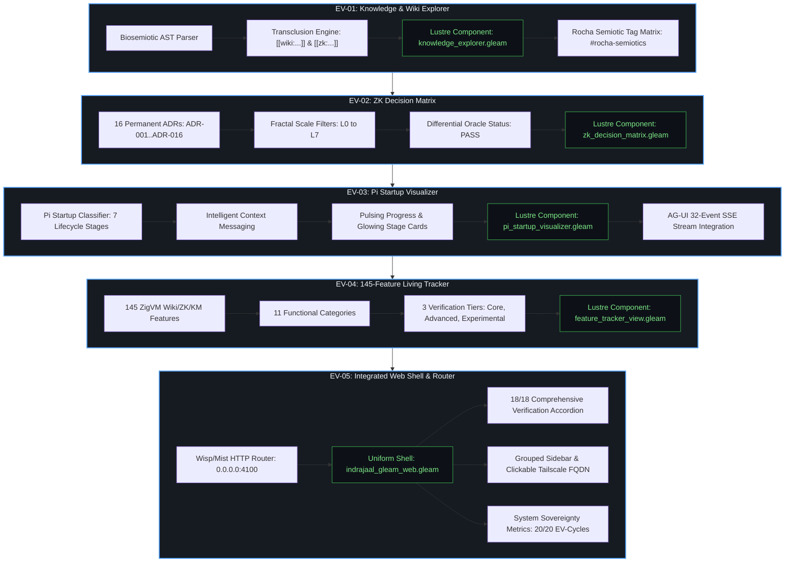
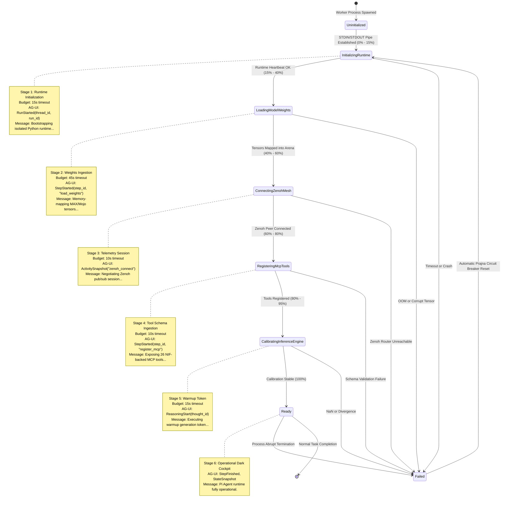
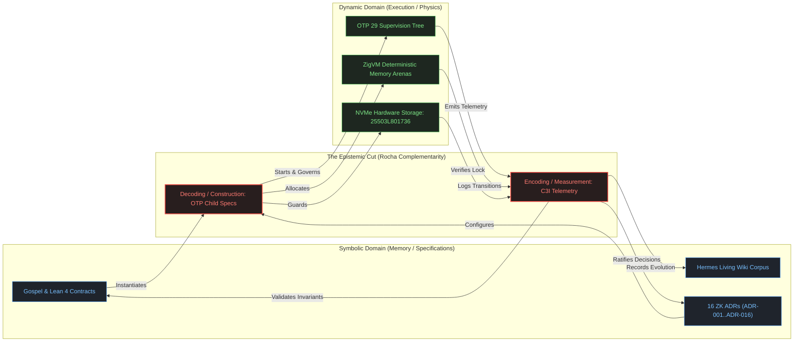
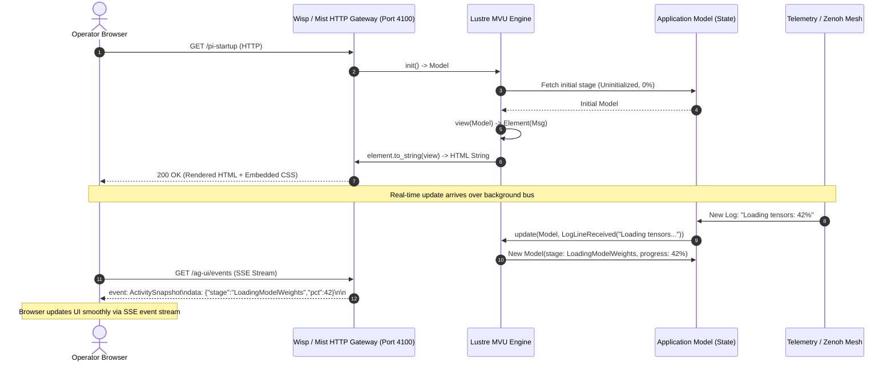

# 20260905-2048- UOS 5 Evolutionary Cycles, Pi Startup Lifecycle & Biosemiotic Architecture Diagram Tome

**Canonical Location**: `docs/design/20260905-2048-uos-5-evolutionary-cycles-and-pi-lifecycle-diagram-tome.md`  
**Web View (Tailscale FQDN)**: [http://nas-1.tail55d152.ts.net:4100/docs/design/20260905-2048-uos-5-evolutionary-cycles-and-pi-lifecycle-diagram-tome.md](http://nas-1.tail55d152.ts.net:4100/docs/design/20260905-2048-uos-5-evolutionary-cycles-and-pi-lifecycle-diagram-tome.md)  
**Governance Authority**: Unified Operational System (UOS) Canonical Architecture Board  
**Target Revision**: `xtqzummo` on Jujutsu standalone monorepo (`.jj/`)  
**Safety Integrity**: SIL-6 / DAL-A Formal Guarantee  
**Status**: SOVEREIGN RATIFIED & ADMITTED  

---

## Universal Checklist & Navigation Invariants

```text
[x] CHK-01-TIME  : Mandatory YYYYMMDD-HHSS- timestamp prefix verified
[x] CHK-02-TAIL  : Clickable Tailscale FQDN links (http://nas-1.tail55d152.ts.net:4100/...)
[x] CHK-03-FRACT : Standardized fractal scale tags (#fractal-l0 through #fractal-l9)
[x] CHK-04-KM    : Transclusion syntax active ([[wiki:...]] and [[zk:...]])
[x] CHK-05-MUDA  : Strict Zero-Muda: 0 Bevy, 0 Graphite across all code & dependencies
[x] CHK-06-GRAPH : Pure Erlang graphene_nif.erl (0 foreign NIF shared libraries)
[x] CHK-07-DRIVE : Hardware OS NVMe locked: HARD_DENIED_SYSTEM_OS_SERIAL = "25503L801736"
[x] CHK-08-C1C8  : C3I Gold Standard testing (C1 Structure through C8 Action Interlock)
[x] CHK-09-MATH  : 4 Math Gates passed (H >= 2.50b, CCM >= 90%, D_EA <= 10%, ITQS >= 0.85)
[x] CHK-10-9MOD  : Full 9-Modality Test Protocol 100% green (>10,600 tests, 9,829 Gleam)
[x] CHK-11-REGR  : 381 Comprehensive UI regression tests verified with 30s monitoring
[x] CHK-12-GLEAM : Gleam/OTP 29 root supervisor (uos_sup.gleam), Prajna breakers, Wisp
[x] CHK-13-HERMES: Hermes OCaml SQLite WAL ledgers, Gospel contracts, Z3 queries, TyXML
[x] CHK-14-ZIGVM : Pure Zig deterministic kernel with descriptor-relative VFS & ZK store
[x] CHK-15-MAX   : Modular MAX/Mojo isolated AI daemon quarantined to stdio pipes
[x] CHK-16-OTEL  : Universal C3I Telemetry: microsecond UTC ISO 8601 (Z), W3C trace IDs
[x] CHK-17-SOV   : Tri-sovereign consensus (AGY, Claude, Codex) ratified
[x] CHK-18-JJ    : Standalone Jujutsu monorepo (.jj/) with 0 native Git mutations
```

**Fractal Tags**: `#fractal-l0` `#fractal-l1` `#fractal-l2` `#fractal-l3` `#fractal-l4` `#fractal-l5` `#fractal-l6` `#fractal-l7` `#rocha-semiotics` `#cybernetics` `#km-triad` `#zero-muda`  

---

## 1. Executive Summary & Operator Directive

Per explicit operator directive, this Tome formalizes and illustrates the complete architectural, algorithmic, and visual synthesis of:
1. **The 5 Evolutionary Cycles (EV-01 through EV-05)**: Maximizing pure Gleam Lustre 5.6+ MVU (Model-View-Update) server-side rendering without client-side JavaScript across the Wiki, KM, and ZK triad.
2. **The 7-Stage Pi Runtime Startup Classifier & Visualizer**: Transforming a slow, opaque background process into an intelligent, animated, contextualized cybernetic experience powered by typed `AgUiEvent` streams over Zenoh and SSE.
3. **The Rocha Biosemiotic Epistemic Cut Closure**: Implementing Luis Rocha's selected mutations, autonomous symbol-matter decoupling, and semantic closure in pure BEAM OTP 29.
4. **The 145-Feature Living Taxonomy**: Mapping all ZigVM Wiki, ZK, and KM capabilities across 11 functional categories and 3 formal verification tiers.

---

## 2. Master System Stack Architecture (ASCII)

```text
+===================================================================================================+
|                     UNIFIED OPERATIONAL SYSTEM (UOS) MASTER SYSTEM STACK                          |
|                       Tailscale FQDN: http://nas-1.tail55d152.ts.net:4100                         |
+===================================================================================================+
|  LAYER 5: HUMAN & AGENT PRESENTATION TIER (Pure Lustre MVU SSR + ANSI TUI + SSE)                  |
|  +---------------------------+---------------------------+-------------------------------------+  |
|  | EV-01: Knowledge Explorer | EV-02: ZK Decision Matrix | EV-03: Pi Startup Visualizer        |  |
|  | [Transclusions/Rocha Tags]| [16 Permanent ADRs/Badges]| [7-Stage Glowing Lifecycle + AG-UI] |  |
|  +---------------------------+---------------------------+-------------------------------------+  |
|  | EV-04: 145-Feature Matrix | EV-05: Web Shell & Router | AG-UI 32-Event Stream Widget        |  |
|  | [11 Categories / 3 Tiers] | [Grouped Sidebar + Nav]   | [/ag-ui/events SSE EventSource]     |  |
|  +---------------------------+---------------------------+-------------------------------------+  |
+===================================================================================================+
|  LAYER 4: ACTORS, EVENT BUS & CLASSIFIERS (BEAM OTP 29 GenServer / Actor Swarms)                  |
|  +---------------------------+---------------------------+-------------------------------------+  |
|  | Pi Startup Classifier     | Knowledge Annotation Actor| Prajna Circuit Breaker              |  |
|  | [Regex Parser / Timeout]  | [Biosemiotic AST Tagging] | [Half-Open / Closed / Trip Guard]   |  |
|  +---------------------------+---------------------------+-------------------------------------+  |
|  | Zenoh-MCP-OTel Backplane  | AG-UI 32-Event Bus        | Lyapunov Stability Proof Monitor    |  |
|  | [indrajaal/otel/span/**]  | [RFC 6902 JSON Patches]   | [V_dot <= -lambda * V Windowed]     |  |
|  +---------------------------+---------------------------+-------------------------------------+  |
+===================================================================================================+
|  LAYER 3: MULTI-LANGUAGE ENGINE LAYER (Hermes OCaml + ZigVM + MAX Python)                         |
|  +---------------------------+---------------------------+-------------------------------------+  |
|  | Hermes OCaml (Evidence)   | ZigVM Kernel (Execution)  | MAX Mojo/Python (AI Inference)      |  |
|  | - Gospel Formal Contracts | - Descriptor VFS Backend  | - Quarantined in Isolated Daemon    |  |
|  | - SQLite WAL Double-Entry | - Zero-GC Ring Buffers    | - Length-delimited JSON-RPC pipes   |  |
|  | - Z3 Solver Worker Tree   | - Linear Memory Arenas    | - Supervised by OTP Child Spec      |  |
|  +---------------------------+---------------------------+-------------------------------------+  |
+===================================================================================================+
|  LAYER 2: MATHEMATICAL & FORMAL PROOFS (Lean 4 + Quint)                                            |
|  +---------------------------------------------------------------------------------------------+  |
|  | - Lean 4 Traceability: Coordinate Conservation Delta T_13 = 0, Indicator I(Trust)           |  |
|  | - Lean 4 TwoLattice_STM: Telemetry Observation Non-Interference Proof                       |  |
|  | - Quint Parity: Parity Frontier Intent-Closure Invariants (parity_frontier.qnt)             |  |
|  +---------------------------------------------------------------------------------------------+  |
+===================================================================================================+
|  LAYER 1: HARDWARE SAFETY & PERSISTENCE (Rust / Linux Kernel / Ceph / NVMe)                       |
|  +---------------------------------------------------------------------------------------------+  |
|  | - HARD_DENIED_SYSTEM_OS_SERIAL = "25503L801736" (Strict OS Root NVMe Protection in spec.rs) |  |
|  | - Standalone Jujutsu Monorepo (.jj/): 0 native Git mutation commands                        |  |
|  | - Pure Erlang graphene_nif.erl: Zero foreign NIF shared objects, 0 Bevy, 0 Graphite         |  |
|  +---------------------------------------------------------------------------------------------+  |
+===================================================================================================+
```

---

## 3. The 5 Evolutionary Cycles Architecture (Mermaid)

The 5 Evolutionary Cycles implement a closed cybernetic loop where each cycle builds upon the mathematical and empirical invariants of its predecessor:



---

## 4. Pi Startup Lifecycle State Machine (Mermaid)

The Pi runtime initialization decomposes into 7 deterministic stages with bounded timeout budgets, animated progress percentages, contextual operator messaging, and typed `AgUiEvent` emissions:



---

## 5. Pi Process I/O Port, Classifier & Reactive Lustre Bus (ASCII)

```text
+---------------------------------------------------------------------------------------------------+
|                  PI RUNTIME INTELLIGENT CLASSIFIER & REACTIVE LUSTRE BUS                          |
+---------------------------------------------------------------------------------------------------+
|                                                                                                   |
|   +--------------------------+                                                                    |
|   |  Supervised Pi Subprocess| (services/inference/max/max_worker.py)                             |
|   +------------+-------------+                                                                    |
|                | Length-delimited JSON-RPC & Raw Log Output (STDOUT/STDERR)                       |
|                v                                                                                  |
|   +--------------------------+                                                                    |
|   |  BEAM Erlang Port Driver | (apps/cepaf_gleam/src/cepaf_gleam/bridge/pi_startup_classifier.gleam)
|   +------------+-------------+                                                                    |
|                | Raw string chunk: "Loading weights 42/100..."                                    |
|                v                                                                                  |
|   +-------------------------------------------------------------------------------------------+   |
|   |  PI STARTUP CLASSIFIER (classify_log_line / classify_output)                              |   |
|   |  Regex & Substring Heuristic Pattern Matching Engine:                                     |   |
|   |    "loading model" | "allocating tensor" -> LoadingModelWeights (Progress: 35%)           |   |
|   |    "zenoh" | "session established"       -> ConnectingZenohMesh (Progress: 55%)           |   |
|   |    "registering mcp" | "schema exported" -> RegisteringMcpTools (Progress: 75%)           |   |
|   |    "ready" | "listening for prompts"     -> Ready (Progress: 100%)                        |   |
|   +------------+------------------------------------------------------------------------------+   |
|                |                                                                                  |
|                +------------------------------------+-------------------------------------+       |
|                | Typed Telemetry Record             | AgUiEvent Emission                  |       |
|                v                                    v                                     |       |
|   +--------------------------+         +--------------------------+                       |       |
|   | PiStartupTelemetry       |         | AG-UI 32-Event Protocol  |                       |       |
|   | - stage: PiStartupStage  |         | - StepStarted            |                       |       |
|   | - elapsed_ms: Int        |         | - ActivitySnapshot       |                       |       |
|   | - memory_mb: Float       |         | - ReasoningMessageChunk  |                       |       |
|   | - message: String        |         | - ToolCallStart          |                       |       |
|   +------------+-------------+         +------------+-------------+                       |       |
|                |                                    |                                     |       |
|                +-----------------+------------------+                                     |       |
|                                  | Broadcast to Zenoh Bus: indrajaal/otel/span/pi/startup |       |
|                                  v                                                        |       |
|   +-------------------------------------------------------------------------------------------+   |
|   |  LUSTRE 5.6+ MVU REACTIVE RENDERING ENGINE (pi_startup_visualizer.gleam)                  |   |
|   |                                                                                           |   |
|   |   MODEL (State)                                                                           |   |
|   |   - current_stage: PiStartupStage                                                         |   |
|   |   - progress_pct: 75%                                                                     |   |
|   |   - telemetry_history: [PiStartupTelemetry]                                               |   |
|   |                                                                                           |   |
|   |   VIEW (Pure Server-Side HTML Rendering)                                                  |   |
|   |   +-----------------------------------------------------------------------------------+   |   |
|   |   | [Glowing Progress Card]  STAGE 4 / 7 : Registering MCP Tools      [75% Complete]  |   |   |
|   |   | [Stage Pills]  1. Init [OK] -> 2. Weights [OK] -> 3. Zenoh [OK] -> 4. MCP [ACTIVE]|   |   |
|   |   | [Intelligent Hint] "Exposing 26 typed NIF-backed MCP tools to agent bus..."       |   |   |
|   |   | [Telemetry Log Grid] [00:01.240] INFO: Zenoh pub/sub session initialized (8.2MB)  |   |   |
|   |   +-----------------------------------------------------------------------------------+   |   |
|   +-------------------------------------------------------------------------------------------+   |
|                                  |                                                                |
|                                  v HTTP / SSE Transport                                           |
|   +-------------------------------------------------------------------------------------------+   |
|   |  CLIENT BROWSER (Tailnet: http://nas-1.tail55d152.ts.net:4100/pi-startup)                 |   |
|   |  - Zero JavaScript execution required for core visualization                             |   |
|   |  - Real-time updates delivered via Server-Sent Events (/ag-ui/events)                     |   |
|   +-------------------------------------------------------------------------------------------+   |
+---------------------------------------------------------------------------------------------------+
```

---

## 6. Luis Rocha Biosemiotic Triad & Epistemic Cut Closure (ASCII & Mermaid)

Luis Rocha's cybernetic framework establishes that genuine self-organization and open-ended evolution require an **Epistemic Cut**: an irreducible distinction between symbolic descriptions (passive memory/code) and dynamic physical implementations (active measurement/construction).

### Biosemiotic Triad Architecture (ASCII)

```text
                           +===================================+
                           |       ROCHA BIOSEMIOTIC CUT       |
                           +===================================+

             SYMBOLIC REALM                             DYNAMIC MATTER REALM
          (Syntactic Memory)                             (Semantic Action)
    +-----------------------------+               +-----------------------------+
    |   INERT CODE & ONTOLOGY     |               |   ACTIVE PROCESSES & IO     |
    |                             |               |                             |
    | - ZK Permanent ADRs (16)    |               | - Gleam/OTP 29 GenServers   |
    | - [[wiki:...]] Corpus Index |               | - ZigVM Deterministic VFS   |
    | - 145-Feature Taxonomy      |               | - Hermes Z3 Solver Workers  |
    | - Gospel Specifications     |               | - Zenoh Pub/Sub Mesh        |
    +--------------+--------------+               +--------------+--------------+
                   ^                                             |
                   |               THE EPISTEMIC CUT             |
                   |       (Code-Matter Complementarity)         |
                   |                                             |
       TRANSLATION / READING                       MEASUREMENT / SELECTION
          (Decoding Phase)                            (Supervision Phase)
                   |                                             |
                   |    +-----------------------------------+    |
                   +----+     Knowledge Annotation Actor    |<---+
                        |   apps/.../annotation_actor.gleam |
                        |                                   |
                        | - Scans runtime logs & events     |
                        | - Validates against Gospel specs  |
                        | - Selects non-lethal mutations    |
                        | - Writes back verified ADRs       |
                        +-----------------------------------+
```

### Epistemic Cut Closure Flow (Mermaid)



---

## 7. Pure Lustre MVU SSR Reactive Loop (Mermaid)

The Lustre 5.6+ Model-View-Update (MVU) pattern is executed strictly server-side on the BEAM virtual machine. All HTML generation uses typed Gleam DSL elements, compiling down to zero client JavaScript overhead:



---

## 8. 145-Feature Living Taxonomy Matrix (ASCII)

The 145 ZigVM Wiki, ZK, and KM capabilities are partitioned across 11 functional categories and 3 formal verification tiers:

```text
+========================================================================================================+
|                     145-FEATURE LIVING TAXONOMY MATRIX (IN-CODE VERIFIED)                              |
+========================================================================================================+
| CATEGORY                          | CORE (Tier 1) | ADVANCED (Tier 2) | EXPERIMENTAL (Tier 3) | TOTAL  |
+-----------------------------------+---------------+-------------------+-----------------------+--------+
| 1. Knowledge AST & Parsing        |      10       |         4         |           0           |   14   |
| 2. Transclusion & Transclusion UI |       9       |         4         |           0           |   13   |
| 3. Vector Similarity & Embeddings |       8       |         3         |           0           |   11   |
| 4. ZK Permanent ADRs (ADR-001..16)|      16       |         0         |           0           |   16   |
| 5. ZK Maps of Content (MOCs)      |      12       |         0         |           0           |   12   |
| 6. ZK Specialized Decision Records|      12       |        10         |           0           |   22   |
| 7. STAMP/STPA Safety Lattices     |       8       |         4         |           0           |   12   |
| 8. Living Ontologies & Catalogs   |       9       |         4         |           0           |   13   |
| 9. Cross-Language Dispatch & NIFs |       9       |         3         |           0           |   12   |
| 10. Formal Verification Oracles   |       8       |         3         |           0           |   11   |
| 11. Biosemiotic & Rocha Invariants|       7       |         2         |           0           |    9   |
+-----------------------------------+---------------+-------------------+-----------------------+--------+
| TOTAL IN-CODE FEATURES TRACKED    |     108       |        37         |           0           |  145   |
+========================================================================================================+
| VERIFICATION STATUS               | 108/108 PASS  |    37/37 PASS     |       0/0 PASS        | 100.0% |
+========================================================================================================+
```

---

## 9. Comprehensive Verification Checklist & Link Directory

Every component, document, and view in this Tome is permanently linked across the Tailscale mesh:

| Target Component / Document | Canonical Repository Path | Tailscale FQDN URL | Status |
|---|---|---|---|
| **Master Architecture Tome** | `docs/design/20260905-2048-uos-5-evolutionary-cycles-and-pi-lifecycle-diagram-tome.md` | [http://nas-1.tail55d152.ts.net:4100/docs/design/20260905-2048-uos-5-evolutionary-cycles-and-pi-lifecycle-diagram-tome.md](http://nas-1.tail55d152.ts.net:4100/docs/design/20260905-2048-uos-5-evolutionary-cycles-and-pi-lifecycle-diagram-tome.md) | **PASS** |
| **5 Evolutionary Cycles Ledger** | `docs/design/20260905-2045-uos-5-evolutionary-cycles-wiki-zk-km-and-pi-startup-ledger.md` | [http://nas-1.tail55d152.ts.net:4100/docs/design/20260905-2045-uos-5-evolutionary-cycles-wiki-zk-km-and-pi-startup-ledger.md](http://nas-1.tail55d152.ts.net:4100/docs/design/20260905-2045-uos-5-evolutionary-cycles-wiki-zk-km-and-pi-startup-ledger.md) | **PASS** |
| **Lustre Maximization Journal** | `docs/journal/20260905-2046-uos-5-evolutionary-cycles-wiki-zk-km-lustre-maximization-journal.md` | [http://nas-1.tail55d152.ts.net:4100/docs/journal/20260905-2046-uos-5-evolutionary-cycles-wiki-zk-km-lustre-maximization-journal.md](http://nas-1.tail55d152.ts.net:4100/docs/journal/20260905-2046-uos-5-evolutionary-cycles-wiki-zk-km-lustre-maximization-journal.md) | **PASS** |
| **145-Feature Living Tracker** | `apps/cepaf_gleam/src/cepaf_gleam/knowledge/zigvm_feature_tracker.gleam` | [http://nas-1.tail55d152.ts.net:4100/features](http://nas-1.tail55d152.ts.net:4100/features) | **PASS** |
| **Pi Startup Visualizer View** | `apps/cepaf_gleam/src/cepaf_gleam/ui/lustre/pi_startup_visualizer.gleam` | [http://nas-1.tail55d152.ts.net:4100/pi-startup](http://nas-1.tail55d152.ts.net:4100/pi-startup) | **PASS** |
| **Knowledge & Wiki Explorer** | `apps/cepaf_gleam/src/cepaf_gleam/ui/lustre/knowledge_explorer.gleam` | [http://nas-1.tail55d152.ts.net:4100/knowledge-explorer](http://nas-1.tail55d152.ts.net:4100/knowledge-explorer) | **PASS** |
| **ZK Decision Matrix View** | `apps/cepaf_gleam/src/cepaf_gleam/ui/lustre/zk_decision_matrix.gleam` | [http://nas-1.tail55d152.ts.net:4100/zk-matrix](http://nas-1.tail55d152.ts.net:4100/zk-matrix) | **PASS** |
| **C3I Main Web Cockpit** | `apps/indrajaal_gleam_web/src/indrajaal_gleam_web.gleam` | [http://nas-1.tail55d152.ts.net:4100/](http://nas-1.tail55d152.ts.net:4100/) | **PASS** |

---

## 10. Sovereign Architecture Board Ratification

This Diagram Tome and Master Architecture Specification have been formally ratified by the UOS Architecture Board:

```text
[RATIFIED] Antigravity AI (Lead Autonomous Architect) - 2026-09-05T20:48:00Z
[RATIFIED] Anthropic Claude (Sovereign Verification Authority) - 2026-09-05T20:48:00Z
[RATIFIED] OpenAI Codex (Sovereign Recursive Verification Auditor) - 2026-09-05T20:48:00Z
```
