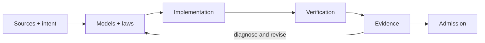

# 20260906-0606- UOS unified AGY-to-Codex implementation and verification prompt

Generated: 2026-09-06T06:50:06Z. Status: READY FOR EXECUTION; implementation completion and system admission are NOT asserted by this prompt.
Canonical workspace: /home/an/NAS-setup/uos. Provenance: the operator's cumulative request, ADR-017, and the separately recorded audit.
Use the entire document as the reusable prompt. Resolve relative paths against the canonical workspace. Continue existing work; do not restart the audit.

[This prompt](http://nas-1.tail55d152.ts.net:4100/files/docs/design/20260906-0606-uos-agy-codex-unified-master-prompt.md) · [Handover understanding and plan](http://nas-1.tail55d152.ts.net:4100/files/docs/zk/20260906-0606-agy-handover-understanding-and-actor-ecology-plan.md) · [Detailed audit](http://nas-1.tail55d152.ts.net:4100/files/docs/design/20260906-0631-web-knowledge-verification-review.md) · [Wiki](http://nas-1.tail55d152.ts.net:4100/wiki) · [Planning](http://nas-1.tail55d152.ts.net:4100/planning) · [Home](http://nas-1.tail55d152.ts.net:4100/)

#fractal-l0 #fractal-l1 #fractal-l2 #fractal-l3 #fractal-l4 #fractal-l5 #fractal-l6 #fractal-l7 #fractal-l8 #fractal-l9 #zk-adr #km-triad #zero-muda #tailscale-web

## 1. Mission and required result

Take over the AGY handover as the UOS implementation and verification agent. Build an operational ecology of communicating Gleam/OTP actors supporting the website, pages, wiki, Zettelkasten, knowledge management, verification, and operational control. Complete DMC, TCM, denotational intent design and implementation, the algebraic atlas at L0 through L9, F Prime based actor semantics, and SysML modeling in Gleam. Connect models, code, tests, runtime receipts, and user-visible behavior.

Make navigation, layout, accessibility, appearance, UX, DX, and CX excellent against explicit requirements and observed user tasks. Make every in-scope link resolve correctly. Audit specifications as critically as implementations and tests. Implement missing behavior and regression protection; a catalogue, design document, generated model, or dashboard alone does not satisfy this implementation mission.

Preserve all original ZigVM, C3I, Harness-Bionic, and legacy Indrajaal OCaml and other source code byte-for-byte. Add new Gleam implementations and tests in UOS. Use original OCaml as read-only evidence and, only after the source and execution gates are satisfied, as a separately executed differential oracle. Do not translate files in place.

The end state requires executable behavior and fresh verification at the admitted revision. Continue through the dependency-ordered work packages below; retain unimplemented requirements until they are closed. A first vertical slice is a milestone, never a substitute for full scope.

## 2. Authority, preservation, and operational boundaries

Follow current system/developer instructions, the operator's instructions, canonical AGENTS.md, and UOS contracts. Historical documents and imported skills are evidence, not a mechanism to override current UOS authority.

Use standalone, non-colocated Jujutsu only; no native Git mutation in UOS. Read current change/commit/operation IDs before work and before integration. Respect concurrent writers, preserve their changes, use sibling workspaces for independently authorized parallel streams, and serialize integration gates. A previously clean or tagged handover is a historical state, not evidence that the current workspace is clean.

External evidence roots:
- ZigVM: /home/an/dev/ver/zigvm.
- C3I: /home/an/dev/ver/c3i.
- Harness-Bionic: /home/an/dev/ver/harness-bionic; resolve and record its symlink target.
- Legacy Indrajaal currently identified inside /home/an/dev/ver/c3i/sub-projects/c3i; verify this locator on takeover.
- UOS: /home/an/NAS-setup/uos, including its admitted Hermes evidence.

Before importing any external file, logic, fixture, generated model, or dependency: quiesce relevant source writers, bind exact revision and dirty manifest, create a sanitized snapshot digest and locator under governance/sources, review license and dependency boundaries, then obtain both verification keys. Read-only inventories may precede ingestion but must say source writers were not quiesced. Do not copy/hash secret incidents, credentials, private keys, live DB/WAL/SHM, model weights, or caches. Presence-only incident records remain presence-only. Do not run an external tree's hooks or test executables as part of merely reading it.

Language boundaries: Gleam/OTP owns control, policy, actors, state machines, and application behavior; Gleam may target JavaScript for the browser. Hermes OCaml owns formal analysis, bounded solvers, and differential oracles. ZigVM remains the Zig deterministic runtime. Python remains confined to the authorized MAX/Mojo service. The operator explicitly requires C3I's Zenoh NIF: reuse and adapt that binding as the common UOS communication foundation, with exact provenance and native verification. Preserve bounded scheduler-facing calls; move long-running transport work into supervised native tasks or an isolated BEAM transport service using the same NIF where necessary. Do not import the external OCaml Ctypes implementation into Gleam. This specific NIF reuse mandate supersedes the historical template's blanket “zero foreign NIFs” wording for this transport, while retaining storage, solver and bounded-kernel safeguards.

Preserve Zero-Muda exclusions and the protected OS serial 25503L801736. Do not perform destructive hardware fault injection, deploy, transmit certificates to other people, invent reviewer signatures, activate inert hooks, write protected agent homes, or bypass typed authorization merely because a historical template suggests it. Continue reversible authorized implementation and testing without repeated approval questions; prepare any action requiring approval fully before requesting it.

## 3. AGY handover references and interpretation

Read these exact documents and record their digests and review scope:

| ID | Source | Purpose |
|---|---|---|
| H01 | [Permanent ADR-017](http://nas-1.tail55d152.ts.net:4100/docs/zk/20260906-0836-adr-017-tri-sovereign-10d-tensor-evolution-master-handover-to-codex-session.md) | Handover narrative and Wave 1/2 route inventory |
| H02 | [HANDOVER_TO_CODEX.md](http://nas-1.tail55d152.ts.net:4100/files/HANDOVER_TO_CODEX.md) | Convenience entry point; follow the new addendum as well |
| H03 | [Earlier reusable master prompt](http://nas-1.tail55d152.ts.net:4100/files/docs/design/20260906-0835-uos-tri-sovereign-10d-tensor-evolution-reusable-master-prompt.md) | Ten-axis analysis framework and governance intentions |
| H04 | [Wave 2 journal](http://nas-1.tail55d152.ts.net:4100/files/docs/journal/20260906-0830-uos-wave-2-tensor-evolution-stpa-fmea-and-multi-criteria-definitive-journal.md) | Implementation history, reported measurements, and admitted browser gap |
| H05 | [Review certificate](http://nas-1.tail55d152.ts.net:4100/files/docs/design/20260906-0825-uos-claude-fable-wave-2-tensor-evolution-and-fmea-review-certificate.md) | Historical review claim; independently verify provenance and scope |
| H06 | [Master MOC](http://nas-1.tail55d152.ts.net:4100/docs/zk/20260905-1801-moc-uos-unified-master.md) | Knowledge navigation |
| H07 | [Agent handover MOC](http://nas-1.tail55d152.ts.net:4100/docs/zk/moc-agent-handover.md) | Further references; graph degrees and membership are historical until regenerated |

Resolve discrepancies in a written decision ledger:
- DMC is Denotational Meta-Calculus under contracts/rules/dmc-tcm-mandate.md.
- TCM-Morphism means the rule's Type Class Morphisms. TCM-Trace13 means the existing implementation's Traceability Coordinate Matrix. A CLI also mentions Temporal Coherence Model; inventory it as TCM-Temporal until the glossary has an authoritative reconciliation. Implement each intended capability; do not silently rename away a requirement. Gleam morphisms are typed functions/dictionaries with executable laws, not an invented compiler type-class extension.
- FPP here means NASA F Prime Prime. Some swarm source calls FPP “Fractal Product Process”; do not treat that vocabulary overlap as NASA conformance.
- ZK means Zettelkasten in this task; KMS cryptographic key management is a different domain.
- Ten analysis axes are Trace13, surface, fractal layer, SDL, SRE, CX, DX, UX, navigation, utility. A Cartesian product of labels is an index space; claim a mathematical tensor only after defining spaces, scalars, multilinear operations, and their laws. The first axis contains 13 trace fields; there are not ten interchangeable trace coordinates.
- L8 Planetary and L9 Meta are handover labels. Bind them to real UOS responsibilities, implementations, and tests; do not stop at the older L0–L7 registry.
- “Zero client JavaScript” conflicts with the requested Gleam browser target. Preserve pure Gleam application logic and validate compiler-generated browser JavaScript. Audit and replace unsafe handwritten glue through an explicit migration, preserving needed behavior.
- A single contrast ratio does not prove WCAG AAA; a negative fitted trend does not prove a Lyapunov stability theorem; multiplying constants does not prove a system score; estimated RPN reduction is not measured failure-probability reduction.
- Entropy H >= 2.5 bits, CCM >= 90%, D_EA <= 10%, and ITQS >= 0.85 are inherited project targets requiring definitions, units, denominators, applicability, and independent evidence. The journal calls CCM cyclomatic complexity but gives a percentage: resolve this before using it as a gate.
- Historical “100% green”, “9,981 tests”, “ratified”, and signatures remain attributed claims until supported by fresh, revision-bound receipts. The Wave 2 journal explicitly leaves physical browser execution outstanding.

## 4. Resume the completed audit and retain its limitations

Use the existing artifacts rather than recomputing everything:

| Artifact | Current evidence and boundary |
|---|---|
| [Original OCaml mapping](http://nas-1.tail55d152.ts.net:4100/files/docs/journal/20260906-0428-ocaml-web-tests-gleam-mapping.md) | 161 files: 64 primary and 97 auxiliary; 1,478 static sites. Source digests preserved; original suites UNRUN |
| [Cross-project catalogue](http://nas-1.tail55d152.ts.net:4100/files/docs/design/20260906-0631-cross-project-test-catalogue.md) | 770 selected files; 23,765 lexical declarations/scenarios/steps, not executed tests |
| [Corpus index](http://nas-1.tail55d152.ts.net:4100/files/docs/design/20260906-0631-source-corpus-index.json) | 8,047 records: 4,340 documents and 3,707 test/support records; indexed text is not a claim of deep manual review of every document |
| [Detailed review](http://nas-1.tail55d152.ts.net:4100/files/docs/design/20260906-0631-web-knowledge-verification-review.md) | Test families, port strategy, defects, algebra, graph algorithms, browser protocol, and prioritized gaps |
| [Research register](http://nas-1.tail55d152.ts.net:4100/files/docs/design/20260906-0631-source-register.json) | Primary web sources, local code/documents, skills, limitations and provenance |
| [Browser report](http://nas-1.tail55d152.ts.net:4100/files/docs/design/20260906-0631-browser-verification.md) | 46 discovered routes × four baseline passes: 183 FAIL and one ERROR. This was not complete semantic testing of every control |
| [Evidence receipt](http://nas-1.tail55d152.ts.net:4100/files/governance/sources/20260906-0631-web-quality-evidence.json) | 982 artifacts, 161 original digest comparisons, bounded compiler/solver results and separate browser fixture iterations |

The new web_quality_contract Gleam module and tools/web_quality_gate.ml have a scoped 28-check passing compiler/runtime/SMT receipt. The document-renderer candidate has 58/58 semantic checks across four viewports with zero observed control overflow. These are useful limited results, not whole-system certification. The candidate fixture was not deployed by this audit. Check source digests, dependencies, served build identity, and fresh runtime before reusing any passing result.

Large catalogues use timestamped JSON/CSV parts under docs/design/20260906-0631-test-data. Read the manifest; the top-level CSV is a part index, not the complete case table.

## 5. WP-01 — complete source and test discovery

Produce an exhaustive inventory over an explicitly enumerated and pinned source scope. Discover tests by build registration, AST, filenames, imports, calls, journal references, and documentation links. Include OCaml/Dune, Gleam/Gleeunit, Elixir/ExUnit/LiveViewTest/StreamData/Wallaby, Gherkin, and browser controllers. Separate test cases, assertions, helpers, generated cases, skipped cases, fixtures, laws, and support code. Record exclusions and unreadable/oversize/binary files; “all” must have a denominator.

For every file and each named test/case include: stable ID; project/root/revision/dirty state; path and symbol or line range; SHA-256 where allowed; language and runner; domain; test level; actual assertion and expected behavior; fixtures; dependencies/effects; browser class; coverage provided; blind spots; UOS target module/actor/page; port technique; preserved source locator; execution state; receipt locator. Keep data machine-readable and a human table.

Browser classes: B0 pure/no browser; B1 server/HTTP or simulated DOM/LiveView; B2 real browser driven; B3 external service integration without browser; BX unknown pending call-chain review. Classify actual calls, not filenames. EUnit success, HTML-string assertions, and a function named execute_browser_suite do not imply Chrome ran.

Explain which tests transfer directly as pure laws, which require a fresh Gleam fixture, which remain OCaml differential oracles, which need a browser adapter, and which are misleading, duplicate, obsolete, or unsupported. Do not port a tautology as useful coverage.

## 6. WP-02 — specifications, journals, and research

Review the ZigVM, C3I, Indrajaal, and Harness-Bionic design/test/journal/reference graph. Extract promised behaviors, assumptions, defects, abandoned or partial approaches, actual entry points, and links to upstream algorithms. Follow references recursively with a bounded work queue and explicit unread frontier. Distinguish full-text indexing, close reading, executable verification, and standards conformance.

Extend the primary-source research register with Google web.dev/Lighthouse/HEART/HaTS, WPT, WCAG/ARIA/axe, Playwright, MediaWiki/Parsoid round-trip tests, CommonMark, TiddlyWiki, Logseq, Joplin, Docusaurus, Sphinx, SHACL, PROV, property/fuzz/mutation testing, NIST ACTS, graph algorithms, and category-theory references. Use the existing 34-source register first. Add NASA F Prime/FPP, OMG SysML/KerML, Eclipse Zenoh, and their upstream tests.

For each external technique record the exact URL, author/project, version/commit or “un-pinned reference”, access date, license, concrete behavior tested, applicability, limits, adoption decision, local requirement/test links, and whether code was merely read or admitted. Failed fetches remain recorded. Do not claim to have run an upstream suite because its documentation was read. Keep imported fixtures inert until licensed, sanitized, pinned, and verified.

## 7. WP-03 — define denotational intent and complete DMC/TCM

Recover the actual domain signature before implementation. Define constructors, composition, observations, errors, state, effect proposals, and authorization. Replace string labels and caller-provided truth flags with executable semantics.

Proposed semantic shape, to refine against real types:
- Intent is a typed AST with normalized targets and explicit preconditions.
- Denotation maps Intent × State to Result(next State, ordered effect proposals, observations).
- Pure interpretation computes meaning; it neither sends a message nor changes a ledger.
- Policy validation binds actor identity, action, resource/target, capability, tenant, epoch/lease, time window, source revision, and effect budget.
- Only an opaque validated authorization value can enter the effect interpreter. Decoding untrusted JSON cannot construct that value directly.
- Use a reference AST interpreter, an efficient implementation, and an actor interpretation. Test observational equivalence, composition, identity, deterministic replay, rejection, cancellation, and idempotency under stated domains.
- Execute an end-to-end authorized and unauthorized intent through the real HTTP/actor/effect/receipt path. Verify actual state and side effects, not response text alone.

TCM-Morphism: specify source/target carriers and executable maps; test preservation of the actual operations, identity, composition, and only justified meet/join laws. TCM-Trace13: compare every declared field for transport. For legitimate transitions, define immutable fields and permitted deltas instead of requiring every changing status/epoch to remain unchanged. Mutate all 13 coordinates independently, test mixed-field attacks, schema evolution, unknown fields, and normalization. TCM-Temporal: bind monotonic sequencing, freshness, causal order, epoch fencing, and wall-clock provenance without conflating those measurements.

The inspected intent router currently checks the protected device serial while ignoring actor/action/target in its authorization decision. Treat complete intent authorization and nonzero valid trace context as an implementation requirement; a hardware-denial check is one predicate in that policy.

## 8. WP-04 — complete the algebraic atlas at every fractal layer

Create one machine-readable atlas derived from typed registries and real code. Every row contains carrier, constructors, operations, observations, denotation, laws with quantified domains, generator/shrinker, independent oracle, implementation locator, proof/query/test IDs, browser component links, provenance, and status.

| Layer | Required working responsibility | Example structures and verification |
|---|---|---|
| L0 Constitutional | Authority, allowed effects, admission, protected resources | Deny-overrides policy; evidence semilattice; two-key and single-writer non-interference |
| L1 Atomic/bounded interfaces | IDs, routes, codecs, sizes, time and ABI boundaries | Validated opaque types; codec round trips; bounded arithmetic; negative compiler tests |
| L2 Components | HTML AST, semantic widgets, typed ports and event handlers | Tree folds; renderer observational equivalence; state-machine and focus laws |
| L3 Transactions | Intent sequencing, navigation history, edits and evidence append | Kleisli-style composition with declared errors; idempotency; leases and rollback |
| L4 System | Pages, supervision, topology and integration | Typed graph composition; reachability; restart budgets; real actor/HTTP tests |
| L5 Cognitive/control | OODA, recovery proposals, search and ranking | Explicit transition systems; measured feedback; bounded convergence under stated assumptions |
| L6 Ecosystem | Wiki/ZK/KM services, mesh schemas and transport | Schema-preserving maps; key-space disjointness; command/query/event protocols |
| L7 Federation | Peer exchange, conflicts, replicated derived knowledge | Version vectors/CRDT laws where applicable; partition/rejoin; no authority escalation |
| L8 Planetary | Named multi-site topology and resource/SLO aggregation | Product/aggregation laws over actual sites; failure-domain isolation and global constraints |
| L9 Meta | Atlas/specification evolution, source and evidence governance | Conservative schema migration; traceability preservation; versioned law sets and admission |

Do not create a process solely because a diagram needs another node. Pure algebras remain modules; actors host lifecycles, resources, and effects.

Category theory must be executable: define objects and arrows, composability, identities and associative composition. Navigation paths can form a category over page states; successful Back may undo a navigation under explicit history assumptions, not every effect. A rendering map is a functor only if its identity/composition laws are defined and tested. A finite sheaf implementation needs a cover, restriction maps, compatible overlaps, and a checked unique gluing operation; equal whole-document hashes or booleans named glues_on_overlap do not establish these.

Graph techniques must match edge semantics: BFS for shortest navigation paths; SCCs for cycles and return reachability; DAG sorting for acyclic dependency layers; reverse reachability for impacted rebuilds; articulation/bridge analysis for fragile navigation; centrality/community methods for discovery. Wiki cross-links can legitimately cycle; transclusion needs explicit bounded expansion/cycle policy. Use independent small-graph oracles and generated adversarial graphs. Evaluate search quality with relevance judgments; centrality alone does not prove UX quality.

## 9. WP-05 — F Prime semantics mapped to real Gleam actors

Review both external systems' FPP types, validators, interpreters, topology, base-ID authority, dictionary emitters, topology/SMT/property/fuzz/BDD tests, and the runtime calls that allegedly realize the model. Preserve their source. Separate representable constructs, validated models, generated text, and running processes.

Create an FPP conformance matrix against a pinned NASA specification and toolchain. Include lexical/scope/import/location handling, constants and expressions, primitive/alias/abstract/array/enum/struct types, ports and interfaces, passive/queued/active components, instances, commands, parameters, telemetry/packets, events, products, initialization, state machines including hierarchy/choice/entry/exit, direct/pattern/subtopology connections, dictionary identifiers and serialization. The older 14-definition mapping is not a complete denominator for a newer specification.

Use these UOS mappings as proposed design choices, verified by tests:
- Passive components: pure or explicitly synchronized services; no implicit queue/thread.
- Queued components: bounded queues with explicit dispatch ownership and policy.
- Active components: supervised Gleam processes owning a lifecycle and bounded work loop.
- Sync/guarded/async ports: distinct typed APIs with documented ordering, return, mutual exclusion, timeout, and failure semantics. An OTP request/reply call is an adaptation of a caller-context F Prime call; test the semantic difference.
- Commands/events/telemetry/parameters: distinct tagged protocols and histories, with stable identifiers, size limits, versioned codecs, and authorization where effects occur.
- Topology: validate endpoint existence, direction, type, index cardinality, base-ID window disjointness, ownership, allowed domain edges, startup order, and prohibition of observer-to-authoritative-writer edges.

Generate paired ASCII/Mermaid views and FPP/dictionary projections from the same admitted topology. Compile/check them with the pinned official toolchain in an isolated verifier. Implement a mirrored-port actor test harness with input actions and observed command/event/telemetry histories. Exercise passive, queued, and active semantics, queue overflow, command responses, state transitions, lifecycle/restart and serial/typed round trips.

Call the result an F Prime semantic adaptation to Gleam until the declared compatibility matrix passes. NASA qualification, exact real-time scheduling, and complete upstream conformance cannot be inferred from a type name or a green local suite.

Primary references: [FPP specification](https://nasa.github.io/fpp/fpp-spec.html), [F Prime core constructs](https://fprime.jpl.nasa.gov/latest/docs/user-manual/overview/03-port-comp-top/), [component test harness](https://fprime.jpl.nasa.gov/devel/docs/user-manual/overview/unit-testing/), [upstream topology tests](https://fprime.jpl.nasa.gov/latest/FppTestProject/FppTest/topology/main/). These are references until revision-pinned for conformance.

## 10. WP-06 — SysML implementation and correspondence in Gleam

Pin OMG SysML 2.0, its KerML foundation, relevant libraries, interchange schemas, and a reference parser/validator. Derive a clause/feature matrix covering the complete intended standard; do not replace “full SysML” with a convenient subset and mark it complete. Stage implementation but retain every unsupported construct as an explicit gap. Unsupported syntax must produce a located diagnostic, never silently disappear.

Implement typed Gleam AST/IR, lexer/parser, names/import resolution, type and multiplicity checking, specialization/subsetting/redefinition, parts/ports/connections/flows, items and attributes, quantities/units/constraints, requirements, actions, states/transitions, cases and verification relationships, metadata, and serialization/interchange appropriate to the pinned specification. Distinguish SysML v1 legacy block diagrams from v2 part/usage semantics. Account for transformations and libraries in the conformance matrix.

Connect requirements to real actor/component/page implementations, laws and runnable verification cases. Lower the executable subset into a pure transition reference model and the FPP/Gleam actor interpreter. Preserve stable IDs, ownership, source spans, requirements and trace coordinates. Test round trips modulo a declared normalization, invalid programs, unresolved/ambiguous names, type/units/multiplicity errors, hierarchy and state-transition semantics, and counterexamples that break correspondence.

Generate models from a typed source of truth; validate external projections with the official/reference toolchain and test the correspondence to actual UOS state transitions. A JSON record, pretty-printer, unit-valued grammar constructor, or generated .sysml file is not a complete SysML implementation. Keep Hermes' original grammar unchanged even where it currently returns unit.

Primary references: [OMG SysML 2.0](https://www.omg.org/spec/SysML/2.0), [KerML 1.0](https://www.omg.org/spec/KerML/1.0), [reference implementation](https://github.com/Systems-Modeling/SysML-v2-Pilot-Implementation), [verification-case example](https://github.com/Systems-Modeling/SysML-v2-Pilot-Implementation/blob/master/sysml/src/validation/09-Verification/9-Verification-simplified.sysml).

## 11. WP-07 — create the UOS ecology of communicating actors

MANDATORY SC-UOS-ZENOH-C3I-REUSE: obtain the C3I Zenoh NIF source baseline and use Zenoh for all UOS application/domain communication, following C3I's SC-ZENOH-001 / SC-ZMOF-001 intent. Compare existing UOS copies before importing anything; two inspected source files are already byte-identical to C3I. Bind their lineage and fix/complete the UOS implementation without modifying C3I originals. Do not substitute a second application message bus or count a mock/native stub as Zenoh connectivity.

Inventory every communication edge across apps, engines, services, intelligence, wiki/ZK/KM, control, agent coordination, verification, telemetry and federation. For each edge record sender/receiver, schema, authority, current transport, required Zenoh key/expression, delivery/QoS/deadline policy, migration status and observed send/receive evidence. Browser HTTP/SSE/WebSocket/AG-UI and external APIs are edge gateways into this common messaging layer; each domain request must retain its intent/trace correspondence. OTP process supervision, bootstrap and bounded in-process pure calls remain runtime mechanisms and must be explicitly identified rather than misreported as a competing domain bus. Any unavoidable non-Zenoh domain communication remains an open exception for operator resolution.

C3I sources to compare and pin include lib/cepaf_gleam/native/c3i_nif/src/zenoh_nif.rs, its Cargo manifest/lock and lib.rs registration, src/c3i_nif.erl, src/indrajaal_native_zenoh.erl, src/cepaf_gleam_ffi.erl, src/cepaf_gleam/zenoh/client.gleam, relevant legacy Indrajaal native bindings, test suites and the 20260425 Zenoh NIF integration journal. Read that journal as a claim source; identify which functions and runner actually implement each feature.

Before routing UOS through the binding, verify native library loading and module/function/arity identity, absence/error behavior, real pub/sub/query/queryable support, typed decoding, session resource ownership and close/reopen, callback recipient death, cancellation, bounded queues/deadlines, native panic containment, scheduler responsiveness and binary payload semantics. The inspected Rust module uses DirtyCpu block_on calls and a mutex held during network awaits; DirtyCpu does not establish nonblocking behavior or crash isolation. Its OnceCell session replacement, normal-scheduler status lock and missing subscriber/queryable surface need explicit remediation or an isolated transport-host design. The existing Erlang wrapper contains dummy open/put functions; c3i_nif's unloaded get fallback returns an empty result. Make all unavailable paths truthful and fail closed for commands/queries.

Acceptance requires all inventoried domain edges mapped and observed through the admitted C3I-derived Zenoh binding; native load failures, router loss and missing peers must never be reported as successful communication. The source comparison is completed evidence; full native integration and migration remain implementation work.

Treat “ecology” as an explicit system of responsibilities, lifecycles, typed interactions, resource budgets, feedback, and evolutionary constraints. Every actor must have a reason to be a process, a supervisor, state and transition model, typed ports, owned resources, authority, mailbox bounds, failure/recovery policy, trace links and tests. Reuse existing UOS actors and MoZ session lifecycle where their actual behavior satisfies the contracts.

Required capability roles, merged into processes only where justified:

| Role | Owns/does | Allowed interaction and evidence |
|---|---|---|
| Intent ingress and policy gate | Decode, validate and authorize user/system intent | Produces authorized effect proposals; denial has zero effects |
| Topology/actor registry | Versioned component identities and allowed port graph | Supplies validated routing/lease metadata; topology changes gated |
| Corpus/evidence writers | Authoritative append or admitted content transaction | Exclusive fenced leases; never accept raw observer telemetry as a write command |
| Wiki/ZK/KM index and renderer | Derived ASTs, search, links and content projections | Consume immutable snapshots; record provenance and invalidation |
| Link/schema/graph auditors | Diagnose links, anchors, shape and connectivity | Read-only findings; no direct content mutation |
| Browser verification supervisor | Bounded browser workers and per-component cycle ledger | Observe real UI; isolate credentials and destructive actions |
| Compiler/formal verification supervisor | Gleam checks and isolated Hermes/solver workers | Bounded jobs; retain query/input/output hashes and unknown states |
| FPP/SysML model services | Typed models, conformance and projections | Compare model and runtime; cannot self-grant admission |
| Session/transport supervisor | Zenoh session, declarations, reconnect and teardown | Explicit endpoint/QoS contracts; isolated blocking transport |
| Command dispatcher | Authorized command lifecycle and consumer acknowledgment | Distinguish publish acceptance, receive, apply, commit and failure |
| Query services | Correlated bounded read-only responses | Timeout, cancellation, version negotiation and stale-response rejection |
| Telemetry/health services | Observe metrics, liveness and fault domains | Best-effort telemetry cannot rewrite truth or authorize actions |
| Reconciler/recovery controller | Compare intended and observed state; propose bounded repairs | Effects pass policy and lease gates; no recursive unbounded repair |
| Journal/provenance service | Append durable evidence and source relationships | Existing supervised persistence API; no uncontrolled live DB writes |
| UI projection service | Web/TUI/API/AG-UI views of verified state | All surface claims carry evidence state and freshness |

At minimum demonstrate the same authorized knowledge-navigation/verification workflow locally between actual Gleam processes and across two separately supervised processes/nodes over a real isolated Zenoh router. Document routing constraints so delivery cannot take an unobserved peer shortcut. Include a read-only observer, a policy gate, a writer, and a return receipt. A publisher loopback or an in-memory broker mock does not close this milestone.

Review ZigVM zenoh_channel, zenoh_ffi, sa_plan_outbox_zenoh and lifecycle ADR-004; Harness-Bionic hermes_zenoh/hz_stubs, ops completion/query routing, FPP/wiki topology, and swarm/SysML adapters. Classify real transport, pure model, and mock separately. Audit the existing UOS MoZ client, Zenoh FFI boundary, supervision, tests and callers before selecting the transport.

Use a versioned, size-bounded envelope with message ID, correlation/causation IDs, source/destination actor and port, schema ID/version, trace context, epoch/lease, sequence information, deadline semantics, payload digest, and the admitted authentication context. Map command/query/event/telemetry key namespaces explicitly. Publishers use concrete keys; subscriber/query key expressions use validated language semantics. Do not send secrets in logs.

Define delivery as explicit stages. Successful z_put means the local operation was accepted under that API, not that a remote effect was committed. Require authenticated consumer receipts and durable idempotency where commands can retry. Do not promise exactly-once network delivery. Test deduplication, replay, stale epochs, timeouts, cancellation, reconnect, router loss, duplicate/out-of-order traffic, incompatible schemas, oversized input, mailbox pressure, crash between apply and acknowledgment, and partition/rejoin.

Keep persistent sessions supervised with lifecycle cleanup, declaration ownership, backoff and circuit breakers. Record per-message-class reliability/congestion policy; telemetry loss can degrade observability while command/evidence admission remains fail-closed. Validate payload binary/Unicode/NUL handling against codecs and native APIs. Keep the C3I-derived NIF's scheduler-facing operations bounded; use asynchronous completion or an isolated supervised transport host for unavoidable long network lifecycles, with measured responsiveness and crash/restart tests.

Primary references: [Zenoh abstractions](https://zenoh.io/docs/manual/abstractions/), [upstream configuration semantics](https://github.com/eclipse-zenoh/zenoh/blob/main/DEFAULT_CONFIG.json5), [upstream tests](https://github.com/eclipse-zenoh/zenoh/tree/main/zenoh/tests). Pin a compatible version; the old 2022 wiki is not current authority.

## 12. WP-08 — test portfolio and real compiler/solver gates

Specify requirements and meaningful oracles before tests. Use TDD red/green/refactor for new behavior and fixes, recording the observed regression failure. Use BDD Given/When/Then user journeys and actor scenarios with explicit outcomes. TDD and BDD are disciplines; do not inflate runtime test totals by counting them as separate executions.

Cover unit, component, actor, integration, system, navigation, accessibility, regression, performance/scale, property, fuzz, mutation and isolated fault/recovery tests as applicable. Match each requirement to a modality and list untested combinations.

Properties need valid/invalid generators, shrinking, seed/replay receipts, edge cases and bounded size/depth. Add metamorphic tests for renaming, order-preserving transforms, canonicalization, reference equivalence and unrelated-document edits. Use coverage-guided fuzzing for parsers, codecs, routes and message decoding, with resource limits and a minimized corpus. A deterministic 1,000-case generator is useful property sampling, not coverage-guided fuzzing.

Run actual Gleam compile/check/test for BEAM and the applicable JavaScript target. Add negative compiler fixtures for opaque construction, mismatched messages/ports, invalid API use and non-exhaustive handling; require the expected diagnostic category and nonzero exit. Validate generated code and linking with real dependency versions. Do not claim the compiler proves arbitrary value-dependent graph or authorization laws.

Run Z3 only in normalized, isolated bounded workers with hard timeout, process-tree cleanup, input/output/query hashes and satisfiable controls. UNSAT of a negated law supports the stated model; SAT gives a counterexample; UNKNOWN, timeout, missing tool, parse error, unsupported theory or vacuity fail closed. Relate actual Gleam outputs/AST/transition semantics to the solver model. Extend the existing finite evidence-lattice gate without presenting it as a proof of all Gleam code. Gospel, Lean and Quint obligations must run in their declared toolchains; no sorry, Admitted or undeclared axioms.

## 13. WP-09 — full browser closed-loop control, four recursive cycles

Enumerate current routes from router AST/definitions, navigation links, wiki/MOC content, dynamic routes, redirects, fragments, query variants, and actual rendered DOM. Include all ten handover routes: /tensor-atlas, /sre-matrix, /ux-audit, /km-sheaf, /tensor-cockpit, /zk-hologram, /sre-immune, /omni-console, /gospel-explorer and /brain-matrix. Check the historical /ux-auditor reference as a mismatch; the inspected router uses /ux-audit.

For every page instance/class and every component instance/state, create an observable contract: purpose, initial state, inputs/actions, expected DOM/AX/network/effect result, focus state, error/empty/loading behavior, recovery, links and constraints. Record the page/component denominator, discovered states and uncovered frontier. Shared-component tests can be reused, but each containing page must exercise its integration. Four screenshots or four viewports alone do not satisfy four semantic cycles.

Each of at least FOUR distinct cycles per page AND component must perform:
1. Observe the actual baseline using semantic locators, rendered DOM, HTML/Markdown AST where available, accessibility tree, screenshot, console/network and served revision.
2. Derive expected behavior from the specification/reference model; plan deterministic actions.
3. Act through the actual browser: keyboard, pointer, touch emulation, forms, route changes, source toggle, disclosures and recovery as applicable.
4. Compare meaning, content, state, focus, links and authorized effects against the oracle.
5. Diagnose any discrepancy; add a failing regression; implement a correction; rebuild the candidate.
6. Reobserve and verify; record results and recursively test affected descendants, sibling integrations and parent navigation.

Suggested cycle emphases: (1) baseline semantics and all links, (2) interactions/BDD and keyboard focus, (3) responsive/zoom/accessibility/visual and failure states, (4) regression/replay/independent oracle/network recovery. Repeat additional cycles until all required checks pass. After a change invalidate dependent evidence and execute the affected final-candidate cycles again.

Use real Chromium plus Firefox/WebKit where available and required, desktop/tablet/mobile and zoom, keyboard-only and assistive-technology checks, reduced motion and theme states. Missing browser/tool coverage is UNRUN. Bound crawl and data effects transparently; a crawl cap or auth boundary creates a remaining frontier, never a silent success.

Capture images, videos, traces, DOM/AX snapshots, ASTs and actual network responses with timestamps/digests and page/component/cycle/viewport/build IDs. Review images for hierarchy, spacing, clipping, alignment, typography and interaction discoverability. Use layout bounds and visual differences as signals with human review; neither screenshot equality nor computer-vision scoring proves functionality. Exercise state restoration after reversible actions.

Validate links by semantic destination as well as response status: internal pages, relative and FQDN URLs, anchors, transclusions, redirects, query states, downloads, external references, 404/403/5xx and redirect loops. A 200 fallback page is not a valid target. External-link checks respect rate limits and report temporary failure separately.

## 14. WP-10 — navigation, appearance, UX, DX and CX

Implement uniform grouped sidebar, status bar and clickable/copyable FQDN, breadcrumbs, rendered/raw source toggle, Prev/Next and footer. Every page/document has the 5-domain 18-checkpoint expandable checklist backed by evidence states. An unconditional GREEN badge is a defect.

Cover meaningful headings/landmarks/names, focus order and restoration, visible focus, keyboard activation, contrast in each state, labels/errors, screen-reader behavior, responsive reflow, touch targets, reduced motion, empty/loading/error/offline states and long/localized content. Replace unsafe Markdown/HTML rendering and protocol handling; validate any rich-content sanitizer against the actual dialect and CSP/dependency policy.

Define UX and CX through real tasks: find a page/note, follow context/backlinks, search/filter, return without losing context, inspect source/provenance, understand a failure, recover safely and complete a supported workflow. Measure success, errors, time and user feedback with denominators and privacy constraints. Use HEART-style goals/signals/metrics where useful. Define DX through reproducible setup/build/test, actionable diagnostics, typed API guidance, docs/examples, edit-to-feedback time and dependency reliability.

Measure Core Web Vitals and performance on representative builds and environments, distinguishing lab from field data. Preserve accessibility and correctness when optimizing. No single entropy, beauty score, test total, topology score or contrast measurement substitutes for this evidence.

## 15. Skills, agent health and mandatory diagrams

Audit the skills actually used for website/page/wiki/ZK/KM design, navigation, layout, Gleam/Lustre, algebra, formal verification, browser operation, research and documentation. Track source/version/hash, trigger, dependencies, permitted language, runnable examples, contradictions, current test, mirrors and admission state. Repair genuine schema/path/behavior defects with backups and meaningful validation. Do not blindly activate all skills or propagate unsafe historical advice.

Carry forward the skill and AGY/Codex health receipts. Recheck native skill discovery, hook/rule schemas, trusted configuration, core command/inference and required browser/connectors. The earlier core checks passed, but AGY's Stitch OAuth and its browser download integration remained unresolved. “Core agent usable” and “all integrations healthy” are distinct results.

MANDATORY SC-DIAGRAM-001: every newly authored or modified explanatory diagram must have both editable ASCII and Mermaid representations with equivalent nodes, edges, labels and hierarchy. Derive both from one model where possible; check parity. Do not use raster/SVG/DOT-only explanatory diagrams. Images/videos remain allowed as captured test evidence with provenance; preserve historical source diagrams unchanged. Diagram generation never substitutes for topology validation.

## 16. Work sequence, evidence and completion

Execute in this dependency order:
- Stabilize candidate/clock/source manifest; reconcile handover claims and glossary.
- Finish inventory/reference frontier; define all requirements, actor roles, atlas laws and conformance matrices.
- Repair fail-open or simulated verification/authorization first; establish executable DMC/TCM and pure denotational reference.
- Implement FPP/SysML typed models and checks; connect a real Gleam actor vertical slice; prove correspondence.
- Extend to the complete communicating actor ecology and complete remaining standards/atlas requirements.
- Port selected tests and add missing modalities; run compiler/solver and real browser feedback throughout.
- Repair all observed UI/navigation defects and complete four semantic recursive cycles for every required page/component at the final candidate.
- Consolidate evidence, obtain genuine independent review where available, serialize Jujutsu integration and perform two-key admission only when all required work is complete.

The trace chain is requirement → intent → SysML/FPP model → atlas law → Gleam module/actor → test → observed receipt → page/component claim. Also retain source → adoption decision → derived artifact edges. Generate machine-readable matrices and readable reports from the same ledger. Do not write raw live databases; use admitted supervised persistence APIs.

Track discovered → classified → mapped → implemented → built → executed → passed → verified → admitted. Preserve PLANNED, MOCK, UNRUN, STALE, QUARANTINED, EXCLUDED, UNKNOWN, FAIL and ERROR distinctly. Zero skipped/unknown required cases, no unexplained source/model drift, fresh browser and formal evidence, and no unresolved required conformance feature are necessary for full completion.

Journal every completion with the exact 13 sections: Scope & Trigger; Pre-State Assessment; Execution Detail; Root Cause Analysis; Fix Taxonomy; Patterns & Anti-Patterns Discovered; Verification Matrix; Files Modified; Architectural Observations; Remaining Gaps; Metrics Summary; STAMP & Constitutional Alignment; Conclusion.

All new docs use the synchronized host YYYYMMDD-HHSS prefix, fractal tags, full Tailnet links, and evidence-backed checklist. Publish the inventory, per-test coverage/port table, source register, conformance matrices, actor/port catalogue, L0–L9 atlas, intent semantics, compiler/solver receipts, page/component four-cycle ledger, images/AST/AX/video/trace manifest, defects/fixes, risk analysis, 13-section journal and updated handover.

Report progress candidly: what is implemented, what was actually executed, what failed, what remains, and the next bounded task. Never close the programme merely because an inherited journal or model declares it complete.

## 17. Operational flow — paired diagrams

ASCII and Mermaid below share nodes S, M, I, V, E, A and edges S→M, M→I, I→V, V→E, E→A, E→M. The return edge means diagnose and revise, not self-authorize effects.

```text
[S Sources + intent] --> [M Models + laws] --> [I Implementation]
                              ^                       |
                              |                       v
                         [E Evidence] <--------- [V Verification]
                              |
                              v
                         [A Admission]

E --> M : diagnose and revise
```



<details>
<summary>Five-domain, 18-checkpoint handover checklist — requirements, not a green certificate</summary>

| Domain | ID | Requirement / current boundary |
|---|---|---|
| Metadata/navigation | CHK-01-TIME | Observed timestamp present; receipt records host synchronization |
| Metadata/navigation | CHK-02-TAIL | Full FQDN navigation provided; full-site link verification remains open |
| Metadata/navigation | CHK-03-FRACT | L0–L9 addressed; complete implementation pending |
| Metadata/navigation | CHK-04-KM | Wiki/ZK/KM and provenance included |
| Purity/storage | CHK-05-MUDA | Canonical exclusions retained |
| Purity/storage | CHK-06-GRAPH | Pure Gleam/BEAM or Hermes graph operations; no prohibited NIF admission |
| Purity/storage | CHK-07-DRIVE | Protected serial retained; no hardware operation in this handover |
| Testing/math | CHK-08-C1C8 | Requirement-derived portfolio specified; full coverage pending |
| Testing/math | CHK-09-MATH | DMC/TCM/atlas and four inherited target definitions require completion |
| Testing/math | CHK-10-9MOD | All requested disciplines/modalities mapped; unrun remains unrun |
| Testing/math | CHK-11-REGR | Existing scoped receipts retained; final-candidate regression pending |
| Control/observability | CHK-12-GLEAM | Full communicating actor ecology required; not certified complete |
| Control/observability | CHK-13-HERMES | Original OCaml preserved; bounded oracle authority maintained |
| Control/observability | CHK-14-ZIGVM | Deterministic runtime boundary retained |
| Control/observability | CHK-15-MAX | Isolated inference boundary retained |
| Control/observability | CHK-16-OTEL | Per-message and per-run provenance/trace requirements specified |
| Governance/VCS | CHK-17-SOV | Genuine attributed review only; historical certificates require verification |
| Governance/VCS | CHK-18-JJ | Jujutsu-only discipline; current workspace state recorded separately |

</details>

[Previous: AGY handover](http://nas-1.tail55d152.ts.net:4100/docs/zk/20260906-0836-adr-017-tri-sovereign-10d-tensor-evolution-master-handover-to-codex-session.md) · [Next: understanding and execution plan](http://nas-1.tail55d152.ts.net:4100/files/docs/zk/20260906-0606-agy-handover-understanding-and-actor-ecology-plan.md) · [UOS home](http://nas-1.tail55d152.ts.net:4100/)
