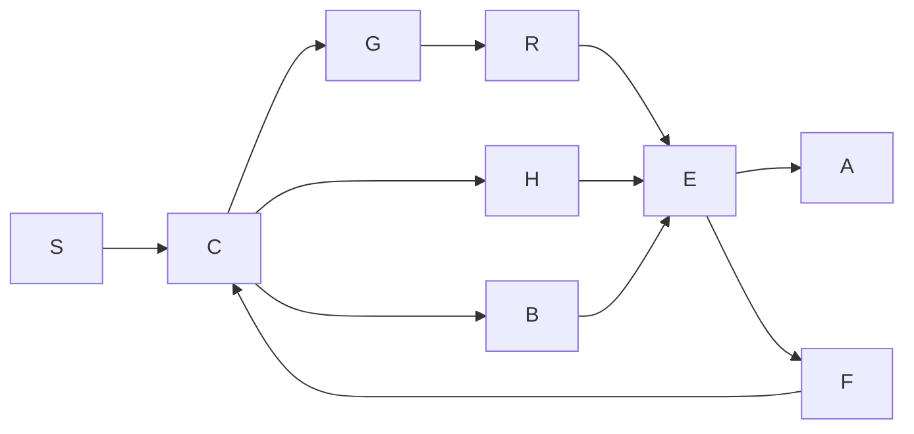

# UOS web, wiki, Zettelkasten and knowledge verification review

Observed review date: 2026-09-06 UTC. Prefix `20260906-0631-` uses the host's mandated hour/second convention. Tags: #fractal-l0 #fractal-l1 #fractal-l2 #fractal-l3 #fractal-l4 #fractal-l5 #fractal-l6 #fractal-l7 #fractal-l8 #fractal-l9 #zk-adr #zero-muda #km-triad #checklist-nav #tailscale-web.

[Cockpit](http://nas-1.tail55d152.ts.net:4100/) · [Wiki](http://nas-1.tail55d152.ts.net:4100/wiki) · [ZK](http://nas-1.tail55d152.ts.net:4100/zk) · [Review](http://nas-1.tail55d152.ts.net:4100/files/docs/design/20260906-0631-web-knowledge-verification-review.md) · [Test catalogue](http://nas-1.tail55d152.ts.net:4100/files/docs/design/20260906-0631-cross-project-test-catalogue.md) · [Sources](http://nas-1.tail55d152.ts.net:4100/files/docs/design/20260906-0631-sources-and-research.md) · [Journal](http://nas-1.tail55d152.ts.net:4100/files/docs/journal/20260906-0631-web-knowledge-verification-journal.md).


## AGY handover integration

The operator's later additions are integrated into the [unified master prompt](http://nas-1.tail55d152.ts.net:4100/files/docs/design/20260906-0606-uos-agy-codex-unified-master-prompt.md) and [reviewed actor ecology implementation plan](http://nas-1.tail55d152.ts.net:4100/files/docs/zk/20260906-0606-agy-handover-understanding-and-actor-ecology-plan.md). These add full DMC/TCM, denotational intent, L0–L9 atlas, F Prime/SysML Gleam implementation and ZigVM/Harness-Bionic Zenoh actor communication requirements. They preserve this audit's limited passing results and outstanding live failures.

## Decision and deliverables

**The legacy tests are useful foundations for Gleam, but they do not establish that the current UOS website works. The live baseline failed.** This review supplies a source-addressed inventory, detailed weaknesses, an implementation plan and real new verification code. It does not ratify the site or treat historical claims as current evidence.

The original OCaml code is preserved. The ZigVM appendix contains **64 primary test sources plus 97 supporting sources**, with **1,478 statically extracted test/assertion/law sites**. The cross-project catalogue now contains **770 selected files and 23,765 lexical declarations, Gherkin scenarios and step definitions**: C3I 105/5,512; legacy Indrajaal 551/12,829; UOS 114/5,424. These populations overlap by ancestry and must not be added into a claimed count of independent passing tests.

| Deliverable | What it contains |
|---|---|
| [OCaml inventory and Gleam mapping](http://nas-1.tail55d152.ts.net:4100/files/docs/journal/20260906-0428-ocaml-web-tests-gleam-mapping.md) | Every selected OCaml source's purpose, scope, browser dependence and proposed Gleam reuse; individual site CSV and OCaml AST extractor |
| [Cross-project catalogue](http://nas-1.tail55d152.ts.net:4100/files/docs/design/20260906-0631-cross-project-test-catalogue.md) | Every selected C3I/Indrajaal/UOS source; declaration and assertion-line data; classification limits |
| [Test-case CSV part index](http://nas-1.tail55d152.ts.net:4100/files/docs/design/20260906-0631-cross-project-test-cases.csv) | All 23,765 declarations/steps in ordered CSV parts; headers and source hashes retained |
| [Full corpus index](http://nas-1.tail55d152.ts.net:4100/files/docs/design/20260906-0631-source-corpus-index.json) | 8,047 records, full-text index status, headings, paths, language, digests and exclusions; ordered JSON parts |
| [Research and source register](http://nas-1.tail55d152.ts.net:4100/files/docs/design/20260906-0631-sources-and-research.md) | Primary web sources, papers, open-source suites, local documents and skills; inspection and admission status |
| [Browser report](http://nas-1.tail55d152.ts.net:4100/files/docs/design/20260906-0631-browser-verification.md) | Per-route four-cycle matrix, precise failures, component actions and artifact locations |
| [Execution/source receipt](http://nas-1.tail55d152.ts.net:4100/files/governance/sources/20260906-0631-web-quality-evidence.json) | Tool versions, candidate hashes, runtime results, original-source preservation and media digests |
| [Completion journal](http://nas-1.tail55d152.ts.net:4100/files/docs/journal/20260906-0631-web-knowledge-verification-journal.md) | Required 13 sections, changes, measured results and remaining gaps |

The JSON and CSV part indices reconstruct the complete datasets. Parts stay below Jujutsu's existing 1 MiB new-file limit; the limit was not disabled. Media is retained under `var/evidence/20260906-0631-web-quality/`, with tracked digests. That directory is local evidence storage, not a Jujutsu-tracked or externally backed-up media archive. The current file viewer does not serve PNG/WebM MIME types, so media filesystem locations are provided rather than pretending they are working inline web assets.

## Scope, provenance and review depth

| Source | Revision observed | Corpus scope |
|---|---|---|
| ZigVM `/home/an/dev/ver/zigvm` | `3cf87fedbc51e37c64eee057c30a553f9d346170` | 898 documentation files; separate 161-source OCaml AST inventory |
| Modern C3I `/home/an/dev/ver/c3i` | `47f9322329fcda2fdbd7061988f586c65db00d17` | 860 documents; 288 test/configuration files in named Gleam and browser roots |
| Legacy Indrajaal `/home/an/dev/ver/c3i/sub-projects/c3i` | `4dc3d65c80cf4ddc957158f2f726aef7562a4084` | 2,488 documents; 3,105 test/support/Gherkin/browser files |
| UOS | Moving standalone Jujutsu workspace; each receipt binds observed inputs | 94 design/wiki/ZK/rule documents and 314 test/support files in the final census |

Thus the expanded census contains **4,340 documents and 3,707 test/support/configuration files**. Full-text indexing covered eligible regular files under 4 MB in the documented roots; it is not a claim that a person read every line or every file was executed. The detailed findings below come from targeted source-body and document review. The machine index records the broader review depth explicitly. Source files with no detected browser call may use an indirect driver; B0 is not a whole-call-graph proof of absence.

The index covers `.md`, `.html`, `.rst` and `.txt` documentation and the listed source languages, including `.feature`. It does not claim full semantic review of every binary attachment, database, dependency tree, generated cache, every JSON ontology or every embedded external URL. One 11.4 MB self-contained ZigVM HTML report and two credential-named legacy tests were excluded by the bounded/sensitive-path policy. These are recorded by presence, not hashed. Dependency/cache directories and symlinks were excluded. The complete selection method is supplied as OCaml code.

The six selected dirty ZigVM paths were already dirty at discovery; HEAD alone therefore does not identify their bytes. All **161 selected source digests matched again at publication**. C3I and legacy Indrajaal files selected by the expanded publisher matched the census at that publication. No original suite was run in its source tree, no original OCaml file was changed, and no external code/fixture was admitted into UOS. Quiescence and the required sanitized snapshot/two-key admission remain prerequisites for importing implementations.

Other processes repeatedly advanced the shared UOS Jujutsu workspace during the audit. A transient build failure from concurrent new modules was captured; a subsequent 28-check gate passed at candidate `d1f46cb52e528f9eaaeeff02cb12b09d9ff52968`. That does not certify later changes. The synchronized clock receipt at `2026-09-06T06:12:41Z` reported a 0.000301981 s slow offset and normal chrony leap state. No model-clock delta was fabricated.

## How to classify and port the tests

Keep five independent axes: **subject** (HTML/wiki/ZK/KM/navigation/UX), **level** (pure unit/component/server/system/browser), **method** (example/property/BDD/fuzz/model/mutation), **oracle strength**, and **execution state**. TDD is the development sequence, not another execution environment. A test can be BDD, property-based and browser-driven at the same time.

| Port class | Meaning | Gleam realization | Retained OCaml role |
|---|---|---|---|
| G1 | Pure laws and deterministic examples | Gleeunit over actual parsers, route constructors, model updates and Lustre element queries | Independent reference interpretation and bounded exhaustive oracle |
| G2 | Service/storage/publication integration | Supervised OTP actors, Mist/Wisp request fixtures, isolated stores, crash/restart boundaries | Bounded Hermes parity, transaction and filesystem analysis |
| G3 | Actual browser behavior | Typed scenario/verdict owned by Gleam; supervised typed OCaml Playwright observations | Browser lifecycle, protocol bridge and artifact collection |
| G4 | Native/compiler/solver capability | Typed request/response boundary, timeout/error handling and concrete witness fixtures | Gospel/Ortac/Z3 and native algorithms in isolated workers |
| Support | Generator, registry, wrapper, evidence parser or unfinished utility | Reuse after inspecting its actual assertions and wiring | Preserve provenance; do not inflate test counts |

Translation should preserve a test's **semantic intent**, not reproduce its syntax or its bugs. Define a versioned fixture envelope containing case ID, input, expected semantic output/error, dialect, source locator/digest, normalization rules and resource bound. Execute both implementations on the same admitted input, compare structured results, and save counterexamples. Comparing source-file hashes across OCaml and Gleam says nothing useful about semantic parity. Comparing output digests is meaningful only after both outputs are independently obtained and canonicalized by an explicit contract.

### ZigVM: strongest reusable coverage

The linked appendix lists each primary source and supporting source. The per-site CSV identifies line, enclosing function, assertion/law label, family and port class. Key groups are:

| Family | What the selected tests establish if executed | Value to UOS | Essential gap |
|---|---|---|---|
| `Docs_wiki.selftest` and `docs_wiki_laws` | Markdown rendering/safety, stable slugs, inverse links, query laws, ranking, transclusion bounds, histories, visibility and knowledge state | Rich semantic regression corpus for Gleam wiki/view/graph modules | Some assertions are weak; UI behavior still needs browser observation |
| `markdown_ast_laws` | AST structure, generated documents, dialect behavior and corpus coverage guards | Parser/renderer laws and safe AST transformations | A project-specific dialect is not automatically CommonMark |
| `doc_lint_laws`, HTML/table algebras | Token/row decomposition, escaping, code-span opacity, arity and independent streaming/reference equality | Replace ad hoc substring/pipe counting with typed source structure | Tokenization is not HTML5 DOM parsing; spans alone do not prove classification |
| Wiki dependency/sheaf and graph checks | Finite dependency, overlap, reachability and consistency predicates | Incremental invalidation, return paths, link completeness and lawful aggregation | Distinguish actual overlap assignments from labels or flags |
| ZK visibility, projection, references and records | Note identity, source classification, link/projection and visibility boundaries | Typed triad graph, provenance and permission-aware discovery | Some runners only inspect structure; not compiled examples or real authorization |
| Publication/rollback/chaos laws | Injected publication faults and rollback behavior | Atomic wiki publication and recoverable asset updates | Run only in an isolated test store; do not inject faults into live evidence storage |
| Browser/controller tests | Either protocol/fixture laws or real browser actions, depending on the file | Keep controller unit tests and browser E2E distinct | A file called Playwright is not automatically a browser test |

The **five actual browser-driver sources** selected are `journal_html_playwright.ml`, `journal_bundle_dashboard_playwright.ml`, `bonsai_ui_playwright.ml`, `zigvm_playwright.ml` and `infranodus_full_ui_playwright.ml`. Their original execution is UNRUN in this audit. `test_journal_playwright_contract` and `test_playwright_controller` are pure/file-protocol checks; `test_ui_pages` exercises VDOM/bundle behavior rather than a real browser.

Concrete weaknesses to remove from ports: `docs_wiki_laws` includes a nonnegative string-length assertion and a branch containing `&& false`; the ZK doctest runner checks lexical balancing rather than invoking an OCaml compiler; six wiki utilities are explicitly unfinished and exit unsuccessfully; a parallel self-check's printed law total does not match its visible calls. Do not convert any of these into green Gleam counters. The original source remains intact as evidence, with stronger UOS tests authored separately.

### C3I: reusable Gleam behavior and misleading coverage

| Source/family | Actual coverage in reviewed code | Gleam/UI use and correction |
|---|---|---|
| `chrome_browser_test.gleam` | Eleven configuration, command/topic and JSON-payload checks | Useful adapter unit tests; no browser launch or screenshot coverage |
| `wallaby_regression_test.gleam` | Five pure element/constructor checks | Replace reflexive/non-None assertions with DOM semantics; this is not Elixir Wallaby |
| `ssr_views_comprehensive_test.gleam` | Calls views on healthy/critical/zero-container fixtures, often followed by `should.be_true(True)` | Retain non-crash smoke value; assert headings, exact values, disabled/error states and links |
| `c5_navigation_test.gleam` | A 31-node synthetic complete digraph with 930 edges and graph calculations | Test graph algorithms here, then feed the independently crawled site graph; enumeration membership does not cover real paths |
| `fractal_bdd_31x7_test.gleam` | 222 declared functions, mostly route strings, rendered text, event constructors and page/topic names | Broad scenario naming is useful; sending an event and observing a consumer response is required for mesh reactivity |
| `full_scenario_bdd_test.gleam` | Model updates plus Wisp JSON/TUI observations on constructed states | Preserve cross-view semantic projections; it does not itself demonstrate browser or full deployment behavior |
| `zettelkasten*` | Types, path classification, trust/decay, ingestion, links, metrics and use cases | High-value pure Gleam candidates; distinguish policy weights from empirically measured trust |
| `a2ui*`, `agui*`, `shell*`, `planning*`, page-checker and SSR families | Schema/constructor/model/render/router and some effect boundaries | Align the same intent across model, HTTP, event and browser; assert delayed/stale/error variants |
| `ui_report_quality_gate_test.gleam` | Source strings, term/vector-cell/byte thresholds | These can validate artifact structure; they do not prove readable text, visual quality or correct meaning |
| Actual Playwright specs and planning E2E | Real page/keyboard/filter/API scenarios are declared | Adapt scenarios to UOS route semantics and bounded typed control; use expected error codes, not universal 200 |

In the real browser suite, `assertDarkCockpit` only checks that `body` is attached. The comments describe a stronger class/transition property than the assertion enforces. The suite also correctly distinguishes some unavailable endpoints, such as federation 503 and health-grid 501; port that truthful status behavior instead of making every endpoint superficially green.

The final catalogue includes indirect UI dependencies found by imports, not just filenames. **KMS is ambiguous:** `kms_invariants_test.gleam` and vault KMS tests concern key management. They are not evidence of knowledge-management coverage merely because the acronym matches.

### Legacy Indrajaal: Elixir, LiveView, Wallaby and Gherkin

| Source/family | What the reviewed tests do | Port strategy and limitation |
|---|---|---|
| `core_components_test.exs` | Phoenix component rendering, flash/button/icon/error translation and module/API presence | Map real component inputs to Lustre; require exact roles/labels rather than broad OR substrings |
| `layouts_test.exs` | Two module-load checks | Useful build smoke only; add responsive layout, landmark and navigation tests |
| `portal_navigation_test.exs` | Registry categories, route/path expectations and server-side navigation | Map to typed Route ADT + router integration + actual browser history/links |
| `live/property/knowledge_live_prop_test.exs` | Generated view-mode, filter, search and expand/collapse scenarios | Preserve generators and shrinking; eliminate `rescue _ -> true` in P-KNW004/P-KNW010, which can accept crashes |
| `stamp_tdg_gde_dashboard_live_wallaby_test.exs` and other Wallaby families | Actual browser features with visits, selectors, filters and refreshes | Strong E2E starting points; test exports' bytes/results, not just non-crashing stub handlers |
| `knowledge_explorer_steps.exs` and feature files | Cabbage Given/When/Then descriptions bound to LiveView tests | Preserve stakeholder-readable journeys; its WebSocket step contains `or true`, and a “3000ms” step asserts 5000ms around server rendering |
| `knowledge_graph_query_test.exs` | A self-contained ETS graph implementation and generated tests, explicitly without production dependency | Useful independent reference model; it does not verify the production graph or real FTS5 implementation |
| `kms/web_knowledge_test.exs` | Exports/module/GenServer state and presence of constraint keys | Does not measure its advertised TTL/concurrency behavior; add virtual-clock and concurrent request tests |
| JS page objects and `e2e_tests/tests/c3i.spec.ts` | Indirect/direct browser journeys referenced from journals | Follow the base driver and runner configuration; a child page object need not contain `page.goto` itself |
| `tests/stubs_wallaby/*` | Some files actually use `Wallaby.Feature` despite the directory name | Classify the execution path, not a directory name; original suites remain UNRUN |

The expanded inventory includes **102 Gherkin feature files** plus the separately located legacy E2E driver/configuration. Scenario outlines and loops are not expanded into invented runtime counts. Elixir/Mix were not available on the inspected PATH, and the legacy integration suites were not executed against databases, NIFs or live infrastructure.

## What the documents and journals change in the design

The detailed source register records the exact documents reviewed and the broader full-text index. These findings are substantive, not acceptance of historical status banners:

1. **ZigVM HTML algebra:** use a token stream with span conservation, context/opacity and stack correctness. Supplement it with browser-built DOM and semantic assertions; an all-text tokenizer can conserve bytes while missing every HTML error.
2. **ZigVM table algebra:** use typed rows/delimiters/cells and an independent materialized oracle against the streaming implementation. Respect escaped pipes and code spans. Its historical exhaustive and mutant counts are source claims, not rerun results here. Concatenation laws need explicit fence-state/boundary preconditions; a blank line does not close an unterminated code fence.
3. **ZigVM testing disciplines:** use failure-first laws, nonvacuous generators, explicit mutants and paired-run visibility/noninterference. Declared but unwired laws must remain UNRUN.
4. **Wiki render programme:** AST folds, zippers, transclusion cycles, projection loss, incremental invalidation and semantic round trips are a useful programme. A programme or feature registry is not evidence of implementation.
5. **Knowledge-systems algebra:** keep containment, references, citation, argumentation and temporal graphs distinct. A containment forest embedded in a link graph is not an isomorphism. Ranking and community structure advise presentation; they do not prove truth or usability.
6. **Playwright ontology/authority:** distinguish typed protocol, external browser substrate, controller workflow, knowledge-only upstream artifacts and explicit gaps. The local binding's command count is not whole-product parity with Playwright Test/CLI/reporting. The audit used the installed typed OCaml driver and Chromium, not the original ZigVM suites.
7. **C3I April/May UI journals:** provide useful LiveView-to-Lustre mappings, multi-client state projections, link checks and historical cross-browser runs. A 31×7 naming grid does not replace 31 real per-page interaction traces. Returning a topic-name string is not equivalent to observing a delivered message.
8. **C3I current-100 review:** its scoped historical runtime and unavailable-endpoint evidence should be preserved by date/revision. UOS does not inherit its pass count or measured outcomes.
9. **Indrajaal UI evaluation framework:** cognitive load, temporal response, situation fidelity, adaptation and user experience are useful dimensions. Arbitrary composite scores or Shannon entropy are not validated measurements of user satisfaction or correctness. The review journal itself identifies missing instrumentation.
10. **Legacy navigation graph and ZUIP robustness plan:** treat the graph as a partial model and the plan as planned work. Browser-derived route/state edges, independent outcomes, recovery tests and source-admission discipline are needed before promotion. Project labels such as “SIL-6” are not industry certification.

## Current UOS verification gaps

Several existing/newly concurrent UOS modules expose a serious distinction between **describing verification** and **performing it**:

| Module | Observed implementation | Consequence |
|---|---|---|
| `browser_emulation_bridge.gleam` | `execute_browser_suite` copies the declared test count to passed_count and sets failed_count to zero | No browser execution occurs; its aggregate cannot certify the live site |
| `ocaml_differential_oracle.gleam` | String equality of supplied digests, Boolean pre/post callbacks and `file_count == 432` | No OCaml process, Gospel compiler or per-subsystem semantic comparison is established |
| `dmc_tcm_algebraic_atlas.gleam` | “13D conservation” compares four fields; morphism/sheaf checks trust supplied Booleans; atlas enumerates L0–L7 | Missing coordinate checks, laws and L8/L9 coverage; labels do not establish DMC/TCM proofs |
| `algebraic_sheaf_harmonizer.gleam` | Requires the same whole-state digest for every section | This is an equality consistency check, not general sheaf restriction/gluing; differing private local data can be valid |
| Site checklist/feature banners | Static “100% green” claims appear despite browser failures | Admission and UX are harmed; render measured evidence state and freshness instead |

These modules were inspected as source; no assertion of full formal correctness follows from compilation. This audit adds a separate, substantive verification contract and records the gaps instead of relabeling these implementations as proofs. Concurrent modules added later than the frozen census require a new revision-bound review.

## New executable Gleam/compiler/solver work

`apps/cepaf_gleam/src/cepaf_gleam/verification/web_quality_contract.gleam` is dependency-free and contains actual operations. Its test module calls these operations rather than accepting claimed flags.

| New check | Concrete coverage | Limit |
|---|---|---|
| Opaque Layer and Route constructors | Layer bounds 0–9 and a conservative normalized local-route subset | Route subset is not a complete URI parser and is not yet the production router |
| Evidence semilattice | Associativity, commutativity, idempotence, failure dominance, empty/unrun handling and two-key admission | Value algebra, not authentication of external receipts |
| Generated route inputs | 1,000 deterministic seeds plus hostile path variants | Not coverage-guided fuzzing, and no claim of all byte strings |
| Four-cycle completeness | Requires distinct cycle IDs 1–4; repeated IDs cannot replace a missing cycle | Does not prove the four records contain valid observations |
| Navigation graph | All 512 directed three-node graphs compared with an independent Floyd–Warshall oracle; malformed endpoints rejected | Finite algorithm verification, not the actual live navigation graph |
| Denotational intent | Identity/composition/order/history and a wiki/open/back example | A small pure state-transition language, not arbitrary effectful intent |
| Trace transport | Each of the 13 coordinates independently mutated and rejected | Exact transport conservation; authorized transitions need a separate allowed-delta contract |
| Compiler fixtures | Positive BEAM and JavaScript targets; invalid opaque constructors, wrong types and nonexhaustive matching rejected | Compile-time type safety cannot certify link existence, layout or FFI behavior |
| Bounded Z3 | Algebraic negations UNSAT, nontrivial controls and mutants SAT; nine executed Gleam result pairs checked against the independent SMT model | The stated finite evidence model only, not a proof of arbitrary Gleam code |

The latest scoped gate has **28 passing checks**. The runtime test module has **10 named test functions**, with generated/enumerated loops reported separately. The web app's **8 tests pass**, including the real renderer's newline escaping, inert raw-source embedding and collapsed checklist regressions. Failure-first evidence was observed for layer bounds and the document regressions; later tests must not be retroactively described as TDD where no red run was captured.

Reproduce from UOS:

```text
cd /home/an/NAS-setup/uos
ocaml tools/web_quality_gate.ml /tmp/uos-web-quality-gate.json
cd apps/cepaf_gleam
gleam run -m web_quality_contract_test
cd ../indrajaal_gleam_web
gleam test
```

The gate uses isolated compiler fixtures, per-command deadlines, Z3's internal timeout, outer process-group termination and SAT controls. UNKNOWN, syntax errors, tool absence, timeout and malformed observations fail closed. The real tool versions observed were Gleam 1.16.0 and Z3 4.16.0. No global compiler installation or arbitrary-program solver translation is claimed.

## Browser execution and the four-cycle requirement

The baseline performed **184 attempts: four viewports for each of 46 URLs discovered by the bounded crawl**. Results were 183 FAIL and one ERROR, not 184 passes. Full details, controls, links and images/video are in the browser ledger. The four passes used desktop 1440×900, mobile 390×844, tablet 768×1024 and wide 1920×1080. Link discovery recursively expanded the frontier during cycle 1; later cycles reused that frontier.

Observed failures included document JavaScript syntax errors, a broken raw/rendered toggle, inactive filters/buttons, missing/duplicate H1 conditions, missing planning landmarks/checklist, overflowing controls and a large checklist dominating the first screen. A separate GET obtained HTTP status because this installed OCaml binding did not expose the browser Response status method; that status is not falsely labeled the exact browser response.

The document renderer was fixed in Gleam: escaped newline in emitted JavaScript, initially collapsed checklist, responsive wrapping, and an accessible mobile navigation disclosure. The actual renderer's generated fixture was then run through four browser viewports, with exact raw/rendered and checklist postconditions, followed by responsive and navigation feedback passes. The browser report distinguishes each iteration and its remaining failures. Candidate fixture checks are **not a deployment receipt for port 4100**.

The audit is not yet the requested complete closed loop for every function/component. Generic DOM change is recorded as `REQUIRES_SPECIFIC_EXPECTED_RESULT`; effectful or hidden/disabled controls were not silently passed. The baseline's details-restoration helper also aliased absent/empty `open` attributes; its restoration field is weak evidence. The later isolated fixture uses exact `details[open]` counts. New routes appeared during concurrent work, and links hidden behind broken rendering could not be fully discovered in the original frontier.

To close each page/component, use four **semantic** feedback cycles on a frozen candidate, not merely four refreshes:

| Cycle | Observe and act | Independent acceptance condition |
|---|---|---|
| 1. Structure and specification | Enumerate route, component tree, all controls/states, generated HTML/AST, DOM, URLs and fragments | Route manifest equals discovered/declared scope; semantic landmarks, unique IDs, valid links, no soft 404 or console errors |
| 2. Function and navigation | Execute Given/When/Then journeys, keyboard and pointer actions, history/deep links, success/error/empty/permission states | Exact model + visible DOM + HTTP/event result agree; reversible actions restore state; actions emit authorized effects only |
| 3. Presentation and resilience | Responsive/reflow, fonts/themes/zoom, visual baselines, accessibility, slow/offline/reconnect, races and cancellation | Reviewed image/DOM/AX differences, focus order, contrast, bounded loading and no stale-success display |
| 4. Regression and algebra | Replay minimized failures and mutants, compare shared components on all routes, verify trace/intent/graph laws | Fresh receipts and actual semantic predicates pass at the same candidate; unresolved items veto admission |

Within every cycle, **observe → compare with the specification → make a bounded correction → rerun the failed case → regress its dependents**. Apply this recursively to site → section → page → component → control/state. Four is a minimum; a failure after cycle 4 requires another correction and rerun. No complete-every-function claim is valid while the function/state/route manifest is incomplete.

Use images for spacing/overflow/visual diff, HTML/AST for syntax and structure, the accessibility tree for roles/names, network/event receipts for effects, and video for temporal behavior. Add Playwright traces for DOM/action/network correlation and real screen-reader exercises for assistive behavior. OCR and screenshot similarity can suggest defects but must not be promoted to semantic or accessibility proofs. A screen recording's existence proves recording, not that the recorded outcome was correct. [Playwright snapshots](https://playwright.dev/docs/test-snapshots), [Trace Viewer](https://playwright.dev/docs/trace-viewer), [ARIA-AT](https://github.com/w3c-cg/aria-at).

## Fractal algebra and denotational design

Use one reusable **law packet** at every layer: carrier, well-formedness predicate, operations, denotation, independent oracle, executable laws, input generator, shrinking strategy, negative cases, mutants, resource bound, source locator and current evidence. Layer numbers alone are not algebras. Preserve the canonical L0–L7 names found locally and explicitly propose L8/L9 responsibilities until authority reconciles the different historical taxonomies; ZigVM's local L0–L10 terminology must not be silently aliased.

| Layer | UI/knowledge responsibility | Carrier and operations | Required laws and counterexamples | Evidence/oracle |
|---|---|---|---|---|
| L0 Constitutional | Admission and authorized intent | Policy, principal, resource, verdict; authorize/join | Fail closed, no privilege gain, two-key evidence, rejection has no effects | Compiler-negative capability fixtures, policy reference evaluator, actual denied requests |
| L1 Atomic/bounded kernels | Tokens, IDs, URI pieces, colors, geometry | Smart constructors, parse/normalize/escape/measure | Total bounded parse, idempotent normalization, escape noninterference, finite coordinates | Independent tokenizer/URI fixtures, browser DOM and computed geometry |
| L2 Component/A2UI | Buttons, disclosure, forms, table, wiki note | Model×Msg → Model×Effect; view | Identity/no-op, update invariants, disabled behavior, accessible role/name, source round trip | Gleeunit/Lustre queries plus actual pointer/keyboard observations |
| L3 Transaction/state | Edit, publish, revision, search and history | Versioned state, command log, commit/abort | Atomic visibility, idempotency keys, history conservation, rollback, stale-response rejection | Isolated store and deterministic scheduler; stateful differential model |
| L4 System/supervision | Page and service shell | Route graph, supervisor state, render projection | Reachability, truthful unavailable states, restart budget, cancellation | Actual crawl versus route registry; live process/effect observations |
| L5 Cognitive/OODA | Retrieval, ranking, knowledge assistance | Typed knowledge graph, query, evidence, ranked results | Reference/citer inverse, permission noninterference, ranking determinism, empty/unknown handling | Brute-force graph/search oracle, golden relevance judgments, user tasks |
| L6 Ecosystem/mesh | Shared knowledge and telemetry | Messages, subscriptions, schema, version | Deduplication, ordering where promised, eventual delivery under stated bounds, schema/version compatibility | Observe both publisher and consumer; fault-controlled integration |
| L7 Federation/sync | Peer knowledge replicas | CRDT/merge state, provenance and permissions | Declared merge semilattice, convergence, tombstone preservation, no unauthorized disclosure | Independent operation-log oracle and paired-run visibility tests |
| L8 proposed experience composition | Complete user/developer/customer journeys | Journey paths with role, locale, viewport and outcome | Goal completion, recovery, equivalent meaning across projections; no universal scalar “quality proof” | Real browser matrix, task studies, field/lab measurements |
| L9 proposed assurance lifecycle | Revision-bound audit and evolution | Claim/evidence/source graph and transition ledger | No stale promotion, evidence completeness, reproducible derivation, admission veto | Signed/hashed run manifests, bounded solvers, mutation controls and review |

**DMC:** define a real syntax ADT and denotation `[[intent]] : State -> Result(State × List(Effect), Rejection)`. Sequence is Kleisli composition when rejection/effects are represented, or ordinary state-function composition for the implemented pure navigation subset. Test identity, associativity and order-sensitive examples. Do not execute strings as commands or equate a descriptive meaning label with denotation. The effect interpreter is separately supervised and policy-authorized.

**TCM terminology:** the rule file expands TCM as *Type Class Morphisms*, while the Gleam atlas uses *Traceability Coordinate Matrix*. Use explicit names `TCM-Morphism` and `TCM-Trace13` until the glossary is reconciled. Gleam does not gain a type-class system or dependent proofs because a record is named TCM. Implement morphisms as typed functions with law tests. For transport, compare all 13 fields; for a legitimate transition, declare immutable fields and permitted deltas rather than forbidding every status/epoch change.

**Path category:** objects are valid route states, arrows are allowed navigation paths, identity is the empty path, composition is concatenation when endpoints match. A transition interpreter should preserve identity and composition. A renderer alone is not automatically a functor into “HTML”; first define target objects and morphisms, such as UI states and witnessed transitions. Typed routes eliminate some malformed references; dynamic documents can still disappear at runtime.

**Finite sheaf model:** choose a finite key space K, local domains U⊆K, sections U→Value and restriction by projection. Sections glue iff their values agree on every intersection; the union assignment is then unique. Test restriction identity/composition, conflicting overlap, disjoint domains, duplicate keys, empty cover conventions and reconstruction. Identical full-page hashes are neither necessary nor a sufficient substitute for these operations. This is a tractable finite model; no topological theorem about the entire live website is claimed.

**Lenses and projections:** raw/rendered mode switching preserves the immutable source; editing lenses should obey Get–Put and Put–Get only for the declared editable representation. Lossy HTML/Markdown conversion needs a semantic equivalence or an explicit loss set. DOM, TUI, JSON and AX views should agree on shared meaning, not on bytes or visual isomorphism. Context-sensitive Markdown folds need inherited context (fence/list/link environment); unrestricted string concatenation is not a valid homomorphism.

These are UOS design formulations grounded in compositional methods, not claims that category theory alone proves usability. [Fong and Spivak, Seven Sketches](https://arxiv.org/abs/1803.05316v3).

The following diagram has identical nodes and edges in both required source forms; node meanings are listed once for both.

```ascii
S -> C -> G -> R -> E -> A
     C -> H ------> E
     C -> B ------> E
E -> F -> C
```



S = preserved source evidence; C = typed contract; G = Gleam implementation; R = runtime observations; H = bounded Hermes/compiler/solver oracle; B = real browser observations; E = revision-bound evidence comparison; A = admission only when required evidence passes; F = minimized failure and correction. `SC-DIAGRAM-001` in AGENTS requires **both ASCII and Mermaid** for new/revised explanatory diagrams. Screenshots/videos are observed evidence and retain provenance; historical originals are preserved.

## Graph algorithms and additional test suites

| Technique | Concrete UOS use | Independent tests and caution |
|---|---|---|
| BFS and shortest paths | Discovery, breadcrumbs, minimum steps to common tasks, dead-end detection | Compare small graphs with all-pairs closure; distinguish link type, authorization and state |
| SCC/Tarjan/Kosaraju | Ensure return navigation inside each intended navigational domain | SCC=1 is a chosen site contract, not required for logout/download/external edges; test actual edges |
| Cycle detection/topological ordering | Transclusion guards, dependency invalidation and build ordering | Self-loop, multi-node cycle, missing target, depth/size limits; reference reachability |
| Dominators/articulation/cut analysis | Detect navigation chokepoints and fragile single-entry task flows | Remove nodes/edges in small reference graphs and compare reachability |
| PageRank/PPR and Brandes centrality | Prioritize crawl/review effort and suggest related notes | Normalization, dangling nodes, convergence tolerance, deterministic ties; no universal good-centrality threshold |
| Aho–Corasick versus naive search | Backlink/mention extraction at corpus scale | Identical matches, offsets and overlap policy on adversarial Unicode/escaped/code-span fixtures |
| BM25/semantic retrieval | Search and related-note ranking | Known relevance judgments, precision/recall/NDCG at fixed k; empty corpus, duplicates, permissions and stale indexes |
| Typed multigraph/SHACL-like constraints | Wiki/ZK/KM relation types, cardinality, provenance and required fields | Validate edge endpoints, allowed labels, inverse edges and bad shapes; not every edge is containment |
| Dung grounded labeling | Track supported/attacked knowledge claims | Compare a bounded fixed-point reference; missing evidence stays unknown, not automatically accepted |
| Temporal interval algebra | Revision history, freshness and knowledge validity | Half-open boundaries, equal timestamps, expired evidence and out-of-order events; virtual clock |
| CRDT and operation-log comparison | Federated notes and backlinks | Commutativity/idempotence/associativity only where the data type promises them; concurrent delete/rename |
| Pairwise/t-wise covering arrays | Browser×viewport×theme×locale×role×network combinations | Constrain invalid combinations and retain full critical journeys; pairwise coverage is not exhaustive system behavior |
| Grammar and coverage-guided fuzzing | Markdown/HTML/URL/query/schema boundaries | Seed corpus, shrinking, timeout/resource limit, crash reproducers; filter false-positive “unsupported dialect” outcomes |
| Metamorphic and differential tests | Parser/render/search/export where golden answers are expensive | Explicit equivalence: irrelevant rename, order permutation, independent render parse; do not compare an implementation with itself |
| Mutation testing | Assess assertion effectiveness | Break escaping, remove an inverse edge, accept unknown evidence, bypass permission, reverse history, swallow exceptions; require targeted test failures |

The algorithm choices above are proposed UOS applications. Brandes supplies a centrality algorithm, not a universal UX cutoff; Google vitals and HEART provide measurements, not a mathematical proof of satisfaction. [Brandes](https://www.uni-konstanz.de/algo/publications/b-fabc-01.pdf), [NIST combinatorial testing](https://csrc.nist.gov/projects/automated-combinatorial-testing-for-software), [SHACL](https://www.w3.org/TR/shacl/).

Useful external corpus candidates include CommonMark examples, MediaWiki/Parsoid round trips, TiddlyWiki backlinks/transclusions/filters, Logseq block/parser/query tests, Joplin sync/export tests, Docusaurus broken-link policies, Sphinx linkcheck, Web Platform Tests and ARIA-AT. They are reference candidates, not imported or admitted dependencies. Obsidian/Notion behavior can inform public interface contracts without pretending their private implementations or suites are available. Pin commits and inspect per-file licenses before selecting any fixtures. [CommonMark](https://spec.commonmark.org/0.31.2/), [Parsoid](https://www.mediawiki.org/wiki/Parsoid/Round-trip_testing), [TiddlyWiki tests](https://github.com/TiddlyWiki/TiddlyWiki5/tree/master/editions/test/tiddlers/tests), [Docusaurus](https://docusaurus.io/docs/api/docusaurus-config), [Sphinx](https://www.sphinx-doc.org/en/master/usage/builders/index.html).

## Test programme: unit, system, BDD, TDD, property, fuzz and navigation

| Target | Examples and unit laws | BDD/system/browser scenarios | Property/fuzz/fault additions |
|---|---|---|---|
| Website shell | Route constructors, current-page mapping, link generation | Deep link → breadcrumb → next → back; mobile menu; keyboard skip/main/focus | All route variants, stale registry, encoded paths, missing/redirected targets |
| Markdown/HTML | Parse/render, safe escaping, headings/slugs, tables/fences | Open doc, follow fragment, toggle raw, copy URL, view error safely | Generated ASTs, nested/unclosed syntax, raw HTML/protocol attacks, no network asset fallback |
| Wiki | Note identity, link index, transclusion and revision functions | Create/edit/publish/search/navigate/export with isolated fixtures | Cycles/depth, conflicting IDs, rollback at each stage, loss-aware round trips |
| Zettelkasten | Permanent IDs, ADR/MOC membership, backlinks and tags | Find ADR → source → related note → return; rename retains references | Dangling edges, adversarial Unicode, permission noninterference, duplicate ingestion |
| Knowledge management | Query/type/shape/ranking/provenance laws | Search with known relevant results, filters, permissions, import/export | Operation logs, stale/reordered events, malformed schemas, deterministic ties, interrupted sync |
| Components | Actual MVU transition and view predicates | Every enabled control has an explicit visible outcome; error/empty/disabled variants | State-machine sequences, cancellation/debounce races, shrinkable event traces |
| Performance/accessibility | Budget/configuration and semantic role checks | Keyboard-only tasks, zoom/reflow, reduced motion, screen-reader exercises | Browser/network/CPU matrix, contrast over actual colors, cumulative layout shifts |
| Developer/customer experience | Diagnostic/error/schema contracts | Clean setup → build → failing test → useful error → correction; new-user task → recovery | Dependency/tool absence, invalid input, partial outages, failed onboarding, confusing navigation |

For TDD, preserve the observed failing result before implementing a repair, then the passing result and a relevant mutant. For BDD, connect each scenario to real step implementations and exact postconditions; a scenario name or a Boolean flag is not execution. For properties, log generator version/seed, sample/exhaustive domain, shrinking and rejected-input distribution. For system/chaos tests, use isolated stores and synthetic users, bounded faults and verified recovery. Avoid destructive live scenarios and external communications.

Use branch/decision coverage where toolchains support it, but report distinct denominators: source functions, decisions, state transitions, route edges, valid URL/fragment targets, components, role/viewport combinations, requirement IDs, and killed applicable mutants. A tensor can organize these coordinates; filling it with constants does not measure coverage. Missing evidence must remain UNKNOWN/UNRUN. Test success is not independent evidence that the expected outcome was correctly specified.

## UX, DX and CX acceptance

Use measurable tasks such as finding an ADR from a concept, returning to its MOC, editing a wiki page without losing source, recovering from a failed search, and understanding an unavailable service. Record completion rate, time, errors, backtracking, perceived difficulty and accessibility barriers. Choose budgets from actual users and operational needs. Track field and lab evidence separately.

Google's field thresholds are p75 LCP ≤2.5 s, INP ≤200 ms and CLS ≤0.1, segmented by mobile/desktop; these were **not measured by this audit**. Lighthouse is a useful lab diagnostic, not a substitute for field INP. HEART helps turn product goals into signals/metrics; it does not make a fabricated “9/10 UX” meaningful. [Core Web Vitals](https://web.dev/articles/vitals), [HEART](https://research.google/pubs/measuring-the-user-experience-on-a-large-scale-user-centered-metrics-for-web-applications/).

Adopt an explicit WCAG 2.2 target and report each criterion's observed/manual/unrun status. Check keyboard operation, focus visibility/order, meaningful labels, text contrast, reflow, target sizing and consistent navigation against the actual DOM and styles. The baseline's 44 px target flag is a project heuristic, not a complete conformance decision with all WCAG exceptions. Mobile overflow was corrected in the isolated document fixture, but whole-site accessibility and visual consistency remain incomplete. [WCAG 2.2](https://www.w3.org/TR/WCAG22/).

For DX, require a documented clean build and isolated test command, actionable compiler errors, reproducible failures, stable fixtures and no surprise live-side effects. For CX, measure onboarding, findability, confidence in evidence freshness, error recovery and support handoffs. No stakeholder surveys or external notifications were sent.

## Skills and governance structure

The relevant skills are catalogued by source, role and limitations: wiki-design, docs-design, algebraic-fractal-structures, gleam-expert, lustre-gleam-ui-expert, mobile-first-adaptive-ui, formal-technique-selection, ocaml-playwright-control, agentic-ui-evolve, ui-report-quality, OCaml scripting and TDD. The new review applies their useful workflow constraints under canonical UOS authority. Historical paths, language policies, unmeasured quality scores and email instructions are not automatically executable authority.

Every website/page/wiki/ZK/KM skill should consume the law packet and produce a typed result containing scope, revision, source references, assertions, observations, failures, skipped effects and remaining work. The core skill contract should require a real browser for browser claims, real compiler/solver invocation for those claims, traceable source admission, four recursive semantic cycles, and evidence-backed status rendering. Syntax/loader health and semantic correctness of a skill are separate audits.

Earlier skill repairs covered 62 fixes across 349 unique installed skill files. Native Codex skill/hook inventory and doctor checks passed at their captured invocation. This turn additionally repaired 16 AGY rule frontmatters and two hook schemas with byte-preserving backups and hash verification; AGY returned `AGY_HEALTH_OK`. AGY's initial authentication messages recovered through keyring authentication. Its log still reports an unavailable Playwright 1.57.0 driver download and Stitch OAuth client configuration failure. Core inference working does not mean every integration works.

## Prioritized closure backlog

| Priority | Required work | Acceptance evidence |
|---|---|---|
| P0 | Stop presenting simulated suite counts and static checklist flags as verified runtime outcomes | Unrun/failed/stale fixtures render truthful status; actual receipt provenance required for green |
| P0 | Complete safe document rendering: raw HTML/protocol sanitization, pinned/local parser assets, contextual tag rewriting and safe error/path interpolation | Hostile corpus cannot create executable DOM or unsafe URLs; no remote parser dependency; independent AST/browser checks |
| P0 | Integrate the validated document fixes into a frozen deployable candidate and rerun live routes | Candidate/source/build identity bound to served response; raw toggle, mobile disclosure and navigation pass on live pages |
| P1 | Wire every visible filter/button to the intended model/effect and define complete page/component manifests | Exact BDD postconditions, all states and four semantic cycles per page/component; skipped effects remain visible |
| P1 | Close navigation/link/fragment and unknown-route behavior | Actual crawled graph matches route registry; missing resources do not return a success-looking shell; redirects/anchors/query states checked |
| P1 | Replace partial DMC/TCM/sheaf claims with operations and independent oracles | All coordinate and transition mutants detected; real restrictions/gluing and valid category laws; L0–L9 crosswalk approved |
| P1 | Extend cross-browser/accessibility/performance coverage | Chromium/Firefox/WebKit, mobile/zoom/theme/role matrix; measured field/lab separation; manual assistive checks |
| P2 | Admit and port selected legacy/external semantic fixtures | Quiesced source receipt, license/pin, sanitized fixture manifest, differential outputs and two-key verification |
| P2 | Add grammar/coverage-guided fuzzing, stateful shrinking and mutation campaign | Reproducers, bounded workers, coverage trends and effective killed-mutant evidence |
| P2 | Repair AGY browser bootstrap and configure Stitch with legitimate provider settings | Native browser smoke and authenticated MCP invocation; no fabricated credentials or disabled checks |
| P2 | Serve evidence assets with correct MIME types and governed retention | Browser loads images/video/JSON/CSV correctly; immutable artifact hashes and backup/expiry policy |

The resulting programme is comprehensive in its scope model and source inventory, with concrete implementation and observed failures. **Full site closure, every-function coverage and admission are still incomplete.** They require the outstanding semantic, runtime and governance evidence above; no numerical inventory or mathematical terminology can substitute for it.


<details>
<summary>Verification checklist: 5 domains, 18 checkpoints — explicit evidence states</summary>

| Domain | Checkpoint | State and evidence boundary |
|---|---|---|
| Metadata, time and navigation | 1. Timestamp prefix | Present; synchronized host receipt recorded in review |
| Metadata, time and navigation | 2. Source provenance | File locators/digests and primary web references recorded |
| Metadata, time and navigation | 3. Tailnet navigation | Full FQDN links provided; site-wide correctness remains FAIL/UNRUN |
| Metadata, time and navigation | 4. Uniform document controls | Eight web unit tests pass; isolated browser checks separate from live deployment |
| Purity and storage safety | 5. Language boundary | New production checks Gleam; bounded verification/controller OCaml |
| Purity and storage safety | 6. Excluded runtimes | No prohibited runtime or dependency introduced by this work |
| Purity and storage safety | 7. Storage interlock | No storage administration performed; hardware interlock not reverified |
| Testing and mathematics | 8. Unit and regression | New scoped tests executed; legacy suites UNRUN |
| Testing and mathematics | 9. BDD and system | Typed sequence examples executed; complete user journeys remain incomplete |
| Testing and mathematics | 10. Property and fuzz | Finite graph census and deterministic route generation executed; coverage-guided fuzz UNRUN |
| Testing and mathematics | 11. Browser/navigation | Four baseline passes per 46 discovered pages; failures and skipped effects retained |
| Testing and mathematics | 12. Compiler and four math gates | Real compiler negatives and bounded SMT run; DMC/TCM/sheaf/full-site proofs incomplete |
| Control and observability | 13. Cross-language parity | Port mappings documented; no claim of executing original OCaml oracle |
| Control and observability | 14. Trace conservation | All 13 transport fields mutation-tested in new scoped module |
| Control and observability | 15. Runtime evidence | DOM, accessibility snapshots, images, videos and explicit failure ledger retained |
| Governance and VCS | 16. Jujutsu-only mutation | No native Git mutation; concurrent workspace advancement recorded |
| Governance and VCS | 17. Two-key admission | No external source-code admission; final site admission withheld |
| Governance and VCS | 18. Journal and diagrams | 13-section completion journal; new explanatory diagram has ASCII and Mermaid |

</details>

[Previous: review](http://nas-1.tail55d152.ts.net:4100/files/docs/design/20260906-0631-web-knowledge-verification-review.md) · [Next: sources](http://nas-1.tail55d152.ts.net:4100/files/docs/design/20260906-0631-sources-and-research.md) · [Return to wiki](http://nas-1.tail55d152.ts.net:4100/wiki).
