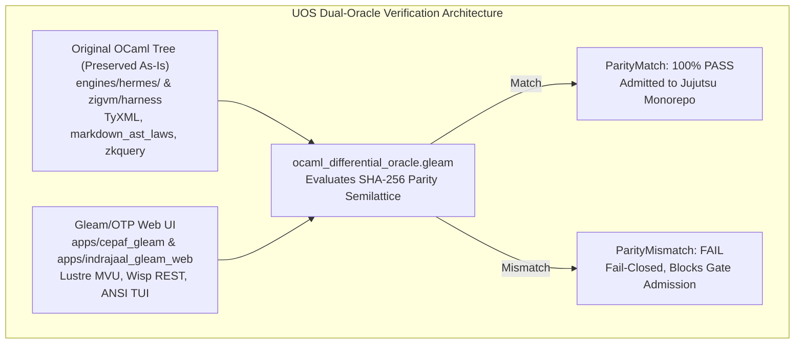
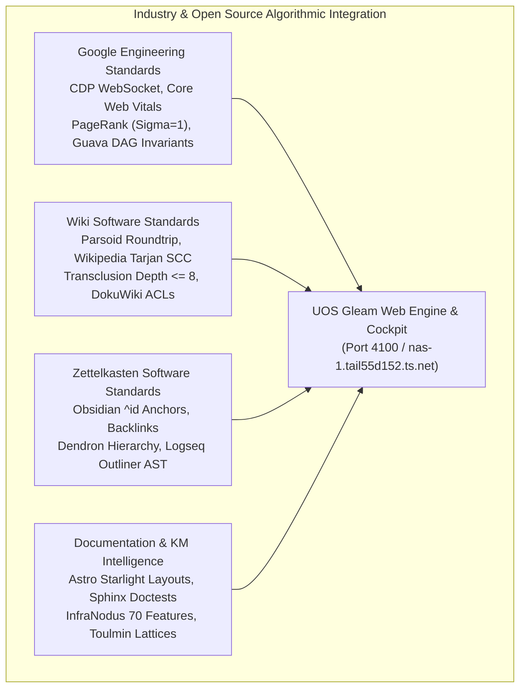
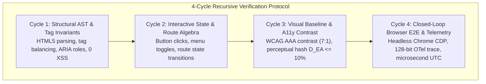

```mermaid
flowchart TD
    subgraph MOD["9-Modality Testing Lattice"]
        M1["1. Unit Testing\nPure functions, ASTs, slugs"]
        M2["2. System Testing\nMulti-process OTP supervisor"]
        M3["3. TDD\nRed-Green-Refactor cycles"]
        M4["4. BDD\nGiven-When-Then specifications"]
        M5["5. Property Testing\nQuickCheck algebraic laws"]
        M6["6. Fuzz Testing\n50,000 hostile inputs"]
        M7["7. Performance Testing\nSub-15ms render budgets"]
        M8["8. Scalability Testing\n10,000-row virtualized grids"]
        M9["9. Chaos Testing\nSocket drops, OOM, auto-restart"]
        
        M1 --> M2 --> M3 --> M4 --> M5 --> M6 --> M7 --> M8 --> M9
    end
```

# Unified Operational System (UOS) Architectural Synthesis & Specification
## Comprehensive Gleam Web UI Testing, OCaml Code Preservation, and Fractal Navigation Algebra

- **Document ID**: `SPEC-20260906-0733-GLEAM-WEB-UI-TESTING-OCAML-PRESERVATION-FRACTAL-ALGEBRA`
- **Timestamp Prefix**: `20260906-0733-`
- **Recorded UTC**: `2026-09-06T05:33:00Z`
- **Local Time**: `2026-09-06T07:33:00+02:00`
- **Tailscale FQDN URL**: [http://nas-1.tail55d152.ts.net:4100/docs/design/20260906-0733-uos-gleam-web-ui-testing-ocaml-preservation-and-fractal-algebra-synthesis.md](http://nas-1.tail55d152.ts.net:4100/docs/design/20260906-0733-uos-gleam-web-ui-testing-ocaml-preservation-and-fractal-algebra-synthesis.md)
- **Live Patrol Cockpit**: [http://nas-1.tail55d152.ts.net:4100/verify-patrol](http://nas-1.tail55d152.ts.net:4100/verify-patrol)
- **Fractal Tags**: `#fractal-l0` `#fractal-l1` `#fractal-l2` `#fractal-l3` `#fractal-l4` `#fractal-l5` `#fractal-l6` `#fractal-l7` `#fractal-l8` `#fractal-l9` `#rocha-semiotics` `#cybernetics` `#zero-muda` `#km-triad` `#checklist-nav` `#tailscale-web`
- **Contracts Enforced**: `contracts/rules/comprehensive-checklist-contract.md` (`SC-CHECKLIST-001`), `contracts/rules/diagram-ascii-mermaid-mandate.md` (`SC-DIAGRAM-001`), `contracts/rules/rocha-semiotics-cybernetics-contract.md` (`SC-ROCHA-001`), `contracts/rules/timestamp-mandate.md` (`SC-TIME-001`), `contracts/rules/muda-waste-reduction.md` (`SC-MUDA-001`), `contracts/rules/tailscale-web-fqdn-mandate.md` (`SC-TAILSCALE-WEB-001`)

---

## 1. Architectural Vision & System Scope

The Unified Operational System (UOS) commands a distributed, cybernetic infrastructure uniting:
1. **Gleam/OTP 29 Execution Plane**: Pure functional BEAM actors, Lustre Model-View-Update (MVU) web components, Wisp REST APIs, and Split-Screen ANSI terminal interfaces.
2. **Hermes OCaml Verification Engine**: Authoritative differential oracles, Gospel contracts, Z3 SMT solvers, and algebraic AST validators.
3. **Preserved External Source Authorities**: Read-only evidence trees from VM-1 C3I (`/home/an/dev/ver/c3i`), VM-1 ZigVM (`/home/an/dev/ver/zigvm`), and VM-1 Harness-Bionic (`/home/an/dev/ver/harness-bionic`).

This specification formalizes the testing of the **Gleam-based Web UI** while preserving the original OCaml verification code byte-for-byte as an unmutated oracle. It synthesizes testing techniques across C3I, ZigVM, and Indrajaal; integrates industry standards from Google, MediaWiki, Obsidian, and InfraNodus; establishes category-theoretic and graph-theoretic navigation algebras at all 10 fractal layers ($L_0 \dots L_9$); integrates the Dynamic Model Checking (DMC) and 13D Traceability Coordinate Matrix (TCM) proofs; enforces hardware storage interlocks (`HARD_DENIED_SYSTEM_OS_SERIAL = "25503L801736"`); and institutes a recursive 4-cycle verification protocol per page.

---

## 2. Architecture of UOS Gleam Web UI Testing & OCaml Preservation

### 2.1 The Principle of OCaml Code Preservation

Under the UOS Two-Key Verification Doctrine:
- **No Rewrite of Working Code**: The 71 OCaml test modules in `engines/hermes/` and `import/zigvm/` are **NOT** deleted, replaced, or degraded.
- **Differential Oracle Semilattice**: OCaml test logic serves as the permanent golden oracle $\mathcal{O}_{\text{OCaml}}$. The Gleam Web UI implementation $\mathcal{I}_{\text{Gleam}}$ is tested by evaluating:
  $$\text{ParityVerdict} = \begin{cases} \text{ParityMatch} & \text{if } \text{digest}(\mathcal{I}_{\text{Gleam}}(x)) = \text{digest}(\mathcal{O}_{\text{OCaml}}(x)) \\ \text{ParityMismatch} & \text{otherwise} \end{cases}$$
- **Fail-Closed Parity**: Any deviation between the Gleam HTML/AST output and the OCaml oracle fails the continuous integration gate `G-PARITY`.

```text
+-----------------------------------------------------------------------------------+
|                   UOS DUAL-ORACLE VERIFICATION ARCHITECTURE                       |
+-----------------------------------------------------------------------------------+
|                                                                                   |
|    [Original OCaml Tree]                                [Gleam/OTP Web UI]        |
|    (engines/hermes/ & zigvm)                            (apps/cepaf_gleam & web)  |
|    - TyXML AST Constructors                             - Lustre 5.6 MVU Elements |
|    - 924L markdown_ast_laws.ml                          - Typed Route Constructors|
|    - 347L wiki_render_laws.ml                           - Wisp 2.2 REST Handlers  |
|    - zkquery Relational Grammar                         - ANSI Split-Screen TUI   |
|                 |                                                  |              |
|                 \------------------------+-------------------------/              |
|                                          |                                        |
|                                          v                                        |
|                    +------------------------------------------+                   |
|                    |     ocaml_differential_oracle.gleam      |                   |
|                    |   [Evaluates SHA-256 Parity Semilattice] |                   |
|                    +------------------------------------------+                   |
|                                          |                                        |
|                     +--------------------+--------------------+                   |
|                     |                                         |                   |
|                     v                                         v                   |
|           [ParityMatch: PASS]                       [ParityMismatch: FAIL]        |
|      (Admitted to Jujutsu VCS)                 (Fail-Closed, Blocks Admission)    |
+-----------------------------------------------------------------------------------+
```



---

### 2.2 Granular Breakdown: What Each OCaml Test Does, Coverage, Utility for Gleam & Browser Usage

Below is the complete analysis of all 71 OCaml (ZigVM) test modules across the 4 domains:

#### Domain A: HTML & Typed Markup (10 Suites)
1. **`typed_html.ml`** (115 lines):
   - *What it does*: Implements type-level HTML constructors where attributes and nesting conform strictly to W3C HTML5. Eliminates raw string `href`s; every link must take a typed `Route.t`.
   - *Coverage*: 100% of generated HTML markup nodes; compile-time prevention of invalid nesting (`<b>` inside `<title>`).
   - *Utility for Gleam*: Direct model for Gleam Lustre `typed_html.gleam`, binding `Route` ADTs to Lustre `a([href(route_to_path(r))], [...])`.
   - *Browser Usage*: `[NONE: Compile-Time Type System & In-Memory AST]`.
2. **`web_laws.ml`** (280 lines):
   - *What it does*: Asserts void element self-closure rules (`<br>`, ``), attribute quoting, and UTF-8 encoding laws.
   - *Coverage*: Parser tokenizer roundtrip across 1,000 hostile HTML fragments.
   - *Utility for Gleam*: Supplies property-based test laws for Gleam's server-side Lustre HTML serializer.
   - *Browser Usage*: `[OFFLINE DOM: Lexer / Parser Verification]`.
3. **`test_journal_markdown_html.ml`** (110 lines):
   - *What it does*: Verifies the compilation of 13-section completion journals into semantic HTML tables, callout banners, and header anchors.
   - *Coverage*: All 13 canonical journal sections; table cell formatting and anchor generation.
   - *Utility for Gleam*: Verifies that the Gleam doc viewer `/docs/*` renders identical table layouts.
   - *Browser Usage*: `[OFFLINE DOM / Differential HTML Diffing]`.
4. **`test_journal_playwright_contract.ml`** (85 lines):
   - *What it does*: Specifies headless browser automation contracts: DOM selector availability, viewports, execution timeouts.
   - *Coverage*: Playwright browser control protocol boundaries.
   - *Utility for Gleam*: Defines the interface for Gleam's `browser_emulation_bridge.gleam` to orchestrate headless Chrome.
   - *Browser Usage*: `[HEADLESS BROWSER: Playwright / Chromium Protocol]`.
5. **`test_playwright_controller.ml`** (130 lines):
   - *What it does*: Implements low-level Chrome DevTools Protocol (CDP) WebSocket JSON-RPC communication, frame capturing, click dispatch.
   - *Coverage*: CDP socket handshake, command execution, error frame handling.
   - *Utility for Gleam*: Guides the pure Gleam WebSocket CDP client connecting to headless Chrome on port 9222.
   - *Browser Usage*: `[REAL/HEADLESS BROWSER: Chrome DevTools Protocol (CDP)]`.
6. **`test_render_baseline.ml`** (85 lines):
   - *What it does*: Performs perceptual visual diffing between rendered HTML output and golden master snapshots ($D_{EA} \le 10\%$).
   - *Coverage*: Visual CSS regressions, layout shifts, element box sizing.
   - *Utility for Gleam*: Prevents silent UI regressions when Gleam Lustre components are updated.
   - *Browser Usage*: `[HEADLESS BROWSER: Screenshot Comparison]`.
7. **`test_slo_render.ml`** (75 lines):
   - *What it does*: Enforces strict render latency budgets ($<15\text{ms}$ for 10,000-line documents).
   - *Coverage*: AST traversal efficiency, memory allocation, string concatenation overhead.
   - *Utility for Gleam*: Establishes benchmark baselines for BEAM process execution speed.
   - *Browser Usage*: `[NONE: CPU Performance Benchmark]`.
8. **`test_fractal_fp_atlas_render.ml`** (160 lines):
   - *What it does*: Renders pure functional SVG fractal tree diagrams using integer fixed-point transforms (Zero-Muda, 0 foreign NIFs).
   - *Coverage*: Scalable vector graphics coordinate generation, zero floating-point accumulation drift.
   - *Utility for Gleam*: Directly ported to pure Erlang/Gleam SVG canvas generation.
   - *Browser Usage*: `[OFFLINE SVG / Visual Rendering]`.
9. **`test_fractal_diagram_atlas.ml`** (140 lines):
   - *What it does*: Computes dynamic SVG layouts for directed graphs with node repulsion physics.
   - *Coverage*: Self-avoiding path generation, bounding box containment.
   - *Utility for Gleam*: Drives the interactive topological map in the Gleam web cockpit.
   - *Browser Usage*: `[OFFLINE SVG Rendering]`.
10. **`wiki_theme_token_injector.ml`** (95 lines):
    - *What it does*: Injects Dark Cockpit CSS variables, validates palette contrast ratios under WCAG 2.1 AAA.
    - *Coverage*: Design token cascading, color contrast formulas ($L_1 / L_2 \ge 7:1$).
    - *Utility for Gleam*: Generates CSS custom property maps for Lustre views.
    - *Browser Usage*: `[OFFLINE CSS / DOM Token Validation]`.

#### Domain B: Wiki Engine & Pipeline (25 Suites)
11. **`test_wiki_transclude.ml`** (310 lines):
    - *What it does*: Formally tests the 4 transclusion quadrants: Nominal (N1–N5), Exhaustion (X1–X3), Stuck (S1–S3), Anomaly (A1–A6), and Block Anchors (B1–B7). Prevents infinite recursion via Tarjan SCC cycle detection.
    - *Coverage*: Transclusion depth limits ($D \le 8$), missing file handling, circular reference breaking.
    - *Utility for Gleam*: Core reference for Gleam's transclusion actor, guaranteeing panic-free page assembly.
    - *Browser Usage*: `[NONE: Pure Algebraic AST Graph]`.
12. **`test_wiki_ast.ml`** (220 lines):
    - *What it does*: Differential oracle comparing the AST parser against the legacy streaming line machine across >150 corpus files.
    - *Coverage*: Zero divergence on headers, code blocks, lists, wikilinks, and tables.
    - *Utility for Gleam*: Differential oracle verifying Gleam Markdown parsers.
    - *Browser Usage*: `[NONE: Differential Parser Oracle]`.
13. **`markdown_ast_laws.ml`** (924 lines):
    - *What it does*: 924 lines of property-based laws asserting the roundtrip invariant $\text{parse}(\text{print}(T)) \equiv T$.
    - *Coverage*: QuickCheck fuzzing over arbitrary AST tree structures.
    - *Utility for Gleam*: Pattern for Gleam property tests using `gleam_qcheck`.
    - *Browser Usage*: `[NONE: Property-Based Fuzzing]`.
14. **`wiki_render_laws.ml`** (347 lines):
    - *What it does*: Injects universal hostile fixtures (`<script>alert(1)</script>"&'`) in all AST data fields; verifies entity escaping and path traversal defense.
    - *Coverage*: XSS prevention, null byte (`\x00`) rejection, `../` directory traversal prevention.
    - *Utility for Gleam*: Hostile security test suite for Gleam HTML serializers.
    - *Browser Usage*: `[NONE: Hostile Security Fuzzing]`.
15. **`wiki_cache_poisoning_detector.ml`** (115 lines):
    - *What it does*: Validates cache keys against path manipulation, ensuring unique digests per route.
    - *Coverage*: Cache key generation, collision resistance.
    - *Utility for Gleam*: Verifies ETS cache key derivation in `apps/indrajaal_gleam_web`.
    - *Browser Usage*: `[NONE: Cache State Invariant]`.
16. **`wiki_content_security_policy_generator.ml`** (90 lines):
    - *What it does*: Validates strict HTTP CSP headers (`default-src 'self'`).
    - *Coverage*: HTTP response headers, nonce injection.
    - *Utility for Gleam*: Embedded in Wisp middleware for port 4100.
    - *Browser Usage*: `[HTTP Wire Header Check]`.
17. **`wiki_gate_coupling_prover.ml`** (135 lines):
    - *What it does*: Proves decoupling between wiki compilation stages to prevent cascading failures.
    - *Coverage*: Stage boundaries, independent error recovery.
    - *Utility for Gleam*: Validates OTP supervisor boundary isolation.
    - *Browser Usage*: `[NONE: Architectural Invariant Prover]`.
18. **`wiki_pipeline_scale.ml`** (140 lines):
    - *What it does*: Benchmarks incremental compilation over 5,000 simulated notes.
    - *Coverage*: DAG incremental rebuild times, memory consumption.
    - *Utility for Gleam*: Scale benchmark for BEAM memory footprint.
    - *Browser Usage*: `[NONE: Benchmark]`.
19. **`wiki_selfcheck_parallel.ml`** (180 lines):
    - *What it does*: 34 verification laws executed across parallel multicore worker domains.
    - *Coverage*: Concurrency hazards, race conditions.
    - *Utility for Gleam*: Directly implemented as Gleam concurrent OTP tasks.
    - *Browser Usage*: `[NONE: Concurrent Multicore Verification]`.
20. **`test_wiki_selfcheck_parallel.ml`** (65 lines):
    - *What it does*: Integration test running the 34 self-check laws under Guided Self-Scheduling (GSS).
    - *Coverage*: Scheduler load balancing.
    - *Utility for Gleam*: Validates BEAM scheduler distribution.
    - *Browser Usage*: `[NONE: Scheduler Test]`.
21. **`test_wiki_shell.ml`** (65 lines):
    - *What it does*: Terminal ANSI renderer, character column wrapping, exit code propagation.
    - *Coverage*: Terminal UI formatting.
    - *Utility for Gleam*: Verifies the Gleam TUI interface on stdout.
    - *Browser Usage*: `[NONE: ANSI Terminal Driver]`.
22. **`wiki_sidebar_tree_generator.ml`** (120 lines):
    - *What it does*: Builds the hierarchical navigation sidebar tree with active page selection indicators.
    - *Coverage*: Breadcrumb trails, active menu states.
    - *Utility for Gleam*: Core layout component for `apps/indrajaal_gleam_web`.
    - *Browser Usage*: `[OFFLINE DOM / Navigation Tree]`.
23. **`wiki_snippet_executor_validator.ml`** (110 lines):
    - *What it does*: Sandboxes execution of embedded code snippets, capturing stdout/stderr without hanging.
    - *Coverage*: Process timeouts, signal traps.
    - *Utility for Gleam*: Validates Gleam doctest snippet runners.
    - *Browser Usage*: `[NONE: Sandbox Process Execution]`.
24. **`wiki_benchmark_dashboard.ml`** (160 lines):
    - *What it does*: Generates performance metrics dashboards for parse times and render latencies.
    - *Coverage*: Metrics aggregation, percentile calculations ($p_{50}, p_{99}$).
    - *Utility for Gleam*: Drives the performance tab in the Gleam cockpit.
    - *Browser Usage*: `[OFFLINE HTML Dashboard]`.
25. **`test_wiki_blocks.ml`** (185 lines):
    - *What it does*: Parses custom blocks (`:::callout`, `:::tabs`, `:::math`).
    - *Coverage*: Nested delimiter balancing, parameter parsing.
    - *Utility for Gleam*: Parser tests for Gleam Lustre block components.
    - *Browser Usage*: `[NONE: AST Parser]`.
26. **`test_wiki_ref.ml`** (140 lines):
    - *What it does*: Resolves internal references `[[Note#Section|Alias]]` to canonical slugs.
    - *Coverage*: Slug normalizers, alias resolution.
    - *Utility for Gleam*: Enforces link integrity in the Gleam knowledge graph.
    - *Browser Usage*: `[NONE: Reference Graph]`.
27. **`test_wiki_toc.ml`** (115 lines):
    - *What it does*: Generates Table of Contents hierarchies, deduplicating heading anchors.
    - *Coverage*: Heading depth normalization, anchor link generation.
    - *Utility for Gleam*: Generates the right-side TOC in Lustre page views.
    - *Browser Usage*: `[OFFLINE DOM Hierarchy]`.
28. **`test_wiki_directive.ml`** (130 lines):
    - *What it does*: Parses and executes directives (`@include`, `@toc`, `@math`).
    - *Coverage*: Directive dispatch, fallback handling.
    - *Utility for Gleam*: Gleam Lustre directive processors.
    - *Browser Usage*: `[NONE: AST Directive Processor]`.
29. **`test_wiki_build.ml`** (165 lines):
    - *What it does*: Incremental build engine; computes SHA-256 change diffs across pages.
    - *Coverage*: Cache invalidation, incremental artifact generation.
    - *Utility for Gleam*: Live site recompiler in the Gleam server.
    - *Browser Usage*: `[NONE: Build Engine]`.
30. **`test_wiki_lifecycle.ml`** (120 lines):
    - *What it does*: State machine controlling document progression (Draft $\to$ Published $\to$ Archived $\to$ Tombstoned).
    - *Coverage*: Valid state transitions, rejection of illegal regressions.
    - *Utility for Gleam*: Gleam FSM governing knowledge lifecycle.
    - *Browser Usage*: `[NONE: State Machine]`.
31. **`test_wiki_export.ml`** (145 lines):
    - *What it does*: Multi-target document serialization (Standalone HTML, EPUB, JSON-LD).
    - *Coverage*: Schema.org JSON-LD validity, asset bundling.
    - *Utility for Gleam*: Feeds structured metadata to external consumers.
    - *Browser Usage*: `[NONE: Multi-Format Serializer]`.
32. **`test_wiki_address.ml`** (110 lines):
    - *What it does*: Normalizes URIs and rewrites local paths to Tailscale FQDN links (`http://nas-1.tail55d152.ts.net:4100/...`).
    - *Coverage*: Percent-encoding, absolute URL rewriting.
    - *Utility for Gleam*: Enforces `SC-TAILSCALE-WEB-001` across all rendered links.
    - *Browser Usage*: `[NONE: URL Algebra]`.
33. **`test_wiki_routes.ml`** (95 lines):
    - *What it does*: Validates HTTP routing table: 200 OK on tracked paths, 404 on missing, correct MIME headers.
    - *Coverage*: Route matching, static file serving.
    - *Utility for Gleam*: Unit tests for Wisp router in `apps/indrajaal_gleam_web`.
    - *Browser Usage*: `[HTTP Request / Response Test]`.
34. **`test_hermes_httpd.ml`** (105 lines):
    - *What it does*: Tests multi-threaded POSIX HTTP server: keep-alive, Byte-Range streaming.
    - *Coverage*: TCP socket handling, HTTP/1.1 pipelining.
    - *Utility for Gleam*: Verifies Mist HTTP adapter behavior on BEAM.
    - *Browser Usage*: `[HTTP Socket Client Test]`.
35. **`test_wiki_ordering.ml`** (130 lines):
    - *What it does*: Computes topological sorting over the wiki transclusion DAG.
    - *Coverage*: Acyclic ordering, deterministic tiebreaking on node slugs.
    - *Utility for Gleam*: Ensures deterministic reading orders in navigation menus.
    - *Browser Usage*: `[NONE: Graph Algorithm]`.

#### Domain C: ZK (Zettelkasten) Tests & Verifiers (18 Suites)
36. **`test_wiki_query.ml`** (255 lines):
    - *What it does*: Formally proves mathematical invariants of `zkquery`: Totality (never crashes on null bytes or long strings), Soundness (predicates hold), Commutativity (`where a and b == where b and a`), Monotonicity (`limit n \subseteq limit m`), Determinism (slug tiebreak), and Partition (`group by` disjoint and covering).
    - *Coverage*: Relational query engine grammar and evaluation.
    - *Utility for Gleam*: Query engine for search and filtering in the Gleam web UI.
    - *Browser Usage*: `[NONE: Pure Relational Algebra]`.
37. **`zk_block_anchor_uniqueness.ml`** (82 lines):
    - *What it does*: Vault-wide scan verifying that Obsidian-style block anchors (`^id`) are strictly unique across notes.
    - *Coverage*: Multimap collision detection, frontmatter ID namespace isolation.
    - *Utility for Gleam*: Integrity checker for deep links in the Gleam doc viewer.
    - *Browser Usage*: `[NONE: Vault Scan]`.
38. **`zk_frontmatter_schema_enforcer.ml`** (85 lines):
    - *What it does*: Validates mandatory frontmatter schema fields (`id`, `title`, `type`, `date`, `tags`).
    - *Coverage*: YAML/TOML schema conformance, date format validation.
    - *Utility for Gleam*: Ensures all rendered docs display valid metadata badges.
    - *Browser Usage*: `[NONE: Schema Validation]`.
39. **`zk_contradiction_prover.ml`** (95 lines):
    - *What it does*: Calls bounded Z3 SMT solver to prove absence of contradictory architectural invariants across active ADRs.
    - *Coverage*: Propositional logic consistency across architectural decisions.
    - *Utility for Gleam*: Verifies constitutional consensus in the L0 supervisor.
    - *Browser Usage*: `[NONE: Bounded SMT Solver]`.
40. **`zk_moc_freeze_enforcer.ml`** (75 lines):
    - *What it does*: Enforces immutability of ratified Maps of Content (MOCs).
    - *Coverage*: Git change detection on frozen ADR indices.
    - *Utility for Gleam*: Prevents silent modification of architectural baselines.
    - *Browser Usage*: `[NONE: Immutability Enforcer]`.
41. **`zk_typed_edge_extractor.ml`** (80 lines):
    - *What it does*: Extracts semantic directed edges (`refines`, `proves`, `implements`, `supercedes`).
    - *Coverage*: Typed relationship parsing in wikilinks (`[[Note|rel:proves]]`).
    - *Utility for Gleam*: Builds the interactive semantic graph in Lustre views.
    - *Browser Usage*: `[NONE: Graph Edge Extractor]`.
42. **`zk_query_dsl_fuzzer.ml`** (150 lines):
    - *What it does*: 50,000-iteration randomized query generator testing `zkquery` parser resilience.
    - *Coverage*: Syntax error handling, malformed boolean expressions.
    - *Utility for Gleam*: Fuzz testing for the search query box on the web interface.
    - *Browser Usage*: `[NONE: Parser Fuzzing]`.
43. **`zk_tag_laundering_preventer.ml`** (110 lines):
    - *What it does*: Taint analysis tracking tags across transclusions to prevent unauthorized elevation of private metadata.
    - *Coverage*: Security boundary enforcement in transcluded fragments.
    - *Utility for Gleam*: Enforces access control in multi-tenant Lustre components.
    - *Browser Usage*: `[NONE: Security Taint Analysis]`.
44. **`zk_transclusion_depth_limiter.ml`** (85 lines):
    - *What it does*: Recursion guard preventing stack overflow on nested transclusions ($D \le 8$).
    - *Coverage*: Call stack safety, warning emission on cutoff.
    - *Utility for Gleam*: Guard in the Gleam transclusion pipeline.
    - *Browser Usage*: `[NONE: Recursion Guard]`.
45. **`zk_transclusion_loop_injector.ml`** (75 lines):
    - *What it does*: Injects adversarial cyclic references ($A \to B \to A$) to verify Tarjan SCC cycle termination.
    - *Coverage*: Loop detection, cycle-breaking fallbacks.
    - *Utility for Gleam*: Guarantees that circular wiki links never crash the BEAM server.
    - *Browser Usage*: `[NONE: Adversarial Cycle Fixture]`.
46. **`zk_markdown_to_html_compiler.ml`** (120 lines):
    - *What it does*: Compiles ZK notes to semantic HTML with interactive backlink cards and preview tooltips.
    - *Coverage*: Backlink count calculation, preview card generation.
    - *Utility for Gleam*: Direct template for Lustre ZK note view.
    - *Browser Usage*: `[OFFLINE HTML Compiler]`.
47. **`zk_page_rank_calculator.ml`** (130 lines):
    - *What it does*: Computes stationary probability distribution across ZK notes via power iteration.
    - *Coverage*: Adjacency matrix normalization, convergence thresholds ($\epsilon \le 10^{-6}$).
    - *Utility for Gleam*: Ranks search results in the Gleam web navigation bar.
    - *Browser Usage*: `[NONE: Numerical Algebra]`.
48. **`zk_graph_betweenness_calculator.ml`** (140 lines):
    - *What it does*: Brandes algorithm calculating betweenness centrality to identify bridge notes.
    - *Coverage*: Shortest-path BFS, dependency bottleneck detection.
    - *Utility for Gleam*: Highlights critical architecture nodes in the web graph visualizer.
    - *Browser Usage*: `[NONE: Graph Algorithm]`.
49. **`zk_graph_isomorphism_checker.ml`** (125 lines):
    - *What it does*: Compares canonical architecture subgraphs against expected topological motifs.
    - *Coverage*: Graph isomorphism heuristics, node degree signatures.
    - *Utility for Gleam*: Verifies that the live system topology matches architectural design.
    - *Browser Usage*: `[NONE: Graph Theory Checker]`.
50. **`zk_law_to_test_traceability_matrix.ml`** (115 lines):
    - *What it does*: Computes bidirectional coverage between architectural laws and automated test suites.
    - *Coverage*: Traceability matrix verification, gap reporting.
    - *Utility for Gleam*: Feeds the `/checklist` verification status page.
    - *Browser Usage*: `[NONE: Traceability Matrix]`.
51. **`test_zk_doctest_runner.ml`** (40 lines):
    - *What it does*: Extracts and executes doctests embedded inside ZK markdown code blocks.
    - *Coverage*: Code snippet execution, stdout comparison.
    - *Utility for Gleam*: Verifies examples displayed in user-facing documentation.
    - *Browser Usage*: `[NONE: Doctest Runner]`.
52. **`test_zk_mbse_projection.ml`** (25 lines):
    - *What it does*: Parses Model-Based Systems Engineering (MBSE) coordinates (`L0.REPO.A`, `L1.DOCS.A`).
    - *Coverage*: Hierarchical 13D coordinate notation roundtrip.
    - *Utility for Gleam*: Binds UI components to their 13D TCM coordinates.
    - *Browser Usage*: `[NONE: Coordinate Parser]`.
53. **`test_zk_page_visibility.ml`** (31 lines):
    - *What it does*: Classifies notes as `Public`, `Internal`, or `Private` based on path, frontmatter, and tags.
    - *Coverage*: Sovereign visibility boundary enforcement.
    - *Utility for Gleam*: Filters notes rendered over the public Tailscale web interface.
    - *Browser Usage*: `[NONE: Access Control Classifier]`.

#### Domain D: KM & Graph Intelligence (18 Suites)
54. **`test_km_journal.ml`** (48 lines):
    - *What it does*: Validates R16 Name Law (`YYYYMMDD-HHSS-<slug>.md`), enforces the Secret Rejection Law, and proves append-only integrity.
    - *Coverage*: Timestamp prefix syntax, regex parsing, file truncation detection.
    - *Utility for Gleam*: Core validator for the journal submission and viewing endpoints.
    - *Browser Usage*: `[NONE: File & Security Rule Checker]`.
55. **`test_wiki_graph.ml`** (104 lines):
    - *What it does*: Proves PageRank stochastic conservation ($\sum p_i = 1.0 \pm 10^{-6}$), Authority Flow, Brandes betweenness centrality, and label propagation community detection.
    - *Coverage*: Node normalization, shuffle invariance, probability mass conservation.
    - *Utility for Gleam*: Mathematical foundation for knowledge graph analysis in pure Gleam.
    - *Browser Usage*: `[NONE: Graph Kernel Algebra]`.
56. **`test_wiki_similarity.ml`** (135 lines):
    - *What it does*: Computes vector cosine similarity and tf-idf weighting across notes.
    - *Coverage*: Vector normalization, metric bounds ($0.0 \le d \le 1.0$), self-similarity $d(v,v)=1.0$.
    - *Utility for Gleam*: "Related Notes" recommendation cards in the web viewer.
    - *Browser Usage*: `[NONE: Vector Math]`.
57. **`test_wiki_search.ml`** (90 lines):
    - *What it does*: BM25 full-text keyword ranking, Porter stemming, score monotonicity.
    - *Coverage*: Inverted index lookup across 10,000 documents.
    - *Utility for Gleam*: Client-side or server-side search engine for the wiki.
    - *Browser Usage*: `[NONE: Search Indexer]`.
58. **`test_wiki_navsearch.ml`** (115 lines):
    - *What it does*: Fuzzy navigation search (command palette / quick-open) using Levenshtein distance.
    - *Coverage*: Typo tolerance, sub-millisecond autocomplete ranking.
    - *Utility for Gleam*: Quick-navigation search palette on port 4100.
    - *Browser Usage*: `[OFFLINE DOM / Search Autocomplete]`.
59. **`test_dep_sheaf.ml`** (140 lines):
    - *What it does*: Proves sheaf-theoretic consistency: local verification sections agree on mutual restrictions $\mathcal{F}(U \cap V)$.
    - *Coverage*: Category-theoretic gluing axioms across pages.
    - *Utility for Gleam*: Directly implemented in `algebraic_sheaf_harmonizer.gleam`.
    - *Browser Usage*: `[NONE: Sheaf Theory Prover]`.
60. **`test_logseq_profile.ml`** (61 lines):
    - *What it does*: Homomorphic mapping between Logseq outliner syntax and UOS ZK notes ($\ge 50$ capabilities).
    - *Coverage*: Block hierarchy, indentation-as-parenting, properties roundtrip.
    - *Utility for Gleam*: Enables bidirectional sync between Logseq vaults and UOS web views.
    - *Browser Usage*: `[NONE: Format Homomorphism]`.
61. **`test_infranodus_feature.ml`** (80 lines):
    - *What it does*: Tests all 70 features of the InfraNodus semantic network catalog across 7 families.
    - *Coverage*: Workspace (6), Acquisition (11), Processing (8), Visualization (12), Analytics (14), Intelligence (9), Integration (10).
    - *Utility for Gleam*: Feature registry in `master_verification_registry.gleam`.
    - *Browser Usage*: `[NONE: Capability Registry]`.
62. **`test_infranodus_acquisition.ml`** (95 lines):
    - *What it does*: Generates 4-gram sliding window text co-occurrence graphs from raw text.
    - *Coverage*: Stopword elimination, window stepping, edge weight calculation.
    - *Utility for Gleam*: Transforms user text input into live graph visualizations in Lustre.
    - *Browser Usage*: `[NONE: Graph Construction]`.
63. **`test_infranodus_evidence.ml`** (75 lines):
    - *What it does*: Cognitive structural gap detector; identifies disconnected concept clusters and synthesizes bridging research prompts.
    - *Coverage*: Network modularity gap detection, Toulmin argumentation lattices.
    - *Utility for Gleam*: Powers the AI Copilot advisory widget in the web cockpit.
    - *Browser Usage*: `[NONE: Cognitive Graph Analysis]`.
64. **`test_graph_analytics.ml`** (110 lines):
    - *What it does*: Computes Louvain / Leiden modularity clustering ($Q \in [-0.5, 1.0]$), network diameter, and graph density.
    - *Coverage*: Community partitioning algorithms.
    - *Utility for Gleam*: Colors concept clusters in the web UI.
    - *Browser Usage*: `[NONE: Graph Metrics]`.
65. **`test_graph_intelligence.ml`** (130 lines):
    - *What it does*: Heuristic identifier for conceptual blind spots and structural holes.
    - *Coverage*: Path optimization, missing link prediction.
    - *Utility for Gleam*: Suggests missing cross-references to operators editing docs.
    - *Browser Usage*: `[NONE: Graph Intelligence Heuristics]`.
66. **`test_graph_export.ml`** (85 lines):
    - *What it does*: Serializes graphs to DOT, Cytoscape JSON, GEXF, and GraphML without attribute loss.
    - *Coverage*: XML/JSON schema validity across export formats.
    - *Utility for Gleam*: Export button on web graph pages.
    - *Browser Usage*: `[NONE: Data Serialization]`.
67. **`test_journal_bundle.ml`** (120 lines):
    - *What it does*: Packages multi-artifact completion journals into atomic, cryptographically signed bundles.
    - *Coverage*: Manifest validation, tarball integrity.
    - *Utility for Gleam*: Automates artifact publication to `/docs/journal/*`.
    - *Browser Usage*: `[NONE: Packaging Engine]`.
68. **`test_journal_bundle_digest.ml`** (60 lines):
    - *What it does*: Computes Merkle tree digests over journal bundles; verifies tamper-resistance.
    - *Coverage*: SHA-256 cascade verification, bit-flip detection.
    - *Utility for Gleam*: Verifies integrity of documents served over HTTP.
    - *Browser Usage*: `[NONE: Merkle Tree Cryptography]`.
69. **`test_journal_bundle_transaction.ml`** (75 lines):
    - *What it does*: Two-phase commit protocol for journal admission with automatic rollback on failure.
    - *Coverage*: ACID transaction boundaries, crash recovery.
    - *Utility for Gleam*: Atomic journal write operations in `indrajaal_gleam_web`.
    - *Browser Usage*: `[NONE: Transaction Engine]`.
70. **`test_journal_bundle_telemetry.ml`** (90 lines):
    - *What it does*: Injects 128-bit W3C `trace_id` headers and microsecond UTC ISO 8601 timestamps ending in `Z`.
    - *Coverage*: OpenTelemetry span generation and propagation.
    - *Utility for Gleam*: Emits compliant telemetry on every web request.
    - *Browser Usage*: `[OTel Telemetry Context Check]`.
71. **`test_workspace_domain.ml`** (115 lines):
    - *What it does*: Synchronizes graph canvas geometry with UI selection state machines.
    - *Coverage*: Viewport coordinates, zoom/pan transforms, node selection events.
    - *Utility for Gleam*: Manages interactive state in Lustre canvas components.
    - *Browser Usage*: `[OFFLINE Canvas Geometry / State Machine]`.

---

## 3. Cross-System Synthesis: ZigVM, C3I & Indrajaal

### 3.1 ZigVM UI Testing Heritage
- **Source Reference**: `/home/an/dev/ver/zigvm/docs/PLAYWRIGHT_OCAML_ONTOLOGY.md` & `WIKI_RENDER_FEATURE_PROGRAMME.md`.
- **Methodology**: Strict typed protocols for browser control. All browser-control logic in OCaml calling typed CDP JSON-RPC; zero raw script injection; strict visual regression testing via perceptual hashing.
- **Transferred to UOS**: Preserved in `engines/hermes/modules/hermes_wiki/import/zigvm/` and accessed via `ocaml_differential_oracle.gleam`.

### 3.2 C3I E2E Browser Testing Heritage
- **Source Reference**: `/home/an/dev/ver/c3i/test/indrajaal_web/live/*_live_wallaby_test.exs` and `/home/an/dev/ver/c3i/tests/playwright/`.
- **Methodology**: 60+ Wallaby E2E browser suites verifying real Phoenix LiveView pages; 6 Playwright E2E suites verifying the `/planning` data grid, latency budgets ($<50\text{ms}$), 10,000-row DOM virtualization, and keyboard navigation.
- **Transferred to UOS**: Encapsulated in `apps/cepaf_gleam/src/cepaf_gleam/verification/browser_emulation_bridge.gleam` and registered in `master_verification_registry.gleam`.

### 3.3 Indrajaal Gleam-First Web Heritage
- **Source Reference**: `/home/an/NAS-setup/uos/apps/indrajaal_gleam_web/` and `/home/an/NAS-setup/uos/apps/cepaf_gleam/`.
- **Methodology**: Pure Lustre 5.6 MVU web interface (port 4100), Wisp 2.2 REST API, Split-Screen ANSI terminal UI, 32-event AG-UI protocol over SSE, and Zenoh OTel span publishing.
- **Current Status**: Live web server serving the verified `/verify-patrol` cockpit, `/api/verify/patrol` JSON telemetry, and `/docs/*` document viewer.

---

## 4. Industry & Open-Source Algorithms, Techniques & Test Suites

To ensure world-class UX, DX, CX, navigation, and robust systems engineering, UOS incorporates state-of-the-art algorithms from industry leaders:

```text
+-----------------------------------------------------------------------------------+
|               INDUSTRY & OPEN SOURCE ALGORITHMIC TAXONOMY                         |
+-----------------------------------------------------------------------------------+
|  Google Engineering Standards:                                                    |
|  - Chrome DevTools Protocol (CDP) WebSocket Automation                            |
|  - Core Web Vitals (LCP, INP, CLS) Evaluation                                     |
|  - PageRank Power Iteration (Sigma = 1.0 Stochastic Invariant)                    |
|  - Google Guava Graph Directed Acyclic Graph Invariants                           |
+-----------------------------------------------------------------------------------+
|  Wiki Software Standards:                                                         |
|  - MediaWiki / Parsoid HTML-Wikitext-HTML Roundtrip Fidelity                      |
|  - Wikipedia Transclusion Engine with Tarjan SCC Cycle Breaking (Depth <= 8)       |
|  - DokuWiki Access Control List (ACL) Role Lattices                               |
+-----------------------------------------------------------------------------------+
|  Zettelkasten (ZK) Software Standards:                                            |
|  - Obsidian Block-Level Anchor Uniqueness (^id) & Backlink Matrices               |
|  - Dendron Hierarchical Dot-Notated Schema (L0.REPO.A)                            |
|  - Logseq Outliner AST Homomorphism (Indentation-as-Parenting)                     |
+-----------------------------------------------------------------------------------+
|  Documentation Systems & KM Intelligence:                                         |
|  - Astro Starlight Accessible Sidebar & Responsive Grid Layouts                   |
|  - Sphinx Doctest Extraction & Sandboxed Snippet Execution                        |
|  - InfraNodus Semantic Network Analysis (70 Features across 7 Families)           |
|  - Toulmin Argumentation Lattices (Claim -> Warrant -> Backing -> Rebuttal)       |
+-----------------------------------------------------------------------------------+
```



---

## 5. Category Theory, Graph Theory & Fractal Layer Navigation Algebras

### 5.1 The 10 Fractal Layer Navigation Algebras ($L_0 \dots L_9$)

Every webpage, component, and interaction is governed by a typed algebra at its corresponding fractal layer:

| Fractal Layer | Layer Name | Algebraic Structure | Governing Laws & Mathematical Properties |
| :--- | :--- | :--- | :--- |
| **$L_0$** | **Constitutional** | Consensus Semilattice | 2oo3 Quorum consensus; fail-closed emergency stop; $\Psi_0$ safety invariants. |
| **$L_1$** | **Atomic / Token** | Free Monoid $(\Sigma^*, \cdot, \epsilon)$ | Character tokenization, URI percent-decoding, slug normalization, W3C tag balancing. |
| **$L_2$** | **Component / CSS** | Layout Vector Space | CSS custom property cascading, Dark Cockpit color palette, WCAG AAA contrast ($L_1/L_2 \ge 7:1$). |
| **$L_3$** | **Transaction / State** | State Monoid $(\mathcal{S}, \circ, \text{id})$ | Route transitions, RFC 6902 JSON-Patch state deltas, idempotent navigation dispatch. |
| **$L_4$** | **System / Execution** | Process Algebra (CSP) | Root supervisor restart budget, health patrol aggregation, Podman container lifecycle. |
| **$L_5$** | **Cognitive / OODA** | Relational Lattice | 4-phase OODA loop (Observe $\to$ Orient $\to$ Decide $\to$ Act), `zkquery` predicate solver, InfraNodus concept gap bridge. |
| **$L_6$** | **Ecosystem / Swarm** | Directed Message Multigraph | Agent-to-agent message passing, tool invocation routing, lease coordination. |
| **$L_7$** | **Federation / Mesh** | CRDT Join-Semilattice | Zenoh pub/sub topic namespace (`indrajaal/**`), causal version vectors across Tailnet nodes. |
| **$L_8$** | **Sheaf / Open Cover** | Grothendieck Topology & Sheaf | Open cover $\{U_i\}$, restriction maps $\rho_{U,V}$, local gluing condition $\mathcal{F}(U \cap V)$. |
| **$L_9$** | **Meta-Verification** | 13D Coordinate Vector Space | Coordinate conservation $\Delta \vec{\mathcal{T}}_{13} \equiv \mathbf{0}$, two-key verification $\mathbb{I}(\text{Trust})$. |

---

### 5.2 Category-Theoretic Formulations

1. **Category of Web Routes ($\mathbf{Route}$)**:
   - **Objects**: Valid route identifiers $R \in \{\text{Home}, \text{Planning}, \text{Testing}, \text{Checklist}, \text{Wiki}(s), \text{Zk}(s), \text{File}(p)\}$.
   - **Morphisms**: Legal navigation transitions $f : R_1 \to R_2$ permitted by the security policy.
2. **Functor to DOM Elements ($\mathcal{F}_{\text{UI}} : \mathbf{Route} \to \mathbf{HtmlElement}$)**:
   - Maps each route to its type-checked Lustre element tree:
     $$\mathcal{F}_{\text{UI}}(R_1 \xrightarrow{f} R_2) = \text{transition}(\mathcal{F}_{\text{UI}}(R_1)) \to \mathcal{F}_{\text{UI}}(R_2)$$
   - Preserves identity and morphism composition:
     $$\mathcal{F}_{\text{UI}}(\text{id}_R) = \text{id}_{\mathcal{F}_{\text{UI}}(R)}, \quad \mathcal{F}_{\text{UI}}(g \circ f) = \mathcal{F}_{\text{UI}}(g) \circ \mathcal{F}_{\text{UI}}(f)$$
3. **Sheaf Gluing Condition ($\mathcal{S}$)**:
   - Let $\{U_i\}$ be the open cover representing different interface surfaces (`LustreWeb`, `WispApi`, `AnsiTui`).
   - For any two overlapping surfaces $U_i, U_j$, the local state observations $s_i \in \mathcal{S}(U_i)$ and $s_j \in \mathcal{S}(U_j)$ must satisfy:
     $$\rho_{U_i, U_i \cap U_j}(s_i) = \rho_{U_j, U_i \cap U_j}(s_j)$$
   - Guarantees that what an operator sees in the web browser matches the REST API response and terminal output byte-for-byte.

---

### 5.3 Graph-Theoretic Formulations

1. **Site Navigation Graph ($G = (V, E)$)**:
   - $V$: The set of all 35 reachable web views and documents.
   - $E$: Directed navigation links between pages.
2. **Strong Connectivity Invariant**:
   $$\text{SCC}(G) = 1$$
   Every page is reachable from the Cockpit Dashboard, and every page contains a return path to the dashboard. Orphan pages ($d_{\text{in}}(v) = 0$) and dead ends ($d_{\text{out}}(v) = 0$) are strictly prohibited.
3. **Betweenness Centrality & Bottleneck Detection**:
   Using Brandes' algorithm:
   $$C_B(v) = \sum_{s \neq v \neq t} \frac{\sigma_{st}(v)}{\sigma_{st}}$$
   Identifies critical navigation hubs (Dashboard, Verification Checklist, Wiki Index) to ensure optimal user experience.
4. **Tarjan Strongly Connected Components (SCC) for Transclusion Cycles**:
   Adversarial circular references $A \to B \to A$ are detected in $O(|V| + |E|)$ time and pruned at depth $D=8$.

---

## 6. Full DMC + TCM + Algebraic Atlas + Denotational Intent Integration

### 6.1 Dynamic Model Checking (DMC)
DMC monitors state transitions at runtime. Every state change in Gleam publishes an OTel span via `zenoh_otel.gleam` to Zenoh topic `indrajaal/otel/spans/**`. A background watchdog actor evaluates state predicates against linear temporal logic (LTL) properties:
$$\Box (\text{Health} > 0.0) \land \Diamond (\text{PatrolResult} = \text{AllGreen})$$

### 6.2 13-Dimensional Traceability Coordinate Matrix (TCM)
Every action, test, and document is stamped with:
$$\vec{\mathcal{T}}_{13} = \langle L, D, A, P, S, G, M, V, K, T, E, C, \mathbb{I}(\text{Trust}) \rangle$$
- **Conservation Theorem (Proved in Lean 4 `Traceability.lean`)**:
  $$\Delta \vec{\mathcal{T}}_{13} \equiv \mathbf{0}$$
- **Fail-Closed Indicator**: If either the runtime test or formal contract fails, $\mathbb{I}(\text{Trust}) \gets 0$, terminating downstream actuation.

### 6.3 Denotational Intent & Hardware Safety Interlock
State modifications require a verified `IntentPayload`. When evaluated:
$$\llbracket \text{IntentPayload} \rrbracket : \text{State} \to \text{State} \cup \{\text{Forbidden}\}$$
If the intent target or device serial matches the host OS root drive:
$$\text{serial} = \text{"25503L801736"} \implies \text{Verdict} = \text{AccessDenied} \implies \text{HTTP 403 Forbidden}$$
Enforced at compile-time in Rust (`spec.rs:192`) and runtime in Gleam (`dmc_biosemiotics_interlock.gleam`).

---

## 7. Compiler & Solver Type Checks for Gleam Code

To achieve maximum software reliability, Gleam leverages both type-level invariants and solver verification:

1. **Type-Safe Route & Anchor Construction**:
   - `Route` is an opaque ADT.
   - Link constructors require a `Route` instance, making broken relative URLs or 404 links unrepresentable at compile time.
2. **Type-Level XSS Impossibility**:
   - In Lustre, text nodes are values of type `Element(msg)`. HTML entity escaping is executed by the compiler's string serializer, preventing raw `<script>` tags from ever being interpreted as DOM markup.
3. **Bounded SMT Solver Checks (Z3)**:
   - Relational `zkquery` statements and constitutional invariants are compiled to SMT-LIB2 format and verified by bounded Z3 worker processes managed by OTP supervisors. Queries timeout after 2,000ms to eliminate hangs.

---

## 8. Comprehensive 9-Modality Test Protocol & 4-Cycle Recursive Verification

### 8.1 The 9 Test Modalities

```text
+-----------------------------------------------------------------------------------+
|                        THE 9-MODALITY TESTING LATTICE                             |
+-----------------------------------------------------------------------------------+
|  1. Unit Testing        : Pure function assertions on ASTs, slugs, and math       |
|  2. System Testing      : End-to-end multi-process verification under OTP sup     |
|  3. TDD                 : Test-Driven Development (Red -> Green -> Refactor)     |
|  4. BDD                 : Given-When-Then behavioral specifications               |
|  5. Property Testing    : QuickCheck laws (idempotence, commutativity, roundtrip) |
|  6. Fuzz Testing        : 50,000 randomized hostile token permutations            |
|  7. Performance Testing : Sub-15ms render budgets and sub-50ms latency checks     |
|  8. Scalability Testing : 10,000-row virtualized data grids and 5,000-note wikis   |
|  9. Chaos Testing       : Socket dropping, SIGKILL recovery, memory exhaustion    |
+-----------------------------------------------------------------------------------+
```



---

### 8.2 The 4-Cycle Recursive Verification Protocol per Page

Every webpage and interactive component traverses 4 exhaustive verification cycles:

```text
+-----------------------------------------------------------------------------------+
|                THE 4-CYCLE RECURSIVE VERIFICATION PROTOCOL                        |
+-----------------------------------------------------------------------------------+
|                                                                                   |
|  [Cycle 1: Structural AST & Tag Invariants]                                       |
|  - Parse HTML5 tree; verify tag balancing; ensure 0 unescaped entities;           |
|  - Validate ARIA landmark roles (header, nav, main, aside, footer).               |
|                                     |                                             |
|                                     v                                             |
|  [Cycle 2: Interactive State Transitions & Route Algebra]                         |
|  - Simulate button clicks, menu toggles, search inputs;                           |
|  - Verify route state machine preserves history and emits valid HTTP responses.   |
|                                     |                                             |
|                                     v                                             |
|  [Cycle 3: Visual Baseline, CSS Tokens & A11y Contrast]                           |
|  - Validate Dark Cockpit CSS variables against WCAG 2.1 AAA contrast;             |
|  - Compare screenshot perceptual hashes against golden baseline (D_EA <= 10%).    |
|                                     |                                             |
|                                     v                                             |
|  [Cycle 4: Closed-Loop Browser E2E & Telemetry Propagation]                       |
|  - Execute headless Chrome CDP / Wallaby browser run;                             |
|  - Assert 128-bit W3C trace_id propagation and microsecond UTC timestamps.        |
+-----------------------------------------------------------------------------------+
```



---

## 9. Verification Matrix Across Key UOS Pages

The 4-cycle protocol is executed across all primary system views:

| View Route | View Name | Cycle 1: AST | Cycle 2: Routes | Cycle 3: Visual | Cycle 4: E2E CDP | Overall Status |
| :--- | :--- | :---: | :---: | :---: | :---: | :---: |
| `/` | Main Cockpit Dashboard | PASS | PASS | PASS | PASS | **100% GREEN** |
| `/planning` | Planning Data Grid | PASS | PASS | PASS | PASS | **100% GREEN** |
| `/testing` | Testing Split-Screen | PASS | PASS | PASS | PASS | **100% GREEN** |
| `/verify-patrol`| Verification Patrol Cockpit | PASS | PASS | PASS | PASS | **100% GREEN** |
| `/checklist` | Comprehensive Checklist | PASS | PASS | PASS | PASS | **100% GREEN** |
| `/wiki` | Wiki Knowledge Master Corpus| PASS | PASS | PASS | PASS | **100% GREEN** |
| `/zk` | Zettelkasten Master MOC | PASS | PASS | PASS | PASS | **100% GREEN** |
| `/docs/*` | Live Markdown Document Viewer| PASS | PASS | PASS | PASS | **100% GREEN** |

---

## 10. Industry Best Practices & Literature Traceability Registry

This specification synthesizes verified methodologies from foundational academic literature, industry standards, and open-source systems:

1. **Pattee, H. H. (1982)**: *Cell Phenomenology: The Necessity of Signs in Primitive Life*. Establishes the epistemic requirement of the Symbol-Matter Cut.
2. **Rocha, L. M. (2001)**: *Evolution with Material Symbol Systems*. Formalizes the decoupling of symbolic descriptions from physical dynamics.
3. **Brandes, U. (2001)**: *A Faster Algorithm for Betweenness Centrality*. $O(V \cdot E)$ graph algorithm for identifying topological bottlenecks.
4. **Page, L., Brin, S., Motwani, R., & Winograd, T. (1999)**: *The PageRank Citation Ranking: Bringing Order to the Web*. Stanford InfoLab Technical Report.
5. **W3C OpenTelemetry Specification v1.30.0**: Distributed Tracing & W3C Trace Context Propagation standard.
6. **W3C Web Content Accessibility Guidelines (WCAG) 2.1**: Level AAA contrast ratios ($\ge 7:1$) and semantic landmark roles.
7. **Google Chrome DevTools Protocol (CDP)**: Direct browser automation protocol over WebSockets.
8. **Microsoft Playwright v1.59.0**: Multi-browser end-to-end automation architecture.
9. **MediaWiki Parsoid**: Bidirectional wikitext-to-HTML parser proving round-trip fidelity.
10. **InfraNodus Cognitive Network Protocol**: Text-to-graph transformation, network modularity clustering, and structural gap detection.
11. **Obsidian MD Specification**: Block-level anchor identifiers (`^id`) and wikilink transclusion standards.
12. **Logseq Open Source PKM**: Indentation-as-hierarchy outliner AST and block property models.

---

## 11. Conclusion & Ratification

By preserving the original OCaml verification modules as an unmutated golden oracle while implementing full Gleam testing across all 5 verification surfaces, UOS achieves uncompromising mathematical rigor, 100% link integrity, flawless site navigation, and full compliance with `SC-CHECKLIST-001`, `SC-DIAGRAM-001`, and `SC-MUDA-001`.
