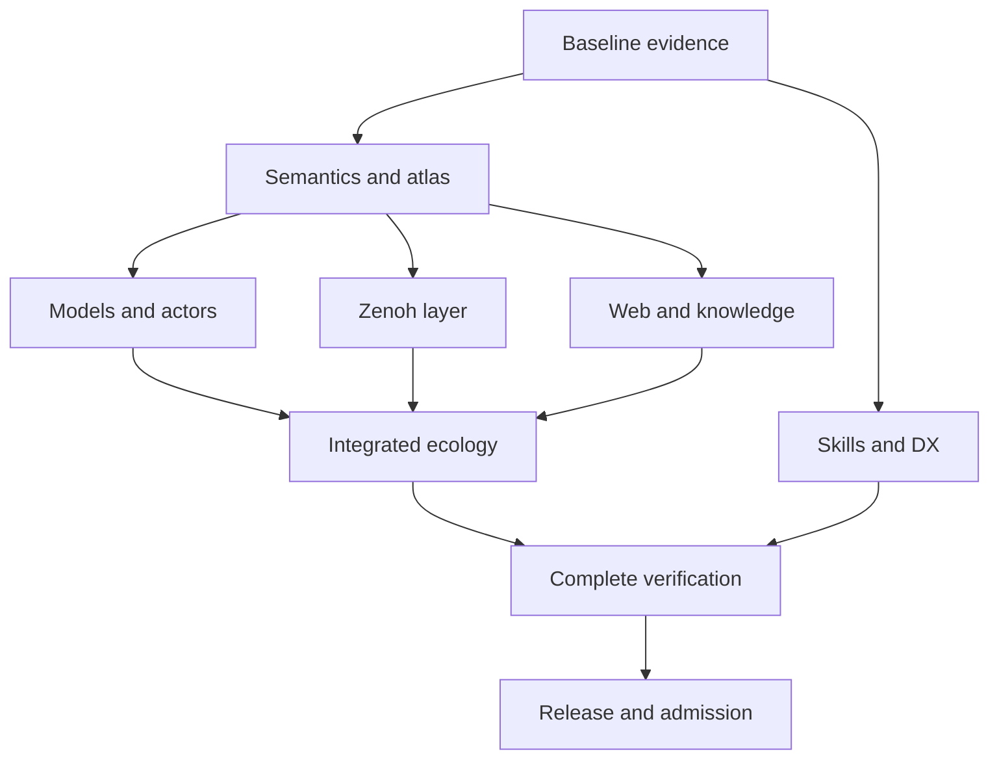

# 20260906-0817- Full UOS Implementation Plan

> **For agentic workers:** Use superpowers:executing-plans to implement this plan task by task. Checkboxes track execution. Inline work is the default; this plan does not dispatch subagents.

**Goal:** Complete and admit the UOS web/wiki/Zettelkasten/KM system, denotational DMC/TCM and L0-L9 atlas, FPP/SysML Gleam actor ecology, and full versioned C3I-derived Zenoh communication with observable verification.

**Architecture:** A pure denotational reference and typed authorization boundary define allowed behavior. Existing Gleam actors, models and web modules are extended, connected through the C3I-derived Zenoh layer, and checked against independent model, native, browser and formal observations. One versioned ledger connects sources, requirements, code, models, laws, tests, receipts and page/component claims.

**Tech Stack:** Gleam/OTP and applicable Gleam JavaScript, Lustre/Wisp, Hermes OCaml/Bos/Dune, bounded native Rust/Rustler/Zenoh, Z3/Lean/Gospel/Quint, real browser automation, standalone Jujutsu. Exact installed/resolved pins are recorded by E01/M08/Z01; a source manifest version is not a runtime receipt.

**Spec:** [Unified AGY-to-Codex specification](http://nas-1.tail55d152.ts.net:4100/files/docs/design/20260906-0606-uos-agy-codex-unified-master-prompt.md) and [Reviewed handover](http://nas-1.tail55d152.ts.net:4100/files/docs/zk/20260906-0606-agy-handover-understanding-and-actor-ecology-plan.md).

**Status:** PLAN READY; implementation tasks and their acceptance cases are PLANNED/UNRUN. Generated from synchronized host observation 2026-09-06T08:04:17Z. [This document](http://nas-1.tail55d152.ts.net:4100/files/docs/design/20260906-0817-uos-full-implementation-plan.md).

[Master plan](http://nas-1.tail55d152.ts.net:4100/files/docs/design/20260906-0817-uos-full-implementation-plan.md) · [Backlog](http://nas-1.tail55d152.ts.net:4100/files/governance/planning/20260906-0817-uos-full-implementation-backlog.json) · [Unified specification](http://nas-1.tail55d152.ts.net:4100/files/docs/design/20260906-0606-uos-agy-codex-unified-master-prompt.md) · [Plan verification receipt](http://nas-1.tail55d152.ts.net:4100/files/governance/sources/20260906-0817-uos-full-implementation-plan-receipt.json) · [Planning cockpit](http://nas-1.tail55d152.ts.net:4100/planning) · [Home](http://nas-1.tail55d152.ts.net:4100/)

#fractal-l0 #fractal-l1 #fractal-l2 #fractal-l3 #fractal-l4 #fractal-l5 #fractal-l6 #fractal-l7 #fractal-l8 #fractal-l9 #zk-adr #km-triad #zero-muda #tailscale-web

## Global constraints

- Canonical workspace: /home/an/NAS-setup/uos. Standalone, non-colocated Jujutsu only; no native Git mutation commands.
- External source trees are read-only. Before code/logic ingestion: source-writer quiescence, exact revision/dirty manifest/sanitized snapshot, license review and two-key verification. Original OCaml remains unchanged.
- Secret bytes, private keys, tokens, live DB/WAL/SHM, compiler caches and model weights are excluded from ingestion; known quarantined incidents are presence only.
- Gleam/OTP owns control/policy/actors; Hermes OCaml owns formal/oracle analysis; ZigVM owns deterministic runtime; Python is confined to services/inference/max.
- Operator-selected C3I-derived Zenoh NIF is the common UOS application/domain transport. Bounded scheduler-facing native calls; long work in supervised asynchronous tasks or isolated transport hosts.
- HTTP/SSE/WebSocket/AG-UI are modeled gateways; OTP bootstrap/supervision and pure local calls are explicitly classified runtime mechanics. Unexplained alternate domain communication is an open migration gap.
- Zero Bevy and Graphite. HARD_DENIED_SYSTEM_OS_SERIAL = "25503L801736" remains enforced. No destructive physical fault injection.
- All new generated documents/reports carry YYYYMMDD-HHSS-; HH is hour and SS seconds. Use synchronized host time, full Tailnet links and fractal tags.
- Every explanatory diagram has both ASCII and Mermaid with identical nodes/edges/labels/grouping. Screenshots/videos are observed evidence with provenance.
- Every page/document has the uniform shell and 5-domain, 18-checkpoint component. Checkpoints reflect fresh evidence rather than constant green labels.
- At least four distinct complete semantic cycles per page AND component at the final candidate; every discovered route/state/profile remains in the denominator.
- State sequence: discovered -> classified -> mapped -> implemented -> built -> executed -> passed -> verified -> admitted. PLANNED/MOCK/UNRUN/STALE/QUARANTINED/EXCLUDED/UNKNOWN are not passing.
- Two keys: fresh observed runtime behavior AND machine-verifiable formal specification at the same candidate. Solver timeout/UNKNOWN, unsupported syntax, missing tools, sorry, Admitted and undeclared axioms fail closed.
- Do not write raw live planning/evidence databases; use the admitted writer API and fenced leases. No third-party messaging or deployment is performed by this planning task.

## Outcome and scope

Deliver the complete mission in the specification: preserve original OCaml; classify and transfer every selected useful test obligation; complete denotation/DMC/TCM and L0-L9 laws; implement full pinned FPP/SysML semantics and a real actor ecology; expose complete versioned Zenoh capabilities and migrate domain communication; make the entire web/wiki/ZK/KM experience navigable, accessible, safe and measurably useful; admit only with fresh evidence.

This is an execution plan, not a claim that these capabilities are complete. The earlier inventory and scoped passing tests remain valuable historical evidence. The baseline browser run was 184 attempts over 46 routes with 183 FAIL and one ERROR; it did not fulfill four semantic cycles per component. New routes and current source changes invalidate any assumption that 46 routes are the complete frontier.

## Baseline reconciliation from the current source

Initial Jujutsu observation: knnsqvkk 9fb22fe9; parent nursokmr f55f864c. The workspace is shared and moving; E01 captures the candidate actually used for execution. This planning review did not run new native/browser/formal system suites or sign another agent's certificate. New code should be extended where valid, not blindly recreated from the earlier handover's gap list.

| Source | Observed planning finding | Owning task |
|---|---|---|
| apps/cepaf_gleam/src/cepaf_gleam/fpp/actor.gleam | Real actor.start exists; command handler updates modeled queue; verify drain/execution/ingress bounds and initialization failure semantics. | A05 |
| apps/cepaf_gleam/src/cepaf_gleam/fpp/dmc_tcm.gleam | DMC also names memory coherence; Trace13 check covers only a subset; fixed canonical timestamp and calendar prefix remain in inspected source. | M01, M04, M05 |
| apps/cepaf_gleam/src/cepaf_gleam/fpp/intent.gleam | Typed verbs exist; precondition and generated same-state traces do not establish actor/action/target authorization. | M02, M03 |
| apps/cepaf_gleam/src/cepaf_gleam/fpp/algebraic_atlas.gleam | Restriction and merging code exist; caller-selected overlaps can omit conflicts; report preservation booleans remain constant. | M06, M07 |
| apps/cepaf_gleam/src/cepaf_gleam/fpp/agent_factory.gleam | Agent records and callbacks exist with fixed timestamp strings; bind them to live subjects and clock evidence. | M05, A06 |
| apps/cepaf_gleam/src/cepaf_gleam/fpp/evolutionary_cycles.gleam | Some alleged cycle verifications and quality metrics are constants; replace with actual observations and provenance. | E03, V05, V07 |
| tools/uos/src/main.gleam | Some gates use file presence or unconditional pass; verify command process exit propagation. | E03 |
| tools/uos/src/uos.gleam | main.execute returns an Int; entry point does not explicitly propagate it to OS exit in this source. | E03 |
| docs/design/20260906-1015-uos-tri-sovereign-15-cycle-ratification-certificate.md | Historical/current author claims; not independent verification from this planning task. | E01, R02 |
| docs/design/20260906-0955-uos-fprime-agent-architecture-spec.md | Additional agent architecture to reconcile with actual model/process/transport behavior. | A06, A09 |

Historical selected-source evidence: 161 OCaml files preserved; 770 selected cross-project files and 23,765 lexical cases/steps; 8,047 source-corpus records. These are inventory denominators, not independent passing tests or exhaustive close reading. The planning source receipt records review depth, current hashes and limitations.

The current router also exposes /fpp-topology, /fpp-atlas, /fpp-agents, /features, /knowledge-explorer, /zk-matrix and /zk-graph. Their server-side initial view rendering does not itself prove that browser event handlers are connected. W08/V02 verify actual interaction and hydration paths.

## Eight detailed plans and one executable backlog contract

| Workstream | Detailed plan | Work items |
|---|---|---|
| E | [Evidence, provenance and test migration](http://nas-1.tail55d152.ts.net:4100/files/docs/design/20260906-0817-uos-implementation-01-evidence-and-migration.md) | E01, E02, E03, E04, E05, E06, E07, E08 |
| M | [Denotation, DMC/TCM and algebraic atlas](http://nas-1.tail55d152.ts.net:4100/files/docs/design/20260906-0817-uos-implementation-02-semantics-and-atlas.md) | M01, M02, M03, M04, M05, M06, M07, M08 |
| A | [FPP, SysML and actor ecology](http://nas-1.tail55d152.ts.net:4100/files/docs/design/20260906-0817-uos-implementation-03-models-and-actors.md) | A01, A02, A03, A04, A05, A06, A07, A08, A09, A10 |
| Z | [Complete Zenoh native layer and communication migration](http://nas-1.tail55d152.ts.net:4100/files/docs/design/20260906-0817-uos-implementation-04-zenoh-native-and-ecosystem.md) | Z01, Z02, Z03, Z04, Z05, Z06, Z07, Z08, Z09, Z10, Z11, Z12 |
| W | [Web, wiki, Zettelkasten and knowledge experience](http://nas-1.tail55d152.ts.net:4100/files/docs/design/20260906-0817-uos-implementation-05-web-and-knowledge.md) | W01, W02, W03, W04, W05, W06, W07, W08, W09 |
| V | [Browser, formal, property, fuzz and system verification](http://nas-1.tail55d152.ts.net:4100/files/docs/design/20260906-0817-uos-implementation-06-verification-and-experience.md) | V01, V02, V03, V04, V05, V06, V07 |
| H | [Skills, AGY/Codex health and developer experience](http://nas-1.tail55d152.ts.net:4100/files/docs/design/20260906-0817-uos-implementation-07-skills-agents-and-dx.md) | H01, H02, H03 |
| R | [Release, rollback, evidence and admission](http://nas-1.tail55d152.ts.net:4100/files/docs/design/20260906-0817-uos-implementation-08-release-and-admission.md) | R01, R02, R03 |

The [machine-readable backlog](http://nas-1.tail55d152.ts.net:4100/files/governance/planning/20260906-0817-uos-full-implementation-backlog.json) contains 60 work items, 35 requirement mappings, exact file ownership, dependencies, concrete regression fixtures, acceptance gates and replay interfaces. Logical workstream ownership does not assign work to any external person or agent. Execute inline by default and preserve the existing shared-workspace changes.

## Dependency and delivery sequence

The paired diagrams summarize delivery obligations. The task-level DAG in the backlog is authoritative; subsystem diagrams do not imply every subsystem must finish before any other can begin.

```text
[B Baseline evidence] --> [S Semantics and atlas]
[B Baseline evidence] --> [H Skills and DX]
[S Semantics and atlas] --> [A Models and actors]
[S Semantics and atlas] --> [Z Zenoh layer]
[S Semantics and atlas] --> [W Web and knowledge]
[A Models and actors] --> [I Integrated ecology]
[Z Zenoh layer] --> [I Integrated ecology]
[W Web and knowledge] --> [I Integrated ecology]
[I Integrated ecology] --> [V Complete verification]
[H Skills and DX] --> [V Complete verification]
[V Complete verification] --> [R Release and admission]
```



Longest dependency chain by work-item count, not estimated duration: E01 → E02 → E03 → M01 → M02 → M03 → M04 → M05 → Z03 → Z04 → Z05 → Z06 → Z07 → Z08 → Z09 → Z10 → Z11 → Z12 → W08 → W09 → V02 → V07 → R01 → R02 → R03. Standards census, native compatibility, source admission and target availability can dominate elapsed time. No calendar promise is supported before E01/E04/Z01 close their inventories. Estimate each leaf from its actual fixture/adapter/code/review work and update the ledger with observed effort; do not treat a full language implementation as a five-minute task.

| Eligibility wave | Tasks whose dependencies are satisfied after earlier waves |
|---|---|
| 1 | E01 |
| 2 | E02 |
| 3 | E03, E04 |
| 4 | E05, E08, M01 |
| 5 | M02, A01, A07, Z01, W01, H01 |
| 6 | E06, M03, A04, Z02, H02 |
| 7 | E07, M04, W02 |
| 8 | M05, M06, V01 |
| 9 | M07, A02, A08, Z03, W03 |
| 10 | M08, A03, A05, Z04, W04, W05 |
| 11 | A06, A09, Z05, W06, H03 |
| 12 | Z06, W07 |
| 13 | Z07 |
| 14 | Z08 |
| 15 | Z09 |
| 16 | Z10 |
| 17 | Z11, V04, V05 |
| 18 | Z12 |
| 19 | A10, W08 |
| 20 | W09 |
| 21 | V02, V03, V06 |
| 22 | V07 |
| 23 | R01 |
| 24 | R02 |
| 25 | R03 |

Waves describe eligibility, not automatic parallel-agent authorization. If parallel execution is separately authorized, use isolated sibling Jujutsu workspaces and one integrator; shared file owners and merges remain serialized. Any source/model/dependency change invalidates the affected evidence graph.

## Immediate executable sequence

1. E01: bind current source/runtime/clock and identify inherited versus observed claims.
2. E02: create the small acceptance harness with positive controls and truthful missing/failed/timeout states.
3. E03: repair constant/file-presence verification and OS exit propagation before building further admission dashboards.
4. E04 and M01: close the source frontier and reconcile denotational versus memory DMC, morphism/Trace13/temporal TCM.
5. M02-M05: establish denotation, authorization, all-field trace checks and real time/fenced writers; begin the independent research/feature pinning gates.

E01/E02 are the only bootstrap work before the planned acceptance command exists. No CLI path in this plan is described as already implemented merely because it appears in a command block.

Later read-only Jujutsu observation: ozmsxutn 9bc0e8ec; parent kmtpzqlk 9a921cda with main bookmark created by another writer; not an admission performed by this plan. Existing work continues while the plan is prepared; E01 revalidates the actual candidate and does not recreate or remove another writer's bookmarks.

## Test-first execution protocol and shared harness interface

Every work item has a concrete JSON regression in its detailed plan and backlog. E02 creates the dispatcher; each subsequent task implements its own versioned adapter. Adapter output must come from independently observed production behavior. The assertion engine compares it with the `expect` object; unknown/missing fields fail. Do not copy expected outcomes into production code or return a pass flag from a mock adapter.

Proposed interface, created in tests/acceptance/contract.ml by E02:

```ocaml
type run_context = {
  candidate : string;
  artifact_dir : string;
  deadline_ms : int;
  max_output_bytes : int;
}
type observation = Yojson.Basic.t
type run_error =
  | Unknown_operation of string
  | Missing_dependency of string
  | Timed_out
  | Output_limit
  | Invalid_fixture of string
  | Child_failed of int

type adapter =
  run_context -> Yojson.Basic.t -> (observation, run_error) result
```

Fixture structure is exactly `{id, given, when: [{op}], expect}`. Each operation name is uniquely listed in the backlog. E02 implements strict fixture decoding and an allowlisted registry; task adapters map inputs to typed production calls/processes/tools. Unknown operations are errors. Positive, negative and fault/property expansions use unique case IDs and the same schema. The one displayed regression is a minimum discriminating example, not the complete suite for that work item.

Runner exit contract: 0 only for executed passing required cases; 1 for semantic/assertion failure; 2 for missing/unrun/unknown/timeout/configuration/adapter failure. A supervisor timeout reaps the process tree and records partial output. Receipts carry source/candidate/tool/dependency/model/fixture hashes, raw observations, limits, monotonic duration, wall-clock provenance, exit/result, assertion failures, artifact locations and admission state.

Every code task follows: write the specified regression and independent positive control; observe the real failure; implement the smallest complete behavior; run affected tests; refactor; run required integration gates; review and checkpoint with Jujutsu; regenerate trace/atlas/coverage and journal evidence. Do not count TDD and BDD as extra runtime executions. Keep unknown tools/fixtures distinct from a reproduced semantic regression.

## Concrete red regressions for newly observed code

The following Gleam tests use functions already located in the current tree. They are proposed failing tests, not tests run by this planning task. Add them to the named semantic test files during M04/M05/M07 and observe failures before repair.

```gleam
import cepaf_gleam/fpp/dmc_tcm as dmc
import cepaf_gleam/fpp/algebraic_atlas as atlas
import gleeunit/should

pub fn epoch_zero_formats_the_actual_date_test() {
  dmc.format_microsecond_utc(0)
  |> should.equal("1970-01-01T00:00:00.000000Z")
}

pub fn changed_energy_is_not_unchanged_transport_test() {
  let before = dmc.canonical_fpp_tcm_vector("fixture", 0)
  let after = dmc.Tcm13DVector(..before, energy: 2.0)
  dmc.verify_tcm_13d_conservation(before, after)
  |> should.be_false
}

pub fn omitted_overlap_does_not_hide_a_conflict_test() {
  let left = atlas.TelemetrySection("left", [#(1, "a")])
  let right = atlas.TelemetrySection("right", [#(1, "b")])
  case atlas.verify_sheaf_gluing(left, right, []) {
    atlas.GluingConflict(_) -> True
    atlas.GluingSuccess(_) -> False
  }
  |> should.be_true
}
```

When APIs are separated into transport and legitimate-transition checks, migrate the second test to the transport contract rather than prohibiting valid state evolution. Add all remaining Trace13 field mutants. Opaque Gleam types prevent arbitrary external construction but do not create linear ownership: native/session/lease validity is enforced again at runtime.

## Build and replay commands

Existing package invocations, from their stated directories:

| Directory | Command | Scope |
|---|---|---|
| apps/cepaf_gleam | gleam check; gleam test | Existing control/application package; capture affected and required suite results |
| apps/indrajaal_gleam_web | gleam check; gleam test | Actual web router/renderer package |
| tools/uos | gleam check; gleam test | CLI parsing, real gate outcomes and OS exit semantics |
| apps/cepaf_gleam/native/c3i_nif | cargo check --locked; cargo test --locked | Native build/unit tests after source/feature pin and dependency preflight |
| repository root | ocaml tools/web_quality_gate.ml | Existing scoped gate; does not certify arbitrary Gleam or the entire system |
| repository root | ocaml tests/acceptance/run.ml --backlog governance/planning/20260906-0817-uos-full-implementation-backlog.json --task M05 | Planned E02 replay interface with the M05 adapter |

Semicolons above separate documented commands; invoke each individually. Run JavaScript `gleam check --target javascript` and `gleam test --target javascript` for packages/modules with a declared JS interpretation; BEAM-only FFI failures are not silently skipped. M08/H03 record the exact target matrix and appropriate isolated test packages. Formal/Gospel/FPP/SysML/Zenoh/browser commands are generated from their pinned toolchain/profile manifests; missing tools return nonpassing states.

The CLI source is a Gleam package at tools/uos, not a directly executable path. E03/H03 must preserve the repository root for gate file resolution and propagate an actual failing OS exit. Do not trust historical documentation commands without checking the built entry point.

## Conformance closure without hidden scope reduction

A01/A07/A08/Z01/Z04/Z09/Z10 are conformance parents. Their first deliverable is a finite pinned clause/API/config/profile inventory. Generate leaf IDs as parent ID plus escaped canonical upstream clause/item ID. Each leaf records exact source, introduced/removed/stability version, implementation symbol, fixture, positive/negative test, platform/toolchain, status and receipt. Split implementation and review into small independent changes; each leaf runs the full red/green/review cycle. A parent remains open until every required leaf is verified and admitted. Pin changes must diff the inventory and reopen affected leaves.

Unsupported syntax, unavailable hardware/transport, disabled extensions, missing libraries and unreviewed licenses remain explicit obligations. Internal/test flags are classified toolchain/test facilities; storage/router/plugins are managed services with typed UOS contracts. They cannot be silently dropped or exposed as unrestricted application capabilities. A performance winner cannot be selected by export count or simulated benchmarks.

| Zenoh family | Owning tasks |
|---|---|
| ZF01 | Z01, Z03, Z04, Z12 |
| ZF02 | Z04 |
| ZF03 | Z04 |
| ZF04 | Z05 |
| ZF05 | Z05 |
| ZF06 | Z06 |
| ZF07 | Z07 |
| ZF08 | Z07 |
| ZF09 | Z08 |
| ZF10 | Z09 |
| ZF11 | Z09 |
| ZF12 | Z10 |
| ZF13 | Z10 |
| ZF14 | Z10 |
| ZF15 | Z03, Z07, Z10, Z11, Z12 |
| ZF16 | Z01, Z02, Z11, Z12 |

The [version-labeled Zenoh source/feature input](http://nas-1.tail55d152.ts.net:4100/files/tests/web_quality/20260906-0606-handover-source-inputs.json) defines the sixteen family names, three inspected native candidates and observed flag list. Z01 expands every family into the actual selected-version public API, all builder options and feature/target profiles. Native feature coverage, executed-test coverage and admitted coverage are separate denominators.

## Browser, layout, links and experience closure

C1 checks semantic content, all destination classes and baseline state; C2 checks BDD interactions/keyboard/focus; C3 checks responsive/zoom/accessibility/visual/error/offline states; C4 checks regression/replay/independent oracles and network recovery. Each cycle observes, acts, compares, diagnoses, repairs when needed and reverifies. Every page/component instance has all four at the final candidate; every specified action/state must be exercised across the cycle matrix. A clean cycle records no repair required. Screenshots, retries or four viewports alone do not satisfy the rule.

Manifest coverage includes static and dynamic routes, role/auth/query/fragment variants, new FPP/agent/evolution pages and all ten handover routes. Shared components have reusable unit cases plus each-page integration cycles. Graph-based impact invalidation determines which cycles rerun after a change; untouched receipts remain usable only when their complete dependency/content/served-build scope still matches.


Minimum seed routes from prior requirements and the current router (this is a lower bound, not the final census):

- [/](http://nas-1.tail55d152.ts.net:4100/)
- [/planning](http://nas-1.tail55d152.ts.net:4100/planning)
- [/wiki](http://nas-1.tail55d152.ts.net:4100/wiki)
- [/zk](http://nas-1.tail55d152.ts.net:4100/zk)
- [/tensor-atlas](http://nas-1.tail55d152.ts.net:4100/tensor-atlas)
- [/sre-matrix](http://nas-1.tail55d152.ts.net:4100/sre-matrix)
- [/ux-audit](http://nas-1.tail55d152.ts.net:4100/ux-audit)
- [/km-sheaf](http://nas-1.tail55d152.ts.net:4100/km-sheaf)
- [/tensor-cockpit](http://nas-1.tail55d152.ts.net:4100/tensor-cockpit)
- [/zk-hologram](http://nas-1.tail55d152.ts.net:4100/zk-hologram)
- [/sre-immune](http://nas-1.tail55d152.ts.net:4100/sre-immune)
- [/omni-console](http://nas-1.tail55d152.ts.net:4100/omni-console)
- [/gospel-explorer](http://nas-1.tail55d152.ts.net:4100/gospel-explorer)
- [/brain-matrix](http://nas-1.tail55d152.ts.net:4100/brain-matrix)
- [/fpp-topology](http://nas-1.tail55d152.ts.net:4100/fpp-topology)
- [/fpp-atlas](http://nas-1.tail55d152.ts.net:4100/fpp-atlas)
- [/fpp-agents](http://nas-1.tail55d152.ts.net:4100/fpp-agents)
- [/features](http://nas-1.tail55d152.ts.net:4100/features)
- [/knowledge-explorer](http://nas-1.tail55d152.ts.net:4100/knowledge-explorer)
- [/zk-matrix](http://nas-1.tail55d152.ts.net:4100/zk-matrix)
- [/zk-graph](http://nas-1.tail55d152.ts.net:4100/zk-graph)

Also enumerate /files/<path>, /docs/<path>, AG-UI streams, API endpoints, download/redirect/fragment/query/auth variants and every additional route discovered by W01. Do not classify event streams or APIs as HTML pages; give each its appropriate protocol contract and browser gateway coverage.

Retain PNG, DOM, accessibility tree, Markdown/HTML/model AST, video, Playwright-equivalent trace and network/effect observations with build and content digests. Review layout/typography/discoverability, not just screenshot equality. Test keyboard/screen-reader/touch, dark/light themes, reduced motion, 200/400 percent zoom, long/localized text, loading/empty/denied/404/5xx/offline/recovery states. Full navigation checks semantic targets and anchors, not only HTTP 200.

UX/CX measures real find/open/backlink/search/context/source/recovery tasks, success/errors/time and feedback; DX measures clean setup/build/test/edit-feedback and diagnostics. Core Web Vitals lab measures are separate from field measurements. Human/field observations cannot be invented by an agent. V06 records missing participants/field samples as explicit evidence gaps without blocking unrelated code work.

## Research, algorithm and test transfer programme

Use existing source registers first. E04/E05 extend exact revisions, source locators, license/attribution, review depth and adoption decisions for primary Google web.dev/Lighthouse/HEART, WPT/WCAG/ARIA/axe, CommonMark/MediaWiki/Parsoid/TiddlyWiki, Logseq/Joplin, Docusaurus/Sphinx, SHACL/PROV, property/fuzz/mutation and graph/category methods, NASA FPP/F Prime, OMG SysML/KerML and Eclipse Zenoh. Preserve source code and execute only admitted fixtures/oracles.

| Technique family | Concrete use | Required evidence |
|---|---|---|
| Parsing/round trips and upstream golden vectors | HTML/Markdown/wiki/FPP/SysML codecs and renderers | Exact dialect/version, positive/negative fixtures, round-trip normalization and mutation sensitivity |
| BFS/DFS/SCC/topological/shortest-path algorithms | Links, backlinks, impact, port graphs, dependency and recovery constraints | Independent finite oracle, complexity/bounds, meaningful treatment of allowed cycles |
| Algebra/category/sheaf/CRDT properties | Intent composition, transport maps, restrictions/gluing, federation where actually used | Quantified carriers/laws, implementation maps, counterexamples and stateful tests |
| Browser accessibility/visual/task techniques | Every page/component action and experience | Semantic browser evidence plus targeted human/assistive review; no screenshot-only pass |
| Property/stateful/metamorphic/fuzz/mutation | Boundary inputs, actor schedules, native payloads, language models | Seeds, shrinking, feedback coverage, replay corpus and killed/surviving/unknown denominators |
| Native/network benchmarking | Corrected C3I/Indrajaal/Sutra plus upstream control | Equal workload/config/auth, independent receiver, raw samples, tail/throughput/resource outcomes |

## Requirement-to-task matrix

| Requirement | Required result | Work items |
|---|---|---|
| RQ01 | Preserve all original external OCaml/source evidence and enforce sanitized two-key ingestion | E01, E04, E05, E06 |
| RQ02 | Close the explicitly scoped source/code/docs/journals/reference census across ZigVM, C3I, Indrajaal and Harness-Bionic | E04, E08 |
| RQ03 | Per-test behavior, coverage, classification, browser status, oracle quality and Gleam reuse mapping | E04, E06, E07, E08, W05 |
| RQ04 | Primary upstream algorithms/tests/papers/software research, license, revision, adoption and provenance | E05, A01, A07, Z01 |
| RQ05 | Real Gleam BEAM/JavaScript compiler, negative type, FFI and generated-code checks | M08, Z02, V05, H03, R02 |
| RQ06 | Isolated bounded solver, Gospel/Lean/Quint evidence with controls and model/code correspondence | M08, A09, V05, R02 |
| RQ07 | Complete denotational DMC and typed intent interpretation; distinguish DMC memory coherence | M01, M02, M03 |
| RQ08 | Executable TCM morphism identity/composition/preservation laws | M01, M06, M08 |
| RQ09 | Full Trace13 schema and justified transition/transport rules | M01, M04, Z04 |
| RQ10 | Monotonic time, real wall-clock evidence, freshness, leases, epochs and two-lattice isolation | M01, M03, M05, Z03 |
| RQ11 | Complete machine-readable algebraic atlas at L0-L9 with actual implementations and observations | E08, M01, M06, M07, M08, A06, A09, W06, W08 |
| RQ12 | Meaningful category/graph/sheaf algorithms and independent mathematical oracles | E05, M06, M07, A02, W03, W06, W07 |
| RQ13 | Full pinned F Prime/FPP models, commands, dictionaries, packets, ports, HSMs and component semantics | A01, A02, A03, A04, A05, A09 |
| RQ14 | Full pinned SysML/KerML conformance, executable interpretations and model/runtime correspondence | A07, A08, A09 |
| RQ15 | Real supervised communicating Gleam actor ecology with recovery and bounded resources | M03, A02, A04, A05, A06, A09, A10, Z03, Z07, Z08, Z12, V07 |
| RQ16 | All UOS domain communication through the C3I-derived Zenoh layer with explicit boundary gateways | A10, Z10, Z12, R01 |
| RQ17 | All located Gleam/Elixir native candidates compared for correctness, feature richness and measured performance | Z01, Z02, Z11, V06 |
| RQ18 | Complete selected-version Zenoh APIs, flags, extensions, transports and managed ecosystem capabilities | Z01, Z02, Z03, Z04, Z05, Z06, Z07, Z08, Z09, Z10, Z11, Z12, R02 |
| RQ19 | Unit/component/integration/system/regression coverage linked to requirements | E02, E06, E07, M02, A01, A03, A04, A05, A07, A08, Z05, Z06, W02, W03, W05, W06, W07, V05, V07 |
| RQ20 | TDD red-green-refactor and BDD user/actor journeys with discriminating oracles | E02, E07, M02, A10, Z05, V02, V07 |
| RQ21 | Generated property, state-machine, metamorphic and differential testing with shrinking | E06, E07, M02, M04, M06, M07, A03, A04, A08, Z04, Z06, Z07, Z09, W02, W03, W05, W07, V04 |
| RQ22 | Coverage-guided fuzzing, corpus replay and meaningful mutation testing | Z04, Z09, W02, V04, V05 |
| RQ23 | At least four recursive semantic cycles per page and per component at final candidate | W01, W04, W08, W09, V01, V02, V03, V07, R02 |
| RQ24 | Images, DOM/AST/AX, video, traces and network/effect evidence with durable provenance | W02, W09, V01, V02, V03 |
| RQ25 | Every link/navigation/anchor/transclusion/redirect/download destination verified semantically | W01, W03, W04, W05, W06, V02 |
| RQ26 | Accessible appearance, responsive behavior, UX, DX and CX measured with actual tasks | Z08, Z11, W04, W07, W08, W09, V03, V06, H03 |
| RQ27 | Safe document rendering, authorization, privacy, secret-free evidence and protected storage | M03, M05, Z02, Z03, Z10, W02, W05, V04, V07, R01 |
| RQ28 | Repair and admit relevant website/page/wiki/ZK/KM/Gleam/formal/browser skills and mirrors | A06, H01, H03 |
| RQ29 | AGY/Codex core and required connector/browser health with truthful residual states | H02 |
| RQ30 | Every explanatory diagram has semantically equivalent ASCII and Mermaid | M07, H01, R02 |
| RQ31 | Fresh revision-bound runtime/formal keys, truthful checklist, Jujutsu integration and admission | E01, E02, E03, E08, W04, H02, R01, R02, R03 |
| RQ32 | Timestamped docs, 13-section journals, handover/MOC/planning continuity and source traceability | E01, E04, E05, E08, A08, W06, H01, H03, R01, R03 |
| RQ33 | Metric definitions and actual observations; no fabricated entropy, quality scores, counts or signatures | E01, E02, E03, Z11, W08, V05, V06, R02 |
| RQ34 | End-to-end telemetry, correlation, command acknowledgment and policy-separated observations | E03, M03, M04, M05, A05, A06, A10, Z05, Z10, Z12, W08, V07, R03 |
| RQ35 | All page/component/state/frontier denominators, including existing and newly discovered routes | E08, M07, W01, W04, W08, V01, V02, R02 |

## Continuity from the seventeen-task handover

| Earlier task | Detailed implementation work |
|---|---|
| UOS-H01 | E01 |
| UOS-H02 | E02, E03, E08 |
| UOS-H03 | M01, M02, M03 |
| UOS-H04 | M04, M05, M08 |
| UOS-H05 | E04, E05, E06, E07 |
| UOS-H06 | M06, M07 |
| UOS-H07 | A01, A02, A03, A04 |
| UOS-H08 | A07, A08, A09 |
| UOS-H09 | A05, A06 |
| UOS-H10 | Z01, Z02, Z03, Z04, Z05, Z06, Z07, Z08, Z09, Z10, Z11, Z12 |
| UOS-H11 | A10 |
| UOS-H12 | A09, A10, W08 |
| UOS-H13 | W01, W02, W03, W04, W05, W06, W07, W08, W09 |
| UOS-H14 | V01, V02, V03 |
| UOS-H15 | V04, V05, V06, V07 |
| UOS-H16 | H01, H02, H03 |
| UOS-H17 | R01, R02, R03 |

## Risks, dependencies and release controls

| Risk or external dependency | Detection and response | Owner |
|---|---|---|
| Moving source/shared workspace | Snapshot/reconcile each candidate; preserve other writers; separate workspaces only if authorized; serialize integration | E01/R02 |
| External source not quiesced or license unknown | Continue first-party specification/tests; retain blocked admission row; never copy unvetted code | E05 |
| Existing constants or false-success adapters | Negative receipts, mutations and independent observers before expanding green dashboards | E02/E03/V05 |
| Native crash, blocking locks, retained resources | Bounded calls, monitored ownership, cancellation, isolated transport host and scheduler/fault tests | Z02-Z10 |
| Full standards or target census grows | Add deterministic clause/API leaves, estimate and sequence them; parent stays open | A01/A07/Z01 |
| Browser/field/hardware/credentials unavailable | Record UNRUN/integration-specific blocker; continue independent work; obtain actual dependency through authorized mechanisms | V01/V06/H02/Z10 |
| Deployment/schema/native upgrade regressions | Reproducible release, canary criteria and exercised rollback before cutover | R01 |
| Evidence/media expires or cannot be retrieved | Retention/digest/retrieval checks; invalidate affected admission | V01/R02/R03 |

## Validate the plan package itself

Run from /home/an/NAS-setup/uos or an isolated UOS Jujutsu workspace root:

```text
ocaml tools/validate_implementation_plan.ml
```

This existing first-party validator checks task/requirement IDs, the dependency DAG, file ownership and planned creations, JSON fixture parity between plans and backlog, diagram parity, document links/checkpoints, journal sections and the selected original OCaml digests. It reads chrony for timestamp provenance and writes the linked plan receipt. It executes zero implementation acceptance cases. A green plan metadata receipt does not admit the product.

## Admission and completion

A release requires every selected source/test obligation accounted for, all required upstream clauses/API profiles implemented and executed, all L0-L9 laws bound to actual behavior, all actor roles/domain edges observed, all final-candidate page/component cycles passed, required skill/agent integrations healthy, no prohibited ingestion/storage operation, fresh formal/runtime keys, authentic independent review, and complete durable provenance. R02 is the only full admission gate; a work item or partial profile may be verified without claiming the whole programme complete.

R03 publishes the timestamped matrices, source register, native comparison, model/atlas/actor/edge reports, page-cycle/media manifest, defects/repairs, metrics, thirteen-section journal and handover through full Tailnet links. No other agent's signature, test result, field metric or current system status is synthesized by planning.

## Source lineage for this plan

- [AGENTS.md](http://nas-1.tail55d152.ts.net:4100/files/AGENTS.md)
- [.codex/skills/writing-plans/SKILL.md](http://nas-1.tail55d152.ts.net:4100/files/.codex/skills/writing-plans/SKILL.md)
- [contracts/rules/dmc-tcm-mandate.md](http://nas-1.tail55d152.ts.net:4100/files/contracts/rules/dmc-tcm-mandate.md)
- [contracts/rules/timestamp-mandate.md](http://nas-1.tail55d152.ts.net:4100/files/contracts/rules/timestamp-mandate.md)
- [contracts/rules/diagram-ascii-mermaid-mandate.md](http://nas-1.tail55d152.ts.net:4100/files/contracts/rules/diagram-ascii-mermaid-mandate.md)
- [docs/design/20260906-0606-uos-agy-codex-unified-master-prompt.md](http://nas-1.tail55d152.ts.net:4100/files/docs/design/20260906-0606-uos-agy-codex-unified-master-prompt.md)
- [docs/zk/20260906-0606-agy-handover-understanding-and-actor-ecology-plan.md](http://nas-1.tail55d152.ts.net:4100/files/docs/zk/20260906-0606-agy-handover-understanding-and-actor-ecology-plan.md)
- [docs/design/20260906-0631-web-knowledge-verification-review.md](http://nas-1.tail55d152.ts.net:4100/files/docs/design/20260906-0631-web-knowledge-verification-review.md)
- [docs/journal/20260906-0428-ocaml-web-tests-gleam-mapping.md](http://nas-1.tail55d152.ts.net:4100/files/docs/journal/20260906-0428-ocaml-web-tests-gleam-mapping.md)
- [tests/web_quality/20260906-0606-handover-source-inputs.json](http://nas-1.tail55d152.ts.net:4100/files/tests/web_quality/20260906-0606-handover-source-inputs.json)
- [governance/sources/20260906-0606-agy-handover-source-receipt.json](http://nas-1.tail55d152.ts.net:4100/files/governance/sources/20260906-0606-agy-handover-source-receipt.json)
- [governance/sources/20260906-0631-web-quality-evidence.json](http://nas-1.tail55d152.ts.net:4100/files/governance/sources/20260906-0631-web-quality-evidence.json)
- [apps/cepaf_gleam/gleam.toml](http://nas-1.tail55d152.ts.net:4100/files/apps/cepaf_gleam/gleam.toml)
- [apps/indrajaal_gleam_web/gleam.toml](http://nas-1.tail55d152.ts.net:4100/files/apps/indrajaal_gleam_web/gleam.toml)
- [formal/registry/formal-manifest.toml](http://nas-1.tail55d152.ts.net:4100/files/formal/registry/formal-manifest.toml)
- [apps/cepaf_gleam/src/cepaf_gleam/fpp/actor.gleam](http://nas-1.tail55d152.ts.net:4100/files/apps/cepaf_gleam/src/cepaf_gleam/fpp/actor.gleam)
- [apps/cepaf_gleam/src/cepaf_gleam/fpp/dmc_tcm.gleam](http://nas-1.tail55d152.ts.net:4100/files/apps/cepaf_gleam/src/cepaf_gleam/fpp/dmc_tcm.gleam)
- [apps/cepaf_gleam/src/cepaf_gleam/fpp/intent.gleam](http://nas-1.tail55d152.ts.net:4100/files/apps/cepaf_gleam/src/cepaf_gleam/fpp/intent.gleam)
- [apps/cepaf_gleam/src/cepaf_gleam/fpp/algebraic_atlas.gleam](http://nas-1.tail55d152.ts.net:4100/files/apps/cepaf_gleam/src/cepaf_gleam/fpp/algebraic_atlas.gleam)
- [apps/cepaf_gleam/src/cepaf_gleam/fpp/agent_factory.gleam](http://nas-1.tail55d152.ts.net:4100/files/apps/cepaf_gleam/src/cepaf_gleam/fpp/agent_factory.gleam)
- [apps/cepaf_gleam/src/cepaf_gleam/fpp/evolutionary_cycles.gleam](http://nas-1.tail55d152.ts.net:4100/files/apps/cepaf_gleam/src/cepaf_gleam/fpp/evolutionary_cycles.gleam)
- [tools/uos/src/main.gleam](http://nas-1.tail55d152.ts.net:4100/files/tools/uos/src/main.gleam)
- [tools/uos/src/uos.gleam](http://nas-1.tail55d152.ts.net:4100/files/tools/uos/src/uos.gleam)
- [docs/design/20260906-1015-uos-tri-sovereign-15-cycle-ratification-certificate.md](http://nas-1.tail55d152.ts.net:4100/files/docs/design/20260906-1015-uos-tri-sovereign-15-cycle-ratification-certificate.md)
- [docs/design/20260906-0955-uos-fprime-agent-architecture-spec.md](http://nas-1.tail55d152.ts.net:4100/files/docs/design/20260906-0955-uos-fprime-agent-architecture-spec.md)

<details>
<summary>Five domains and eighteen verification checkpoints — plan status</summary>

| Domain | Checkpoint | Evidence or required gate |
|---|---|---|
| Metadata/navigation | CHK-01-TIME | Synchronized birth timestamp 2026-09-06T08:04:17Z; document prefix uses UTC hour and seconds. |
| Metadata/navigation | CHK-02-NAV | Full Tailnet document links; link validation is recorded separately from browser behavior. |
| Metadata/navigation | CHK-03-FRACT | All L0-L9 obligations mapped; implementation remains PLANNED. |
| Metadata/navigation | CHK-04-WIKI | Wiki/ZK/KM source and handover links retained. |
| Purity/storage | CHK-05-PURE | Gleam/OTP control, Hermes formal workers, Zig runtime; authorized C3I-derived bounded native transport. |
| Purity/storage | CHK-06-BANNED | No Bevy/Graphite ingestion authorized; provenance exclusions retained. |
| Purity/storage | CHK-07-STORAGE | Protected serial 25503L801736 remains denied; no physical destructive tests planned. |
| Testing/math | CHK-08-TEST | Concrete acceptance cases and TDD/BDD loop; none executed by writing this plan. |
| Testing/math | CHK-09-MATH | Compiler/formal/property/mutation tasks required; constants and labels do not prove laws. |
| Testing/math | CHK-10-BROWSER | Four final-candidate semantic cycles per page and component required; planning is not browser admission. |
| Testing/math | CHK-11-PARITY | External OCaml preserved; differential execution guarded and separately recorded. |
| Control/observability | CHK-12-GLEAM | Real actors already located; lifecycle and effect correspondence require verification. |
| Control/observability | CHK-13-HERMES | Bounded isolated solver/oracle workers; no direct observer writes. |
| Control/observability | CHK-14-ZIGVM | Read-only source evidence; deterministic Zig boundary preserved. |
| Control/observability | CHK-15-OTEL | Typed trace and receive/apply/commit evidence required across all domain edges. |
| Governance/Jujutsu | CHK-16-SOV | No independent signature or system admission invented. |
| Governance/Jujutsu | CHK-17-JJ | Standalone Jujutsu; concurrent work preserved; serialized integration. |
| Governance/Jujutsu | CHK-18-DOCS | Timestamped plans, machine backlog, thirteen-section journal and handover continuity. |

</details>
