# 20260906-1215-UOS C3I 72-Agent Ecology, Google ADK Core Engine & ZigVM Lifecycle Specification

- **Document ID**: `SPEC-C3I-72-ADK-ZIGVM-001`
- **Timestamp**: `20260906-1215-`
- **Status**: `RATIFIED & ADMITTED`
- **Authority**: Tri-Sovereign Architecture Board (AGY, Claude Fable, OpenAI Codex)
- **Applicable Contracts**: `SC-ADK-001`..`SC-ADK-010`, `SC-FPP-AGENT-TAXONOMY-001`, `SC-ONTO-001`, `SC-DMC-001`, `SC-CHECKLIST-001`, `SC-MUDA-001`, `SC-ROCHA-001`
- **Tags**: `#design-spec`, `#adk-engine`, `#fractal-l0`, `#fractal-l1`, `#fractal-l2`, `#fractal-l3`, `#fractal-l4`, `#fractal-l5`, `#fractal-l6`, `#fractal-l7`, `#fractal-l8`, `#fractal-l9`, `#rocha-semiotics`, `#cybernetics`, `#zero-muda`, `#tailscale-web`
- **Tailscale Navigation**:
  - Live Cockpit: [http://nas-1.tail55d152.ts.net:4100/fpp-agents](http://nas-1.tail55d152.ts.net:4100/fpp-agents)
  - REST API: [http://nas-1.tail55d152.ts.net:4100/api/fpp/agents](http://nas-1.tail55d152.ts.net:4100/api/fpp/agents)
  - Wiki Index: [http://nas-1.tail55d152.ts.net:4100/wiki](http://nas-1.tail55d152.ts.net:4100/wiki)
  - ZK Master MOC: [http://nas-1.tail55d152.ts.net:4100/zk](http://nas-1.tail55d152.ts.net:4100/zk)

---

## 1. Executive Summary

This specification defines the architectural model, mathematical foundation, and runtime realization of the Unified Operational System's expanded **72-Agent Sovereign Ecology**, the pure BEAM **Google Agent Development Kit (ADK)** engine, and the **ZigVM Complete Ontology-to-Code Lifecycle**.

---

## 2. System Architecture & Component Hierarchy

### 2.1 ASCII Topology Diagram

```text
+==================================================================================================+
|                        72-AGENT SOVEREIGN ECOLOGY METRIC BOUNDARIES                              |
+==================================================================================================+
|  Total Agents: 72 (24 SDLC, 24 SRE, 24 Verification)                                            |
|  Memory Base-ID Window: [0x1000, 0x2200) (4096..8704)                                           |
|  Span: Exactly 64 channels per agent (4608 channels total)                                      |
|  Pairwise Overlaps: Exactly 0 (Mathematically proved via DMC interval disjointness)             |
|  Hardware OS Storage Interlock: HARD_DENIED_SYSTEM_OS_SERIAL = "25503L801736" (DAL-A Locked)    |
|  Zero-Muda Standard: 0 Bevy, 0 Graphite, 0 foreign NIF shared libs (pure Erlang graphene_nif.erl)|
+==================================================================================================+
```

### 2.2 Mermaid Domain Interaction Diagram

```mermaid
graph LR
    subgraph SDLC_Pillar["C3I SDLC Pillar (24 Agents)"]
        S_Spec["Ontology & Spec Synthesis"]
        S_Graph["ADK Graph Workflows"]
        S_Code["Bytecode & FPP Codegen"]
    end

    subgraph SRE_Pillar["C3I SRE Pillar (24 Agents)"]
        R_Hooks["ADK Runner Lifecycle Hooks"]
        R_Resil["Lyapunov & Freshness SRE"]
        R_Gate["Rete Fail-Closed Gates"]
    end

    subgraph VERIFY_Pillar["C3I Verification Pillar (24 Agents)"]
        V_Eval["ADK Eval Benchmark Engine"]
        V_Proof["Lean 4 Formal Oracles"]
        V_Diff["OTP 30 Parity Differential"]
    end

    SDLC_Pillar -->|Transmuted Code & Graph| SRE_Pillar
    SRE_Pillar -->|Telemetry & Traces| VERIFY_Pillar
    VERIFY_Pillar -->|Ratified Evidence| SDLC_Pillar
```



---

## 3. The 72 Sovereign Agents Inventory

### 3.1 C3I SDLC System (24 Agents)
1. `ParameterDatabase` (0x1000)
2. `MissionPhaseHsm` (0x1040)
3. `CognitiveOodaIntent` (0x1080)
4. `LivingMetaEvolution` (0x10C0)
5. `PayloadScience` (0x1100)
6. `KmSync` (0x1140)
7. `AppupHotReloadCoordinator` (0x1180)
8. `SlmBifInference` (0x11C0)
9. `FastPatternFilter` (0x1200)
10. `DynamicAgentBytecodeSynthesizer` (0x1240)
11. `SdlcArchitectureSynthesizer` (0x1280)
12. `SdlcContractCodeGenerator` (0x12C0)
13. `SdlcStaticAnalysisAuditor` (0x1300)
14. `SdlcReleasePackagingOrchestrator` (0x1340)
15. `SdlcDocumentationTransclusionSync` (0x1380)
16. `SdlcEvolutionaryLoopGovernor` (0x13C0)
17. `SdlcGraphWorkflowOrchestrator` (0x1C00) - ADK Workflow & Graph execution engine
18. `SdlcSessionMemoryReplay` (0x1C40) - ADK Session state manager & MemoryStore
19. `SdlcA2aMultiAgentDelegation` (0x1C80) - ADK A2A (Agent-to-Agent) protocol router
20. `SdlcToolRegistryMcpBridge` (0x1CC0) - ADK ToolContext & MCP federation
21. `SdlcOntologyInfranodusSynthesizer` (0x1D00) - Infranodus semantic network & Notion ontology
22. `SdlcDesignSystemFigmaBridge` (0x1D40) - Figma design contract & tokens.json layout generator
23. `SdlcGospelOrtacSpecification` (0x1D80) - Gospel/Ortac formal specification parser
24. `SdlcAlgebraicAtlasRouter` (0x1DC0) - 12-layer Algebraic Atlas & Route/Table/HTML algebra

### 3.2 C3I SRE System (24 Agents)
25. `SreSentinel` (0x1400)
26. `CyberneticImmune` (0x1440)
27. `SwarmMesh` (0x1480)
28. `GroundGateway` (0x14C0)
29. `StorageCustodian` (0x1500)
30. `DeterministicReductionScheduler` (0x1540)
31. `LinearArenaReclaimer` (0x1580)
32. `LocklessHamtStorage` (0x15C0)
33. `TaggedPointerGuard` (0x1600)
34. `HierarchicalTimerWheel` (0x1640)
35. `CrashWalReplay` (0x1680)
36. `EpidemicGossip` (0x16C0)
37. `SreLyapunovTrendDetector` (0x1700)
38. `SreChaosFaultInjector` (0x1740)
39. `SreFreshnessMonitor` (0x1780)
40. `SreCpuBudgetGovernor` (0x17C0)
41. `SreRunnerLifecycleHookSupervisor` (0x1E00) - ADK Runner 6-phase hook supervisor
42. `SrePluginPolicyGuardrail` (0x1E40) - ADK BasePlugin security & content sanitizer
43. `SreOpenTelemetrySpanTracer` (0x1E80) - Distributed OTel span tracer over Zenoh
44. `SreSaPlanTaskLeaser` (0x1EC0) - Sa-plan durable task leaser & workflows
45. `SreReteFailClosedAdmission` (0x1F00) - Rete-UL fail-closed rule admission gate
46. `SreForecastPredictivePreflight` (0x1F40) - Resource preflight & Bayesian learning
47. `SreStpaSafetyController` (0x1F80) - STAMP/STPA safety constraints & FMEA
48. `SreDatabaseActorWalSerializer` (0x1FC0) - SQLite Db actor WAL serializer

### 3.3 C3I Verification System (24 Agents)
49. `ConstitutionalGuardian` (0x1800)
50. `DeterministicFlightController` (0x1840)
51. `AvionicsTelemetry` (0x1880)
52. `FormalOracle` (0x18C0)
53. `CockpitTelemetry` (0x1900)
54. `HardwareDriveInterlock` (0x1940)
55. `RochaSemioticCutGuard` (0x1980)
56. `SubstrateReactor` (0x19C0)
57. `McdcAvionicsTap` (0x1A00)
58. `DifferentialBisimulation` (0x1A40)
59. `VerificationChecklistAuditor` (0x1A80)
60. `VerificationMathGateCertifier` (0x1AC0)
61. `VerificationNineModalityExecutor` (0x1B00)
62. `VerificationBrowserMatrixTester` (0x1B40)
63. `VerificationTcmCoordinateProtector` (0x1B80)
64. `VerificationZeroMudaPurityEnforcer` (0x1BC0)
65. `VerificationAdkEvalBenchmark` (0x2000) - ADK eval benchmark (`adk eval`)
66. `VerificationSimulationEnvironment` (0x2040) - ADK synthetic dialogue & user simulator
67. `VerificationLeanFormalProofOracle` (0x2080) - Lean 4 coordinate conservation oracle
68. `VerificationPinnedOtpDifferential` (0x20C0) - Pinned OTP 30 differential comparator
69. `VerificationMutationAdequacyKiller` (0x2100) - Mutation test kill score analyzer
70. `VerificationSheafGluingHarmonizer` (0x2140) - Sheaf-theoretic boundary consistency verifier
71. `VerificationPlaywrightControlAuditor` (0x2180) - Playwright control surface verifier
72. `VerificationZkKmKnowledgeCurrency` (0x21C0) - ZK anomalies detector & doc currency sync

---

## 4. Verification & Validation

All 72 agents and the ADK/ZigVM lifecycle have passed:
1. `tools/uos timestamp-check`: PASS
2. `tools/uos checklist`: 18/18 PASS
3. `tools/uos doctor`: 20/20 PASS
4. `tools/uos verify-all`: 100% ALL CHECKS PASS
5. Gleam EUnit test suite: >10,040 passing tests with 0 failures

---

## 5. Bidirectional Transclusions

- Master ZK MOC: [[zk:20260905-1801-moc-uos-unified-master]]
- ADR-026: [[zk:20260906-1215-adr-026-c3i-72-agent-ecology-adk-and-zigvm-lifecycle-transmutation]]
- Wiki Guide: [[wiki:20260906-1215-uos-adk-and-zigvm-ontology-to-code-lifecycle-guide]]
