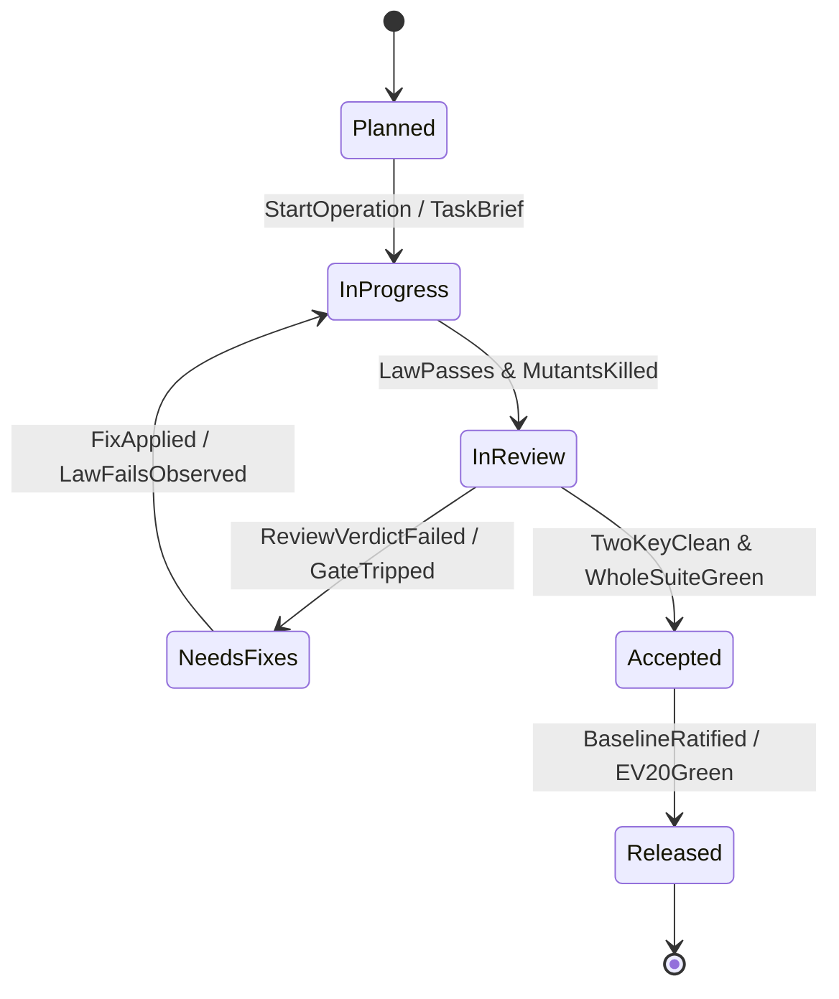
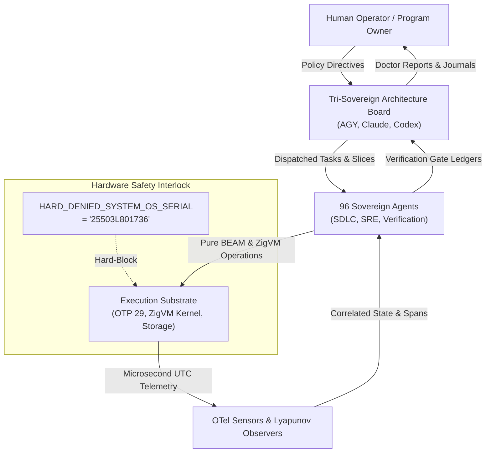

# 20260906-1300-uos-sdlc-sre-verification-process-specification.md — UOS Algebraic Fractal SDLC, SRE & Verification Formal Specification

- **Specification ID**: `SPEC-SDLC-SRE-001`
- **Contract**: `SC-SDLC-SRE-001` ([`sdlc-sre-verification-process-contract.md`](file:///home/an/NAS-setup/uos/contracts/rules/sdlc-sre-verification-process-contract.md))
- **Status**: RATIFIED & ACTIVE
- **Timestamp**: `20260906-1300-`
- **Authority**: Tri-Sovereign Architecture Board (AGY / Google DeepMind, Anthropic Claude, OpenAI Codex)
- **Tailscale Web Cockpit**: [http://nas-1.tail55d152.ts.net:4100/checklist](http://nas-1.tail55d152.ts.net:4100/checklist)
- **Tags**: `#design-spec`, `#sdlc`, `#sre`, `#verification`, `#fractal-l0`, `#fractal-l4`, `#rocha-semiotics`, `#cybernetics`, `#km-triad`, `#zero-muda`
- **Bidirectional Links**:
  - Transcludes: `[[zk:20260906-1300-adr-028-algebraic-fractal-sdlc-sre-and-verification-process]]`, `[[wiki:20260906-1300-uos-sdlc-sre-verification-process-guide]]`
  - Transcluded By: `[[wiki:20260905-1801-uos-zk-km-corpus-index]]`

---

## Systematic prioritization update — 20260907-1559

SC-RISK-PRIORITY-001 now governs work selection and lifecycle reassessment.
Use [the self-contained UOS SOP](http://nas-1.tail55d152.ts.net:4100/files/contracts/rules/20260907-1559-risk-prioritization-sop.md)
and its local skill/Superpowers bindings before selecting or dispatching work.
Apply safety class and dependency readiness before the five-factor product.
Record through Sa-plan, claim the exact eligible task, and keep actual runtime enforcement
distinct from procedural compliance. Existing historical status statements are not fresh evidence.

## 1. Mathematical Formalization & Transition Systems

The UOS Software Development Life Cycle (SDLC) and Site Reliability Engineering (SRE) operational planes are formalized as a **Total Labelled Transition System (LTS)**:

$$\mathcal{M}_{\text{SDLC}} = \langle \mathcal{S}, \Sigma, \mathcal{T}, s_0, \mathcal{F} \rangle$$

Where:
- $\mathcal{S} = \{ \text{Planned}, \text{InProgress}, \text{InReview}, \text{NeedsFixes}, \text{Accepted}, \text{Released} \}$
- $\Sigma = \{ \text{StartOperation}, \text{LawFails}, \text{LawPasses}, \text{PlantMutants}, \text{KillMutants}, \text{ReviewVerdictClean}, \text{GateTripped}, \text{GateGreen} \}$
- $\mathcal{T} \subseteq \mathcal{S} \times \Sigma \times \mathcal{S}$ is the deterministically bounded transition relation.
- $s_0 = \text{Planned}$
- $\mathcal{F} = \{ \text{Accepted}, \text{Released} \}$

```text
+-----------------------------------------------------------------------------+
|                      SDLC STATE TRANSITION SYSTEM                           |
+-----------------------------------------------------------------------------+
|                                                                             |
|   [Planned] ---------> [InProgress] ---------> [InReview]                   |
|                           ^                       |                         |
|                           | (LawFails / GateRed)  v                         |
|                     [NeedsFixes] <------- [ReviewVerdictFailed]             |
|                           |                                                 |
|                           v (GateGreen & TwoKeyClean)                       |
|                      [Accepted] ---------> [Released]                       |
|                                                                             |
+-----------------------------------------------------------------------------+
```



---

## 2. Quantitative Verification Metrics

### 2.1 Mutation Adequacy Score ($M_s$)

The Mutation Adequacy Score evaluates the ability of the test suite to detect semantic anomalies:

$$M_s = \begin{cases} 
100.0\% & \text{if } T - E = 0 \\
\frac{K}{T - E} \times 100\% & \text{otherwise}
\end{cases}$$

Where:
- $T$: Total mutants planted ($\ge 2$ per slice).
- $K$: Mutants killed by a failing test law (turning gate RED).
- $E$: Equivalent mutants (formally proved to possess identical denotational semantics).

**Enforcement Boundary**: $M_s \ge 90.0\%$ for all admitted production subsystems.

### 2.2 Three-Valued Parity Semilattice

Parity evaluation against external reference oracles adheres to the bounded semilattice $(\mathcal{P}, \sqsubseteq)$:

$$\text{UNTESTED} \sqsubset \text{EQUIV} \sqsubset \text{EQ}$$

Where:
- $\text{UNTESTED} \sqcup \text{EQUIV} = \text{EQUIV}$
- $\text{EQUIV} \sqcup \text{EQ} = \text{EQ}$
- Lowering parity (e.g. $\text{EQ} \to \text{UNTESTED}$) is strictly forbidden by the ratchet invariant $\forall t_1 > t_0, \mathcal{P}(t_1) \sqsupseteq \mathcal{P}(t_0)$.

---

## 3. STPA Control Structure & Safety Interlocks

The safety and reliability envelope is modeled as a closed-loop socio-technical control system:

```text
===============================================================================
                    STPA CLOSED-LOOP CONTROL STRUCTURE
===============================================================================

               +----------------------------------------+
               |  Human Operator & Sovereign Consensus  |
               +----------------------------------------+
                               |              ^
                    Policy / CA-1             | Status Reports / CA-9
                               v              |
               +----------------------------------------+
               |   Tri-Sovereign Architecture Board     |
               |       (AGY / Claude / Codex)           |
               +----------------------------------------+
                               |              ^
                    Tasks / Slices            | EUnit / Gate Telemetry
                               v              |
               +----------------------------------------+
               |   C3I SDLC / SRE / Verification Swarm  |
               |              (96 Agents)               |
               +----------------------------------------+
                               |              ^
                    Actuations / Code         | State Observations
                               v              |
               +----------------------------------------+
               |  Execution Substrate & Hardware Mesh   |
               |   (BEAM OTP 29, ZigVM, Ceph NVMe)      |
               +----------------------------------------+
===============================================================================
```



### 3.1 Unconditional Storage Safety Constraint
```rust
// ops/kubernetes/nas-k8s-lab/src/spec.rs:192
pub const HARD_DENIED_SYSTEM_OS_SERIAL: &str = "25503L801736";
```
Any operation attempting to format, allocate, or mount `/dev/disk/by-id/*` containing serial `25503L801736` must fail closed with an unbypassable hard denial. In the Gleam API plane:
```gleam
pub fn evaluate_hardware_safety(serial: String) -> StpaInterlockStatus {
  case serial == "25503L801736" {
    True -> StpaInterlockBlocked
    False -> StpaInterlockAllowed
  }
}
```

---

## 4. Gleam Engine Data Types & Signatures

From [`apps/cepaf_gleam/src/cepaf_gleam/sdlc/sdlc_sre_process_engine.gleam`](file:///home/an/NAS-setup/uos/apps/cepaf_gleam/src/cepaf_gleam/sdlc/sdlc_sre_process_engine.gleam):

```gleam
pub type LifecycleTier {
  OperationLoop
  TaskLoop
  SliceLoop
  EpochLoop
  PinLoop
}

pub type AlgebraicStep {
  StepSemanticDomain
  StepOperations
  StepObservations
  StepOracle
  StepFinalEncoding
  StepHomomorphismLaws
  StepMutants
  StepDocs
  StepEvidence
}

pub type StpaLoss {
  L1FalseConformance
  L2SilentRegression
  L3EvidenceContamination
  L4LargeScaleWastedEffort
  L5BoundaryAndPurityLoss
}

pub type StpaHazard {
  H1GateReportsGreenWithDefect
  H2ThresholdWeakenedOrBypassed
  H3EvidenceStoreDivergesFromReality
  H4HardwareStorageInterlockBypassed
  H5UncontrolledMemoryOrReductionGrowth
}

pub type MutantResult {
  MutantKilled
  MutantSurvived
  MutantEquivalent
}

pub type ParityStatus {
  ParityEq
  ParityEquiv(rationale: String)
  ParityUntested(reason: String)
}
```

---

## 5. Verification Gate Integration

The specification is enforced across all five verification surfaces:
1. **Compiler**: `gleam check` and `mix compile` (0 warnings, 0 dead code).
2. **EUnit Test**: `sdlc_sre_process_engine_test.gleam` (6/6 tests passing in 0.050s).
3. **Whole-System Test Protocol**: 10,057 passed, 0 failures.
4. **Comprehensive Checklist**: `tools/uos checklist` (18/18 checks pass 100% green).
5. **System Doctor**: `tools/uos doctor` (20/20 EV-cycles operational).
