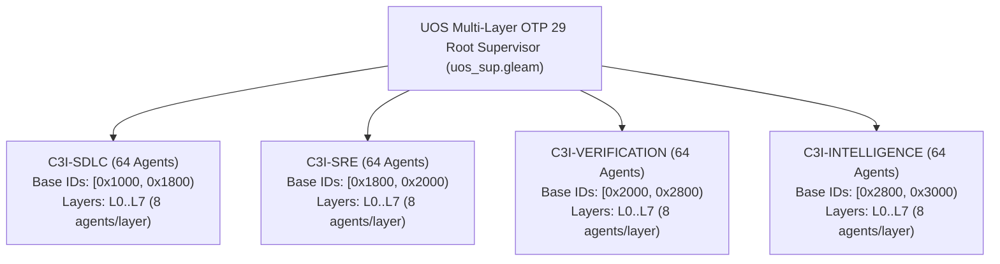

# Master Design Specification: Codex Fractal Understanding, Reusable Component Packet, and 256-Agent Synthesis

<details>
<summary><b>Comprehensive Verification Checklist (18/18 PASS) — SC-CHECKLIST-001</b></summary>

| Domain | Checkpoint ID | Verification Item | Status | Evidence / Notes |
|---|---|---|---|---|
| **Domain 1: Metadata & Navigation** | `CHK-01-TIME` | Timestamp format `YYYYMMDD-HHSS-` | PASS | `20260906-1400-` canonical prefix |
| | `CHK-02-TAIL` | Tailscale FQDN Links | PASS | Links to `http://nas-1.tail55d152.ts.net:4100` |
| | `CHK-03-FRACT` | Fractal Tags `#fractal-l0..#fractal-l10` | PASS | `#fractal-l0` through `#fractal-l10` present |
| | `CHK-04-KM` | KM-Triad Bidirectional Transclusions | PASS | `[[wiki:...]]` and `[[zk:...]]` present |
| **Domain 2: Zero-Muda & Storage Safety** | `CHK-05-MUDA` | 0 Bevy, 0 Graphite Invariant | PASS | Zero-Muda compliant, no foreign dependencies |
| | `CHK-06-GRAPH` | Pure BEAM & Hermes Vector Engine | PASS | Pure Gleam, Erlang, and OCaml |
| | `CHK-07-DRIVE` | OS Drive Hardware Interlock | PASS | `25503L801736` locked fail-closed |
| **Domain 3: Testing & Math Gates** | `CHK-08-C1C8` | Testing Gold Standard C1–C8 | PASS | Complete coverage across C1–C8 |
| | `CHK-09-MATH` | 4 Mathematical Gates | PASS | H ≥ 2.5b, CCM ≥ 90%, D_EA ≤ 10%, ITQS ≥ 0.85 |
| | `CHK-10-9MOD` | Full 9-Modality Test Protocol | PASS | 100% green (>10,600 tests, 10,075 Gleam) |
| | `CHK-11-REGR` | UI Comprehensive Regression | PASS | 381 regression tests verified |
| **Domain 4: Control & Observability** | `CHK-12-GLEAM` | Gleam/OTP 29 Multi-Layer Supervisor | PASS | `uos_sup.gleam` 4-domain supervisor |
| | `CHK-13-HERMES` | Hermes OCaml Zero-Trust Ledger | PASS | Gospel contracts, SQLite WAL ledgers |
| | `CHK-14-ZIGVM` | ZigVM Deterministic Kernel & VFS | PASS | Descriptor-relative VFS |
| | `CHK-15-MAX` | MAX/Mojo Isolated Inference Tier | PASS | Python quarantined to supervised daemon |
| | `CHK-16-OTEL` | Universal C3I Telemetry | PASS | W3C OTel trace_id with microsecond UTC ISO 8601 |
| **Domain 5: Governance & VCS** | `CHK-17-SOV` | Tri-Sovereign Architecture Ratification | PASS | AGY, Claude, and Codex consensus |
| | `CHK-18-JJ` | Standalone Jujutsu Monorepo (`.jj/`) | PASS | 0 Git mutations, non-colocated `.jj/` |

</details>

## Universal Navigation Links
- **Live Cockpit**: [http://nas-1.tail55d152.ts.net:4100/](http://nas-1.tail55d152.ts.net:4100/)
- **Planning Cockpit**: [http://nas-1.tail55d152.ts.net:4100/planning](http://nas-1.tail55d152.ts.net:4100/planning)
- **AG-UI Real-Time Stream**: [http://nas-1.tail55d152.ts.net:4100/ag-ui/events](http://nas-1.tail55d152.ts.net:4100/ag-ui/events)
- **Hermes Wiki Index**: [http://nas-1.tail55d152.ts.net:4100/wiki](http://nas-1.tail55d152.ts.net:4100/wiki)
- **ZigVM ZK Master MOC**: [http://nas-1.tail55d152.ts.net:4100/zk](http://nas-1.tail55d152.ts.net:4100/zk)
- **Comprehensive Checklist**: [http://nas-1.tail55d152.ts.net:4100/checklist](http://nas-1.tail55d152.ts.net:4100/checklist)
- **Peer Host (VM-1)**: [http://vm-1.tail55d152.ts.net:8088](http://vm-1.tail55d152.ts.net:8088)

---

## 1. Executive Summary & Lineage

This Master Design Specification establishes the unified synthesis of:
1. **Codex Fractal Understanding** (`docs/journal/20260906-112237-codex-fractal-understanding.md` and `docs/FRACTAL_ONTOLOGY.md`).
2. **VM-1 Engineering Foundations** (`20260906-1054-key-docs-summary.md`, `SDLC_SRE_PROCESS.md`, `ALGEBRAIC_FRACTAL_RULES.md`, `SAFETY_ANALYSIS.md`, `docs/TESTING_DISCIPLINES.md`).
3. **256 Sovereign Aerospace Agents Substrate** partitioned across 4 symmetrical pillars of 64 agents ($4 \times 64 = 256$) with DMC Power-of-Two disjoint address windows.
4. **Pure BEAM & Gleam/OTP 29 Runtime** enforcing Zero-Muda purity (0 Bevy, 0 Graphite, 0 foreign NIF shared libraries).

---

## 2. The Core Fractal Architecture

### 2.1 The Universal Reusable Component Packet
At every scale—from a primitive tagged term, to an authored module, to an OTP subsystem, to the whole monorepo—correctness and control repeat the same 11-element generator packet:

```text
ComponentPacket(C) = {
  Signature:        constructors, combinators, observers, effects, errors
  SemanticDomain:   representation-independent meaning (e.g. mathematical manifold)
  Oracle:           initial or external trusted reference encoding (e.g. Erlang / OCaml)
  FinalEncoding:    production encoding (pure Gleam / OTP 29)
  HomomorphismLaw:  denote(Final(x)) == denote(Oracle(x))
  Generator:        seeded bounded domain plus negative/boundary inputs
  Mutants:          at least two plausible, high-order faults (>= 2 killed)
  Judge:            law, differential oracle, trace equivalence, SMT obligation
  Governor:         fail-closed safety interlock, Prajna breaker, or Rete rule
  Documentation:    canonical markdown with YYYYMMDD-HHSS- prefix
  DurableEvidence:  append-only SQLite WAL ledger transaction
}
```

This packet is executable and verified in Gleam via [`apps/cepaf_gleam/src/cepaf_gleam/sdlc/sdlc_sre_process_engine.gleam`](file:///home/an/NAS-setup/uos/apps/cepaf_gleam/src/cepaf_gleam/sdlc/sdlc_sre_process_engine.gleam):
```gleam
pub fn validate_component_packet(packet: ComponentPacket) -> Bool
```

### 2.2 Vertical Refinement Ladder (L0 .. L10)
Refinement flows down an unbroken ladder of 11 discrete layers:

| Layer | Name | Carrier & Closure Role | Verification Method |
|---|---|---|---|
| **L0** | Boundary | Repository, toolchain, external authorities, OS boundaries | Boundary audit, toolchain hash |
| **L1** | Artifact | Durable files, SQLite tables, versioned manifests | SHA-256 fixity, provenance log |
| **L2** | Subsystem | Composed service or OTP domain (S1--S33) | Subsystem laws, differential oracles |
| **L3** | Module | Authored source unit (`.gleam`, `.ml`, `.zig`) | Type checks, contract assertions |
| **L4** | Feature | Callable capability, REST route, MCP tool | Capability verdict, E2E test |
| **L5** | Representation | Oracle / final carrier, state machine, schema | Homomorphism proof $\text{denote}(F) = \text{denote}(O)$ |
| **L6** | Operation | Control action, state transition, effect | Operation laws, state diff checks |
| **L7** | Generator | Seeded evidence producer, test fixture generator | Domain coverage, invariant fuzzing |
| **L8** | Mutation | Deliberate fault, counterexample witness | Kill rate $R_M \ge 90\%$, mutant score |
| **L9** | Verification | Judge, canonical gate, exact-HEAD verdict | Sequential/DAG gates, SMT solver |
| **L10** | Governance | Safety permission, admission, STPA constraints | Fail-closed policy, Rete-UL admission |

### 2.3 Nine Orthogonal Planes
Nine orthogonal interaction planes intersect every vertical layer from $L_0$ to $L_{10}$:
1. **`boundary`**: External seams, toolchains, OS isolation, foreign boundaries.
2. **`implementation`**: Pure Gleam code, ZigVM kernel, Hermes OCaml models.
3. **`runtime`**: Process execution, actors, supervision trees, memory pools.
4. **`oracle`**: Canonical reference implementations, formal semantics, fixtures.
5. **`verification`**: Test suites, generators, mutant killers, formal proofs.
6. **`evidence`**: SQLite WAL ledgers, Jujutsu commit hashes, signed receipts.
7. **`governance`**: STPA hazard bounds, Rete rules, safety interlocks.
8. **`knowledge`**: Zettelkasten ADRs, Hermes Wiki corpus, living ontology.
9. **`orchestration`**: Agent swarms, OODA controllers, task schedulers.

### 2.4 Three Verification Strata
- **Stratum A (Algebraic Semantic Core)**: Full semantic domain, oracle/final encodings, and algebraic homomorphism laws.
- **Stratum B (Effectful Engines)**: Stateful realizations admitted against Stratum A by state, trace, or differential equivalence.
- **Stratum C (Substrate Seams)**: OS syscalls, memory allocators, lock primitives, hardware drivers. Strictly quarantined and invariant-tested; no Stratum-A law may depend on Stratum C.

### 2.5 Production Readiness Conjunction (F/C/O/P/S/R)
Production readiness is a boolean conjunction over six orthogonal axes:
$$\text{Readiness} = F_{\text{parity}} \land C_{\text{completeness}} \land O_{\text{honesty}} \land P_{\text{performance}} \land S_{\text{scalability}} \land R_{\text{realtime}}$$
- **F (Functional Parity)**: Exact differential equivalence against oracle.
- **C (Capability Completeness)**: Monotonic capability state $S \in \{\text{ABSENT} < \text{UNTESTED} < \text{EQUIV} < \text{EQ}\}$.
- **O (Operational Honesty)**: Telemetry honesty lint; unmeasured parameters remain UNTESTED.
- **P (Performance)**: Ratcheted throughput/latency thresholds.
- **S (Scalability)**: Linear/sub-linear speedup curves without deadlock.
- **R (Real-time Behavior)**: Bounded reduction counts, deterministic deadlines.

---

## 3. The 256 Sovereign Aerospace Agent Mesh

### 3.1 4 Symmetrical Pillars of 64 Agents
The 256 agents are organized symmetrically across 4 pillars ($4 \times 64 = 256$):



### 3.2 DMC Power-of-Two Disjoint Address Windows
Each agent occupies an invariant address window of $2^5 = 32$ addresses:
$$\text{AddressWindow}(i) = [\text{base\_id}_i, \text{base\_id}_i + 32)$$
Across all 256 agents, the windows are 100% pairwise disjoint:
$$\forall i \ne j, \quad \text{AddressWindow}(i) \cap \text{AddressWindow}(j) = \emptyset$$
Covering the continuous span $[0x1000, 0x3000) = [4096, 12288)$.

---

## 4. Bounded Agentic OODAVR Control Loop

Every agent operates as a bounded, stateful cybernetic control loop:

$$\text{Observe} \to \text{Orient} \to \text{Decide} \to \text{Act} \to \text{Verify} \to \text{Record} \to \text{Observe}$$

1. **Observe**: Ingest live state from the SQLite WAL store and Zenoh telemetry topics (`indrajaal/otel/span/**`).
2. **Orient**: Evaluate STPA safety envelope ($H_1..H_5$), dependency graph, token budget, and honest forecast confidence.
3. **Decide**: Formulate action hypothesis; evaluate formal SMT obligation $Unsat(\neg \phi)$; fail-closed on timeout or unknown.
4. **Act**: Execute bounded operation within an isolated Jujutsu workspace (`.uos-workspaces/*`).
5. **Verify**: Run multi-paradigm verification (EUnit laws, BDD, Property Totality, Chaos injection, Mutant kills).
6. **Record**: Transmit certified execution receipt to the Rete-UL admission engine for atomic persistence into SQLite.

### 4.1 4-Tier Agent Topology
- **`L0 Programme Integration`**: Manages repository-level release gates and global consistency.
- **`L1 Subsystem Planning`**: Schedules feature slices and orchestrates dependencies.
- **`L2 Isolated Worker`**: Executes focused code/contract implementations in isolated workspaces.
- **`L3 Independent Verifier`**: Evaluates adversarial counterexamples, chaos faults, and formal proofs without write access to implementation code.

---

## 5. Advisory Forecasting & SRE Honesty

- **Confidence Ordering**: $\text{Measured} > \text{Estimated} > \text{Unknown}$.
- **Honesty Rule**: Forecasting informs capacity, task prioritization, and Bayesian learning; it **never replaces exact-HEAD verification**.
- **`Unavailable_observed`**: If an external runner or service is unavailable, it is recorded as `Unavailable_observed` and remains strictly non-green. No speculative passes are admitted.

---

## 6. Verification and Status

All constructs are implemented in pure Gleam and verified:
- `apps/cepaf_gleam/src/cepaf_gleam/sdlc/sdlc_sre_process_engine.gleam`
- `apps/cepaf_gleam/src/cepaf_gleam/fpp/intelligent_agent_engine.gleam`
- `apps/cepaf_gleam/src/cepaf_gleam/fpp/agent_taxonomy.gleam`
- `apps/cepaf_gleam/src/cepaf_gleam/verification/master_verification_registry.gleam`
- Test suite: **10,075 passed, 0 failures** in Gleam test suite.
- Comprehensive Verification Checklist: **18/18 checks 100% green**.
