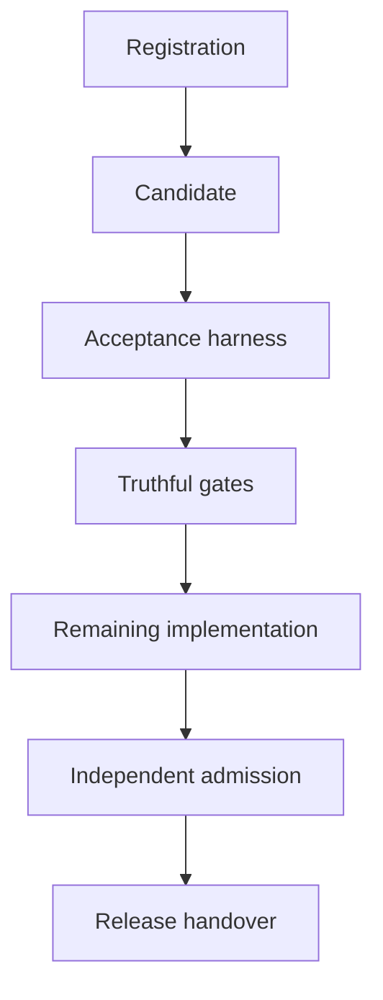

# UOS sa-plan execution implementation plan

> For agentic workers: use the executing-plans workflow inline by default. Track every task, job and workflow in sa-plan; obtain additional-agent authorization before delegation.

**Goal:** Execute the complete original implementation mission and close every reviewed gap with candidate-bound runtime and formal evidence.

**Architecture:** sa-plan owns task/job/workflow state. A typed Gleam execution boundary supervises bounded native workers; immutable source and acceptance manifests connect specifications to actual receipts. Existing detailed workstream plans remain the implementation specifications.

**Tech Stack:** Gleam/OTP, Lustre/Wisp, Hermes OCaml/Bos/Dune, bounded Rust/Zenoh, ZigVM, Lean/Gospel/Quint/Z3, real browser tooling, standalone Jujutsu.

**Spec:** [Original plan](http://nas-1.tail55d152.ts.net:4100/files/docs/design/20260906-0817-uos-full-implementation-plan.md) and [Codex review](http://nas-1.tail55d152.ts.net:4100/files/docs/journal/20260906-1620-codex-review-agy-forensic-reconciliation.md).

#fractal-l0 #fractal-l1 #fractal-l2 #fractal-l3 #fractal-l4 #fractal-l5 #fractal-l6 #fractal-l7 #fractal-l8 #fractal-l9 #zk-adr #km-triad #zero-muda #tailscale-web

[This plan](http://nas-1.tail55d152.ts.net:4100/files/docs/design/20260906-1655-uos-sa-plan-execution-plan.md) | [All work items](http://nas-1.tail55d152.ts.net:4100/files/docs/design/20260906-1655-uos-sa-plan-work-items.md) | [Manifest](http://nas-1.tail55d152.ts.net:4100/files/governance/planning/20260906-1655-uos-sa-plan-execution-manifest.json) | [Registration receipt](http://nas-1.tail55d152.ts.net:4100/files/governance/sources/20260906-1655-uos-sa-plan-registration-receipt.json) | [Planning cockpit](http://nas-1.tail55d152.ts.net:4100/planning)

## Execution inventory and authority

The new programme contains 71 tasks: 60 original backlog tasks, 10 additional implementation tasks, and PLAN00 for this planning/registration work. It has one job per task and 13 local durable workflows (programme plus 12 workstreams). Only PLAN00 can be completed by this planning task; all 70 implementation items remain unrun.

The existing OCaml-to-Gleam plan remains authoritative for its 75 tasks, 74 jobs and one open workflow. It is linked without duplicating or resetting any task, attempt, result or history. P03 federates it; P01 enforces its completion receipts before E07 closes. Across the two stores, the tracked scope is 146 task records, 145 jobs and 14 workflows; these are management records, not passing tests.

Plan ID: `uos/full-implementation/20260906-1655`. Canonical database: `/home/an/NAS-setup/uos/var/sa-plan/uos.sqlite3` (ignored runtime state, never committed or copied). The source manifest is immutable; status is read from sa-plan. Native workflow `running` means an open history, not a running agent. Native Temporal-style history does not imply a Temporal service, timers, signals or workers.

## Global constraints

- Preserve every original OCaml source/test/fixture/Dune file byte-for-byte; external source trees are read-only evidence. No source ingestion before quiescence, exact revision, sanitized manifest, license and two-key checks.
- Use standalone Jujutsu and isolated workspaces; serialize integration. Do not alter other agents' ownership or live stores.
- Gleam owns supervision, intent, authorization and effects; Hermes owns bounded analysis/oracles; Zig owns deterministic runtime; Python stays in MAX.
- Preserve the protected OS serial and zero Bevy/Graphite constraint. No destructive storage test.
- Use 1,200-second outer command limits and short progress polling. Retain stricter per-query solver budgets, explicit process-tree cleanup and known satisfiable controls.
- Every new document has an observed YYYYMMDD-HHSS prefix, Tailnet links, fractal tags and truthful 18-checkpoint component. All explanatory diagrams have matching ASCII and Mermaid forms.
- No fixed PASS strings, synthetic hashes, invented reviewer approvals or unmeasured quality metrics confer admission.
- Keep 35 original requirements, all nine reviewed findings, all 75 linked legacy tasks, and the full versioned FPP/SysML/Zenoh and route/component census in scope.
- Register every newly discovered execution leaf and retry as sa-plan task/job/workflow activity before acting. Record pending reasons rather than dropping unsupported cases.

## Workstreams

| ID | Workstream | Tasks |
|---|---|---|
| E | [Evidence, provenance and test migration](http://nas-1.tail55d152.ts.net:4100/files/docs/design/20260906-0817-uos-implementation-01-evidence-and-migration.md) | E01, E02, E03, E04, E05, E06, E07, E08 |
| M | [Denotation, DMC/TCM and algebraic atlas](http://nas-1.tail55d152.ts.net:4100/files/docs/design/20260906-0817-uos-implementation-02-semantics-and-atlas.md) | M01, M02, M03, M04, M05, M06, M07, M08 |
| A | [FPP, SysML and actor ecology](http://nas-1.tail55d152.ts.net:4100/files/docs/design/20260906-0817-uos-implementation-03-models-and-actors.md) | A01, A02, A03, A04, A05, A06, A07, A08, A09, A10 |
| Z | [Complete Zenoh native layer and communication migration](http://nas-1.tail55d152.ts.net:4100/files/docs/design/20260906-0817-uos-implementation-04-zenoh-native-and-ecosystem.md) | Z01, Z02, Z03, Z04, Z05, Z06, Z07, Z08, Z09, Z10, Z11, Z12 |
| W | [Web, wiki, Zettelkasten and knowledge experience](http://nas-1.tail55d152.ts.net:4100/files/docs/design/20260906-0817-uos-implementation-05-web-and-knowledge.md) | W01, W02, W03, W04, W05, W06, W07, W08, W09 |
| V | [Browser, formal, property, fuzz and system verification](http://nas-1.tail55d152.ts.net:4100/files/docs/design/20260906-0817-uos-implementation-06-verification-and-experience.md) | V01, V02, V03, V04, V05, V06, V07 |
| H | [Skills, AGY/Codex health and developer experience](http://nas-1.tail55d152.ts.net:4100/files/docs/design/20260906-0817-uos-implementation-07-skills-agents-and-dx.md) | H01, H02, H03 |
| R | [Release, rollback, evidence and admission](http://nas-1.tail55d152.ts.net:4100/files/docs/design/20260906-0817-uos-implementation-08-release-and-admission.md) | R01, R02, R03 |
| P | [sa-plan control and linked execution](http://nas-1.tail55d152.ts.net:4100/files/docs/design/20260906-1655-uos-sa-plan-work-items.md) | PLAN00, P01, P02, P03, P04 |
| K | [Real knowledge runtime and oracle execution](http://nas-1.tail55d152.ts.net:4100/files/docs/design/20260906-1655-uos-sa-plan-work-items.md) | K01, K02, K03 |
| Q | [Compiler and production-test corrections](http://nas-1.tail55d152.ts.net:4100/files/docs/design/20260906-1655-uos-sa-plan-work-items.md) | Q01, Q02 |
| N | [Peer service recovery](http://nas-1.tail55d152.ts.net:4100/files/docs/design/20260906-1655-uos-sa-plan-work-items.md) | N01 |

## Ordered execution

PLAN00 registers and verifies this programme. E01 is the first implementation task. E02 establishes the acceptance harness; E03 replaces false verification. Subsequent task eligibility comes from the complete dependency graph, not workstream names or apparent agent availability. Execution is inline by default.

```text
[PLAN00 Registration] --> [E01 Candidate]
[E01 Candidate] --> [E02 Acceptance harness]
[E02 Acceptance harness] --> [E03 Truthful gates]
[E03 Truthful gates] --> [DAG Remaining implementation]
[DAG Remaining implementation] --> [R02 Independent admission]
[R02 Independent admission] --> [R03 Release handover]
```



The diagrams summarize the path; the exact task-level DAG below is authoritative. They do not impose a calendar promise or imply that a full language implementation is a short task.

| Eligibility wave | Tasks |
|---|---|
| 1 | PLAN00 |
| 2 | E01 |
| 3 | E02 |
| 4 | E03, E04, Q01, N01 |
| 5 | E05, E08, M01, P02, Q02 |
| 6 | M02, A01, A07, Z01, W01, H01, P03 |
| 7 | E06, M03, A04, Z02, H02 |
| 8 | M04, W02 |
| 9 | M05, M06, V01 |
| 10 | M07, A02, A08, Z03, W03, P01, K01 |
| 11 | E07, M08, A03, A05, Z04, W04, K03 |
| 12 | A06, A09, Z05, W05, H03 |
| 13 | Z06, W06, K02 |
| 14 | Z07, W07 |
| 15 | Z08 |
| 16 | Z09 |
| 17 | Z10 |
| 18 | Z11, V04, V05 |
| 19 | Z12 |
| 20 | A10, W08, P04 |
| 21 | W09 |
| 22 | V02, V03, V06 |
| 23 | V07 |
| 24 | R01 |
| 25 | R02 |
| 26 | R03 |

## Task, job and workflow protocol

Each task has a versioned fixture, exact file targets and an acceptance gate in the work-item document. Its job carries the task ID, dependencies, workflow, manifest digest and command ceiling. Jobs are registered on a dedicated reserved queue with dispatch disabled until P01 proves dependency and lease handling. This is deliberate scheduling state, not a claim of execution.

1. Read source contract and candidate; classify current evidence.
2. Claim task and job with current ownership; evaluate local and linked-plan dependencies.
3. Record actual failing regression or bounded acceptance baseline.
4. Implement the smallest independently reviewable change in an isolated JJ workspace.
5. Build and execute required unit/system/BDD/property/fuzz/browser/formal checks.
6. Review candidate-bound observations independently; missing tools and unknown results are nonpassing.
7. Record receipt and journal activity, then complete job/task only when its acceptance gate is satisfied.

Use stable activity keys `{plan}/{task}/{candidate}/{stage}/{attempt}`. Stages are specification, red-test, implementation, verification, review and journal/admission; completion records actual results, never planned results. A replay of an already observed idempotent activity returns the same receipt. Changed candidate or payload requires a new attempt and renewed evidence. Solver UNKNOWN, skipped required tests, missing tools and stale receipts cannot complete a task.

A task may span several bounded commands. Use a 1,320-second initial lease for a single 1,200-second command plus cleanup and recording; renew ownership through the implemented fenced API before subsequent work. Current native task/job interfaces are not claimed to provide full end-to-end fencing: P01/M05 prove that behavior.

## Browser, models and native completeness

W01 must close the route/page/component/state manifest. V02 registers at least four semantic cycles for every page AND every component; profile/state expansions remain explicit. Each cycle observes behavior, compares it with intent/specification, applies a justified correction and re-verifies. Record keyboard/pointer actions, DOM/AST/accessibility state, links and anchors, screenshots, relevant video, network/console events, and timing. Repeating a smoke check four times does not close this requirement.

A01/A07/A08 and Z01/Z04/Z09/Z10 are full pinned standards/API parents. Their census produces explicit child tasks, jobs and workflows for every clause/feature, including exclusions and unsupported states. Parent acceptance stays open until that finite census is accounted for. Register extension graphs with source/version/parent mappings; never silently mutate the already registered graph or invent completion counts.

TDD specifies red/green development; BDD expresses observable journeys; unit/system/property/fuzz/mutation/fault/performance/formal tests each carry their own commands, seeds, oracles and evidence denominators. Mathematical validity does not alone certify look-and-feel or UX/CX. Include accessibility, human task outcomes and measured design criteria.

## Review findings and remaining obligations

| Finding | Owning tasks |
|---|---|
| F01 | E03, P01, P02, W04 |
| F02 | K01, K02, K03 |
| F03 | E03, M01, M04, M05, M07, M08, V05, V06 |
| F04 | E01, E08, R02, R03 |
| F05 | E01, R03 |
| F06 | Q01 |
| F07 | E04, E05, K02 |
| F08 | W01, V01, V02, V03, V04, V07 |
| F09 | Q02 |

E01/R03 reconcile the three-tier handover, actual warning counts, signatures, exact revisions and the outdated handover tag. H01/M05/R03 cover timestamp and document-link corrections. N01 covers VM-1:8088. Q02 fixes test-local storage-validator coverage. K01-K03 make claimed journal, worker and differential behavior real. P01-P04 close the planning integration gaps.

## Commands

Use the bound Store adapter for registration and selected-plan status; the existing CLI's generic `status`, `tree` and `sync` select its legacy InfraNodus plan.

```sh
cd /home/an/NAS-setup/uos
timeout 1200s ocaml tools/sa_plan_execution.ml status governance/planning/20260906-1655-uos-sa-plan-execution-manifest.json /home/an/NAS-setup/uos/var/sa-plan/uos.sqlite3

UOS_SA_PLAN_DB=/home/an/NAS-setup/uos/var/sa-plan/uos.sqlite3 tools/sa-plan --format json task list uos/full-implementation/20260906-1655
UOS_SA_PLAN_DB=/home/an/NAS-setup/uos/var/sa-plan/uos.sqlite3 tools/sa-plan --format json job list uos-full-implementation-20260906-1655-reserved
UOS_SA_PLAN_DB=/home/an/NAS-setup/uos/var/sa-plan/uos.sqlite3 tools/sa-plan --format json workflow history uos/full-implementation/20260906-1655/workflow
```

The adapter also supports `validate`, `register`, `selftest` and a narrowly scoped `complete-planning` operation. Registration does not start execution workers. The final receipt reports actual Store readback, replay checks, available tasks, attempts and completed planning-only work.

## Completion gate

R02 requires all implementation dependencies, linked-plan completion evidence, full finite standards/route/source census, actual browser and formal results, reviewed rollback and independent decisions for the same release candidate. R03 publishes accurate final documents and a new scoped tag after admission, preserving old tags as history. No calendar finish date is inferred from task count; estimates and resource envelopes are refined from actual leaf work and observed durations in sa-plan.

<details>
<summary>5-domain, 18-checkpoint planning checklist</summary>

| Domain | Checkpoint | State | Evidence / obligation |
|---|---|---|---|
| D1 | CHK-01-TIME | PLANNING_METADATA | Observed clock and hour/seconds filename |
| D1 | CHK-02-TAIL | PLANNING_METADATA | Tailnet links supplied; browser acceptance remains open |
| D1 | CHK-03-FRACT | PLANNING_METADATA | L0-L9 tags provided |
| D1 | CHK-04-KM | IMPLEMENTATION_UNRUN | Source and plan links; bidirectional KM verification is W06 |
| D2 | CHK-05-MUDA | IMPLEMENTATION_UNRUN | No new runtime dependencies; full census is E04 |
| D2 | CHK-06-GRAPH | IMPLEMENTATION_UNRUN | No foreign vector library added |
| D2 | CHK-07-DRIVE | IMPLEMENTATION_UNRUN | Physical storage untouched; Q02 verifies production path |
| D3 | CHK-08-C1C8 | IMPLEMENTATION_UNRUN | W/V tasks define browser obligations |
| D3 | CHK-09-MATH | IMPLEMENTATION_UNRUN | M/E/V tasks require actual metrics and proofs |
| D3 | CHK-10-9MOD | IMPLEMENTATION_UNRUN | Modality-specific receipts required |
| D3 | CHK-11-REGR | IMPLEMENTATION_UNRUN | Registration verification is not application regression credit |
| D4 | CHK-12-GLEAM | IMPLEMENTATION_UNRUN | P01/P04 own real supervision integration |
| D4 | CHK-13-HERMES | IMPLEMENTATION_UNRUN | K01/K03 own actual subprocess and oracle calls |
| D4 | CHK-14-ZIGVM | IMPLEMENTATION_UNRUN | Kernel/VFS verification stays explicit |
| D4 | CHK-15-MAX | IMPLEMENTATION_UNRUN | MAX remains isolated |
| D4 | CHK-16-OTEL | IMPLEMENTATION_UNRUN | E08/M04/P04 bind real traces |
| D5 | CHK-17-SOV | IMPLEMENTATION_UNRUN | No reviewer signature fabricated |
| D5 | CHK-18-JJ | PLANNING_METADATA | Standalone JJ; original OCaml unchanged |

</details>
