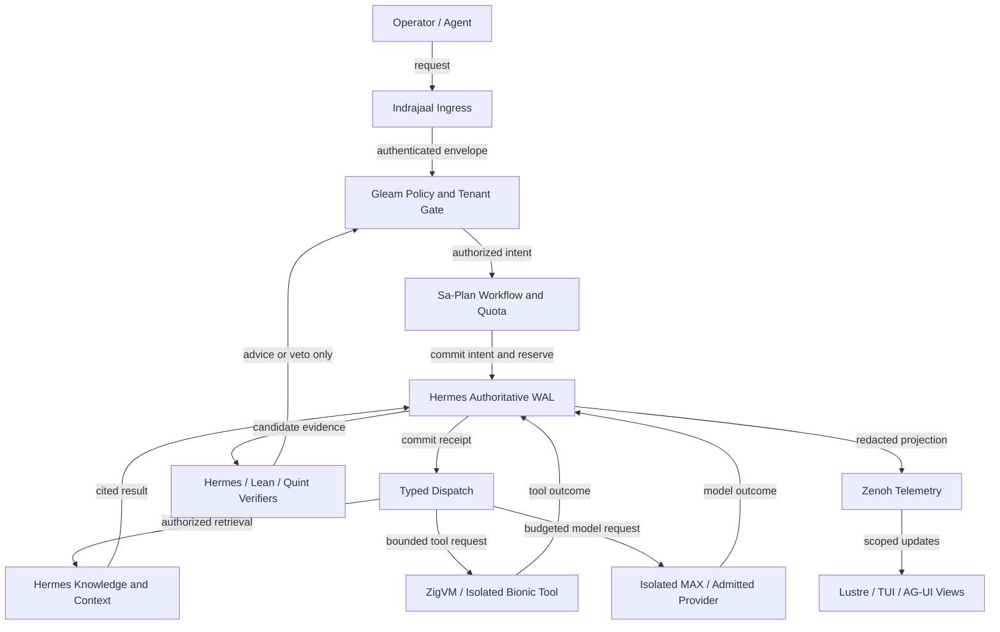
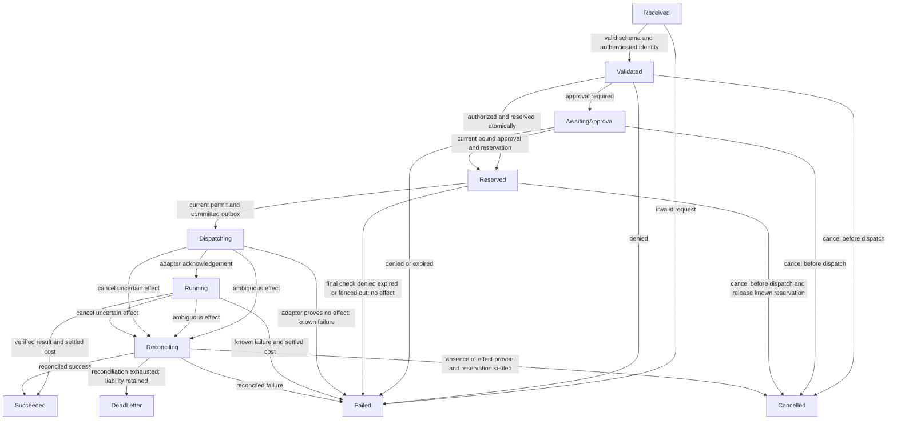

# UOS agentic infrastructure — formal implementation specification


[UOS Cockpit](http://nas-1.tail55d152.ts.net:4100/) / [Knowledge](http://nas-1.tail55d152.ts.net:4100/wiki) / [Agentic infrastructure](http://nas-1.tail55d152.ts.net:4100/docs/design/20260907-0550-uos-agentic-infrastructure-17-aspect-formal-spec.md)

**Command & Control:** [Cockpit](http://nas-1.tail55d152.ts.net:4100/) · [Planning](http://nas-1.tail55d152.ts.net:4100/planning) · [Events](http://nas-1.tail55d152.ts.net:4100/ag-ui/events)  
**Knowledge Base:** [Wiki](http://nas-1.tail55d152.ts.net:4100/wiki) · [ZK](http://nas-1.tail55d152.ts.net:4100/zk) · [Master MOC](http://nas-1.tail55d152.ts.net:4100/docs/zk/20260905-1801-moc-uos-unified-master.md)  
**Repository & Governance:** [Files](http://nas-1.tail55d152.ts.net:4100/files/) · [Checklist](http://nas-1.tail55d152.ts.net:4100/checklist) · [AGENTS.md](http://nas-1.tail55d152.ts.net:4100/files/AGENTS.md)  
**View:** [Rendered document](http://nas-1.tail55d152.ts.net:4100/docs/design/20260907-0550-uos-agentic-infrastructure-17-aspect-formal-spec.md) · [docs/design/20260907-0550-uos-agentic-infrastructure-17-aspect-formal-spec.md](http://nas-1.tail55d152.ts.net:4100/files/docs/design/20260907-0550-uos-agentic-infrastructure-17-aspect-formal-spec.md)

- **Specification:** `SPEC-UOS-AINF-001`, version 1.0.
- **Created:** `2026-09-07T05:54:50Z`; filename prefix `20260907-0550-` (UTC host clock).
- **Status:** **SPECIFIED / MAPPED; implementation UNRUN; NOT ADMITTED.**
- **Authority:** Operator request and canonical UOS `AGENTS.md`. This specification proposes implementation obligations; it does not ratify a runtime.
- **Machine-readable companion:** [docs/design/20260907-0550-uos-agentic-infrastructure-17-aspect-formal-spec.json](http://nas-1.tail55d152.ts.net:4100/files/docs/design/20260907-0550-uos-agentic-infrastructure-17-aspect-formal-spec.json).
- **Source review:** [C3I and Indrajaal review across all 17 aspects](http://nas-1.tail55d152.ts.net:4100/docs/reviews/20260907-0550-uos-c3i-indrajaal-17-aspect-infrastructure-source-review.md).
- **Knowledge links:** [Wiki](http://nas-1.tail55d152.ts.net:4100/docs/wiki/20260907-0550-uos-agentic-infrastructure-building-blocks.md) · [Decision record](http://nas-1.tail55d152.ts.net:4100/docs/zk/20260907-0550-adr-uos-agentic-infrastructure-native-building-blocks.md) · [Journal](http://nas-1.tail55d152.ts.net:4100/docs/journal/20260907-0550-uos-agentic-infrastructure-formal-spec-journal.md).
- **Transclusions:** [[wiki:20260907-0550-uos-agentic-infrastructure-building-blocks]] · [[zk:20260907-0550-adr-uos-agentic-infrastructure-native-building-blocks]].

Tags: #fractal-l0 #fractal-l1 #fractal-l2 #fractal-l3 #fractal-l4 #fractal-l5 #fractal-l6 #fractal-l7 #fractal-l8 #fractal-l9 #zk-adr #zero-muda #km-triad #agentic-infrastructure #checklist-nav

**On this page:** [Purpose](#1-purpose-and-status) · [Building blocks](#2-architecture-and-building-blocks) · [Service contracts](#3-service-contracts-and-acceptance-cases) · [Formal model](#4-formal-domain-and-interface-contracts) · [Lifecycle](#5-durable-lifecycle-and-effect-semantics) · [Invariants](#6-formal-invariants-and-proof-obligations) · [17 aspects](#7-the-canonical-17-aspect-implementation-method) · [Tenant isolation](#8-tenancy-context-and-routing-contracts) · [Verification](#9-verification-evaluation-and-admission) · [Operations](#10-operating-profile-and-recovery) · [Implementation sequence](#11-implementation-work-packages) · [Protocols](#12-protocol-and-design-decisions) · [Completion](#13-definition-of-done).

## 1. Purpose and status

Build a production-capable agent infrastructure by composing UOS's existing
control, execution, evidence and presentation systems. The requested enterprise
capabilities become **21 UOS services**, governed by **18 shared invariants**,
**63 service acceptance cases**, and **357 service × aspect obligations**.
Service means a typed capability with an owner and contract; it does not require
a separate container, database, vendor or independently deployed microservice.

The implementation SHALL use Gleam/OTP for state machines, authorization,
supervision, scheduling and agents; Hermes OCaml for evidence, graph analysis,
contracts and bounded independent verification; ZigVM for deterministic execution;
and the existing isolated MAX/Mojo boundary for inference. Existing bounded
native adapters remain subject to their ABI and scheduler-safety contracts.
New vendor runtimes are not selected by this specification.

The deliverable at this revision is the specification, traceability manifest and
source review. All acceptance and proof results start **UNRUN**. A document,
source file, registry entry, simulated result, historical journal or green badge
does not establish production readiness. HTTP success, semantic task success
and system admission are separate typed outcomes.

**Source basis.** The observed UOS change is
`uxwmloqmzronsqxryuqmwmvnrsvykvzr`, observed commit
`2c05b003b57763acd354f9d361a8959436a00de1`, with pre-existing working-copy changes.
The companion pins 80 selected canonical source/reference files by SHA-256.
These bind the review, not an admitted implementation candidate. Source inventory
is separate from runtime evidence. The local external C3I tree is a dirty,
unquiesced read-only reference; no new source ingestion is performed.

Selected read-only inspection also reached live VM-1 at C3I revision
`0683c0f8c5fe4bcbd65011662596638855147729`, distinct from local reference
`47f9322329fcda2fdbd7061988f586c65db00d17`. The source review records the scope;
neither external tree is treated as a newly admitted snapshot.

**Acceptance authority.** SHALL and MUST are mandatory implementation conditions.
Proposed operational limits are initial values to measure and ratify. There is
no blanket claim of sub-millisecond policy evaluation, sub-200 ms sandbox startup,
unlimited scaling, perfect hallucination detection or tamper-proof storage.

## 2. Architecture and building blocks

Indrajaal remains the HTTP/document edge and holon presentation/runtime vocabulary;
`cepaf_gleam` remains the domain and control core. Reuse the existing path
dependency from `indrajaal_gleam_web` to `cepaf_gleam`. UOS's established
four-domain supervisor is the integration root. Add real children and probes
within that topology rather than creating a second competing control plane.

| Domain / owner | Infrastructure responsibilities | Durable authority and isolation |
|---|---|---|
| Apps / Indrajaal + cepaf | Authenticated Web/API ingress, approvals, tenant views, TUI projections | Views project authorized state; no independent approval or budget truth |
| Services / Gleam OTP | IAM/Vault leases, MCP adapters, model gateway, sandbox and provider leases | External calls in bounded supervised ports/daemons; credentials injected at the boundary |
| Intelligence / Gleam OTP | Context assembly, capability selection, agent handoffs, loop controls | Tenant/subject-scoped actors; knowledge and model outputs are proposals |
| Engines / Hermes + ZigVM | Sa-Plan/WAL persistence, oracles, graph/retrieval kernels, deterministic programs | Hermes owns authoritative persistence; ZigVM owns deterministic kernel/VFS |
| Native bounded kernels | Existing audited crypto/transport/dispatch facades where required | Explicit ABI, bounded nonblocking calls; blocking work stays isolated |

### AINF-DIAGRAM-01 — Request, control and evidence flow

ASCII source:

```text
[Operator / Agent] --request--> [Indrajaal Ingress]
[Indrajaal Ingress] --authenticated envelope--> [Gleam Policy and Tenant Gate]
[Gleam Policy and Tenant Gate] --authorized intent--> [Sa-Plan Workflow and Quota]
[Sa-Plan Workflow and Quota] --commit intent and reserve--> [Hermes Authoritative WAL]
[Hermes Authoritative WAL] --commit receipt--> [Typed Dispatch]
[Typed Dispatch] --authorized retrieval--> [Hermes Knowledge and Context]
[Typed Dispatch] --bounded tool request--> [ZigVM / Isolated Bionic Tool]
[Typed Dispatch] --budgeted model request--> [Isolated MAX / Admitted Provider]
[Hermes Knowledge and Context] --cited result--> [Hermes Authoritative WAL]
[ZigVM / Isolated Bionic Tool] --tool outcome--> [Hermes Authoritative WAL]
[Isolated MAX / Admitted Provider] --model outcome--> [Hermes Authoritative WAL]
[Hermes Authoritative WAL] --candidate evidence--> [Hermes / Lean / Quint Verifiers]
[Hermes / Lean / Quint Verifiers] --advice or veto only--> [Gleam Policy and Tenant Gate]
[Hermes Authoritative WAL] --redacted projection--> [Zenoh Telemetry]
[Zenoh Telemetry] --scoped updates--> [Lustre / TUI / AG-UI Views]
```

Mermaid source (the same nodes, edges and labels):




The commit receipt in this diagram is necessary but insufficient for dispatch:
the live gateway SHALL recheck identity, policy epoch, deadline, fencing and
any approval immediately before invoking the adapter. Every return path settles
known spend, persists the outcome and records the corresponding evidence.
Knowledge/model output can request a further step only through a new policy
evaluation and reservation. The diagram is a logical flow; it grants no direct
database-to-tool authority.

### Existing implementation gaps that determine the work

| Gap | Observed source behavior | Required implementation response |
|---|---|---|
| GAP-01 | `uos_sup.start_root_supervisor` starts a static supervisor without adding children | Wire actual domain/service actors and verify their live process tree |
| GAP-02 | `max_worker.py` formats `MAX_OUTPUT` text from the prompt | Replace placeholder inference with the admitted real backend and measured usage; report unavailable otherwise |
| GAP-03 | `generate_all_17_aspect_processes` contains literal `True` verdicts | Resolve scoped runtime/formal receipts at the exact candidate |
| GAP-04 | `sa_plan_temporal.ml` keeps an in-memory event list around an effect call | Persist transactional step history and handle the remote-success/local-crash ambiguity |
| GAP-05 | MCP server advertises `2024-11-05` | Pin and test supported versions explicitly; newer interoperability is not inherited |
| GAP-06 | Hermes wiki similarity exposes TF-IDF/cosine analysis | Reuse its deterministic retrieval oracle; implement separately versioned neural embeddings only through real MAX |
| GAP-07 | Indrajaal holon uses `id <> "-gen-1"` and generation equality; main prints an initialized value | Treat this as a pure model; add authenticated leases, expiry, durable epochs and supervised processes |
| GAP-08 | Reviewed Indrajaal AG-UI branch uses path-only routing and permissive CORS | Route new tenant APIs/streams through shared authenticated request handling and scoped subscription policy |
| GAP-09 | Imported C3I manifest keeps historical artifacts outside build/corpus authority | Reuse canonical adaptations; new external ingestion needs fresh quiescence, sanitization and two-key admission |

These are source-review findings, not exploit demonstrations. The accompanying
review identifies acceleration opportunities and source locators for all aspects.

Additional code-level gaps found during the C3I/Indrajaal review:

| Gap | Observed source behavior | Required implementation response |
|---|---|---|
| GAP-10 | `vfs_selfcheck.evaluate_law` returns literal `VfsLawPass` values | Execute the actual descriptor-level laws; a declarative catalog is not a runtime VFS witness |
| GAP-11 | Indrajaal file adapter strips prefixes without establishing descriptor containment in that normalizer | Require tenant allowlists, traversal rejection and race-resistant file access before private document serving |
| GAP-12 | Sample intent API checks the storage serial but not the caller and returns constant trace IDs | Reuse its typed shape only; add authenticated full policy decisions and real trace context |

## 3. Service contracts and acceptance cases

Each row's `AINF-Rnn` requirement is normative. The associated three
`AINF-Tnn-*` cases are required tests with real observations, including negative
controls. Each service implements **all** AINF-A01..AINF-A17 via direct behavior
or explicit dependency composition, not only its primary layer.

| Service | Requested infrastructure role | UOS owner / primary layer | Existing reuse candidates |
|---|---|---|---|
| AINF-S01 | Cryptographic workload IAM | WorkloadIdentityActor / L0 | [apps/cepaf_gleam/src/cepaf_gleam/iam/supervisor.gleam](http://nas-1.tail55d152.ts.net:4100/files/apps/cepaf_gleam/src/cepaf_gleam/iam/supervisor.gleam)<br>[apps/cepaf_gleam/src/cepaf_gleam/iam/jwks_cache_actor.gleam](http://nas-1.tail55d152.ts.net:4100/files/apps/cepaf_gleam/src/cepaf_gleam/iam/jwks_cache_actor.gleam) |
| AINF-S02 | RBAC / ABAC / PBAC | PolicyDecisionActor / L0 | [apps/cepaf_gleam/src/cepaf_gleam/auth/rbac.gleam](http://nas-1.tail55d152.ts.net:4100/files/apps/cepaf_gleam/src/cepaf_gleam/auth/rbac.gleam)<br>[apps/cepaf_gleam/src/cepaf_gleam/rules/engine.gleam](http://nas-1.tail55d152.ts.net:4100/files/apps/cepaf_gleam/src/cepaf_gleam/rules/engine.gleam) |
| AINF-S03 | Principal propagation and delegated authorization | DelegationBrokerActor / L0 | [apps/cepaf_gleam/src/cepaf_gleam/auth/token_exchange.gleam](http://nas-1.tail55d152.ts.net:4100/files/apps/cepaf_gleam/src/cepaf_gleam/auth/token_exchange.gleam)<br>[apps/cepaf_gleam/src/cepaf_gleam/iam/sts_token_cache_actor.gleam](http://nas-1.tail55d152.ts.net:4100/files/apps/cepaf_gleam/src/cepaf_gleam/iam/sts_token_cache_actor.gleam) |
| AINF-S04 | Ephemeral secret and credential broker | CredentialLeaseActor / L0 | [apps/cepaf_gleam/src/cepaf_gleam/vault.gleam](http://nas-1.tail55d152.ts.net:4100/files/apps/cepaf_gleam/src/cepaf_gleam/vault.gleam)<br>[apps/cepaf_gleam/src/cepaf_gleam/vault_supervisor.gleam](http://nas-1.tail55d152.ts.net:4100/files/apps/cepaf_gleam/src/cepaf_gleam/vault_supervisor.gleam)<br>[engines/hermes/modules/hermes_dependability/dependability_credential.mli](http://nas-1.tail55d152.ts.net:4100/files/engines/hermes/modules/hermes_dependability/dependability_credential.mli) |
| AINF-S05 | Input, output and tool guardrails | GuardrailActor / L0 | [apps/cepaf_gleam/src/cepaf_gleam/vault_pii_scrub.gleam](http://nas-1.tail55d152.ts.net:4100/files/apps/cepaf_gleam/src/cepaf_gleam/vault_pii_scrub.gleam)<br>[engines/hermes/modules/system_engg/agent_dispatch_hook.ml](http://nas-1.tail55d152.ts.net:4100/files/engines/hermes/modules/system_engg/agent_dispatch_hook.ml) |
| AINF-S06 | Agent naming, registry and discovery | CapabilityRegistryActor / L2 | [apps/cepaf_gleam/src/cepaf_gleam/ontology/adk_c3i_master_ontology.gleam](http://nas-1.tail55d152.ts.net:4100/files/apps/cepaf_gleam/src/cepaf_gleam/ontology/adk_c3i_master_ontology.gleam)<br>[apps/uos_tui/src/uos_tui/swarm.gleam](http://nas-1.tail55d152.ts.net:4100/files/apps/uos_tui/src/uos_tui/swarm.gleam) |
| AINF-S07 | MCP and dynamic tool gateway | ToolGatewayActor / L2 | [apps/cepaf_gleam/src/cepaf_gleam/mcp/protocol.gleam](http://nas-1.tail55d152.ts.net:4100/files/apps/cepaf_gleam/src/cepaf_gleam/mcp/protocol.gleam)<br>[apps/cepaf_gleam/src/cepaf_gleam/mcp/server.gleam](http://nas-1.tail55d152.ts.net:4100/files/apps/cepaf_gleam/src/cepaf_gleam/mcp/server.gleam)<br>[apps/cepaf_gleam/src/cepaf_gleam/bridge/zenoh_mcp.gleam](http://nas-1.tail55d152.ts.net:4100/files/apps/cepaf_gleam/src/cepaf_gleam/bridge/zenoh_mcp.gleam) |
| AINF-S08 | Asynchronous agent messaging and event bus | TenantMailboxActor / L3 | [apps/cepaf_gleam/src/cepaf_gleam/bridge/zenoh_mcp.gleam](http://nas-1.tail55d152.ts.net:4100/files/apps/cepaf_gleam/src/cepaf_gleam/bridge/zenoh_mcp.gleam)<br>[apps/uos_tui/src/uos_tui/board.gleam](http://nas-1.tail55d152.ts.net:4100/files/apps/uos_tui/src/uos_tui/board.gleam) |
| AINF-S09 | Session state and scratchpads | SessionContextActor / L3 | [apps/cepaf_gleam/src/cepaf_gleam/substrate/beam_cache.gleam](http://nas-1.tail55d152.ts.net:4100/files/apps/cepaf_gleam/src/cepaf_gleam/substrate/beam_cache.gleam)<br>[apps/cepaf_gleam/src/cepaf_gleam/ha/context_cache.gleam](http://nas-1.tail55d152.ts.net:4100/files/apps/cepaf_gleam/src/cepaf_gleam/ha/context_cache.gleam) |
| AINF-S10 | Vector retrieval and long-term memory | RetrievalActor / L5 | [engines/hermes/modules/hermes_wiki/src/graph/wiki_similarity.ml](http://nas-1.tail55d152.ts.net:4100/files/engines/hermes/modules/hermes_wiki/src/graph/wiki_similarity.ml)<br>[apps/cepaf_gleam/src/cepaf_gleam/knowledge/c3i_knowledge_runtime.gleam](http://nas-1.tail55d152.ts.net:4100/files/apps/cepaf_gleam/src/cepaf_gleam/knowledge/c3i_knowledge_runtime.gleam) |
| AINF-S11 | Knowledge graph and ontology | KnowledgeGraphActor / L5 | [engines/hermes/modules/hermes_wiki/src/graph/wiki_graph.ml](http://nas-1.tail55d152.ts.net:4100/files/engines/hermes/modules/hermes_wiki/src/graph/wiki_graph.ml)<br>[apps/cepaf_gleam/src/cepaf_gleam/ontology/adk_c3i_master_ontology.gleam](http://nas-1.tail55d152.ts.net:4100/files/apps/cepaf_gleam/src/cepaf_gleam/ontology/adk_c3i_master_ontology.gleam) |
| AINF-S12 | Context routing, compaction and memory budget | ContextBudgetActor / L5 | [apps/cepaf_gleam/src/cepaf_gleam/ha/context_manager.gleam](http://nas-1.tail55d152.ts.net:4100/files/apps/cepaf_gleam/src/cepaf_gleam/ha/context_manager.gleam)<br>[apps/cepaf_gleam/src/cepaf_gleam/ha/token_budget.gleam](http://nas-1.tail55d152.ts.net:4100/files/apps/cepaf_gleam/src/cepaf_gleam/ha/token_budget.gleam)<br>[apps/cepaf_gleam/src/cepaf_gleam/ha/workflow_compactor.gleam](http://nas-1.tail55d152.ts.net:4100/files/apps/cepaf_gleam/src/cepaf_gleam/ha/workflow_compactor.gleam) |
| AINF-S13 | Isolated sandbox and bounded execution | SandboxLeaseActor / L4 | [apps/cepaf_gleam/src/cepaf_gleam/harness/hermes_bionic_bridge.gleam](http://nas-1.tail55d152.ts.net:4100/files/apps/cepaf_gleam/src/cepaf_gleam/harness/hermes_bionic_bridge.gleam)<br>[engines/hermes/modules/hermes_dependability/dependability_process.mli](http://nas-1.tail55d152.ts.net:4100/files/engines/hermes/modules/hermes_dependability/dependability_process.mli)<br>[engines/zigvm/build.zig](http://nas-1.tail55d152.ts.net:4100/files/engines/zigvm/build.zig) |
| AINF-S14 | Durable workflow and transaction orchestration | WorkflowLeaseActor / L3 | [apps/cepaf_gleam/src/cepaf_gleam/planning/sa_plan_bridge.gleam](http://nas-1.tail55d152.ts.net:4100/files/apps/cepaf_gleam/src/cepaf_gleam/planning/sa_plan_bridge.gleam)<br>[apps/cepaf_gleam/src/cepaf_gleam/sdlc/sa_plan_engine.gleam](http://nas-1.tail55d152.ts.net:4100/files/apps/cepaf_gleam/src/cepaf_gleam/sdlc/sa_plan_engine.gleam)<br>[engines/hermes/modules/sa_plan/sa_plan_store.ml](http://nas-1.tail55d152.ts.net:4100/files/engines/hermes/modules/sa_plan/sa_plan_store.ml)<br>[engines/hermes/modules/sa_plan/sa_plan_temporal.ml](http://nas-1.tail55d152.ts.net:4100/files/engines/hermes/modules/sa_plan/sa_plan_temporal.ml) |
| AINF-S15 | Human approval and escalation gateway | ApprovalQueueActor / L0 | [apps/cepaf_gleam/src/cepaf_gleam/fractal/l0_constitutional.gleam](http://nas-1.tail55d152.ts.net:4100/files/apps/cepaf_gleam/src/cepaf_gleam/fractal/l0_constitutional.gleam)<br>[engines/hermes/modules/sa_plan/guardian.ml](http://nas-1.tail55d152.ts.net:4100/files/engines/hermes/modules/sa_plan/guardian.ml)<br>[engines/hermes/modules/hermes_dependability/dependability_approval_crypto.ml](http://nas-1.tail55d152.ts.net:4100/files/engines/hermes/modules/hermes_dependability/dependability_approval_crypto.ml) |
| AINF-S16 | Circuit breakers, anti-loop controls and dead letters | LoopGuardActor / L4 | [apps/cepaf_gleam/src/cepaf_gleam/prajna/circuit_breaker.gleam](http://nas-1.tail55d152.ts.net:4100/files/apps/cepaf_gleam/src/cepaf_gleam/prajna/circuit_breaker.gleam)<br>[apps/cepaf_gleam/src/cepaf_gleam/ha/freshness_monitor.gleam](http://nas-1.tail55d152.ts.net:4100/files/apps/cepaf_gleam/src/cepaf_gleam/ha/freshness_monitor.gleam) |
| AINF-S17 | Model gateway, routing, failover and cache | ModelRouterActor / L5 | [apps/cepaf_gleam/src/cepaf_gleam/bridge/pi_provider.gleam](http://nas-1.tail55d152.ts.net:4100/files/apps/cepaf_gleam/src/cepaf_gleam/bridge/pi_provider.gleam)<br>[apps/cepaf_gleam/src/cepaf_gleam/ui/wisp/inference_api.gleam](http://nas-1.tail55d152.ts.net:4100/files/apps/cepaf_gleam/src/cepaf_gleam/ui/wisp/inference_api.gleam)<br>[services/inference/max/max_worker.py](http://nas-1.tail55d152.ts.net:4100/files/services/inference/max/max_worker.py) |
| AINF-S18 | Step-level tracing and semantic telemetry | TrajectoryTelemetryActor / L4 | [apps/cepaf_gleam/src/cepaf_gleam/ha/trace_context.gleam](http://nas-1.tail55d152.ts.net:4100/files/apps/cepaf_gleam/src/cepaf_gleam/ha/trace_context.gleam)<br>[apps/cepaf_gleam/src/cepaf_gleam/agui/sse.gleam](http://nas-1.tail55d152.ts.net:4100/files/apps/cepaf_gleam/src/cepaf_gleam/agui/sse.gleam)<br>[contracts/evidence/c3i_fractal_observability_spec.json](http://nas-1.tail55d152.ts.net:4100/files/contracts/evidence/c3i_fractal_observability_spec.json) |
| AINF-S19 | Cost, quota and budget enforcement | TenantQuotaActor / L3 | [apps/cepaf_gleam/src/cepaf_gleam/ha/token_budget.gleam](http://nas-1.tail55d152.ts.net:4100/files/apps/cepaf_gleam/src/cepaf_gleam/ha/token_budget.gleam)<br>[apps/uos_tui/src/uos_tui/coord.gleam](http://nas-1.tail55d152.ts.net:4100/files/apps/uos_tui/src/uos_tui/coord.gleam)<br>[engines/hermes/modules/sa_plan/sa_plan_store.ml](http://nas-1.tail55d152.ts.net:4100/files/engines/hermes/modules/sa_plan/sa_plan_store.ml) |
| AINF-S20 | Immutable audit and compliance evidence | EvidenceAppendActor / L3 | [engines/hermes/modules/hermes_harness/evidence_store.ml](http://nas-1.tail55d152.ts.net:4100/files/engines/hermes/modules/hermes_harness/evidence_store.ml)<br>[engines/hermes/modules/hermes_dependability/dependability_writer_lease.ml](http://nas-1.tail55d152.ts.net:4100/files/engines/hermes/modules/hermes_dependability/dependability_writer_lease.ml) |
| AINF-S21 | Continuous evaluation, regression and red teaming | EvaluationGateActor / L8 | [engines/hermes/modules/hermes_harness/test_parity_algebra.ml](http://nas-1.tail55d152.ts.net:4100/files/engines/hermes/modules/hermes_harness/test_parity_algebra.ml)<br>[engines/hermes/modules/hermes_harness/test_parity_compare.ml](http://nas-1.tail55d152.ts.net:4100/files/engines/hermes/modules/hermes_harness/test_parity_compare.ml)<br>[apps/cepaf_gleam/src/cepaf_gleam/testing/coverage_math.gleam](http://nas-1.tail55d152.ts.net:4100/files/apps/cepaf_gleam/src/cepaf_gleam/testing/coverage_math.gleam) |

### AINF-R01 — Cryptographic workload IAM

**Owner:** `WorkloadIdentityActor`. **Reference category:** SPIFFE / SPIRE. These examples do not add dependencies.

Validate workload certificate/JWT signature, issuer, audience, tenant binding, not-before, expiry, revocation epoch and proof of possession at every ingress. Rotate short-lived identities; fail closed on unknown trust roots. A SPIFFE-shaped identifier alone SHALL NOT authenticate a caller.

- **AINF-T01-1 [UNRUN]:** Accept an enrolled workload using the admitted trust bundle.
- **AINF-T01-2 [UNRUN]:** Reject forged, expired, wrong-audience and cross-tenant identities.
- **AINF-T01-3 [UNRUN]:** Rotate roots with a bounded overlap; reject a revoked identity before its former expiry.

### AINF-R02 — RBAC / ABAC / PBAC

**Owner:** `PolicyDecisionActor`. **Reference category:** OPA / Cedar / Styra. These examples do not add dependencies.

Compute effective permission as the intersection of initiating principal, workload, delegation chain, tenant policy, resource ACL and environmental restrictions. Explicit deny dominates; missing attributes, stale policies, evaluator errors and timeouts deny. Rete recommendations cannot grant authority.

- **AINF-T02-1 [UNRUN]:** Permit a registered read tool for an authorized tenant principal.
- **AINF-T02-2 [UNRUN]:** Deny when any grant is absent even if the workload has administrative privileges.
- **AINF-T02-3 [UNRUN]:** Revoke a policy while a request is queued; reject its stale authorization at dispatch.

### AINF-R03 — Principal propagation and delegated authorization

**Owner:** `DelegationBrokerActor`. **Reference category:** Arcade AI / OAuth OBO. These examples do not add dependencies.

Carry the initiating principal and ordered actor chain through every handoff. Issue audience-specific, short-lived down-scoped credentials through the existing IAM boundary; enforce maximum depth, expiry and revocation. Exchange source and upstream tokens remain opaque to models and ordinary logs.

- **AINF-T03-1 [UNRUN]:** Exchange to a narrower audience and scope for the same principal and tenant.
- **AINF-T03-2 [UNRUN]:** Reject cyclic chains, depth overflow, scope escalation and confused-deputy token reuse.
- **AINF-T03-3 [UNRUN]:** Revoke the root delegation and demonstrate invalidation of cached descendants.

### AINF-R04 — Ephemeral secret and credential broker

**Owner:** `CredentialLeaseActor`. **Reference category:** HashiCorp Vault / Secrets Manager. These examples do not add dependencies.

Issue opaque credential lease references bound to tenant, subject, tool, endpoint, request digest, epoch and expiry. Inject secret bytes only at the isolated adapter boundary, scrub inheritance and perform verified cleanup. No secret bytes, secret hashes, refresh tokens or private keys enter prompts, retained audit payloads or specification artifacts.

- **AINF-T04-1 [UNRUN]:** Obtain a lease and use it only for the bound tool and endpoint.
- **AINF-T04-2 [UNRUN]:** Reject lease replay after expiry, tenant mismatch, cancellation or revocation.
- **AINF-T04-3 [UNRUN]:** Scan model inputs, telemetry and replay records to prove fixture secrets are absent.

### AINF-R05 — Input, output and tool guardrails

**Owner:** `GuardrailActor`. **Reference category:** NeMo Guardrails / Llama Guard. These examples do not add dependencies.

Separate trusted policy from untrusted retrieved/tool content, enforce typed schemas and size limits, and redact classified fields before export. Combine deterministic controls with separately evaluated advisory classifiers. Prompt text, classifier approval or SQL substring filtering alone SHALL NOT authorize effects or replace parameterized SQL.

- **AINF-T05-1 [UNRUN]:** Retain an adversarial retrieved document as untrusted data while rejecting its requested privileged action.
- **AINF-T05-2 [UNRUN]:** Reject NUL, malformed JSON and oversized arguments before adapter invocation.
- **AINF-T05-3 [UNRUN]:** Redact seeded PII/credentials and quarantine a schema-invalid model result even after HTTP 200.

### AINF-R06 — Agent naming, registry and discovery

**Owner:** `CapabilityRegistryActor`. **Reference category:** Consul / Kubernetes discovery. These examples do not add dependencies.

Register versioned capability descriptors with tenant visibility, schema and implementation digests, endpoint identity, supported protocols, lease expiry, health evidence and capacity. Discovery returns authorized, compatible and freshly leased candidates; discovery never grants execution authority.

- **AINF-T06-1 [UNRUN]:** Discover two compatible authorized workers and select one with available capacity.
- **AINF-T06-2 [UNRUN]:** Exclude expired, incompatible, unhealthy and other-tenant descriptors.
- **AINF-T06-3 [UNRUN]:** Change a tool/schema digest after planning and require re-resolution and authorization.

### AINF-R07 — MCP and dynamic tool gateway

**Owner:** `ToolGatewayActor`. **Reference category:** MCP / OpenAPI / Stargate / Nango / Composio. These examples do not add dependencies.

Normalize admitted MCP, OpenAPI and internal MoZ calls into one typed invocation envelope. Negotiate pinned protocol versions; validate argument/result schemas, identity, deadline, payload bound, egress target and idempotency at the same boundary. HTTP auth, stdio framing and Zenoh ACLs remain distinct transport contracts; unknown protocol versions fail closed.

- **AINF-T07-1 [UNRUN]:** Invoke an admitted read tool through two transports and compare normalized outcomes and trace bindings.
- **AINF-T07-2 [UNRUN]:** Reject unsupported versions, schema drift, unauthorized redirects and wrong token audiences.
- **AINF-T07-3 [UNRUN]:** Cancel or time out a real worker and reap its process tree; never retry a non-idempotent ambiguous call.

### AINF-R08 — Asynchronous agent messaging and event bus

**Owner:** `TenantMailboxActor`. **Reference category:** NATS / Kafka / RabbitMQ. These examples do not add dependencies.

Use Zenoh as the UOS backplane with explicit per-tenant namespace ACLs, persistent transactional outbox/inbox, deduplication keys, bounded mailbox depth, acknowledgements, retry policy and dead letters. Define ordering per workflow, not globally. Internal messages are not claims of external A2A protocol conformance.

- **AINF-T08-1 [UNRUN]:** Deliver a durable message after a broker disconnect and restart.
- **AINF-T08-2 [UNRUN]:** Redeliver duplicates without duplicating an admitted effect; reject cross-tenant subscription.
- **AINF-T08-3 [UNRUN]:** Saturate one mailbox and observe backpressure/dead letters without starving a second tenant.

### AINF-R09 — Session state and scratchpads

**Owner:** `SessionContextActor`. **Reference category:** Redis / Dragonfly. These examples do not add dependencies.

Keep volatile working state in protected OTP/ETS partitions keyed by tenant, principal, session and authorization epoch, with item and byte quotas and TTLs. Durable checkpoints are referenced through Hermes. Cache contents cannot be authoritative for quota, approval, lease or completed-effect recovery.

- **AINF-T09-1 [UNRUN]:** Read and update an owned session within byte and item bounds.
- **AINF-T09-2 [UNRUN]:** Reject guessed identifiers, expired sessions and a cache entry after policy-epoch change.
- **AINF-T09-3 [UNRUN]:** Restart a session actor and recover only authorized checkpoint data; never reset durable spend.

### AINF-R10 — Vector retrieval and long-term memory

**Owner:** `RetrievalActor`. **Reference category:** Qdrant / Pinecone / Milvus. These examples do not add dependencies.

Extend the Hermes retrieval substrate with versioned embeddings produced only by admitted MAX inference. Authorize tenant, principal ACL, time bounds, retention and residency before scoring and again before release. Bind model, dimension, tokenizer, corpus and index revisions to every result; treat indexes as rebuildable projections.

- **AINF-T10-1 [UNRUN]:** Retrieve authorized evidence with source citations and model/index revision bindings.
- **AINF-T10-2 [UNRUN]:** Exclude other-tenant and revoked documents before top-k selection and on final return.
- **AINF-T10-3 [UNRUN]:** Rebuild an index and verify recall against a pinned labeled corpus; do not label TF-IDF as neural embeddings.

### AINF-R11 — Knowledge graph and ontology

**Owner:** `KnowledgeGraphActor`. **Reference category:** Neo4j / Neptune. These examples do not add dependencies.

Use the existing KM triad and typed Hermes/BEAM graph operations. Enforce authorization on every vertex, edge and derived fact, track provenance and cap traversal depth/result size. Inference may propose relationships; only validated evidence can become authoritative facts or permission inputs.

- **AINF-T11-1 [UNRUN]:** Resolve an authorized multi-hop relation with complete provenance.
- **AINF-T11-2 [UNRUN]:** Reject a traversal through a hidden intermediary and prevent inferred permission escalation.
- **AINF-T11-3 [UNRUN]:** Withdraw source evidence and invalidate dependent graph facts and caches.

### AINF-R12 — Context routing, compaction and memory budget

**Owner:** `ContextBudgetActor`. **Reference category:** Letta / MemGPT. These examples do not add dependencies.

Assemble context using the selected model's admitted tokenizer and explicit input/output reservations. Preserve immutable policy, task constraints, delegation/approval references, unresolved tool pairs and evidence identifiers. Summaries remain versioned, untrusted derivatives with source references; fail if protected context cannot fit instead of dropping constraints.

- **AINF-T12-1 [UNRUN]:** Compact an over-budget session while preserving protected entries and tool-call/result pairing.
- **AINF-T12-2 [UNRUN]:** Reject negative token counts, model/tokenizer mismatch and protected content exceeding capacity.
- **AINF-T12-3 [UNRUN]:** Compare pre/post-compaction task answers on a pinned corpus and reject lost safety constraints.

### AINF-R13 — Isolated sandbox and bounded execution

**Owner:** `SandboxLeaseActor`. **Reference category:** E2B / Daytona / Firecracker / gVisor / Modal. These examples do not add dependencies.

Route admitted deterministic programs to ZigVM and hostile host-tool execution to an independently isolated Hermes-Bionic process/container profile. Verify filesystem, privilege, network, CPU, memory, PID, output and wall-time limits before dispatch; cancel and reap descendants. Neither an OTP actor nor descriptor-relative VFS alone is a host-code security sandbox. Preserve the host OS storage interlock.

- **AINF-T13-1 [UNRUN]:** Run a bounded admitted task and retain a sanitized result with the sandbox profile digest.
- **AINF-T13-2 [UNRUN]:** Attempt path escape, symlink race, credential mount access, forbidden egress and resource exhaustion; require containment.
- **AINF-T13-3 [UNRUN]:** Deny execution when isolation attestation is absent and verify descendant cleanup after timeout.

### AINF-R14 — Durable workflow and transaction orchestration

**Owner:** `WorkflowLeaseActor`. **Reference category:** Temporal / Inngest / Cadence. These examples do not add dependencies.

Use Sa-Plan leases and Hermes WAL transactions to persist workflow events, step intent, budget reservation and outbox atomically. Keep nondeterministic model/tool outcomes in versioned history and replay the pure transition function. Use idempotency keys for retryable effects and an explicit reconciliation state for ambiguous non-idempotent outcomes; compensation is an authorized action, not automatic reversal.

- **AINF-T14-1 [UNRUN]:** Kill the worker at every intent/effect/receipt boundary and recover committed workflow state.
- **AINF-T14-2 [UNRUN]:** Replay completed model/tool steps from recorded outcomes without calling providers again.
- **AINF-T14-3 [UNRUN]:** Fence a stale writer and reconcile an effect whose remote success was not durably acknowledged.

### AINF-R15 — Human approval and escalation gateway

**Owner:** `ApprovalQueueActor`. **Reference category:** Approval queues / webhooks. These examples do not add dependencies.

Persist approvals bound to tenant, initiating principal, approver authority, exact canonical action digest, policy version, cost ceiling, expiry, lease epoch and a single-use nonce. Resume with current authorization and budget checks. Approval cannot override constitutional storage or scope denials; stale, altered or replayed approvals fail closed.

- **AINF-T15-1 [UNRUN]:** Pause a policy-designated high-impact action and resume exactly the approved request.
- **AINF-T15-2 [UNRUN]:** Reject altered payloads, cross-tenant approvers, expired approval and nonce replay.
- **AINF-T15-3 [UNRUN]:** Cancel a waiting workflow, then prove a delayed approval cannot dispatch it.

### AINF-R16 — Circuit breakers, anti-loop controls and dead letters

**Owner:** `LoopGuardActor`. **Reference category:** LangGraph checkpointers / interceptors. These examples do not add dependencies.

Enforce maximum steps, delegation depth, repeated semantic tool signatures, no-progress window, absolute deadline and aggregate retry allowance. Apply tenant/provider circuit breakers with bounded half-open probes. On exhaustion, revoke pending dispatch permits and store a redacted, quota-bounded dead letter; stochastic hallucination detection remains an evaluated signal.

- **AINF-T16-1 [UNRUN]:** Terminate a repeated tool loop within the configured count without another effect.
- **AINF-T16-2 [UNRUN]:** Open a failing provider breaker, permit one half-open probe and avoid a retry storm.
- **AINF-T16-3 [UNRUN]:** Show malformed or negative limits are rejected and one tenant's failures do not open another tenant's local breaker.

### AINF-R17 — Model gateway, routing, failover and cache

**Owner:** `ModelRouterActor`. **Reference category:** LiteLLM / Portkey. These examples do not add dependencies.

Route through UOS Gleam policy to admitted MAX or already admitted provider adapters whose manifest satisfies tenant policy, model capabilities, residency, context and cost limits. Reserve worst-case spend per attempt including hedges before dispatch. Cache only eligible sanitized results with complete tenant/principal/policy/model/context bindings; default semantic cache off. Static acknowledgements cannot count as successful inference.

- **AINF-T17-1 [UNRUN]:** Invoke a real pinned inference backend and verify tokenizer usage and structured result against evidence.
- **AINF-T17-2 [UNRUN]:** Fail over only to an authorized compatible provider with a fresh reservation; reject forbidden residency.
- **AINF-T17-3 [UNRUN]:** Demonstrate no cache reuse across tenants, ACL epochs, tool schemas, corpus versions or model changes.

### AINF-R18 — Step-level tracing and semantic telemetry

**Owner:** `TrajectoryTelemetryActor`. **Reference category:** Langfuse / Phoenix / LangSmith / OpenTelemetry. These examples do not add dependencies.

Emit correlated W3C spans and C3I coordinates for authorized decisions, routing, retrieval, compaction, approvals, attempts, results, usage and eval verdicts. Record observable actions and concise redacted rationale/evidence references; exclude hidden chain-of-thought, secrets and unrestricted raw context. Distinguish transport success, task success and admission. Telemetry loss cannot rewrite authoritative evidence.

- **AINF-T18-1 [UNRUN]:** Reconstruct a multi-step trajectory across transports using valid nonzero trace/span IDs.
- **AINF-T18-2 [UNRUN]:** Return HTTP 200 with a semantically wrong answer and record task failure independently.
- **AINF-T18-3 [UNRUN]:** Drop telemetry under load while preserving the durable audit chain and admitting no unaudited effect.

### AINF-R19 — Cost, quota and budget enforcement

**Owner:** `TenantQuotaActor`. **Reference category:** Rate / spend / token metering. These examples do not add dependencies.

Maintain integer micro-unit monetary and token/resource budgets with durable compare-and-swap reservation, settlement and refund records. Scope global, tenant, principal and workflow limits and enforce all simultaneously. Concurrent attempts reserve before dispatch; cancellation retains uncertain liability until reconciliation. Unknown pricing or usage fails closed for additional spend.

- **AINF-T19-1 [UNRUN]:** Race concurrent requests at an exact tenant/global budget boundary and prevent oversubscription.
- **AINF-T19-2 [UNRUN]:** Charge hedges/retries and settle duplicate usage receipts once.
- **AINF-T19-3 [UNRUN]:** Restart/fail over the quota owner without resetting balances or releasing an ambiguous in-flight reservation.

### AINF-R20 — Immutable audit and compliance evidence

**Owner:** `EvidenceAppendActor`. **Reference category:** ImmuDB / append-only audit ledger. These examples do not add dependencies.

Use the existing authoritative Hermes SQLite WAL evidence plane with a fenced single writer, append-only API and cryptographic chaining of canonical redacted records. Anchor chain heads outside the writer's trust domain; verify backup restoration and retention. Describe guarantees as tamper evidence with a stated threat model, not absolute tamper proofing. Persistence failure blocks new effects.

- **AINF-T20-1 [UNRUN]:** Detect modification, omission, reordering and a truncated tail against an independently stored checkpoint.
- **AINF-T20-2 [UNRUN]:** Refuse a dispatch when the ledger is unwritable, full or its writer lease is stale.
- **AINF-T20-3 [UNRUN]:** Restore an encrypted backup, verify chain/sequence/tenant isolation and execute a documented retention procedure.

### AINF-R21 — Continuous evaluation, regression and red teaming

**Owner:** `EvaluationGateActor`. **Reference category:** Promptfoo / DeepEval / Ragas. These examples do not add dependencies.

Extend Hermes differential evaluation with pinned datasets, prompts, model/tokenizer versions, policy snapshots and deterministic control oracles. Score task success, groundedness, tool/approval correctness, injection resistance, isolation, context preservation, latency and spend. Separate deterministic contract checks from stochastic model measurements; require regression thresholds and confidence intervals before a controlled rollout.

- **AINF-T21-1 [UNRUN]:** Run held-out normal and adversarial trajectories and reject a deliberately wrong but syntactically valid response.
- **AINF-T21-2 [UNRUN]:** Introduce policy, cache-isolation, compaction and quota mutants and observe failing gates.
- **AINF-T21-3 [UNRUN]:** Mark missing judge/backend, empty datasets, stale receipts and unavailable formal tools UNRUN or UNKNOWN, never PASS.


## 4. Formal domain and interface contracts

### 4.1 Typed envelope and value domains

The following is a **normative abstract schema**, not compiled Gleam or a
deployed API. Concrete encoders SHALL be derived from it and tested against
independent Hermes decoders. Credentials are never fields in the envelope.

```text
TenantId, PrincipalId, AgentId, SessionId, WorkflowId, StepId:
  validated opaque identifiers; tenant comes from authenticated membership
Revision, PolicyEpoch, AclEpoch, LeaseEpoch, Sequence:
  versioned nonnegative values; monotonic where designated
TokenCount, MoneyMicro, ByteCount:
  nonnegative bounded integers, checked for overflow
Deadline:
  trusted absolute UTC deadline plus local monotonic remaining-duration bound
CredentialLeaseRef, ApprovalRef, EvidenceRef:
  opaque references resolved only by their owning authorized service

InvocationEnvelope = {
  schema_version, protocol_profile,
  tenant_id, initiating_principal_id, workload_id, delegation_chain_refs,
  session_id, workflow_id, step_id, request_id, idempotency_key,
  capability_id, capability_revision, input_schema_digest, result_schema_digest,
  canonical_action_digest, payload_ref, credential_lease_ref?,
  policy_revision, policy_epoch, acl_epoch, lease_epoch,
  approval_ref?, reservation_ref,
  deadline, attempt_number, remaining_attempts, remaining_depth,
  sandbox_profile_digest, model_manifest_digest?,
  trace_id, span_id, parent_span_id?, trace_coordinate, evidence_parent_refs
}

TraceCoordinate = {
  layer, component, feature, surface, modal, plane, carrier, profile,
  semantics, operations, telemetry, invariants, authority
}
EvidenceState = { trace_coordinate, status }  // status is not a 14th coordinate

Decision = Deny(reason) | AwaitApproval(binding) | Allow(DispatchPermit)
Result   = Completed(typed_output_ref, usage_receipt)
         | Failed(typed_error, known_usage_receipt)
         | OutcomeUnknown(reconciliation_ref, retained_reservation_ref)
```

For JSON boundaries, integers exceeding interoperable safe-number ranges SHALL
use canonical decimal strings, not rounded floating-point amounts. Decoders
reject duplicate fields, nonfinite numbers, negative sizes, malformed IDs,
unexpected discriminants and unknown schema versions. Unknown optional
extensions are accepted only when negotiated and cannot affect authorization.

`CanonicalActionV1` encodes the validated typed action with sorted field names,
UTF-8 strings, canonical decimal integer strings, explicit nulls and no floats;
it rejects duplicate input object keys before normalization. Its schema/version,
tenant, principal, target identity, tool/input/result revisions, effectful
arguments or immutable payload references, credential lease ID and cost ceiling
are included in the SHA-256 binding. Secret bytes are absent; a lease cannot
silently resolve to a different target or credential scope. Any action-relevant
change produces a new digest and invalidates prior approval.

The 13-coordinate field names come from `Traceability.lean`. Lifecycle status
and tenant identity are associated metadata. The 14 system vectors and the
L0–L9 architectural role labels are separate indexes; implementation SHALL provide
an explicit versioned projection where the existing Lean layer enumeration
differs. No unproved numeric identity or dimensional equivalence is assumed.

### 4.2 Behavioral signatures

| Operation | Preconditions | Postconditions / error behavior |
|---|---|---|
| `authorize(envelope, identities, policy, now)` | Typed request, verified identity facts, fresh policy snapshot | Returns Deny/AwaitApproval/Allow; does not reserve money or invoke tools |
| `reserve(scope_set, attempt_key, upper_bound, epoch)` | Internal helper in the enclosing dispatch transaction; current fence and sufficient budget in every scope | Stage all scope reservations without an independent commit |
| `assemble_context(request, authorized_sources, model)` | Current visibility policy; compatible pinned model/tokenizer | Ordered provenance-bearing context within input/output budget, or ProtectedContextOverflow |
| `compact(context, protected_set, target_budget)` | Valid sizes and typed tool pairs; provenance accessible | Protected entries preserved, discarded entries referenced, summary labeled derivative; no authority expansion |
| `prepare_dispatch(permit, reservation, approval, intent)` | Internal helper in the same transaction as reserve; current authority and non-expired leases | Stage intent, transition and outbox without an independent commit |
| `reserve_and_prepare_dispatch(scope_set, attempt_key, upper_bound, permit, approval, intent, epoch)` | Current policy, identity, approval binding, epoch and all budget limits | One Hermes WAL transaction commits reservation, intent, transition and outbox, or changes nothing; only its commit receipt exposes a dispatch identity |
| `dispatch(prepared, current_policy, adapter)` | Durable commit receipt plus fresh final checks; isolation profile verified | At most one admitted live attempt for that dispatch identity; typed outcome or explicit ambiguity |
| `settle(attempt_key, observed_usage)` | Matching reservation and current fence | Idempotent settlement/refund within every limit; unknown liability retained |
| `apply_event(state, committed_event)` | Matching workflow/schema/epoch and next sequence | Pure deterministic transition; cannot call a model, tool, clock or random source |
| `replay(snapshot, committed_history)` | Verified hashes, sequence continuity and compatible history version | Reconstruct equivalent state without repeating completed effects |
| `admit(candidate, receipts, authority)` | Required contracts, runtime receipts, formal evidence and authorized review | Admission only for that exact candidate tuple; missing evidence rejects |

Denied, expired and capacity-exhausted operations are total named results.
Unexpected adapter exceptions become typed failures or ambiguous outcomes; they
cannot be turned into a successful empty response. Callback APIs must distinguish
a known pre-dispatch failure from an uncertain remote effect.

### 4.3 Algebra and component packet

Permission restriction is set intersection over a declared grant universe:
associative, commutative and idempotent; empty permission is absorbing;
delegation is monotone narrowing. The efficient implementation SHALL agree
observationally with a simple initial representation and independent Hermes
oracle. Quota transitions require a serial order: they are not assumed
commutative when a limit would be exceeded.

Every service/actor packet SHALL provide the inherited 11 feature fields:
F01 component specification; F02 typed port interfaces; F03 command dispatch;
F04 parameter defaults; F05 telemetry channels; F06 severity event buffers;
F07 HSM integration; F08 watchdog ping/reply; F09 constrained VFS access;
F10 13D coordinate attachment; F11 OTel trace attachment. Add tenant ownership,
authorization scope, lifetime, queue bound and evidence dependencies as typed
packet metadata. FPP and SysML outputs are projections until official pinned
toolchains validate them.

## 5. Durable lifecycle and effect semantics

Workflow orchestration belongs to Gleam; persistence and independent replay
analysis belong to Hermes. Model calls, random values, external observations and
tool results are captured as explicit versioned outcomes. Replaying a reducer
does not make a nondeterministic model deterministic.

### AINF-DIAGRAM-02 — Durable invocation state machine

ASCII source:

```text
[Received] --valid schema and authenticated identity--> [Validated]
[Received] --invalid request--> [Failed]
[Validated] --approval required--> [AwaitingApproval]
[Validated] --authorized and reserved atomically--> [Reserved]
[Validated] --denied--> [Failed]
[AwaitingApproval] --current bound approval and reservation--> [Reserved]
[AwaitingApproval] --denied or expired--> [Failed]
[Reserved] --current permit and committed outbox--> [Dispatching]
[Reserved] --final check denied expired or fenced out; no effect--> [Failed]
[Dispatching] --adapter acknowledgement--> [Running]
[Dispatching] --adapter proves no effect; known failure--> [Failed]
[Dispatching] --ambiguous effect--> [Reconciling]
[Running] --verified result and settled cost--> [Succeeded]
[Running] --known failure and settled cost--> [Failed]
[Running] --ambiguous effect--> [Reconciling]
[Reconciling] --reconciled success--> [Succeeded]
[Reconciling] --reconciled failure--> [Failed]
[Validated] --cancel before dispatch--> [Cancelled]
[AwaitingApproval] --cancel before dispatch--> [Cancelled]
[Reserved] --cancel before dispatch and release known reservation--> [Cancelled]
[Dispatching] --cancel uncertain effect--> [Reconciling]
[Running] --cancel uncertain effect--> [Reconciling]
[Reconciling] --absence of effect proven and reservation settled--> [Cancelled]
[Reconciling] --reconciliation exhausted; liability retained--> [DeadLetter]
```

Mermaid source (the same nodes, edges and labels):




The lifecycle has the following additional rules:

1. `Received`, `Validated` and `AwaitingApproval` cannot dispatch. Final
   authorization, reservation and an approval when required precede `Reserved`.
2. In one authoritative WAL transaction, record the request/action identity,
   quota reservation, workflow transition and outbox entry. Only an acknowledged
   commit may release a dispatch candidate.
3. `Dispatching` means delivery might have begun. A crash here is ambiguous
   unless the adapter can prove that no effect occurred. The durable store
   deduplicates dispatch identity; the destination must honor an idempotency key
   before automatic redelivery is allowed.
4. `Running` can enter `Succeeded` only after required result postconditions,
   output guardrails, usage settlement and evidence commit. A malformed result
   after a successful network call is not semantic success.
5. The diagram deliberately has no blind retry edge out of `Reconciling`.
   Recovery may retry the same logical effect only after independently proving
   destination idempotency or absence of the original effect and revalidating
   authority, budget and deadline. A new attempt consumes the shared retry budget.
6. Cancellation before dispatch atomically cancels pending outbox entries and
   releases only known-unused reservations. Cancellation during/after dispatch
   requests containment and reconciliation; it does not assert reversal of an
   external effect. The admission of a cancellation response is not an
   exactly-once guarantee.
7. `DeadLetter` retains the original effect identity, bounded redacted diagnosis,
   next permitted action, attempts and unresolved financial liability.
   Reconciliation can continue as a linked recovery workflow; the dead-letter
   record is not edited to erase the history.
8. A compensation is a separate, explicitly authorized, idempotent workflow
   step with its own risk and budget. Irreversible effects can have no automatic
   compensation; operator guidance must state that limitation.
9. Tenant/workflow sequence numbers and writer epochs are persisted and checked
   on every mutation. Restarting a BEAM process, replaying a message or switching
   the owner never resets quota, delegation depth or a consumed approval nonce.
10. The atomic reservation/outbox unit SHALL reside in one authoritative
    transaction domain for the initial deployment. Cross-shard budgets require
    preallocated durable credits whose sum never exceeds the global cap; a
    distributed boolean availability check is insufficient.
11. Final denial, expiry or a stale fence before any effect terminates the
    attempt as `Failed` with a typed reason. The current authorized writer
    atomically tombstones the pending outbox and releases only proven-unused
    reservation amounts. A fenced-out old writer cannot commit this cleanup;
    the current recovery writer performs it. If delivery may have started,
    use `Reconciling` and retain liability instead.
12. An adapter-proven known-not-executed dispatch failure enters `Failed`
    through the same tombstone/settlement transaction. Any permitted retry is
    a new bounded attempt with fresh authorization and a linked prior attempt;
    it is never an implicit edge from an ambiguous outcome.
13. Authorization linearizes at the serialized `authorize_and_claim_dispatch`
    transaction: compare current policy/revocation epoch, cancellation state,
    authority expiry and writer fence before recording dispatch start. A
    revocation/cancellation committed first prevents start; one committed after
    start requests containment and reconciliation if an effect may have begun.
    Adapters recheck bound validity before emission and rely on destination
    enforcement where required. No atomicity with an unrelated remote system
    is claimed, and a local transaction cannot retroactively revoke an effect.

## 6. Formal invariants and proof obligations

These are statements to implement and prove, not claims that the included
JSON is a theorem. Gospel/Hermes specifies behavior; Lean proves algebraic
invariants; Quint explores bounded concurrent transitions; runtime tests bind
those results to real effects at the same candidate.

| Invariant | Normative predicate | Required verification |
|---|---|---|
| **AINF-I01 — Tenant non-interference** | For t != u, projecting a transition authorized only for t onto u's private state is unchanged, except explicitly budgeted shared-resource metrics with no tenant payload. | Hermes paired-world oracle + Quint interleavings |
| **AINF-I02 — Authority attenuation** | Allow(q) implies q.scope is a subset of principal_grants intersect workload_grants intersect every delegation_grant intersect tenant_policy intersect resource_acl intersect environmental_allow; any explicit deny wins. | Gospel pre/postconditions + Lean subset proof |
| **AINF-I03 — Authorization freshness** | Dispatch(q,t) implies verified identity and current policy/ACL/revocation epoch at t, t strictly before every identity/delegation/approval/lease expiry, and depth(q) <= configured maximum. | Quint revocation/expiry races + runtime gateway tests |
| **AINF-I04 — Credential non-disclosure** | Model inputs, application logs, telemetry, audit rows and stored replay events contain no credential bytes or reversible secret representation; they reference opaque revocable leases. | Canary-secret integration tests + classified-field schema oracle |
| **AINF-I05 — Budget conservation** | For each budget scope b, available_b = limit_b - settled_b - outstanding_reserved_b >= 0; each live attempt has a unique pre-dispatch reservation; all quantities are nonnegative bounded integers. | Lean arithmetic proof + Hermes transactional oracle + concurrent races |
| **AINF-I06 — Idempotency and ambiguous outcomes** | A logical effect has one durable (tenant, workflow, step, action_digest) identity. Replayed completed steps issue zero external calls. Unknown remote outcomes retain reservations and enter reconciliation; exactly-once external effects require the target's idempotency contract. | Quint crash-window model + fault-injected adapter oracle |
| **AINF-I07 — Protected context preservation** | For successful compact(C,B), protected(C) is preserved byte-for-byte or by validated lossless reference; semantic permission and pending action bindings are unchanged; tokenize_model(output)+reserved_output <= B. | Gospel compact contract + property/differential corpus tests |
| **AINF-I08 — Cache authorization binding** | Reuse(entry,q) implies equality of tenant, authorized visibility fingerprint, principal boundary, policy/ACL epoch, model/tokenizer, tool schema, corpus revision and relevant context/prompt configuration, plus valid TTL and retention. | Hermes cache-key collision/isolation oracle |
| **AINF-I09 — Bounded execution** | Every invocation and retry tree has finite positive CPU/memory/PID/output/deadline bounds and a cumulative attempt budget; timeout/cancellation eventually reaps all descendants within the configured grace under available OS supervision. | Process containment tests + Quint bounded retry invariants |
| **AINF-I10 — Single writer and fencing** | At most one valid writer per authority partition; every mutation carries a monotonically increasing epoch checked by the durable store; process restart cannot reset the epoch or spend. | TwoLattice_STM refinement + store race/crash tests |
| **AINF-I11 — Approval integrity** | Approved(q) binds the exact canonical secret-free action digest, tenant, principal, authorized approver, policy/lease epoch, cost ceiling, expiry and nonce. A nonce is consumed at most once; modification or revocation forces re-authorization. | Gospel approval contract + crypto replay tests + Quint cancellation race |
| **AINF-I12 — Observation non-interference** | Telemetry transitions cannot mutate authoritative policy, budget, leases, workflow outcomes or evidence. Lossy telemetry may drop; durable pre-dispatch evidence may not be bypassed. | TwoLattice_STM refinement + channel-loss integration tests |
| **AINF-I13 — Evidence integrity and admission** | Admit(c) implies runtime_pass(c) AND formal_pass(c) AND all required service/aspect receipts fresh at the same candidate/configuration/toolchain tuple AND authorized admission. Missing, stale, mock, declared or unrun evidence yields no credit. | Hermes receipt checker + Lean fail-closed indicator refinement |
| **AINF-I14 — No symbol-to-effect shortcut** | Model text, guardrail classification, Rete facts, graph inference, UI state and evaluation scores may propose or veto only; each effect must pass the current typed policy gate. | Rocha-cut oracle + hostile tool-output and UI-forgery tests |
| **AINF-I15 — Storage and source safety** | The denied OS serial 25503L801736 is never allocated, formatted or wiped; all external trees stay read-only and imports remain inert until sanitized two-key admission. | Storage interlock negative controls + source-manifest verification |
| **AINF-I16 — Protocol and projection fidelity** | An admitted adapter preserves principal, tenant, trace coordinates, action digest, deadline, cancellation and result semantics across transport conversion; unsupported versions or unverifiable transformations reject. | Hermes differential transport oracle + canonical fixtures |
| **AINF-I17 — Semantic success is independent** | TransportSuccess does not imply TaskSuccess, and TaskSuccess does not imply Admission. TaskSuccess requires explicit verified postconditions; stochastic quality results include sample counts and uncertainty. | Incorrect-200 controls + held-out eval corpus + receipt checks |
| **AINF-I18 — Retention and residency closure** | Every context, embedding, graph derivative, cache, dead letter, telemetry export, model route and backup observes its tenant's classification/residency/retention policy; withdrawal invalidates accessible derived projections. | End-to-end erasure/rebuild, routing and ACL revocation scenarios |

All solver work uses isolated bounded workers, normalized queries, explicit
timeouts, process-tree reaping and satisfiable controls. Missing solvers,
unsupported syntax, timeouts, `sorry`, `Admitted` or undeclared axioms fail closed.
A proved abstract law needs a refinement/encoding link and a runtime witness
before it counts as a capability receipt.

## 7. The canonical 17-aspect implementation method

The names/order below follow
[apps/cepaf_gleam/src/cepaf_gleam/verification/omni_fractal_matrix_engine.gleam](http://nas-1.tail55d152.ts.net:4100/files/apps/cepaf_gleam/src/cepaf_gleam/verification/omni_fractal_matrix_engine.gleam)
and the corresponding [apps/uos_tui/src/uos_tui/aspects.gleam](http://nas-1.tail55d152.ts.net:4100/files/apps/uos_tui/src/uos_tui/aspects.gleam) enumeration.
Historical 14-aspect taxonomies and an alternate 17-field source-ingestion audit
remain lineage; they do not replace this set. Existing gate identifiers are
reference hooks, not evidence that new checks are already installed.

| Aspect | Existing gate | Required service-specific obligation |
|---|---|---|
| **AINF-A01 — Substrate & Hardware Storage Interlock** | `G-DRIVE-NVME` | Reject the denied OS serial and prove filesystem/resource isolation at the service's execution and storage dependencies. |
| **AINF-A02 — Standalone Jujutsu Monorepo Discipline** | `G-BOOT1-JJ` | Bind code, schemas, policy, model and fixtures to a standalone JJ candidate plus source digests; serialize integration. |
| **AINF-A03 — Zero-Muda Purity & Waste Elimination** | `G-ZERO-MUDA` | Reuse admitted UOS carriers; scan dependencies and dispatch plans for barred engines and forbidden language placement. |
| **AINF-A04 — Gleam/OTP 29 4-Domain Root Supervisor** | `G-OTP29-SUPER` | Show the real service actor in a live domain tree; exercise restart tolerance, fencing, bounded queues and shutdown. |
| **AINF-A05 — ZigVM Deterministic Engine & 8 VFS Laws** | `G-VFS-8LAWS` | Trace deterministic work and file access to an admitted ZigVM/VFS boundary; demonstrate confinement or the explicit delegated boundary. |
| **AINF-A06 — Hermes Formal Evidence, Gospel & Z3** | `G-HERMES-EVID` | Provide a typed contract, independent oracle and fresh bounded verifier receipt for the service revision. |
| **AINF-A07 — Mathematical Authority & Conservation** | `G-LEAN4-MATH` | Prove relevant authorization, budget, trace-coordinate and lease laws; establish projection equivalence without undeclared axioms. |
| **AINF-A08 — Biosemiotic Cybernetics & Rocha Cut** | `G-ROCHA-SEMIOT` | Show that proposals, retrieved text, model outputs and Rete facts cannot directly create dispatch authority. |
| **AINF-A09 — Quarantined Modular MAX/Mojo Inference** | `G-MAX-INFER` | Route any inference through an admitted isolated boundary; non-inference services prove no hidden inference or Python dispatch. |
| **AINF-A10 — Zenoh OoZ & MoZ Mesh Telemetry Backplane** | `G-ZENOH-MESH` | Test tenant namespace ACLs, authenticated routing, loss/retry/duplicate handling and observation/control separation. |
| **AINF-A11 — AG-UI 32-Event SSE Stream Protocol** | `G-AGUI-32EVENT` | Expose sanitized typed service events with authenticated subscription, bounded buffering and sequence-aware reconnection. |
| **AINF-A12 — A2UI 233-Component Declarative Catalog** | `G-A2UI-CATALOG` | Render typed catalog projections of capability, health, approval and evidence; no arbitrary model HTML or executable markup. |
| **AINF-A13 — Penta-Stack Multi-Interface Accessibility** | `G-PENTA-STACK` | Prove consistent authorized meaning across Lustre Web, Wisp API, ANSI TUI, AG-UI SSE and MoZ/Zenoh surfaces. |
| **AINF-A14 — Universal Tailscale FQDN Web Navigation** | `G-TAILSCALE-WEB` | Verify full FQDN discovery/docs/evidence links and authenticated navigation; Tailnet location alone is not authorization. |
| **AINF-A15 — Comprehensive Verification Checklist** | `G-CHECKLIST` | Render the 5-domain/18-checkpoint structure with current scoped receipts, truthful UNRUN states and uniform navigation. |
| **AINF-A16 — Knowledge Management Triad (Wiki/ZK/Ont)** | `G-KM-TRIAD` | Link the requirement, implementation, formal contract, scenario, evidence, wiki, ADR and ontology without dropping tenant ACLs. |
| **AINF-A17 — Sa-Plan & Bionic Durable Workflows** | `G-SAPLAN-BIONIC` | Track work and runtime steps through persistent leases, idempotency, cancellation, compensation and tested crash recovery. |

For each service `s` and aspect `a` create an obligation
`O(s,a,candidate)`. This gives `21 × 17 = 357` base obligations. Actors,
capabilities and presentation surfaces add refinement obligations; they cannot
reduce that base. A non-inference service, for example, proves its absence of
hidden inference and the correctness of any delegated inference boundary under
A09; it does not silently mark the aspect inapplicable.

Each obligation SHALL carry:
`service_id, aspect_id, subject_id, candidate_change_id, candidate_commit_id,
source_manifest_digest, policy_digest, toolchain_digest, scenario_id,
runtime_receipt_ref, formal_receipt_ref, dependency_composition_refs,
observed_at, applicable_freshness_policy, verdict`.
The candidate includes model/tokenizer, tool schema, index and sandbox profiles
when the behavior depends on them.

A direct receipt observes this subject. A composition receipt proves the
required property through a named dependency and pins its evidence; inherited
text such as “root healthy” or a bare `verified: true` is insufficient.
All 357 start `UNRUN` in the companion. No empty denominator, skipped check,
`Declared` status or source-file count is passing evidence.

The implementation method per work package is: identify the reused carrier;
write the typed contract and invariant map; author failing positive/negative
controls; implement the pure transition core and bounded effect adapter; run
runtime/differential/formal checks; bind receipts; project the same verdict onto
the five surfaces; request authorized candidate admission only after the
complete result is reviewable.

### Fractal and actor ownership

| Layer | Infrastructure role |
|---|---|
| L0 | Constitutional exclusions, trust roots, principal authority and final admission policy |
| L1 | Canonical codecs, digesting, finite arithmetic, token accounting and bounded kernel contracts |
| L2 | Individual capability descriptors, typed service ports and adapter contracts |
| L3 | Tenant transaction, quota reservation, workflow journal and writer-fence ownership |
| L4 | Root/domain supervision, resource admission, cancellation, circuit breakers and SRE controls |
| L5 | Authorized context assembly, retrieval, model routing and constrained agent cognition |
| L6 | Composed service workflows and cross-interface semantic projections |
| L7 | Authenticated federation, protocol negotiation and remote execution boundaries |
| L8 | Held-out evaluation, red-team regressions, canary control and versioned improvement proposals |
| L9 | System-wide policy/evidence aggregation and long-horizon knowledge maintenance |

Singleton means one fenced writer per declared authority partition, not a
hard-coded global agent limit. Elastic workers can scale only within tenant,
global, memory, process and cost budgets. Observers and evaluation agents
propose or veto changes; they do not acquire mutation authority by being agents.

## 8. Tenancy, context and routing contracts

### 8.1 Tenant isolation across every carrier

| Carrier | Required partition / authorization binding | Failure policy |
|---|---|---|
| HTTP, MCP and MoZ | Verified tenant membership + principal + workload + target audience | Never trust tenant IDs from a prompt/header/body without membership validation |
| ETS/session cache | Tenant, principal/visibility boundary, session, policy epoch; protected owner process | Unknown/expired partition is a miss or denial, never a shared default |
| SQLite/WAL | Tenant in every primary/foreign/idempotency key; single owned write API | Tenant-scoped transactions and reads; no unrestricted raw-SQL tool |
| Zenoh | Tenant namespace and authenticated publisher/subscriber identity | Reject wildcard grants that cross tenants; validate reply subjects as well as request subjects |
| Vector/graph retrieval | Tenant + per-object ACL + retention/residency before scoring/traversal | Recheck before release; filter-before-top-k prevents hidden records from shaping results |
| Model/cache | Tenant, authorized visibility fingerprint, policy/ACL epoch, prompt/context/model/tokenizer/tool/corpus revision | Semantic caching disabled by default; admission evidence required to enable it |
| Sandbox/files | Tenant/workflow root, admitted mount manifest, no host credential or control socket mounts | Missing user/network/filesystem isolation denies host-tool execution |
| Audit/metrics/exports | Separate operational tenant views and restricted platform views | No raw prompt/credential export; avoid high-cardinality tenant labels in shared public metrics |
| Backup/retention | Tenant data classification, key ownership, source→derivative lineage | Encrypted backups, withdrawal rules and restoration evidence; no automatic exposure after restore |

A “platform administrator” may manage infrastructure but cannot silently become
an end user's data principal. Break-glass access requires a separate explicit
policy, approver, bounded duration and audit trail. No such grant is created by
this specification.

### 8.2 Context selection and compaction order

Assemble immutable constitutional policy and system constraints first, then the
user task and active authorization/approval references, unresolved tool
call/result pairs, recent relevant interaction, and authorized cited retrieval.
Retrieved documents and tool output remain labeled untrusted regardless of
their similarity score.

Compute `input_tokens + reserved_output_tokens <= admitted_context_capacity`
with the exact model/tokenizer. Evict eligible low-value derived material first;
then compact complete historical units with source references. Keep protected
items and unresolved pairs intact. If those do not fit, return
`ProtectedContextOverflow` and a resumable recovery proposal. The compactor
must not change the task, remove a denial, invent approval, sever evidence
citations or “summarize” a credential into the context.

Compaction quality is measured on grounded task answers, retained constraints,
citations and unresolved actions. An entropy score alone does not prove that
meaning or authority survived compression. A tokenizer estimate is labeled an
estimate; it cannot enforce a hard provider-token ceiling without a validated
conservative bound.

### 8.3 Provider and tool selection

Eligibility precedes ranking. Candidates must satisfy authority, tenant
classification/residency, tool schema, model capability, tokenizer/window,
health freshness, deadline and available reserved budget. Rank only eligible
candidates using measured latency/quality/cost and recorded policy. An empty
eligible set yields `Unavailable`.

Every retry, fallback and hedge is a separate accounted attempt. Cross-provider
fallback cannot weaken data residency, tool/function semantics, output schema
or evaluation thresholds. A static response or rules-only fallback can be a
distinct capability with a truthful result type; it is not successful model
inference. Provider version changes invalidate incompatible caches and relevant
evaluation receipts.

A hard monetary ceiling requires an adapter with an enforceable upper cost bound
for the admitted price/model/output profile. Token estimates alone are insufficient.
If an upper bound cannot be established before dispatch, a hard-cap request is
unavailable. Unknown usage retains the reserved liability and blocks additional
spend until reconciliation; rejecting a usage report cannot undo a provider charge.

### 8.4 Sandbox admission

The first host-tool profile SHALL use existing UOS deployment/process primitives
to require an unprivileged identity, independently enforced mount and network
namespaces, read-only root plus bounded scratch space, dropped capabilities,
an admitted syscall profile, CPU/memory/PID limits, bounded output and mandatory
descendant cleanup. No privileged mode, host networking, host filesystem root,
runtime socket or host credential mount is allowed. OS denial of these features
is `SandboxUnavailable`.

A stronger VM boundary can be separately admitted if the threat model requires
hostile-kernel isolation. This specification does not introduce a microVM product
or equate a process/container with that isolation guarantee. New Python
orchestration or sandbox daemons outside `services/inference/max/max_worker.py`
would violate the governing language policy and are excluded.

## 9. Verification, evaluation and admission

### 9.1 Scenario and test matrix

The 63 named service cases are the minimum contract corpus. Add composed
trajectories for: two-tenant retrieval with a hidden intermediary; approval
expiry after compaction; concurrent budget exhaustion with retries; broker
disconnect and outbox replay; worker death before/after an external effect;
revocation during queued dispatch; wrong-but-HTTP-200 answers; and attempted
secret exfiltration from retrieved instructions. These trajectories exercise
cross-service contracts and must reference their constituent `AINF-T` cases.

| Modality | Required evidence |
|---|---|
| Unit | Typed codecs, policy intersection, total error behavior, pure reducers and budget arithmetic |
| System | Real IAM→policy→reserve→tool/model→settle→evidence path under tenant identity |
| TDD | Recorded failing regression before the fix and passing result afterward |
| BDD | Operator/user scenarios with explicit given/when/then and observed outcomes |
| Performance | Warm/cold distributions, p50/p95/p99, memory/CPU and queue dwell under a declared workload |
| Scalability | Concurrent tenants and workflows; bounded admission and measured noisy-neighbor isolation |
| Property | Permission narrowing, budget conservation, replay equivalence, cache partitioning and compaction preservation |
| Fuzz | Malformed envelopes, duplicate JSON keys, version skew, NUL/Unicode/oversized inputs and hostile tool output |
| Chaos | Broker/worker/ledger loss, clock drift, credential revocation, disk-full, fence races and restore |

The inherited C1–C8 and 4 mathematical gates remain required UI/evidence views:
`H >= 2.50 bits`, `CCM >= 90.0%`, `D_EA <= 10.0%`, `ITQS >= 0.85`.
Pin each estimator, denominator, dataset and aggregation rule before measuring.
No score substitutes for an authorization or storage invariant. Undefined
metrics and zero measured samples are `UNRUN`, including a mutation suite with
no eligible mutants. Plant permission-escalation, approval-replay, tenant-cache,
quota-race and lost-context mutants; require their controls to detect them.

### 9.2 Continuous LLM evaluation

| Dimension | Measurement and proposed release rule |
|---|---|
| Authorization / isolation / storage | Zero invariant violations in the deterministic and adversarial contract corpus |
| Task and trajectory correctness | Exact tool/approval/order constraints plus task-specific verified postconditions |
| Groundedness | Source-supported claims against a labeled corpus; citations resolve under the same visibility policy |
| Hallucination / injection resistance | Labeled adversarial outcomes; unsupported claims and untrusted instructions explicitly counted |
| Compaction | Protected-field preservation must be exact; task-answer and citation regressions measured separately |
| Quality regression | Paired held-out comparison with the admitted baseline; 95% confidence interval and a predeclared acceptable degradation margin (initial proposal: 2 percentage points) |
| Stochastic reproducibility | At least 200 versioned cases, with 3 repetitions for nondeterministic scoring; record seeds when supported, provider configuration and judge variance |
| Efficiency | Measured tokens, cost, p99 latency and resource ceilings meet the declared release profile |

The sample size is a proposed minimum, not a claim of statistical power for every
effect size. If uncertainty exceeds the declared margin, collect more evidence
or withhold admission. Keep training/tuning inputs separate from held-out cases.
LLM judges cannot approve their own actions; deterministic or independently
reviewed checks govern hard safety conditions. Model-generated test corpora
require labeling, leakage review and versioned provenance.

Online shadow evaluation samples only authorized, redacted trajectories. It
cannot execute tool side effects or leak tenant data to an unapproved judge.
Canary rollback triggers on an invariant violation, incorrect approval/effect,
unaccounted spend, audit loss or a sustained declared SLO breach.

### 9.3 Evidence and admission tuple

```text
Candidate = (
  JJ change_id, JJ commit_id, selected_source_manifest_digest,
  policy_revision, schema_revision, sandbox_profile_digest,
  model_manifest_digest, tokenizer_revision, corpus/index_revision,
  runtime_config_digest, formal_toolchain_digest, test_fixture_digest
)

Admit(Candidate) =
  all mandatory service contracts pass
  AND all 357 base aspect obligations have direct or composed evidence
  AND runtime and formal receipts match Candidate
  AND required freshness and clock policies hold
  AND review authority permits admission
```

A receipt must identify the actual invocation, exit status, scope, dependency
bindings, observations, counterexample/negative-control result and limitations.
The progression remains `discovered -> classified -> mapped -> implemented ->
built -> executed -> passed -> verified -> admitted`. `PLANNED`, `MOCK`,
`UNRUN`, `STALE`, `QUARANTINED`, `EXCLUDED`, `UNKNOWN` and `Declared` never
provide passing credit.

A broader cepaf baseline was attempted during initial exploration and returned
10,017 passed / 179 failures. This is not an infrastructure test result and
does not classify those failures' causes. Implementation must establish and
triage its candidate baseline before claiming regression closure. See the journal
for scope and evidence retention.

## 10. Operating profile and recovery

These are **proposed initial limits and measurement targets**, not observed
performance. Persist them in a versioned tenant/runtime policy before executing
the corresponding tests. Tighter tenant limits are allowed; the constitutional
exclusions cannot be relaxed by runtime configuration.

| Setting | Proposed initial value / rule | Measurement or rejection boundary |
|---|---|---|
| Workload credential lifetime | At most 300 s; refresh before expiry | Unknown trust/freshness denies; test rotation/revocation races |
| Delegation depth | Maximum 8 | Reject depth 9, cycles and negative limits |
| Workflow tool/model steps | Maximum 64 | Stop before a 65th dispatch; continuations need a fresh authorized workflow |
| Repeated semantic tool signature | Maximum 3 without validated progress | Hash normalized tool + target + effectful args; no raw secret arguments |
| Attempts | Maximum 3 total per logical step, including retries/hedges | Only idempotent or proved-not-executed effects may retry |
| Default tool deadline | 30 s, capped by the remaining workflow deadline | Long-running tools require an explicitly admitted longer profile |
| Cancellation cleanup | Target at most 2 s after termination escalation | Verify descendant death and retained ambiguous liability |
| Payload / framed result | 64 KiB tool args; 1 MiB per frame/output by default | Reject oversized/partial frames; stream only with bounded chunk accounting |
| Queue / concurrency | 64 queued per tenant; 4 active per tenant; global initial cap 32 | Reject/backpressure overflow; global resource budget can lower caps |
| Active scratchpad | 8 MiB per session; idle TTL 900 s | Atomic byte/item accounting; no eviction of authoritative state |
| Restart tolerance | Initial 3 restarts / 60 s per service subtree | Trip supervised degradation; restart cannot reset budget or fence |
| Capability heartbeat | 10 s interval, stale after 30 s | Exclude stale workers; test partitions with authoritative clock rules |
| Cached policy freshness | Live decision needs current revocation epoch; stale/unavailable deny | Do not extend grants because the policy service is down |
| Local control admission latency | Proposed p99 ≤ 50 ms, excluding remote/model work | Measure 10,000 authorized/denied requests at concurrency 32 on a recorded host |
| Recovery evidence | Process-crash RPO 0 for acknowledged fsynced transactions | No claim of zero loss on host/media loss without replicated durable storage |
| Backup/restore target | Proposed backup interval ≤ 5 min; restore target ≤ 15 min | Test on isolated nonproduction data; record actual recoverable sequence |
| Visibility freshness | Proposed event-to-UI p99 ≤ 2 s under the declared load | Stale indicator after 10 s; missing observations display UNKNOWN |

**Health surfaces.** Liveness reports process responsiveness. Readiness checks
required IAM, policy, ledger, quota, isolation and backend dependencies. Semantic
health reports evaluated task outcomes. Admission is a separately identified
evidence verdict. None of these are inferred from the existence of a route.

**Capacity and quotas.** Classify workloads by token/context size, sandbox
resource profile and expected duration. Admit against aggregate capacity before
spawning workers. Bound mailbox bytes as well as item counts. When overloaded,
shed unadmitted requests fairly and preserve already committed recovery work.
Scale-out requires the same fencing and durable credit rules as the original
owner, not a new unmetered budget.

**Failure policy.** Lost policy, credential, sandbox or authoritative ledger
access blocks new effects. Lost telemetry produces an explicit observability
degradation while the bounded durable audit remains mandatory. A missing model
backend returns unavailable. A down knowledge index can use an authorized,
measured lexical fallback only if the request's capability permits it and the
result declares the changed retrieval method.

**SRE and STPA.** Hazards are unauthorized effects, cross-tenant disclosure,
unbounded resource/spend growth, duplicate irreversible effects, corrupted
evidence, misleading readiness and host-storage destruction. The control actions
are deny, pause, fence, cancel/reap, retain liability, reconcile, quarantine and
rollback. For every control, test missing, premature, late and prolonged
application. Prajna and Lyapunov monitors advise controlled actions using
measured windows; symbolic stability parameters do not establish stability.

**Incident runbooks.** Include policy/credential outage; tenant isolation
incident; runaway workflow; budget overrun prevention; ledger-full or corrupt
chain; worker/broker partition; failed compaction; model regression; sandbox
containment failure; and backup restore. Each names the owning actor, stop/deny
condition, evidence to preserve, safe recovery preconditions and escalation
authority. Do not delete source trees, logs or storage to make a check pass.

**Audit durability.** Append-only API restrictions do not protect against a
privileged storage administrator. Chain verification detects tampering only
relative to a trusted head/sequence checkpoint; an externally witnessed anchor
is needed to detect tail truncation or a rewritten chain. Tenant data retention
and erasure use encrypted payload stores and derivative invalidation, while the
minimal nonsecret decision ledger follows a separately approved retention
policy. A legal-hold capability is policy metadata, not a claim of compliance
with every jurisdiction.

## 11. Implementation work packages

These packages are specified for future implementation. They preserve the
operator's requested UOS building blocks and avoid adding parallel databases,
model proxies, UI frameworks or workflow authorities. Each package SHALL produce
independently testable behavior plus its aspect evidence and source-bound review.

| Package | Depends on | Primary service contracts | Completion condition |
|---|---|---|---|
| **AINF-WP00 — Bind the candidate and execution contracts** | None | Cross-cutting obligations | Source receipt, component packets, schemas, bounds, threat model and a failing test plan for every required obligation. |
| **AINF-WP01 — Identity, policy and tenant authority** | AINF-WP00 | AINF-S01, AINF-S02, AINF-S03, AINF-S04, AINF-S05 | No dispatch path can bypass identity, tenant policy, delegated authority, secret leases or guardrails. |
| **AINF-WP02 — Durable state, budgets, messaging and approvals** | AINF-WP01 | AINF-S08, AINF-S09, AINF-S14, AINF-S15, AINF-S19, AINF-S20 | Commit intent/reservation/outbox atomically, recover through crashes and deny stale writers and replayed approvals. |
| **AINF-WP03 — Discovery and isolated tool execution** | AINF-WP02 | AINF-S06, AINF-S07, AINF-S13, AINF-S16 | A real admitted read tool works end to end; adversarial tool and sandbox cases fail closed. |
| **AINF-WP04 — Knowledge, context and inference routing** | AINF-WP03 | AINF-S10, AINF-S11, AINF-S12, AINF-S17 | Real pinned inference and authorized retrieval work with measured tokenizer bounds and budgeted policy-compatible failover. |
| **AINF-WP05 — Semantic telemetry and continuous evaluation** | AINF-WP03, AINF-WP04 | AINF-S18, AINF-S21 | Held-out eval, red-team controls, complete sanitized trajectories and regression receipts gate model and policy changes. |
| **AINF-WP06 — Five-surface integration and 17-aspect closure** | AINF-WP05 | Cross-cutting obligations | Lustre/Wisp/TUI/AG-UI/MoZ projections agree; all 357 base service/aspect obligations have fresh runtime and formal evidence. |
| **AINF-WP07 — Canary, recovery rehearsal and admission** | AINF-WP06 | Cross-cutting obligations | Runbook, backup/restore, rollback, tenancy load tests and authorized two-key admission complete for the exact candidate. |

### Proposed implementation locations

The paths below are **planned additions**, not files claimed to exist today.

| Location / module | Responsibility | Reuse requirement |
|---|---|---|
| `apps/cepaf_gleam/src/cepaf_gleam/agent_infra/types.gleam` | Envelopes, IDs, typed outcomes, tenant and evidence bindings | Reuse existing IAM/trace/FPP types through explicit adapters |
| `.../agent_infra/policy.gleam` and `credentials.gleam` | Authorization intersections, workload/delegation validation and opaque lease interface | Extend IAM/Vault; use audited crypto, not new cryptographic primitives |
| `.../agent_infra/registry.gleam` and `gateway.gleam` | Capability leases, schema/version negotiation, normalized calls and final dispatch checks | Existing MCP server/protocol and MoZ bridge |
| `.../agent_infra/workflow.gleam` and `quota.gleam` | Pure reducers and fenced transaction commands | Existing Sa-Plan bridge/store is the authoritative transaction boundary |
| `.../agent_infra/context.gleam` and `routing.gleam` | Protected context, retrieval policies, provider selection and cache bindings | Existing context manager, KM graph kernels and provider types |
| `.../agent_infra/supervisor.gleam` | Real bounded OTP actors and dependency readiness | Attach to `uos_sup.gleam`; preserve four domain ownership |
| `engines/hermes/modules/hermes_harness/agent_infra_contracts.{mli,ml}` | Contract/reference oracle and revision-bound evidence checks | Reuse evidence_store and existing bounded verifier facilities |
| `engines/hermes/modules/sa_plan/` | Atomic workflow/reservation/outbox schema migration and replay | Versioned migration with restore/downgrade tests; no parallel workflow DB |
| `apps/indrajaal_gleam_web/src/indrajaal_gleam_web.gleam` | Authenticated routing and infrastructure document/operations views | Reuse cepaf handlers and existing document shell/tests |
| `apps/uos_tui/src/uos_tui/` and cepaf Lustre/AG-UI modules | Tenant summaries, approvals, traces, budgets, aspect receipts | Same typed read model and action policy across all five surfaces |
| `formal/lean/AgentInfrastructure.lean` and `formal/quint/agent_infrastructure.qnt` | Budget/authority refinements and concurrent lifecycle model | Bind to existing Traceability/TwoLattice vocabulary and Hermes runtime oracle |
| Package test directories and `tools/uos` | Required cases and a proposed `agent-infra-check` command | New command must execute evidence checks; no file-existence shortcut |

Paths abbreviated with `.../agent_infra` share the full cepaf prefix in the first
row. The implementation SHALL inspect nested `AGENTS.md` instructions before
editing those modules. Exact task/actor counts are outcomes of bounded partitioning;
the 21 logical service owners do not imply a fixed swarm population.

### Deployment and cutover sequence

Prepare an isolated JJ candidate with per-file ownership and a serialized
integration gate. Restore a sanitized fixture into an isolated test store;
exercise migrations and reverse compatibility. Start real supervised children
with side effects disabled, then run one authorized read-only tenant workflow.
Advance to bounded write-capable canaries only with the required policy,
idempotency, audit and approval evidence.

Use proposed 5%, 25%, then full eligible tenant cohorts, each with a declared
observation window of at least 30 minutes and enough traffic for the applicable
tests. These windows do not prove monthly availability. A canary failure stops
new work, preserves outbox and reservations, and uses the verified compatible
rollback/reconciliation path. No schema rollback may erase an ambiguous effect
or reduce a quota ledger balance.

Final integration and any production cutover require a concrete candidate,
recovery rehearsal and authorized admission under the canonical policy.
Creating this specification grants no production-admission verdict.

## 12. Protocol and design decisions

**DEC-01 — Native UOS composition.** Select IAM/Vault + Gleam policy, Zenoh,
Sa-Plan/Hermes-Bionic, OTP/ETS, Hermes graph/evidence, ZigVM and MAX. The product
names supplied by the operator are capability examples, not required
installations. Avoid unsupported universal performance comparisons such as
“NATS always outperforms Kafka”; the chosen UOS transport is measured against
the actual workload.

**DEC-02 — Identity standards at admitted adapters.** Workload identity must be
cryptographically verified. SPIFFE/SVID terminology informs an optional
interoperability boundary, while the UOS IAM service owns tenant/principal
authorization. Naming a workload is not proof that it owns a signed identity.
The standard distinguishes identity identifiers and verifiable documents.
[SPIFFE concepts](https://spiffe.io/docs/latest/spiffe/concepts/)

**DEC-03 — Audience-specific delegation.** Model each exchange as a distinct
credential lifecycle preserving the initiating principal and bounded actor chain.
Interoperable OAuth token exchange should use the supported, pinned RFC 8693
profile; specific on-behalf-of provider semantics must be tested.
[OAuth 2.0 Token Exchange, RFC 8693](https://www.rfc-editor.org/rfc/rfc8693)

**DEC-04 — Versioned protocol interoperability.** The observed MCP profile is
`2024-11-05`. A migration SHALL select explicit supported profiles and test
initialization/capability negotiation, request IDs, tool errors, cancellation,
pagination, streaming and authenticated sessions. HTTP MCP requires target
audience validation and separate upstream tokens; forwarding a caller token
unchanged to an unrelated tool is forbidden. HTTP, stdio and alternative
transports have distinct authorization rules.
[MCP authorization reference, 2025-06-18](https://modelcontextprotocol.io/specification/2025-06-18/basic/authorization)

The cited newer MCP page is a design reference, not a claim of current UOS
compatibility or a selection of the latest protocol revision. Do not send
bearer credentials over a plaintext web-navigation link. The existing HTTP
Tailnet document URLs remain navigation references; protected external
HTTP/OAuth interoperability requires an admitted TLS endpoint and certificate
policy. Internal Tailnet transport identity does not replace user authorization.

External A2A compatibility also needs a pinned task/message/capability protocol
and conformance corpus. A Zenoh topic, MCP tool call, AG-UI event or A2UI widget
is not interchangeable with that protocol. Cross-protocol adapters must preserve
the normalized envelope and its authority; unknown fields affecting semantics
are rejected.

**DEC-05 — Durable effects with explicit uncertainty.** Use deterministic
workflow reduction around recorded nondeterministic outcomes, destination
idempotency and reconciliation. Temporal's architecture likewise separates
deterministic workflow code from activities that are idempotent or non-retryable;
it is the durability principle that is reused here, not a new Temporal service.
[Temporal architecture](https://github.com/temporalio/temporal/blob/main/docs/architecture/README.md)

**DEC-06 — Observable trajectories, limited sensitive retention.** Trace
decisions, tool invocations, evidence, costs and concise rationale summaries.
Do not make hidden model reasoning or complete raw context a logging
requirement. Keep credentials outside the model and tenant-sensitive content
behind classified storage and retention rules.

**DEC-07 — Evidence before inherited status.** Historical “ratified” documents,
generated boolean flags, comments describing exactly-once execution and synthetic
health responses are claims to verify. They accelerate finding contracts and
code locations; they cannot substitute for the second key of verification.

## 13. Definition of done

The **specification package** is complete when every supplied capability maps to
a UOS owner and explicit requirement, all 17 canonical aspects are represented,
the source review identifies reuse and gaps, the companion has valid internal
references, diagram sources agree, and the wiki/ADR/journal navigation resolves
structurally. The package's current state remains SPECIFIED.

The **implemented infrastructure** is complete only when all required native
paths are wired and usable under real supervision, 63 service cases and composed
trajectories pass, all 18 invariants have appropriate fresh proof/runtime
evidence, all 357 base obligations are closed, the five surfaces agree,
operations/recovery tests pass, and the exact candidate is admitted by authorized
review. A missing real model backend, sandbox, credential exchange, durable store
or authoritative verifier blocks the affected capability. No partial model or
source-review finding is promoted to production credit.


## Comprehensive verification checklist

Document checks and production gates have different evidence scopes. Checked
items below refer only to this document package. All infrastructure runtime,
formal-proof and sovereign-admission obligations remain **UNRUN**.

<details>
<summary>Domain 1 — Metadata, timestamp and Tailscale navigation</summary>

- [x] **CHK-01-TIME** — Host-clock timestamp prefix and chrony receipt recorded.
- [x] **CHK-02-TAIL** — Full clickable Tailscale FQDN references provided; serving status is reported in the journal.
- [x] **CHK-03-FRACT** — Canonical L0–L9 fractal tags assigned.
- [x] **CHK-04-KM** — Specification, wiki, ADR, source review and journal cross-linked.

</details>

<details>
<summary>Domain 2 — Zero-Muda purity and storage safety</summary>

- [ ] **CHK-05-MUDA** — Production dependency/exclusion scan required.
- [ ] **CHK-06-GRAPH** — Pure BEAM/Hermes graph boundary must pass runtime checks.
- [ ] **CHK-07-DRIVE** — Denied OS serial `25503L801736` must pass real interlock tests.

</details>

<details>
<summary>Domain 3 — Testing Gold Standard and mathematical gates</summary>

- [ ] **CHK-08-C1C8** — Structure, health badges, data grids, timeline, interactions, dark cockpit, advisory and action interlock.
- [ ] **CHK-09-MATH** — H ≥ 2.50 bits, CCM ≥ 90.0%, D_EA ≤ 10.0%, ITQS ≥ 0.85 require declared metrics and fresh measurements.
- [ ] **CHK-10-9MOD** — Unit, system, TDD, BDD, performance, scalability, property, fuzz and chaos.
- [ ] **CHK-11-REGR** — Relevant UI regression suite and 30-second monitoring require execution.

</details>

<details>
<summary>Domain 4 — Cross-language control and observability</summary>

- [ ] **CHK-12-GLEAM** — Real OTP domain/actor supervision and restart evidence.
- [ ] **CHK-13-HERMES** — Authoritative WAL, bounded formal checks and evidence receipts.
- [ ] **CHK-14-ZIGVM** — Deterministic execution and descriptor-relative VFS evidence.
- [ ] **CHK-15-MAX** — Real inference through the isolated MAX boundary.
- [ ] **CHK-16-OTEL** — UTC microsecond timestamps and nonzero W3C trace/span IDs.

</details>

<details>
<summary>Domain 5 — Sovereign governance and standalone Jujutsu</summary>

- [ ] **CHK-17-SOV** — Tri-sovereign candidate review and authorized admission are outstanding.
- [x] **CHK-18-JJ** — Documentation authored in UOS using its standalone JJ discipline; no native Git mutations in UOS.

</details>


**Previous:** [Source review](http://nas-1.tail55d152.ts.net:4100/docs/reviews/20260907-0550-uos-c3i-indrajaal-17-aspect-infrastructure-source-review.md) · **Next:** [Infrastructure wiki](http://nas-1.tail55d152.ts.net:4100/docs/wiki/20260907-0550-uos-agentic-infrastructure-building-blocks.md) · [Decision record](http://nas-1.tail55d152.ts.net:4100/docs/zk/20260907-0550-adr-uos-agentic-infrastructure-native-building-blocks.md)  
**UOS footer:** [nas-1 Tailnet cockpit](http://nas-1.tail55d152.ts.net:4100/) · [vm-1 peer](http://vm-1.tail55d152.ts.net:8088) · SPECIFIED / runtime UNRUN.
