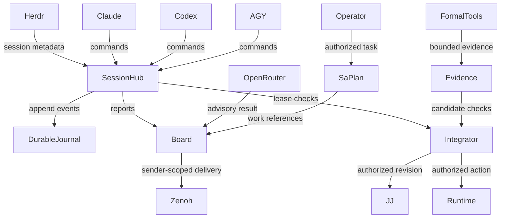

# 20260907-0653 — UOS shared SDLC, SRE and agent swarm specification

#fractal-l0 #fractal-l1 #fractal-l2 #fractal-l3 #fractal-l4 #fractal-l5 #fractal-l6 #fractal-l7 #fractal-l8 #fractal-l9 #zk-adr #zero-muda #tailscale-web

**UOS / Coordination / Formal system specification** · [Cockpit](http://nas-1.tail55d152.ts.net:4100/) · [Planning](http://nas-1.tail55d152.ts.net:4100/planning) · [Wiki](http://nas-1.tail55d152.ts.net:4100/wiki) · [ZK](http://nas-1.tail55d152.ts.net:4100/zk) · [Checklist](http://nas-1.tail55d152.ts.net:4100/checklist)  
**Live document:** [http://nas-1.tail55d152.ts.net:4100/docs/design/20260907-0653-uos-tri-agent-sdlc-sre-herdr-spec.md](http://nas-1.tail55d152.ts.net:4100/docs/design/20260907-0653-uos-tri-agent-sdlc-sre-herdr-spec.md) · [Source](http://nas-1.tail55d152.ts.net:4100/files/docs/design/20260907-0653-uos-tri-agent-sdlc-sre-herdr-spec.md)

Created: 2026-09-07T06:38:53Z. Status: SPECIFIED; implementation and invocation evidence are recorded separately. Parent: [21-service,17-aspect infrastructure specification](http://nas-1.tail55d152.ts.net:4100/docs/design/20260907-0550-uos-agentic-infrastructure-17-aspect-formal-spec.md). Task plan: `tri-agent-sync-20260907` / `uos/coordination/tri-agent-sync-20260907`.

## 1. Purpose and system boundary

UOS shall support Claude, Codex and AGY developing and operating one canonical monorepo concurrently. Herdr supplies real session discovery, terminal isolation, bounded task delivery and output observation. Native Gleam/OTP supplies coordination decisions. Hermes Sa-plan retains durable task/workflow state. The signed UOS message board exchanges work reports, questions, acknowledgements and evidence references over Zenoh. OpenRouter workers provide bounded advisory analysis selected by policy and cost.

This extends the existing UOS building blocks. The executable scope in this change is a local durable coordination CLI, a bounded Herdr adapter and an OpenRouter advisory adapter. Fleet IAM, mandatory interception of every native tool, root-supervisor deployment, production rollout and all21 enterprise services are explicit further obligations. Formal models establish stated mathematical properties; they do not prove unrelated hardware, UI, network or inference implementations.

## 2. Observed need

The starting main bookmark and TUI integration history diverged. While the sessions were active, a peer regenerated the legacy board and removed a Codex message from both its local projection and the shared router namespace. Claude acknowledged the loss and emitted an Andon record. Another concurrent integration changed the working revision during observation. Those are concrete reasons to separate durable events from projection generation, declare work ownership and serialize VCS integration.

Actual sessions were discovered with `herdr agent list`: Claude in `w2:p2`, Codex in `w2:p4`, AGY in `w2:p1`. These are observed handles for this run, not permanent configuration. Future runs must rediscover and bind the live session ID. Peer acknowledgement must be emitted by the actual peer; tests never impersonate these live identities.

## 3. Architecture and ownership

ASCII source (edge list; labels and endpoints match Mermaid):

```text
Operator --authorized task--> SaPlan
Herdr --session metadata--> SessionHub
Claude --commands--> SessionHub
Codex --commands--> SessionHub
AGY --commands--> SessionHub
SessionHub --append events--> DurableJournal
SessionHub --reports--> Board
Board --sender-scoped delivery--> Zenoh
OpenRouter --advisory result--> Board
SaPlan --work references--> Board
SessionHub --lease checks--> Integrator
Integrator --authorized revision--> JJ
Integrator --authorized action--> Runtime
FormalTools --bounded evidence--> Evidence
Evidence --candidate checks--> Integrator
```



This is the target control flow. An implementation receipt must say which edges were exercised; a diagram does not establish that an automatic daemon connects every edge.

The local session journal owns only cooperative session metadata, path/resource claims, heartbeats and receipt ACKs. It is not a second workflow, quota, approval or effect-commit store. Hermes/Sa-plan retains those authorities as specified in the parent specification. The initial deployment uses one local coordinator per canonical repository; federation requires an admitted shared lease authority rather than merging local locks.

| Plane | Canonical implementation/reuse | Authority |
|---|---|---|
| Work and workflow | Hermes `sa_plan`, `tools/sa-plan` | Task identities, dependencies and recorded outcomes |
| Durable session coordination | `uos_tui/session_sync.gleam` and bounded Erlang storage shim | Cooperative local reservations and explicit message ACKs |
| Exchange and projection | Existing `uos_tui/board.gleam`, `coord.gleam`, Zenoh | Delivery, reports and evidence exchange; no remote admission authority |
| Terminal integration | `uos_tui/herdr.gleam`, `herdr_sync_cli` | Verified target metadata and bounded delivery; no automatic permission answers |
| Remote advisory inference | `uos_tui/openrouter_worker.gleam` | Bounded model output; no filesystem, deployment or task-completion rights |
| Formal evidence | `formal/lean/AgenticCoordination.lean`, `formal/quint/agentic_coordination.qnt` | Defined model properties and explicit invocation result |
| Deterministic effects | Existing ZigVM, typed Gleam actors, policy and runtime adapters | Separately authorized bounded execution |

The typed SessionHub-to-Sa-plan bridge is `SessionObservation(event_id, payload_hash, local_sequence, session_ref, resource_ref, epoch, candidate_ref)` with an idempotent Hermes inbox and `ObservationAccepted(event_id, payload_hash, hermes_sequence)` reply. Replaying the same event/body repeats that receipt; a changed body or sequence gap fails closed for reconciliation. Task completion, budget reservation and effect dispatch use separate authorized Hermes commands. A local ACK of bridge ingestion cannot complete them, and no cross-store dual write is treated as atomic. The implementation plan specifies the bridge and recovery protocol.

## 4. Typed contracts

A session record contains `session_id, client_kind, declared_workspace, candidate_revision, evidence_refs, heartbeat_time`. Client kind is Claude/Codex/AGY; additional remote workers need explicit registration, policy and credentials. Herdr references contain both pane and actual session ID. A declared identity is not a workload certificate.

A resource claim contains `resource, holder_session, epoch, granted_at, expires_at`. Resource classes are task, workspace, integration/main and runtime/service. The mutation envelope contains a bounded unique `operation_id` and a typed command. Persisted command equality governs idempotent retry; reuse of the same ID with another body is rejected.

A work packet contains `task_id, owner, base_revision, path_scope, acceptance_refs, model_budget, deadline, reply_target`. Results contain `candidate_revision, source_hashes, observed_command, tool_version, exit_status, evidence_ref, limitations`. Secret values, full conversation histories and hidden reasoning are excluded from coordination payloads.

An effect authorization contains the principal, action kind, target, expected revision, lease epoch, policy version, expiry and approval reference when required. The new local coordinator returns a lease decision; it does not synthesize this full authorization or execute the effect.

## 5. Safety and algebraic laws

- **L-OWNER:** At any time, each resource has at most one live holder.
- **L-FENCE:** A successful new claim increases the retained resource epoch. Release and restart cannot reset it. A stale epoch cannot renew, release or pass an effect check.
- **L-REPLAY:** Applying the same operation ID and command twice has the same authoritative result; a different command using that ID is rejected.
- **L-DURABLE:** A successful mutation is persisted before success is returned. Projection failure cannot discard it. Incomplete/corrupt event recovery fails closed and preserves evidence.
- **L-ACK:** An ACK acknowledges receipt by its registered recipient; it is not evidence that a task passed, a review agreed or an action is authorized.
- **L-ROCHA:** Adding observations, questions or model advice cannot increase effect authority.
- **L-REVISION:** Source, runtime and formal evidence for admission bind the same candidate and each of the17 distinct aspect IDs. Unknown, stale or absent keys veto admission.
- **L-BUDGET:** Reserved maximum liability plus settled usage stays within the configured budget; uncertainty retains reservation until reconciliation. A single adapter request bound does not prove aggregate fleet budgeting.
- **L-TARGET:** Herdr commands are fixed argv operations with byte/time bounds, expected session identity and explicit directory provenance. A changed session or ambiguous prompt outcome cannot be silently retried.
- **L-ISOLATION:** Imported/external source trees remain evidence only; agent tasks cannot grant themselves access to another tenant, workspace or runtime.

Acceptance cases include two real OS processes racing one claim; process death during persistence; duplicate ID with changed payload; expired lease; release then old-epoch retry; forged/unknown session; ACK of another recipient's message; unavailable Zenoh; replaced Herdr session; blocked approval UI; unlimited model fallback; exhausted/missing price budget;17th evidence key missing; correct17keys from a different revision; and an advisory attempting a side effect.

## 6. Formal methods and independent checks

Lean is used for inductive properties of the explicit state model: candidate-bound17-aspect admission, lease/authority constraints and budgets. Quint explores bounded lease, evidence, observation, budget and effect transitions under named finite domains, steps, samples and seed. The present models cover one protected resource per instance and three abstract agents. They do not model concrete session generations, disk crashes, duplicate-operation persistence, replay recovery or per-attempt budget-to-dispatch linkage; those remain implementation/refinement obligations. SMT is reserved for a decidable arithmetic or Boolean subproblem with positive satisfiable controls; no SMT result is claimed in this package. Actual implementation tests and independent-process/crash tests are separate evidence, not implied by these models.

Every formal result must record its source digest, exact tool version, command, bound, exit code, timestamp and model scope. Missing tools, parser errors, timeout, undeclared assumptions and incomplete proofs are nonpassing. A sampled Quint run is bounded simulation. Lean proof compilation does not establish that the entire deployed service refines the model; that correspondence remains an independently reviewed obligation.

## 7. Complete17-aspect analysis

All17 canonical aspects are retained. The rightmost column states the evidence needed or collected; the [invocation receipt](http://nas-1.tail55d152.ts.net:4100/files/docs/reviews/20260907-0653-uos-tri-agent-17-aspect-verification.json) carries current results. The original21-service cross-product remains357 obligations.

| Aspect | Canonical aspect | System obligation | Verification boundary |
|---|---|---|---|
| AINF-A01 | Substrate & Hardware Storage Interlock | Protect OS disk identity; runtime lease cannot authorize forbidden storage. | Rust hardware_identity_test plus typed deny policy; no live destructive probes. |
| AINF-A02 | Standalone Jujutsu Monorepo Discipline | Capture both branch tips and merge with JJ; serialize bookmark changes. | JJ ancestry/conflicts/workspace receipts; no native Git mutation. |
| AINF-A03 | Zero-Muda Purity & Waste Elimination | Reuse OTP, Hermes, ZigVM, board and Sa-plan; bounded model work. | Changed dependency/ABI review; no new vendor control stack or unbounded model loops. |
| AINF-A04 | Gleam/OTP 29 4-Domain Root Supervisor | Supervise coordination under OTP and bound recovery/restart. | Gleam coordinator tests and local concurrent-process checks; deployed root supervisor still needs evidence. |
| AINF-A05 | ZigVM Deterministic Engine & 8 VFS Laws | Contain execution and maintain deterministic VFS laws. | Native Zig tests and actual VFS probes are independent of coordination proofs. |
| AINF-A06 | Hermes Formal Evidence, Gospel & Z3 | Retain invocation-specific evidence and durable event provenance. | Hermes test executions, source hashes, drift records and isolated bounded SMT. |
| AINF-A07 | Mathematical Authority & Conservation | Model all 17 revision-bound keys plus stale lease denial and authority non-escalation. | Lean kernel results; Quint seeded simulation; explicit model/implementation refinement gap. |
| AINF-A08 | Biosemiotic Cybernetics & Rocha Cut | Observation and model advice cannot issue an effect. | Typed report/control separation; negative authority and ACK tests. |
| AINF-A09 | Quarantined Modular MAX/Mojo Inference | Inference stays out of the supervision control kernel. | MAX remains isolated; remote OpenRouter adapter exposes only bounded advisory HTTPS calls. |
| AINF-A10 | Zenoh OoZ & MoZ Mesh Telemetry Backplane | Board delivery is retryable, sender-scoped and non-destructive. | Zenoh publish/read receipts; durable local authority survives projection loss; no shared DELETE. |
| AINF-A11 | AG-UI 32-Event SSE Stream Protocol | SSE carries typed observable lifecycle events. | Existing AG-UI stream probe and catalog tests; subscriber-to-session wiring is a separate requirement. |
| AINF-A12 | A2UI 233-Component Declarative Catalog | Structured views expose model/peer evidence without executing commands. | Existing A2UI catalog tests; no control permission encoded in presentation JSON. |
| AINF-A13 | Penta-Stack Multi-Interface Accessibility | Operator sees stale/blocked/unknown peers and usable text fallback. | Herdr metadata, existing TUI tests; accessibility needs visual/runtime evidence. |
| AINF-A14 | Universal Tailscale FQDN Web Navigation | Publish real reachable Tailnet links. | HTTP probes of the correct /docs/design, /docs/wiki and /docs/zk routes. |
| AINF-A15 | Comprehensive Verification Checklist | Render18 checkpoints under5 domains; evidence state is truthful. | Document structure checks and current candidate receipt; checklist file presence is insufficient. |
| AINF-A16 | Knowledge Management Triad (Wiki/ZK/Ont) | Cross-link specification, wiki, ADR, source review and journal. | Source-backed package plus MOC; immutable review-time hashes retain drift history. |
| AINF-A17 | Sa-Plan & Bionic Durable Workflows | Link task, workflow, claim, review, integration and incident records. | Sa-plan task/workflow tests plus actual plan/session/board records. |

## 8. SDLC and SRE operating cycle

Observe current session/revision/inbox/health and choose one bounded task. Orient using source references, task dependencies, formal obligations and current capacity. Decide ownership, path scope, budget and acceptance cases. Act only through authorized tools, record result and release or renew ownership. Subsequent cycles consume those compact records.

For development: register → claim task/workspace → create bounded candidate → build/test → independent review → claim integration → verify current candidate → synchronize mainline → publish evidence. Local mainline synchronization does not imply production release.

For SRE: observe health → open incident → claim runtime target → diagnose → propose authorized mitigation → execute through the existing policy boundary → observe recovery/rollback → journal. A runtime lease is separate from the development task; emergency authority is explicit and never inferred from Herdr or OpenRouter output.

## 9. Token cost and Zero-Muda

Reuse existing native modules and exact source references. Default to local deterministic checks, one owner per implementation slice and one independent reviewer for critical code. Send deltas and hashes instead of whole repositories or conversation transcripts. Keep working context compact with links back to preserved evidence.

OpenRouter uses a small explicit allowlist, current price/capability observations, free-first mode, bounded completion, timeout and call count. Paid work requires explicit selection and a USD 0.02 per-request ceiling. Failed/ambiguous requests are not blindly duplicated across providers. Quality evaluation controls promotion: a cheap response that fails acceptance remains a failed advisory. Record prompt/completion usage and actual selected model, and do not invent costs when the provider omits them.

The full production budget broker from the parent specification remains necessary for atomic tenant/run reservations across concurrent paid workers. Until that is enforced, the bounded demo defaults free-only. Provider routing and capabilities must be verified against [OpenRouter routing documentation](https://openrouter.ai/docs/guides/routing/routers/auto-router) and [free-model documentation](https://openrouter.ai/docs/guides/routing/model-variants/free); dynamic router popularity does not establish task quality.

## 10. Limits and release gates

The existing mainline has known placeholder implementations and checks that only look for files or literal booleans. This change preserves that evidence and adds real tests; it does not relabel the whole system as verified. Platform IAM, actual MAX inference, end-to-end tenant isolation, production sandbox escape resistance, mandatory runtime fences, full UI accessibility and operational disaster recovery need dedicated runtime evidence.

The system can coordinate a bounded local three-agent swarm once the new CLIs and real peer participation pass. Production admission requires complete fresh two-key evidence for the affected capabilities and authorized release; a successful documentation or local integration task is a separate milestone.


## Comprehensive verification checklist

Document checks and production gates have different evidence scopes. Checked
items below refer only to this document package. All infrastructure runtime,
formal-proof and sovereign-admission obligations remain **UNRUN**.

<details>
<summary>Domain 1 — Metadata, timestamp and Tailscale navigation</summary>

- [x] **CHK-01-TIME** — Host-clock timestamp prefix and chrony receipt recorded.
- [x] **CHK-02-TAIL** — Full clickable Tailscale FQDN references provided; serving status is reported in the journal.
- [x] **CHK-03-FRACT** — Canonical L0–L9 fractal tags assigned.
- [x] **CHK-04-KM** — Specification, wiki, ADR, source review and journal cross-linked.

</details>

<details>
<summary>Domain 2 — Zero-Muda purity and storage safety</summary>

- [ ] **CHK-05-MUDA** — Production dependency/exclusion scan required.
- [ ] **CHK-06-GRAPH** — Pure BEAM/Hermes graph boundary must pass runtime checks.
- [ ] **CHK-07-DRIVE** — Denied OS serial `25503L801736` must pass real interlock tests.

</details>

<details>
<summary>Domain 3 — Testing Gold Standard and mathematical gates</summary>

- [ ] **CHK-08-C1C8** — Structure, health badges, data grids, timeline, interactions, dark cockpit, advisory and action interlock.
- [ ] **CHK-09-MATH** — H ≥ 2.50 bits, CCM ≥ 90.0%, D_EA ≤ 10.0%, ITQS ≥ 0.85 require declared metrics and fresh measurements.
- [ ] **CHK-10-9MOD** — Unit, system, TDD, BDD, performance, scalability, property, fuzz and chaos.
- [ ] **CHK-11-REGR** — Relevant UI regression suite and 30-second monitoring require execution.

</details>

<details>
<summary>Domain 4 — Cross-language control and observability</summary>

- [ ] **CHK-12-GLEAM** — Real OTP domain/actor supervision and restart evidence.
- [ ] **CHK-13-HERMES** — Authoritative WAL, bounded formal checks and evidence receipts.
- [ ] **CHK-14-ZIGVM** — Deterministic execution and descriptor-relative VFS evidence.
- [ ] **CHK-15-MAX** — Real inference through the isolated MAX boundary.
- [ ] **CHK-16-OTEL** — UTC microsecond timestamps and nonzero W3C trace/span IDs.

</details>

<details>
<summary>Domain 5 — Sovereign governance and standalone Jujutsu</summary>

- [ ] **CHK-17-SOV** — Tri-sovereign candidate review and authorized admission are outstanding.
- [x] **CHK-18-JJ** — Documentation authored in UOS using its standalone JJ discipline; no native Git mutations in UOS.

</details>


**Previous:** [Coordination contract](http://nas-1.tail55d152.ts.net:4100/files/contracts/rules/20260907-0653-tri-agent-coordination.md) · **Next:** [Operational runbook](http://nas-1.tail55d152.ts.net:4100/docs/wiki/20260907-0653-uos-tri-agent-swarm-operations.md)  
**UOS footer:** SPECIFIED; see invocation receipt for executed results and limits.
