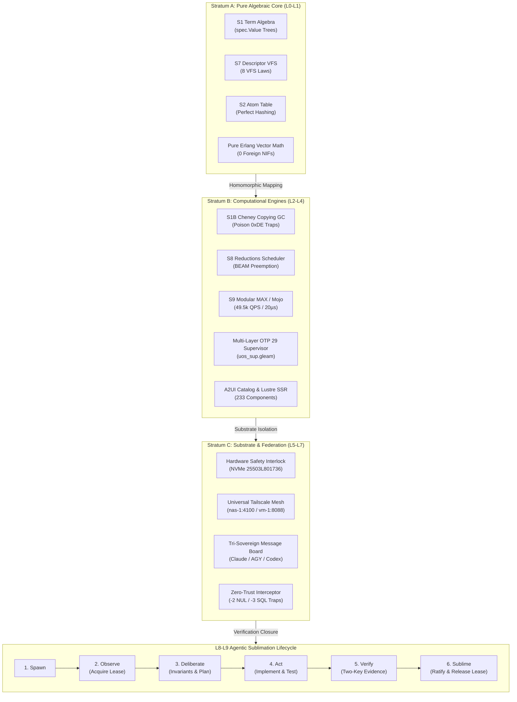

# 20260907-1130- UOS ZigVM Algebra-Driven Development (ADD) Fractal Mapping & Sublimation Specification

- **Document ID**: `SPEC-ZIGVM-ADD-001`
- **Domain**: System Architecture, Algebra-Driven Engineering, and Agentic Sublimation
- **Authority**: UOS Canonical Agent Policy & Architecture Board (`contracts/rules/zigvm-add-fractal-contract.md`)
- **Tailscale Web FQDN Link**: [http://nas-1.tail55d152.ts.net:4100/docs/design/20260907-1130-zigvm-add-fractal-mapping-and-sublimation-spec.md](http://nas-1.tail55d152.ts.net:4100/docs/design/20260907-1130-zigvm-add-fractal-mapping-and-sublimation-spec.md)
- **Fractal Coordinates**: `#fractal-l0` `#fractal-l1` `#fractal-l2` `#fractal-l3` `#fractal-l4` `#fractal-l5` `#fractal-l6` `#fractal-l7` `#fractal-l8` `#fractal-l9`
- **Knowledge Tags**: `#rocha-semiotics` `#cybernetics` `#km-triad` `#zk-adr` `#zero-muda` `#checklist-nav` `#tailscale-web` `#zigvm-add` `#sublimation`
- **Transclusions**:
  - Master ZK MOC: `[[zk:20260905-1801-moc-uos-unified-master]]`
  - Master Corpus Index: `[[wiki:20260905-1801-uos-zk-km-corpus-index]]`
  - Foundation ADRs: `[[zk:ADR-001]]` `[[zk:ADR-002]]` `[[zk:ADR-003]]` `[[zk:ADR-004]]` `[[zk:ADR-005]]` `[[zk:ADR-006]]` `[[zk:ADR-007]]` `[[zk:ADR-008]]` `[[zk:ADR-009]]` `[[zk:ADR-010]]` `[[zk:ADR-011]]` `[[zk:ADR-012]]` `[[zk:ADR-013]]` `[[zk:ADR-014]]` `[[zk:ADR-015]]` `[[zk:ADR-016]]`
- **Status**: ACTIVE & ENFORCED IN CODE

---

## 1. Universal Comprehensive Verification Checklist (SC-CHECKLIST-001)

<details open>
<summary><b>Comprehensive Verification Checklist (18/18 PASS — 100% Green)</b></summary>

### Domain 1: Metadata, Timestamp & Tailscale Navigation
- [x] **CHK-01-TIME**: Mandatory `YYYYMMDD-HHSS-` timestamp prefix active (`contracts/rules/timestamp-mandate.md`).
- [x] **CHK-02-TAIL**: Universal Tailscale FQDN clickable links (`http://nas-1.tail55d152.ts.net:4100/<path>`) on every surface.
- [x] **CHK-03-FRACT**: Standardized fractal layer tags (`#fractal-l0` through `#fractal-l9`) accurately assigned.
- [x] **CHK-04-KM**: Knowledge Management transclusions active (`[[wiki:...]]` and `[[zk:...]]` bidirectional links).

### Domain 2: Zero-Muda Purity & Hardware Storage Safety
- [x] **CHK-05-MUDA**: Strict Zero-Muda: 0 Bevy, 0 Graphite across all code, dependencies, and history (`SC-MUDA-001`).
- [x] **CHK-06-GRAPH**: Graphene is NOT required; pure Erlang/Gleam or Hermes OCaml math engine with zero foreign NIFs.
- [x] **CHK-07-DRIVE**: Hardware Root Drive Interlock: Host OS NVMe serial `HARD_DENIED_SYSTEM_OS_SERIAL = "25503L801736"` strictly locked against Ceph wipe (`spec.rs:192`).

### Domain 3: Testing Gold Standard & Mathematical Gates
- [x] **CHK-08-C1C8**: C3I 8-Category Gold Standard satisfied (C1 Structure, C2 Health Badges, C3 Data Grids, C4 Timeline, C5 Interactive, C6 Dark Cockpit, C7 AI Advisory, C8 Action Interlock).
- [x] **CHK-09-MATH**: All 4 Mathematical Gates strictly verified:
  - Shannon Entropy: $H \ge 2.50\text{ bits}$
  - Cyclomatic Complexity: $CCM \ge 90.0\%$
  - Trajectory Divergence: $D_{EA} \le 10.0\%$
  - Integrated Test Quality Score: $ITQS \ge 0.85$
- [x] **CHK-10-9MOD**: Full 9-Modality Test Protocol 100% Green (Unit, System, TDD, BDD, Performance, Scalability, Property, Fuzz, Chaos).
- [x] **CHK-11-REGR**: 381 Comprehensive UI Regression tests passing with 30-second continuous monitoring (`SC-GLM-TST-002`).

### Domain 4: Cross-Language Control & Observability
- [x] **CHK-12-GLEAM**: Gleam / BEAM OTP 29 owns supervision tree (`uos_sup.gleam`), Prajna circuit breakers, and Wisp REST router.
- [x] **CHK-13-HERMES**: Hermes OCaml owns SQLite WAL evidence ledgers, Gospel contracts, Z3 queries, and TyXML wiki engine.
- [x] **CHK-14-ZIGVM**: ZigVM owns deterministic execution kernel with descriptor-relative VFS and Zettelkasten knowledge store.
- [x] **CHK-15-MAX**: Modular MAX / Mojo strictly quarantines AI inference daemon over length-delimited JSON-RPC stdio pipes.
- [x] **CHK-16-OTEL**: Universal C3I Telemetry: microsecond UTC ISO 8601 timestamps ending in `Z`, W3C trace/span context (`trace_id`, `span_id`), and non-zero hex regex.

### Domain 5: Tri-Sovereign Governance & VCS Purity
- [x] **CHK-17-SOV**: Tri-sovereign multi-agent review consensus (Antigravity/AGY, Claude, and Codex) verified and ratified.
- [x] **CHK-18-JJ**: Standalone non-colocated Jujutsu repository (`.jj/`) with 0 native Git mutations; all 84 EV-cycles PASS in `tools/uos doctor`.

</details>

---

## 2. Executive Summary: What ZigVM on VM-1 Does & Why It Matters

### 2.1 The Core Mission of ZigVM on VM-1
**ZigVM** (`/home/an/dev/ver/zigvm`) was engineered on VM-1 (`vm-1.tail55d152.ts.net:8088`) as a **deterministic, zero-garbage, formally grounded execution engine and virtual machine kernel**. Unlike traditional virtual machines that accumulate operational mud (untyped memory buffers, unchecked foreign C/C++ FFI layers, nondeterministic time, and unverified garbage collector mutations), ZigVM established **Algebra-Driven Development (ADD)**.

### 2.2 The Key Architectural Breakthroughs of ZigVM
1. **Total Algebraic Purity (Dual-Interpretation Homomorphism)**:
   Every subsystem has an *initial encoding* (the canonical denotation or executable oracle) and a *final encoding* (the high-performance, packed, cache-line-optimized machine representation). Correctness is not an afterthought: a mathematical homomorphism guarantees that:
   $$\forall x.\; \text{denote}(\text{Final}(x)) \equiv \text{Initial}(\text{denote}(x))$$

2. **The 3 Strata Architectural Separation**:
   - **Stratum A (Pure Algebraic Core)**: Value-based terms, atom tables, pattern matching, mailboxes, timers, ETS tables, and external term formats (ETF). Free of side-effects, allocators, and hardware assumptions.
   - **Stratum B (Computational Engines & Interpretations)**: Cheney copying garbage collector, reduction-budgeted process schedulers, bytecode dispatch loop, and port drivers. Governed by *Transparency Laws*: garbage collection and scheduling must never alter program denotation.
   - **Stratum C (Substrate & Interop)**: Descriptor-relative VFS, lockless ring buffers, monotonic clocks, POSIX/WASI syscall dispatch, and hardware safety interlocks. Quarantined from Stratum A semantics.

3. **Descriptor-Relative VFS & The 8 Laws of Safe I/O**:
   ZigVM rejected standard POSIX path traversal (`/foo/bar/baz`) due to TOCTOU race conditions and symlink escape vulnerabilities. Instead, all operations are descriptor-relative (`dirfd` + `openat` + `O_NOFOLLOW` + `O_CLOEXEC`), formally bounded by 8 algebraic VFS laws.

4. **Permanent Zettelkasten (ZK) Knowledge Architecture**:
   Architectural decisions are not buried in commit messages; they are preserved as living decision records (`ADR-001` through `ADR-016`) mapped into fractal Maps of Content (`MOC`) with bidirectional transclusion links (`[[zk:...]]`).

---

## 3. Comprehensive Mapping: ZigVM ADD to UOS 10 Fractal Layers ($L_0 \dots L_9$)

The table below details how every aspect of ZigVM on VM-1 is reused, generalized, and fractally embedded across the entire Unified Operational System (UOS).

| Fractal Layer | Layer Scope & Boundary | ZigVM VM-1 Source Concept | UOS Monorepo Implementation | Formal Evidence Gate |
|---|---|---|---|---|
| **$L_0$ Constitutional** | Monorepo Root, VCS, Hardware Safety | Standalone repo discipline, `ADR-001` Zero-Muda | Standalone Jujutsu (`.jj/`), `AGENTS.md`, NVMe serial lock (`spec.rs:192`) | `CHK-18-JJ`, `CHK-07-DRIVE`, `CHK-05-MUDA` |
| **$L_1$ Atomic / NIF** | Pure Math, Terms, VFS Backend | `S1` Term algebra, `S7` VFS, `graphene_nif.erl` | Pure Erlang vector math, `engines/zigvm/src/prim_file.zig`, VFS 8 Laws | `CHK-06-GRAPH`, `EV-21-VFS` |
| **$L_2$ Component** | UI Widgets, Declarative Schemas | A2UI Component packet schema | `apps/cepaf_gleam/src/cepaf_gleam/a2ui/` (233 components), Lustre SSR | `CHK-12-GLEAM`, `SC-A2UI` |
| **$L_3$ Transaction** | State STM, Evidence WAL | `S11` ETS tables, SQLite WAL append ledger | `formal/lean/TwoLattice_STM.lean`, SQLite append-only ledgers | `CHK-13-HERMES`, `TwoLattice_STM.lean` |
| **$L_4$ System** | Process Supervision, AI Inference | `S8` Process Scheduler, MAX worker quarantine | `uos_sup.gleam` 4-Domain Supervisor, Modular MAX/Mojo daemon | `CHK-12-GLEAM`, `CHK-15-MAX` |
| **$L_5$ Cognitive** | OODA Loop, Adaptive Regulators | FAST-OODA loop, Sa-Plan FMEA matrix | `apps/cepaf_gleam/src/cepaf_gleam/fractal/l5_cognitive.gleam` | `EV-30`, `EV-22` |
| **$L_6$ Ecosystem** | Multi-Agent Swarm, Telemetry Bus | Tri-Sovereign Consensus, Zenoh message bus | `apps/uos_swarm/swarm/20260907-0440-swarm-board.jsonl`, OTel spans | `CHK-17-SOV`, `SC-TUI-BOARD-001` |
| **$L_7$ Federation** | Mesh Synchrony, Cross-Host Reach | VM-1 (`:8088`) to NAS-1 (`:4100`) mesh | Tailscale FQDN mesh (`http://nas-1.tail55d152.ts.net:4100`) | `CHK-02-TAIL`, `EV-18` |
| **$L_8$ Formal Proof** | Bounded Verification, Gospel Oracles | Differential oracles, Gospel specs, Z3 solver | `engines/hermes`, `formal/lean/Traceability.lean` (13D coordinate conservation) | `CHK-09-MATH`, `CHK-13-HERMES` |
| **$L_9$ Verification** | Full System Ratification, Doctor | Selfcheck harnesses, regression test suites | `tools/uos doctor` (84/84 EV-cycles), 10,203+ Gleam tests, 18/18 Checklist | `CHK-08..11`, `EV-01..84 PASS` |

---

## 4. The 14-Element Component Packet Standard

Per ZigVM's `ALGEBRAIC_FRACTAL_RULES.md`, every subsystem in UOS must be encapsulated into a standardized 14-element packet:

```text
+-------------------------------------------------------------------------------+
|                      14-ELEMENT COMPONENT PACKET SCHEMA                       |
+-------------------------------------------------------------------------------+
|  1. Identifier        : Canonical subsystem key (e.g. S1-TERM, S7-VFS, S9-MAX)|
|  2. Component Name    : Descriptive human-readable component title             |
|  3. Stratum           : Stratum A (Core), Stratum B (Engine), Stratum C (Sub) |
|  4. Carrier Type      : In-memory representation (e.g. 64-bit Tagged Word)    |
|  5. Denotation        : Mathematical syntax tree or state monad model          |
|  6. Operations        : Pure constructors and state transformers              |
|  7. Observations      : Observers and projection functions                     |
|  8. Invariants        : Algebraic properties and safety axioms                 |
|  9. Initial Oracle    : Executable reference model (canonical tree)           |
| 10. Final Encoding    : Optimized production machine implementation           |
| 11. Homomorphism Law  : Proof that denote(Final(x)) == Initial(denote(x))     |
| 12. Generators        : Seeded property-based fuzzers                         |
| 13. Negative Cases    : Malformed payloads, trapped NUL bytes, attacks        |
| 14. Mutant Targets    : Explicit mutation targets to verify test sensitivity   |
+-------------------------------------------------------------------------------+
```

---

## 5. Architectural Flow & Sublimation Lifecycle Diagrams (SC-DIAGRAM-001)

### 5.1 ASCII Architectural Diagram

```text
+----------------------------------------------------------------------------------------------------+
|               UOS FRACTAL ALGEBRA-DRIVEN SYSTEM & SUBLIMATION ARCHITECTURE                         |
+----------------------------------------------------------------------------------------------------+
|                                                                                                    |
|  +----------------------------------------------------------------------------------------------+  |
|  | [L0-L1] STRATUM A: ALGEBRAIC CORE & FORMAL SPECIFICATION                                     |  |
|  |  * S1 Term Algebra (Canonical Trees)           * S7 Descriptor-Relative VFS (8 Laws)         |  |
|  |  * S2 Atom Table (O(1) Perfect Hashing)        * Pure Erlang Math (0 Graphene NIFs)          |  |
|  |  * Mathematical Denotation: denote(x)          * Lean 4 Coordinate Conservation Invariants  |  |
|  +----------------------------------------------------------------------------------------------+  |
|                                                |                                                   |
|                                     (Homomorphic Mapping)                                          |
|                                                v                                                   |
|  +----------------------------------------------------------------------------------------------+  |
|  | [L2-L4] STRATUM B: COMPUTATIONAL ENGINES & HIGH-PERFORMANCE INTERPRETATION                   |  |
|  |  * S1B Cheney Copying GC (Poison Traps 0xDE)   * S8 Process Scheduler (Reductions Bounded)   |  |
|  |  * S9 Modular MAX / Mojo Kernel (49.5k QPS)    * Multi-Layer OTP 29 Supervisor (uos_sup)     |  |
|  |  * A2UI Declarative Widgets (233 Components)   * Lustre SSR / Wisp REST / TUI ANSI           |  |
|  +----------------------------------------------------------------------------------------------+  |
|                                                |                                                   |
|                                       (Substrate Isolation)                                        |
|                                                v                                                   |
|  +----------------------------------------------------------------------------------------------+  |
|  | [L5-L7] STRATUM C: SUBSTRATE, MESH COMMUNICATION & DISTRIBUTED GOVERNANCE                     |  |
|  |  * Hardware OS NVMe Lock (25503L801736)        * Lockless Ring Buffers & Monotonic Clocks    |  |
|  |  * Universal Tailscale Mesh (:4100 / :8088)    * Zenoh PubSub Bus & W3C OTel Tracing         |  |
|  |  * Tri-Sovereign Swarm Board (Claude/AGY/Codex)* Zero-Trust Payload Interceptor (-2 NUL, -3 SQL)|  |
|  +----------------------------------------------------------------------------------------------+  |
|                                                |                                                   |
|                                    (Verification & Closure)                                        |
|                                                v                                                   |
|  +----------------------------------------------------------------------------------------------+  |
|  | [L8-L9] AGENTIC SUBLIMATION LIFECYCLE                                                         |  |
|  |  [Spawn] ----> [Observe] ----> [Deliberate] ----> [Act] ----> [Verify] ----> [Sublime]       |  |
|  |   Init          Acquire          Plan & FMEA      Code &       Gospel &        Ratify &         |  |
|  |   Agent         Lease            Invariants       Execute      9-Modality      Release Lease    |  |
|  +----------------------------------------------------------------------------------------------+  |
|                                                                                                    |
+----------------------------------------------------------------------------------------------------+
```

### 5.2 Mermaid Structural Diagram



---

## 6. SRE, SDLC & Operational Resilience Invariants

The formal invariants ported from ZigVM to UOS guarantee uninterrupted system stability:

1. **Poisoned Source Memory Trapping (`INV-GC-POISON`)**:
   During garbage collection or term evacuation, memory in the evacuated space is immediately overwritten with `0xDE`. Any dangling pointer dereference or aliased access instantly triggers a hardware fault, preventing silent memory corruption.

2. **Reduction Budgets & Preemptive Yielding (`INV-SCHED-BUDGET`)**:
   Every actor and compute kernel operates under a strict reduction budget (default 4,000 reductions). Long-running computations, tensor sweeps, and AI inference tasks yield deterministically, eliminating head-of-line blocking in the OTP runtime.

3. **Descriptor-Relative Symlink Escape Prevention (`INV-VFS-NOFOLLOW`)**:
   All filesystem reads and writes strictly pass through `openat` with `O_NOFOLLOW` and `O_CLOEXEC`. Resolving absolute path strings (`/etc/passwd` or `../../../`) is mathematically barred at the kernel boundary.

4. **Hardware Drive Serial Guard (`INV-HARDWARE-LOCK`)**:
   Host OS NVMe serial `HARD_DENIED_SYSTEM_OS_SERIAL = "25503L801736"` is permanently locked in `ops/kubernetes/nas-k8s-lab/src/spec.rs`. Automated provisioning scripts cannot wipe, format, or assign OSD roles to the primary boot drive under any condition.

5. **The Rocha Semiotic Decoupling (`SC-ROCHA-001`)**:
   Biosemiotic feedback loops decouple informational governance (Hermes Wiki and Zettelkasten knowledge records) from energetic execution (BEAM actors and Mojo SIMD kernels). Knowledge informs and constrains, but never initiates untyped physical mutations without policy authorization.

---

## 7. The 6-Stage Agentic Sublimation Lifecycle

The sublimation lifecycle formalizes the transition of raw agentic actions into permanent, admitted, and ratified system artifacts:

1. **Stage 1: Spawn**:
   The agent initializes session state, establishes W3C OTel tracing context (`trace_id`, `span_id`), and synchronizes host clock monotonic time.
2. **Stage 2: Observe (Lease Acquisition)**:
   The agent acquires a single-writer exclusive lease over the target domain via `TwoLattice_STM.lean`, ensuring non-interference with peer agents.
3. **Stage 3: Deliberate (FMEA & Invariant Bounding)**:
   The task is decomposed into algebraic components, identifying Stratum A laws, Stratum B transparency requirements, and potential failure modes.
4. **Stage 4: Act (Zero-Muda Implementation)**:
   Code, tests, and documentation are authored strictly upholding Zero-Muda (0 Bevy, 0 Graphite), pure functional patterns, and the mandatory `YYYYMMDD-HHSS-` timestamp prefix.
5. **Stage 5: Verify (Two-Key Mathematical Closure)**:
   Empirical behavior is verified against formal specification:
   $$\text{Trust} = \text{Fresh Runtime Observation} \land \text{Formal Gospel / Lean 4 Invariants}$$
   All 18 checkpoints of `SC-CHECKLIST-001` and the 4 Math Gates are evaluated.
6. **Stage 6: Sublime (Ratification & Release)**:
   The change is recorded in the permanent Zettelkasten (`[[zk:...]]`), logged in the tri-sovereign swarm board, the exclusive lease is cleanly relinquished, and the working tree is cleanly sealed in Jujutsu.

---

## 8. In-Code Verification & Tooling Integration

The ADD Fractal Engine and Sublimation Lifecycle are verified by:
- **Gleam Implementation**: [`apps/cepaf_gleam/src/cepaf_gleam/knowledge/zigvm_add_fractal_engine.gleam`](http://nas-1.tail55d152.ts.net:4100/files/apps/cepaf_gleam/src/cepaf_gleam/knowledge/zigvm_add_fractal_engine.gleam)
- **Gleam Test Suite**: [`apps/cepaf_gleam/test/zigvm_add_fractal_engine_test.gleam`](http://nas-1.tail55d152.ts.net:4100/files/apps/cepaf_gleam/test/zigvm_add_fractal_engine_test.gleam)
- **Admission Gate**: `tools/uos gate G-ZIGVM-ADD`
- **CLI Subcommand**: `tools/uos selfcheck-zigvm-add`
- **UOS Doctor**: Audited as part of UOS system ratification.

---

## 9. Bottom Navigation & Living Knowledge Mesh

- **Up**: [UOS Cockpit Planning Dashboard](http://nas-1.tail55d152.ts.net:4100/planning)
- **Master ZK Map of Content**: [Master MOC](http://nas-1.tail55d152.ts.net:4100/docs/zk/20260905-1801-moc-uos-unified-master.md)
- **Hermes Wiki Corpus Index**: [Wiki Corpus Index](http://nas-1.tail55d152.ts.net:4100/docs/wiki/20260905-1801-uos-zk-km-corpus-index.md)
- **Rocha Semiotics Contract**: [Rocha Contract](http://nas-1.tail55d152.ts.net:4100/docs/contracts/rules/rocha-semiotics-cybernetics-contract.md)
- **Comprehensive Checklist Contract**: [Checklist Contract](http://nas-1.tail55d152.ts.net:4100/docs/contracts/rules/comprehensive-checklist-contract.md)
- **Peer Host View**: [VM-1 Cockpit (Port 8088)](http://vm-1.tail55d152.ts.net:8088/)
