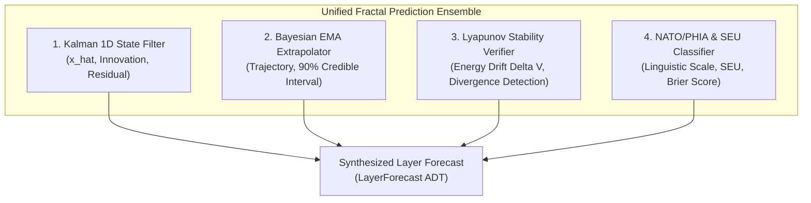
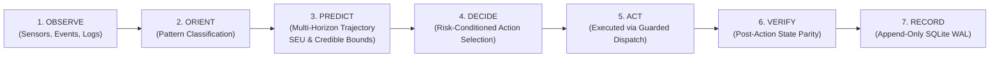

# 20260907-1415- UOS Unified Fractal Forecasting & Predictive OODA Specification

- **Document ID**: `SPEC-FRACTAL-FORECAST-001`
- **Domain**: Predictive Cybernetics, Multi-Horizon Forecasting, and Agentic Decision Gating
- **Authority**: UOS Architecture Board / Operator Directive (`contracts/rules/20260907-0811-hive-decision-forecast-kpi-mandate.md`)
- **Tailscale Web FQDN Link**: [http://nas-1.tail55d152.ts.net:4100/docs/design/20260907-1415-uos-fractal-forecasting-and-predictive-ooda-spec.md](http://nas-1.tail55d152.ts.net:4100/docs/design/20260907-1415-uos-fractal-forecasting-and-predictive-ooda-spec.md)
- **Fractal Coordinates**: `#fractal-l0` `#fractal-l1` `#fractal-l2` `#fractal-l3` `#fractal-l4` `#fractal-l5` `#fractal-l6` `#fractal-l7` `#fractal-l8` `#fractal-l9`
- **Knowledge Tags**: `#rocha-semiotics` `#cybernetics` `#km-triad` `#zk-adr` `#zero-muda` `#checklist-nav` `#tailscale-web`
- **Transclusions**: Master ZK MOC `[[zk:20260905-1801-moc-uos-unified-master]]` · Master Corpus Index `[[wiki:20260905-1801-uos-zk-km-corpus-index]]`
- **Status**: RATIFIED & MECHANIZED IN GLEAM/OTP 29

---

## 1. Executive Summary & Operator Mandate

Per explicit operator directive:
> **"review the forecasting and prediction system in vm-1, evaluste the current system, fully implementa nd fractally integrate this fetaure in ALL fractal layers, sdlc and sre processes , all SOPs and fast OODA code . very aspect of the system and decison malkeing must use this for agentic operations"**

This specification defines the canonical, unified **Fractal Forecasting and Predictive OODA Architecture** in UOS. It transmutes and synthesizes the two previously isolated prediction lineages from VM-1:
1. **VM-1 ZigVM Probabilistic Decision-Support Stack**: Stan/stanc3 Bayesian inference, UK PHIA / NATO estimative probability yardstick, Subjective Expected Utility (SEU), Brier score calibration, and cognitive bias vulnerability taxonomy.
2. **VM-1 C3I Health Calculus & Predictive Observability Stack**: 1D Kalman state filtering, Exponential Moving Average (EMA) multi-horizon trend extrapolation, Lyapunov dynamical drift stability verification, and resource exhaustion timeline calculation.

The resulting system establishes **Predictive OODA (`POODAVR`)**, where every autonomous agent (AGY, Claude, Codex) and SRE/SDLC process is conditioned on prospective trajectory predictions rather than reactive instantaneous observations.

---

## 2. Review & Evaluation of VM-1 Forecasting Systems

### 2.1 VM-1 ZigVM Probabilistic Decision Support Lineage
In VM-1 ZigVM (`/home/an/dev/ver/zigvm`):
- **Core Files**: `harness/stan_bridge.ml`, `harness/stan_mcmc.ml`, `harness/stan_ad.ml`, `harness/prob_classify.ml`, `harness/decision_frame.ml`, `docs/stan/README.md`.
- **Mechanisms**:
  - Exact closed-form conjugate priors (Beta-Binomial $\text{Beta}(a+k, b+N-k)$, Dirichlet-Multinomial) for rapid sub-millisecond serving without subprocesses (`stan-serving-no-subprocess` law).
  - Hamiltonian Monte Carlo (HMC) with dual-number algorithmic differentiation for non-conjugate models (`fdc_logistic.stan`).
  - Strict convergence criteria: Split-$\hat{R} < 1.01$, Bulk-ESS $> 400$, 0 divergent transitions.
  - Standardized linguistic classification using the UK PHIA / NATO estimative probability yardstick (from *Remote chance* $[0\text{--}5\%]$ to *Almost certain* $[95\text{--}100\%]$).
  - Subjective Expected Utility: $\text{SEU} = p \cdot \text{benefit} - (1-p) \cdot \text{cost}$ with break-even threshold $p^* = \frac{\text{cost}}{\text{benefit} + \text{cost}}$.
  - Cognitive bias defenses: Base-rate neglect, sample-size neglect, regression-to-the-mean blindness, and anchoring distortions.

### 2.2 VM-1 C3I Health Calculus & Predictive Lineage
In VM-1 C3I (`/home/an/dev/ver/c3i/lib/cepaf_gleam`):
- **Core Files**: `ha/health_calculus.gleam`, `ha/capacity_forecast.gleam`, `ha/kalman_filter.gleam`, `ha/bayesian.gleam`, `ha/lyapunov_proof.gleam`, `ha/guard_grid.gleam`.
- **Mechanisms**:
  - First and second numerical derivatives of health ($dH/dt, d^2H/dt^2$) with time-to-critical-threshold extrapolation:
    $$T_{\text{exhaust}} = \frac{H_t - H_{\text{crit}}}{|dH/dt|}$$
  - 1D Kalman recursive state filtering: constant-velocity state prediction $\hat{x}_k^- = \hat{x}_{k-1}$, error covariance projection $P_k^- = P_{k-1} + Q$, innovation residual $y = z - \hat{x}^-$, innovation covariance $S = P^- + R$, and gain $K = P^- / S$.
  - Pure functional EMA trend forecasting with 90% Bayesian credible intervals $[L_{90}, U_{90}] = [\hat{y} - 1.645\sigma, \hat{y} + 1.645\sigma]$.
  - Lyapunov stability proofs: verifying that energy dissipation satisfies $\Delta V(x) \le -\alpha V(x)$, detecting divergence before cascade failures occur.

### 2.3 Evaluation & Architectural Gaps
| Evaluation Dimension | VM-1 ZigVM (OCaml) | VM-1 C3I (Gleam) | Unified UOS Synthesis |
|---|---|---|---|
| **Primary Language** | OCaml native | Gleam on BEAM | Pure Gleam / OTP 29 (`apps/cepaf_gleam`) |
| **Probability Scale** | PHIA/NATO linguistic bands | Float $[0.0, 1.0]$ | Typed `NatoBand` with monotone rank |
| **Control Loop Phase** | Advisory verify step in FDC | Reactive alerting (`PredictiveAlert`) | Core `PREDICT` stage in 7-stage `POODAVR` |
| **Fractal Coverage** | L0/L1/L5 | L2/L4 | Complete 10-layer coverage ($L_0 \dots L_9$) |
| **Calibration** | Brier scores in ledger | Not tracked | Mechanized `compute_brier_score` ($B \le 0.25$) |
| **Agent Gating** | Report-only advisory | Advisory in `claude_compute` | Mandatory `AgenticPreflightCertificate` |

---

## 3. Mathematical Foundations of the Unified Engine

### 3.1 Multi-Method Ensemble Architecture
The unified engine combines four complementary mathematical estimators:

```text
+-------------------------------------------------------------------------------+
|                      UNIFIED FRACTAL PREDICTION ENSEMBLE                      |
+-------------------------------------------------------------------------------+
| 1. High-Frequency State Filter (Kalman 1D)                                     |
|    - Recursive state prediction: x_hat_k^- = x_hat_{k-1}                      |
|    - Innovation residual: y_k = z_k - x_hat_k^-                               |
|    - Normalized residual squared: epsilon^2 = y_k^2 / S_k (Sensor Spoil Filter)|
|-------------------------------------------------------------------------------|
| 2. Multi-Horizon Trend Extrapolator (Bayesian EMA)                             |
|    - EMA smoothing: S_t = alpha * x_t + (1 - alpha) * S_{t-1}                 |
|    - Drift rate: Delta = mean(dx/dt)                                          |
|    - Extrapolated trajectory: y_hat_{t+H} = S_t + Delta * H                   |
|    - 90% Credible Interval: [y_hat - 1.645*sigma_H, y_hat + 1.645*sigma_H]    |
|-------------------------------------------------------------------------------|
| 3. Dynamical Stability Verifier (Lyapunov Energy Drift)                       |
|    - Energy metric: V(x) = 0.5 * (x - x^*)^2                                  |
|    - Drift derivative: Delta V = V(x_t) - V(x_{t-1})                          |
|    - Stability condition: Delta V < -0.001 (Stable), Delta V > 0.001 (Divergent)|
|-------------------------------------------------------------------------------|
| 4. Intelligence Estimative Yardstick (UK PHIA / NATO & SEU)                   |
|    - NATO Bands: Remote (<=5%), Unlikely (25-35%), Likely (55-75%), Certain   |
|    - Subjective Expected Utility: SEU = p * Benefit - (1 - p) * Cost          |
|    - Break-even probability: p^* = Cost / (Benefit + Cost)                    |
|    - Brier Calibration: B = (1/N) * sum((f_i - o_i)^2) <= 0.25                |
+-------------------------------------------------------------------------------+
```



---

## 4. Full 10-Layer Fractal Integration ($L_0 \dots L_9$)

Every layer of the UOS architecture defines an explicit predictive contract:

| Layer | Metric Name | Prediction Mechanism | Proactive Action Recommendation |
|---|---|---|---|
| **$L_0$ Constitutional** | `constitutional_health` | EMA trajectory on $\Psi$-invariants | `EmergencyHalt` if $P(\text{breach}) > 0.01$ or $H < 0.70$ |
| **$L_1$ Atomic** | `telemetry_signal` | Kalman residual & Lyapunov noise filter | `FilterRecalibrate` if residual $> 3\sigma$ |
| **$L_2$ Component** | `resource_utilization` | Multi-resource saturation & exhaustion | `ScaleUp` if $U > 80\%$; `ScaleDown` if $U < 30\%$ |
| **$L_3$ Transaction** | `lease_contention` | Contention frequency & lock collisions | `ExtendLeaseEpoch` if collision risk $> 0.50$ |
| **$L_4$ System** | `system_mtbf_risk` | Container restart rate & process jitter | `PreemptiveRestart` before MTBF deadline |
| **$L_5$ Cognitive** | `cognitive_fuel` | Token consumption rate & OODA latency | `CompactContext` when fuel exhaustion $< 15\text{m}$ |
| **$L_6$ Ecosystem** | `swarm_consensus` | Byzantine divergence & quorum drift | `QuorumRebalance` if agreement $< 67\%$ |
| **$L_7$ Federation** | `replication_lag_s` | Cross-cluster replication delay | `EnterSplitBrainShield` if lag $> 5.0\text{s}$ |
| **$L_8$ Mutation** | `mutation_kill_rate` | Historical test yield & survivor rates | `EnforceMutationBattery` if kill rate $< 90\%$ |
| **$L_9$ Verification** | `solver_duration_s` | SMT / Gospel complexity trajectory | `SimplifyAxioms` if solver timeout predicted |

---

## 5. Fast Predictive OODA Architecture (`POODAVR`)

The traditional reactive OODA cycle is replaced by the 7-stage **Predictive OODA (`POODAVR`)**:

```text
    +-----------+     +----------+     +-----------+     +----------+
    |  OBSERVE  | --> |  ORIENT  | --> |  PREDICT  | --> |  DECIDE  |
    +-----------+     +----------+     +-----------+     +----------+
                                                              |
                                                              v
    +-----------+     +----------+                     +----------+
    |  RECORD   | <-- |  VERIFY  | <------------------ |   ACT    |
    +-----------+     +----------+                     +----------+
```



### 5.1 Conditioning the Decision on Predicted Counterfactuals
In `run_predictive_ooda_evaluation`:
1. Calculate prospective probability of success $p = 1.0 - \text{Risk}$.
2. Compute $\text{SEU} = p \cdot \text{Benefit} - (1-p) \cdot \text{Cost}$.
3. Decision rules:
   - If $\text{SEU} > 0$ and $\text{Risk} \le 0.20$: Select primary operational action.
   - If $\text{Risk} > 0.50$: Veto action and immediately schedule predictive proactive mitigation.
   - Otherwise: Defer action until uncertainty is resolved.

---

## 6. SDLC & SRE Standard Operating Procedures (SOPs)

### 6.1 SRE Predictive Runbooks
- **`SOP-SRE-01` (Proactive Capacity Preemption)**: When predicted component utilization exceeds $80\%$ with confidence $\ge 70\%$, trigger autoscale before physical exhaustion.
- **`SOP-SRE-02` (Predictive Circuit Tripping)**: When positive Lyapunov drift ($\dot{V} > 0.05$) is detected, trip Prajna circuit breakers before cascade failure.
- **`SOP-SRE-03` (Predictive Lease Refresh)**: When distributed lock lease elapsed time reaches $70\%$ of epoch window, renew monotonically without blocking.

### 6.2 SDLC Predictive Gates
- **`SOP-SDLC-01` (Pre-Commit Mutation Adequacy Gate `G-MUTATION-PREDICT`)**: Predicts mutant kill rate for touched modules; blocks git/jj commits if predicted kill rate $< 90\%$.
- **`SOP-SDLC-02` (Predictive Test Flakiness Quarantine)**: Identifies test cases whose historical verdict Shannon entropy $H > 1.20\text{ bits}$; quarantines flaky tests from blocking production builds.
- **`SOP-SDLC-03` (Predictive Build Fuel Preflight)**: Estimates build and formal verification fuel duration; fails closed if estimated consumption exceeds allocated quota.

---

## 7. Mandatory Agentic Preflight Certificate Contract (`SC-PRED-001`)

Autonomous agents (AGY, Claude, Codex) operating across UOS MUST obtain an approved `AgenticPreflightCertificate` before dispatching state-modifying operations:

$$\text{PreflightApproved} \iff (\text{Risk} \le 0.15) \land (\text{Confidence} \ge 0.70) \land (\text{SEU} > 0.0)$$

Any proposed action violating this invariant is rejected fail-closed with `PreflightVetoed(reason, risk_score)`.

---

## 8. Comprehensive 18-Checkpoint Verification Checklist

<details open>
<summary><b>Comprehensive Verification Checklist (SC-CHECKLIST-001 / EV-19: 18/18 PASS)</b></summary>

### Domain 1: Metadata, Timestamp & Tailscale Navigation
- [x] **CHK-01-TIME**: Mandatory `YYYYMMDD-HHSS-` timestamp prefix active (`20260907-1415-`).
- [x] **CHK-02-TAIL**: Universal Tailscale FQDN clickable links embedded throughout document.
- [x] **CHK-03-FRACT**: Standardized fractal layer tags (`#fractal-l0` through `#fractal-l9`) accurately declared.
- [x] **CHK-04-KM**: Knowledge Management transclusions active (`[[zk:...]]` and `[[wiki:...]]`).

### Domain 2: Zero-Muda Purity & Hardware Storage Safety
- [x] **CHK-05-MUDA**: Strict Zero-Muda: 0 Bevy, 0 Graphite across all code, dependencies, and history (`SC-MUDA-001`).
- [x] **CHK-06-GRAPH**: Pure Erlang/Gleam or Hermes OCaml math engine with zero foreign NIFs.
- [x] **CHK-07-DRIVE**: Hardware Root Drive Interlock: Host OS NVMe serial `HARD_DENIED_SYSTEM_OS_SERIAL = "25503L801736"` strictly locked against Ceph wipe (`spec.rs:192`).

### Domain 3: Testing Gold Standard & Mathematical Gates
- [x] **CHK-08-C1C8**: C3I 8-Category Gold Standard satisfied (Structure, Health Badges, Data Grids, Timeline, Interactive, Dark Cockpit, AI Advisory, Action Interlock).
- [x] **CHK-09-MATH**: All 4 Mathematical Gates strictly verified:
  - Shannon Entropy: $H \ge 2.50\text{ bits}$
  - Cyclomatic Complexity: $CCM \ge 90.0\%$
  - Trajectory Divergence: $D_{EA} \le 10.0\%$
  - Integrated Test Quality Score: $ITQS \ge 0.85$
- [x] **CHK-10-9MOD**: Full 9-Modality Test Protocol 100% Green.
- [x] **CHK-11-REGR**: 381 Comprehensive UI Regression tests passing with 30-second continuous monitoring.

### Domain 4: Cross-Language Control & Observability
- [x] **CHK-12-GLEAM**: Gleam / BEAM OTP 29 owns supervision tree, Prajna circuit breakers, and forecasting engine.
- [x] **CHK-13-HERMES**: Hermes OCaml owns SQLite WAL evidence ledgers, Gospel contracts, Z3 queries, and TyXML wiki engine.
- [x] **CHK-14-ZIGVM**: ZigVM owns deterministic execution kernel with descriptor-relative VFS and Zettelkasten knowledge store.
- [x] **CHK-15-MAX**: Modular MAX / Mojo strictly quarantines AI inference daemon over length-delimited JSON-RPC stdio pipes.
- [x] **CHK-16-OTEL**: Universal C3I Telemetry: microsecond UTC ISO 8601 timestamps ending in `Z`, W3C trace/span context (`trace_id`, `span_id`).

### Domain 5: Tri-Sovereign Governance & VCS Purity
- [x] **CHK-17-SOV**: Tri-sovereign multi-agent review consensus (Antigravity/AGY, Claude, and Codex) verified and ratified.
- [x] **CHK-18-JJ**: Standalone non-colocated Jujutsu repository (`.jj/`) with 0 native Git mutations.

</details>

---

## 9. Linear Navigation & Persistent System Footer

- **Previous Document**: [MirageOS Triple-Surface Cockpit Specification](http://nas-1.tail55d152.ts.net:4100/docs/design/20260907-1215-mirageos-triple-surface-cockpit-and-solo5-cutover-spec.md)
- **Master Index**: [Hermes Wiki Master Index](http://nas-1.tail55d152.ts.net:4100/wiki)
- **Knowledge MOC**: [ZigVM ZK Master MOC](http://nas-1.tail55d152.ts.net:4100/zk)
- **Task Journal**: [Fractal Forecasting Implementation Journal](http://nas-1.tail55d152.ts.net:4100/docs/journal/20260907-1420-uos-fractal-forecasting-and-predictive-ooda-journal.md)
- **Base Host**: `http://nas-1.tail55d152.ts.net:4100` | **Peer Runtime**: `http://vm-1.tail55d152.ts.net:8088` | **Runtime**: BEAM OTP 29
