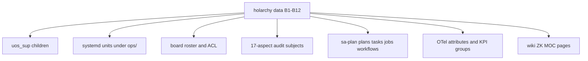

# 20260907-1505- Holonic Architecture and Fractal Services: Mapping C3I and Indrajaal onto UOS
#fractal-l0 #fractal-l1 #fractal-l2 #fractal-l3 #fractal-l4 #fractal-l5 #fractal-l6 #fractal-l7 #fractal-l8 #fractal-l9 #zero-muda #tailscale-web #km-triad #rocha-semiotics #cybernetics #stamp-stpa #holon #holarchy #zk-adr

- **Design Identifier**: `DES-UOS-HOLONIC-MAPPING-001`
- **Timestamp**: `20260907-1505-`
- **Tailscale FQDN Link**: [http://nas-1.tail55d152.ts.net:4100/docs/docs/design/20260907-1505-uos-holonic-architecture-and-fractal-services-mapping-approach.md](http://nas-1.tail55d152.ts.net:4100/docs/docs/design/20260907-1505-uos-holonic-architecture-and-fractal-services-mapping-approach.md)
- **Authority**: L0 design authority (Fable); execution through sa-plan `uos/holonic-mapping/20260907-1505`; tri-sovereign review (AGY, Codex) before any admission claim
- **Transclusions**: `[[zk:20260905-1801-moc-uos-unified-master]]` `[[wiki:20260905-1801-uos-zk-km-corpus-index]]` `[[zk:20260907-0537-adr-062-uos-tui-swarm-hive-mind-message-board-coordination-acl-and-zenoh-infra]]` `[[zk:20260907-0950-adr-063-uos-tui-swarm-work-stream-split]]` `[[wiki:20260907-0930-intelligence-routing-rule]]`
- **Evidence inputs**: `generated/20260907-1320-uos-daemon-process-census-c3i-indrajaal-vs-uos.json` (113 rows), `apps/uos_swarm/src/uos_swarm/holon.gleam` (35 holons, planes, base rules B1–B9), C3I `core/ids.gleam`, C3I `docs/REMAINING_IMPLEMENTATION_PLAN.md` (holon lifecycle), cepaf `fractal/l0_constitutional … l7_federation`, `iam/fractal/*` and its 96-cell matrix
- **Operator directives (verbatim)**: "what is the holonic naming system used by c3i and indrajaal. can the holonic architecture and all its fractal services and implications . can it be mapped to uos"; "save this in journal. create comprehensive approach that covers all tehse aspects"

## Comprehensive Verification Checklist (SC-CHECKLIST-001)
<details><summary>18 checkpoints (design-time status)</summary>
CHK-01 PASS (prefix) · CHK-02 PASS (link) · CHK-03 PASS (tags L0–L9) · CHK-04 PASS (transclusions) · CHK-05 PASS (no new deps proposed) · CHK-06 PASS (pure Gleam/OCaml generation; no NIF) · CHK-07 DECLARED · CHK-08 DECLARED · CHK-09 DECLARED (math gates apply to generated code) · CHK-10 DECLARED · CHK-11 DECLARED · CHK-12 PASS (Gleam/OTP owns the generated supervision) · CHK-13 PASS (Hermes owns holarchy evidence ledgers) · CHK-14 DECLARED · CHK-15 DECLARED · CHK-16 PASS (holon addresses carry trace context) · CHK-17 PENDING (tri-sovereign review of this design) · CHK-18 PASS (jj only; sa-plan execution)
</details>

## 1. Findings: the naming system as it exists

### 1.1 Identity (C3I `core/ids.gleam`)
Every holon carries an opaque `HolonId`, a random 13-character hexadecimal string minted by `new_holon_id()`, structurally identical to `TaskId`, `ProjectId`, `SprintId`, `UserId`, `OodaCycleId`, `EventId` and `CorrelationId`. Only task ids are hierarchical (`parent.index`). A holon instance pairs the id with a `holon_type`, an optional `parent_id`, a lifecycle state and vitals.

### 1.2 Lifecycle (C3I remaining-implementation plan)
`Dormant → Awakening → Active → Stressed → Healing → Apoptotic`, with `is_healthy`, vitals and a membrane. This is the biological metaphor of the holon as a living unit; UOS has no equivalent field today.

### 1.3 Address space (Zenoh key expressions)
Structure lives in keys, not in ids: `indrajaal/l<layer>/<domain-plane>/<subject>/…`.

| Layer | Name | Domain planes observed in C3I code |
|---|---|---|
| l0 | Constitutional | const, iam, secret |
| l1 | Atomic | atomic |
| l2 | Component | (documents only) |
| l3 | Transaction | (documents only) |
| l4 | System | system, cpig, sync, sched |
| l5 | Cognitive | cog (mcp/req, mcp/res, intent/req, vault_moz), test |
| l6 | Ecosystem | eco |
| l7 | Federation | fed, matrix, fmea |
| l8, l9 | (tags only) | none |

Flat namespaces beside the layered ones: `indrajaal/otel/spans/**`, `indrajaal/pi/*`, `indrajaal/kms/catalog`, `indrajaal/safety/alerts`, `indrajaal/moz/planning`. Agent traffic: `c3i/a2a/{source}/{target}`, `c3i/a2a/broadcast`, `c3i/agui/events/`.

### 1.4 Agents
`L<layer>-<model>` (`L0-fable`), workers `W01…W11`, verifiers `V1…V4`, `uos-manager`, peers `AGY`, `Codex-Astra`. The board key reuses the a2a form: `c3i/a2a/<agent>/<target>/<µs-timestamp>-<hash>`.

### 1.5 The UOS holarchy (`uos_swarm/holon.gleam`)
Every holon: `id, name, sanskrit, level, plane, whole, parts, module, audit_subject, board_agent`. Address `uos/holon/L<level>/<id>`, published under `uos/holon/**`. Seven architectural planes with Sanskrit labels and svara pairing: Control=Sa, Structure=Re, Runtime=Ga, DataPlane=Ma, Messaging=Pa, Intelligence=Dha, Language=Ni. Each holon derives a svadharma. Base rules B1–B9: unique ids, parts and wholes exist, reciprocal membership, level-monotonic, acyclic. Coverage today: 35 holons over levels 0–3, all in the swarm and TUI stream. Sanskrit mirror of the word: aṃśa-pūrṇa (part-whole).

### 1.6 What UOS already mirrors from C3I
- Layer modules `cepaf_gleam/fractal/l0_constitutional … l7_federation` and the IAM copy `iam/fractal/*` with the 96-cell object × layer matrix.
- The layered Zenoh prefixes above are kept verbatim in cepaf.
- The signed board uses the a2a key form; the holarchy adds `uos/holon/**`.
- Fractal tags are enforced on every document by the checklist and rocha rules.

## 2. Gap analysis (measured, 2026-09-07)

| Gap | Evidence | Severity |
|---|---|---|
| Holarchy covers 35 of 113 process-level units; levels 4–9 have no holon | census: 33 integrated, 22 imported-not-wired, 49 absent, 8 superseded, 1 barred | P1 |
| Root supervisor `uos_sup.gleam` is declarative; the live services (4100 web, zenoh router, clock guards) start by hand or by two systemd units | census key finding | P1 |
| No lifecycle state or vitals on UOS holons | `holon.gleam` record | P2 |
| Two orthogonal taxonomies (C3I domain plane vs UOS architectural plane) without a joining rule | keys vs `Plane` type | P2 |
| Opaque `HolonId` in C3I vs human ids in UOS; no bridge | `ids.gleam` vs `holon.gleam` | P2 |
| Holarchy is not the source of the supervision tree, the roster, the audit subjects or the sa-plan tree | generated by hand today | P1 |
| L8 and L9 exist only as tags | tag census | P3 |

## 3. Target: one canonical holon record, everything else generated

### 3.1 Canonical naming rule (SC-HOLON-NAME-001)
A holon address is `uos/holon/L<layer>/<plane>/<id>` where:
- `layer` ∈ 0..9 with the C3I names (0 Constitutional, 1 Atomic, 2 Component, 3 Transaction, 4 System, 5 Cognitive, 6 Ecosystem, 7 Federation, 8 Evolution, 9 Cosmos — 8 and 9 named here for the first time and reserved for the dream/evolve and universe-harmony holons already present in the swarm stream);
- `plane` is the UOS architectural plane (control, structure, runtime, data, messaging, intelligence, language);
- `id` is the human kebab-case id used as the whole/part reference; the opaque C3I `HolonId` (13 hex) is carried as `uid` for cross-system correlation and minted once per holon.
- The Zenoh subject prefix keeps the C3I domain plane: `uos/l<layer>/<domain>/<subject>/…` mirrors `indrajaal/l<layer>/<domain>/…`; the old `indrajaal/` prefixes stay as aliases during migration and are retired by a recorded decision.

### 3.2 Canonical record (extends `Holon`)
```text
Holon {
  id, uid(13hex), name, sanskrit, layer(0..9), plane, domain(const|iam|secret|atomic|system|cpig|sync|sched|cog|test|eco|fed|matrix|fmea|otel|pi|kms|safety|moz),
  whole, parts[], module, process_class(systemd|otp-child|listener|worker|nif|container|periodic),
  start(unit|supervisor-parent|port|none), lifecycle(Dormant|Awakening|Active|Stressed|Healing|Apoptotic), vitals{...},
  audit_subject(17 aspects), board_agent, sa_plan(plan/task), evidence(refs), status(integrated|imported-not-wired|absent|superseded|barred)
}
```

### 3.3 Base rules B1–B9 plus three new ones
- B10 Every running process on a UOS host is a holon with a whole (census parity; the daemon census is the oracle).
- B11 Every holon at layer ≥ 1 names its supervisor parent or systemd unit; the supervision tree is generated from the holarchy, never written by hand.
- B12 Every holon's Zenoh subjects begin with its own address prefix; foreign prefixes are aliases with a retirement decision.

### 3.4 Generated surfaces (from the one record)
1. **Supervision**: `uos_sup` children generated per plane from holons with `process_class = otp-child`; systemd units generated from `process_class = systemd` into `ops/` with the `YYYYMMDD-HHSS-` prefix.
2. **Roster and ACL**: board agents and layers from `board_agent`/`layer`; the policy roster becomes a projection.
3. **Audit**: 17-aspect subjects from `audit_subject`; the system audit walks the holarchy instead of a list.
4. **sa-plan**: one plan per whole, one task per part; jobs for periodic holons; workflows for federation holons.
5. **Observability**: OTel trace and span ids carry the holon address as attributes; the KPI dashboard groups by layer × plane.
6. **Formal**: Quint model of B1–B12 over the holarchy data; Lean statement of level-monotonicity and acyclicity; Hermes keeps the holarchy evidence ledger.
7. **Knowledge**: each holon is a wiki page and a ZK note with the same id; the MOC is generated per layer.

```text
                     holarchy() : List(Holon)   (single source, validated B1..B12)
                                  |
      +-----------+-----------+-----------+-----------+-----------+-----------+
      v           v           v           v           v           v           v
  uos_sup     ops/*.service  roster/ACL  17-aspect   sa-plan     OTel/KPI    wiki/ZK/MOC
  children    (systemd)      (board)     audit       plans/tasks attributes  pages
```



### 3.5 Holon kinds: everything in the system is a holon (operator directive)
The holarchy must cover every aspect of the system, not only processes. The canonical record therefore carries a `kind`, and every kind has a whole:

| Kind | What it names | Whole (default) | Identity source | Vitals / evidence |
|---|---|---|---|---|
| `system` | UOS itself, a host, a tailnet peer | none / `uos` | hostname, boot_id | uptime, clock offset |
| `plane` | the seven architectural planes | `uos` | fixed | none |
| `subsystem` | an app, engine, service or tool directory | plane | path | build state, test counts |
| `component` | a source module (Gleam, Erlang, OCaml, Zig, Rust) | subsystem | path + content digest | tests, warnings, externals |
| `process` | a running unit: OTP child, systemd unit, listener, worker, container | subsystem | census row | pid, port, lifecycle |
| `artifact` | a build product or pinned binary: NIF `.so`, release, bundle, model weight | component | sha256 pin + provenance record | digest match, load evidence |
| `record` | a generated receipt: decision record, classification, census, evidence JSON | plan or task | timestamped path | phase, completed_at |
| `document` | journal, design, ADR, wiki page, ZK note, plan, rule text | subsystem or plan | timestamped path | checklist, links, tags |
| `rule` | a governance rule mirrored on the agent surfaces | `uos` (L0) | id (SC-*, AOR-*) | parity across surfaces |
| `skill` / `agent` | an executable workflow or a supervisory role definition | `uos` (L0/L1) | path per surface | parity, last used |
| `test` | a test module or law battery | component | path | pass/fail, last run |
| `spec` | a formal artifact: Lean theorem, Quint model, TLA, Gospel contract | component or rule | path + digest | proved / simulated / evidence-only |
| `plan` / `task` / `job` / `workflow` | sa-plan units | plan tree | sa-plan id | state, lease, result |
| `resource` | storage path, database, ledger, Zenoh key space, port, secret path, workspace, bookmark, lease | subsystem or process | canonical path or key | size, validity, holder |
| `agent-session` | a peer session (Claude, Codex, AGY, workers) | `uos` (L0..L2) | coordinator session id | heartbeat, refs |

Base rule B13: every tracked file, every process, every provisioned artifact, every sa-plan unit, every board agent and every resource in `var/`, `ops/`, `priv/` and the Zenoh key space belongs to exactly one holon of a declared kind, and every holon of kind `process`, `artifact`, `spec` and `test` carries fresh evidence or an explicit `UNRUN`/`STALE` status. The universe census (`generated/20260907-1525-uos-holon-universe-census.json`) is the oracle for B13, as the daemon census is for B10.

## 4. Mapping the 113 census rows

| Census class | Rows | Holon layer × plane | Status handling |
|---|---|---|---|
| systemd units | 27 | L4 System × runtime (services), L0 × control (guards) | integrated → holon with unit; absent → holon marked `absent` with a whole so B10 shows the hole |
| OTP supervisor children | 29 | by subsystem: iam L0, vault L0, verification L4, knowledge L5, cybernetic executive L5, cpig L4 | generated children replace the declarative list |
| Network listeners | 10 | L4 System × messaging (4100 web, 8080/7447 zenoh, MCP stdio, TLS) | ports become holon attributes; loopback default kept |
| Workers in other languages | 35 | Hermes L4/L5 × intelligence, MAX L5 × intelligence, ZigVM L1 × runtime, Rust kernels L1 × runtime | `imported-not-wired` rows get a whole and a start rule or an explicit `superseded` |
| NIF runtimes | 7 | L1 Atomic × runtime | pinned digests become vitals; graphene stays `barred` |
| Containers | 5 | L6 Ecosystem × runtime | Podman/k8s deferred per the sequencing constraint; recorded as `deferred` |

The 49 `absent` rows are not all wanted: each gets a decision (adopt, supersede, retire) recorded in the holon `status`, so the architecture states what UOS deliberately does not run.

## 5. Execution plan (sa-plan `uos/holonic-mapping/20260907-1505`)

| Task | Tier | Deliverable | Gate |
|---|---|---|---|
| HOLON-SPEC | R6 Fable | this document, SC-HOLON-NAME-001, B10–B12 text, ADR-067 | tri-sovereign review |
| HOLARCHY-CENSUS | R2 Haiku/Sonnet | `holarchy()` extended to all 113 rows with layer, plane, domain, process_class, status, uid | `uos_swarm` tests; B1–B12 validate; census parity report |
| HOLON-LIFECYCLE | R4 Sonnet | lifecycle + vitals fields, transitions, tests | `uos_swarm` tests |
| SUP-GENERATOR | R4 Sonnet | `uos_sup` children generated from the holarchy; systemd units generated to `ops/` | cepaf full suite; boot test in a scratch workspace; no runtime restart |
| KEY-ALIGN | R4 Sonnet | `uos/l<n>/<domain>` prefixes with `indrajaal/` aliases; alias retirement decision record | cepaf suite; board validate |
| PROJECTIONS | R4 Sonnet | roster/ACL, audit subjects, sa-plan tree, OTel attributes generated | suites; dashboard KPI diff |
| FORMAL | R5 Codex + Fable | Quint model of B1–B12; Lean monotonicity/acyclicity | quint run; lean build |
| KM | R2 | wiki/ZK/MOC pages per holon | rocha-check; km-check |
| ADMISSION | R5 AGY + Codex, R6 Fable | tri-sovereign review; decision record; journal | two-key evidence at the candidate revision |

Every task is a frozen candidate integrated through the serialized `integration/main` lease with a decision record; no task restarts a runtime.

## 6. STPA for the mapping (controller: holarchy generator)
- Control actions: generate supervisor children (CA-gen-sup), generate units (CA-gen-unit), publish holarchy (CA-publish), retire alias prefix (CA-retire).
- UCAs considered: not provided (generator silently skips a holon → B10 census parity catches it); provided unsafely (a `barred` or `absent` holon generated as a child → status gate in the generator, tested); wrong timing (units generated before the candidate is integrated → generation reads only `main`); stopped too soon (partial holarchy published → publish only after B1–B12 pass).
- Constraints: SC-HOLON-NAME-001 (address rule), SC-HOLON-GEN-001 (generator reads the validated holarchy only; enforcement: test), SC-HOLON-ALIAS-001 (alias retirement by decision record; enforcement: process rule, listed as a gap until mechanized).

## Appendix B. Universe census (generated, B13 oracle)
Source: `docs/design/20260907-1525-uos-holon-universe-census.md` and `generated/20260907-1525-uos-holon-universe-census.json` (worker W-I, Sonnet, read-only, evidence per row; generator pipeline embedded in the JSON).

| Kind | Count on main at generation time |
|---|---|
| subsystem | 19 |
| component (source files) | 4,640 |
| artifact | 5 digest pins; 0 `.so` in a fresh checkout (host-provisioned only); 377 static bundle files; 3,278 files under `var/releases` |
| record | 36 generated JSON, of which 19 decision records |
| document | 607 files, 420 Markdown, across 8 directories |
| rule | 20 distinct names across `contracts/rules` and the four agent surfaces |
| skill / agent | 1 repo-tracked skill on 3 of 4 surfaces; 0 agent role files |
| test | 545 test-directory files |
| spec | 8 formal (Lean, Quint, TLA); 73 Gospel contracts |
| plan / task / job / workflow | 3 / 113 / 113 / 15 in sa-plan |
| resource | 55 jj workspaces; 81 bookmarks; 28 listening ports |
| agent-session | 5 sessions; 346 coordinator events |

B13 gaps found by the census, in priority order:
1. 11 sa-plan tasks stuck `executing` past their lease in the two oldest plans, with no live worker.
2. 8 of 19 decision records still `prepared` more than two hours after preparation; 1 record lacks a `completed` key.
3. 10 of 20 governance rules missing from at least one agent surface; `contracts/rules` and the four `rules/` directories disagree in both directions.
4. All 5 artifact pins name targets outside the checkout (4 point into the C3I tree, 1 into the crate); pins must name `apps/cepaf_gleam/priv/<name>.so` and carry provenance text (follow-up R1 fix).
5. 7 tracked top-level directories fit no declared kind (`data/`, `state/`, `legacy/`, `migration/`, `intelligence/`, `third_party/`, top-level `tests/`) plus 8 loose files under `tools/`; the kind taxonomy in 3.5 gains `legacy` and `dataset` kinds and the holarchy must give them wholes.

Tooling gap found while executing this plan: `tools/sa-plan task claim WORKER PLAN` hands out the next task by ordinal only and `task complete` requires a lease, so a worker that finishes a later task cannot mark it complete without first claiming every earlier task; `task select` takes eleven positional fields whose types are undocumented. Result on 2026-09-07: FRACTAL-MATRIX, HOLARCHY-CENSUS, HOLON-LIFECYCLE and SUP-GENERATOR show `executing` under worker claude ahead of their work, and UNIVERSE-CENSUS (done) shows `available`. Proposed fix, owner of the OCaml engine: `task claim WORKER PLAN [TASK_ID]` and a documented `task select` synopsis. Until then, task states in this plan are corrected in the closing journal, not in the database.

Undetermined, as reported: Zenoh prefixes are a lower bound (only literal keys); `var/` is ignored by the repository and was read from the canonical checkout; a clock-skew oddity between file timestamps and `date -u` was observed and not verified against a chrony receipt.

## 7. Implications
- **Truthfulness**: the architecture stops describing processes that do not run; B10 makes the census the oracle.
- **Autonomy**: agents discover their whole, parts, svadharma and board address from one published structure.
- **Cost**: generation is R0 once written; the census extension and projections are cheap-tier work; only the spec, formal statements and admission are Fable and Codex.
- **Risk**: generating the supervision tree changes what starts on boot; therefore staged in a scratch workspace with no runtime restart until OTP29-CUTOVER's own prerequisites are met.

---
Navigation: [ZK Master MOC](http://nas-1.tail55d152.ts.net:4100/zk) · [Hermes Wiki Corpus Index](http://nas-1.tail55d152.ts.net:4100/wiki) · [Review Tome](http://nas-1.tail55d152.ts.net:4100/docs/docs/design/20260907-1505-uos-holonic-architecture-and-fractal-services-mapping-approach.md)
