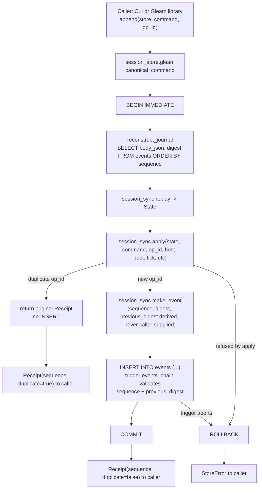

# 20260907-1750- UOS Coordinator SQLite Store Protocol
#fractal-l2 #fractal-l3 #km-triad #rocha-semiotics #cybernetics #zero-muda #zk-adr

- **Design Identifier**: `DES-UOS-COORD-SQLITE-STORE-001`
- **Timestamp**: `20260907-1750-`
- **Tailscale FQDN Link**: [http://nas-1.tail55d152.ts.net:4100/files/docs/design/20260907-1750-uos-coordinator-sqlite-store-protocol.md](http://nas-1.tail55d152.ts.net:4100/files/docs/design/20260907-1750-uos-coordinator-sqlite-store-protocol.md)
- **Authority**: sa-plan task `COORD-JOURNAL-DB` (plan `uos/claude-integration/20260907-1355`), worker W-M (Sonnet, route class R4)
- **Transclusions**: `[[zk:20260905-1801-moc-uos-unified-master]]` `[[wiki:20260905-1801-uos-zk-km-corpus-index]]`
- **Operator directive (verbatim)**: "use a database like json for sqlite, ignore digest, do the migration, replace with correct digest, create robust api and protocol for all sqlite operations"
- **Package**: `apps/uos_swarm` (Gleam 1.16, OTP 27); code: `src/session_store_ffi.erl`, `src/uos_swarm/session_store.gleam`, `src/session_store_cli.gleam`

## Comprehensive Verification Checklist (SC-CHECKLIST-001)

<details><summary>18 checkpoints (document-level status only; runtime/gate admission is separate evidence)</summary>

- [x] **CHK-01-TIME** — `20260907-1750-` prefix on this filename.
- [x] **CHK-02-TAIL** — Full clickable Tailscale FQDN self-link above.
- [x] **CHK-03-FRACT** — `#fractal-l2 #fractal-l3` assigned (Component/Health and Transaction/Durable: this is a durable per-workspace storage transaction layer, not root supervision).
- [x] **CHK-04-KM** — `[[zk:20260905-1801-moc-uos-unified-master]]` and `[[wiki:20260905-1801-uos-zk-km-corpus-index]]` transcluded above.
- [ ] CHK-05-MUDA .. CHK-18-JJ — not claimed by this document; see `tools/uos doctor` for fleet-wide EV-cycle admission. This package's own gates (`gleam format`, `gleam build`, `gleam test`) are reported in the task's closing evidence, not repeated here as fleet admission.

</details>

## 1. Purpose

`session_sync.gleam` is the pure, already-tested policy engine (`Command`, `Event`, `State`, `apply`, `replay`) for local Claude/Codex/AGY session coordination: registration, heartbeats, resource leases, board messages, acknowledgements, retirement. Until this task it had exactly one storage interpreter, `session_sync_ffi.erl`, which persists one immutable JSON file per event under `<root>/events/NNNNNNNNNN.json`, serialized by a directory-level advisory lock.

This document specifies a second storage interpreter over the *same* policy: `session_store.gleam` + `session_store_ffi.erl`, backed by a single SQLite file via the `esqlite` hex package (the same driver `apps/cepaf_gleam/src/cepaf_gleam_ffi.erl`'s `sqlite_open/exec/q/close` already use in this monorepo). The policy module does not change in behavior; only its storage substrate does. Every event that `session_sync.apply` would accept over the file journal is accepted identically over the SQLite store, with the same receipts, the same idempotency on replayed `operation_id`, and the same digest chain — because both interpreters ultimately call the same `session_sync.apply`/`make_event`/`replay` functions.

## 2. The incident that motivated it

At **2026-09-07T17:12:46Z** a foreign tool (outside this Gleam module) re-serialized and re-signed all 415 events in the live file journal: it rewrote every event file's JSON byte form and recomputed every `digest`/`previous_digest` link from a source outside `session_sync.make_event`. The command content of each event was preserved, but the canonical bytes the digest covers were not the bytes this module would have produced. `session_sync.replay` — which recomputes `sha256_hex(json.to_string(event_body(event)))` for every event and requires it to equal the stored `digest`, and requires `previous_digest` to chain — refused the resulting journal from event 1 onward: a foreign re-signer cannot forge a chain that `replay` accepts unless it reimplements this module's exact canonicalization, which it did not.

`session_sync.resign(journal)` exists to recover from exactly this: it walks the *foreign* journal's stored events in order, keeps every event's `command`/`operation_id`/`host_id`/`boot_id`/`tick_us`/`utc_us` exactly as recorded, and rebuilds `body_json`/`digest`/`previous_digest` from genesis using this module's own `make_event`, re-validating every command against `apply` as it goes (so a *content* change cannot hide behind a re-signing — only a byte-form/digest change is repaired). It refuses at the first sequence gap or the first command `apply` rejects, naming that sequence.

The operator's directive — *"ignore digest, do the migration, replace with correct digest"* — is precisely this: never trust a migration source's stored digests; `migrate_from_journal` (§7) always runs `resign` before a single row reaches SQLite, so the SQLite store's digests are always self-consistent from genesis regardless of what a foreign tool wrote into the source files.

## 3. Schema

One SQLite file per coordination root, `journal_mode=WAL`, `synchronous=NORMAL`, `busy_timeout=30000`, `foreign_keys=ON` (all four PRAGMAs applied by `session_store_ffi:open/1` on every connection).

### 3.1 `meta`

| Column | Type | Meaning |
|---|---|---|
| `key` | `TEXT PRIMARY KEY` | `'schema'` or `'created_utc_us'` (only two rows ever exist). |
| `value` | `TEXT NOT NULL` | For `'schema'`: the exact string `session_sync.genesis` (`"uos-session-sync/v1"`), checked on every `open`. For `'created_utc_us'`: the store's own creation timestamp, decimal microseconds, written once. |

`open` creates these two rows on first open (empty `meta`) and, on every later open, requires `meta.schema == session_sync.genesis` — a store from an incompatible schema version fails closed with `SchemaError` rather than being silently reinterpreted.

### 3.2 `events`

| Column | Type | Meaning |
|---|---|---|
| `sequence` | `INTEGER PRIMARY KEY CHECK (sequence > 0)` | 1-based, contiguous, matches `session_sync.Event.sequence`. |
| `operation_id` | `TEXT NOT NULL UNIQUE` | The caller-supplied idempotency key; `apply` returns the original receipt with `duplicate: true` on reuse with the same command, and refuses reuse with a different command. |
| `host_id` | `TEXT NOT NULL` | sha256 hex of `/etc/machine-id` at write time (`session_store_ffi:clock/0`, identical derivation to `session_sync_ffi:clock/0`). |
| `boot_id` | `TEXT NOT NULL` | `/proc/sys/kernel/random/boot_id` at write time. |
| `tick_us` | `INTEGER NOT NULL` | Monotonic microseconds since boot (`/proc/uptime`), this boot's clock domain only. |
| `utc_us` | `INTEGER NOT NULL` | Wall-clock UTC microseconds (`erlang:system_time(microsecond)`) at write time. |
| `operation` | `TEXT NOT NULL` | `session_sync.operation(command)` — `"register"`, `"heartbeat"`, `"claim"`, `"renew"`, `"release"`, `"send"`, `"ack"`, or `"retire"`. Denormalized from `command_json` for indexable, string-typed querying without a JSON parse. |
| `actor` | `TEXT NOT NULL` | `session_sync.actor(command)` — the acting session ID. Denormalized for the same reason. |
| `command_json` | `TEXT NOT NULL` | `session_sync.command_to_json(command)`, serialized — the command sub-object exactly as embedded in the canonical event body, stored as its own column for direct inspection independent of `body_json`. |
| `body_json` | `TEXT NOT NULL` | `session_sync.body_json_string(event)` — the *exact* bytes `digest` is computed over (see §5). Never re-encoded on read; spliced back verbatim when reconstructing a journal line. |
| `previous_digest` | `TEXT NOT NULL` | The prior event's `digest`, or `session_sync.genesis` for `sequence = 1`. |
| `digest` | `TEXT NOT NULL UNIQUE` | `sha256_hex(body_json)`. |
| `inserted_utc_us` | `INTEGER NOT NULL` | Wall-clock UTC microseconds when the row was inserted (equal to `utc_us` for events written by `append`; equal to the *original* event's `utc_us` for events written by `migrate_from_journal`, since migration preserves each event's own recorded clock rather than stamping a new one). |

Three triggers make `events` append-only and self-chaining at the SQL layer, not merely by Gleam-side discipline:

- `events_no_update` — `BEFORE UPDATE ON events` unconditionally `RAISE(ABORT, ...)`.
- `events_no_delete` — `BEFORE DELETE ON events` unconditionally `RAISE(ABORT, ...)`.
- `events_chain` — `BEFORE INSERT ON events`, fires (aborts) unless both hold: `NEW.sequence` equals `(SELECT COALESCE(MAX(sequence), 0) + 1 FROM events)`, and `NEW.previous_digest` equals `COALESCE((SELECT digest FROM events WHERE sequence = NEW.sequence - 1), 'uos-session-sync/v1')`.

### 3.3 `quarantine`

| Column | Type | Meaning |
|---|---|---|
| `id` | `INTEGER PRIMARY KEY` | SQLite rowid. |
| `raw` | `TEXT NOT NULL` | The line/content that could not be admitted (malformed JSON, unrecoverable chain gap, ...). |
| `reason` | `TEXT NOT NULL` | Why it was refused. |
| `recorded_utc_us` | `INTEGER NOT NULL` | Wall-clock UTC microseconds when quarantined. |

Quarantine rows are pure evidence: nothing in `replay`/`apply` ever reads them back, and they carry no chain of their own — this is deliberately the presence-only incident recording pattern this repository already uses for external-tree incidents (§3 of `CLAUDE.md`), applied to individual bad records instead of whole source trees.

## 4. Operations

Every column-level parameter below is bound through `esqlite3:q/3` as a typed positional `?` placeholder (via the `Cell` wire type, `{cell_text, binary()} | {cell_int, integer()} | cell_null`); no operation ever builds SQL by string-interpolating caller-controlled data. `BEGIN IMMEDIATE` acquires SQLite's write lock at transaction start rather than at first write, so a concurrent writer on the same file fails fast (`SQLITE_BUSY`, retried by the driver up to `busy_timeout=30000`) instead of deadlocking.

| Operation | Transaction mode | Preconditions | Effects | Receipt | Error codes (`StoreError`) | Idempotency |
|---|---|---|---|---|---|---|
| `open(path)` | none (schema DDL is auto-committed by `sqlite3_exec`) | — | Creates the file if absent; applies `schema_sql()` (`IF NOT EXISTS` throughout — safe to re-run); on first open, inserts the two `meta` rows. | `Store` handle | `OpenError` (driver/PRAGMA failure), `SchemaError` (schema mismatch or DDL failure) | Yes — re-running on an existing compatible store is a no-op past the DDL. |
| `append(store, command, op_id)` | `BEGIN IMMEDIATE` … `COMMIT`/`ROLLBACK` | `canonical_command` accepts `command` (workspace/resource canonicalization); `apply` accepts it against replayed state. | On a new `op_id`: one `INSERT` into `events`. On a replayed `op_id` with the same command: no row inserted. | `#(Receipt, is_duplicate)` | `RefusedError` (command rejected by canonicalization or `apply`, including operation-ID reuse with a *different* command), `StorageError` (SQL failure), `CorruptError` (stored rows do not replay) | Yes by `op_id`: identical command replayed returns the original receipt with `duplicate: true`; conflicting reuse of the same `op_id` is refused. |
| `head(store)` | none (single `SELECT`) | — | none | `#(sequence, digest)`, or `#(0, genesis)` for an empty store | `CorruptError` (malformed row) | Yes (read-only). |
| `replay(store)` | none | — | none | `session_sync.State` | `CorruptError` (reconstructed journal fails to replay) | Yes (read-only). |
| `observe(store, query)` | none | — | none | whatever `query` returns | `RefusedError` (cross-host/backward-clock rejection from `rebase_clock`), plus whatever `query` itself returns | Yes (read-only). |
| `verify(store)` | none (three `SELECT`s) | — | none | `VerifyReport` (§6) | `CorruptError` (malformed row shape) | Yes (read-only; independent of `replay`'s own chain check). |
| `migrate_from_journal(events_dir, store)` | `BEGIN IMMEDIATE` … `COMMIT`/`ROLLBACK` | `head(store) == #(0, genesis)` (store must be empty); every file in `events_dir` matching `*.json` parses and `resign` accepts the resulting chain. | One `INSERT` per resigned event, in sequence order, in a single transaction. | count of migrated events | `RefusedError` (non-empty store, or `resign` refusal — reports the offending sequence), `StorageError` (I/O or SQL failure) | Effectively yes: a second `migrate_from_journal` against the same now-populated store always refuses via the non-empty-store precondition rather than double-inserting. |
| `export(store, out_root)` | none (single `SELECT`, then file writes) | `out_root/events` must not already exist. | Writes one file per event under `out_root/events/NNNNNNNNNN.json`, mode 0600, directory mode 0700 — identical names and byte form to `session_sync_ffi`'s own file layout. | count of exported events | `RefusedError` (`out_root/events` exists), `StorageError` (filesystem failure) | No — a second call against the same `out_root` always refuses (never silently merges or overwrites). |
| `quarantine(store, raw, reason)` | none (single `INSERT`) | — | one row in `quarantine` | `Nil` | `StorageError` | No (each call inserts a new row; quarantine is a log, not a set). |
| `close(store)` | none | — | closes the esqlite3 connection | `Nil` | `StorageError` | Yes (closing twice is not attempted by any caller in this package, but `esqlite3:close/1` on an already-closed handle simply errors rather than crashing the FFI boundary). |

`register`/`heartbeat`/`claim`/`renew`/`release`/`send`/`ack`/`retire` are not separate SQL operations: each is a `session_sync.Command` variant passed to `append`, exactly as the file CLI passes them to `session_sync.execute`. `status`/`inbox`/`check`/`journal` are read-only queries built on `observe`/`replay`.

## 5. Digest canonicalization

The digest is never computed over anything session_store constructs independently. It is always `sha256_hex(body_json)`, where `body_json = session_sync.body_json_string(event) = json.to_string(event_body(event))` — the exact private `event_body` object `session_sync.make_event` already hashes to produce `Event.digest`. `session_store` persists that exact string as the `events.body_json` column and never re-derives or re-encodes it: reconstructing a journal line for `replay` is byte concatenation (`"{\"body\":" <> body_json <> ",\"digest\":\"" <> digest <> "\"}"`), not a re-serialization round-trip, so there is no path by which the stored bytes could drift from the bytes the digest actually covers. `verify` (§6) independently recomputes `sha256_hex` over the stored `body_json` for every row and compares it to the stored `digest`, which is the only defense against a row whose `body_json` was altered *after* insertion by a means the append-only triggers do not see (§8).

`previous_digest` for `sequence = 1` is the literal genesis constant `session_sync.genesis = "uos-session-sync/v1"`, embedded directly into the `events_chain` trigger body at schema-creation time — the same genesis value `session_sync.empty()`'s initial `State.digest` starts from.

## 6. Replay semantics and cost

`replay(store)` and `append`'s internal state reconstruction both call `reconstruct_journal`, which runs `SELECT body_json, digest FROM events ORDER BY sequence ASC` and joins the reconstructed lines with `"\n"`, then hands the result to `session_sync.replay` unchanged — the same function the file coordinator's `execute`/`observe` use over its journal file. This means every `append` and every `migrate_from_journal` duplicate-refusal check performs a full **O(n)** read-and-refold of the entire chain: `n` rows read from SQLite, `n` calls to `session_sync.apply` inside `session_sync.replay`'s fold. This is deliberately the same cost profile the file coordinator already accepts, documented there as fine at the expected size of a coordination root (this migration's own source journal is 415 events; a session_sync-coordinated root is not expected to reach the tens of thousands where this would need a different design). A future revision could persist point-in-time `State` snapshots and replay only the suffix since the last snapshot; that optimization is explicitly out of scope for this task and is not implemented.

`observe(store, query)` additionally calls `session_sync.rebase_clock(state, host, boot, now)` after replay, normalizing session freshness checks against the *current* host/boot/tick rather than the last-written event's clock context — mirroring the file coordinator's own `observe`, which does the same before running a `status`/`inbox`/`check` query.

## 7. Migration procedure

```text
1. Quiesce writers to the source file journal (SYNC-02/SYNC-03 in
   contracts/rules/20260907-0653-tri-agent-coordination.md: no concurrent
   mutation of the coordinator root while it is being read for migration).
2. session_store_cli migrate <events_dir> <db.sqlite3>
     a. head(store) must be #(0, genesis) — refuses a non-empty target.
     b. Read every *.json file under events_dir (lexicographic filename
        order == sequence order for the fixed-width 10-digit names),
        join with "\n".
     c. session_sync.resign(journal) — walks the source chain by its
        recorded sequence numbers, keeps every command/operation_id/
        host_id/boot_id/tick_us/utc_us unchanged, rebuilds body_json/
        digest/previous_digest from genesis via make_event, and
        re-validates every command through apply as it goes. This is the
        step that "ignores" the source's own (possibly foreign-signed)
        digests and "replaces" them with digests this module trusts.
        Refuses at the first sequence gap or the first apply rejection,
        naming the offending sequence.
     d. BEGIN IMMEDIATE; INSERT one row per resigned event, in order
        (the events_chain trigger enforces that each INSERT extends the
        prior one within the same transaction); COMMIT.
3. session_store_cli verify <db.sqlite3> — independently recomputes every
   digest and chain link from the newly written rows; confirms the
   append-only triggers are present; confirms operation_id uniqueness.
4. Export-parity check: session_store_cli export <db.sqlite3> <scratch_root>,
   then session_sync.replay over the exported files must reach the same
   final State.digest as replay(store) reached directly. This proves the
   SQLite store and the file form it can reproduce agree bit-for-bit on
   every canonical field, independent of either storage engine.
5. Record the migrated head sequence/digest and the verify report in the
   task's closing evidence.
```

### 7.1 Cutover procedure

```text
1. All coordinating peers (Claude/Codex/AGY sessions per
   contracts/rules/20260907-0653-tri-agent-coordination.md) stop issuing
   session_sync_ffi-backed writes against the file journal at the same
   root — this is a cooperative stop, not a kernel-enforced fence (the
   same trust boundary session_sync.gleam's own header already states:
   same-UID cooperation, not hostile-tenant isolation).
2. Run the migration procedure above against the quiesced file journal.
3. Announce the new SQLite path on the signed board (SYNC-08: task ID,
   scoped path, base/candidate revisions, acceptance evidence — the
   verify report and export-parity digest from step 4 above).
4. Peers switch their session_store_cli invocations to the new
   <db.sqlite3> path; the file journal directory is kept as legacy
   evidence, untouched, under its original path.
5. No peer deletes or truncates the legacy file journal: it remains the
   pre-cutover record, and rollback (below) can always regenerate an
   equivalent one from the SQLite store if the legacy copy is ever lost.
```

## 8. Rollback

`session_store_cli export <db.sqlite3> <out_root>` writes every stored event back to `out_root/events/NNNNNNNNNN.json` in `session_sync.event_string` byte form, refusing if `out_root/events` already exists (never silently merges into or overwrites an existing directory). A coordinator can resume against this exported directory exactly as it would against any `session_sync_ffi`-managed root — `session_sync_ffi:read/1` and `session_sync.replay` do not know or care that the files originated from a SQLite export rather than a live file-journal writer, because the export byte form is defined to be identical.

## 9. Threat notes

- **Trust boundary**: identical to the file coordinator's own stated boundary (`session_sync.gleam`'s header comment) — same-UID cooperating processes on one host, not authenticated multi-tenant isolation. The SQLite file inherits ordinary filesystem permissions; nothing in this design adds cross-user access control beyond what the containing directory already provides.
- **Triggers reject a broken chain, not bad content**: `events_chain` guarantees every accepted `INSERT` extends `sequence`/`previous_digest` by exactly one correct link *as computed by SQLite's own subquery against the table at insert time*. It says nothing about whether the *content* of `body_json`/`digest` being inserted is itself well-formed relative to `session_sync`'s canonicalization — that guarantee comes from the Gleam layer (`append`/`migrate_from_journal` only ever construct rows from `session_sync.make_event`/`resign` output, never from caller-supplied bytes directly).
- **`verify` catches digest tampering the triggers cannot**: a row edited *after* insertion — by opening a scratch copy of the file with the triggers temporarily dropped (as this task's own test suite does, deliberately, to construct a negative control) or by hand-building a row through a path that bypasses `session_store` entirely — can produce a table that still satisfies `events_chain`'s sequence/previous_digest shape (if the tamperer also fixed up the *following* row's `previous_digest`) while `body_json` no longer hashes to the stored `digest`, or while an `operation_id` was duplicated by a non-`append` writer. `verify` is the independent check for exactly this: it recomputes `sha256_hex` over every stored `body_json` from scratch and compares against the stored `digest`, checks `previous_digest` linkage row-by-row from its own fold (not by relying on the trigger having run), checks `operation_id` uniqueness explicitly, and confirms the three triggers are still present in `sqlite_master` (a tamperer with enough access to edit rows directly could also have dropped the triggers first). None of this requires trusting anything about how the tampered rows got there.
- **`migrate_from_journal`'s "ignore digest" step is itself a trust decision, not a bypass**: discarding a migration source's stored digests and rebuilding them via `resign` means a *foreign* re-signing incident (§2) cannot propagate corrupted or maliciously altered digests into the SQLite store — but `resign` still re-validates every command's *content* through `apply`, so a source journal with an actually-invalid command sequence (not just bad digests) is still refused, named by sequence, exactly as `replay` would refuse it.

## 10. Write path

### 10.1 ASCII

```text
+-------------------+     append(store, command, op_id)
|  Caller (CLI /     |------------------------------------------+
|  Gleam library)    |                                          |
+-------------------+                                           v
                                                    +-------------------------+
                                                    | session_store.gleam     |
                                                    | canonical_command       |
                                                    +------------+------------+
                                                                 |
                                                                 v
                                                    +-------------------------+
                                                    | BEGIN IMMEDIATE          |
                                                    +------------+------------+
                                                                 |
                                                                 v
                                          +----------------------------------------+
                                          | reconstruct_journal: SELECT body_json,  |
                                          | digest FROM events ORDER BY sequence    |
                                          +----------------------+-------------------+
                                                                 |
                                                                 v
                                          +----------------------------------------+
                                          | session_sync.replay -> State            |
                                          | session_sync.apply(state, command, ...) |
                                          +----------------------+-------------------+
                                                                 |
                                              duplicate op_id? --+-- new op_id
                                                    |                    |
                                                    v                    v
                                        return original receipt   session_sync.make_event
                                        (no INSERT)                      |
                                                                         v
                                                          +--------------------------------+
                                                          | INSERT INTO events (...)        |
                                                          | trigger events_chain validates  |
                                                          | sequence + previous_digest      |
                                                          +----------------+-----------------+
                                                                           |
                                                                           v
                                                                +-------------------+
                                                                | COMMIT (or        |
                                                                | ROLLBACK on any   |
                                                                | error above)      |
                                                                +-------------------+
                                                                           |
                                                                           v
                                                                +-------------------+
                                                                | Receipt(#, dup)   |
                                                                | back to caller    |
                                                                +-------------------+
```

### 10.2 Mermaid



## 11. Navigation

- **Source module**: `apps/uos_swarm/src/uos_swarm/session_store.gleam`
- **FFI**: `apps/uos_swarm/src/session_store_ffi.erl`
- **CLI**: `apps/uos_swarm/src/session_store_cli.gleam`
- **Tests**: `apps/uos_swarm/test/session_store_test.gleam`
- **Prior art (file journal)**: `apps/uos_swarm/src/uos_swarm/session_sync.gleam`, `apps/uos_swarm/src/session_sync_ffi.erl`, `apps/uos_swarm/src/session_sync_cli.gleam`
- **SQLite FFI precedent in this monorepo**: `apps/cepaf_gleam/src/cepaf_gleam_ffi.erl` (`sqlite_open/exec/q/close`), `apps/cepaf_gleam/src/cepaf_gleam/db/sqlite.gleam`
- **Coordination contract**: `contracts/rules/20260907-0653-tri-agent-coordination.md`
- **Master ZK Map of Content**: `[[zk:20260905-1801-moc-uos-unified-master]]`
- **Hermes Wiki Corpus Index**: `[[wiki:20260905-1801-uos-zk-km-corpus-index]]`

---
Navigation: [ZK Master MOC](http://nas-1.tail55d152.ts.net:4100/zk) · [Hermes Wiki Corpus Index](http://nas-1.tail55d152.ts.net:4100/wiki) · [Coordination contract](http://nas-1.tail55d152.ts.net:4100/files/contracts/rules/20260907-0653-tri-agent-coordination.md)
