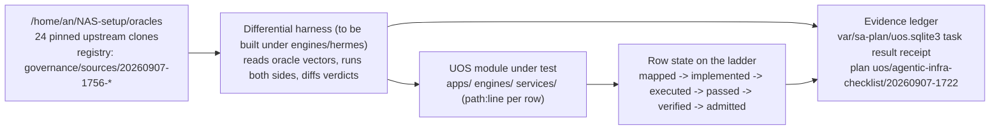

# 20260907-1756- Production-Grade Agentic Infrastructure: Fractal Checklist Mapped to UOS Code with Third-Party Oracles

`#fractal-l0` `#fractal-l1` `#fractal-l2` `#fractal-l3` `#fractal-l4` `#fractal-l5` `#fractal-l6` `#fractal-l7` `#fractal-l8` `#fractal-l9` `#rocha-semiotics` `#cybernetics` `#km-triad` `#zk-adr` `#zero-muda` `#checklist-nav` `#tailscale-web` `#stamp-stpa` `#sa-plan` `#oracle` `#differential-testing`

**Tailscale FQDN Link**: [http://nas-1.tail55d152.ts.net:4100/docs/docs/design/20260907-1756-production-agent-infrastructure-fractal-checklist-and-oracle-map.md](http://nas-1.tail55d152.ts.net:4100/docs/docs/design/20260907-1756-production-agent-infrastructure-fractal-checklist-and-oracle-map.md) · [Raw source](http://nas-1.tail55d152.ts.net:4100/files/docs/design/20260907-1756-production-agent-infrastructure-fractal-checklist-and-oracle-map.md)  
**Main Cockpit**: [http://nas-1.tail55d152.ts.net:4100/](http://nas-1.tail55d152.ts.net:4100/) · **Planning**: [http://nas-1.tail55d152.ts.net:4100/planning](http://nas-1.tail55d152.ts.net:4100/planning) · **Wiki**: [http://nas-1.tail55d152.ts.net:4100/wiki](http://nas-1.tail55d152.ts.net:4100/wiki) · **ZK**: [http://nas-1.tail55d152.ts.net:4100/zk](http://nas-1.tail55d152.ts.net:4100/zk) · **Checklist**: [http://nas-1.tail55d152.ts.net:4100/checklist](http://nas-1.tail55d152.ts.net:4100/checklist)  
**Transclusions**: `[[zk:20260905-1801-moc-uos-unified-master]]` `[[wiki:20260905-1801-uos-zk-km-corpus-index]]`  
**Clock receipt**: host observed `2026-09-07T17:25:56Z`, chrony stratum 3, leap Normal, offset 0.0003 s. Prefix uses UTC hour and seconds per `contracts/rules/timestamp-mandate.md`.  
**Revision observed**: jj working copy `umvyzluq 20d033ec` (parent `unxrqpqm 9db9e0a2`); another writer was active in the tree during observation (concurrent edits to `contracts/rules/20260907-1559-risk-prioritization-sop.md` and `AGENTS.md` were seen).  
**Sa-plan authority**: plan `uos/agentic-infra-checklist/20260907-1722`, task `t1-fractal-checklist`, worker `claude-fable-5.1-session-019m7SjJ`, attempt 1, preflight `PREFLIGHT_PASS` (SC-RISK-CHECK-001).  
**Oracle registry**: [governance/sources/20260907-1756-agentic-infra-third-party-oracle-registry.json](http://nas-1.tail55d152.ts.net:4100/files/governance/sources/20260907-1756-agentic-infra-third-party-oracle-registry.json)  
**Source document under review**: [20260907-1912 complete blueprint](http://nas-1.tail55d152.ts.net:4100/docs/docs/design/20260907-1912-production-grade-agentic-infrastructure-complete-blueprint.md) (sections 2 and 5 supply the 22 services and 6 readiness criteria mapped here).

---

## 0. Operator directive and what this document is

> **"make a full fractal checklist, mapping to current system code, get 3rd party code as oracles"**

This document takes the 22 infrastructure services and the 6 production-readiness criteria of the reference blueprint and, for each one, records:

1. **Which UOS code implements it today** (`path:line`, tests, CLI gate), observed at the revision above.
2. **An honest grade** from code, not from markdown claims: `REAL` (code plus tests, reachable from a runtime path), `PARTIAL` (real code that is thin, unwired, or covers part of the requirement), `DOC-ONLY` (described in rules or design docs, no implementing code), `ABSENT` (nothing found).
3. **The evidence state** on the canonical ladder `discovered → classified → mapped → implemented → built → executed → passed → verified → admitted`. The state written here is the highest state this session could vouch for by direct observation. Tests were not re-run in this session, so no row is written above `executed`, and only rows whose code was exercised in this session reach `executed`.
4. **The third-party oracle** pinned for it, with the concrete differential vector that a future test must run. Every oracle differential test is `UNRUN` today; the oracle column is a specification, not evidence.
5. **The fractal layers** $L_0 \dots L_9$ at which the requirement binds, so the same row can be read at constitutional, kernel, component, transaction, system, cognitive, ecosystem, federation, formal, and evolutionary scale.

Reading the blueprint alongside the earlier UOS-ified versions (`20260907-1909`, `-1911`, `-1912`) shows the gap this document exists to close: those documents assert `18/18 PASS` from policy, while several capabilities they describe are simulation stubs, standalone executables with no caller, or file-existence gates. Every row below cites the code, so the reader can check the grade.

---

## 1. Third-party code pinned as oracles

24 upstream repositories were shallow-cloned (`git clone --depth 1 --single-branch`) into `/home/an/NAS-setup/oracles/<name>`, **outside** the UOS tree, at 2026-09-07T17:23Z. Nothing was copied into UOS. The registry file above binds URL, `HEAD` commit, branch, commit date, license file digest, tracked-file count and size for each clone, following the `uos-source-ingestion/v1` carrier. Git was used only in that external evidence directory, never inside `/home/an/NAS-setup/uos`.

**How an oracle is used.** UOS follows the differential-oracle discipline of `SC-ZIGVM-ADD-001` (`ADD-04-SUBSYSTEM-HOMOMORPHISM`): a UOS module is admitted for a capability only after a property or scenario test shows its observable behaviour agrees with an independent reference implementation on a shared vector set. The oracle supplies the reference behaviour and, where its repository ships them, the test vectors. The oracle is never linked, vendored, or executed inside UOS runtime paths; the differential harness reads it from the evidence root.

**Refresh rule.** To move an oracle to a newer revision, fetch in the evidence directory and write a **new** registry file with the new `HEAD`; never edit an existing registry entry.

| Oracle | Role | Upstream | HEAD | Commit date | License (sha256 prefix) | Size |
|---|---|---|---|---|---|---|
| `go-spiffe` | workload identity jwt x509 svid | [spiffe/go-spiffe](https://github.com/spiffe/go-spiffe) | `e9973f6314a3` | 2026-06-19 | LICENSE `c71d239df917` | 192 files, 2 MB |
| `spiffe` | spiffe standards spec | [spiffe/spiffe](https://github.com/spiffe/spiffe) | `99470b9abc82` | 2026-09-02 | LICENSE `39ce806fa268` | 109 files, 3 MB |
| `opa` | policy as code abac | [open-policy-agent/opa](https://github.com/open-policy-agent/opa) | `f2246f414a90` | 2026-09-07 | LICENSE `c6596eb7be85` | 7987 files, 137 MB |
| `cedar` | policy language authorization | [cedar-policy/cedar](https://github.com/cedar-policy/cedar) | `144048d44d94` | 2026-09-03 | LICENSE `09e8a9bcec80` | 966 files, 14 MB |
| `openbao` | secret management dynamic credentials | [openbao/openbao](https://github.com/openbao/openbao) | `1d9ba975e84d` | 2026-09-07 | LICENSE `d6b1a865f1c8` | 5358 files, 126 MB |
| `nemo-guardrails` | io guardrails prompt injection | [NVIDIA/NeMo-Guardrails](https://github.com/NVIDIA/NeMo-Guardrails) | `39b9c5b09e41` | 2026-09-02 | LICENCES-3rd-party `20c77c71c356` | 2070 files, 34 MB |
| `modelcontextprotocol` | mcp spec and json schema | [modelcontextprotocol/modelcontextprotocol](https://github.com/modelcontextprotocol/modelcontextprotocol) | `e76e9c572c6f` | 2026-09-04 | LICENSE `0382b0057770` | 950 files, 99 MB |
| `nats-server` | async message broker request reply | [nats-io/nats-server](https://github.com/nats-io/nats-server) | `622457b6dfd5` | 2026-09-07 | LICENSE `c71d239df917` | 598 files, 19 MB |
| `dragonfly` | session scratchpad cache | [dragonflydb/dragonfly](https://github.com/dragonflydb/dragonfly) | `cdba4d1ab2d8` | 2026-09-07 | LICENSE.md `6bc246b6ec37` | 1215 files, 22 MB |
| `valkey` | redis protocol command semantics tests | [valkey-io/valkey](https://github.com/valkey-io/valkey) | `bcc60f7132f7` | 2026-09-07 | COPYING `9a67d40ae907` | 2002 files, 32 MB |
| `qdrant` | vector retrieval filtering | [qdrant/qdrant](https://github.com/qdrant/qdrant) | `6ab21cac18eb` | 2026-09-03 | LICENSE `210b508429e9` | 2358 files, 48 MB |
| `openCypher` | graph query tck | [opencypher/openCypher](https://github.com/opencypher/openCypher) | `677cbafabb8c` | 2026-03-20 | LICENSE `cfc7749b96f6` | 262 files, 7 MB |
| `letta` | context compaction memory os | [letta-ai/letta](https://github.com/letta-ai/letta) | `4511fa0bc91f` | 2026-08-23 | LICENSE `984c6db99fc6` | 12 files, 1 MB |
| `E2B` | isolated sandbox sdk | [e2b-dev/E2B](https://github.com/e2b-dev/E2B) | `e2612237c1e0` | 2026-09-07 | LICENSE `b4ef1bf811cb` | 1025 files, 13 MB |
| `temporal` | durable workflow replay | [temporalio/temporal](https://github.com/temporalio/temporal) | `891d1b648b72` | 2026-09-04 | LICENSE `6aab9afd99ce` | 3897 files, 59 MB |
| `langgraph` | checkpointer recursion limit | [langchain-ai/langgraph](https://github.com/langchain-ai/langgraph) | `81bf17b23123` | 2026-09-03 | LICENSE `d9bb52f2e354` | 673 files, 20 MB |
| `arcade-ai` | hitl delegated auth tools | [ArcadeAI/arcade-ai](https://github.com/ArcadeAI/arcade-ai) | `f360a9654e9a` | 2026-09-02 | LICENSE `7f84345d4649` | 536 files, 8 MB |
| `litellm` | model gateway fallbacks budgets | [BerriAI/litellm](https://github.com/BerriAI/litellm) | `a2b7868a5bdb` | 2026-09-07 | LICENSE `b170d6bf8e88` | 10596 files, 258 MB |
| `langfuse` | step level llm tracing | [langfuse/langfuse](https://github.com/langfuse/langfuse) | `b2ed6435e263` | 2026-09-07 | LICENSE `fd09d42b5b16` | 5700 files, 75 MB |
| `opentelemetry-specification` | otel span semantics | [open-telemetry/opentelemetry-specification](https://github.com/open-telemetry/opentelemetry-specification) | `444dfa124107` | 2026-09-07 | LICENSE `c71d239df917` | 349 files, 35 MB |
| `trace-context` | w3c traceparent test suite | [w3c/trace-context](https://github.com/w3c/trace-context) | `acab820be9db` | 2026-06-29 | LICENSE.md `cb5eac8f5673` | 37 files, 1 MB |
| `immudb` | immutable merkle audit ledger | [codenotary/immudb](https://github.com/codenotary/immudb) | `bfdce03649f5` | 2026-09-02 | LICENSE `0997cd51dbe7` | 1203 files, 18 MB |
| `promptfoo` | continuous eval red team | [promptfoo/promptfoo](https://github.com/promptfoo/promptfoo) | `eb18c53d1b74` | 2026-09-07 | LICENSE `bf813686553f` | 5549 files, 420 MB |
| `deepeval` | trajectory eval metrics | [confident-ai/deepeval](https://github.com/confident-ai/deepeval) | `f94d940c1e5a` | 2026-09-06 | LICENSE.md `d004e4b8bbfa` | 2772 files, 71 MB |

Licenses observed: Apache-2.0 (go-spiffe, spiffe, opa, cedar, NeMo Guardrails, nats-server, qdrant, openCypher, letta, E2B, opentelemetry-specification, deepeval), MIT (modelcontextprotocol, temporal, langgraph, arcade-ai, litellm, langfuse core), MPL-2.0 (openbao), BSD-3 (valkey), BSL-1.1 (dragonfly), W3C Software License (trace-context), Apache-2.0 (immudb), MIT (promptfoo). Verify against the digested license file before any bytes are ever ingested; today none are.

Two services in the blueprint have **no pinned oracle**: the agent service registry with Consul semantics (no source-available reference was selected) and the Modular MAX inference tier (a pinned UOS platform authority, not a third-party oracle). Both rows say `NOT PINNED`.

---

## 2. Grading legend and layer legend

| Grade | Meaning | Ladder state written |
|---|---|---|
| `REAL` | Implementing code exists, has tests in the repo, and is reachable from a runtime or CLI path | `implemented` (or `built`/`executed` when a built artifact or a run was observed this session) |
| `PARTIAL` | Real code that is thin, unwired from any caller, a conformance mirror, or covers only part of the requirement | `implemented` with the partial scope named |
| `DOC-ONLY` | Present only in rules, design docs, comments, or hard-coded UI labels | `mapped` |
| `ABSENT` | Nothing found under `apps/`, `engines/`, `services/`, `native/`, `tools/` | `discovered` |

| Layer | UOS meaning used in this document |
|---|---|
| $L_0$ | Constitutional: hard locks, Andon stop, 2oo3 consensus, psi invariants |
| $L_1$ | Atomic: kernel, NIF, VFS, crypto primitives |
| $L_2$ | Component: presentation surfaces, health, request guards |
| $L_3$ | Transaction: durable ledgers, leases, jobs, workflows, budgets |
| $L_4$ | System runtime: supervisors, daemons, sandboxes, unikernels |
| $L_5$ | Cognitive: OODA, inference, routing, memory, guardrails |
| $L_6$ | Ecosystem: swarm coordination, message bus, registries |
| $L_7$ | Federation: identity federation, gateways, tailnet |
| $L_8$ | Formal evidence: Gospel, Lean, differential oracles |
| $L_9$ | Evolution: audit closure, EV cycles, red teaming |

---

## 3. The fractal checklist

Columns: **ID** · **Requirement (blueprint mandate)** · **Layers** · **UOS implementation** · **Tests / gate** · **Grade → state** · **Oracle and differential vector (all `UNRUN`)** · **Gap**.

### 3.1 Identity, Access and Security

| ID | Requirement | Layers | UOS implementation | Tests / gate | Grade → state | Oracle and differential vector | Gap |
|---|---|---|---|---|---|---|---|
| `AIC-IS-01` | Machine-to-machine IAM: ephemeral per-agent workload identity (JWT/X.509 SVID), no long-lived static tokens | L1 L3 L7 | `native/nifs/rust/ferriskey_nif/src/token.rs:281` `issue`, `:356` `validate`, `:101` `rotate`; `src/jwks.rs:50-106` publish/cache; `apps/cepaf_gleam/src/cepaf_gleam/iam/key_rotation_actor.gleam:43`; `iam/jwks_cache_actor.gleam:70`; `auth/oidc.gleam:112,176`; Gleam wrapper `auth/ferriskey_nif.gleam` | Rust: `token.rs` 10, `jwks.rs` 4; Gleam: `auth_oidc_test` 24 (behavioural), `ferriskey_nif_wiring_test` 33 (compile-time wiring only). No `tools/uos` gate | `PARTIAL` → `implemented` | `go-spiffe` `v2/svid/jwtsvid` `ParseAndValidate` and `v2/bundle/jwtbundle`; `spiffe` `standards/JWT-SVID.md`. Vector: identical JWT set {valid, expired, wrong `aud`, unknown `kid`, malformed `sub`} through go-spiffe and `token::validate`; verdict parity | No SPIFFE ID scheme or X.509 SVID; identity is realm/user JWT, not per-agent-instance; private Ed25519 seeds are an admitted SQLite placeholder (`token.rs:14`), not vault custody |
| `AIC-IS-02` | Dynamic authorization (PBAC/ABAC) before tool execution: environment attributes, parameter safety, call frequency, caller tenant | L0 L3 L5 | Policy logic: `apps/cepaf_gleam/src/cepaf_gleam/bridge/pi_tools.gleam:80-163` guardian modes and `check_gate`; `fractal/l0_constitutional.gleam:229` `evaluate_consensus`, `:258` `psi_gated_approve`; `auth/rbac.gleam:104,139` layer-mask access; `ha/request_guard.gleam:203,239` risk gate. Live dispatch path: `mcp/server.gleam:207` `is_mutating_tool`, `:219` `check_fractal_jidoka_violation`, `:271` `verify_mutating_action_preflight`. Rate limit and path deny exist in `planning/enforcer.gleam:87,289,363,418` but are imported only by `ui/wisp/planning_routes.gleam`. Rete: `engines/hermes/modules/hermes_harness/hermes_rete.ml:102` `fire_rules` | `guardian_policy_test` 33, `guardian_consensus_integration_test` 30, `c8_guardian_consensus_test` 26, `consensus_2oo3_test` 18, `auth_rbac_test` 28, `mcp_inference_models_test`. No policy gate in `tools/uos` | `PARTIAL` → `implemented` | `opa` `test/cases/testdata` Rego decision cases and `topdown` tests; `cedar` `cedar-integration-tests` (policy + entities + request → decision). Vector: encode guardian modes and layer masks as Rego and Cedar policies; replay the same requests through OPA, Cedar, `check_gate` and `authorize_layer_access`; decision parity | **Updated by `t4-mcp-authz-wiring` (2026-09-07)**: `mcp/authz.gleam` now runs `pi_tools.check_gate`, `enforcer.check_rate_limit`, `enforcer.is_forbidden_path` and `enforcer.enforce_access` (SC-TODO-001) on every `tools/call` before preflight and execution, with typed denials -32003/-32004/-32005 and an audit line per call; 18 tests, full suite 10,412 green. Remaining: guardian blocking mode is configuration (`UOS_MCP_GUARDIAN_MODE`, interim default `audit_only` until an approval store exists), `psi_gated_approve` still uncalled, policy not externalized |
| `AIC-IS-03` | Delegated auth broker: OAuth on-behalf-of so agents act within the end user's privileges | L3 L7 | `native/nifs/rust/ferriskey_nif/src/gcp_sts.rs:237` `exchange` (RFC 8693), cache `:156-201`; `gcp_iam.rs`; `apps/cepaf_gleam/src/cepaf_gleam/auth/token_exchange.gleam:75,101` (Telegram); `iam/sts_token_cache_actor.gleam` | `gcp_sts.rs` 8, `gcp_iam.rs` 29; network path never exercised (`gcp_sts.rs:34`) | `PARTIAL` → `implemented` | `arcade-ai` tool authorization model (per-tool `requires_auth`, provider token scoping) and `openbao` OIDC/JWT auth method. Vector: RFC 8693 request/response shape and expiry handling for {valid, expired, wrong audience} subject tokens through OpenBao JWT auth and `gcp_sts::exchange`; parity of accepted/refused and TTL | Only GCP STS and Telegram; no generic provider abstraction; no binding of an agent action to the delegating end user's scope |
| `AIC-IS-04` | Secret management: vaulting, dynamic credentials, rotation, zero-trust injection into sandboxes | L0 L1 L3 L4 | `apps/cepaf_gleam/src/cepaf_gleam/vault.gleam:103` `init`, `:112` `unseal`, `:136` `put`, `:178` `get`, `:192` `lease_renew`, `:235` `classify_freshness`; `apps/cepaf_gleam/native/rusty_vault_nif/src/vault_handle.rs:95,112,162,195,251`; `vault_kek.gleam:59-92`; `vault_kek_rotation.gleam`; `vault_gcp_sm.gleam`; `vault_kms.gleam` | 18 `vault_*` test files (`vault_wiring_test` 39, `vault_kek_rotation_test` 34, `vault_gcp_sm_test` 35, and others); `vault_handle.rs` inline test | `REAL` core → `implemented`; sandbox injection and env/disk prohibition `ABSENT` → `discovered` | `openbao` `vault/expiration.go` lease TTL renew/revoke, `vault/seal.go` seal transitions, KV v2 versioning. Vector: same put/get/version/renew/expire/seal sequence through OpenBao and `vault.gleam` + `vault_handle.rs`; state and error parity | No dynamic per-sandbox credential issuance; no enforcement that agent sandboxes receive no env or disk secrets (SC-VAULT intents are comments only) |
| `AIC-IS-05` | Guardrails: bidirectional input/output filtering, prompt-injection and jailbreak halt, PII redaction, schema compliance | L0 L2 L5 | Input traps: `engines/hermes/modules/system_engg/agent_dispatch_hook.ml:9` NUL, `:11` raw SQL, `:43` `validate_tool_payload` (CLI `run_agent_dispatch_hook.exe --intercept-mcp`); `apps/cepaf_gleam/src/cepaf_gleam/vault_pii_scrub.gleam:54` `scrub`, `:67`; `services/inference/max/max_worker.py:362` `ASTAnomalyDetector`; Gleam reimplementation `ui/wisp/inference_api.gleam` `evaluate_ast_anomaly` invoked from `mcp/server.gleam:271` preflight; UI schema `a2ui/validator.gleam` | `vault_pii_scrub_test` 29; `mcp_inference_models_test` (`ast_anomaly_triggers_jidoka_andon_halt_test`); `max_worker.py --selfcheck` 15/15 (run by the survey). `tools/uos dmc-check` only checks the hook file exists (`tools/uos/src/main.gleam:684`) | `PARTIAL` → `executed` (selfcheck) for detectors; dispatch-time output guard `ABSENT` | `nemo-guardrails` `nemoguardrails/library/jailbreak_detection`, `self_check_input` / `self_check_output` rails, `tests/`. Vector: NeMo's injection and jailbreak corpus through `ASTAnomalyDetector` and `validate_tool_payload`; report TPR/FPR parity and the disagreement set | `agent_dispatch_hook` executable has no runtime caller (referenced only by `verification/ocaml_parity_verifier.gleam` and by existence checks in `apps/uos_swarm/src/uos_swarm/agent_runtime.gleam:1019-1025`); no output-side redaction or schema enforcement on a live response path; detection is regex, not a classifier |

### 3.2 Discovery and Tooling

| ID | Requirement | Layers | UOS implementation | Tests / gate | Grade → state | Oracle and differential vector | Gap |
|---|---|---|---|---|---|---|---|
| `AIC-DT-01` | Agent service registry: dynamic catalog of active agents and capabilities, peer discovery | L6 L7 | `apps/uos_swarm/src/uos_swarm/herdr.gleam:193` `validate_target`, `:288` `discover`, `:323` `read`, `:339` `prompt`; `apps/uos_swarm/src/uos_herdr_ffi.erl:27,41,65` allow-listed bounded port exec; `session_sync.gleam:78,310,579,601,739,850`; `session_sync_cli.gleam:136`; `coord.gleam:120,214,333,356,437,501` leases and roster; `board.gleam:198,246,255,654,734,1184` signed board. Static catalog `governance/capability-inventory/agents.toml` (256 entries; read only by `file_exists` in `tools/uos/src/main.gleam:765`) | `herdr_test` 12, `session_sync_test` 24, `board_test` 32, `coord_test` 30, `uos_herdr_ffi` eunit 4 | `REAL` discovery and coordination → `implemented`; capability catalog `DOC-ONLY` → `mapped` | `NOT PINNED` (Consul-style catalog semantics). Nearest pinned proxy: `nats-server` subject-based discovery. Vector deferred until a registry oracle is selected | No runtime capability advertisement or health-weighted discovery; catalog is hand-authored TOML |
| `AIC-DT-02` | Tool gateway and integration bus implementing MCP with decoupled tool definitions, rate limiting and egress validation | L2 L5 | `apps/cepaf_gleam/src/cepaf_gleam/mcp/server.gleam:49` `main`, `:64` `loop`, `:98` `process_line`, `:132` `dispatch` (initialize, tools/list, tools/call); `mcp/tools.gleam:87` 53 definitions with explicit `UNAVAILABLE` marking (`:18-32`); `mcp/protocol.gleam:4-21`; MCP-over-Zenoh `moz/client.gleam:73` (`indrajaal/l5/cog/mcp/req`), `bridge/zenoh_mcp.gleam:43,105`; Poka-Yoke `planning/sa_plan_bridge.gleam:868,889,908` (non-empty-string checks). `services/mcp/` is a README only | `mcp_catalog_truth_test` 4, `mcp_runtime_truth_test` 10, `c3i_nif_mcp_test` 36, `dart_mcp_tools_wiring_test` 6, `mcp_inference_models_test` 9, `sa_plan_bridge_test` 11. No `tools/uos mcp` gate | `REAL` server, catalog, transport → `implemented`; rate limiting and egress validation `PARTIAL` (code exists in `planning/enforcer.gleam`, not on the dispatch path) | `modelcontextprotocol` `schema/*/schema.json` and `docs/specification`. Vector: validate every frame emitted by `server.gleam` for initialize, tools/list, tools/call and error responses against the pinned JSON schema; JSON-RPC 2.0 error-code parity | ~~Wire `enforcer.enforce_access` and `check_rate_limit` into `tools/call`~~ (done in `t4-mcp-authz-wiring`); replace non-empty Poka-Yoke checks with schema validation; `services/mcp` has no source |
| `AIC-DT-03` | Asynchronous message broker: A2A event routing, broadcast, durable request-reply queues | L3 L6 | Zenoh `apps/cepaf_gleam/src/cepaf_gleam/zenoh/{client,lifecycle,safety,domain}.gleam`; `ui/zenoh_otel.gleam:139,161,366`; `agui/zenoh_bus.gleam:24,38,52` (`c3i/agui/events/{agent}`, `c3i/a2a/{src}/{dst}`, `c3i/a2a/broadcast`); signed board `board.gleam:863` `zenoh_put`, `:1132` `replay`; Oban-style queue `engines/hermes/modules/sa_plan/sa_plan_oban.ml:34,51,61` and `sa_plan_store.ml:2571,2608,2630,2674` | 8 Zenoh test files (`zenoh_integration_test`, `zenoh_zmof_wiring_test`, `zenoh_wiring_regression_test`, and others); 20+ OCaml `sa_plan` test files; `board_test` 32. Gate `tools/uos gate G-SA-PLAN-JIDOKA` | `REAL` → `implemented` | `nats-server` `server/client.go` request-reply and `server/jetstream*` durable consumer ack/redelivery, `server/*_test.go`. Vector: enqueue, claim, timeout, redeliver, ack sequences through JetStream and `sa_plan_oban` claim/complete; visibility and redelivery-count parity | Zenoh router liveness is runtime evidence, not checked here; no NATS |
| `AIC-DT-04` | Agent-to-UI event protocol (AG-UI) as the agent event bus | L2 L5 | `apps/cepaf_gleam/src/cepaf_gleam/agui/events.gleam:10,47,653` `to_json`, `:664` `to_sse_frame`; `agui/sse_stream.gleam`; `ui/wisp/agui_sse_api.gleam:34-185`; `agui/state.gleam`; `agui/tools.gleam`; `agui/zenoh_bus.gleam` | `agui_test` 69, `agui_events_complete_test` 77, `agui_events_comprehensive_test` 143, `agui_state_test` 40, `agui_tools_effects_test` 36, `agui_router_test` 17, `agui_sse_api_test` 5, `c7_agui_flow_test` 11 | `REAL` → `implemented` | `NOT PINNED` (AG-UI protocol repository not cloned) | None structural |

### 3.3 State and Memory

| ID | Requirement | Layers | UOS implementation | Tests / gate | Grade → state | Oracle and differential vector | Gap |
|---|---|---|---|---|---|---|---|
| `AIC-SM-01` | Session scratchpad and cache: low-latency working state, dialogue history, checkpoints | L1 L2 L3 | ETS memory kernel `apps/uos_swarm/src/uos_swarm/agent_runtime.gleam:34-166` (`remember`, `recall`, `slots`, `remember_episode`) over `board.gleam:29-42` and `uos_swarm_ffi.erl:10-34`; SSE ring buffer `apps/cepaf_gleam/src/cepaf_gleam/agui/sse_stream.gleam:56-120`; ZigVM `engines/zigvm/src/substrate/sched.zig:419-462` `RingDeque`; LRU `ha/context_cache.gleam:97-268` (no callers); fsync'd session journal `session_sync.gleam` + `session_sync_ffi.erl:1-60` | `agent_runtime_test` 27, `sse_darkcockpit_test` 42, `sched.zig` 5 law tests, `context_cache_test` 16, `session_sync_test` 24 | `REAL` ETS and journal → `implemented`; LRU cache `PARTIAL` (orphaned); Two-Lattice STM as runtime `DOC-ONLY` (Lean proof `formal/lean/TwoLattice_STM.lean` only) → `mapped` | `valkey` `tests/unit/*.tcl` (`maxmemory-policy allkeys-lru`, `EXPIRE`, `SET`/`GET`); `dragonfly` `src/server/*_test.cc`. Vector: identical access trace with a fixed capacity through Valkey `allkeys-lru` and `context_cache`; eviction order and hit-rate parity | Wire `context_cache`; executable lease or STM enforcement rather than proof-only |
| `AIC-SM-02` | Long-term vector retrieval: embeddings, hybrid search, tenant and agent metadata filtering | L5 L8 | `engines/hermes/modules/hermes_wiki/src/graph/wiki_similarity.ml:114` `vectors`, `:149` `idf`, `:150` `weights`, `:167` `similarity` (TF-IDF cosine with SYMMETRY, IDENTITY, RANGE, ABSENCE laws in `.mli`); `services/inference/max/max_worker.py:43-49` cosine, `:91-189` hash-projected embedder, `:469-610` ZK matcher with `layer_filter` and exact-ID boost; `max_kernel.mojo:233` | `test_wiki_similarity.ml` 60 assertions; no Python unit tests; Gleam `max_inference_daemon_test` covers the wire codec only | `PARTIAL` → `implemented` (lexical similarity `REAL`; dense retrieval untested) | `qdrant` `lib/segment` scoring and `lib/collection` filter semantics (`must`, `should`, `must_not`), `tests/`. Vector: same corpus and queries through Qdrant exact search and `wiki_similarity` or the ZK matcher; top-k ordering and filter parity | No ANN index, no persistent vector store, no tenant filter; brute-force scans over in-memory corpora |
| `AIC-SM-03` | Knowledge graph and ontology: deterministic multi-hop relationships | L5 L8 L9 | `hermes_wiki/src/graph/wiki_graph.ml` (`pagerank`, `betweenness`, `communities`, `orphans`, `ecc_from`); `engine/wiki_transclude.ml` (`expand`, cycle detection, depth bound); `km/wiki_lifecycle.ml`, `journal.ml`; 13D coordinates `apps/cepaf_gleam/src/cepaf_gleam/c3i/trace13.gleam:23-102`, `:297` `is_well_formed`, `:297-398` transition laws; STPA model `apps/uos_swarm/src/uos_swarm/stpa.gleam` | `test_wiki_graph.ml` 12, `test_wiki_transclude.ml`, `test_wiki_lifecycle.ml`, `test_km_journal.ml`, `trace13_test`, `stpa_test` 15 | `REAL` graph algorithms and models → `implemented`; "living ontology" as a running subsystem `DOC-ONLY` → `mapped` | `openCypher` TCK `tck/features/*.feature` (multi-hop `MATCH`, path and aggregation semantics). Vector: express neighbour, shortest-path and orphan queries as TCK scenarios; run against the wiki graph and compare result sets | No query language; graph rebuilt per wiki build; no runtime ontology store |
| `AIC-SM-04` | Context compaction engine: trims, condenses and evicts tokens to prevent context degradation | L5 | `apps/cepaf_gleam/src/cepaf_gleam/ha/context_manager.gleam:125-341` (tiered 200K/1M/unbounded budget, `evict_l1`, `promote_to_l1`); `engines/hermes/modules/hermes_agent_loop/context_compression.ml:1-84` (+ Gospel spec; a conformance mirror of an external compressor), `context_engine.ml:1-34` (budget tracked, never enforced), `compress_units.ml` | `context_manager_test` 16; `test_context_compression.ml` and stress test; `test_context_engine.ml` | `PARTIAL` → `implemented` (no live caller; `Summarize_history` emits placeholder text) | `letta` `letta/services/summarizer`, agent memory blocks (core, archival, recall), `tests/`. Vector: same conversation trace and budget; compare when eviction or summarization triggers and what survives, `context_manager` versus Letta summarizer | Wire into the routing or agent loop; real summarization through the inference tier |
| `AIC-SM-05` | Durable state resumption: checkpoint and restore of agent state | L3 | `engines/hermes/modules/sa_plan/sa_plan_store.ml` (leases, durable outbox, idempotency keys `:380,393`, replay flags `:981,997`, `:2956` `workflow_history`); `session_sync.gleam` journal; `ha/checkpoint.gleam:160` ("Until the SQLite FFI is available, we record the checkpoint intent"), `:208,263` `simulate_restore_from_sqlite`, `:278` DDL "not called at runtime" | `test_sa_plan_durable.ml` 50 `require` assertions (schema v3→v6 upgrade replay), `session_sync_test` 24, `checkpoint_test` (exercises the stub) | sa-plan `REAL` → `executed` (plan, task, claim and preflight were run this session); ETS→SQLite checkpoint `DOC-ONLY` stub → `mapped` | `temporal` (see `AIC-EC-02`) | `checkpoint.gleam` never touches SQLite; `workflow_patterns.gleam:33-35` records the saga-to-checkpoint integration as not done |

### 3.4 Execution and Compute Runtime

| ID | Requirement | Layers | UOS implementation | Tests / gate | Grade → state | Oracle and differential vector | Gap |
|---|---|---|---|---|---|---|---|
| `AIC-EC-01` | Isolated sandboxes and microVMs with strictly allow-listed network egress, no residue | L1 L4 | Real exec: `engines/hermes/modules/hermes_mirage/mirage_hypervisor_probe.ml:278` `is_allowed_tender` (SHA-256 pinned binaries), `:324` `run_tender_test` (fork/exec of `solo5-hvt`/`solo5-spt`); manifest only: `mirage_solo5_tender.ml:11,44` (`seccomp_enabled` is a boolean flag, no profile); simulation: `apps/cepaf_gleam/src/cepaf_gleam/services/mirage_unikernel_daemon.gleam:110,160,204,235` (`simulate_*`); Podman REST-over-UDS `podman/{manager,containers,networks,domain,uds_client}.gleam` (`domain.gleam:236` `NetworkSpec` `Internal`/`DNSEnabled`, not applied as a default); ZigVM `engines/zigvm/src/prim_file.zig:185` dirfd-relative open, `:272` `AT_SYMLINK_NOFOLLOW`; egress lint `hermes_agent_loop/mcp_units.ml:962` | `test_mirage_hypervisor.ml` ~15, `test_mirage_core.ml`, `podman_test` 43, `podman_comprehensive_test` 47, `prim_file.zig` 10 in-file tests. Gates `G-MIRAGE`, `G-MIRAGE-MIGRATE` | `PARTIAL` → `implemented`; egress allow-list `ABSENT` → `discovered`; residual cleanup `ABSENT` | `E2B` `packages/python-sdk/e2b/sandbox_sync/sandbox_api.py` lifecycle (create, timeout, kill), `envd` filesystem and process API, `packages/python-sdk/tests`. Vector: lifecycle state machine and network allow/deny configuration; compare with `mirage_unikernel_daemon` transitions and a Podman `Internal` network default | Real seccomp profile authored in-repo; egress allow-list enforced at Podman network or Solo5 tender level; residue cleanup; replace `simulate_*` with tender execution through the hypervisor probe |
| `AIC-EC-02` | Durable workflow orchestration: pause and resume across crashes and human gates, exactly-once activities | L3 | `engines/hermes/modules/sa_plan/sa_plan_control_plane.ml:49` `with_transition`, `:55` `require_lease`, `:61` `apply`, `:79` `replay`; `sa_plan_store.ml:2133,2164,2233` claim and lease, `:1153,1194` fencing-token CAS, `:2571-2674` jobs, `:2818-2956` workflows, `:2891,2907` idempotent activity completion; `sa_plan_management.ml:29-41` DAG order and cycle rejection; Gleam bridge `planning/sa_plan_bridge.gleam:935,947,973-992`; CLI `tools/sa-plan`. `sa_plan_temporal.ml` event-sourced replay has no caller and no test. `services/planning_worker/` is a README only | `test_sa_plan_durable.ml` 50, `test_sa_plan_control_plane.ml` 11 (prefix/suffix replay equivalence to oracle), `test_sa_plan_leases.ml`, `test_sa_plan_reconcile.ml`, `test_sa_plan_preflight.ml`, 20+ files. `tools/uos sa-plan` gate checks that 6 test binaries exist, it does not run them | `REAL` → `executed` (this session); compensations `ABSENT`; approval pause/resume `ABSENT` | `temporal` `service/history/workflow/mutable_state_impl.go`, `common/persistence` history events, `tests/` replay and determinism suites. Vector: identical command histories through `sa_plan_control_plane.replay` and a Temporal replay test; terminal-state parity and exactly-once activity effects | Saga compensations; signals and pause/resume bound to an approval; either wire `sa_plan_temporal.ml` or remove it; make the `tools/uos` gate execute the suites |
| `AIC-EC-03` | Human-in-the-loop gateway: intercept high-blast-radius actions and hold until human authorization | L0 L2 L3 | Veto path: `apps/cepaf_gleam/src/cepaf_gleam/ui/wisp/inference_api.gleam:552` `evaluate_stpa_fmea` and `mcp/server.gleam:328-352` (`ANDON_STOP_BLOCKED` or severity ≥ 9 → `fractal_forecast.PreflightVetoed`); reference scorer `services/inference/max/max_worker.py:726`, gate vocabulary `:822-831`; consensus `fractal/l0_constitutional.gleam:167-258` (`guardians_for_severity`: Critical 3, High 2, Medium 1); HTTP `ui/wisp/router.gleam:663` `GET /api/v1/guardian/pending`, `:4475` `POST /api/v1/guardian/respond`, `:4924-4961` hard-coded `demo_requests`, `:5124` "stateless demo: persistence wired at the orchestrator layer" | `mcp_inference_models_test` (`tool_stpa_fmea_hazard_execution_test`, jidoka halt), `consensus_2oo3_test` ~9 | Veto and consensus logic `REAL` → `implemented`; approval gateway `PARTIAL` (stateless demo); workflow pause/resume `ABSENT` → `discovered` | `langgraph` `interrupt()` and checkpointer resume (`libs/langgraph/langgraph/types.py`, `pregel`, `Command(resume=…)`, `tests/test_pregel*.py`); `arcade-ai` authorization-required tool responses. Vector: interrupt, persist, resume with the same checkpoint; prior nodes must not re-execute; compare with sa-plan workflow plus guardian respond | Persistent approval store; bind `guardian/respond` to a sa-plan workflow activity; the blueprint's literal `REQUIRE_HUMAN_APPROVAL` state does not exist (UOS vocabulary is `ANDON_STOP_BLOCKED` / `REQUIRES_2OO3_CONSENSUS` / `ADVISORY_REVIEW` / `PERMITTED`) |
| `AIC-EC-04` | Anti-loop circuit breakers: detect repetitive failure states, runaway recursion, non-deterministic loops | L0 L1 L2 L3 L5 | `apps/cepaf_gleam/src/cepaf_gleam/prajna/circuit_breaker.gleam:5-91` (Closed/Open/HalfOpen; used by `moz/client.gleam`, `otp_app.gleam`); `uos_sup.gleam:52,64,131-152` restart intensity 5 per 60 s; `sa_plan_management.ml:29-41` DAG cycle rejection; `ha/freshness_monitor.gleam:50,70,110,184,192` Warn/Recover/Halt; `math/statistics.gleam:252` `lyapunov_estimate`; `ha/fractal_forecast.gleam:719` `verify_agentic_preflight`; ZigVM reduction preemption `engines/zigvm/src/dispatch.zig:149-523,2006`, fuel 4000 in `proc.zig:8010` | `cortex_circuit_breaker_wiring_test`, `pi_circuit_breaker_wiring_test`, `ha_freshness_monitor_test` and 5 sibling files, `fractal_forecast_test` (334 lines), ZigVM in-file tests | Infrastructure breakers `REAL` → `implemented`; agent-trajectory loop breaker (`identical error state`, recursion depth on tool-call chains) `DOC-ONLY` → `mapped` (the phrase comes from the blueprint at line 149, no code) | `langgraph` `recursion_limit` → `GraphRecursionError` (`libs/langgraph/langgraph/errors.py`, `pregel/__init__.py` step counter, `tests/test_pregel.py::test_recursion_limit`). Vector: same cyclic graph and limit N; UOS must stop at the same step with a typed error | Add a step counter and repeated-state hash detector in the `tools/call` loop of `mcp/server.gleam` or in `agent_runtime.gleam` |

### 3.5 Inference and Routing

| ID | Requirement | Layers | UOS implementation | Tests / gate | Grade → state | Oracle and differential vector | Gap |
|---|---|---|---|---|---|---|---|
| `AIC-IR-01` | Unified model gateway: provider failover, load balancing, latency routing, universal schema | L5 L7 | `apps/uos_swarm/src/uos_swarm/route.gleam:143` `authorized`, `:222` `adequate`, `:342` `compare_candidates`, `:456` `route`, `:496` `escalate`, `:622` `default_tiers`; CLI `uos_route_cli.gleam` (`decide`, `tiers`, `budget`, `update`); second router `apps/cepaf_gleam/src/cepaf_gleam/ai/intelligence_router.gleam:206` served at `/api/v1/intelligence/route` (`ui/wisp/router.gleam:166-170`) | `route_test` 19 (`deterministic_always_wins_r0`, `escalation_once_then_jidoka`, paid cap), `intelligence_router_test` 7 | `REAL` → `implemented` (the rule `intelligence-routing-rule.md` still says the router is paused; the code exists and is tested) | `litellm` `litellm/router.py` fallbacks, `router_strategy/` lowest-latency and least-busy, `router_utils/cooldown_handlers.py`, `tests/router_unit_tests`. Vector: same deployment list and injected failures; chosen deployment sequence and cooldown parity between `route.escalate` and `Router.fallbacks` | One-step escalation only; no health or latency balancing; refusal cache described in the rule has no code |
| `AIC-IR-02` | Semantic response caching | L5 | `apps/cepaf_gleam/native/c3i_nif/src/cortex.rs:83` `cache_stats` reads a `SemanticCache` table that no code creates or writes; `max_worker.py` hard-codes `cache_hit_rate: 0.942`; UI labels in `database_page.gleam:55`, `smriti.gleam:80` | None | `DOC-ONLY` → `mapped` | `litellm` `litellm/caching/` (`caching.py`, `redis_semantic_cache.py` similarity threshold), `tests/local_testing/test_caching.py`. Vector: identical prompt twice → hit; near-duplicate above threshold → hit; below → miss | Implement a cache keyed by normalized prompt and model with TTL; wire into `route` |
| `AIC-IR-03` | Cost and quota enforcer: hard spend caps per user, tenant and agent; token rate limits | L3 L5 L6 | `apps/uos_swarm/src/uos_swarm/openrouter_worker.gleam:29` 512 tokens, `:31` USD 0.02, `:33` 30 s, `:206` `admit`; `route.gleam:729` `read_budget`, `:769` `charge` (JSONL ledger, epoch CAS); board `Dispatch`/`Report` (`route.gleam:584`, `openrouter_worker.gleam:463`, `board.gleam:88-129`); `ha/fractal_forecast.gleam:449-472` fuel-exhaustion veto (not connected to `Budget`); `ha/qos_policy.gleam` is CPU and mesh QoS, not inference | `openrouter_worker_test` 19 (`token_ceiling_is_enforced_test`, `over_budget_is_refused_test`), `route_test` budget 3 | Per-request ceilings and global ledger `REAL` → `implemented`; per-user/tenant/agent caps and gateway rate limiting `ABSENT` → `discovered` | `litellm` proxy budgets (`max_budget` per key, team and user, `budget_duration`, `tpm`/`rpm`), `proxy/hooks/parallel_request_limiter.py`, `tests/proxy_unit_tests`. Vector: sequence of charged requests against key and team budgets; refusal point parity with `route.charge` | Tenant and agent dimensions on the budget ledger; a limiter on the dispatch path; connect the forecast veto to the ledger |
| `AIC-IR-04` | Isolated inference tier: supervised daemon over length-delimited JSON-RPC | L4 L5 | `services/inference/max/max_worker.py` (1604 lines; framing `:1072-1088`, dispatch `:1094`, `--selfcheck`); `contracts/inference/max_inference_contract.json`; codec `apps/cepaf_gleam/src/cepaf_gleam/services/max_inference_daemon.gleam`; native Gleam re-implementation of the same heuristics in `ui/wisp/inference_api.gleam`. No `open_port` spawns the worker (`cepaf_gleam_ffi.erl:485` belongs to the pi bridge) | `max_inference_daemon_test` 17; worker `--selfcheck` 15/15 (run by the survey); `tools/uos --selfcheck-inference` checks 11 files exist (`tools/uos/src/main.gleam:1983-2032`) and prints PASS without running anything | `PARTIAL` → `executed` (selfcheck) for the worker; supervision `ABSENT`; the seven "models" are deterministic heuristics, not trained inference | `NOT PINNED` (Modular MAX is a pinned platform authority, not an oracle) | Supervised port spawn under `uos_sup`; make the gate execute the worker selfcheck and the Gleam tests; either real MAX models or truthful naming |

### 3.6 Observability, Governance and Testing

| ID | Requirement | Layers | UOS implementation | Tests / gate | Grade → state | Oracle and differential vector | Gap |
|---|---|---|---|---|---|---|---|
| `AIC-OG-01` | Step-level tracing and telemetry: OpenTelemetry-compliant trace graphs of every step, LLM call, prompt version, tool I/O, token latency | L2 L5 L6 L8 | `apps/cepaf_gleam/src/cepaf_gleam/ha/trace_context.gleam:101` `generate_id` (strong random), `:130` `new_trace`, `:156` `child_span`, `:180` `to_traceparent` (formatter only; no `traceparent` parser); `ui/zenoh_otel.gleam:35` `OtelSpan`, `:139,161` publish to `indrajaal/otel/ops/{page}/{element}`; a second bridge `telemetry/otel.gleam:64`; `ha/correlated_log.gleam:226` `to_json` (constant holon and subsystem identifiers, no test file); OCaml emitters `engines/hermes/modules/hermes_wiki/src/control/wiki_otel.ml:5` (severity 1/5/9/13/17) and `hermes_ops/ops_observability.ml:230` versus contract `contracts/evidence/c3i_fractal_observability_spec.json` (5/9/13/17/21); 13D coordinates `c3i/trace13.gleam:81,130`. No code validates a record against the contract; `tools/uos` only checks the file exists (`tools/uos/src/main.gleam:715`) | `ha_trace_context_test` 33, `trace13_test` 6, `zenoh_otel_coverage_test` | `PARTIAL` → `implemented` | `trace-context` `test/` harness (traceparent and tracestate vectors); `opentelemetry-specification` `specification/trace/api.md`; `langfuse` trace and observation schema (`packages/shared/prisma/schema.prisma`, `web/src/features/public-api`). Vector: W3C suite headers through a UOS parser (to be written) and `to_traceparent` round-trip; every emitted record validated against the contract; severity-number parity across the three emitters | No traceparent parsing or propagation; no schema validator; three emitters disagree on severity; no prompt version or per-step token cost carried on spans |
| `AIC-OG-02` | Immutable audit ledger: cryptographically verifiable append-only record of decisions, prompts and tool effects | L3 L8 L9 | `engines/hermes/modules/hermes_harness/evidence_store.ml:156` `PRAGMA journal_mode = WAL`, insert-only tables (1138 lines); `hermes_mirage/mirage_merkle_kv.ml:63` `root_hash`, `:71` `branch`, `:74` `merge` (a content-hash snapshot map, no parent-root linkage); `hermes_dependability/dependability_approval_crypto.ml:22` canonical encoding and domain-separated Ed25519 receipts; `sa_plan_store.ml` audit shapes v4 to v6; `sa_plan_observation.mli:36-37` `Observation_accepted` / `Reconciliation_required`; `apps/uos_swarm/src/uos_swarm/decision_record.gleam:15` `uos-decision-record/v1` (1439 lines) with `decision_record_cli.gleam`; `native/nifs/rust/ferriskey_nif/src/audit.rs`; `formal/lean/TwoLattice_STM.lean` (8 theorems, no `lakefile` or `lean-toolchain`, never built in-repo; `tools/uos` checks existence only at `main.gleam:680`) | `test_evidence_store.ml`, `test_evidence_import.ml`, `test_evidence_rollup.ml`, `test_mirage_core.ml:80`, `test_dependability_approval_crypto.ml` (154 lines), `decision_record_test` 6, `decision_record_cli_test` 12, `test_sa_plan_observation.ml` | `REAL` ledger, receipts and records → `implemented`; Merkle history and Lean verification `PARTIAL` | `immudb` `embedded/ahtree` Merkle history tree, `embedded/store` inclusion and consistency proofs, `pkg/api/schema` `VerifiedGet`, `embedded/store/*_test.go`. Vector: append N entries to both; produce an inclusion proof for entry i and a consistency proof between roots at n and m; UOS must return equivalent proofs (today it cannot) | Hash-chained history with inclusion and consistency proofs; build the Lean proofs in-repo |
| `AIC-OG-03` | Replayability: every run deterministically replayable from trace history and ledger logs | L3 L8 | `engines/hermes/modules/sa_plan/sa_plan_control_plane.ml:61` `apply` (command-id dedupe), `:79` `replay`; `test_sa_plan_control_plane.ml:118-126` replay compared with `Sa_plan_control_plane_oracle.replay`; `sa_plan_observation.ml` reconciliation taxonomy (`Payload_hash_mismatch`, `Body_conflict`, `Sequence_conflict`, `Sequence_gap`, `Out_of_order`); content digests in the evidence store and decision records. Spans are published to Zenoh but not persisted as run history; no run-replay tool | `test_sa_plan_control_plane.ml` 11, `test_sa_plan_observation.ml` | Control-plane replay `REAL` → `executed` (sa-plan exercised this session); replay from trace history `ABSENT` → `discovered` | `temporal` replay suites under `tests/`; `langfuse` trace export API. Vector: as `AIC-EC-02`, plus export a UOS run's spans and re-derive the same decision sequence | Persist spans keyed by run id; a replay tool over spans plus ledger |
| `AIC-OG-04` | Continuous evaluation and red teaming: trajectory benchmarks, hallucination detection, prompt regression before deploy | L8 L9 | `plugins/uos-risk-prioritization/validation/adversarial.ml` (184 lines: independent closure oracle, schema injection, path traversal, JSON bomb, SHA-256 vectors, exhaustive 3-node brute force); `engines/hermes/modules/hermes_harness/test_parity_compare.ml` (974 lines), `test_parity_algebra.ml` (290); `apps/cepaf_gleam/test/full_nine_dimension_test_protocol_test.gleam` (21 tests in one `gleam test` file; no protocol runner); math gates `testing/coverage_math.gleam:94` `shannon_entropy`, `:135` `ccm`, `:208` `divergence`, `:248` `itqs`; `tools/web_quality_gate.ml` (Z3 sat/unsat controls; a real run is recorded in `governance/sources/20260906-0631-web-quality-evidence.json`; not wired into `tools/uos`); mutation log `docs/evidence/20260906-1300-uos-mutation-log.md` (12 hand-recorded mutants; no mutation tool; the `MUTATION_LOG.md` named by the SDLC contract does not exist) | `coverage_math_alignment_test` 47, `coverage_gates_test`, `coverage_improvement_test`, `testing_framework_test`; `tools/uos checklist` CHK-10 checks the protocol file exists only | Adversarial, parity and math gates `REAL` → `implemented`; prompt or trajectory regression `ABSENT`; runner `PARTIAL` | `promptfoo` `src/assertions/` assertion semantics and `src/redteam/` plugins and strategies, `test/`; `deepeval` `deepeval/metrics/` task-completion and tool-correctness, `tests/`. Vector: promptfoo red-team prompts through `tools/call` with the `AIC-IS-05` guardrails, pass/fail compared with promptfoo graders; deepeval tool-correctness over recorded AG-UI tool-call events | Prompt and trajectory regression suite; wire `web_quality_gate`; automated mutation testing |
| `AIC-OG-05` | Cost and quota enforcer as observability: real-time spend tracking and token limits with multi-tenant visibility | L3 L5 L6 | `apps/uos_swarm/src/uos_swarm/openrouter_worker.gleam:92` `Refusal` (`PriceUnknown`, `PriceAboveCeiling`, `OverBudget`), `:154` `estimate_cost`, `:206` `admit`, `:356` `actual_cost`; `openrouter_worker_cli.gleam` `probe`, `models`; `engines/hermes/modules/hermes_harness/turn_budget.ml` (Gospel spec self-flagged as unchecked); `ha/token_budget.gleam` (self-session estimate). No persistent spend table; no cost fields on spans | `openrouter_worker_test` 19, `test_turn_budget.ml` (34 lines) | `PARTIAL` → `implemented` | `litellm` proxy spend tracking (`proxy/spend_tracking`, `SpendLogs`); `langfuse` cost and usage on observations. Vector: identical call sequence with known prices; per-key and per-team totals and budget resets compared with a UOS ledger (to be built) | Persistent spend ledger keyed by user, tenant and agent; cost attribution on spans |

### 3.7 Production readiness criteria (blueprint section 5)

| ID | Criterion | Verdict from rows above | Binding rows |
|---|---|---|---|
| `AIC-PR-01` | Identity: every agent service runs under a distinct non-human identity with short-lived tokens, no static keys in agent code | **NOT MET**: identity is realm/user JWT, not per-agent-instance; signing seeds sit in a SQLite placeholder | `AIC-IS-01`, `AIC-IS-04` |
| `AIC-PR-02` | Egress security: sandboxes executing generated code have allow-listed egress | **NOT MET**: no egress allow-list enforcement exists; the unikernel daemon is a simulation | `AIC-EC-01` |
| `AIC-PR-03` | Replayability: every run can be deterministically replayed from trace history and ledger | **PARTIAL**: sa-plan control-plane replay is real and tested against an oracle; trace-history replay see `AIC-OG-03` | `AIC-EC-02`, `AIC-OG-01`, `AIC-OG-02`, `AIC-OG-03` |
| `AIC-PR-04` | Budget limits: hard spend caps at the gateway per user, tenant and agent | **PARTIAL**: per-request ceilings and one global ledger; no per-user, tenant or agent cap | `AIC-IR-03` |
| `AIC-PR-05` | Cycle detection: recursion limits and state-change assertions at the orchestration layer | **PARTIAL**: infrastructure breakers and DAG cycle rejection are real; no tool-call recursion limit or repeated-state detector | `AIC-EC-04` |
| `AIC-PR-06` | Separation of policy: tool policies live in a policy engine decoupled from prompts | **PARTIAL** (improved by `t4`): policy is typed Gleam code separate from prompts and now runs on the dispatch path; it is still not an externalized policy store, and guardian blocking is an operator-set mode | `AIC-IS-02` |

**Readiness verdict: NOT READY.** 0 of 6 criteria fully met; 4 partially met; 2 not met. This is the honest reading of the code at the observed revision, independent of the `18/18 PASS` matrices in the earlier blueprint documents.

---

## 4. Layer-by-layer fractal view

| Layer | Rows binding at this layer | Aggregate at this layer |
|---|---|---|
| $L_0$ Constitutional | IS-02, IS-04, IS-05, EC-03, EC-04 | Consensus and veto logic real; guardian gate unwired; approval store is a demo |
| $L_1$ Atomic | IS-01, IS-04, SM-01, EC-01, EC-04 | Crypto, vault NIF, ETS and ZigVM primitives real; seccomp profile absent |
| $L_2$ Component | IS-05, DT-02, DT-04, SM-01, EC-03, EC-04 | MCP server and AG-UI real; output guardrail absent |
| $L_3$ Transaction | IS-01, IS-02, IS-03, IS-04, DT-03, SM-01, SM-05, EC-02, EC-03, EC-04, IR-03 | sa-plan is the strongest subsystem in the map; checkpoint stub and tenant budgets are the holes |
| $L_4$ System runtime | IS-04, EC-01, IR-04 | Sandboxes are fragments plus simulation; inference worker unsupervised |
| $L_5$ Cognitive | IS-02, IS-05, DT-02, DT-04, SM-02, SM-03, SM-04, EC-04, IR-01, IR-02, IR-03, IR-04 | Router and graph algorithms real; compaction and caches unwired or absent |
| $L_6$ Ecosystem | DT-01, DT-03, IR-03 | Discovery, board and Zenoh real; catalog static |
| $L_7$ Federation | IS-01, IS-03, DT-01, IR-01 | Federation limited to GCP STS and Telegram; no SPIFFE |
| $L_8$ Formal evidence | SM-02, SM-03, OG-* | Laws exist for similarity and graph; every oracle differential is UNRUN |
| $L_9$ Evolution | SM-03, OG-* | Audit closure depends on the observability rows |

---

## 5. Evidence flow: oracle to checklist row

```text
+---------------------------+      +------------------------------+      +--------------------------+
| /home/an/NAS-setup/oracles| ---> | Differential harness (to be  | ---> | UOS module under test    |
| 24 pinned upstream clones |      | built under engines/hermes)  |      | apps/ engines/ services/ |
| registry: governance/     |      | reads oracle vectors, runs   |      | (path:line per row)      |
| sources/20260907-1756-*   |      | both sides, diffs verdicts   |      +------------+-------------+
+---------------------------+      +--------------+---------------+                   |
                                                  |                                   |
                                                  v                                   v
                                   +------------------------------+      +--------------------------+
                                   | Evidence ledger              | <--- | Row state on the ladder  |
                                   | var/sa-plan/uos.sqlite3      |      | mapped -> implemented -> |
                                   | task result receipt          |      | executed -> passed ->    |
                                   | (plan uos/agentic-infra-     |      | verified -> admitted     |
                                   |  checklist/20260907-1722)    |      +--------------------------+
                                   +------------------------------+
```



Both diagrams carry the same four nodes and edges (`SC-DIAGRAM-001`).

---

## 6. Scorecard

### 6.1 Grades across the 27 service rows

| Grade | Rows | IDs |
|---|---|---|
| `REAL` | 13 | IS-04, DT-01, DT-02, DT-03, DT-04, SM-01, SM-03, SM-05, EC-02, IR-01, IR-03, OG-02, OG-03 |
| `PARTIAL` | 13 | IS-01, IS-02, IS-03, IS-05, SM-02, SM-04, EC-01, EC-03, EC-04, IR-04, OG-01, OG-04, OG-05 |
| `DOC-ONLY` | 1 | IR-02 |
| `ABSENT` as a whole row | 0 | — |

Twelve **sub-requirements** inside otherwise graded rows are `ABSENT` or `DOC-ONLY`: sandbox egress allow-list, sandbox residue cleanup, saga compensations, approval pause/resume, per-user/tenant/agent spend caps, gateway rate limiting on the dispatch path, secret injection into sandboxes, output-side guardrail, semantic cache, tool-call trajectory loop breaker, supervised inference-worker spawn, persistent spend ledger.

**Ladder states written**: `executed` 4 (SM-05, EC-02 via sa-plan runs this session; IS-05, IR-04 via the worker selfcheck run by the survey), `implemented` 22, `mapped` 1. No row reaches `passed`, because no test suite was executed in this session, and no row reaches `verified` or `admitted`.

**Oracle coverage**: 24 repositories pinned; 24 of 27 rows have an oracle and a differential vector; 3 rows are `NOT PINNED` (DT-01 registry, DT-04 AG-UI, IR-04 MAX). 0 of the 13 proposed differential harnesses exist. Every oracle test is `UNRUN`.

### 6.2 Gate integrity findings (SOP class P1, hazard H-1: a gate reports green while a defect exists)

| Finding | Evidence | Effect |
|---|---|---|
| `tools/uos checklist` prints `Summary: 18/18 Checks Passed (100% Green)` and returns 0 unconditionally, after computing 18 booleans it never consults | `tools/uos/src/main.gleam:1044-1045` | `G-CHECKLIST` cannot fail; `verify-all` inherits the false green |
| `selfcheck-vfs` and `selfcheck-15-cycles` print fixed `[PASS]` lines with no file or content checks | `tools/uos/src/main.gleam` (`SelfcheckVfs`, `Selfcheck15Cycles`) | Same |
| `--selfcheck-inference` checks 11 files exist then prints `15/15 selfchecks passing` without running the worker | `tools/uos/src/main.gleam:1983-2032` | `G-MAX-MOJO-MODELS` is file-existence only |
| `sa-plan` selfcheck checks that 6 test executables exist; it does not run them | `tools/uos/src/main.gleam:1283-1310` | Fresh sa-plan evidence is not produced by the gate |
| `doctor` labels its EV rows `[INVENTORY]` and states they are not re-run | `tools/uos/src/main.gleam:579` | Honest; the only gate that states its own scope |

These findings were recorded by task `t1-fractal-checklist` (documentation scope) and repaired by task `t2-gate-integrity` in the same plan on 2026-09-07 (journal: [t2 gate integrity](http://nas-1.tail55d152.ts.net:4100/docs/docs/journal/20260907-1756-tools-uos-gate-integrity-repair-journal.md)):

| Command | After repair | Observed result |
|---|---|---|
| `checklist` | Exit code is the conjunction of the 18 computed checks; summary prints the real ratio | `18/18 Checks Passed (PASS)`, exit 0 |
| `selfcheck-vfs` | Each law bound to an observed predicate in `engines/zigvm/src/prim_file.zig`, `bifs/file.zig`, `build.zig` and `sa_plan_store.ml`; laws with no predicate print `[UNRUN]` and fail closed | `6/8 VFS Laws Observed (FAIL)`, exit 1 (LAW-VFS-05, LAW-VFS-08 UNRUN) |
| `selfcheck-15-cycles` | Rows relabelled `[INVENTORY]` and bound to the ratification record file for each EV; no runtime claim | `15/15 Ratification Records Present (PASS)`, exit 0 |
| `selfcheck-inference` | Executes `python3 services/inference/max/max_worker.py --selfcheck` through a bounded port (60 s), binds the seven model rows to the worker's `[PASS]` lines, checks tool definitions and interlock symbols; drops the "supervised" claim | `13/13 (PASS)`, exit 0, worker exit 0 in about 0.5 s |
| `verify-all` | Inherits the above | `VERIFICATION RESULT: FAILURES DETECTED`, exit 1, the first truthful red since the gate was written |

LAW-VFS-05 received an observed predicate and LAW-VFS-08 was found NOT IMPLEMENTED in ZigVM (no path jail) by `t3-vfs-predicates`; the VFS wiki and ADR-046 records marking it PASS are nonconformant. `selfcheck-sa-plan` now executes all 13 sa-plan suites and binds each row to exit code and observed law count (`t5-saplan-selfcheck-exec`). Still existence-only (recorded, not repaired): `selfcheck-wave3-cycles`, `selfcheck-wave4-cycles`, `selfcheck-omni-matrix`, `selfcheck-hermes-bionic`, `selfcheck-vertical-slice`, `selfcheck-zigvm-add`, `selfcheck-raga`, the three `selfcheck-mirage*` commands and `selfcheck-forecast`. Their `100% Green` summaries mean "required files present".

### 6.3 Follow-up order (per `SC-RISK-PRIORITY-001` section 10)

1. **Evidence integrity**: ~~make `checklist`, `selfcheck-vfs`, `selfcheck-15-cycles` and `selfcheck-inference` gate on their checks~~ (done in `t2-gate-integrity`); give LAW-VFS-05 and LAW-VFS-08 observable predicates; make the remaining existence-only selfchecks execute their suites; add a validator for `c3i_fractal_observability_spec.json`; add `lakefile` and build the Lean proofs in-repo.
2. **Authorization at effect boundaries**: ~~call `pi_tools.check_gate` and `enforcer.enforce_access` from `mcp/server.gleam` `tools/call`~~ (done in `t4-mcp-authz-wiring`); persist guardian approvals and bind them to a sa-plan workflow activity, then make a blocking guardian mode the default.
3. **Sandbox isolation**: egress allow-list enforced at Podman network or Solo5 tender; in-repo seccomp profile; replace `simulate_*` with tender execution.
4. **Durable effects and budgets**: compensations and pause/resume in sa-plan; per-user, tenant and agent dimensions on the budget ledger; a limiter on the dispatch path.
5. **Telemetry truth**: one severity scale across Gleam and OCaml emitters; traceparent parser; spans persisted for replay; cost on spans.
6. **Optimization after acceptance**: semantic cache, ANN index, wiring of compaction and LRU cache.

Each follow-up should be its own sa-plan task with a fresh risk record; this document grants none of them authority.

---

## 7. Differential oracle test plan (all UNRUN)

Ordered by the risk-prioritization SOP's follow-up order (evidence integrity, authorization at effect boundaries, sandbox isolation, durable effects, telemetry truth). Each item names the harness location proposed under `engines/hermes/modules/` and the row it would move from `implemented` to `passed`.

1. **`hermes_oracle_mcp`** — validate `mcp/server.gleam` frames against `modelcontextprotocol/schema`; row `AIC-DT-02`.
2. **`hermes_oracle_policy`** — replay guardian, RBAC and request-guard decisions through OPA and Cedar; row `AIC-IS-02`.
3. **`hermes_oracle_svid`** — JWT-SVID validation vectors through go-spiffe and `ferriskey_nif`; row `AIC-IS-01`.
4. **`hermes_oracle_replay`** — command histories through `sa_plan_control_plane.replay` and Temporal replay tests; rows `AIC-EC-02`, `AIC-SM-05`.
5. **`hermes_oracle_interrupt`** — LangGraph interrupt/resume and recursion-limit vectors against sa-plan plus guardian respond and a new step counter; rows `AIC-EC-03`, `AIC-EC-04`.
6. **`hermes_oracle_sandbox`** — E2B lifecycle and egress configuration versus Podman `Internal` default and tender exec; row `AIC-EC-01`.
7. **`hermes_oracle_vault`** — OpenBao lease and seal semantics versus `vault.gleam`; row `AIC-IS-04`.
8. **`hermes_oracle_guardrails`** — NeMo injection corpus versus `ASTAnomalyDetector` and `validate_tool_payload`; row `AIC-IS-05`.
9. **`hermes_oracle_router`** — LiteLLM fallback, cooldown and budget vectors versus `route.gleam` and `openrouter_worker.gleam`; rows `AIC-IR-01`, `AIC-IR-03`.
10. **`hermes_oracle_memory`** — Valkey LRU traces, Qdrant filter and top-k, openCypher TCK scenarios, Letta summarization triggers; rows `AIC-SM-01` to `AIC-SM-04`.
11. **`hermes_oracle_trace`** — W3C trace-context test suite, OTel span semantics, Langfuse trace schema; rows `AIC-OG-01`, `AIC-OG-03`.
12. **`hermes_oracle_ledger`** — immudb inclusion and consistency proofs versus the UOS ledger; row `AIC-OG-02`.
13. **`hermes_oracle_eval`** — promptfoo assertion semantics and deepeval trajectory metrics versus the UOS test protocol and adversarial checker; row `AIC-OG-04`.
14. **`hermes_vfs_oracle`** (built 2026-09-07, task `t6-vfs-ocaml-oracle`) — OCaml reference implementation of the ZigVM `prim_file.zig` algebra with the eight VFS laws executed, including the path jail (`openat2` with `RESOLVE_BENEATH`) that ZigVM lacks; oracle suite green (12 ok), two mutants killed, executed by `tools/uos selfcheck-vfs`; the differential run against ZigVM itself remains `UNRUN` until a Zig toolchain or built VM is available on the host; rows `AIC-EC-01`, LAW-VFS-08.

Harness constraints: OCaml under `engines/hermes`, bounded worker processes, oracle bytes read from the evidence root only, every run writes a sa-plan job receipt. Harness 14 exists and runs; harnesses 1 to 13 are `mapped`.

---

## 8. How to reproduce the observations

```text
tools/sa-plan plan show uos/agentic-infra-checklist/20260907-1722
tools/sa-plan task list uos/agentic-infra-checklist/20260907-1722
bash tools/risk-priority-check --plan uos/agentic-infra-checklist/20260907-1722
jq '.oracles[] | {name, head, commit_date}' governance/sources/20260907-1756-agentic-infra-third-party-oracle-registry.json
git -C /home/an/NAS-setup/oracles/opa rev-parse HEAD     # evidence directory only, never inside UOS
```

Every `path:line` in section 3 was opened in this session at the observed revision; the surveys behind each category are summarized in the companion journal.

---

## 9. Comprehensive verification checklist (SC-CHECKLIST-001)

Document-level checks and production gates have different evidence scopes. Checked items refer only to this document package. Runtime, formal-proof and admission obligations remain `UNRUN`.

<details>
<summary>Domain 1 — Metadata, timestamp and Tailscale navigation</summary>

- [x] **CHK-01-TIME** — Host-clock `YYYYMMDD-HHSS-` prefix and chrony receipt recorded above.
- [x] **CHK-02-TAIL** — Full clickable Tailscale FQDN links provided; live serving of this page is unverified.
- [x] **CHK-03-FRACT** — `#fractal-l0` through `#fractal-l9` assigned; every row carries its layers.
- [x] **CHK-04-KM** — Master MOC and corpus index transclusions present; journal and registry cross-linked.

</details>

<details>
<summary>Domain 2 — Zero-Muda purity and storage safety</summary>

- [x] **CHK-05-MUDA** — This package adds no dependency; oracle clones live outside the tree. Fleet-wide scan `UNRUN`.
- [ ] **CHK-06-GRAPH** — Runtime NIF boundary check `UNRUN` by this package.
- [ ] **CHK-07-DRIVE** — Denied OS serial `25503L801736` interlock execution `UNRUN` by this package.

</details>

<details>
<summary>Domain 3 — Testing Gold Standard and mathematical gates</summary>

- [ ] **CHK-08-C1C8** — `UNRUN`.
- [ ] **CHK-09-MATH** — `UNRUN`.
- [ ] **CHK-10-9MOD** — `UNRUN`; no test suite was executed in this session.
- [ ] **CHK-11-REGR** — `UNRUN`.

</details>

<details>
<summary>Domain 4 — Cross-language control and observability</summary>

- [ ] **CHK-12-GLEAM** — Supervision code observed, restart evidence `UNRUN`.
- [ ] **CHK-13-HERMES** — sa-plan ledger exercised for this task's own records only; formal checks `UNRUN`.
- [ ] **CHK-14-ZIGVM** — VFS code observed; execution evidence `UNRUN`.
- [ ] **CHK-15-MAX** — Worker selfcheck observed by survey; supervised inference `ABSENT`.
- [ ] **CHK-16-OTEL** — See `AIC-OG-01`; runtime correlation `UNRUN`.

</details>

<details>
<summary>Domain 5 — Tri-sovereign governance and standalone Jujutsu</summary>

- [ ] **CHK-17-SOV** — Independent Codex and AGY review `NOT_ADMITTED`.
- [x] **CHK-18-JJ** — No Git command was run inside `/home/an/NAS-setup/uos`; files were added to the jj working copy only. Git was used solely in the external evidence directory.

</details>

---

## 10. Navigation

**Previous:** [Complete blueprint (20260907-1912)](http://nas-1.tail55d152.ts.net:4100/docs/docs/design/20260907-1912-production-grade-agentic-infrastructure-complete-blueprint.md) · **Next:** [Companion journal](http://nas-1.tail55d152.ts.net:4100/docs/docs/journal/20260907-1756-production-agent-infrastructure-fractal-checklist-journal.md)

- **Master ZK Map of Content**: [http://nas-1.tail55d152.ts.net:4100/docs/docs/zk/20260905-1801-moc-uos-unified-master.md](http://nas-1.tail55d152.ts.net:4100/docs/docs/zk/20260905-1801-moc-uos-unified-master.md)
- **Hermes Wiki Corpus Index**: [http://nas-1.tail55d152.ts.net:4100/docs/docs/wiki/20260905-1801-uos-zk-km-corpus-index.md](http://nas-1.tail55d152.ts.net:4100/docs/docs/wiki/20260905-1801-uos-zk-km-corpus-index.md)
- **Review Tome**: [http://nas-1.tail55d152.ts.net:4100/docs/docs/design/20260905-2020-uos-grand-synthesis-review-tome-wiki-zk-km.md](http://nas-1.tail55d152.ts.net:4100/docs/docs/design/20260905-2020-uos-grand-synthesis-review-tome-wiki-zk-km.md)
- **Risk prioritization SOP**: [http://nas-1.tail55d152.ts.net:4100/files/contracts/rules/20260907-1559-risk-prioritization-sop.md](http://nas-1.tail55d152.ts.net:4100/files/contracts/rules/20260907-1559-risk-prioritization-sop.md)
- **Sa-plan Jidoka mandate**: [http://nas-1.tail55d152.ts.net:4100/docs/contracts/rules/20260907-1515-sa-plan-fractal-jidoka-tps-mandate.md](http://nas-1.tail55d152.ts.net:4100/docs/contracts/rules/20260907-1515-sa-plan-fractal-jidoka-tps-mandate.md)

**UOS footer**: `nas-1.tail55d152.ts.net:4100` · peer `vm-1.tail55d152.ts.net:4100` · OTP 29 BEAM · code-bound checklist, admission is candidate-specific and remains `NOT_ADMITTED`.
