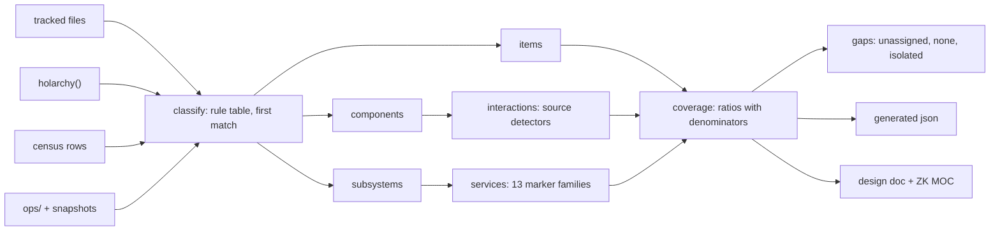

# 20260907-1815 — Holarchy total coverage: every item × component × subsystem × interaction × service

#fractal-l0 #fractal-l1 #fractal-l2 #fractal-l3 #fractal-l4 #fractal-l5 #fractal-l6 #fractal-l7 #fractal-l8 #fractal-l9 #km-triad #rocha-semiotics #cybernetics #zero-muda #zk-adr #stamp-stpa

**UOS / Design / Holonic coverage** · [Cockpit](http://nas-1.tail55d152.ts.net:4100/) · [Planning](http://nas-1.tail55d152.ts.net:4100/planning) · [Wiki](http://nas-1.tail55d152.ts.net:4100/wiki) · [ZK](http://nas-1.tail55d152.ts.net:4100/zk) · [Checklist](http://nas-1.tail55d152.ts.net:4100/checklist)
**Live document:** [http://nas-1.tail55d152.ts.net:4100/files/docs/design/20260907-1815-uos-holarchy-total-coverage-approach.md](http://nas-1.tail55d152.ts.net:4100/files/docs/design/20260907-1815-uos-holarchy-total-coverage-approach.md)
**Transclusions:** `[[zk:20260905-1801-moc-uos-unified-master]]` `[[wiki:20260905-1801-uos-zk-km-corpus-index]]` `[[zk:20260907-1645-moc-uos-holarchy]]`
**Design id:** DES-UOS-HOLON-COVERAGE-001 · **Supersedes the generated appendices of:** DES-UOS-HOLONIC-MAPPING-001 (Appendix A fractal matrix 15:20, Appendix B universe census 15:25) · **Task:** sa-plan `uos/holonic-mapping/20260907-1505` `HOLON-COVERAGE` · **Authority:** operator directive 2026-09-07 15:05, repeated 18:1x

## 0. Operator directive (verbatim)
> save this in journal. create comprehensive approach that covers all tehse aspects. fractally list all items x all fracal components xall fractal subsuystems x all fractal interactiox x all system serviles like logging , security, observability etc -- everything, holarchy must cover every aspect of the system, code, artifacts, docs, ruuntime componnets, resources etc , everything

## 1. What exists and why it is not enough
| Surface (on main `uyoklqrrromk/0ae684eb`) | Coverage today | Gap |
|---|---|---|
| `holon.gleam` holarchy | 158 holons (system, planes, 11 subsystems, 113 process rows, architectural members), lifecycle, uid, addresses | items below subsystem level (files, records, docs, rules, tests, resources) are not holons |
| Fractal matrix (Appendix A, 15:20) | 94 subsystems × 671+30 component rows × 483 interactions × 11 service families | shell pipeline, not a Gleam generator; stale (predates KM pages, session_store, resign, ETC-1, wrapper, six integrations); 83 subsystems without layer evidence, 276 components without interaction evidence |
| Universe census (Appendix B, 15:25) | 19 subsystems, 4,640 components, pins, records, documents, rules, tests, specs, sa-plan units, workspaces, bookmarks, ports, sessions | counts only; no item→holon assignment; B13 is a placeholder |
| KM pages (16:45) | one page per holon + MOC | only for the 158 holons |

The directive is satisfied only when every enumerable item has a holon whole and a declared kind, every subsystem has a service row per family with evidence, every component has its interactions derived from source, and every remaining gap is listed with a denominator. That is rule B13 made real.

## 2. The universe: what counts as an item
Every item is a holon of exactly one kind, with exactly one whole (its subsystem or component holon), a layer, a plane and an address `uos/holon/L<n>/<plane>/<id>` (SC-HOLON-NAME-001).

| Kind | Source of truth (deterministic) | Examples |
|---|---|---|
| `module` (code) | tracked files under `apps/*/src`, `engines/*`, `tools/*`, `native/*`, `services/*` by extension (gleam, erl, ml, mli, zig, rs, c, py, mojo, ts) | `uos_swarm/holon.gleam`, `session_store_ffi.erl` |
| `test` | tracked files under `*/test`, `tests/`, `*_test.*` | `holon_km_test.gleam` |
| `spec` (formal) | `formal/**` (lean, qnt, tla, gospel, agda, rocq) | `Traceability.lean` |
| `document` | `docs/**` (design, journal, wiki, zk, handover, plans, reviews) | this file |
| `rule` | `contracts/rules/**`, `.claude/rules`, `.gemini/rules`, `.agents/rules`, `.codex/rules` | the tri-agent contract and its 3 mirrors |
| `skill` / `agent` / `hook` | `.claude/skills|agents`, `.gemini/…`, `.agents/…`, `.codex/…`, `settings*.json` hooks | `uos-risk-prioritization` |
| `record` | `generated/*decision-record*.json`, `governance/sources/*.json`, `governance/planning/*.json`, receipts | DR-20260907-1747 |
| `artifact` | `priv/*.sha256` pins (with their provisioned `.so`), `manifest.toml` locks, `Cargo.lock`, built releases under `var/releases` (snapshot) | `ferriskey_nif.sha256` |
| `config` | `gleam.toml`, `dune-project`, `*.json5`, `ops/systemd/*`, `ops/zenoh/*`, `.gitignore` | `20260907-0450-uos-zenoh-router-1.json5` |
| `generated` | `generated/**` non-record outputs, `docs/wiki/holons/**` | fractal matrix json, holon pages |
| `resource` | workspaces, bookmarks, ports, sqlite stores, zenoh key prefixes, coordinator sessions — from the snapshot inputs listed in §4, never from live commands | `var/sa-plan/uos.sqlite3`, `integration/main` |
| `process` | the daemon census rows (113) already in the holarchy | `uos-clock-guard-service` |

## 3. The five axes and the cross product
1. **Items** (kinds above) — the leaves.
2. **Fractal components** — the file/module level holon each item belongs to (a Gleam module, an OCaml library, a Zig package, a systemd unit, a plugin).
3. **Fractal subsystems** — the 11 `Subsystem` holons plus `constitution`, `planes` and the 7 plane holons; each component has exactly one subsystem by path rule.
4. **Fractal interactions** — derived from source only: `import` (Gleam), `-import`/`module:function` (Erlang), `open`/module path (OCaml), `@import` (Zig), `use`/`mod` (Rust), `import` (Python/Mojo), CLI invocations (`gleam run -m`, `tools/*`), Zenoh key expressions (`indrajaal/…`, `uos/…`, `c3i/a2a/…`), listener ports (systemd units, configs), file/db read-write targets (`.jsonl`, `.sqlite3`, `var/…`), VCS bookmarks, sa-plan dependencies (from the plan snapshot). Each interaction row: `from`, `to`, `kind`, `evidence` (file:line or key).
5. **System services** (13 families, one row per subsystem per family, evidence or explicit `none`): logging, observability (OTel/trace ids/telemetry), security (ACL, auth, secrets, vault, signatures), safety (STPA/FMEA/Andon/jidoka), clock (chrony, clock-guard, tick/utc), persistence (sqlite, jsonl, files, WAL), messaging (board, Zenoh, coordinator), planning (sa-plan, plans, tasks), formal (Lean/Quint/TLA/Gospel), knowledge (wiki/zk/MOC/ontology), testing (unit/property/CLI tests), coordination (session_sync/session_store, leases), vcs (jj workspaces, bookmarks, receipts).

The full cross product is not materialised as one table (it would be items × 13 × interactions); it is emitted as five normalised tables plus a `coverage` table keyed by subsystem that carries the counts for each axis and the evidence pointers. Every count has a denominator.

## 4. Generator (deterministic, in Gleam)
`apps/uos_swarm/src/uos_swarm/holon_universe.gleam` + CLI arm `holon-universe <stamp> <repo_root>`:
- Inputs (all read from disk, no live commands): the tracked-file list (`jj file list -r @` output captured by the CLI arm through the existing `uos_swarm/jj` port with `--ignore-working-copy`, or the `tests/`-provided fixture when running tests), `holon.holarchy()`, the daemon census fixture, `ops/**`, the sa-plan plan snapshot (`generated/*sa-plan*` if present, else none), the coordinator status snapshot passed as a file.
- Classification: an ordered rule table (path prefix / glob → kind, subsystem, layer, plane); the first match wins; no match → kind `unassigned` with the path retained (never dropped, never guessed).
- Interactions: one detector per language/kind as listed in §3; each emits `file:line` evidence.
- Services: one marker table per family (identifiers, module names, key prefixes); each hit emits `file:line`; a subsystem with zero hits for a family gets `none` explicitly.
- Outputs (stamped, byte-identical on regeneration; golden sha256 in the test). **Operator addition 18:2x: "everything must be in sqlite database"** — the primary output is a SQLite database; JSON and documents are derived from it:
  1. `var/holarchy/<stamp>-uos-holon-universe.sqlite3` (untracked runtime store, regenerable) with normalised tables `meta`, `inputs`, `items`, `components`, `subsystems`, `interactions`, `services`, `coverage`, `gaps`, each row carrying its evidence pointer; append-only for a given stamp; written through the shared typed SQLite API `uos_swarm/sqlite.gleam` + `uos_sqlite_ffi.erl` (esqlite; WAL; `synchronous=NORMAL`; `busy_timeout` 30 s; every operation one `BEGIN IMMEDIATE` transaction; bound parameters only; typed errors) that the coordinator store adopts in a follow-up (task SQLITE-API-UNIFY);
  2. `generated/<stamp>-uos-holon-universe.sql` (tracked, deterministic schema + data dump in primary-key order, diffable, sha256 recorded) and `generated/<stamp>-uos-holon-universe.json` (the same tables as JSON for consumers without SQLite);
  3. `docs/design/<stamp>-uos-holon-universe.md` (per layer → plane → subsystem sections with tables and the gap list; same header block, checklist, navigation and diagrams as every UOS document) and `docs/zk/<stamp>-moc-uos-universe.md` (MOC linking the holarchy MOC, every subsystem section and the gap list).
  The CLI arm `holon-universe <stamp> <repo_root>` writes 1–3; `holon-universe query <db> <sql>` runs a read-only query (SELECT only) for operators and projections; the board ledger's own move to SQLite is a separate task (BOARD-SQLITE) so that "everything in SQLite" covers the coordinator (session_store), planning (sa-plan), the holarchy universe (this) and the board.
- Invariants checked by tests: `totals.items == tracked_files + resource_rows + process_rows`; every item has exactly one `whole` that exists in the holarchy or in the component table; every component has exactly one subsystem; every subsystem × family row exists; coverage ratios carry denominators; `gaps` lists every `unassigned` item and every `none` service row; regeneration with the same stamp is byte-identical.

## 5. Rule B13, computed
`B13`: every enumerated item is a holon of a declared kind with exactly one whole; `unassigned` items are gaps, not failures of the rule, and their count is reported. `B14` (new): every subsystem carries a service row for all 13 families. `B15` (new): every component has at least one interaction or an explicit `isolated` marker with the reason (leaf data, fixture, generated page). `holon rules` prints B13–B15 with their denominators next to B1–B12.

## 6. Coverage arithmetic (reported, never asserted)
- item coverage = items with `whole` ∧ `kind ≠ unassigned` / items
- service coverage(subsystem) = families with evidence / 13
- interaction coverage = components with ≥ 1 interaction / components
- layer evidence = subsystems with a layer from a rule (not fallback) / subsystems
All four appear in the universe document and in the receipt; a ratio of 1.0 is only claimed when the denominator is the measured total.

## 7. Execution
| Step | Route | Owner |
|---|---|---|
| this design + journal | R6 | Fable |
| generator, tests, first generation at stamp `20260907-1830`, docs | R4 | W-N (Sonnet) in `.uos-workspaces/w-coverage` on frozen main `0ae684eb` |
| adversarial review (classification honesty, interaction evidence, service markers, document contract) | workflow | Fable |
| integration under lease with receipts; Appendices A/B of DES-UOS-HOLONIC-MAPPING-001 marked superseded by the universe document | R6 | Fable |
| PROJECTIONS (roster/ACL, audit subjects, OTel attributes, sa-plan tree) consume the universe json | R4 | next task |

## 8. STPA (controller: the universe generator)
| UCA | Hazard | Constraint | Enforcement |
|---|---|---|---|
| a guessed classification is presented as coverage | H-1 | unknown → `unassigned`, listed in gaps | test: no rule table entry may be a catch-all except the final `unassigned` |
| a stale snapshot is presented as live state | H-3 | every output carries the stamp and the sha256 of each input | test on the inputs block |
| items are dropped silently | L-1 | `totals.items` must equal the sum of the input counts | test |
| gaps are suppressed to look complete | H-2 | gap list length ≥ number of `unassigned` + `none` rows | test |
| the generator writes outside `generated/`, `docs/design/`, `docs/zk/` | L-3 | validated stamp and root (as `holon-km`), fail closed | test |

## 9. Pipeline diagram
```text
 tracked files ─┐                                  ┌─ items (kind, whole, layer, plane, address)
 holarchy()   ──┼─► classify (rule table, first match) ─┼─ components ──► interactions (source detectors)
 census rows  ──┤                                  └─ subsystems ──► services (13 marker families)
 ops/, snapshots┘                                             │
                                                              ▼
                                        coverage (ratios + denominators) ──► gaps (unassigned, none, isolated)
                                                              │
                          json (generated/) ◄────────────────┼────────────────► design doc + ZK MOC (docs/)
```


## Comprehensive verification checklist
Document checks and production gates have different evidence scopes; the generator's own gates are listed in §4 and run at integration.

<details>
<summary>Domain 1 — Metadata, timestamp and Tailscale navigation</summary>

- [x] **CHK-01-TIME** — Host-clock timestamp prefix.
- [x] **CHK-02-TAIL** — Full clickable Tailscale FQDN references.
- [x] **CHK-03-FRACT** — Fractal tags L0–L9 assigned.
- [x] **CHK-04-KM** — Transclusions to the master MOC, corpus index and holarchy MOC.

</details>

<details>
<summary>Domain 2 — Zero-Muda purity and storage safety</summary>

- [ ] **CHK-05-MUDA** — Not exercised by this document.
- [ ] **CHK-06-GRAPH** — Not exercised.
- [ ] **CHK-07-DRIVE** — Not exercised.

</details>

<details>
<summary>Domain 3 — Testing Gold Standard and mathematical gates</summary>

- [ ] **CHK-08-C1C8** — Not exercised.
- [ ] **CHK-09-MATH** — Not exercised.
- [ ] **CHK-10-9MOD** — Generator tests run at integration (UNRUN for the document).
- [ ] **CHK-11-REGR** — Not exercised.

</details>

<details>
<summary>Domain 4 — Cross-language control and observability</summary>

- [ ] **CHK-12-GLEAM** — Generator is Gleam; runtime evidence at integration.
- [ ] **CHK-13-HERMES** — Not exercised.
- [ ] **CHK-14-ZIGVM** — Not exercised.
- [ ] **CHK-15-MAX** — Not exercised.
- [ ] **CHK-16-OTEL** — Not exercised.

</details>

<details>
<summary>Domain 5 — Sovereign governance and standalone Jujutsu</summary>

- [ ] **CHK-17-SOV** — Codex R5 requested on the generator when it lands.
- [x] **CHK-18-JJ** — Authored with standalone JJ; no native Git mutations.

</details>

Navigation: [ZK Master MOC](http://nas-1.tail55d152.ts.net:4100/zk) · [Hermes Wiki Corpus Index](http://nas-1.tail55d152.ts.net:4100/wiki) · [Holarchy MOC](http://nas-1.tail55d152.ts.net:4100/files/docs/zk/20260907-1645-moc-uos-holarchy.md) · **Previous:** [Holonic mapping approach](http://nas-1.tail55d152.ts.net:4100/files/docs/design/20260907-1505-uos-holonic-architecture-and-fractal-services-mapping-approach.md)
