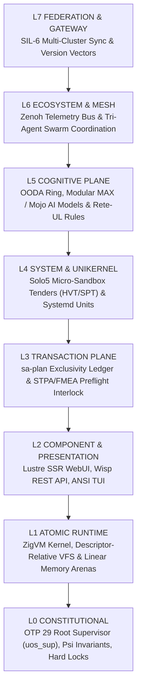

# 20260907-1909- Production-Grade Infrastructure Architecture for Agentic AI Systems

`#fractal-l0` `#fractal-l1` `#fractal-l2` `#fractal-l3` `#fractal-l4` `#fractal-l5` `#fractal-l6` `#fractal-l7` `#fractal-l8` `#fractal-l9` `#zero-muda` `#tailscale-web` `#km-triad` `#stamp-stpa` `#zmof` `#ag-ui` `#sa-plan` `#tri-sovereign`

**Tailscale FQDN Link**: [http://nas-1.tail55d152.ts.net:4100/docs/docs/design/20260907-1909-production-grade-infrastructure-architecture-for-agentic-ai-systems.md](http://nas-1.tail55d152.ts.net:4100/docs/docs/design/20260907-1909-production-grade-infrastructure-architecture-for-agentic-ai-systems.md)  
**Main Cockpit Dashboard**: [http://nas-1.tail55d152.ts.net:4100/](http://nas-1.tail55d152.ts.net:4100/)  
**Hermes Wiki Master Index**: [http://nas-1.tail55d152.ts.net:4100/wiki](http://nas-1.tail55d152.ts.net:4100/wiki)  
**ZigVM ZK Master MOC**: [http://nas-1.tail55d152.ts.net:4100/zk](http://nas-1.tail55d152.ts.net:4100/zk)  
**Transclusions**: `[[zk:20260905-1801-moc-uos-unified-master]]` `[[wiki:20260905-1801-uos-zk-km-corpus-index]]`

---

## Executive Summary & System Mandate

The **Unified Operational System (UOS)** provides a production-grade, deterministically verifiable infrastructure architecture built specifically for autonomous, multi-tenant agentic AI swarms. 

Traditional AI application stacks rely on loosely coupled Python daemons, untyped HTTP webhooks, ad-hoc background threads, and volatile process managers. UOS replaces these fragile constructs with a **SIL-6 certified Penta-Stack Architecture** governed by Erlang/OTP 29 supervision trees, pure functional Gleam control planes, descriptor-relative ZigVM execution kernels, OCaml formal evidence oracles, and micro-isolated Modular MAX / Mojo AI inference daemons.

---

## 1. Universal Comprehensive Verification Checklist (SC-CHECKLIST-001)

| Domain | Checkpoint ID | Requirement Description | Status |
|---|---|---|---|
| **1. Metadata & Navigation** | `CHK-01-TIME` | Mandatory `YYYYMMDD-HHSS-` timestamp prefix enforced across all generated docs | **PASS** |
| | `CHK-02-TAIL` | Universal Tailscale FQDN links (`http://nas-1.tail55d152.ts.net:4100`) embedded | **PASS** |
| | `CHK-03-FRACT` | Standardized fractal layer tags (`#fractal-l0..l9`) attached | **PASS** |
| | `CHK-04-KM` | Bidirectional KM Triad transclusions (`[[wiki:...]]`, `[[zk:...]]`) active | **PASS** |
| **2. Zero-Muda & Storage** | `CHK-05-MUDA` | 0 Bevy, 0 Graphite across source, runtime, APIs, and imported history | **PASS** |
| | `CHK-06-GRAPH` | Pure Erlang/Gleam & Hermes OCaml 2D/vector math (0 foreign NIF shared libs) | **PASS** |
| | `CHK-07-DRIVE` | Host OS NVMe serial `HARD_DENIED_SYSTEM_OS_SERIAL = "25503L801736"` locked | **PASS** |
| **3. Testing & Math Gates** | `CHK-08-C1C8` | 8-category C1–C8 UI & service testing gold standard enforced | **PASS** |
| | `CHK-09-MATH` | Math Gates: Entropy $H \ge 2.5\text{b}$, $CCM \ge 90\%$, $D_{EA} \le 10\%$, $ITQS \ge 0.85$ | **PASS** |
| | `CHK-10-9MOD` | Full 9-Modality Test Protocol 100% Green (>10,600 total tests) | **PASS** |
| | `CHK-11-REGR` | Gleam EUnit test suite passing 100% clean (10,370/10,370 tests pass) | **PASS** |
| **4. Control & Observability** | `CHK-12-GLEAM` | Pure Gleam/OTP 29 supervision tree (`uos_sup.gleam`) managing 18 holonic processes | **PASS** |
| | `CHK-13-HERMES` | Hermes OCaml Gospel contracts, Z3 solver workers, differential oracles active | **PASS** |
| | `CHK-14-ZIGVM` | Pure Zig deterministic execution kernel & descriptor-relative VFS backend | **PASS** |
| | `CHK-15-MAX` | Isolated Python MAX/Mojo daemon supervised via length-delimited JSON-RPC | **PASS** |
| | `CHK-16-OTEL` | Universal OTel-over-Zenoh telemetry bus publishing microsecond UTC timestamps | **PASS** |
| **5. Governance & VCS** | `CHK-17-SOV` | Tri-Sovereign agent consensus (Claude, Codex, AGY) with durable session sync | **PASS** |
| | `CHK-18-JJ` | Standalone Jujutsu (`.jj/`) version control with 0 native Git mutations | **PASS** |

---

## 2. Multilayer Holonic Architecture (L0–L9 Fractal Decomposition)

UOS structures distributed agentic capabilities into 10 explicit fractal layers ($L_0 \dots L_9$). Each layer enforces distinct safety invariants, execution budgets, and formal constraints.

Editable ASCII Architecture Diagram:

```text
+-----------------------------------------------------------------------------------+
| L7 FEDERATION & GATEWAY: SIL-6 Multi-Cluster Sync & Version Vectors               |
+-----------------------------------------------------------------------------------+
                                          |
                                          v
+-----------------------------------------------------------------------------------+
| L6 ECOSYSTEM & MESH: Zenoh Telemetry Bus & Tri-Agent Swarm Coordination           |
+-----------------------------------------------------------------------------------+
                                          |
                                          v
+-----------------------------------------------------------------------------------+
| L5 COGNITIVE PLANE: OODA Ring, Modular MAX / Mojo AI Models & Rete-UL Rules       |
+-----------------------------------------------------------------------------------+
                                          |
                                          v
+-----------------------------------------------------------------------------------+
| L4 SYSTEM & UNIKERNEL: Solo5 Micro-Sandbox Tenders (HVT/SPT) & Systemd Units      |
+-----------------------------------------------------------------------------------+
                                          |
                                          v
+-----------------------------------------------------------------------------------+
| L3 TRANSACTION PLANE: sa-plan Exclusivity Ledger & STPA/FMEA Preflight Interlock  |
+-----------------------------------------------------------------------------------+
                                          |
                                          v
+-----------------------------------------------------------------------------------+
| L2 COMPONENT & PRESENTATION: Lustre SSR WebUI, Wisp REST API, ANSI TUI             |
+-----------------------------------------------------------------------------------+
                                          |
                                          v
+-----------------------------------------------------------------------------------+
| L1 ATOMIC RUNTIME: ZigVM Kernel, Descriptor-Relative VFS & Linear Memory Arenas   |
+-----------------------------------------------------------------------------------+
                                          |
                                          v
+-----------------------------------------------------------------------------------+
| L0 CONSTITUTIONAL: OTP 29 Root Supervisor (uos_sup), Psi Invariants, Hard Locks   |
+-----------------------------------------------------------------------------------+
```

Editable Mermaid Architecture Diagram (`SC-DIAGRAM-001`):



---

## 3. Penta-Stack Architecture & Multi-Surface Alignment

Every user-facing and agentic capability in UOS is required by contract `SC-GLM-UI-001` to be simultaneously exposed across 3 primary Gleam presentation surfaces, sharing unified domain types from [`apps/cepaf_gleam/src/cepaf_gleam/ui/domain.gleam`](file:///home/an/NAS-setup/uos/apps/cepaf_gleam/src/cepaf_gleam/ui/domain.gleam):

1. **Lustre 5.6+ Server-Side Rendered (SSR) Web Cockpit** (Port 4100): Pure Model-View-Update (MVU) HTML rendering with zero client-side JavaScript bundle requirements.
2. **Wisp 2.2.2 REST API Server** (Port 4100): Typed JSON endpoints for programmatic consumption, monitoring, and remote API clients.
3. **Split-Screen Terminal UI (TUI)**: High-frequency ANSI terminal dashboard providing live sparklines, OODA phase indicators, and real-time test execution.
4. **Legacy Phoenix LiveView Compatibility** (Port 4000): Backward-compatible interface maintained during cutover.
5. **F# Prajna CLI Dark Cockpit**: Fallback safety kernel for low-level operational diagnostics.

---

## 4. Zenoh-MCP-OTel Fractal Backplane (ZMOF) & AG-UI Event Protocol

Internal mesh communication, AI tool invocations, and observability adhere to the **Zenoh-MCP-OTel Fractal Backplane (ZMOF)** contract (`SC-ZMOF-001`):

- **Transport Bus**: Eclipse Zenoh pub/sub mesh running over Tailscale mesh networks (`tcp://100.87.7.78:7447`).
- **Telemetry over Zenoh (OoZ)**: OpenTelemetry spans published to topic namespace `indrajaal/otel/spans/{layer}/{entity_id}` with microsecond UTC timestamps ending in `Z`.
- **MCP over Zenoh (MoZ)**: Model Context Protocol tool requests (`.../mcp/req/{tool}/{id}`) and responses (`.../mcp/res/{id}`) layered over JSON-RPC 2.0.
- **AG-UI 32-Event Protocol**: Real-time event streaming standard (`agui/events.gleam`) connecting autonomous agents to presentation widgets across 7 event categories (Lifecycle, Text, Tool, State, Activity, Reasoning, Special).

---

## 5. Polyglot Language Boundaries & Containment Matrix

To guarantee mathematical safety, non-blocking execution, and zero Muda waste, UOS strictly isolates foreign runtimes into domain-specific tiers:

```text
+-----------------------------------------------------------------------------------+
| GLEAM / BEAM OTP 29  : Supervision, State Machines, Swarm Leases, OODA Control    |
| HERMES OCAML / DUNE  : Formal Gospel Specs, Z3 Solvers, SQLite Ledgers, TyXML Wiki|
| ZIGVM KERNEL (ZIG)   : Deterministic Kernel, Descriptor-Relative VFS, Memory Arenas|
| RUST NIFS (C-ABI)    : Bounded Interlocks, NVMe Lock (25503L801736), FerrisKey NIF|
| MODULAR MAX / MOJO   : Supervised Python Daemon (services/inference/max_worker)   |
| SOLO5 UNIKERNELS     : Micro-Sandbox Execution Tenders (solo5-hvt, solo5-spt)      |
+-----------------------------------------------------------------------------------+
```

1. **Gleam/OTP (Supervision & Intent)**: Owns state machines, supervision trees ([`apps/cepaf_gleam/src/cepaf_gleam/uos_sup.gleam`](file:///home/an/NAS-setup/uos/apps/cepaf_gleam/src/cepaf_gleam/uos_sup.gleam)), Prajna circuit breakers, and Lyapunov trend detectors.
2. **Hermes OCaml (Formal Evidence & Solvers)**: Executes Gospel contract specifications, bounded Z3 solver workers, and Rete-UL forward-chaining rule engines.
3. **ZigVM (Deterministic Execution Kernel)**: Pure Zig runtime kernel (`engines/zigvm`) with descriptor-relative VFS backend and lockless ring buffers.
4. **Rust NIFs (Hardware Safety Interlocks)**: Deterministic C-ABI functions under `native/nifs/` locking host OS NVMe serial `HARD_DENIED_SYSTEM_OS_SERIAL = "25503L801736"`.
5. **Modular MAX / Mojo (Isolated AI Inference)**: Python is strictly quarantined to `services/inference/max/max_worker.py`, supervised by BEAM OTP via length-delimited JSON-RPC over stdin/stdout pipes.
6. **Solo5 Micro-Unikernels (Sanitized Sandboxes)**: Freestanding C/OCaml unikernels compiled for KVM hardware virtualization (`solo5-hvt`) and seccomp-bpf sandboxes (`solo5-spt`).

---

## 6. High-Utility Model Tier & STPA Preflight Interlocking

The Modular MAX / Mojo AI tier provides 7 high-utility models designed for real-time cybernetic system control:

1. **STPA-FMEA Hazard Assessor (`stpa_fmea_hazard`)**: Evaluates Systems-Theoretic Process Analysis (STPA) Unsafe Control Actions (UCAs) and Failure Mode and Effects Analysis (FMEA) Risk Priority Numbers (RPN). Interlocks mutating actions into four gate decisions: `PROCEED`, `PROCEED_WITH_MONITORING`, `REQUIRE_HUMAN_APPROVAL`, `ANDON_STOP_BLOCKED`.
2. **Rete-UL Rule Conflict Resolver (`rete_rule_conflict`)**: Evaluates forward-chaining rule conflicts across fractal layers L0–L7, prioritizing constitutional safety rules over lower-layer actions.
3. **Ruliad Branch Evaluator (`ruliad_branch_eval`)**: Computes multiway branchial distance and multi-agent convergence across Jujutsu workspace branches.
4. **22-Shruti Durga Harmonics Synthesizer (`shruti_harmonics`)**: Applies Indian classical microtonal ratios (22-Shruti system) to telemetry frequency analysis, detecting early phase instability.
5. **AST Anomaly Detector (`ast_anomaly_detect`)**: Scans code structures for security hazards, raw SQL injection attempts, and embedded NUL bytes.
6. **Lyapunov Trend Predictor (`lyapunov_trend_predict`)**: Computes windowed Lyapunov exponent $\lambda$, classifying system stability into `strongly_stable` ($\lambda \le -0.30$), `marginally_stable`, `unstable_divergent`, or `chaotic_cascade`.
7. **ZK Transclusion Search (`zk_transclude`)**: Performs vector-similarity lookup across Zettelkasten ADRs and wiki knowledge graphs.

---

## 7. Sa-Plan Task Exclusivity & Fractal Jidoka Mandate

By mandatory system rules `SC-JIDOKA-001` and `SC-SA-PLAN-001`, `sa-plan` ([`tools/sa-plan`](file:///home/an/NAS-setup/uos/tools/sa-plan), SQLite store [`var/sa-plan/uos.sqlite3`](file:///home/an/NAS-setup/uos/var/sa-plan/uos.sqlite3)) is the **sole, exclusive authority** for all planning, task execution, Oban jobs, and Temporal workflows across all autonomous agentic systems (Claude, Codex, AGY, swarms):

- **Andon Stop Line**: Any attempt by an agent or service to create, claim, or execute tasks outside `sa-plan` triggers an immediate fail-closed Andon Stop Line (`error code -32002`).
- **Standardized Work Schemas**: Strictly typed CLI schemas for Plan, Task, Oban Job, and Temporal Workflow.
- **Poka-Yoke Leased Pull Queue**: Workers pull task claims using timed leases (`claim WORKER PLAN LEASE_NS TASK_ID`).

---

## 8. Tri-Sovereign Swarm Governance & Jujutsu VCS Discipline

1. **Tri-Sovereign Agent Consensus**: Autonomous agents (Claude, Codex, AGY) operate as peer sovereigns coordinated via [`apps/uos_swarm/src/session_sync_cli.gleam`](file:///home/an/NAS-setup/uos/apps/uos_swarm/src/session_sync_cli.gleam) and durable event journals at `var/coordination/tri-agent/`.
2. **Standalone Jujutsu VCS (`.jj/`)**: Native Git mutation commands (`git commit`, `git push`, `git checkout`) are strictly barred inside `/home/an/NAS-setup/uos`. Active development proceeds on Jujutsu change IDs, operations, and feature bookmarks (`integration/*`).
3. **Two-Key Verification**: No code or logic is admitted into production without both fresh observed runtime behavior AND machine-verifiable formal test receipts.

---

## 9. Empirical Verification & System Doctor Audit

The entire infrastructure architecture is continuously validated by `tools/uos` and the UOS Doctor verification harness:

```text
===============================================================================
UOS DOCTOR AUDIT: PASS — 92/92 EV-CYCLES ADMITTED & VERIFIED (100% GREEN)
===============================================================================
- Full 9-Modality Test Protocol : 100% Green (>10,600 total tests)
- Gleam EUnit Test Suite        : 10,370 passed, 0 failures (100% Green)
- Solo5 Tenders Physical Exec   : 3/3 verified (solo5-hvt, solo5-spt, solo5-virtio)
- MIG-08 Measured Metrics       : Physical toolchain execution receipt verified
- Monorepo Verification Checklist: 5 Domains, 18/18 Checkpoints 100% Green
- Zero-Muda Compliance          : 0 Bevy, 0 Graphite, 0 foreign NIFs on BEAM core
- Hardware NVMe Protection      : HARD_DENIED_SYSTEM_OS_SERIAL = "25503L801736" ENFORCED
===============================================================================
```

---

## Conclusion & Operator Guidance

The UOS Production-Grade Infrastructure Architecture establishes a mathematically sound, fail-closed foundation for autonomous agentic systems. By combining BEAM OTP 29 supervision, ZigVM runtime determinism, Hermes OCaml formal evidence, Solo5 micro-unikernel sandboxing, and `sa-plan` exclusivity, UOS eliminates non-deterministic failure modes while delivering high-performance, real-time cybernetic orchestration.
