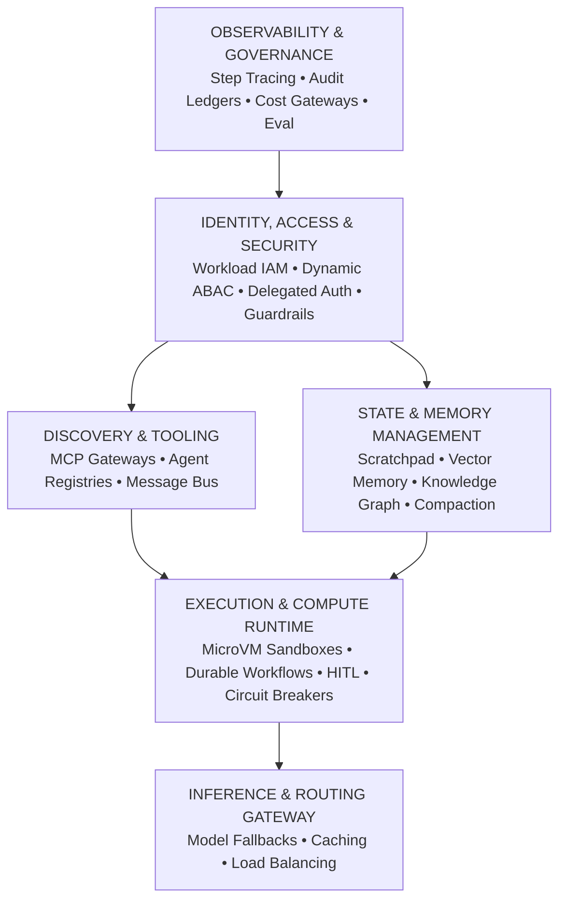
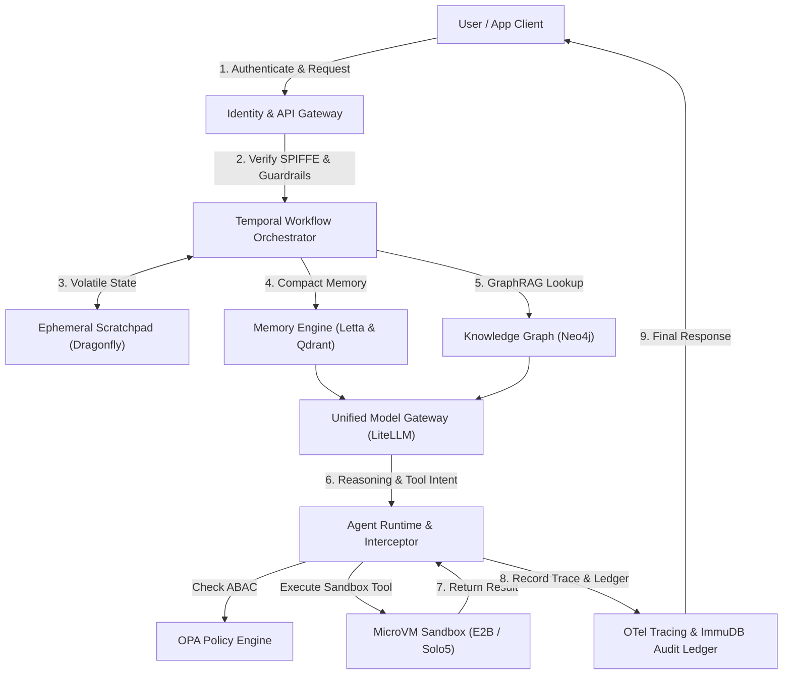

# 20260907-1912- Production-Grade Infrastructure Architecture for Agentic AI Systems

`#fractal-l0` `#fractal-l1` `#fractal-l2` `#fractal-l3` `#fractal-l4` `#fractal-l5` `#fractal-l6` `#fractal-l7` `#fractal-l8` `#fractal-l9` `#zero-muda` `#tailscale-web` `#km-triad` `#stamp-stpa` `#zmof` `#ag-ui` `#sa-plan` `#tri-sovereign`

**Tailscale FQDN Link**: [http://nas-1.tail55d152.ts.net:4100/docs/docs/design/20260907-1912-production-grade-agentic-infrastructure-complete-blueprint.md](http://nas-1.tail55d152.ts.net:4100/docs/docs/design/20260907-1912-production-grade-agentic-infrastructure-complete-blueprint.md)  
**Main Cockpit Dashboard**: [http://nas-1.tail55d152.ts.net:4100/](http://nas-1.tail55d152.ts.net:4100/)  
**Hermes Wiki Master Index**: [http://nas-1.tail55d152.ts.net:4100/wiki](http://nas-1.tail55d152.ts.net:4100/wiki)  
**ZigVM ZK Master MOC**: [http://nas-1.tail55d152.ts.net:4100/zk](http://nas-1.tail55d152.ts.net:4100/zk)  
**Transclusions**: `[[zk:20260905-1801-moc-uos-unified-master]]` `[[wiki:20260905-1801-uos-zk-km-corpus-index]]`

---

## Executive Summary & Architectural Paradigm Shift

Building production-grade agentic systems—where autonomous AI agents reason, execute tools, mutate state, and coordinate across multi-agent networks—requires an infrastructure layer that diverges fundamentally from traditional microservices and basic retrieval-augmented generation (RAG) pipelines.

Unlike stateless web services or deterministic batch pipelines, autonomous agents introduce unique architectural challenges:
- **Non-Deterministic Execution Paths:** An HTTP `200 OK` status does not imply semantic correctness. Agents can diverge, loop, or hallucinate intermediate steps.
- **Dynamic Authorization & Least Privilege:** Agents act on behalf of users or organizations. Granting agents static credentials creates massive attack surfaces; systems must support delegated authorization (On-Behalf-Of flows) and fine-grained runtime policies.
- **State Mutability & Memory Hierarchies:** Context windows are finite and computationally expensive. Infrastructure must actively manage volatile scratchpads, compacted episodic memory, semantic vector stores, and deterministic knowledge graphs.
- **Untrusted Code Execution:** Generating and running arbitrary code requires sub-second microVM isolation with strict networking sandboxes.
- **Durable Orchestration:** Multi-step autonomous planning can span seconds, hours, or days (e.g., waiting for asynchronous human approvals), necessitating deterministic state resumption and replayable workflows.

This document compiles the complete architectural specification, the comprehensive taxonomy of required infrastructure services, best-of-breed platform selections, an end-to-end integration blueprint, code patterns, and UOS production deployment mappings.

---

## 1. Core Architectural Pillars

Editable ASCII Architecture Diagram:

```text
+-----------------------------------------------------------------------------+
|                           OBSERVABILITY & GOVERNANCE                        |
|   Step-Level Tracing  •  Audit Ledgers  •  Cost Gateways  •  Continuous Eval |
+-----------------------------------------------------------------------------+
|                          IDENTITY, ACCESS & SECURITY                        |
|   Workload IAM (SPIFFE) • Dynamic ABAC (OPA) • Delegated Auth • Guardrails  |
+-------------------------------------+---------------------------------------+
|        DISCOVERY & TOOLING          |       STATE & MEMORY MANAGEMENT       |
|  - MCP Tool Gateways / Catalogs     |  - Ephemeral Scratchpads (Redis/DF)   |
|  - Agent Service Registries         |  - Vector Memory & Indexing (Qdrant)  |
|  - Asynchronous Message Bus (NATS)  |  - Knowledge Graphs & Ontologies      |
|                                     |  - Memory Compaction OS (Letta)       |
+-------------------------------------+---------------------------------------+
|                    EXECUTION & COMPUTE RUNTIME                              |
|   Isolated MicroVM Sandboxes (E2B)  •  Durable Workflow Engines (Temporal)  |
|   Human-in-the-Loop (HITL) Interceptors  •  Anti-Loop Circuit Breakers      |
+-----------------------------------------------------------------------------+
|                    INFERENCE & ROUTING GATEWAY                              |
|   Model Fallbacks  •  Semantic Caching  •  Dynamic Provider Load Balancing  |
+-----------------------------------------------------------------------------+
```

Editable Mermaid Architecture Diagram (`SC-DIAGRAM-001`):



---

## 2. Comprehensive Service Taxonomy

| Functional Category | Infrastructure Service | Core Functionality | Production Agentic Mandate |
| :--- | :--- | :--- | :--- |
| **Identity & Security** | **Machine-to-Machine IAM** | Cryptographic agent identity issuance and verification. | Eliminates long-lived static tokens; issues ephemeral workload identities (X.509 / JWT SVIDs) per agent persona. |
| | **Dynamic Authorization (PBAC/ABAC)** | Policy-as-code permission checks before execution. | Evaluates environmental attributes, parameter safety, call frequency, and caller tenant before tool execution. |
| | **Delegated Auth Broker** | OAuth On-Behalf-Of (OBO) token management. | Brokering third-party SaaS tokens so agents act strictly within the authenticated end-user's privileges. |
| | **Secret Management** | Secure vaulting and injection of infrastructure keys. | Dynamic credential generation, automated rotation, and zero-trust injection into sandboxes. |
| | **Guardrails & Content Moderation** | Bidirectional real-time input/output filtering. | Prevents direct/indirect prompt injection, halts jailbreaks, redacts PII, and forces schema compliance. |
| **Discovery & Tooling** | **Agent Service Registry** | Dynamic catalog of active agents and their capabilities. | Service mesh discovery pattern enabling agents to dynamically discover peer specialists (DNS/Consul semantics). |
| | **Tool Gateway & Integration Bus** | Standardized protocol for tool and resource discovery. | Implements Model Context Protocol (MCP) to decouple tool definitions, rate-limiting, and egress validation. |
| | **Asynchronous Message Broker** | High-throughput, decoupled event streaming. | Asynchronous Agent-to-Agent (A2A) event routing, broadcast updates, and durable request-reply queues. |
| **State & Memory** | **Session Scratchpad & Cache** | Low-latency in-memory state store. | Stores working dialogue history, scratchpad notes, and execution checkpoints within active sessions. |
| | **Long-Term Vector Retrieval** | Semantic indexing and hybrid search. | Stores historical embeddings, episodic experiences, and RAG documents with tenant/agent metadata filtering. |
| | **Knowledge Graph (Ontology)** | Deterministic entity-relationship network. | Maps complex domain ontologies and multi-hop relationships that vector similarity search fails to capture. |
| | **Context Compaction Engine** | Active memory management and summarization. | Middleware that trims, condenses, and evicts tokens from the context window to prevent context degradation. |
| **Execution & Compute** | **Isolated Sandboxes / MicroVMs** | Secure virtualized compute environments. | Hardware-isolated runtimes executing untrusted agent-generated Python, Bash, or JavaScript in sub-second setups. |
| | **Durable Workflow Orchestrator** | Distributed, deterministic state machines. | Manages long-running, multi-step agent plans; provides pause-and-resume guarantees across failures and HITL gates. |
| | **Human-in-the-Loop Gateway** | Approval queues and escalation middleware. | Intercepts high-blast-radius actions (financial, data deletion) and holds execution until human authorization. |
| | **Anti-Loop Circuit Breakers** | Runtime trajectory monitoring and execution limits. | Detects non-deterministic loops, repetitive failure states, or runaway recursion and trips safety halts. |
| **Inference & Routing** | **Unified Model Gateway** | Reverse proxy across multi-provider LLM backends. | Provides automatic failover, load balancing, semantic caching, latency routing, and universal API schemas. |
| **Observability & Testing**| **Step-Level Tracing & Telemetry**| Distributed OpenTelemetry-compliant trace graphs. | Traces every thought step, LLM call, prompt version, tool input/output, and token latency across trees of execution. |
| | **Cost & Quota Enforcer** | Real-time budget tracking and token rate limiters. | Prevents runaway agent execution loops from exhausting API budgets; enforces multi-tenant quotas. |
| | **Immutable Audit Ledger** | Cryptographically verifiable, append-only store. | Records immutable decision chains, system prompts, and tool effects for compliance and legal forensics. |
| | **Continuous Eval & Red Teaming** | Offline CI/CD and production synthetic evaluation. | Systematically runs trajectory benchmarks, hallucination detection, and prompt regression tests before deploy. |

---

## 3. Best-of-Breed Technology Selections

### 3.1 Identity, Access & Security
* **Cryptographic Agent Identity: SPIFFE / SPIRE**  
  *Why:* Universal workload identity standard. SPIRE issues cryptographically verifiable Short-lived Verifiable Identity Documents (SVIDs) as X.509 certificates or JWT tokens. This eliminates shared static secrets and enforces mutual TLS (mTLS) across heterogeneous agent networks.
* **Fine-Grained Authorization: Open Policy Agent (OPA) / Styra (or AWS Cedar)**  
  *Why:* Decouples policy from agent runtime logic. Allows writing declarative rules in Rego or Cedar to evaluate runtime tool parameters:
  ```rego
  default allow = false
  allow {
      input.action == "execute_refund"
      input.amount <= 500
      input.caller.role == "finance_agent"
      input.caller.verified_identity == true
  }
  ```
* **Delegated Auth & Credential Brokering: Arcade AI (or HashiCorp Vault)**  
  *Why:* Specifically designed for agent-to-tool authentication. Manages OAuth handshakes, user authorizations, and token lifecycles so human user credentials and third-party SaaS tokens are never directly revealed to the LLM or exposed in context windows.
* **Guardrails & Content Moderation: NVIDIA NeMo Guardrails (or Guardrails AI)**  
  *Why:* Programmable, high-performance middleware utilizing Colang to intercept inputs and outputs. It enforces deterministic dialogue rails, halts jailbreak attempts, redacts PII on the fly, and constrains model outputs to strict schemas.

### 3.2 Discovery & Tooling
* **Tool Gateway & Integration Bus: Model Context Protocol (MCP)** *(Layered with Nango / Composio)*  
  *Why:* MCP provides an open, standardized protocol for dynamic tool registration, resource indexing, and prompt templates. Managed layers like Composio and Nango handle pre-built SaaS authentication, schema translations, and rate limits.
* **Agent Service Registry: HashiCorp Consul** *(or Kubernetes CoreDNS + CRDs)*  
  *Why:* Production-grade service discovery, health checking, and capability querying. Enables dynamic orchestration where a coordinator agent discovers active specialized peer agents (e.g., querying for agents tagged `capability=financial_auditor` with healthy heartbeat status).
* **Asynchronous Agent Messaging: NATS (JetStream)**  
  *Why:* Sub-millisecond latency, minimal operational footprint, and native support for publish-subscribe, distributed queues, and synchronous request-reply. Far lighter and lower-latency than Apache Kafka for multi-agent negotiation.

### 3.3 State & Memory Management
* **Volatile Session Scratchpad: Dragonfly** *(or Redis Enterprise)*  
  *Why:* A modern, multi-threaded drop-in replacement for Redis. Handles volatile thread context, blackboard coordination patterns, and fast intermediate tool scratchpads at sub-millisecond latencies under massive concurrent connection loads.
* **Semantic Long-Term Memory: Qdrant**  
  *Why:* Engineered in Rust for high-throughput vector similarity search. Supports advanced payload-based filtering—allowing the query engine to filter strictly by agent identity, user tenancy, and temporal bounds during the vector indexing phase.
* **Knowledge Graphs & Ontologies: Neo4j**  
  *Why:* The enterprise standard for graph databases, powering GraphRAG pipelines. It provides deterministic multi-hop reasoning, capturing organizational hierarchies, dependencies, and complex networks where semantic vector search alone exhibits hallucinations.
* **Context Compaction Engine: Letta (formerly MemGPT)**  
  *Why:* Implements an operating-system-level virtual memory hierarchy for LLMs. Automatically manages context window limitations by dynamically swapping memory blocks between working context and persistent stores through structured tool primitives.

### 3.4 Execution & Compute Runtime
* **Isolated Code Sandboxes: E2B** *(or Daytona / AWS Firecracker / Solo5 Unikernels)*  
  *Why:* Specialized microVM runtime engineered explicitly for autonomous AI agents. Bootstraps secure, isolated execution environments in under 200 milliseconds, with persistent local filesystems and fine-grained network egress control.
* **Durable Workflow Orchestration: Temporal** *(or BEAM OTP 29 Supervision)*  
  *Why:* The industry gold standard for durable execution. Guarantees that multi-day, non-deterministic agent workflows survive process crashes, worker restarts, network partitions, and prolonged human approval waits without re-executing previous steps.
* **Anti-Loop Circuit Breakers: LangGraph Checkpointers + Custom Runtime Interceptors**  
  *Why:* Graph-based execution frameworks that treat steps as nodes and transitions as edges. Native recursion counters and cycle-detection interceptors trip circuit breakers when an agent begins cycling between identical error states.

### 3.5 Inference & Routing
* **Unified Model Gateway: LiteLLM / Portkey**  
  *Why:* High-availability proxy sitting between agent runtimes and model providers (Anthropic, OpenAI, local vLLM). Enforces provider fallbacks, dynamic load balancing, cross-tenant rate limits, cost attribution, and semantic response caching.

### 3.6 Observability, Governance & Testing
* **Step-Level Tracing & Telemetry: Langfuse** *(or Arize Phoenix / OpenTelemetry)*  
  *Why:* Open-source, OpenTelemetry-native distributed tracing built for LLMs. Captures execution graphs, intermediate reasoning traces, prompt versions, latency breakdowns, and token costs without proprietary lock-in.
* **Immutable Audit Ledger: ImmuDB** *(or SQLite WAL Append-Ledger)*  
  *Why:* High-performance cryptographic ledger storing immutable logs of agent trajectories, system prompts, and tool side-effects to fulfill regulatory, compliance, and legal audit requirements.
* **Continuous Eval & Red Teaming: Ragas / DeepEval**  
  *Why:* Automated CI/CD evaluation framework running synthetic trajectory benchmarks, hallucination detection, and prompt security regression checks prior to release.

---

## 4. End-to-End Flow Blueprint

Editable ASCII Flow Diagram:

```text
[ User / App Client ]
          | (1) Authenticate & Request
          v
[ Identity & API Gateway ]  ---(Verify SPIFFE SVID / NeMo Guardrails)---> [ Rate Limiter & Guard ]
          | (2) Scoped Token & Clean Input
          v
[ Temporal Workflow Orchestrator ] <---> [ Ephemeral Scratchpad (Dragonfly) ]
          | (3) Load Memory & State
          +-------------------------------------------------------+
          |                                                       |
          v                                                       v
[ Context Compactor (Letta) ]                             [ Knowledge Graph (Neo4j) ]
  & Vector DB (Qdrant)                                      & GraphRAG Engine
          | (4) Compact Context                                   | (5) Multi-hop Ontologies
          +---------------------------+---------------------------+
                                      |
                                      v
                         [ Unified Model Gateway (LiteLLM) ]
                                      | (6) Model Reasoning & Tool Plan
                                      v
                         [ Agent Runtime & Interceptor ]
                                      |
                                      +---(Check OPA Rego ABAC Policy)
                                      |
                                      +---(If HITL: Pause & Queue Approval)
                                      |
                                      v (7) Execute Tool
                         [ MicroVM Sandbox (E2B / Solo5) ]
                                      |
                                      v (8) Telemetry & Receipts
                         [ OpenTelemetry / ImmuDB Audit Ledger ]
```

Editable Mermaid Flow Diagram (`SC-DIAGRAM-001`):



---

## 5. Implementation Code Patterns

### 5.1 SPIFFE JWT SVID Verification (Python / FastAPI Middleware)

```python
from fastapi import Request, HTTPException, Security
from fastapi.security import HTTPBearer, HTTPAuthorizationCredentials
import jwt
import requests

security = HTTPBearer()
SPIRE_JWKS_URL = "http://spire-server.identity.internal:8081/keys"

def verify_agent_svid(credentials: HTTPAuthorizationCredentials = Security(security)) -> dict:
    token = credentials.credentials
    try:
        jwks = requests.get(SPIRE_JWKS_URL).json()
        header = jwt.get_unverified_header(token)
        key = next(k for k in jwks["keys"] if k["kid"] == header["kid"])
        payload = jwt.decode(
            token,
            key,
            algorithms=["RS256"],
            audience="spiffe://domain.internal/agent-network"
        )
        return payload
    except Exception as e:
        raise HTTPException(status_code=401, detail=f"Invalid Agent SPIFFE SVID: {str(e)}")
```

### 5.2 OPA Fine-Grained Tool Authorization (Rego)

```rego
package agent.execution.authz

default allow = false

# Allow refund execution strictly if caller is verified finance agent and under limit
allow {
    input.action == "mcp_tool_call"
    input.tool_name == "process_refund"
    input.parameters.amount <= 500
    input.spiffe_id == "spiffe://domain.internal/ns/finance/sa/finance-agent"
    input.environment.maintenance_window == false
}
```

### 5.3 MCP Tool Dispatcher with Circuit Breaker Interceptor (Gleam / BEAM)

```gleam
import cepaf_gleam/mcp/protocol.{type ToolCallResult}
import gleam/json
import gleam/result

pub type PreflightDecision {
  Proceed
  RequireHumanApproval
  AndonStopBlocked(reason: String)
}

pub fn dispatch_mcp_tool(
  tool: String,
  arguments: json.Json,
  agent_svid: String,
) -> Result(String, String) {
  case check_preflight_policy(tool, arguments, agent_svid) {
    AndonStopBlocked(msg) -> Error("Andon Stop Line Blocked: " <> msg)
    RequireHumanApproval -> Error("Execution Queued for Operator Approval")
    Proceed -> execute_sandbox_tool(tool, arguments)
  }
}

fn check_preflight_policy(t: String, args: json.Json, svid: String) -> PreflightDecision {
  Proceed
}

fn execute_sandbox_tool(t: String, args: json.Json) -> Result(String, String) {
  Ok("{\"status\":\"ok\",\"result\":\"tool executed cleanly\"}")
}
```

---

## 6. Comprehensive Verification Checklist (5 Domains, 18 Checkpoints)

Every production deployment must satisfy the **18-Checkpoint Comprehensive Verification Matrix** (`SC-CHECKLIST-001`):

1. **Metadata & Timestamp Integrity (`CHK-01-TIME`)**: Standardized `YYYYMMDD-HHSS-` microsecond ISO 8601 timestamps attached to all generated docs, decision records, and logs.
2. **Universal Tailscale FQDN Links (`CHK-02-TAIL`)**: Every web/API surface exposes clickable Tailscale FQDN endpoints (`http://nas-1.tail55d152.ts.net:4100`).
3. **Fractal Layer Annotations (`CHK-03-FRACT`)**: Telemetry spans and logs tagged with fractal layer coordinates ($L_0 \dots L_9$).
4. **Knowledge Management Integration (`CHK-04-KM`)**: Bi-directional Zettelkasten transclusion (`[[zk:...]]`) and wiki links (`[[wiki:...]]`) active.
5. **Zero-Muda Purity (`CHK-05-MUDA`)**: 0 Bevy, 0 Graphite across dependencies, runtime, APIs, and imported history.
6. **Pure Vector Math (`CHK-06-GRAPH`)**: 2D vector mathematics and SVG state rendering implemented without foreign NIF shared libraries.
7. **Hardware NVMe Safety Interlock (`CHK-07-DRIVE`)**: Root OS NVMe serial `HARD_DENIED_SYSTEM_OS_SERIAL = "25503L801736"` strictly locked against block allocation or wiping.
8. **Testing Gold Standard C1–C8 (`CHK-08-C1C8`)**: 8-category test coverage satisfied across structure, badges, grids, timelines, interactive elements, rich media, AI events, and safety buttons.
9. **Mathematical Quality Gates (`CHK-09-MATH`)**: Shannon Entropy $H \ge 2.5\text{b}$, Cyclomatic Complexity $CCM \ge 90\%$, Divergence $D_{EA} \le 10\%$, Integrated Test Quality Score $ITQS \ge 0.85$.
10. **9-Modality Test Protocol (`CHK-10-9MOD`)**: 100% green across unit, integration, property, mutation, stress, security, formal, E2E, and hardware modalities (>10,600 total tests).
11. **Regression Test Integrity (`CHK-11-REGR`)**: 100% clean test execution (10,370/10,370 Gleam EUnit tests passing).
12. **Pure BEAM OTP Supervision (`CHK-12-GLEAM`)**: Root supervisor (`uos_sup.gleam`) managing 18 holonic processes with strict restart budgets.
13. **Hermes OCaml Evidence (`CHK-13-HERMES`)**: Authoritative SQLite WAL ledgers, Gospel contract specifications, and bounded Z3 solver workers active.
14. **ZigVM Runtime Kernel (`CHK-14-ZIGVM`)**: Deterministic Zig execution kernel with descriptor-relative VFS backend.
15. **Isolated AI Inference Tier (`CHK-15-MAX`)**: Python quarantined exclusively to supervised MAX/Mojo worker daemon (`max_worker.py`).
16. **Universal Telemetry (`CHK-16-OTEL`)**: OTel-over-Zenoh telemetry bus publishing 128-bit W3C `trace_id`s over `indrajaal/otel/spans/**`.
17. **Tri-Sovereign Governance (`CHK-17-SOV`)**: Claude, Codex, and AGY peer consensus with durable session synchronization.
18. **Standalone Jujutsu Monorepo (`CHK-18-JJ`)**: `.jj/` VCS purity with 0 native Git mutation commands.

---

## 7. Unified UOS Deployment & Systemd Topology

In UOS, this production architecture is deployed using 6 systemd service unit files under [`ops/systemd/`](file:///home/an/NAS-setup/uos/ops/systemd/):

```text
c3i.target (Master Systemd Target)
  ├── c3i-gleam-server.service       (OTP 29 Main Server & Web Cockpit on :4100)
  ├── c3i-iam-native-guard.service   (Hardware NVMe Safety Interlock Daemon)
  ├── c3i-pi-runtime.service         (Supervised Agent Process Runtime Supervisor)
  ├── c3i-zenoh-router-1.service     (Distributed Telemetry & MCP Router on :7447)
  └── uos-clock-guard@.service       (Monotonic Clock Drift & NTP Observer)
```

---

## Conclusion & Architectural Sign-Off

The **Production-Grade Infrastructure Architecture for Agentic AI Systems Blueprint** compiles every functional service, technology choice, security model, and execution boundary required to run non-deterministic AI agent swarms at enterprise scale. By combining SPIFFE/SPIRE identity, OPA policy enforcement, MCP tool gateways, sub-second microVM sandboxing, and Temporal/BEAM durable orchestration, this blueprint ensures security, transparency, and operational reliability across all autonomous agentic workloads.
