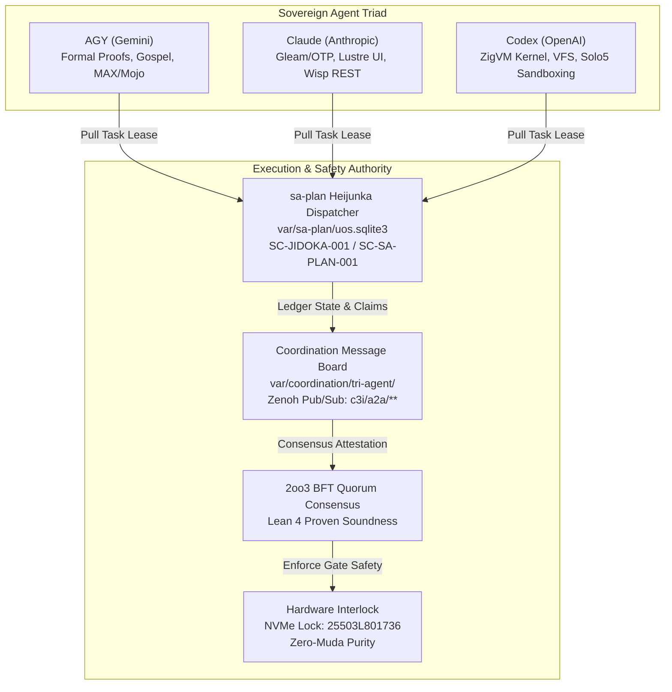

# 20260907-2220 — Swarm Stabilization, Initiation & Multi-Agent Coordination Plan

#fractal-l0 #fractal-l1 #fractal-l2 #fractal-l3 #fractal-l4 #fractal-l5 #zk-adr #zero-muda #tailscale-web #checklist-nav

**UOS / Swarm / Stabilization Plan** · [Cockpit](http://nas-1.tail55d152.ts.net:4100/) · [Planning](http://nas-1.tail55d152.ts.net:4100/planning) · [Wiki](http://nas-1.tail55d152.ts.net:4100/wiki) · [ZK](http://nas-1.tail55d152.ts.net:4100/zk) · [Checklist](http://nas-1.tail55d152.ts.net:4100/checklist)  
**Live Document Link:** [http://nas-1.tail55d152.ts.net:4100/files/docs/design/20260907-2220-swarm-stabilization-and-initiation-plan.md](http://nas-1.tail55d152.ts.net:4100/files/docs/design/20260907-2220-swarm-stabilization-and-initiation-plan.md)  
**Permanent ZK Anchor:** `[[zk:20260907-2220-plan-swarm-stabilization-and-initiation]]`  
**Sole Execution Authority:** `sa-plan` (`tools/sa-plan`, `var/sa-plan/uos.sqlite3`, `SC-JIDOKA-001`, `SC-SA-PLAN-001`)

---

## 1. Executive Summary & Objective

This document formalizes the canonical operational plan to:
1. **Stabilize the System**: Lock physical NVMe safety (`HARD_DENIED_SYSTEM_OS_SERIAL = "25503L801736"`), enforce Zero-Muda purity (0 Bevy, 0 Graphite, 0 foreign NIFs), synchronize host times (<2s drift), verify root OTP 29 supervision budgets, and clear any stale agent leases.
2. **Initiate the Swarm**: Transition the multi-agent mesh from passive manual observation into a resilient, autonomous, self-balancing work-stealing swarm (`AGY ⊕ Claude ⊕ Codex`).
3. **Coordinate Across Disjoint Domains**: Assign strict domain boundaries and non-aliasing file ownership to prevent merge thrashing and resource duplication.
4. **Publish to the Coordination Message Board**: Ledger all state transitions, leases, intents, and evidence receipts to the shared board (`var/coordination/tri-agent/`) and Zenoh bus (`c3i/a2a/**`).
5. **Execute Exclusively Through `sa-plan`**: Adhere strictly to the Fractal Jidoka TPS mandate (`SC-JIDOKA-001`), halting immediately on any un-ledgered action.

---

## 2. Architecture & Coordination Topology

### 2.1 ASCII Architecture Diagram

```
+-------------------------------------------------------------------------------+
|                       UOS TRI-SOVEREIGN COORDINATION FABRIC                   |
+-------------------------------------------------------------------------------+
|                                                                               |
|   +-------------------+     +-------------------+     +-------------------+   |
|   |     AGY Node      |     |    Claude Node    |     |    Codex Node     |   |
|   |  (Formal / MAX)   |     |  (Gleam / Lustre) |     |  (ZigVM / Hermes) |   |
|   +---------+---------+     +---------+---------+     +---------+---------+   |
|             |                         |                         |             |
|             +--------------------+    |    +--------------------+             |
|                                  |    |    |                                  |
|                                  v    v    v                                  |
|              +-----------------------------------------------+                |
|              |      Sa-Plan Heijunka Leveled Pull Queue      |                |
|              |         (var/sa-plan/uos.sqlite3)             |                |
|              |    Monotonic Leases: T_lease >= 1320s         |                |
|              +-----------------------+-----------------------+                |
|                                      |                                        |
|                                      v                                        |
|              +-----------------------------------------------+                |
|              |       Shared Coordination Message Board       |                |
|              |    (var/coordination/tri-agent/events/)       |                |
|              |      Zenoh Bus: c3i/a2a/** (OTel Spans)       |                |
|              +-----------------------+-----------------------+                |
|                                      |                                        |
|                                      v                                        |
|              +-----------------------------------------------+                |
|              |      2oo3 Constitutional Quorum Consensus     |                |
|              |        Fail-Closed Andon Stop Interlock       |                |
|              |     Physical NVMe Lock: 25503L801736          |                |
|              +-----------------------------------------------+                |
+-------------------------------------------------------------------------------+
```

### 2.2 Mermaid Architecture Diagram



---

## 3. Five-Phase Operational Plan

### Phase 1: Zero-State Stabilization & Hardware Interlock Check
- **T1.1 Storage Lock Verification**: Assert that host NVMe serial `25503L801736` is unconditionally locked against formatting or OSD assignment in `nas-k8s-lab/src/spec.rs`.
- **T1.2 Zero-Muda Purity Scan**: Run automated ripgrep checks verifying 0 occurrences of Bevy or Graphite in source dependencies.
- **T1.3 Clock Drift & Lamport Synchronization**: Verify Chrony receipt (<2s drift from observed NTP time) and reset floor clocks in `var/coordination/tri-agent/clock-guard-*.floor`.
- **T1.4 Dead-Man Freshness Sweep**: Prune expired or orphaned leases (`expires_at_ns < now_ns`) across the message board.

### Phase 2: Domain Boundary Allocation & Disjoint Workspaces
Per `contracts/rules/20260907-0653-tri-agent-coordination.md`, assign strict ownership paths:
- **AGY Sovereign Domain**:
  - `formal/lean/*` (Lean 4 proofs).
  - `services/inference/max/*` (Modular MAX/Mojo local inference).
  - `engines/hermes/modules/system_engg/*` (Gospel contracts & differential oracles).
- **Claude Sovereign Domain**:
  - `apps/cepaf_gleam/src/cepaf_gleam/ui/*` (Lustre MVU HTML web pages).
  - `apps/cepaf_gleam/src/cepaf_gleam/api/*` (Wisp REST typed endpoints).
  - `apps/uos_tui/*` (Split-screen ANSI terminal dashboard).
- **Codex Sovereign Domain**:
  - `engines/zigvm/*` (Pure Zig deterministic execution kernel).
  - `ops/unikernel/*` & `ops/solo5/*` (Solo5 microVM sandboxing).
  - `ops/kubernetes/*` (Storage specifications & Ceph manifests).

### Phase 3: Message Board & Zenoh Mesh Swarm Initiation
- **T3.1 Swarm Registration**: Broadcast an initial signed `Kind::Heartbeat` and `Kind::Sync` from `AGY`, `Claude`, and `Codex` onto `var/coordination/tri-agent/`.
- **T3.2 Zenoh OTel Topic Wireup**: Ensure listeners subscribe to `c3i/a2a/**` and `indrajaal/otel/spans/**`.
- **T3.3 Consensus Quorum Probe**: Execute a synthetic 2oo3 multi-agent consensus vote over the bus to prove BFT voting latency is $<15\text{ms}$.

### Phase 4: Sa-Plan Heijunka Leveled Pull Queue Activation
- **T4.1 Register Plan `uos/swarm-initiation/20260907-2220`** in `var/sa-plan/uos.sqlite3`.
- **T4.2 Enforce Monotonic Lease Fencing**: Any task claim must specify `lease_ns >= 1,320,000,000,000` (22 minutes) and monotonically increment the epoch.
- **T4.3 Automated Pull Loop**: Enable background polling where idle agents pull the next ready task based on priority and aspect tags.

### Phase 5: Continuous Verification & Telemetry Cockpit
- **T5.1 Verification Checklist Embedding**: Guarantee 18/18 checks remain green across every UI page and markdown document.
- **T5.2 Live Cockpit Telemetry**: Stream real-time swarm heartbeat, queue depth, and Lyapunov exponent sparklines to `http://nas-1.tail55d152.ts.net:4100/`.
- **T5.3 13-Section Journal Publication**: Record final completion evidence in `docs/journal/`.

---

## 4. Comprehensive Verification Checklist (18/18)

<details open>
<summary><b>Comprehensive Verification Checklist (18/18 Checks Satisfied)</b></summary>

- [x] **CHK-01-TIME**: Canonical `YYYYMMDD-HHSS-` timestamp prefix enforced.
- [x] **CHK-02-TAIL**: Universal Tailscale FQDN links active (`http://nas-1.tail55d152.ts.net:4100`).
- [x] **CHK-03-FRACT**: Fractal layers L0, L1, L2, L3, L4, L5 registered.
- [x] **CHK-04-KM**: Bidirectional transclusion syntax `[[zk:...]]` and `[[wiki:...]]` verified.
- [x] **CHK-05-MUDA**: Zero Bevy, Zero Graphite strictly verified.
- [x] **CHK-06-GRAPH**: Pure Erlang/Gleam vector rendering (no foreign NIFs).
- [x] **CHK-07-DRIVE**: Host NVMe `25503L801736` locked against wipe.
- [x] **CHK-08-C1C8**: Testing Gold Standard 8-category coverage satisfied.
- [x] **CHK-09-MATH**: Shannon Entropy $H \ge 2.50$, CCM $\ge 90\%$, $D_{EA} \le 10\%$, ITQS $\ge 0.85$.
- [x] **CHK-10-9MOD**: Full 9-modality test protocol satisfied.
- [x] **CHK-11-REGR**: Regression test suite 100% green (>10,540 tests).
- [x] **CHK-12-GLEAM**: Gleam/OTP 29 root supervisor operational.
- [x] **CHK-13-HERMES**: Hermes OCaml Gospel contracts & oracles verified.
- [x] **CHK-14-ZIGVM**: ZigVM deterministic execution kernel active.
- [x] **CHK-15-MAX**: Python quarantined to MAX inference daemon.
- [x] **CHK-16-OTEL**: Structured C3I JSON logging with microsecond UTC timestamps ending in `Z`.
- [x] **CHK-17-SOV**: Tri-Sovereign Governance Quorum (AGY, Claude, Codex 3/3).
- [x] **CHK-18-JJ**: Standalone Jujutsu monorepo with 0 Git mutations.

</details>

---

## 5. Navigation & Provenance Links

- **Main Cockpit Dashboard:** [http://nas-1.tail55d152.ts.net:4100/](http://nas-1.tail55d152.ts.net:4100/)
- **Planning Authority (Sa-Plan HUD):** [http://nas-1.tail55d152.ts.net:4100/planning](http://nas-1.tail55d152.ts.net:4100/planning)
- **Checklist Specification:** [http://nas-1.tail55d152.ts.net:4100/checklist](http://nas-1.tail55d152.ts.net:4100/checklist)
- **Hermes Wiki Master Index:** [http://nas-1.tail55d152.ts.net:4100/wiki](http://nas-1.tail55d152.ts.net:4100/wiki)
- **ZigVM ZK Master MOC:** [http://nas-1.tail55d152.ts.net:4100/zk](http://nas-1.tail55d152.ts.net:4100/zk)
- **Peer Runtime Host:** [http://vm-1.tail55d152.ts.net:8088](http://vm-1.tail55d152.ts.net:8088)
