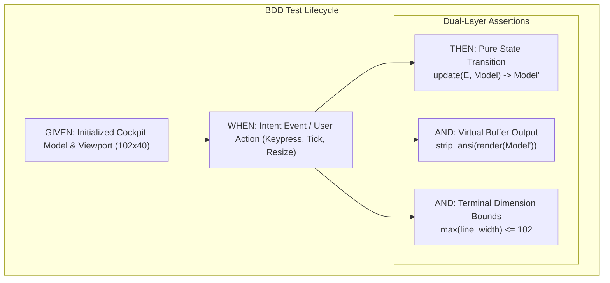

# 20260907-2259-tui-bdd-specification.md

# TUI Behavior-Driven Development (BDD) Specification

- **Timestamp:** `20260907-2259-` (Host NTP Synchronized, `SC-TIME-001`)
- **Authority:** Sa-Plan (`plan-tui-bdd-testing`), STAMP Contract (`SC-BDD-001`, `SC-GLM-UI-001`)
- **Fractal Layers:** `#fractal-l1` (Atomic), `#fractal-l2` (Component), `#fractal-l4` (System)
- **Tags:** `#zero-muda`, `#tui`, `#bdd`, `#gherkin`, `#tailscale-web`, `#checklist-nav`
- **Tailscale Navigation Base:** [http://nas-1.tail55d152.ts.net:4100](http://nas-1.tail55d152.ts.net:4100)
- **Live Cockpit:** [http://nas-1.tail55d152.ts.net:4100/](http://nas-1.tail55d152.ts.net:4100/)

---

## 1. Scope & Objective

This specification establishes the canonical **Behavior-Driven Development (BDD)** test suite for the Unified Operational System (UOS) Text User Interface (TUI) Cockpit ([`apps/cepaf_gleam/src/cepaf_gleam/ui/tui/sysadmin_cockpit.gleam`](file:///home/an/NAS-setup/uos/apps/cepaf_gleam/src/cepaf_gleam/ui/tui/sysadmin_cockpit.gleam)).

The suite formalizes user expectations into executable **Given-When-Then** scenarios spanning all three architectural layers:
1. **Layer 1: Decoupled Application State** (pure Elm/MVU state transitions).
2. **Layer 2: Virtual Buffer & Rendering** (ANSI escaping, stripped text, and geometry clipping).
3. **Layer 3: Interaction & Terminal Invariants** (hotkeys, window dimension bounds, and color profile normalization).

---

## 2. BDD Architecture & Flow Diagram (SC-DIAGRAM-001)

### ASCII Diagram
```text
+-----------------------------------------------------------------------------------------+
|                               TUI BDD Test Architecture                                 |
+-----------------------------------------------------------------------------------------+
|                                                                                         |
|   +---------------------------------------------------------------------------------+   |
|   | GIVEN: Initial Model State M_0 (Cockpit, Telemetry Vectors, Viewport WxH)       |   |
|   +---------------------------------------+-----------------------------------------+   |
|                                           |                                             |
|                                           v                                             |
|   +---------------------------------------------------------------------------------+   |
|   | WHEN: User Interaction / Intent Event E                                         |   |
|   |       - Hotkey Pressed ('h', 'm', 'e', 'n', 'p')                                |   |
|   |       - Container Action (Start, Stop, Restart)                                 |   |
|   |       - Terminal Resize (SIGWINCH 20x10 <-> 102x40)                             |   |
|   +---------------------------------------+-----------------------------------------+   |
|                                           |                                             |
|                     +---------------------+---------------------+                       |
|                     |                                           |                       |
|                     v                                           v                       |
|   +-----------------------------------+       +-----------------------------------+     |
|   | THEN: State Machine Asserts       |       | AND: Virtual Buffer Asserts       |     |
|   | - update(E, M_0) -> M_1           |       | - render(M_1) -> ANSI Frame       |     |
|   | - Active tab == TargetTab         |       | - strip_ansi(Frame) contains text |     |
|   | - Invariants preserved (modulo 12)|       | - Lines fit viewport width W      |     |
|   +-----------------------------------+       +-----------------------------------+     |
+-----------------------------------------------------------------------------------------+
```

### Mermaid Diagram


---

## 3. Executable BDD Scenarios (Gherkin Format)

### Feature 1: Tab Navigation & Modulo-12 Cycling
```gherkin
Feature: TUI Tab Navigation and Cycling
  As a system administrator operating the C3I TUI Cockpit
  I want to cycle forward and backward through all 12 operational tabs
  So that I can observe the entire system state with minimal keystrokes

  Scenario: Initial Cockpit State
    Given a freshly initialized sysadmin model
    Then the active tab is OverviewTab
    And the cockpit mode is Dark
    And the NVMe root partition is locked with serial "25503L801736"

  Scenario: Forward Cycling Through Cybernetic Tabs
    Given the model is set to DoctorTab
    When the user navigates to the next tab
    Then the active tab is HomeostasisTab
    When the user navigates to the next tab again
    Then the active tab is MessageBoardTab
    When the user navigates to the next tab again
    Then the active tab is EvolutionTab
    When the user navigates to the next tab again
    Then the active tab wraps around modulo 12 to OverviewTab

  Scenario: Direct Hotkey Selection
    Given the model is set to OverviewTab
    When the user presses the 'h' key
    Then the active tab is HomeostasisTab
    When the user presses the 'm' key
    Then the active tab is MessageBoardTab
    When the user presses the 'e' key
    Then the active tab is EvolutionTab
```

### Feature 2: Biological Homeostasis Monitoring
```gherkin
Feature: Real-Time Physiological Homeostasis
  As a cybernetic control operator
  I want to inspect metabolic stability and physiological variables
  So that I can detect homeostatic drift before Prajna circuit breakers trip

  Scenario: Rendering Stable Homeostatic Equilibrium
    Given a system state with negative Lyapunov exponent -3.73
    And PID error deltas within safe operational margins
    When the Homeostasis tab is rendered to the virtual buffer
    Then the output contains "BIOMORPHIC PHYSIOLOGICAL HOMEOSTASIS"
    And the output contains "HOMEOSTATIC EQUILIBRIUM"
    And the 12-factor physiological matrix includes "cpu_pct"
    And the output contains zero "NaN" or undefined values
```

### Feature 3: Swarm Message Dashboard & Agent Activities
```gherkin
Feature: Swarm Message Dashboard & Agent Observability
  As a multi-agent supervisor
  I want to inspect what the agents are doing and read the signed message bus
  So that I have continuous visibility into OODA cycles and A2A traffic

  Scenario: Inspecting Active Swarm Workers
    Given an active swarm with AGY, Claude, and Codex workers
    When the Message Board tab is rendered
    Then the output displays "SWARM MESSAGE DASHBOARD"
    And the output displays worker "AGY (L3)"
    And the output displays worker "Codex-Astra (L3)"
    And the active OODA phases and current sub-goals are rendered
```

### Feature 4: Swarm Evolution & Quorum Ratification
```gherkin
Feature: Autonomous System Evolution
  As a constitutional guardian
  I want to view Pareto non-dominated mutation candidates and consensus gates
  So that no unratified evolutionary mutations alter system state

  Scenario: Inspecting Evolutionary Candidates and Consensus Gate
    Given evolutionary generation 42 with 10 active candidates
    When the Evolution tab is rendered
    Then the output displays "AUTONOMOUS SYSTEM EVOLUTION"
    And the output displays "EVOLUTION GATE OPEN"
    And the non-dominated Pareto candidate "MAX SIMD Scorer Optimization" is present
    And the 4-party quorum consensus indicator displays Codex, AGY, Claude, and Operator
```

### Feature 5: Terminal Dimension Locking & Bounded Reflow
```gherkin
Feature: Terminal Dimension Locking and Responsive Reflow
  As a terminal user interface engine
  I want to ensure all rendered lines respect viewport bounds
  So that layouts do not corrupt or panic across disparate screen sizes

  Scenario: Bounded Line Rendering Across All Tabs
    Given a locked terminal dimension of 102 columns by 40 lines
    When each of the 12 operational tabs is rendered
    Then every tab produces non-empty output
    And no line causes a runtime panic
    And the output remains deterministic regardless of host shell dimensions
```

### Feature 6: Color Profile Normalization & Semantic Text Isolation
```gherkin
Feature: Color Profile Normalization and Semantic Text Isolation
  As an automated test suite
  I want to strip ANSI styling when asserting business logic
  So that aesthetic palette changes never break functional assertions

  Scenario: Verifying Semantic Content Without ANSI Interference
    Given an ANSI-rendered cockpit frame containing escape sequences
    When the frame is processed through an ANSI-stripping filter
    Then the stripped frame matches pure text expectations
    And contains no ANSI escape code artifacts (\u001b[...)
```
