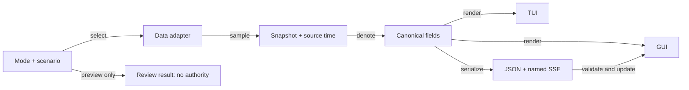

# Homeostasis interface: denotation, data modes and verification

#fractal-l0 #fractal-l2 #fractal-l5 #zk-adr #zero-muda #tailscale-web

Contract: **SC-HOMEO-UI-001**, schema version 1. Task: `uos/homeostasis-ui/20260908-0045 / REPAIR`.
This is an isolated review candidate. It supersedes the interface and evidence claims in the
[historical master](20260908-0113-homeostasis-monitoring-unified-master-sdlc-journal-and-specification.md).
It does not admit a control-plane release. The filename uses the observed intake stamp;
individual executions retain their actual UTC times in the evidence manifest.

Intended publication: [homeostasis](http://nas-1.tail55d152.ts.net:4100/homeostasis),
[evolution](http://nas-1.tail55d152.ts.net:4100/homeostasis/evolution),
[terminal](http://nas-1.tail55d152.ts.net:4100/homeostasis/terminal).
Those production URLs were not used as proof of this isolated candidate and were not redeployed.
Local companion: [GUI/TUI rules, skills and Superpowers](20260908-0045-gui-tui-skills-rules-and-superpowers.md).

## Scope and result semantics

The scope is every **homeostasis** page, component and data-bearing field in the inventory below.
Other UOS pages are outside this repair. Two modes share the same evidence type and rendering fields:

- **Real data** samples the existing local BEAM VM: online schedulers, processes, memory MiB,
  run queue and uptime. These are genuine observations of the serving VM, including the private
  test VM during verification. They do not measure a whole cluster or prove physiological health.
- **Test data** generates deterministic nominal, disturbance, recovery or unavailable fixtures.
  Nominal fixtures include 1–30 simulated model evolutions. Simulated ballots never contact peers.
- Source timestamps, receipt time, model time, monotonic browser elapsed time and test-cycle number
  are distinct. Test data has no fabricated source UTC timestamp.
- Real CPU percentage, host memory percentage, request latency, error rate, composite stress,
  PID state, Pareto frontier and agent voting evidence remain **UNKNOWN** until their trusted
  adapters exist. A missing adapter never becomes a healthy default.
- All control requests are review-only. Real execution is denied. A test preview returns a typed
  threshold result and `executed=false`. Neither mode can dispatch Sa-plan work or deploy code.

## Source architecture

The implementation reuses the existing physiological/PID/evolution model, beam_metrics, Lustre,
Wisp/Mist, OTP, TUI projection and Hermes/OCaml browser toolchain. It adds no inference service,
agent session, native NIF, external runtime daemon, or live supervisor.

ASCII source:

```text
[Mode + scenario] -- select --> [Data adapter]
[Data adapter] -- sample --> [Snapshot + source time]
[Snapshot + source time] -- denote --> [Canonical fields]
[Canonical fields] -- render --> [GUI]
[Canonical fields] -- render --> [TUI]
[Canonical fields] -- serialize --> [JSON + named SSE]
[JSON + named SSE] -- validate and update --> [GUI]
[Mode + scenario] -- preview only --> [Review result: no authority]
```

Mermaid source, same nodes, edges and labels:



| Responsibility | Implementation |
|---|---|
| Mode/scenario parsing, real acquisition, deterministic evolution, threshold preview | `apps/cepaf_gleam/src/cepaf_gleam/ui/homeostasis_data.gleam` |
| Opaque snapshot, freshness, field denotation, JSON | `apps/cepaf_gleam/src/cepaf_gleam/ui/homeostasis_status.gleam` |
| Responsive HTML, data controls, bounded browser update bridge | `apps/cepaf_gleam/src/cepaf_gleam/ui/lustre/homeostasis_evolution_hud.gleam` |
| Read-only HTTP/SSE and private test entrypoint | `apps/indrajaal_gleam_web/src/indrajaal/homeostasis_http.gleam` |
| Canonical pure-router status integration | `apps/cepaf_gleam/src/cepaf_gleam/ui/wisp/homeostasis_api.gleam` |
| Plain-text terminal, selected-mode entrypoint | `apps/cepaf_gleam/src/cepaf_gleam/ui/tui/homeostasis_evolution_view.gleam` |
| Existing TUI host model | `sysadmin_cockpit.refresh_homeostasis(model, selection)` samples explicitly outside the pure renderer |
| Input-domain checks for F Prime model | `apps/cepaf_gleam/src/cepaf_gleam/fpp/homeostasis_fprime.gleam` |

The browser uses a small JavaScript bridge emitted from Gleam. Its existence is explicit;
“zero JavaScript” is not claimed. Rendering and state ownership remain Gleam/OTP.

## Denotational and algebraic design

Let the evidence sum type be:

```text
E = Missing
  | Simulation(Model)
  | Observation(Model, source, observed_at, ttl)
  | RuntimeObservation(BeamMetrics, observed_at)

Mode = RealData | TestData
Scenario = Nominal | Disturbance | Recovery | MissingSource
Selection = Mode × Scenario × {1, …, 30}
D : E × UTC_us -> List(FieldId × Label × DisplayValue)
```

`D` is `homeostasis_status.fields`. It is the sole field denotation for GUI, terminal and JSON.
Model values retain their test-data attribution; runtime values retain their observed attribution.
A browser transport event never widens the authority of this type.

**L1 — Missing-evidence law.** For a missing, expired or future-dated observation,
every live measurement in `D` is UNKNOWN. No numerical zero, nominal phase or stable flag is inferred.

**L2 — Freshness law.** For a source observation at `a` with TTL `τ`:
`fresh(a,τ,t) = (a > 0) ∧ (τ > 0) ∧ (0 ≤ t-a < τ)`.
At `t=a+τ`, the observation is stale; at `t<a`, it is unavailable.
Runtime observations use `τ=5,000,000 µs`. Attributed model observations cap TTL at 60 seconds.
Browser elapsed-time expiry uses `performance.now()`; client wall time does not overwrite source UTC.

**L3 — Simulation separation.** `observed_at(Simulation(m)) = None`, even when its model time
is nonzero. Real mode cannot be selected by an unrecognized mode string.
Real reads ignore the test scenario rather than acquiring simulated physiology.

**L4 — Projection parity.** For supported dimensions containing the full field list:
`extract(GUI(E,t)) = D(E,t)`, `JSON(E,t).fields = D(E,t)`, and
`TUI(E,t) = ascii_bounded(format(D(E,t)))` with evidence metadata.
The terminal equality includes its documented ASCII escaping and viewport truncation.
The browser checks every field against each received canonical event, not just an HTTP status.

**L5 — Bounded rendering.** Terminal width is clamped to 0–240, height to 0–100;
zero width returns the empty string. Untrusted terminal text contains only printable ASCII.
The SSE history retains at most 50 rows; input frames are at most 16,384 JavaScript string code units, and displayed field values
at most 1,000 characters. One connection emits at most 120 snapshots, nominally one per second.

**L6 — Atomic field schema.** A frame must carry schema 1, a recognized evidence status,
source text, authority NONE, exactly the existing field identifiers, no duplicates, and string
labels/values. Missing or malformed fields invalidate the whole live display.
Observed events require positive safe-integer source time, nonnegative age below TTL and strictly
increasing source time. HTML-like source text is inserted with `textContent`, never `innerHTML`.

**L7 — Transport/evidence separation.** Connection open is not source health.
Disconnect, stale source, malformed frame and out-of-order observation invalidate live values.
Page teardown closes the source and timer. Reconnection starts a current snapshot subscription;
there is no claim of Last-Event-ID replay or durable stream history.

**L8 — Review monotonicity.** For a fixed test sample `x=(cpu,memory)`,
`preview(x,c,m)=(cpu≤c)∧(memory≤m)`. Increasing valid thresholds cannot change true to false.
Thresholds are finite ratios in [0,1]. Every real-data review yields DeniedNoAuthority.
Every response carries `executed=false`.

**L9 — Model evolution accounting.** For the bounded nominal fixture, each accepted simulated
evolution increments generation and history length by one. Thirty applications yield generation 30
and history length 30. Model observation times advance; they do not reset after a mutation.
The ballots are explicitly simulated AGY/Claude/Codex members of the existing quorum model.

**L10 — Sampled energy identity.** The existing model uses `V=e²/2 ≥ 0`.
The tests check this identity and bounded trajectory/accounting laws.
Non-increasing sampled V alone does **not** prove asymptotic stability, physical plant safety,
scheduler progress, or distributed agreement. A quorum-size inequality alone does not prove
single-vote behavior, epoch fencing, non-equivocation or absence of split brain.

These are executable contracts and bounded tests. They are not a newly completed Lean/Quint proof.
The existing `formal/lean/Homeostasis_Evolution.lean` comments now describe its actual assumptions.
No independent Lean execution or plant stability proof was obtained for this candidate.

## Complete page and component inventory

| Route/view | Real data | Test data | Verification |
|---|---|---|---|
| `/homeostasis` | Local VM + unknown physiology | Four scenarios, cycles 1–30 | Browser render/update, page-tour clip |
| `/homeostasis/evolution` | Same denotation | Same denotation | Browser render/update, page-tour clip |
| `/homeostasis/evolution/hud` | Existing route alias | Same selection contract | Route covered by implementation; alias has no separate duplicate clip |
| `/homeostasis/components?component=…` | Focused component | Focused component | Ten component clips per mode |
| `/homeostasis/terminal` | Plain-text projection in browser | Same fixtures | Browser updates + actual native PTY evidence |
| Native terminal entrypoint | `real nominal 1` | `test <scenario> <1..30>` | Renderer/PTY verified; complete interactive host keybindings are not claimed |

| Component | Data-bearing fields or behavior |
|---|---|
| provenance | Evidence status, source, source UTC, explicit authority |
| controls | Mode, scenario, cycle, CPU/memory threshold sliders, visible output, preview result |
| pid | health, error, control, energy, energy_change, stable |
| phase | phase, generation, model_time |
| physiology | stress, cpu_pct, memory_pct, latency_ms, error_rate_pct |
| runtime | schedulers, processes, vm_memory, run_queue, uptime |
| pareto | candidate count; unavailable in real mode |
| quorum | Simulated model voting label or UNKNOWN; no invented peer presence |
| stream | Transport badge, received-frame counter, 50-row source history |
| checklist | Five domains, 18 requirements, explicit UNRUN admission state |
| terminal | Shared plain-text projection, safe escaping, bounded rows/columns |

All fields refresh from each accepted event. Values that legitimately remain constant still receive
a frame update count. Static titles/navigation do not invent animation or changing data.

## Protocol and control contract

Query parameters: `mode=real|test`, `scenario=nominal|disturbance|recovery|unavailable`,
`cycle=1..30`, optional known `component`. Defaults are real/nominal/1.
Mode-preserving navigation uses full Tailscale FQDN links; the same-origin form applies the selection.

- GET `/api/v1/homeostasis` and `/api/v1/homeostasis/evolution`: schema-1 JSON.
- GET `/api/v1/homeostasis/stream`: named `homeostasis_status` SSE events.
- GET `/api/v1/homeostasis/terminal`: bounded plain text.
- GET `/api/v1/homeostasis/review`: read-only threshold preview, no execution.
- Invalid selection/component/threshold: 400. Unknown/expired snapshot: 503.
- Real review without authority: 403. Mutating HTTP methods: 405.
- JSON/HTML responses are not cached. Evidence metadata accompanies the readings.

A future trusted physiological adapter must bind metric/source timestamps, provenance and TTL,
and must have independent operational and formal receipts. A future execution path additionally
requires authenticated principal propagation, current Sa-plan ownership, risk checks, candidate
identity, replay/idempotency protection, source freshness and an explicitly authorized effect.
This UI candidate provides none of that execution authority.

## Comprehensive test strategy and gates

| Gate | Coverage | Required result |
|---|---|---|
| C-UI-01 Contract regression | Missing data, removed fabricated online/verified claims, correct event names, real router, typed invalid F Prime context | Focused EUnit pass |
| C-UI-02 Algebra | L1–L10; deterministic scenario projections; generation/history accounting across 30 evolutions; review thresholds | Bounded executable laws pass |
| C-UI-03 Source time | Fresh, exact TTL, stale, future observation, invalid metadata and rollback | No false fresh/healthy state |
| C-UI-04 Native TUI | Bounded dimensions, terminal control characters, shared fields, real/test mode output | EUnit plus 30-cycle native PTY receipts |
| C-UI-05 Browser | 320/768/1280 widths, no horizontal page overflow, keyboard checklist, accessible slider labels/outputs | Actual Chrome run, no script errors |
| C-UI-06 HTTP/control | Correct named SSE, real/test query mode switches, threshold validation, real denial | Actual private OTP 29 handler |
| C-UI-07 Stream fault injection | Oversized/malformed/partial schema, out-of-order time, TTL expiry, disconnect, HTML payload, FIFO burst, cleanup | Reject or expire; no stale values retained |
| C-UI-08 Recording | 26 page/component views × 30 checked update cycles, in both modes, with per-cycle receipts | Every displayed field equals received event |
| C-UI-09 Evidence integrity | Candidate source hashes, exact test source, toolchain identity, media durations/hashes, revision locator | Local reproducible manifest |
| C-UI-10 Independent admission | Full UOS test protocol, peer review, production health, Lean/toolchain proofs, release authority | NOT SATISFIED by this task |

The four scenarios run through 30 bounded cycles each in algebraic checks. Browser recordings use
nominal data; browser fault and mode-switch checks cover disturbance and transport failures.
Recovery/unavailable scenarios are checked in code; they do not each have a separate 30-second
browser recording. Coverage is stated at that granularity rather than treating repeated frames as
independent production deployments.

The 26 browser recordings comprise three page views and ten component views in each mode.
The page tour traverses all component sections, while component clips keep the selected panel visible.
Per-cycle JSON records retain frame count, source state/time, field count and model generation.
The terminal has separate real/test PTY output and timing. Videos are observed test evidence;
ASCII/Mermaid diagram-source requirements do not apply to screenshots or recordings.

## Reproduction and evidence

Use the prepared dependency graph from the repository manifests. The check script copies source
into a private temporary directory and uses a pre-existing dependency cache without writing it.
It refuses an OTP release other than 29. No live root supervisor is started.

```sh
# Point PATH at a prepared OTP 29 and OCaml/Playwright toolchain.
# UOS_UI_LIB defaults to apps/cepaf_gleam/build/dev/erlang in this checkout.
UOS_UI_LIB=/path/to/prepared/erlang/packages bash tools/homeostasis-ui-check --unit
UOS_UI_LIB=/path/to/prepared/erlang/packages bash tools/homeostasis-ui-check --browser
bash tools/ui-skill-check --selftest
```

Browser dependencies are preinstalled Chrome and OCaml Playwright 1.59.0. No automatic browser
download, global package edit or production port binding occurs. Use `UOS_UI_TEST_PORT` in the
49152–65535 range, `UOS_UI_CHROME`, and `UOS_UI_CC` to select local tools explicitly.

The recording source is `tools/validation/homeostasis_recording_check.ml`. It compiles with
`ocamlfind ocamlopt -cc /usr/bin/cc -linkpkg -package playwright,eio_main,yojson` in a temporary
directory. It requires a private loopback base, evidence output directory and Chrome executable.
Native terminal capture is reproducible with `bash tools/validation/homeostasis_pty_check real|test COMPILED_EBIN DEPENDENCY_LIB OUTPUT_DIR`; it requires OTP 29 and util-linux `script`, and records 30 frames plus PTY timing under a 45-second timeout.

Start only the compiled `homeostasis_http_probe:serve(port)` on OTP 29, with crypto/ssl/mist
applications, under a bounded timeout. Three browser contexts capture each batch of at most three
views; this is local browser concurrency, not agent delegation.

The independent media validator is `tools/validation/homeostasis_evidence_check.ml` (OCaml packages `yojson,str,unix`, plus `ffprobe` and `sha256sum`). It rejects missing cycles, stalled frame counters, backward source clocks, false real-mode attribution and short/missing recordings. Four corrupted-receipt controls were rejected. Its SHA-256 manifest binds each clip and PTY transcript to its measured receipt.

[Verification and clip index](../reviews/20260908-0045-homeostasis-interface-verification.md)
and [completion journal](../journal/20260908-0045-homeostasis-interface-repair-journal.md)
carry the actual receipts. Binary media stay under ignored `var/evidence/homeostasis/20260908-0045`.
Sources, contracts, commands, manifest and provenance remain in the repository; generated binaries
and compiler caches do not become repository artifacts.

## Remaining operational boundaries

1. Wire authenticated, attributable physiological sources before displaying real health or
   authorizing remediation. BEAM process counts are insufficient substitutes.
2. Review the existing evolution engine's stale proposal/current-state checks, quorum epochs,
   voter identity and replay fencing before any runtime action.
3. Attach current Sa-plan/risk authority and independent reviewer receipts before release.
4. Verify the full interactive UOS TUI host, hot reload, reconnection under actual proxy settings,
   and the complete UOS nine-modality suite at the integration revision.
5. Prove the relevant formal claims with pinned tools; non-increasing energy and arithmetic
   quorum intersection are narrower claims than operational stability and distributed consensus.
6. Keep historical simulation media and historical journals attributed to their original revisions.
   They do not establish the freshness of this candidate or the deployed system.


<details><summary>Verification: 5 domains / 18 checkpoints</summary>

| Domain | Checkpoints and current scope |
|---|---|
| Metadata/time/navigation | CHK-01 observed host time; CHK-02 FQDN references, publication UNVERIFIED; CHK-03 fractal tags; CHK-04 local specification/knowledge links |
| Purity/storage | CHK-05 no new foreign runtime; CHK-06 native boundaries unchanged; CHK-07 storage interlock UNRUN |
| Tests/mathematics | CHK-08 full C1–C8 UNRUN; CHK-09 bounded algebraic tests only; CHK-10 nine modalities UNRUN; CHK-11 candidate UI checks in attached receipt |
| Control/observability | CHK-12 private OTP 29 run; CHK-13 independent formal proof UNRUN; CHK-14 ZigVM UNRUN; CHK-15 MAX UNRUN; CHK-16 source timestamps and SSE tested, full OTel correlation UNRUN |
| Governance/JJ | CHK-17 independent admission UNRUN; CHK-18 isolated JJ candidate, no mainline cutover |

</details>
