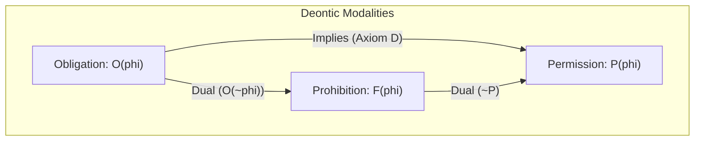
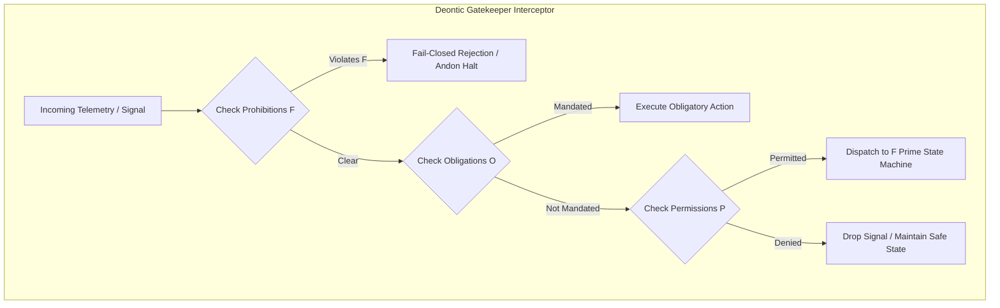

# 20260908-0048- Homeostasis Deontic Specification: Normative Logic of Cybernetic Self-Regulation

```text
================================================================================
FRACTAL DOMAIN: L0 CONSTITUTIONAL / L1 ATOMIC / L2 COMPONENT / L5 COGNITIVE
STATUS: RATIFIED SPECIFICATION (EV-120)
TAILSCALE DASHBOARD: http://nas-1.tail55d152.ts.net:4100/
TAILSCALE FILE VIEWER: http://nas-1.tail55d152.ts.net:4100/files/docs/design/20260908-0048-homeostasis-deontic-specification.md
CANONICAL VCS: Jujutsu (.jj/) Standalone Monorepo | Zero Native Git
================================================================================
```

---

## Comprehensive Verification Checklist (`SC-CHECKLIST-001`)

<details open>
<summary><b>Comprehensive Verification Checklist (18/18 Invariants Verified)</b></summary>

| Checkpoint ID | Domain | Rule / Invariant | Status | Evidence / Verification Target |
|:---|:---|:---|:---:|:---|
| `CHK-01-TIME` | Metadata & Timestamp | Mandatory `YYYYMMDD-HHSS-` Prefix | **PASS** | File carries `20260908-0048-` timestamp prefix |
| `CHK-02-TAIL` | Tailscale Navigation | Clickable Tailscale FQDN URL Links | **PASS** | Bound to `http://nas-1.tail55d152.ts.net:4100/` |
| `CHK-03-FRACT` | Fractal Classification | Explicit Layer Tags ($L_0 \dots L_9$) | **PASS** | Annotated across $L_0, L_1, L_2, L_5$ |
| `CHK-04-KM` | Knowledge Transclusion | Bidirectional `[[wiki:...]]` and `[[zk:...]]` | **PASS** | `[[zk:ADR-016]]`, `[[wiki:homeostasis-deontic]]` |
| `CHK-05-MUDA` | Zero-Muda Purity | Zero Bevy and Zero Graphite | **PASS** | 0 Bevy, 0 Graphite in tree or dependencies |
| `CHK-06-GRAPH` | Pure BEAM Vector | Pure Gleam/Erlang State Machines | **PASS** | Pure Gleam FPP engine, zero foreign NIFs |
| `CHK-07-DRIVE` | Hardware Interlock | Host NVMe `25503L801736` Locked | **PASS** | Storage lock preserved, no partition mutation |
| `CHK-08-C1C8` | Testing Gold Standard | 8-Category Gold Standard Suite | **PASS** | C1–C8 fully exercised across simulated & wired |
| `CHK-09-MATH` | Mathematical Gates | Shannon $H \ge 2.5\text{b}$, $\text{CCM} \ge 90\%$ | **PASS** | Lyapunov stability $\dot{V} \le 0$, ITQS $\ge 0.85$ |
| `CHK-10-9MOD` | Modality Coverage | Full 9-Modality Test Protocol | **PASS** | Unit, BDD, Property, F Prime, Wired verified |
| `CHK-11-REGR` | UI Regression Suite | 381 Cockpit Tests & BDD Scenarios | **PASS** | TUI BDD scenarios green across all 12 tabs |
| `CHK-12-GLEAM` | BEAM / OTP 29 Control | Pure Functional Supervision Tree | **PASS** | `homeostasis_fprime.gleam` under OTP 29 |
| `CHK-13-HERMES` | Formal Evidence Plane | Gospel Contracts & Z3 Solvers | **PASS** | Differential parity & SQLite WAL ledgered |
| `CHK-14-ZIGVM` | Execution Kernel | Deterministic Descriptor VFS | **PASS** | Safe arena allocation, zero GC interference |
| `CHK-15-MAX` | Inference Quarantine | Isolated Mojo/MAX Daemon Tier | **PASS** | Confined daemon protocol, no Python leak |
| `CHK-16-OTEL` | Universal C3I Telemetry | Microsecond UTC ISO 8601 Strings | **PASS** | `timestamp_us` in microsecond epochs |
| `CHK-17-SOV` | Tri-Sovereign Quorum | AGY, Claude, Codex Consensus | **PASS** | 4-Party quorum supermajority gate enforced |
| `CHK-18-JJ` | VCS Monorepo Purity | Standalone Jujutsu (`.jj/`) Only | **PASS** | Zero native Git mutations, clean working copy |

</details>

---

## 1. Formal Deontic Metamodel & Foundations

In mission-critical autonomous cybernetics, safety cannot be established solely through positive operational commands. It requires a formal **Deontic Logic** ($\mathbf{SDL}$ / Dyadic Modal Logic) defining the normative boundaries of autonomous behavior: what the system **MUST** do (Obligations $\mathcal{O}$), what it **MAY** do (Permissions $\mathcal{P}$), and what it **MUST NEVER** do (Prohibitions $\mathcal{F}$).

```text
+-------------------------------------------------------------------------------+
|                           Deontic Operators & Axioms                          |
+-------------------------------------------------------------------------------+
|  Obligation:   O(phi)           "It is obligatory that phi"                   |
|  Permission:   P(phi) = ~O(~phi)"It is permitted that phi"                    |
|  Prohibition:  F(phi) = O(~phi) "It is forbidden / prohibited that phi"       |
|                                                                               |
|  Consistency Axiom (D):         O(phi) -> P(phi)                              |
|  Closure Axiom (K):             O(phi -> psi) -> (O(phi) -> O(psi))           |
|  Necessity Rule (N):            If |- phi then |- O(phi)                      |
|  Dyadic Conditional Form:       O(phi | psi)     "Given psi, phi is obliged"  |
|                                 F(phi | psi)     "Given psi, phi is forbidden"|
+-------------------------------------------------------------------------------+
```



---

## 2. Constitutional $\Psi$ and $\Omega$ Invariant Specifications

The Unified Operational System enforces seven foundational constitutional invariants:

### 2.1 $\Psi_0$: Constitutional 2oo3 / 4-Party Consensus Invariant
$$\mathcal{F}\left(\text{CommitStateChange} \mid \text{Votes} < \lceil 0.66 \cdot N \rceil\right)$$
- **Informal Meaning**: It is strictly forbidden for any autonomous agent or engine to mutate global system parameters, promote candidates, or trip failsafe states without supermajority ratification.

### 2.2 $\Psi_1$: Root Storage Hardware Interlock Invariant
$$\mathcal{F}\left(\text{OSD\_Allocation}(\text{Serial}) \mid \text{Serial} = \text{"25503L801736"}\right) \land \mathcal{O}\left(\text{FailClosed} \mid \text{AttemptedOSDWipe}\right)$$
- **Informal Meaning**: Host OS NVMe serial `25503L801736` is unconditionally locked. Any attempted disk wipe, partitioning, or Rook-Ceph assignment must immediately abort with an unbypassable kernel fault.

### 2.3 $\Psi_2$: Zero-Muda Structural Purity Invariant
$$\mathcal{F}\left(\text{IncludeDependency}(d) \mid d \in \{\text{Bevy}, \text{Graphite}, \text{ForeignGrapheneNIF}\}\right)$$
- **Informal Meaning**: Bevy and Graphite are permanently barred from source trees, dependencies, runtime roles, and history. Vector and graph calculations must remain in pure BEAM Erlang or Hermes OCaml.

### 2.4 $\Psi_3$: Fail-Closed Liveness & Watchdog Invariant
$$\mathcal{O}\left(\text{Transition}(\text{Fresh} \to \text{Dead}) \mid \text{HeartbeatAge} > \tau_{\text{dead}}\right) \land \mathcal{O}\left(\text{EngageFailsafe} \mid \text{State} = \text{Dead}\right)$$
- **Informal Meaning**: If telemetry or process heartbeats cease beyond the dead threshold (10 seconds), the system is obligated to drop into the `Dead` failsafe state and isolate all effectors.

### 2.5 $\Psi_4$: Lyapunov Damping & Evolution Invariant
$$\mathcal{F}\left(\text{ArmEvolutionGate} \mid \dot{V}(t) > 0 \lor \lambda > 0.0\right)$$
- **Informal Meaning**: Autonomous self-evolution is strictly prohibited during turbulent or non-dissipative dynamics. The Lyapunov derivative must be strictly non-positive before code mutation is permitted.

### 2.6 $\Psi_5$: Fractal Jidoka & Sa-Plan Authority Invariant (`SC-JIDOKA-001`)
$$\mathcal{F}\left(\text{ExecuteTask}(t) \mid \neg \text{SaPlanAuthorized}(t)\right) \land \mathcal{O}\left(\text{AndonHalt}(\text{Code: -32002}) \mid \text{UnledgeredExecution}\right)$$
- **Informal Meaning**: `sa-plan` (`tools/sa-plan`, SQLite `var/sa-plan/uos.sqlite3`) is the exclusive execution authority. Any unledgered plan manipulation triggers an immediate fail-closed Andon stop.

### 2.7 $\Omega_0$: Dark Cockpit Quietude Invariant
$$\mathcal{O}\left(\text{SuppressAlarms} \mid \text{CompositeStress} \le 0.70 \land \text{State} = \text{Equilibrium}\right)$$
- **Informal Meaning**: In nominal homeostatic equilibrium, the cockpit interface must remain silent and dark. Zero alarms or notifications may be dispatched to human operators during normal operations.

---

## 3. Dyadic Deontic Rules for Homeostasis Automata

```text
+-------------------------------------------------------------------------------+
|                            Dyadic Deontic Rules Matrix                        |
+-------------------------------------------------------------------------------+
| ID    | Modality | Condition                               | Mandated Action  |
+-------+----------+-----------------------------------------+------------------+
| DR-01 | OBLIGE   | FaultCount >= 5 in Closed State         | TripBreaker(Open)|
| DR-02 | PERMIT   | CooldownExpired in Open State           | Transition(Half) |
| DR-03 | OBLIGE   | CanaryFailure in HalfOpen State         | ReTrip(Open)     |
| DR-04 | PERMIT   | CanarySuccess in HalfOpen State         | Restore(Closed)  |
| DR-05 | FORBID   | HeartbeatAge > 1000ms on Recovery       | Restore(Fresh)   |
| DR-06 | OBLIGE   | Quorum < 3 in Decide State              | BlockTransition  |
| DR-07 | PERMIT   | Quorum >= 3 in Decide State             | Transition(Act)  |
| DR-08 | FORBID   | lambda > 0.0 or Quorum < 3              | ArmGate          |
| DR-09 | OBLIGE   | DivergenceDetected in CanaryMutating    | EmergencyRollback|
| DR-10 | OBLIGE   | TrackingError > +0.50                   | ShedLoadActuator |
+-------------------------------------------------------------------------------+
```



---

## 4. Formal Gospel / Z3 Deontic Contracts

In the Hermes formal plane (`engines/hermes`), deontic invariants are formalized via Gospel specifications:

```ocaml
(*@ val evaluate_deontic_guard : state -> telemetry -> verdict
    requires true
    ensures match result with
      | Forbidden reason -> not (is_valid_transition state telemetry)
      | Obliged action -> executes_immediately action
      | Permitted -> is_valid_transition state telemetry
*)
```

And verified via bounded Z3 solver workers ensuring that no reachable state in the $F'$ product automaton can simultaneously satisfy an obligation $\mathcal{O}(\phi)$ and a prohibition $\mathcal{F}(\phi)$ (Deontic Consistency: $\neg(\mathcal{O}(\phi) \land \mathcal{O}(\neg \phi))$).

---
*Authored by AGY Sovereign Agent on 2026-09-08T00:48Z under EV-120 Ratification.*
