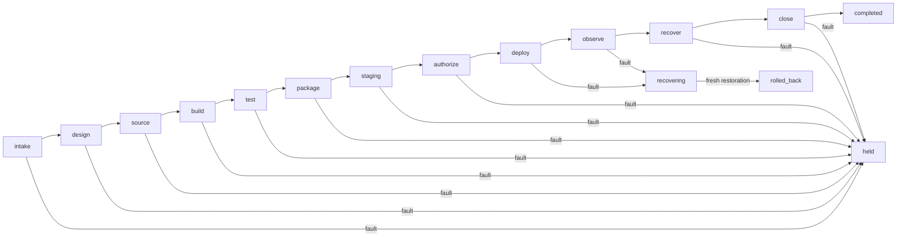

# 20260908-0551 — Release lifecycle, denotation and verification contract

#fractal-l0 #fractal-l4 #fractal-l8 #zk-adr #zero-muda #tailscale-web

[UOS](http://nas-1.tail55d152.ts.net:4100/) · [Runbook](http://nas-1.tail55d152.ts.net:4100/docs/sop/20260908-0551-web-release-sdlc-sre-runbook.md) · [Journal](http://nas-1.tail55d152.ts.net:4100/docs/journal/20260908-0551-homeostasis-release-journal.md)

Status: implementation candidate. Source composition: a0679e3ddc6cbe22a2b38bfcabacf28378598b39 + bf136217a93b887c6f8a2f5e52cc2c3e278a5cc6, followed by isolated release tooling changes. Sa-plan: uos/homeostasis-release/20260908-0551. Publication and production admission are separate.

## Observations, ontology and boundaries

A release is an immutable candidate identity and a prefix of accepted stage evidence. Observe the candidate, current waiting stage, artifact inventory, actual VM version, process/run identity, check exit status, monotonic duration, and remaining blockers. A requested version is configuration; only the VM is a runtime observation.

Values: revision, digest, stage, duration, receipt. Entity: runtime instance. Aggregate: release lifecycle. Commands: submit evidence, report fault, report restoration. Observations and action labels have no deployment authority. Sa-plan and the fresh runtime lease remain external effect preconditions. The UI and advisory tools cannot authorize their own changes.

The preserved F Prime substrate is the UOS Gleam metamodel and interpreter in fpp/domain.gleam and fpp/interp.gleam, used by fpp/homeostasis_fprime.gleam. The new fpp/release_lifecycle.gleam uses that substrate. It is an executable UOS FPP projection; official FPP compiler conformance and NASA certification are not claimed.

The operator explicitly requested OCaml and Mojo scripts and prohibited new Bash scripts. OCaml owns bounded process execution, inventories and evidence parsing. Mojo exposes the same command surface by replacing its process with the OCaml interpreter through the existing Python standard library os.execv; it also provides an independent transition interpreter. Gleam owns the typed lifecycle. Shared operational code deliberately avoids two competing deployment implementations. No Python installation was performed; future Python installations must use devenv or Determinate Nix. Existing Pixi execution uses --no-install --frozen. Existing runtime binaries and package sources are reused; model inference is unnecessary for these deterministic checks.

## Semantic domain and laws

Let S = [intake, design, source, build, test, package, staging, authorize, deploy, observe, recover, close].
A normal state is (candidate c, completed prefix length n), 0 ≤ n ≤ 12. Terminal states include held and rolled_back; recovering waits for restoration evidence.

Define V(c,n,r,t) to mean: r belongs to c and S[n]; passes every required check; has a valid digest; 0 ≤ observation ≤ t ≤ expiry; expiry − observation ≤ 3,600,000 ms. Times are observations supplied by the interpreter from the same clock domain, never model estimates.

- L1 — ordered progress: step((c,n),r,t) = (c,n+1) iff n < 12 and V(c,n,r,t).
- L2 — rejection: wrong, missing, duplicated, stale, future, failed or foreign-candidate evidence cannot advance.
- L3 — no skip/replay: an accepted receipt for n cannot advance state n+1; completion is terminal.
- L4 — replay determinism: equal initial observations and event sequence give equal final observations.
- L5 — fold composition: fold(xs ++ ys,s) = fold(ys,fold(xs,s)) for valid prefixes.
- L6 — failure routing: a fault while deploy/observe is pending enters recovering; other waiting stages enter held.
- L7 — rollback: recovering reaches rolled_back only with fresh restoration evidence. Starting again requires a new release lifecycle.
- L8 — authority separation: transition outputs are labels/evidence; their interpretation performs no service or VCS mutation.
- L9 — byte closure: the actual set of regular files and their SHA-256 digests must exactly equal the manifest; missing, altered, extra, symlink and special-file entries are refused.
- L10 — runtime truth: reported OTP = erlang:system_info(otp_release), independent of environment labels.
- L11 — bounded execution: argv is passed without a shell; elapsed time and captured output are bounded; timeout/output overflow kill and reap the owned process group.
- L12 — observational parity: the Gleam FPP projection, OCaml prefix oracle and Mojo prefix interpreter agree on all 338 combinations of current stage, incoming stage and valid/invalid evidence in the declared finite domain.

The 338-case check covers ordered-progress observations; Gleam separately tests failure and rollback paths. It is not an unbounded distributed-systems proof. Stage JSON validation proves structural consistency, not authenticity of externally submitted claims. Re-evaluate actual evidence and live ownership at the effect boundary.

## State graph sources

ASCII:
```text
intake -> design -> source -> build -> test -> package -> staging -> authorize
authorize -> deploy -> observe -> recover -> close -> completed
intake,design,source,build,test,package,staging,authorize,recover,close --fault--> held
deploy,observe --fault--> recovering --fresh restoration--> rolled_back
```

Mermaid:


Recover on the normal path checks recovery readiness/evidence, not a forced production rollback. Actual incident restoration follows recovering → rolled_back and cannot silently resume a failed release.

## STPA / FMEA and operational constraints

| Unsafe control action | Hazard | Constraint and checker |
|---|---|---|
| Required rollback is not provided | Outage cannot be recovered | Separate staged restoration receipt before replacing production |
| Wrong version/target is started | Incorrect code or tenant/service receives effects | Exact candidate, complete manifest, actual OTP, explicit bind/port, PID/run identity |
| Correct action occurs too early/late | Stale lease, stale tests or concurrent cutover | Sa-plan dependency, fresh cooperative lease, time-bounded receipts, target recheck |
| Retry continues too long or stops too soon | Restart storm, hanging tool, incomplete verification | Monotonic deadline, output cap, process-group cleanup, bounded restart budget |

Intake prioritization is C4 × STPA4 × FMEA4 × dependency4 × impact3 = 768 (P1). This ranks eligible work; it grants no authority. A discovered unresolved security issue is a separate deployment blocker regardless of this score.

FMEA: wrong-runtime observation S4/O3/Det3 = RPN36; stale/partial artifact S4/O3/Det3 = RPN36; unsupported rollback S4/O2/Det4 = RPN32. Risk values are engineering judgments. Check receipts establish only the controls actually exercised.

## Evidence contract

Each stage records candidate, stage, PASS/FAIL/UNKNOWN, named checks, observed time, expiry, evidence digest, tool version, command/argv reference, exit code, monotonic duration, and scope. Credentials and raw private environment values are excluded. The JSON packet checker accepts the declared structural subset and rejects missing/duplicate/unknown fields. Tool receipts must be retained and independently bound to the submitted digest.

The artifact manifest includes every shipped regular file except the manifest itself. It is local integrity evidence, not a signature, trusted boot proof, workload identity, or protection against the same OS user rewriting both files and manifest. Packaging/startup require cooperative ownership and private release directories.

## Remaining verification boundaries

Manual operator acceptance, actual production cutover, production rollback, independent sovereign review, official FPP/Lean/Quint proofs, complete service authorization/security, cross-node failover, reboot persistence, and end-to-end OTel delivery require their own receipts. Global green status must not be inferred from component tests.


<details><summary>Verification checklist — five domains, 18 checkpoints</summary>

| Domain | Checkpoints | Scope |
|---|---|---|
| Metadata and navigation | CHK-01-TIME, CHK-02-TAIL, CHK-03-FRACT, CHK-04-KM | Timestamp, full Tailnet links, tags and evidence references |
| Purity and storage | CHK-05-MUDA, CHK-06-GRAPH, CHK-07-DRIVE | Existing runtimes only; no drive operations |
| Verification | CHK-08-C1C8, CHK-09-MATH, CHK-10-9MOD, CHK-11-REGR | Scoped test receipts; broader gates remain unverified |
| Runtime and observability | CHK-12-GLEAM, CHK-13-HERMES, CHK-14-ZIGVM, CHK-15-MAX, CHK-16-OTEL | Distinguish actual process observations from simulations |
| Governance and JJ | CHK-17-SOV, CHK-18-JJ | Independent admission outstanding; isolated JJ work |

No row grants a passing global checklist. Consult the revision-bound verification receipt.
</details>
