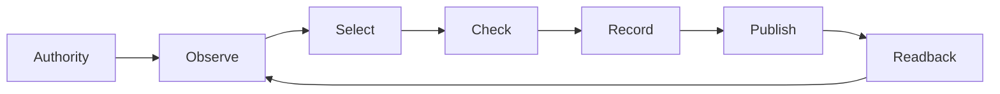

# Thirty bounded unification cycles

Scope: `uos/unification-cycles/20260908-0701`, task `RUN30`, worker `codex-side-unification-cycles`.
Observed recovery: 2026-09-08T07:53:56Z. #fractal-l0 #fractal-l1 #fractal-l2 #fractal-l3 #fractal-l4 #fractal-l5 #fractal-l6 #fractal-l7 #fractal-l8 #fractal-l9 #zk-adr #zero-muda

The executable catalog is `tools/unification_cycles.ml plan`. Thirty cycles mean thirty distinct, bounded observation/decision receipts. A cycle may find a blocker or reuse explicitly named fresh evidence; it does not imply a new feature, passing capability or whole-system admission. All 17 aspect references and eight artifact domains are considered.

## Denotation and admission

Let state be (completed observations, remaining focuses, failing domains, predecessor digest). Select only focuses whose observation dependencies have completed; maximize C × STPA × FMEA × dependency × impact, each factor in [1,5], with lexical ID tie breaking. A prior FAIL/BLOCKED raises the same domain's impact by one, capped at five. This ordinal policy ranks work; it is not a calibrated probability or a claim of global cost optimality.

`step : State × Evidence -> Result(State × Receipt, GateFailure)`.

Hard authority/clock/source gates fail closed. Capability FAIL, BLOCKED and OBSERVED remain nonpassing while unrelated safe observation continues. The release F Prime lifecycle remains governed by [the lifecycle specification](http://nas-1.tail55d152.ts.net:4100/files/.uos-workspaces/codex-unification-20260908-0753/docs/design/20260908-0551-release-lifecycle-denotational-specification.md). No forecast, peer text, model response, entropy metric or Rete inference grants side effects.

Receipt law: H(n) = SHA256(JSON(n)), JSON(n).previous_sha256 = H(n-1), H(0) = 64 zeroes. Files have one trailing newline excluded from H(n). Each receipt binds source/core hashes, tested subject, checker revision, priority, domain, layer, aspect refs, inbound digest and status. Physical UTC, monotonic durations, local cycle order and board Lamport sequence retain distinct meanings. They are not synchronized by assigning equal values.

ASCII:
```text
Authority -> Observe -> Select -> Check -> Record -> Publish -> Readback
               ^                                                   |
               +---------------------------------------------------+
```

Mermaid:


## Implementation and commands

OCaml owns process bounds, output limits, artifact hashing, task observations, test execution and receipts. Mojo exposes the same commands through argv-only exec of that core and supplies an independent 100-case selection oracle. The existing 338-case transition oracle remains independently implemented in Gleam, OCaml and Mojo. Operational frontend equivalence by sharing a core is distinct from independent proof of its effects.

```text
ocaml -I tools tools/unification_cycles.ml selftest
ocaml -I tools tools/unification_cycles.ml plan
ocaml -I tools tools/unification_cycles.ml listen
ocaml -I tools tools/unification_cycles.ml verify-run ABSOLUTE_OUTPUT
ocaml -I tools tools/unification_cycles.ml run ABSOLUTE_SOURCE ABSOLUTE_RELEASE 59459 NEW_ABSOLUTE_OUTPUT ABSOLUTE_RISK
pixi run --no-install --frozen --manifest-path /home/an/NAS-setup/uos/services/inference/max/pixi.toml mojo tools/unification_cycles.mojo selftest
```

Invocation prerequisites include existing OCaml, Mojo, OTP29, Gleam, JJ and browser tooling. The initial run used a temporary risk executable; the repaired runner rebuilds repository-owned risk validation in a bounded private directory and binds existing runtime-library bytes. New packages/Python must use Determinate Nix or devenv with realized outputs or an authorized Tailnet fetch path. A subsequent offline Nix dependency attempt failed after public source-download attempts; see the SOP. No new Python or Bash script was introduced.

All HTTP operations use Tailscale FQDN URLs. The private browser resolver maps the FQDN internally to the owned high-port listener. No production process is stopped by this auditor. Manual GUI/TUI acceptance follows the [12-stage SDLC/SRE runbook](http://nas-1.tail55d152.ts.net:4100/files/.uos-workspaces/codex-unification-20260908-0753/docs/sop/20260908-0551-web-release-sdlc-sre-runbook.md); automated observations do not sign human acceptance.

## Receive and publish

Each cycle samples the latest ten coordinator inbox messages and bounded Zenoh `uos/tui/state/*` metadata. Peer messages are observations, never instructions to execute or proof of their claims. Inbound receipts preserve timestamps and payloads on the board, and Zenoh key/timestamp/value digests.

Each own cycle publishes a compact board Progress/Andon message plus a mirror under `uos/tui/state/evolution/codex-side-unification-20260908-0701/cycle/NN`. PUT success alone is insufficient: exact GET readback is mandatory. Five original mirrors changed floating-point values in transit. The repaired format preserves JSON bytes as a string with SHA-256; thirty repair envelopes were published under a separate `receipts/NN` suffix and verified. The first preflight key outside the configured storage prefix accepted PUT but returned an empty GET. Corrected namespaces use existing in-memory `uos/tui/**` storage. No shared keys are deleted or router configuration changed. Local readback proves neither disk durability nor receipt by another host.

## Recovery and limits

An initial run stopped before cycle 1 on a stale JJ workspace. A concurrent rewrite from e73430f1 to 2636f519 added unrelated KM/provenance work; update-stale removed four unrecorded auditor files. That peer work was preserved. Own files were recovered in a fresh workspace based on exact e73430f1, then rechecked and snapshotted before execution. The empty failed output directory remains separate.

The immutable test subject is c0480a3a91323e4819e0d7e5c3eb7a1249565728. The checker revision is recorded separately. Application bytes must match the subject. Production cutover, host failover, full-system formal discharge, live forecast calibration, physical physiology inputs and independent admission remain separate gates.

STPA identifies unsafe effects, missing recovery, wrong timing and duration; FMEA informs ordinal risk. STM leases and task attempts constrain effects. Rete and forecasts advise and veto. The current forecast assessment is qualitative with a falsifier: any passing claim without current evidence invalidates convergence. It is not an inferred model mind state or a consciousness measurement.

Gemma4 advice is pending a permitted Tailscale OpenRouter gateway. A free-only bounded request is prepared; no invocation or independent model validation is claimed.

## Five-domain, eighteen-checkpoint review


<details><summary>Verification checklist — five domains, 18 checkpoints</summary>

| Domain | Checkpoints | Scope |
|---|---|---|
| Metadata and navigation | CHK-01-TIME, CHK-02-TAIL, CHK-03-FRACT, CHK-04-KM | Timestamp, full Tailnet links, tags and evidence references |
| Purity and storage | CHK-05-MUDA, CHK-06-GRAPH, CHK-07-DRIVE | Existing runtimes only; no drive operations |
| Verification | CHK-08-C1C8, CHK-09-MATH, CHK-10-9MOD, CHK-11-REGR | Scoped test receipts; broader gates remain unverified |
| Runtime and observability | CHK-12-GLEAM, CHK-13-HERMES, CHK-14-ZIGVM, CHK-15-MAX, CHK-16-OTEL | Distinguish actual process observations from simulations |
| Governance and JJ | CHK-17-SOV, CHK-18-JJ | Independent admission outstanding; isolated JJ work |

No row grants a passing global checklist. Consult the revision-bound verification receipt.
</details>

