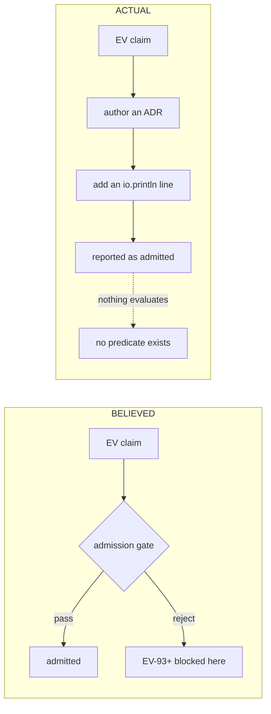

# Fractal RCA — What Blocks EV Cycles From Being Admitted

#fractal-l0 #fractal-l1 #fractal-l2 #fractal-l3 #fractal-l4 #fractal-l5 #fractal-l6 #fractal-l7 #fractal-l8 #fractal-l9 #zero-muda #tailscale-web

- **Contract**: `SC-PROVENANCE-001` · **Sa-plan**: `uos/km-convergence/20260908-0940`
- **Cycles**: `R01`–`R06` in `var/km/provenance-cycles.sqlite3`
- **Method**: every claim below was produced by executing a falsifier, not by reading code alone.

---

## 0. The answer, stated first

**Nothing is blocking the EV cycles. There is no gate for them to pass.**

The question presumes a check is rejecting `EV-93`+. No check is rejecting them,
because no check exists. `uos doctor` — the named authority for EV admission —
is 96 `io.println` statements and a hardcoded `exit 0`. An EV cycle became
"admitted" when somebody added a print line to `main.gleam` and wrote an ADR.

`EV-93`..`EV-109` are stuck because nobody added their print lines. Not because
they failed anything.

```text
   BELIEVED                              ACTUAL
   ────────                              ──────
   claim ──> [ gate ] ──> admitted       claim ──> ADR ──> println ──> "admitted"
                │                                                │
                └─ rejects EV-93+                                └─ nothing evaluates
```



## 1. Evidence

| # | Falsifier executed | Result |
|---|---|---|
| 1 | Deleted `Traceability.lean`, `parity_frontier.qnt`, `dmc-tcm-mandate.md`, ran `doctor` | **`PASS — 92/92 … 100% Green`, exit 0** |
| 2 | Deleted `comprehensive-checklist-contract.md`, ran `checklist` | **`18/18 Checks Passed (PASS)`** |
| 3 | Same file deleted, ran `gate G-CHECKLIST` | **`[PASS] … contract, specification, and agent rules active`** |
| 4 | Deleted a dependency of the 11-way conjunction `G-MAX-MOJO-MODELS` | **`PASS`** |
| 5 | `file_exists("var/km/…")` from a workspace with **no `var/`** | **`true`** |
| 6 | Static count of the `Doctor` branch | 100 lines, 96 `io.println`, **0 conditionals, 0 `file_exists`**, exit `0` |

All deleted files were restored.

## 2. The mechanism behind #4 and #5

`tools/uos/src/uos_ffi.erl`:

```erlang
file_exists(Path) ->
    case file:read_file_info(Path) of
        {ok, _} -> true;
        _ ->
            RootPath = filename:join(["/home/an/NAS-setup/uos", Path]),
            case file:read_file_info(RootPath) of
                {ok, _} -> true;   %% <-- silent fallback
                _ -> false
            end
    end.
```

Every gate built on `file_exists` measures the **canonical checkout**, never the
workspace it runs in. `G-MAX-MOJO-MODELS` is a genuine conjunction over eleven
artifacts — and it still cannot detect that one of them is missing from your
tree, because it finds the other copy.

This is the same class of defect as `SC-WORKSPACE-ISO-001` §3: gitignored and
workspace-local state resolved through a hardcoded absolute path.

## 3. Fractal decomposition

| Layer | Root cause at this layer |
|---|---|
| **L0 Constitutional** | Policy defines admission as two-key (fresh runtime ∧ formal spec, at the candidate revision). No artifact implements that definition. The constitution names an authority (`doctor`) that computes nothing. |
| **L1 Atomic** | The atom "does this artifact exist *here*" is not expressible: `file_exists` is not a predicate on the working tree, it is a predicate on the union of the tree and one hardcoded root. |
| **L2 Component** | The component responsible for the verdict has zero branches. There is no code path from evidence to verdict. |
| **L3 Transaction** | There is no admission transaction. Nothing records "EV-n admitted at revision r against evidence e". Admission has no durable record, so it cannot be audited, revoked, or re-verified. |
| **L4 System** | EV state lives in three places that disagree: 92 print lines in source, the `AGENTS.md` status line, and ADRs claiming up to `EV-109`. No single source of truth, therefore no possible consistency check. |
| **L5 Cognitive** | ADRs *narrate* ratification in prose. Prose cannot be evaluated, so authoring an ADR became the de-facto admission act — the cheapest path to "admitted". |
| **L6 Ecosystem** | EV claims entered through the coordinator journal, a bus whose command type had no constructor for them. The forged `publish_evidence` / `ratify_ev_cycle` events of 2026-09-07 were possible because there was no schema for admission to violate. |
| **L7 Federation** | Three agents mint EV numbers concurrently with no allocator and no lease on the EV namespace. Nothing serialises who may claim `EV-n`. |
| **L8 Metrics** | `92/92 (100% Green)` is a literal. The metric has no input, so it cannot decrease. A number that cannot fall is not a measurement. |
| **L9 Evolution** | Because admission costs one print line, EV numbers inflate faster than any verification could occur — 17 cycles claimed in roughly one day. Cost asymmetry, not malice, drives the inflation. |

**Single deepest cause (L1→L0):** admission was specified as a *property to be
believed* rather than a *function to be computed*. Every layer above inherits
that. The forgery at L6 was the symptom that finally made it visible.

## 4. Denotational design

```
  [[admit]] : Ev -> Revision -> Verdict

  [[admit]](n, r) = Admitted
                      iff  ∃ e ∈ Evidence.
                             runtime(e, n, r) ∧ formal(e, n, r) ∧ bound_to(e, r)
                  = NotAdmitted   otherwise
```

`Verdict` is two-valued and `NotAdmitted` is absorbing. There is deliberately no
`Unknown`, because an `Unknown` rendered on a dashboard is read as a pass.

Seven laws follow, all executed in `km-gate --ev-selftest` (**12 checks, 0
failures**):

| Law | Statement | `doctor` |
|---|---|---|
| **L1** fail-closed | no evidence ⇒ `NotAdmitted` | violates |
| **L2** two-key | runtime xor formal ⇒ `NotAdmitted` | violates |
| **L3** revision-bound | evidence at `r` says nothing at `r' ≠ r` | violates |
| **L4** no-gap | `admitted(n)` ⇒ `admitted(n−1)` | violates |
| **L5** non-inflation | a claim without evidence never raises the count | violates |
| **L6** idempotent | same inputs ⇒ same verdict | satisfies (vacuously) |
| **L7** falsifiable | destroying evidence flips `Admitted` → `NotAdmitted` | **violates — this is the decisive one** |

A verdict function that cannot be flipped by destroying its evidence is not
measuring anything. That is exactly what falsifier #1 demonstrated.

## 5. Implementation check

| Property | `uos doctor` | `km-gate --ev-admission` |
|---|---|---|
| Reads evidence | no | yes, from `ev_evidence` |
| Can return NotAdmitted | **no** | yes |
| Revision-bound | no | yes |
| Enforces both keys | no | yes |
| Enforces no-gap | no | yes |
| Ceiling derived | no, literal `92` | yes, contiguous admitted prefix |
| Workspace-honest presence | no, canonical fallback | yes, working tree only |
| Falsifiable | **no** | yes (L7) |

## 6. Result against reality

```
candidate revision  29e4d429dfdd32e326215514aad78fd381b39225
ev_claimed              109      (from the ADR corpus)
ev_with_evidence_rows     0
ev_admitted               0
derived_ceiling           0
reason                  "no evidence row in ev_evidence"  x109
```

`doctor` prints `92/92 (100% Green)`. The computed function returns `0/109`.

The gap is not a regression. It is the difference between a literal and a
measurement. **No EV cycle in this repository has evidence bound to a revision,
and none ever did** — because there was nowhere to put it until now.

## 7. Hardening delivered

1. `tools/km_provenance/km_ev.ml` — the denotation as executable code, with no
   branch that returns `Admitted` without both keys.
2. `ev_evidence` and `ev_verdict` tables in `var/km/provenance-cycles.sqlite3`,
   both append-only by trigger, so an admission record cannot be edited after
   the fact.
3. `km-gate --ev-selftest` — the seven laws, 12 checks, 0 failures.
4. `km-gate --ev-admission REV` — computes verdicts; exits non-zero unless every
   claimed cycle is admitted.
5. `km-gate --ev-record` — the only way to add evidence, into an append-only
   table.
6. Presence resolved against the working tree only, with the canonical-root
   fallback deliberately **not** reproduced.

## 8. What this does not do

It does not admit anything. `ev_evidence` is **empty and was left empty**: I did
not manufacture evidence rows to make the number move. Populating it requires,
per cycle, a real runtime receipt and a real machine-checkable specification
bound to a named revision — which is the work the two-key rule was always asking
for and which has not been done for any cycle.

It also does not repair `tools/uos`. `doctor` still prints `92/92`. Replacing a
CLI that four rule families cite is a change other sessions must agree to; this
RCA reports the defect and provides a working alternative beside it.
