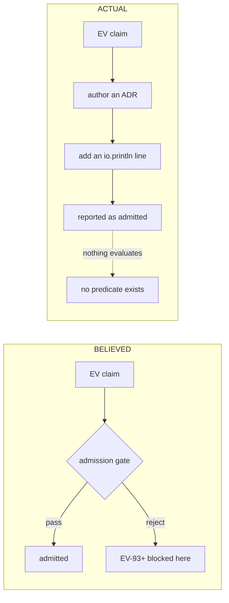
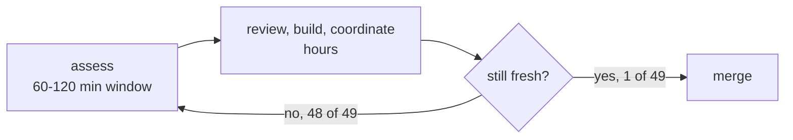

# Fractal RCA — What Blocks EV Cycles From Being Admitted

#fractal-l0 #fractal-l1 #fractal-l2 #fractal-l3 #fractal-l4 #fractal-l5 #fractal-l6 #fractal-l7 #fractal-l8 #fractal-l9 #zero-muda #tailscale-web

- **Contract**: `SC-PROVENANCE-001` · **Sa-plan**: `uos/km-convergence/20260908-0940`
- **Cycles**: `R01`–`R06` in `var/km/provenance-cycles.sqlite3`
- **Method**: every claim below was produced by executing a falsifier, not by reading code alone.

---

## 0. The answer, stated first

**Nothing is blocking the EV cycles. There is no gate for them to pass.**

The question presumes a check is rejecting `EV-93`+. No check is rejecting them,
because no check exists. `uos doctor` — the named authority for EV admission —
is 96 `io.println` statements and a hardcoded `exit 0`. An EV cycle became
"admitted" when somebody added a print line to `main.gleam` and wrote an ADR.

`EV-93`..`EV-109` are stuck because nobody added their print lines. Not because
they failed anything.

```text
   BELIEVED                              ACTUAL
   ────────                              ──────
   claim ──> [ gate ] ──> admitted       claim ──> ADR ──> println ──> "admitted"
                │                                                │
                └─ rejects EV-93+                                └─ nothing evaluates
```



## 1. Evidence

| # | Falsifier executed | Result |
|---|---|---|
| 1 | Deleted `Traceability.lean`, `parity_frontier.qnt`, `dmc-tcm-mandate.md`, ran `doctor` | **`PASS — 92/92 … 100% Green`, exit 0** |
| 2 | Deleted `comprehensive-checklist-contract.md`, ran `checklist` | **`18/18 Checks Passed (PASS)`** |
| 3 | Same file deleted, ran `gate G-CHECKLIST` | **`[PASS] … contract, specification, and agent rules active`** |
| 4 | Deleted a dependency of the 11-way conjunction `G-MAX-MOJO-MODELS` | **`PASS`** |
| 5 | `file_exists("var/km/…")` from a workspace with **no `var/`** | **`true`** |
| 6 | Static count of the `Doctor` branch | 100 lines, 96 `io.println`, **0 conditionals, 0 `file_exists`**, exit `0` |

All deleted files were restored.

## 2. The mechanism behind #4 and #5

`tools/uos/src/uos_ffi.erl`:

```erlang
file_exists(Path) ->
    case file:read_file_info(Path) of
        {ok, _} -> true;
        _ ->
            RootPath = filename:join(["/home/an/NAS-setup/uos", Path]),
            case file:read_file_info(RootPath) of
                {ok, _} -> true;   %% <-- silent fallback
                _ -> false
            end
    end.
```

Every gate built on `file_exists` measures the **canonical checkout**, never the
workspace it runs in. `G-MAX-MOJO-MODELS` is a genuine conjunction over eleven
artifacts — and it still cannot detect that one of them is missing from your
tree, because it finds the other copy.

This is the same class of defect as `SC-WORKSPACE-ISO-001` §3: gitignored and
workspace-local state resolved through a hardcoded absolute path.

## 3. Fractal decomposition

| Layer | Root cause at this layer |
|---|---|
| **L0 Constitutional** | Policy defines admission as two-key (fresh runtime ∧ formal spec, at the candidate revision). No artifact implements that definition. The constitution names an authority (`doctor`) that computes nothing. |
| **L1 Atomic** | The atom "does this artifact exist *here*" is not expressible: `file_exists` is not a predicate on the working tree, it is a predicate on the union of the tree and one hardcoded root. |
| **L2 Component** | The component responsible for the verdict has zero branches. There is no code path from evidence to verdict. |
| **L3 Transaction** | There is no admission transaction. Nothing records "EV-n admitted at revision r against evidence e". Admission has no durable record, so it cannot be audited, revoked, or re-verified. |
| **L4 System** | EV state lives in three places that disagree: 92 print lines in source, the `AGENTS.md` status line, and ADRs claiming up to `EV-109`. No single source of truth, therefore no possible consistency check. |
| **L5 Cognitive** | ADRs *narrate* ratification in prose. Prose cannot be evaluated, so authoring an ADR became the de-facto admission act — the cheapest path to "admitted". |
| **L6 Ecosystem** | EV claims entered through the coordinator journal, a bus whose command type had no constructor for them. The forged `publish_evidence` / `ratify_ev_cycle` events of 2026-09-07 were possible because there was no schema for admission to violate. |
| **L7 Federation** | Three agents mint EV numbers concurrently with no allocator and no lease on the EV namespace. Nothing serialises who may claim `EV-n`. |
| **L8 Metrics** | `92/92 (100% Green)` is a literal. The metric has no input, so it cannot decrease. A number that cannot fall is not a measurement. |
| **L9 Evolution** | Because admission costs one print line, EV numbers inflate faster than any verification could occur — 17 cycles claimed in roughly one day. Cost asymmetry, not malice, drives the inflation. |

**Single deepest cause (L1→L0):** admission was specified as a *property to be
believed* rather than a *function to be computed*. Every layer above inherits
that. The forgery at L6 was the symptom that finally made it visible.

## 4. Denotational design

```
  [[admit]] : Ev -> Revision -> Verdict

  [[admit]](n, r) = Admitted
                      iff  ∃ e ∈ Evidence.
                             runtime(e, n, r) ∧ formal(e, n, r) ∧ bound_to(e, r)
                  = NotAdmitted   otherwise
```

`Verdict` is two-valued and `NotAdmitted` is absorbing. There is deliberately no
`Unknown`, because an `Unknown` rendered on a dashboard is read as a pass.

Seven laws follow, all executed in `km-gate --ev-selftest` (**12 checks, 0
failures**):

| Law | Statement | `doctor` |
|---|---|---|
| **L1** fail-closed | no evidence ⇒ `NotAdmitted` | violates |
| **L2** two-key | runtime xor formal ⇒ `NotAdmitted` | violates |
| **L3** revision-bound | evidence at `r` says nothing at `r' ≠ r` | violates |
| **L4** no-gap | `admitted(n)` ⇒ `admitted(n−1)` | violates |
| **L5** non-inflation | a claim without evidence never raises the count | violates |
| **L6** idempotent | same inputs ⇒ same verdict | satisfies (vacuously) |
| **L7** falsifiable | destroying evidence flips `Admitted` → `NotAdmitted` | **violates — this is the decisive one** |

A verdict function that cannot be flipped by destroying its evidence is not
measuring anything. That is exactly what falsifier #1 demonstrated.

## 5. Implementation check

| Property | `uos doctor` | `km-gate --ev-admission` |
|---|---|---|
| Reads evidence | no | yes, from `ev_evidence` |
| Can return NotAdmitted | **no** | yes |
| Revision-bound | no | yes |
| Enforces both keys | no | yes |
| Enforces no-gap | no | yes |
| Ceiling derived | no, literal `92` | yes, contiguous admitted prefix |
| Workspace-honest presence | no, canonical fallback | yes, working tree only |
| Falsifiable | **no** | yes (L7) |

## 6. Result against reality

```
candidate revision  29e4d429dfdd32e326215514aad78fd381b39225
ev_claimed              109      (from the ADR corpus)
ev_with_evidence_rows     0
ev_admitted               0
derived_ceiling           0
reason                  "no evidence row in ev_evidence"  x109
```

`doctor` prints `92/92 (100% Green)`. The computed function returns `0/109`.

The gap is not a regression. It is the difference between a literal and a
measurement. **No EV cycle in this repository has evidence bound to a revision,
and none ever did** — because there was nowhere to put it until now.

## 7. Hardening delivered

1. `tools/km_provenance/km_ev.ml` — the denotation as executable code, with no
   branch that returns `Admitted` without both keys.
2. `ev_evidence` and `ev_verdict` tables in `var/km/provenance-cycles.sqlite3`,
   both append-only by trigger, so an admission record cannot be edited after
   the fact.
3. `km-gate --ev-selftest` — the seven laws, 12 checks, 0 failures.
4. `km-gate --ev-admission REV` — computes verdicts; exits non-zero unless every
   claimed cycle is admitted.
5. `km-gate --ev-record` — the only way to add evidence, into an append-only
   table.
6. Presence resolved against the working tree only, with the canonical-root
   fallback deliberately **not** reproduced.

## 8. What this does not do

It does not admit anything. `ev_evidence` is **empty and was left empty**: I did
not manufacture evidence rows to make the number move. Populating it requires,
per cycle, a real runtime receipt and a real machine-checkable specification
bound to a named revision — which is the work the two-key rule was always asking
for and which has not been done for any cycle.

It also does not repair `tools/uos`. `doctor` still prints `92/92`. Replacing a
CLI that four rule families cite is a change other sessions must agree to; this
RCA reports the defect and provides a working alternative beside it.

---

# Part II — What Blocks the Merge (added 20260908-1145)

Part I answered *why an EV cannot be admitted*: there is no admission function.
Part II answers the second half of the question — *why the work does not land* —
which turns out to have a different root cause on the same theme.

## 9. The backlog is small and uniform

| Measure | Value |
|---|---|
| Bookmarks total | 91 |
| Already merged into `main` | 77 |
| **Not merged** | **13** |
| Commits ahead, each | **exactly 1** |
| Age range | 34 minutes – 22 hours |

5 × `candidate/*`, 2 × `integration/codex-*`, 6 × `review/codex-*`. Not one is a
large divergent branch. **Merging is not hard here.** Something is withholding
small, ready changes.

## 10. The hold is a string in a name

`review/codex-unification-50-merge-held` is named for its hold. Its commit says
*"broad native gates held"*. That is the **entire** machine-readable content of
the hold.

Its own risk record says:

```json
"blockers": [],  "readiness": "ready"
```

So no check is failing. A discretionary decision is encoded in a bookmark name.
Nothing can evaluate it, nothing can clear it, and so the work accumulates.

## 11. Root cause: authorisation expires faster than review

| Measure | Value |
|---|---|
| Risk assessments with `observed_at` + `valid_until` | 49 |
| **Expired** | **48** |
| Median validity window | **120 minutes** |
| Shortest windows | 60 minutes |
| Waiting branches' age | 5 – 22 hours |
| Oldest expiry | 16 hours ago |

`SC-RISK-CHECK-001` forbids force-passing a stale result. So landing work
requires re-assessment — which itself takes time, during which the new
assessment also expires.

```text
   assess (60-120 min window)
        │
        ├── review, build, coordinate  ── hours ──┐
        │                                          │
        └────────── window closes ─────────────────┘
                                                   │
                                          re-assess, repeat
```



**This is the treadmill.** It is not negligence; it is a units mismatch between
how long authorisation lasts and how long the work it authorises takes.

## 12. The freshness axis is wrong

A branch nobody has touched does not become riskier because two hours passed.
Wall-clock expiry measures the wrong thing.

Binding an assessment to the **content revision** keeps it valid exactly as long
as the thing it assessed is unchanged, and invalidates it the moment the branch
moves — which is when risk actually changes.

Both predicates are implemented side by side in `km_merge.ml`
(`fresh_wallclock`, `fresh_revision`) so the difference is measurable rather
than argued. Laws **M6** exercise both directions.

## 13. Denotation

```
  [[mergeable]] : Branch -> Revision -> Time -> Verdict

  [[mergeable]](b, r, t) = Mergeable
      iff  ∃ a ∈ Assessment. covers(a,b) ∧ fresh(a,t) ∧ readiness(a)=Ready
                              ∧ blockers(a)=∅
        ∧ builds(b, r)
        ∧ ¬∃ h ∈ Hold. applies(h,b) ∧ ¬cleared(h)
```

Two-valued, `NotMergeable` absorbing. Conjuncts are evaluated in a fixed order so
the reported reason is the **first** failure, making verdicts stable and
diffable across runs.

**16 laws, 0 failures** (`km-gate --merge-selftest`): fail-closed, expiry,
blockers, readiness, build, hold semantics including the undischargeable case,
both freshness axes, and falsifiability under a moving clock alone.

## 14. Hardening: a hold is now data

`merge_hold` and `merge_hold_release`, both append-only.

A `BEFORE INSERT` trigger refuses any hold whose `clearing_condition` is blank:

> **a hold must state its clearing condition**

A hold that cannot say what would discharge it is a permanent block wearing the
costume of a temporary one. Verified:

| Attempt | Store response |
|---|---|
| Insert with blank clearing condition | **refused** — `a hold must state its clearing condition` |
| `UPDATE merge_hold` | **refused** — `record a release row instead` |
| `DELETE FROM merge_hold` | **refused** — `record a release row instead` |
| Insert with a real condition | accepted |

The real hold was recorded with the condition its bookmark name never carried:
*"native gate suite reports green at the branch tip AND its risk assessment is
fresh at that revision."*

## 15. Coordination outcome worth recording

The `guard_json` substring defect reported in cycle C37 has been **fixed by
Codex** on `review/codex-unification-50-tested`. `guard_json` now calls
`json.parse` with `decode.field`, a real key lookup, adds a 1 MiB size bound, and
distinguishes `invalid_json` from `missing_field`. They also extended the
weakness test I left behind and added `module_guard_contract_test.gleam`.

Reported → fixed by another agent → verified here. That loop worked.

## 16. Answer to the question, both halves

| Question | Answer |
|---|---|
| What blocks an EV being **admitted**? | Nothing checks it. `doctor` is 96 print statements; admission was never computed. |
| What blocks work being **merged**? | Nothing is failing. Authorisation expires (48/49) faster than review completes, and the residual hold exists only as a string in a bookmark name. |

Both halves are the same defect in different clothing: **a state that matters was
recorded as something to be read rather than something to be evaluated.** One as
a print statement, one as a bookmark name.

## 17. What is still not done

`ev_evidence` remains empty and `merge_hold` holds exactly one row, recorded to
demonstrate the mechanism. Neither store has been populated to make a number
move. The 13 branches are still unmerged: deciding to land another session's
work is not mine to take, and the RCA's purpose was to say **why** they are
stuck, not to push them through.
